# 搭建Docsify到GitHub

## Docsify介绍

docsify 可以快速生成文档网站，自动地将 Markdown 中的标题生成目录，并且可以配合码云(国内的访问速度比 GitHub Pages 更快)快速搭建一个小型的文档网站，整个页面的配色和布局十分舒适，让阅读体验在不知不觉中提升了好几个档次。

不同于 GitBook、Hexo 的地方是它不会生成静态的 `.html` 文件，所有转换工作都是在运行时，如果你想要开始使用它，只需要创建一个 `index.html` 就可以开始编写文档并直接部署在 GitHub Pages。

## Nodejs安装（绿色版）

简单的说 Node.js 就是运行在服务端的 JavaScript，基于Chrome JavaScript 运行时建立的一个平台。

Node.js是一个事件驱动I/O服务端JavaScript环境，基于Google的V8引擎，V8引擎执行Javascript的速度非常快，性能非常好

### 1.下载Nodejs

历史版本下载地址：[https://nodejs.org/en/download/releases/](https://nodejs.org/en/download/releases/)

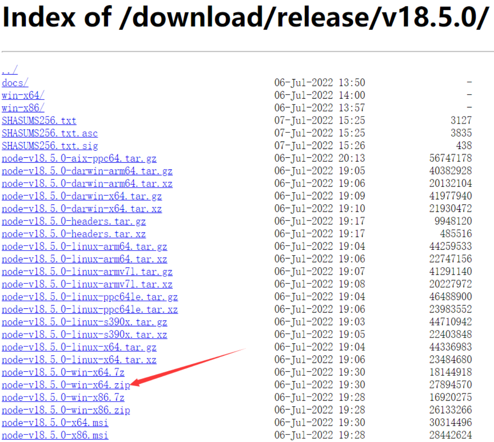

### 2.解压安装

解压文件到自己需要的目录下：D:\develop\node-v18.5.0-win-x64

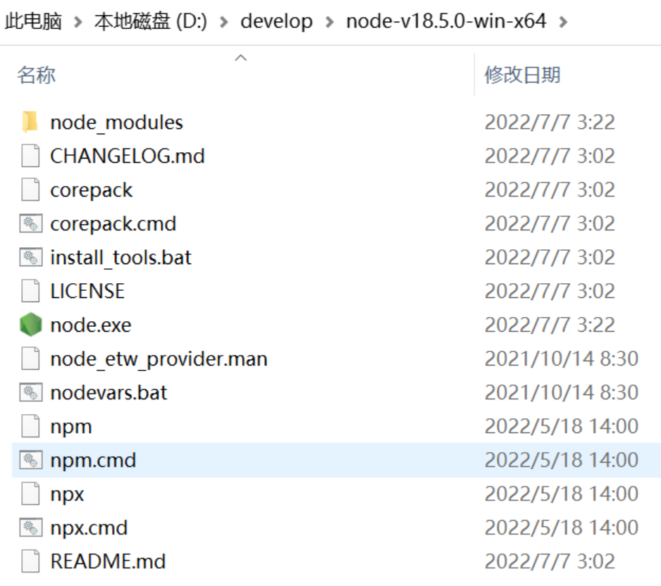

### 3.配置环境变量

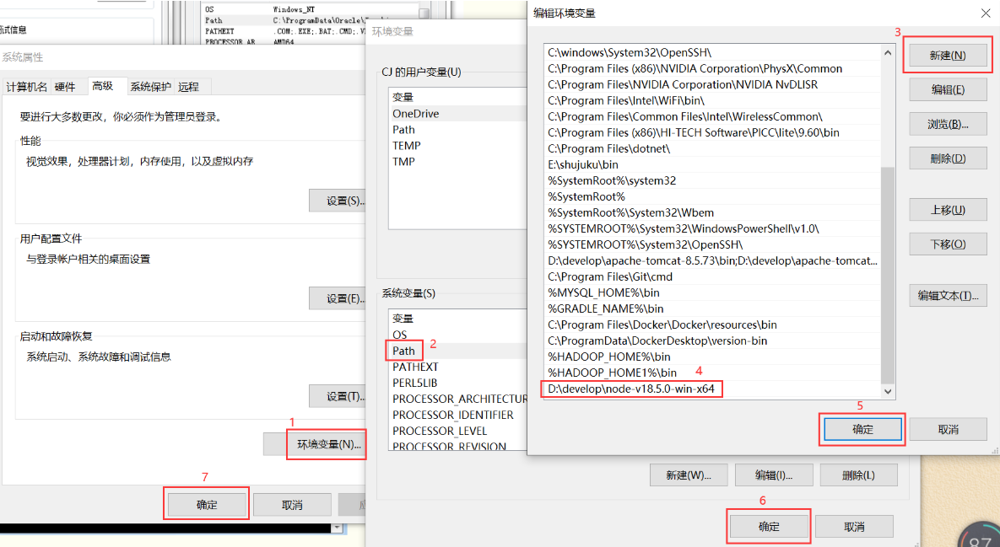

### 4.查看node与npm版本

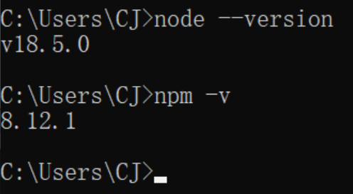

### 5.设置安装模块的位置

在D:\develop\node-v18.5.0-win-x64目录下创建node_cache文件，用于存放全局缓存，该路径下已经存在node_modules目录可用来存放全局模块，无需创建新的文件夹，默认已经内置了npm

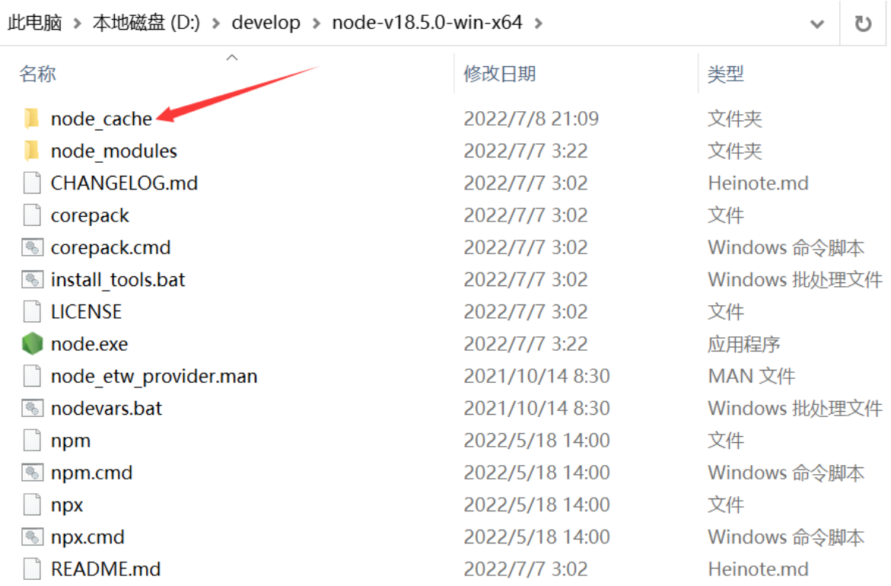

配置cache与prefix

```
npm config set cache "D:\develop\node-v18.5.0-win-x64\node_cache"
npm config set prefix "D:\develop\node-v18.5.0-win-x64"
	--nodejs会自动寻找该路径下的node_modules文件夹为实际存放全局模块的路径，这也是为啥叫prefix不叫global的原因；以后安装的全局模块都会被放到D:\develop\node-v18.5.0-win-x64\node_modules下，跟npm模块在一个文件夹中
```

查看配置结果

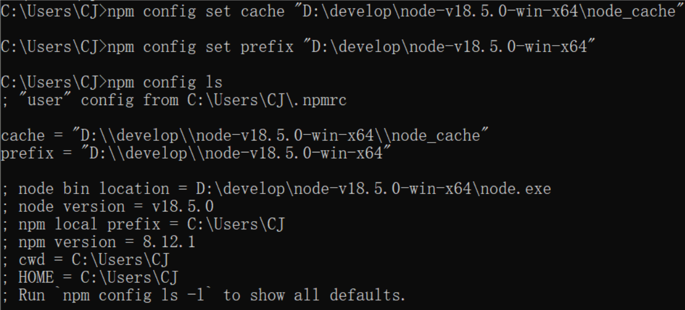

### 6.配置国内镜像地址

由于npm访问时，使用的是国外地址，访问下载就会很慢，导致下载失败，国内阿里提供了一个镜像地址，可以使用国内地址

```
npm config set registry http://registry.npm.taobao.org -- 使用淘宝的镜像网址
```

------

到此处node.js就已经安装完成

## 快速搭建docsify

### 1.全局安装docsify

使用npm安装docsfiy-cli脚手架

```
npm i docsify-cli -g 
```

安装后如图所示

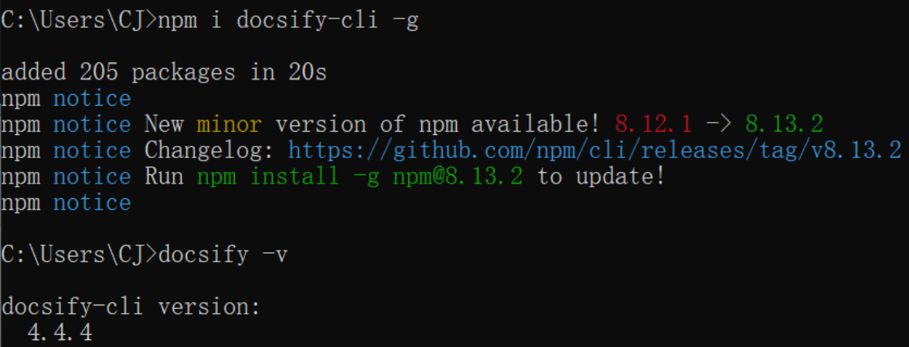

### 2.查看版本

```
docsify -v
```

### 3.初始化项目

进入自己想要放置的目录

```
cd E:\Docsify_Project
```

初始化项目：**docsify init ./项目名**

```
docsify init ./first
```

初始化结果

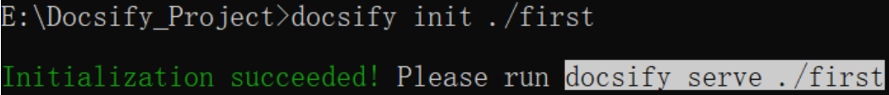

初始化目录

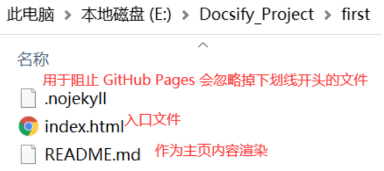

### 4.运行项目

在项目文件同一级目录，使用命令**docsify serve 项目名**启动项目

```
#不指定端口，默认端口是3000
docsify serve 项目名 
#指定端口
docsify serve 项目名 --port 端口
```

### 5.访问项目 

在浏览器输入项目地址<http://localhost:3000/>，出现界面代表已经搭建成功了!!!

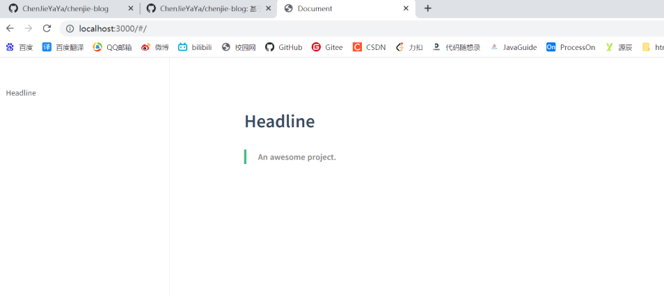

> 参考系列文章
>
> * [Nodejs安装](https://www.cnblogs.com/a876459952/p/16013863.html)
>
> * [快速搭建docsify](https://www.cnblogs.com/a876459952/p/16073262.html)

## 部署在GitHub Pages

### 1.部署前准备

* Git环境
* GitHub账号

### 2.创建仓库Repository

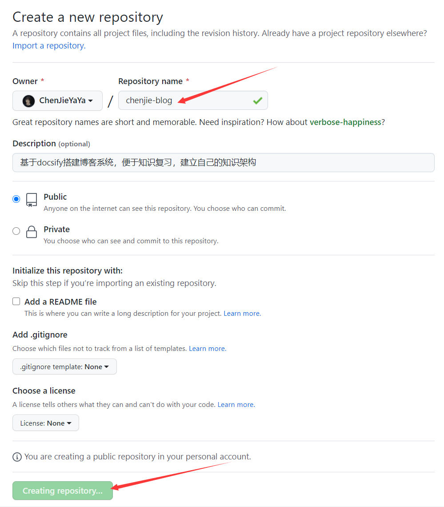

### 3.将本地仓库推送到GitHub

初始化一个仓库：`git init`

```git
$ git init
Initialized empty Git repository in E:/Docsify_Project/chenjie-blog/.git/

CJ@DESKTOP-JB5EHNO MINGW64 /e/Docsify_Project/chenjie-blog (master)
```

添加所有文件到暂存区，也就是交给由git管理着：`git add -A`

```git
$ git add -A	//正常添加

CJ@DESKTOP-JB5EHNO MINGW64 /e/Docsify_Project/chenjie-blog (master)
```

```
$ git add -A	//问题添加，报错如下
warning: LF will be replaced by CRLF in README.md.
The file will have its original line endings in your working directory
warning: LF will be replaced by CRLF in index.html.
The file will have its original line endings in your working directory

CJ@DESKTOP-JB5EHNO MINGW64 /e/Docsify_Project/chenjie-blog (master)
$ git config --global core.autocrlf false	//解决

CJ@DESKTOP-JB5EHNO MINGW64 /e/Docsify_Project/chenjie-blog (master)
$ git add -A

CJ@DESKTOP-JB5EHNO MINGW64 /e/Docsify_Project/chenjie-blog (master)
```

提交到git仓库，-m后面是注释：`git commit -m "myblogs first commit"`

```
$ git commit -m "myblogs first commit"	//正常提交
[master (root-commit) a9198e1] myblogs first commit
 3 files changed, 25 insertions(+)
 create mode 100644 .nojekyll
 create mode 100644 README.md
 create mode 100644 index.html

CJ@DESKTOP-JB5EHNO MINGW64 /e/Docsify_Project/chenjie-blog (master)
```

```
$ git commit -m "myblogs first commit"	//问题提交，报错如下
Author identity unknown

*** Please tell me who you are.

Run

  git config --global user.email "you@example.com"
  git config --global user.name "Your Name"

to set your account's default identity.
Omit --global to set the identity only in this repository.

fatal: unable to auto-detect email address (got 'CJ@DESKTOP-JB5EHNO.(none)')

CJ@DESKTOP-JB5EHNO MINGW64 /e/Docsify_Project/chenjie-blog (master)
$ git config --global user.email "1243833281@qq.com"	//解决

CJ@DESKTOP-JB5EHNO MINGW64 /e/Docsify_Project/chenjie-blog (master)
$  git config --global user.name "ChenJieYaYa"	//解决

CJ@DESKTOP-JB5EHNO MINGW64 /e/Docsify_Project/chenjie-blog (master)
```

远程连接GitHub

```
$ git remote add origin https://github.com/ChenJieYaYa/chenjie-blog.git

CJ@DESKTOP-JB5EHNO MINGW64 /e/Docsify_Project/chenjie-blog (master)
```

推送到远程仓库，中途有弹窗，按提示操作即可

```
$ git push -u origin master
Enumerating objects: 5, done.
Counting objects: 100% (5/5), done.
Delta compression using up to 8 threads
Compressing objects: 100% (3/3), done.
Writing objects: 100% (5/5), 687 bytes | 687.00 KiB/s, done.
Total 5 (delta 0), reused 0 (delta 0), pack-reused 0
To https://github.com/ChenJieYaYa/chenjie-blog.git
 * [new branch]      master -> master
Branch 'master' set up to track remote branch 'master' from 'origin'.
```

刷新GitHub后如图

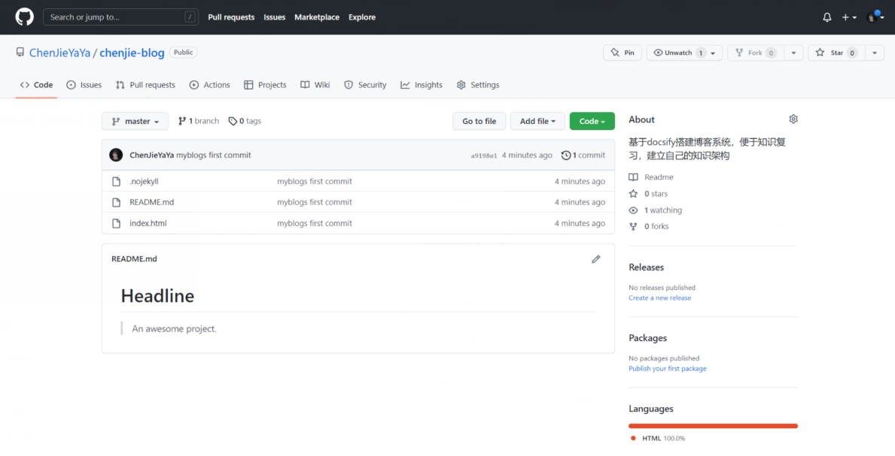

### 4.Github Pages建立站点

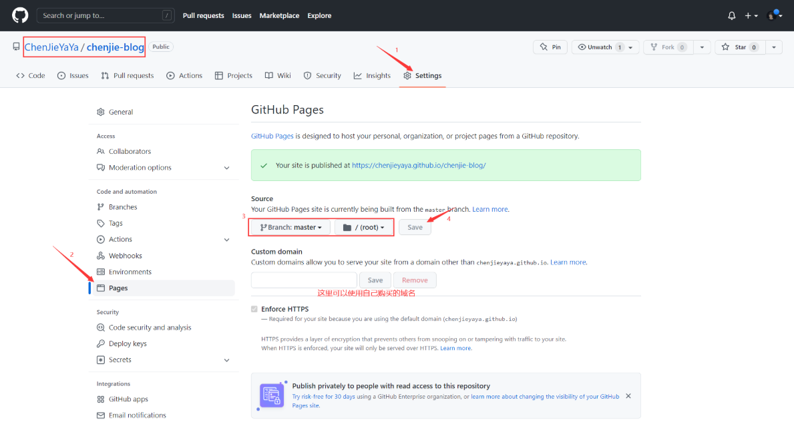

使用上图提示的网址访问可以看到页面

------

> 到此处个人博客网站就搭建完毕！！值得注意的是GitHub反应实在有点慢，要有耐心，多多刷新

## 第二次提交GitHub

上一步是第一次提交到GitHub，第二次提交当然没有那么复杂，其实也就是省略第一步初始化操作

查看哪些文件发生了变化：`git status`

```git
$ git status
On branch master
Your branch is up to date with 'origin/master'.

Changes not staged for commit:
  (use "git add <file>..." to update what will be committed)
  (use "git restore <file>..." to discard changes in working directory)
        modified:   README.md
        modified:   index.html

Untracked files:
  (use "git add <file>..." to include in what will be committed)
        1.Docsify/
        _media.css
        iconfont.css

no changes added to commit (use "git add" and/or "git commit -a")

CJ@DESKTOP-JB5EHNO MINGW64 /e/Docsify_Project/chenjie-blog (master)
```

将所有变更文件添加进来：`git add .`

```
$ git add .

CJ@DESKTOP-JB5EHNO MINGW64 /e/Docsify_Project/chenjie-blog (master)
```

再次查看文件状态，发现此时文件都变成new file：`git status`

```
$ git status
On branch master
Your branch is up to date with 'origin/master'.

Changes to be committed:
  (use "git restore --staged <file>..." to unstage)
        new file:   "1.Docsify/1.\346\220\255\345\273\272Docsify\345\210\260GitHub.md"
        modified:   README.md
        new file:   _media.css
        new file:   iconfont.css
        modified:   index.html


CJ@DESKTOP-JB5EHNO MINGW64 /e/Docsify_Project/chenjie-blog (master)
```

提交到git仓库：`git commit -m "css+前言+docsify"`

```
$ git commit -m "css+前言+docsify"
[master 56e7f47] css+前言+docsify
 5 files changed, 613 insertions(+)
 create mode 100644 "1.Docsify/1.\346\220\255\345\273\272Docsify\345\210\260GitHub.md"
 create mode 100644 _media.css
 create mode 100644 iconfont.css

CJ@DESKTOP-JB5EHNO MINGW64 /e/Docsify_Project/chenjie-blog (master)
```

推送到远程仓库，不报错的化到此不就可以了

```git
git push -u origin master
```

推送过程中报错，真个是解决一个又来一个，服气

```
$  git push -u origin master	//报错1如下，连接失败
fatal: unable to access 'https://github.com/ChenJieYaYa/chenjie-blog.git/': Failed to connect to github.com port 443 after 21071 ms: Timed out

CJ@DESKTOP-JB5EHNO MINGW64 /e/Docsify_Project/chenjie-blog (master)
$ git config --global url."git://".insteadOf http://	//解决1

CJ@DESKTOP-JB5EHNO MINGW64 /e/Docsify_Project/chenjie-blog (master)
$ git config --global url."git://".insteadOf https://	//解决1

CJ@DESKTOP-JB5EHNO MINGW64 /e/Docsify_Project/chenjie-blog (master)
$ git push -u origin master	//再次尝试，因为之前在hosts中配置过github.com的DNS，报错如下
fatal: unable to connect to github.com:
github.com[0: 20.205.243.166]: errno=Unknown error
CJ@DESKTOP-JB5EHNO MINGW64 /e/Docsify_Project/chenjie-blog (master)
```

之后通过大量百度与探索，通过[网站](https://ping.chinaz.com/nodeload.github.com)寻找IP，发现20.205.243.166的ping请求超时，所以换了一个不超时的IP重新尝试

> 1.https://ping.chinaz.com/nodeload.github.com寻找不超时的IP
> 2.修改hosts中140.82.121.4 github.com
> 3.命令提示符执行ipconfig/flushdns，刷新CDN
> 4.命令行提示符输入ping github.com，ping成功

```
$ git push -u origin master	//修改hosts后再次尝试，发现还是报错
fatal: unable to connect to github.com:
github.com[0: 140.82.121.4]: errno=Unknown error
```

又经过大量探索，其间输入大量命令，大量重试，统统失败，同一个错误errno=Unknown error，输入的命令记不清了，大致如下

> 1.git config --global http.proxy http://127.0.0.1:1080
>
> 2.git config --global https.proxy http://127.0.0.1:1080
>
> 3.git config --global url.https://github.com.cnpmjs.org/.insteadof https://github.com/

最终也没有找到解决办法，直接修改git配置文件，将多余配置都删除后成功！！！！

```
$ git config --global -l	//查看配置，发现第三行以下的配置都是为了改错新加的
user.email=1243833281@qq.com
user.name=ChenJieYaYa
core.autocrlf=false
url.git://.insteadof=https://
url.https://.insteadof=git://
url.“https://”.insteadof=git://
http.proxy=http://127.0.0.1:1080
https.proxy=http://127.0.0.1:1080
url.https://github.com.cnpmjs.org/.insteadof=https://github.com/

CJ@DESKTOP-JB5EHNO MINGW64 /e/Docsify_Project/chenjie-blog (master)

到C:\Users\CJ下寻找.gitconfig文件，将其多余配置删除(也有git命令方式删除)

$ git config --global -l	//查看删除后配置
user.email=1243833281@qq.com
user.name=ChenJieYaYa
core.autocrlf=false

CJ@DESKTOP-JB5EHNO MINGW64 /e/Docsify_Project/chenjie-blog (master)
$ git push -u origin master	//再次尝试，终于成功
Enumerating objects: 5, done.
Counting objects: 100% (5/5), done.
Delta compression using up to 8 threads
Compressing objects: 100% (3/3), done.
Writing objects: 100% (5/5), 702 bytes | 702.00 KiB/s, done.
Total 5 (delta 0), reused 0 (delta 0), pack-reused 0
To https://github.com/ChenJieYaYa/chenjie-blog.git
 * [new branch]      master -> master
Branch 'master' set up to track remote branch 'master' from 'origin'.

CJ@DESKTOP-JB5EHNO MINGW64 /e/Docsify_Project/chenjie-blog (master)
```

## 之后部署报错集结

### 1.部署在GitHub后发现本地图片访问失败

问题如下

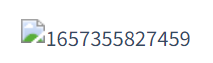

只需要改变Typora配置即可，【文件】→【偏好设置】


### 2.GitHub上修改后commit，然后本地push报错

这种需要先将GitHub上修改的内容同步到本地

```
$ git push -u origin master
To https://github.com/ChenJieYaYa/chenjie-blog.git
 ! [rejected]        master -> master (fetch first)
error: failed to push some refs to 'https://github.com/ChenJieYaYa/chenjie-blog.git'
hint: Updates were rejected because the remote contains work that you do
hint: not have locally. This is usually caused by another repository pushing
hint: to the same ref. You may want to first integrate the remote changes
hint: (e.g., 'git pull ...') before pushing again.
hint: See the 'Note about fast-forwards' in 'git push --help' for details.

CJ@DESKTOP-JB5EHNO MINGW64 /e/Docsify_Project/chenjie-blog (master)
$ git pull	//同步GitHub修改到本地
remote: Enumerating objects: 5, done.
remote: Counting objects: 100% (5/5), done.
remote: Compressing objects: 100% (3/3), done.
remote: Total 3 (delta 2), reused 0 (delta 0), pack-reused 0
Unpacking objects: 100% (3/3), 685 bytes | 68.00 KiB/s, done.
From https://github.com/ChenJieYaYa/chenjie-blog
   deb4b35..138d956  master     -> origin/master
Auto-merging index.html
CONFLICT (content): Merge conflict in index.html
Automatic merge failed; fix conflicts and then commit the result.

CJ@DESKTOP-JB5EHNO MINGW64 /e/Docsify_Project/chenjie-blog (master|MERGING)
```

发现还是报错，这是因为同步后本地有改变，请再次`git add .`

```
$ git push -u origin master
To https://github.com/ChenJieYaYa/chenjie-blog.git
 ! [rejected]        master -> master (non-fast-forward)
error: failed to push some refs to 'https://github.com/ChenJieYaYa/chenjie-blog.git'
hint: Updates were rejected because the tip of your current branch is behind
hint: its remote counterpart. Integrate the remote changes (e.g.
hint: 'git pull ...') before pushing again.
hint: See the 'Note about fast-forwards' in 'git push --help' for details.

CJ@DESKTOP-JB5EHNO MINGW64 /e/Docsify_Project/chenjie-blog (master|MERGING)
$ git status
On branch master
Your branch and 'origin/master' have diverged,
and have 1 and 1 different commits each, respectively.
  (use "git pull" to merge the remote branch into yours)

You have unmerged paths.
  (fix conflicts and run "git commit")
  (use "git merge --abort" to abort the merge)

Unmerged paths:
  (use "git add <file>..." to mark resolution)
        both modified:   index.html

no changes added to commit (use "git add" and/or "git commit -a")

CJ@DESKTOP-JB5EHNO MINGW64 /e/Docsify_Project/chenjie-blog (master|MERGING)
$ git add .

CJ@DESKTOP-JB5EHNO MINGW64 /e/Docsify_Project/chenjie-blog (master|MERGING)
$ git commit -m "pull"
[master 20d9ca6] pull

CJ@DESKTOP-JB5EHNO MINGW64 /e/Docsify_Project/chenjie-blog (master)
$ git push -u origin master
Enumerating objects: 44, done.
Counting objects: 100% (40/40), done.
Delta compression using up to 8 threads
Compressing objects: 100% (30/30), done.
Writing objects: 100% (32/32), 2.23 MiB | 2.29 MiB/s, done.
Total 32 (delta 5), reused 0 (delta 0), pack-reused 0
remote: Resolving deltas: 100% (5/5), completed with 3 local objects.
To https://github.com/ChenJieYaYa/chenjie-blog.git
   138d956..20d9ca6  master -> master
Branch 'master' set up to track remote branch 'master' from 'origin'.

CJ@DESKTOP-JB5EHNO MINGW64 /e/Docsify_Project/chenjie-blog (master)
```

**总结**：GitHub上修改后及时pull

