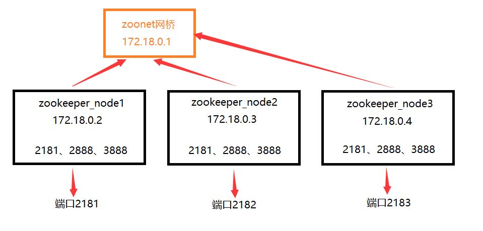

# Docker安装Zookeeper

## 一、下载Zookeeper镜像

```
docker search zookeeper//查看
docker pull zookeeper//拉取镜像
docker images//查看下载的本地镜像
docker inspect zookeeper
```

## 二、创建本地目录方便数据卷映射

```
d:
mkdir dockercontainers
cd dockercontainers
mkdir zookeeper
```

## 三、启动Zookeeper

```docker
docker run -d -e TZ="Asia/Shanghai" -p 2181:2181 -v d:\dockercontainers\zookeeper:/data --name zookeeper --restart always zookeeper

	-e TZ="Asia/Shanghai" # 指定上海时区 
	-d # 表示在一直在后台运行容器
	-p 2181:2181 # 对端口进行映射，将本地2181端口映射到容器内部的2181端口
	--name # 设置创建的容器名称
	-v # 将本地目录(文件)挂载到容器指定目录；
	--restart always #始终重新启动zookeeper
```

## 四、进入容器

两种方式

①登录容器时直接进入到zkCli中

```
docker run -it --rm --link zookeeper:zookeeper zookeeper zkCli.sh -server zookeeper
```

②只登录容器，不登录zkCli

```
docker exec -it zookeeper bash
```

# Docker安装Zookeeper集群

## 一、创建zoonet网桥

```
docker network ls
docker network create --driver bridge --subnet=172.18.0.0/16 zoonet
```

##  二、创建三个容器

### 1.图解

创建三个容器，映射到本机不同的端口，挂载到本地不同的目录，设置三个容器中运行的ZK的不同的服务id，并配置服务器集群配置，其中**2181是ZK Client连接端口、2888是选举Leader端口、3888是集群内服务通讯端口**



### 2.创建

```
docker run -d -p 2181:2181 --name zookeeper_node1 --privileged --restart always --network zoonet --ip 172.18.0.2 -v D:\dockercontainers\zkcluster\node1\volumes\data:/data -v D:\dockercontainers\zkcluster\node1\volumes\datalog:/datalog -v D:\dockercontainers\zkcluster\node1\volumes\logs:/logs -e ZOO_MY_ID=1 -e "ZOO_SERVERS=server.1=172.18.0.2:2888:3888;2181 server.2=172.18.0.3:2888:3888;2181 server.3=172.18.0.4:2888:3888;2181" zookeeper
```

```
docker run -d -p 2182:2181 --name zookeeper_node2 --privileged --restart always --network zoonet --ip 172.18.0.3 -v D:\dockercontainers\zkcluster\node2\volumes\data:/data -v D:\dockercontainers\zkcluster\node2\volumes\datalog:/datalog -v D:\dockercontainers\zkcluster\node2\volumes\logs:/logs -e ZOO_MY_ID=2 -e "ZOO_SERVERS=server.1=172.18.0.2:2888:3888;2181 server.2=172.18.0.3:2888:3888;2181 server.3=172.18.0.4:2888:3888;2181" zookeeper
```

```
docker run -d -p 2183:2181 --name zookeeper_node3 --privileged --restart always --network zoonet --ip 172.18.0.4 -v D:\dockercontainers\zkcluster\node3\volumes\data:/data -v D:\dockercontainers\zkcluster\node3\volumes\datalog:/datalog -v D:\dockercontainers\zkcluster\node3\volumes\logs:/logs -e ZOO_MY_ID=3 -e "ZOO_SERVERS=server.1=172.18.0.2:2888:3888;2181 server.2=172.18.0.3:2888:3888;2181 server.3=172.18.0.4:2888:3888;2181" zookeeper
```

## 三、测试每台主机的状态

```
docker exec -it c8bc1b9ae9ad bash
./bin/zkServer.sh status
```


