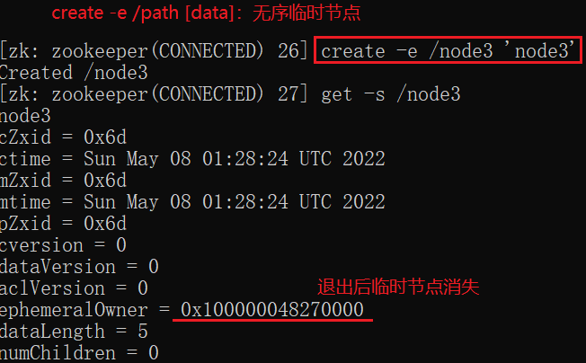
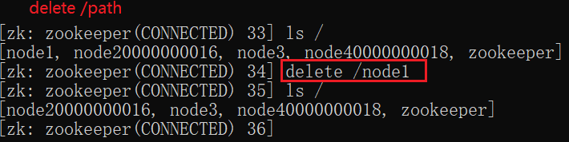

# Zookeeper常见命令

## 一、Help

## 二、Ls

## 三、Get

## 四、Create

### 1.持久节点

### 2.有序持久节点

### 3.临时节点

### 4.有序临时节点

## 五、Set

## 六、Stat

## 七、Delete

## 八、Watch

**注意监听只绑定一次**

### 1.绑定更新事件

### 2.绑定创建删除事件

## 九、ACL

### 1.ACL模式

**schema(权限模式):id(授权对象):permission(权限)**

### 2.使用权限命令

### 3.不同权限方案

## 十、Sync

- 读取数据前sync，保证在zk中读取的数据与最新数据一致