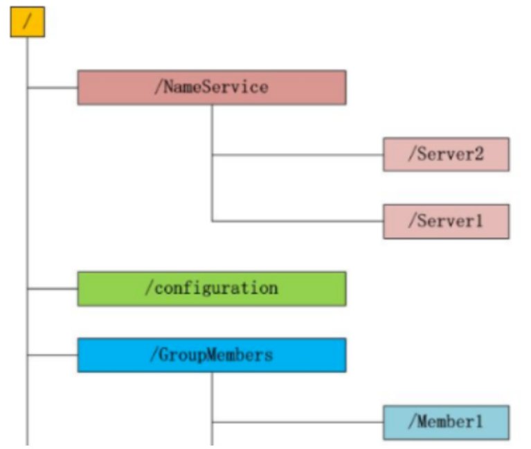
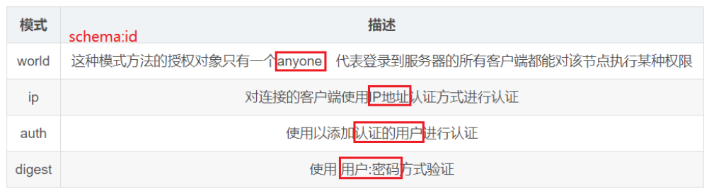
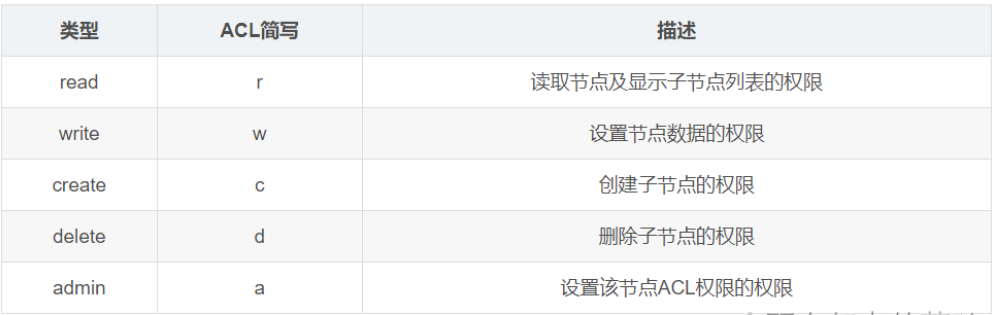

# Zookeeper概述

## 一、Zookeeper是什么？

ZooKeeper是**分布式协调服务**，为分布式应用提供**一致性服务**，解决分步式应用中遇到的**数据管理问题**，分布式应用程序可以基于Zookeeper实现**数据发布/订阅、负载均衡、命名服务、分布式协调/通知、集群管理、Master选举、分布式锁和分布式队列**等功能，包含简单的**原语集**，简单来说，**Zookeeper=文件系统+通知监听机制**

## 二、ZK文件系统

### 1.文件系统

Zookeeper为保证**高吞吐和低延迟**，在**内存**中维护一种类似文件系统的**目录树型数据结构**，**每个子目录被称为znode**，通过路径作为唯一标识；正是因为ZK存于内存，所以**znode只可以存放少量数据(KB)**



### 2.ZNode

ZNode数据节点代码如下，包含存储数据、访问权限、Stat状态(版本号-ACL变化-时间戳)、子节点引用

```java
public class DataNode implements Record {
    byte data[];                    
    Long acl;                       
    public StatPersisted stat;       
    private Set<String> children = null; 
}
```

**ZNode的数据内容以原子方式读写**，其节点类型一共有四种，**注意临时节点没有子节点**

* **PERSISTENT-持久化目录节点**：除非手动删除否则一直存在
* **PERSISTENT_SEQUENTIAL-持久化顺序编号目录节点**：除非手动删除否则一直存在，只是ZK给该节点名称进行顺序编号
* **EPHEMERAL-临时目录节点**：客户端会话失效该节点被删除，注意客户端与ZK断开连接不一定会话失效
* **EPHEMERAL_SEQUENTIAL-临时顺序编号目录节点**：客户端会话失效该节点被删除，只是ZK给该节点名称进行顺序编号

## 三、监听通知机制

### 1.监听通知机制是什么？

Zookeeper允许客户端**注册监听**其关心的目录节点，当关心的目录节点变化时Zookeeper通知客户端

### 2.监听通知机制特性

**一次性**：Watcher被触发后，ZK将其从相应的存储中移除，可减轻服务端压力

> 为什么监听是一次性的？
>
> 举个例子，若服务端变动频繁，而监听的客户端很多情况下，每次变动都要通知到所有的客户端，给网络和服务器造成很大压力，很多情况下，客户端不需要知道服务端的每一次变动，只要最新的数据即可

**轻量级**：Watcher只会通知客户端发生变化，而不会说发生什么具体变化

**最终一致**：Watcher Event异步发送到Client，那么由于网络延迟或其他因素导致客户端在不同时刻监听到事件，而ZK Client只会在监听事件后才会感知znode的变化，所以ZK不期望监控到节点每次的变化，只保证最终一致，而不是强一致

### 3.工作机制

客户端注册Watcher，服务端处理Watcher，客户端回调Watcher

> 看源码知流程

## 四、权限控制机制ACL

ACL(Access Control List)是访问控制列表，包含三方面内容**Scheme(权限模式):Id(授权对象):Permission(权限)**

### 1.Scheme:Id



### 2.Permission



## 五、Chroot特性

3.2.0 版本后添加Chroot特性，该特性允许**每个客户端为自己设置一个命名空间**，如果客户端设置Chroot，那么该客户端对服务器的任何操作都将会被限制在其自己的命名空间下，即限制在一棵子树下，适用于多应用公用同一ZK的情景，使不同应用相互隔离

## 六、会话管理

### 1.分桶策略

ZK会将类似的会话放在同一区块中管理，以便对不同区块的会话隔离处理及同一区块统一处理

### 2.分配原则

**每次会话的下次时间点(ExpirationTime)**，计算方法如下

```java
ExpirationTime_ = currentTime + sessionTimeout
ExpirationTime = (ExpirationTime_ / ExpirationInrerval + 1) * ExpirationInterval
	ExpirationInterval指Zookeeper会话超时检查时间间隔，默认tickTime
```

## 七、Zookeeper服务器

### 1.服务器角色

#### 1.1.Leader

**事务请求**的唯一调度和处理者，保证集群事务处理的顺序性；集群内部各服务的调度者

#### 1.2.Follower

处理客户端非事务请求，将事务请求转发给Leader服务器，参与事务请求Proposal的投票和Leader选举投票

> Leader选举算法采用**Zab协议**，Zab协议的核心思想是当**多数Server成功则任务成功**，若有3个server，允许1个server挂掉；若有4个server，同样允许1个server挂掉，所以3个4个可靠性相同，一般选**单数个server**

#### 1.3.Observer

在不影响集群事务处理能力的基础上，提升集群的非事务处理能力，处理客户端非事务请求，将事务请求转发给Leader服务器，不参与任何形式的投票

### 2.服务器工作状态

#### 2.1.Looking

寻找Leader状态，当服务器处于该状态会认为无Leader，此时需要选举Leader

#### 2.2.Following

跟随者状态，表明当前服务器角色是Follower

#### 2.3.Leading

领导者状态，表明当前服务器角色是Leader

#### 2.4.Observing

观察者状态，表明当前服务器角色是Observer

## 八、Zookeeper内的同步

### 1.ZK内主从节点的状态同步

Zookeeper的核心是**原子广播机制**，该机制保证各个节点之间同步，实现该机制的协议叫**Zab协议**，Zab协议有**恢复模式和广播模式**两种

* **恢复模式**：当服务启动或Leader崩溃Zab进入恢复模式，当Leader被选举出来，且大多数Server完成与Leader的状态同步时恢复模式结束，这保证Server与Leader具有相同的系统状态
* **广播模式**：当Leader与大多数Follower状态同步后进入广播模式，此时某Server加入ZK服务中时会通过恢复模式启动，即发现Leader并和Leader状态同步，同步结束后开始参与消息广播，ZK一直处于Broadcast状态，直到Leader崩溃或失去大部分Follower支持

### 2.ZK内数据同步

Leader选举完毕后，Learner(Follower和Observer的统称)向Leader注册自己，当注册完毕后进入数据同步环节，同步后进行同步确认，**数据同步过程均以消息传递的方式进行**

数据同步环节之前Leader服务器会完成数据同步初始化，即**peerLastZxid**(Learner服务器最后处理的ZXID)、**minCommittedLog**(Leader服务器Proposal缓存队列committedLog中最小ZXID)、**maxCommittedLog**(Leader服务器Proposal缓存队列committedLog中最大ZXID)

数据同步通常分为如下四种

* **直接差异化同步(DIFF同步)：**minCommittedLog < peerLastZxid < maxCommittedLog时
* **先回滚再差异化同步(TRUNC+DIFF同步)：**当新Leader发现某个Learner包含自己没有的事务记录，那么使Learner事务回滚，直到Leader上存在，同时也是最接近peerLastZxid的ZXID
* **仅回滚同步(TRUNC同步)：**peerLastZxid > maxCommittedLog时
* **全量同步(SNAP同步)：**minCommittedLog > peerLastZxid或Leader无Proposal缓存队列且peerLastZxid不等于lastProcessZxid

## 九、Zookeeper与CAP理论

### 1.什么是CAP理论

CAP分别指一致性(Consistency)、可用性(Availability)、分区容错性(Partition tolerance)，在分步式系统中，**不可能**同时满足CAP

由于网络硬件肯定会出现延迟丢包等问题，但是在分布式系统中，必须保证**部分网络通信问题不会导致整个服务器集群瘫痪**，另外**当网络故障消除时依然可以保证数据一致性**，所以必须保证分区容错性，剩下的一致性与可用性不可兼得，当保证一致性时，那么不能让用户访问无法数据同步的机器，当保证可用性时，那么能让用户访问无法数据同步的机器

所以CAP只有两种组合方式，即CP(Zookeeper某Client心跳失联后被快速剔除)、(Eureka某Client心跳失联后启动自我保护机制，而不是剔除该Client，仍然可以提供服务)

### 2.ZK是CP还是AP？

ZK的CP和AP需要从不同角度分析

对于读写请求，保证可用性，即不同阻塞等待Follower同步完成，但保证不了一致性，所以是AP

对于ZK架构，选举Leader时期整个ZK不对外提供服务，因为ZK依赖Leader保证数据一致性，所以是CP，再细一点的话此处的C是最终一致，而不是强一致

## 十、Zookeeper内的一致性

### 1.一致性分类

**强一致**：任何时刻读到最近一次更新的数据，导致可用性下降

**单调一致**：任何时刻不可能读到比已读到的值更旧的值，即可获取的数据顺序必是单调递增的

**会话一致**：在本次会话中任何时刻不可能读到比已读到的值更旧的值，会话一致是顺序一致的进一步宽松，即不同用户或同一用户不同会话间没有一致性保障

**最终一致**：用户只能读到某次更新后的值，但系统保证数据最终达到完全一致，只是时间不能保证

### 2.ZK内的一致性

**顺序一致**：读请求可被集群内任意机器处理，但写请求会被同时发送到其他ZK达成一致后才返回成功，若某客户端将某znode的值改为a，之后又改为b，则没用客户端能在b之后再看到a

> **ZK通过zxid保证顺序一致性**，zxid实际是64位数字，高32位表示epoch，当产生新Leader是epoch自增，低32位用于递增计数

**原子性**：更新同时成功或失败，若一个更新失败，则不会有客户端看到该更新结果

**单一视图**：客户端不论连接到那一台ZK，看到的都是同一视图，即滞后于故障服务器的服务器都不会接受该连接请求，除非这些服务器赶上故障服务器

**持久性**：一旦更新成功其结果永久有效且不会撤销，即更新不会受到服务器故障的影响

**最终一致**


