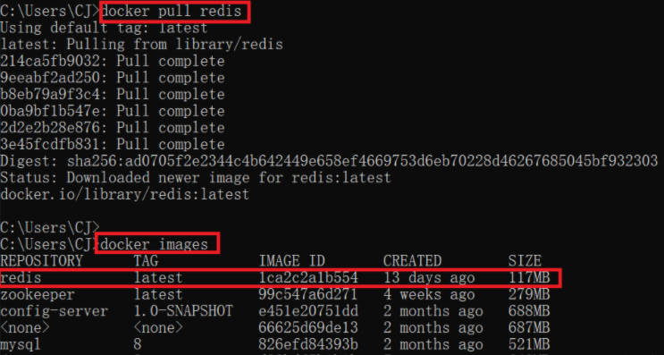
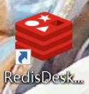
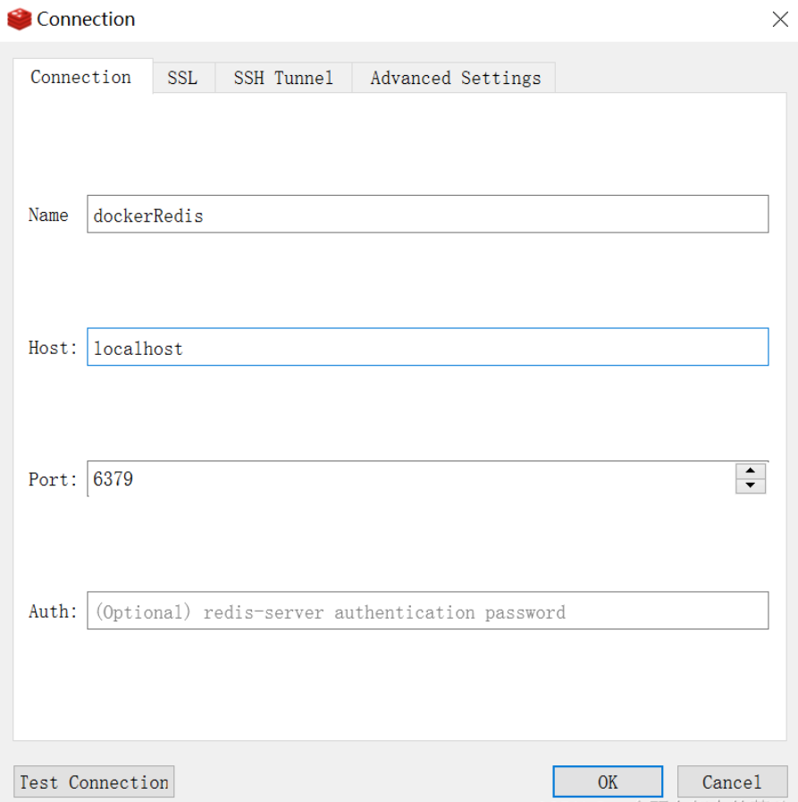

# Docker安装Redis

## 一、下载Redis镜像



## 二、创建本地目录方便数据卷映射

### 1.创建目录结构如下


### 2.下载redis.conf并修改配置

基本配置

```
#bind 127.0.0.1  #注释掉，使redis可以被外部访问
#requirepass a  #给redis设置密码a
logfile/data/redis.log  #指定日志文件
protected-mode no  #关闭保护模式
```

RDB数据文件基本配置

```
#设置RDB文件名与文件路径
dbfilename dump.rdb  #默认
dir /data #./改成/data

#设置快照间隔，可根据实际请求压力调整
save 3600 1    #3600s内有1条key变化就快照，压力小
save 300 100   #300s内有10条key变化就快照
save 60 10000  #60s内有10000条key变化就快照，压力大
#redis是内存库，但内存就怕关机，所以要及时将数据持久化到磁盘

rdbcompression yes  #备份文件压缩
rdbchecksum yes  #校验码
stop-writes-on-bgsave-error yes  #持久化出错，主程序是否停止写入
```

AOF日志文件基本配置

```
appendonly yes  #AOF追加模式备份
dir /data  #备份文件存放位置
aof-use-rdb-preamble yes  #混合持久化方式
```

## 三、启动Redis

```docker
docker run -itd --name redis -p 6379:6379 --restart=always -v d:\dockercontainers\redis\redis.conf:/etc/redis/redis.conf -v d:\dockercontainers\redis\data:/data redis redis-server /etc/redis/redis.conf
```

## 四、进入容器

```
docker exec -it redis /bin/bash
```

## 五、下载Redis软件，测试连接






