# Redis常见命令

## 一、库命令

### 1.切换库

`select 库编号`

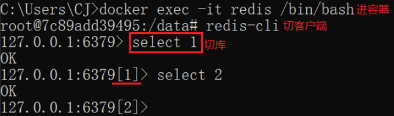

### 2.清空库

`flushdb`

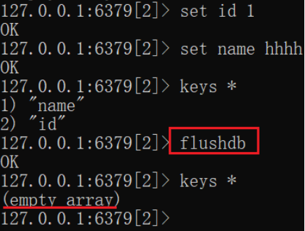

## 二、键命令

### 1.查询键

`keys 通配符`

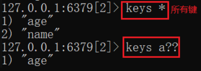

### 2.随机返回键

`randomkey`

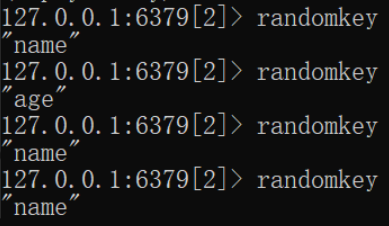

### 3.是否存在键

`exists 键`

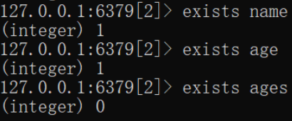

### 4.键类型

`type 键`

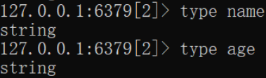

### 5.删除键

`del 键1 键2`

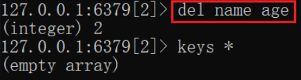

### 6.重命名键

`rename 旧键名 新键名`

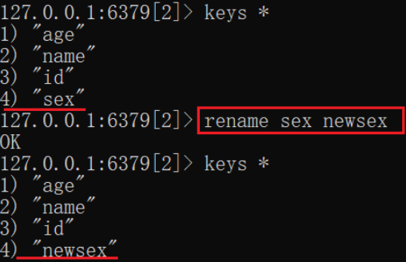

### 7.不存在的键重命名

`renamenx 旧键名 新键名`

### 8.将数据移到另一个库

`move 键 库编号`

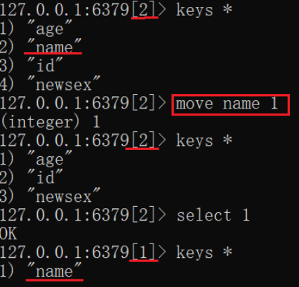

### 9.查看键有效期

`ttl 键`

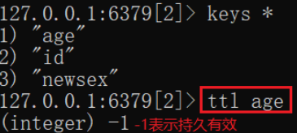

### 10.设置键过期时间

`expire 键 时间(s)`

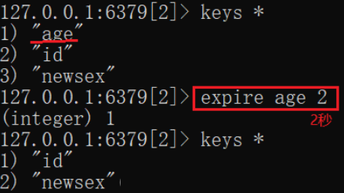

### 11.键持久化

`persist 键`

## 三、值命令

### 1.String操作

添加键值：`set 键 值 [ex 秒数]/[px 毫秒数]`

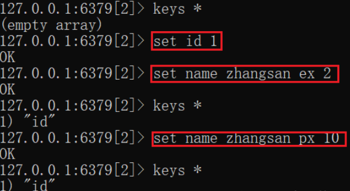

批量添加键值：`mset 键1 值1 键2 值2`

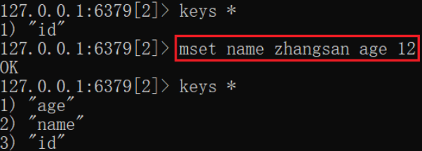

指定开始位置设置值：`setrange 键 开始索引 值`

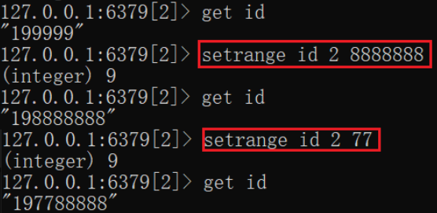

值后追加：`append 键 值`

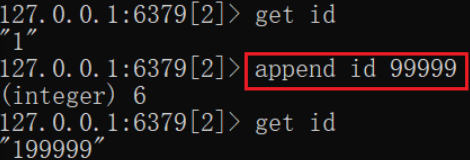

获取值：`get 键`

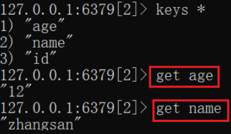

批量获取值：`mget 键1 键2`

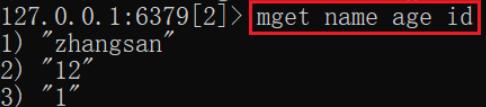

指定开始结束位置获取值：`getrange 键 开始索引 结束索引`

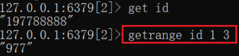

先获取再设置：`getset 旧键 新键`

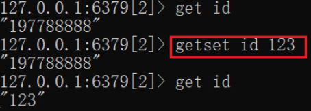

自增：`incr 键`

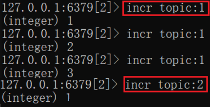

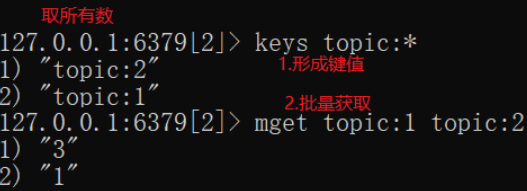

设置自增数：`incrby 键 数`

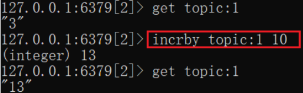

设置浮点自增数：`incrbyfloat 键 浮点数`

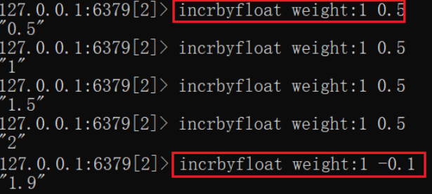

自减：`decr 键`

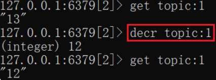

设置自减数：`decrby 键 数`

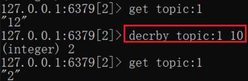

值长度：`strlen 键`

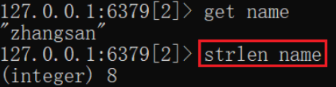

### 2.二进制位操作

`setbit 键 偏移量 值`

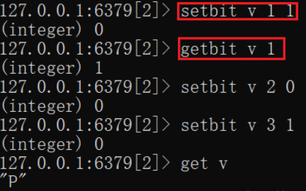

`getbit 键 偏移量`

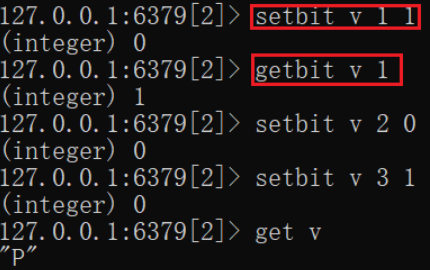

### 3.List操作

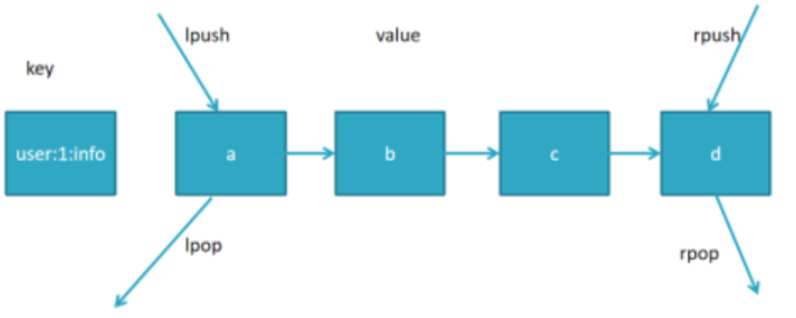

左进：`lpush 键 值`

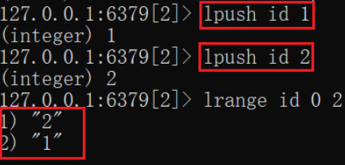

右进：`rpush 键 值`

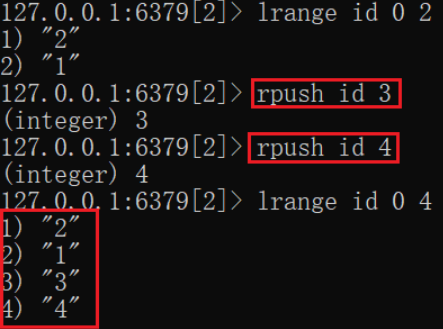

从左往右在范围内取：`lrange 键 开始索引 结束索引`

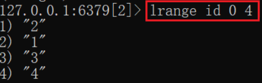

左出：`lpop 键`

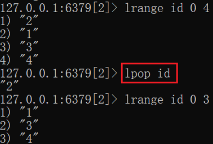

右出：`rpop 键`

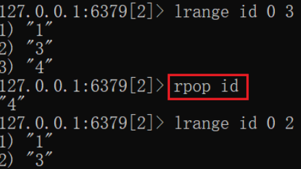

左开始删除指定数量的值：`lrem 键 数量 值`

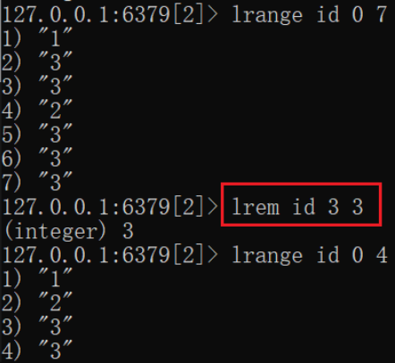

切指定范围内的值重新赋值给键：`ltrim 键 开始索引 结束索引`

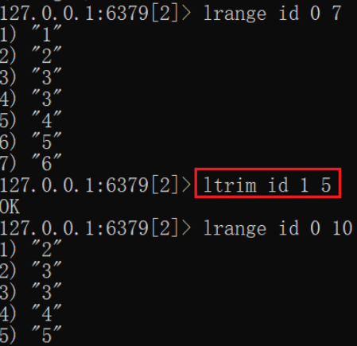

指定索引上的值：`lindex 键 index`

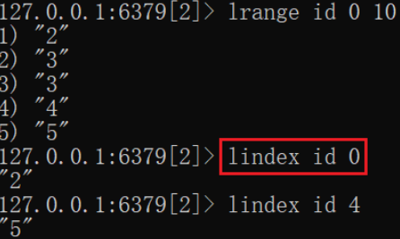

键长度：`llen 键`

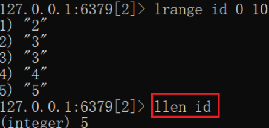

值后/前插入值：`linsert 键 after|before 值 插入值`

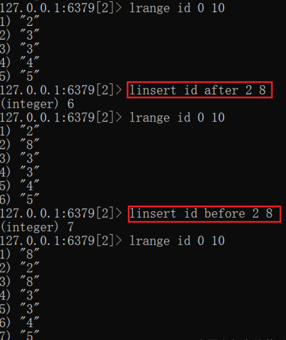

### 4.Set操作

Set无序且唯一，最多存2^32-1

添加：`asdd 键 值1 值2`

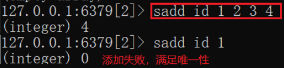

删除：`srem 值1 值2`

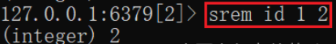

无放回随机取值(删除)：`spop 键`

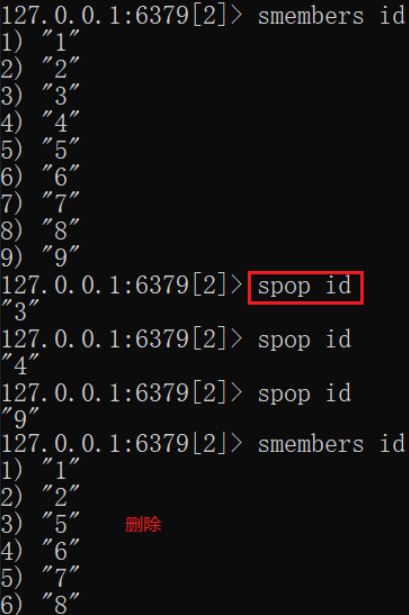

有放回随机取值(不删除)：`srandmember 键`

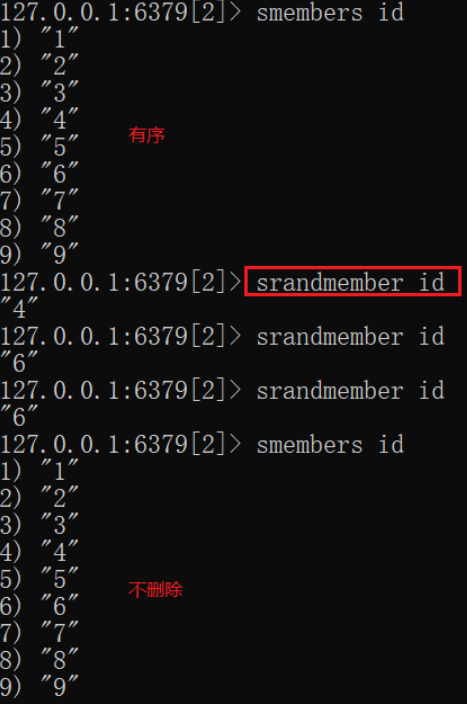

查所有：`smenbers 键`

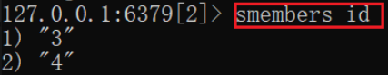

判断键中是否有对应的值：`sismember 键 值`

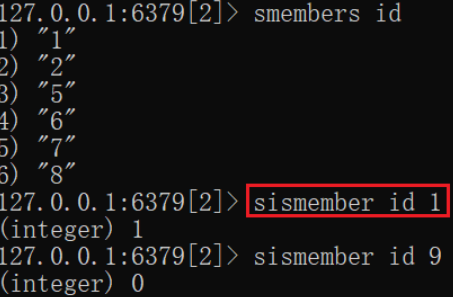

长度：`scard 键`

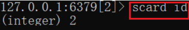

将值从键中移动到目标键：`smove 键 目标键 值`

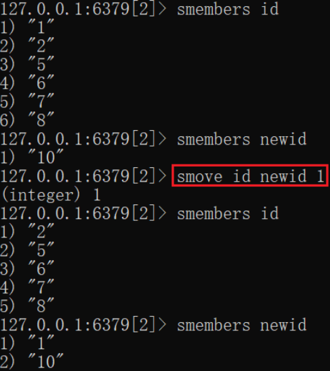

交集：`sinter 键1 键2`

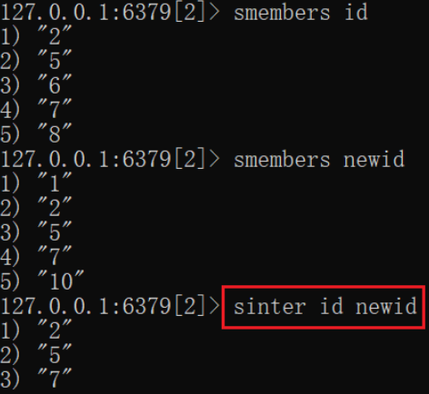

求出的交集赋值给新键：`sinterstore 新键 键1 键2`

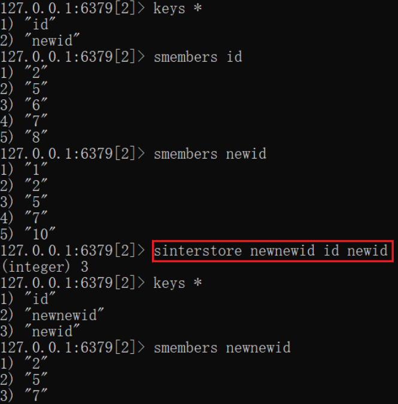

并集：`sunion 键1 键2`

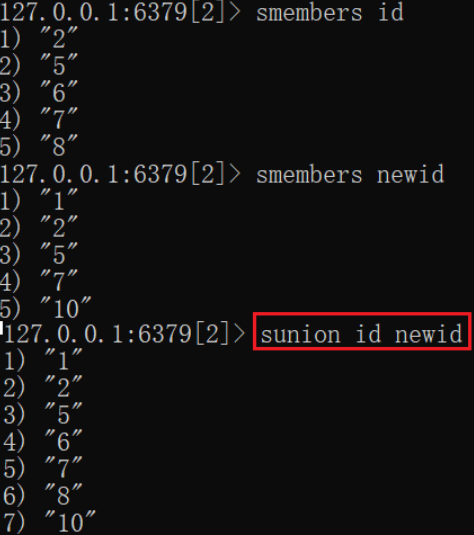

差集：`sdiff 键1 键2`

### 5.ZSet操作

ZSet有序且唯一，增加排序列

添加：`zadd 键 数1 值1 数2 值2`

根据值删除：`zrem 键 值1 值2`

根据数范围删：`zremrangebyscore 键 最小值 最大值`

根据索引范围删：`zremrangebyrank 键 开始索引 结束索引`

查询对应键内值的索引：`zrank 键 值`

反向查询对应键内值的索引：`zrevrank 键 值`

查询范围内值[和数]：`zrange 键 开始索引 结束索引 [withscores]`

反向查询范围内值：`zrevrange 键 开始索引 结束索引`

长度：`zcard 键`

同级范围内值个数：`zcount 键 最小值 最大值`

### 6.Hash操作

添加：`hset 键 属性 值`

批量添加：`hmset 键 属性1 值1 属性2 值2`

获取值：`hget 键 属性`

批量获取值：`hmget 键 属性1 属性2`

获取所有值：`hgetall 键`

删除：`hdel 键 属性`

存在：`hexists 键 属性`

递增：`hincrby 键 属性 值`

浮点递增：`hincrbyfloat 键 属性 值`

获取所有键：`hkeys 键`

获取所有值：`hvals 键`

