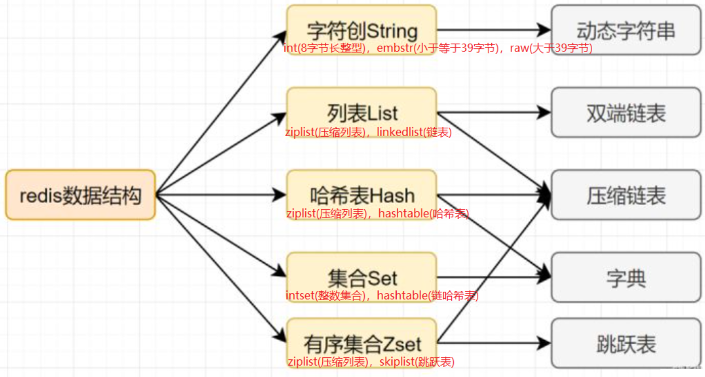
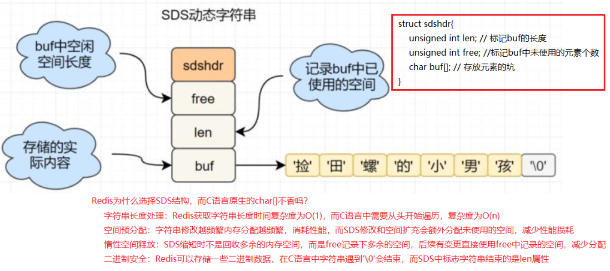
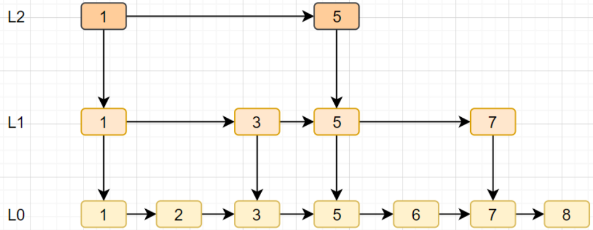
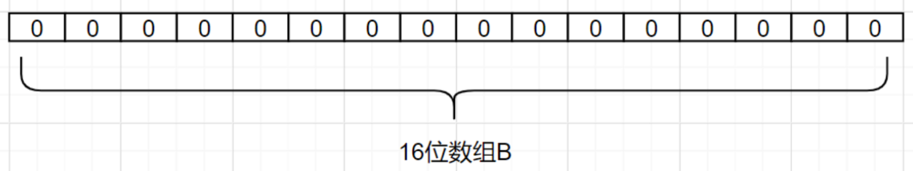
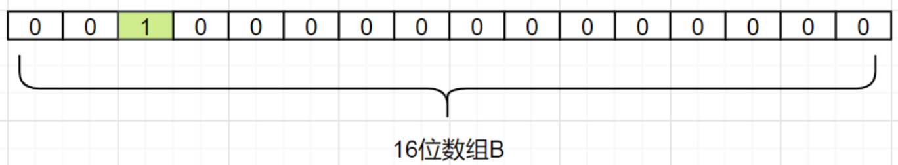
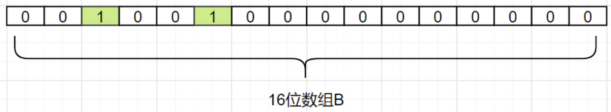
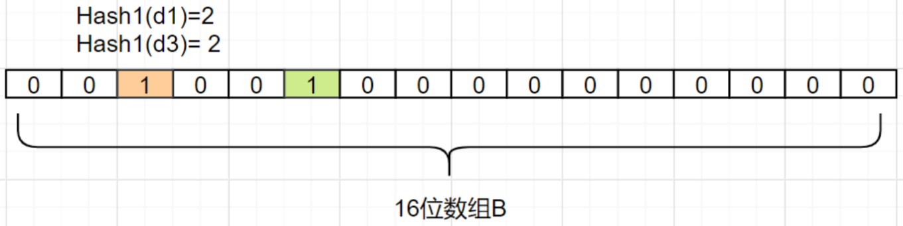
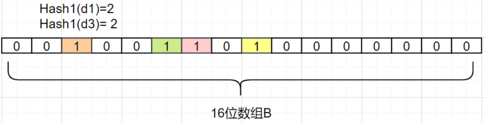

# Redis概述

## 一、Redis简单介绍

### 1.Redis是什么?

Redis是高性能、K-V、**非关系型**、**缓存**数据库，C语言编写

* 基于内存、同时支持缓存

Redis的操作是**原子操作**

### 2.Redis的版本介绍

* 版本号第二位为**奇数**是**非稳定版**

- 版本号第二位为**偶数**是**稳定版**

### 3.Redis支持的数据类型及特性

**String**：支持字符串、整性、浮点型、二进制操作，可自增自减

* 适用于存共享Session、分布式锁、计数器、限流

**List**：列表，可模拟堆栈等数据结构

* 适用于存粉丝列表、点赞列表、评论列表

**Set**：无序且唯一

* 适用于存用户标签、随机抽奖等去重场景

**ZSet**：有序且唯一

* 适用于存排行榜、寻找Top

**Hash**：K-V

* 适用于存用户信息

## 二、Redis为什么快？

### 1.基于内存

Redis基于内存，目的是**减少磁盘IO**

### 2.单线程

Redis基于内存，所以CPU并不是Redis的性能瓶颈，**内存大小和网络IO(网络带宽)**才是，且单线程容易实现，所以采取单线程，有效避免多线程下加锁带来的开销与系列问题，如死锁、上下文切换等

Redis6.0后采取多线程，但也不是完全摒弃单线程，处理客户端读写与协议解析通过多线程处理，执行客户端命令还是单线程，使用多线程可以提升IO读写效率

### 3.IO多路复用

多路指多个Client连接Redis，复用指单线程处理请求，**有效提高系统吞吐量**

多路复用主要有select、poll、epoll等三种技术，过程大概是将Client请求放入队列中，Redis循环从队列中取出请求处理

### 4.虚拟内存

将冷数据存于磁盘，为热数据腾出更多空间，通过虚拟内存可实现**冷热数据分离**，避免因内存不足而造成访问速度下降

### 5.高效的数据结构

Redis支持的各种数据类型的底层数据结构如下图

**动态字符串**内部存储使用SDS封装，SDS结构如下图

**字典**实际就是哈希表，通过Key快速找到Value，时间复杂度O(1)

**跳跃表**实际就是在链表基础上多加几级索引，提升查找效率

### 6.合适的数据编码

**String**：数字用int，非数字小于等于39字节字符串使用embstr，大于39个字节使用raw

**List**：列表元素个数小于512，且列表每个元素的值都小于64字节(默认)，使用ziplist编码，否则使用linkedlist编码

**Hash**：哈希类型元素个数小于512个，且每个值小于64字节，使用ziplist编码，否则使用hashtable编码

**Set**：集合元素都是整数,且元素个数小于512个，使用intset编码，否则使用hashtable编码

**ZSet**：有序集合的元素个数小于128，且每个元素的值小于64字节，使用ziplist编码，否则使用skiplist

## 三、缓存穿透、缓存雪崩、缓存击穿

### 1.缓存穿透

常见缓存方式是当请求发来时，先经过缓存，在缓存中查，当缓存未命中则去数据库查，数据库有则将值更新到缓存后再返回

缓存穿透指查不存在的值时，每次都需要查数据库，给数据库带来压力，即**请求穿透到数据库**

缓存穿透一般发生于业务设计不合理、运维或开发人员事务、黑客恶意攻击等场景

缓存穿透可直接在API处对参数进行校验，过滤非法请求的方式避免，也可通过**布隆过滤器**避免

### 2.缓存雪崩

缓存雪崩指大量数据到达过期时间，且查询量巨大，给数据库带来压力

缓存雪崩可通过均匀设置过期时间，使过期时间相对离散有效解决，如较大固定值+较小的随机值(5h+0-1800s)，Redis宕机使整个Redis不可用也会导致缓存雪崩，可通过构造Redis高可用集群解决

### 3.缓存击穿

缓存击穿指热点Key到达过期时间，恰好此时对该热点Key发来大量请求，给数据库带来压力

缓存击穿可通过互斥锁或永不过期(异步更新过期时间)解决

## 四、布隆过滤器

### 1.什么是布隆过滤器？

布隆过滤器是一种占极小空间的数据结构，由一个超长二进制数组和多个Hash函数组成，用于检索数据是否存在，其占空间小且查询时间短，但存在误识别的情况(Hash冲突)且删除困难

### 2.布隆过滤器的原理

假设集合A中有n个元素，利用k个哈希散列函数，将A中的每个元素映射到一个长度为a位的数组B中的不同位置上，这些位置上的二进制数均设置为1

如果待检查的元素经过这k个哈希散列函数的映射后，发现其k个位置上的二进制数全部为1，这个元素很可能属于集合A，反之一定不属于集合A

### 3.布隆过滤器的实现过程

假设集合A有3个元素，分别为{d1,d2,d3}，有1个哈希函数为Hash1，现在将A的每个元素映射到长度为16位数组B

映射d1，假设Hash1(d1)= 2，则数组B中下标为2的格子改成1

映射d2，假设Hash1(d2)= 5，则数组B中下标为5的格子改成1

映射d3，假设Hash1(d3)= 2，则也将数组B中下标为2的格子改成1

确认元素dn是否在集合A里，只要算出Hash1(dn)得到索引，索引对应元素是0则该元素不在集合A，如果索引下标是1也只能表示该元素**可能**是A中的某一个元素，因为d1和d3得到的下标值都可能是1，所以布隆过滤器是存在Hash碰撞导致假阳性，判断存在误差的缺点

如何减少这种误差？**多搞几个哈希函数映射**，降低哈希碰撞的概率；同时**增加二进制数组的bit长度**，可以增大Hash函数生成的数据的范围，也可以降低哈希碰撞的概率

又增加一个Hash2哈希映射函数，假设Hash2(d1)=6，Hash2(d3)=8，使d1和d3不冲突

布隆过滤器并没有存放完整的数据，只是运用一系列哈希映射函数计算出位置，然后填充二进制向量，**如果数量很大的话，布隆过滤器通过极少的错误率，换取了存储空间的极大节省**

## 五、热点Key问题

### 1.什么是热点Key？

热点Key顾名思义是访问频率高的Key

若热点Key的请求到服务器主机时，由于请求量特别大，可能会导致主机资源不足，甚至宕机，从而影响正常的服务

热点Key产生于秒杀，热点新闻等场景，或者请求分片集中，超过单台Redis服务器的性能

### 2.如何解决热点Key问题？

热点Key可通过**将热点Key副本分布于Redis集群，然后负载均衡请求**解决，也可通过**将热点Key本身分布于Redis集群**解决

