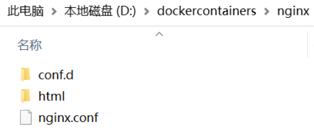

# Docker安装Nginx

## 一、下载[Nginx](https://so.csdn.net/so/search?q=Nginx&spm=1001.2101.3001.7020)镜像

```
docker pull nginx:latest
```

## 二、创建本地目录方便数据卷映射

### 1.nginx目录结构如下



### 2.conf.d目录结构如下


### 3.html目录结构如下


## 三、配置文件修改

### 1.nginx.conf修改配置

```
#user nobody; #主模块命令,指定Nginx的worker进程运行用户以及用户组，默认由nobody账号运行
worker_processes  1; #指定Nginx要开启的进程数

#error_log  logs/error.log; #定义全局错误日志文件的路径和日志名称
#error_log  logs/error.log  notice; #日志输出级别有debug，info，notice，warn，error，crit 可供选择，其中debug输出日志最为详细，面crit（严重）输出日志最少。默认是error
#error_log  logs/error.log  info;

#pid        logs/nginx.pid; #用来指定进程id的存储文件位置

#设定nginx的工作模式及连接数上限
events {
    use epoll; #其中参数use用来指定nginx的工作模式（这里是epoll,epoll是多路复用IO(I/O Multiplexing)中的一种方式,
			#nginx支持的工作模式有select ,poll,kqueue,epoll,rtsig,/dev/poll
			#其中select和poll都是标准的工作模式，kqueue和epoll是高效的工作模式，对于linux系统，epoll是首选
    worker_connections  1024; #设置nginx每个进程最大的连接数，默认是1024，所以nginx最大的连接数max_client=worker_processes * worker_connections。
}

http {
    include       mime.types; #主模块命令，对配置文件所包含文件的设定，减少主配置文件的复杂度，相当于把部分设置放在别的地方，然后在包含进来，保持主配置文件的简洁
    default_type  application/octet-stream; #默认文件类型，当文件类型未定义时候就使用这类设置的

	#指定nginx日志的格式
    #log_format  main  '$remote_addr - $remote_user [$time_local] "$request" '
    #                  '$status $body_bytes_sent "$http_referer" '
    #                  '"$http_user_agent" "$http_x_forwarded_for"';

    #access_log  logs/access.log  main;

    sendfile        on;        #开启高效文件传输模式（zero copy 方式），避免内核缓冲区数据和用户缓冲区数据之间的拷贝
    #tcp_nopush     on;        #开启TCP_NOPUSH套接字（sendfile开启时有用）

    #keepalive_timeout  0;    #客户端连接超时时间
    keepalive_timeout  65;

    #gzip  on;             #设置是否开启gzip模块
    include /etc/nginx/conf.d/*.conf;    #  ****以包含的方式加入其它配置文件
}
```

### 2.location.conf

```
#下面是server段虚拟主机的配置
server {
	listen       80;    #虚拟主机的服务端口
	server_name  127.0.0.1;     #用来指定ip或者域名，多个域名用逗号分开

	location  / {        
		#地址匹配设置，支持正则匹配，也支持条件匹配，这里是默认请求地址，用户可以location命令对nginx进行动态和静态网页过滤处理
		root   /usr/share/nginx/html;                   #虚拟主机的网页根目录
		index  index.html index.htm;   #默认访问首页文件
	}

}
```

## 四、启动Nginx

```
docker run --name nginx1 -p 81:80 -v D:\dockercontainers\nginx\nginx.conf:/etc/nginx/nginx.conf -v D:\dockercontainers\nginx\conf.d:/etc/nginx/conf.d  -v D:\dockercontainers\nginx\html:/usr/share/nginx/html -d nginx
```

> 1.网页的路径：/usr/share/nginx/html
>
> 2.配置文件：/etc/nginx/nginx.conf 
>
> 3.日志路径：/var/log/nginx
>
> ​	注意：nginx中日志访问不到，因为重定向，需要通过docker logs 容器id

## 五、进入容器

```
docker exec -it nginx1 /bin/bash
```

## 六、测试访问静态页面


## 七、命令

### 1.关闭Nginx

快速关闭Nginx，可能不保存相关信息，并迅速终止web服务：`./nginx -s stop`

平稳关闭Nginx，保存相关信息，有安排的结束web服务：`./nginx -s quit`

### 2.指定配置文件，替代缺省的

指定配置文件来代替缺省的：`./nginx -c filename`

指定配置文件位置，如果不指定，默认为NGINX_HOME/conf/nginx.conf：`./nginx -c nginx.conf的文件`

### 3.查看主进程与子进程

Docker安装ps命令：`apt-get update && apt-get install procps`


查看进程：`ps aux|grep nginx`


### 4.寻找宿主机IP

**server配置时需要知道宿主机ip地址**，发现docker提供全局变量host.docker.internal，全局变量中存了宿主机IP，但是不敢确认，为确认宿主机IP

```
ping host.docker.internal
```

又发现docker中没有装这个命令，一次性装好ip addr/ifconfig/ping命令

```
apt update && apt install -y iproute2 && apt install -y net-tools && apt install -y iputils-ping
```

装好后，在nginx中开始ping，终于找到宿主机IP

### 5.其他

重新加载配置而重载：`./nginx -s reload`

重新打开日志文件：`./nginx -s reopen`

不运行，仅仅测试配置文件，nginx将检查配置文件的语法的正确性，并尝试打开配置文件中所引用到的文件：`./nginx -t`

显示nginx的版本，编译器版本和配置参数：`./nginx -V`


