# Linux安装Nginx

## 一、安装前准备

### 1.安装gcc

gcc是linux下的编译器,它可以编译 C,C++,Ada,Object C和Java等语言

```
yum -y install gcc
```

查看版本：`gcc -v`

### 2.安装pcre、pcre-devel

pcre是一个perl库，包括perl兼容的正则表达式库，nginx的http模块使用pcre来解析正则表达式，所以需要安装pcre库

```
yum install -y pcre pcre-devel
```

### 3.安装zlib

zlib库提供了很多种压缩和解压缩方式nginx使用zlib对http包的内容进行gzip

```
yum install -y zlib zlib-devel
```

### 4.安装openssl

openssl是web安全通信的基石，没有openssl，可以说我们的信息都是在裸奔

```
yum install -y openssl openssl-devel
```

## 二、下载，解压，重命名

### 1.下载`tar.gz`包

下载地址：[http://nginx.org/en/download.html](http://nginx.org/en/download.html)

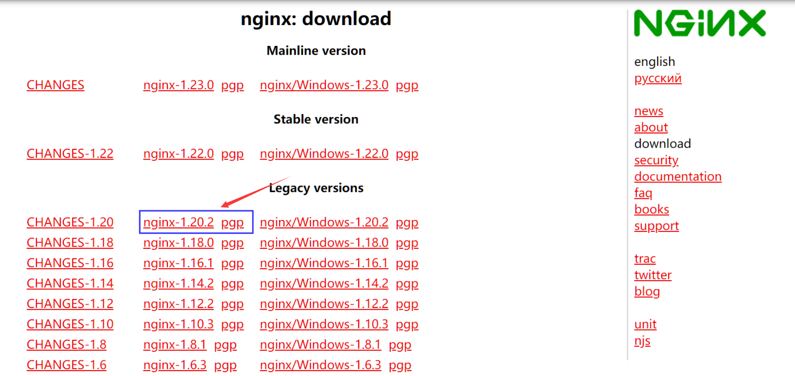

### 2.上传

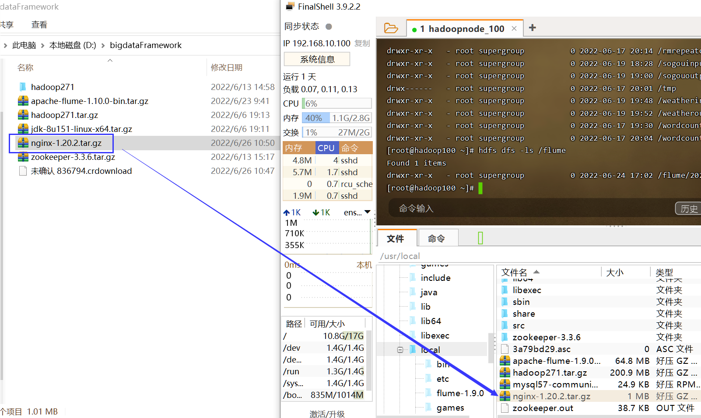

### 3.解压

```
tar -xvf nginx-1.20.2.tar.gz
```

## 三、安装Nginx

```
cd nginx-1.20.2/
./configure
make & make install
```

默认安装位置：`/usr/local/nginx`

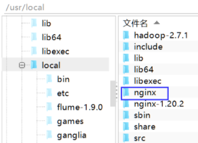

## 四、配置环境变量

```
vim /etc/profile
```


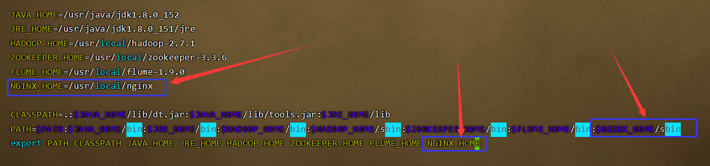


```
JAVA_HOME=/usr/java/jdk1.8.0_152
JRE_HOME=/usr/java/jdk1.8.0_151/jre
HADOOP_HOME=/usr/local/hadoop-2.7.1
ZOOKEEPER_HOME=/usr/local/zookeeper-3.3.6
FLUME_HOME=/usr/local/flume-1.9.0
NGINX_HOME=/usr/local/nginx

CLASSPATH=.:$JAVA_HOME/lib/dt.jar:$JAVA_HOME/lib/tools.jar:$JRE_HOME/lib
PATH=$PATH:$JAVA_HOME/bin:$JRE_HOME/bin:$HADOOP_HOME/bin:$HADOOP_HOME/sbin:$ZOOKEEPER_HOME/bin:$FLUME_HOME/bin:$NGINX_HOME/sbin
export PATH CLASSPATH JAVA_HOME JRE_HOME HADOOP_HOME ZOOKEEPER_HOME FLUME_HOME NGINX_HOME
```

```
source /etc/profile
```

## 五、修改nginx.conf

```
cd /usr/local/nginx/conf
vim nginx.conf
```

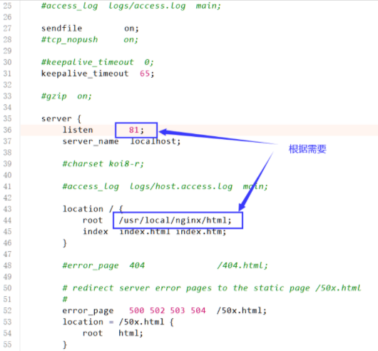

## 六、启动Nginx

### 1.启动

```
nginx
```

### 2.查看是否启动成功

```
ps -ef | grep nginx
```

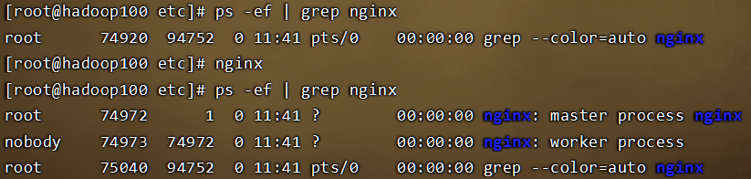

### 3.补充其他命令

停止：`nginx -s stop`

退出：`nginx -s quit`

重启：`nginx -s reload`

### 4.查看web

```
http://192.168.10.100:81/
```

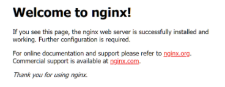

## 七、开机自启

### 1.修改配置

```
vim /etc/rc.local
追加/usr/local/nginx/sbin/nginx
```

### 2.添加权限

```
cd /etc
chmod 755 rc.local
```

### 3.重启Nginx

```
nginx -s reload
```

## 八、Nginx配置XX

修改nginx.conf配置文件

### 1.负载均衡

访问路径：http://192.168.10.100:81/yunpan/login.html

负载路径：http://192.168.10.100:8090/yunpan/login.html

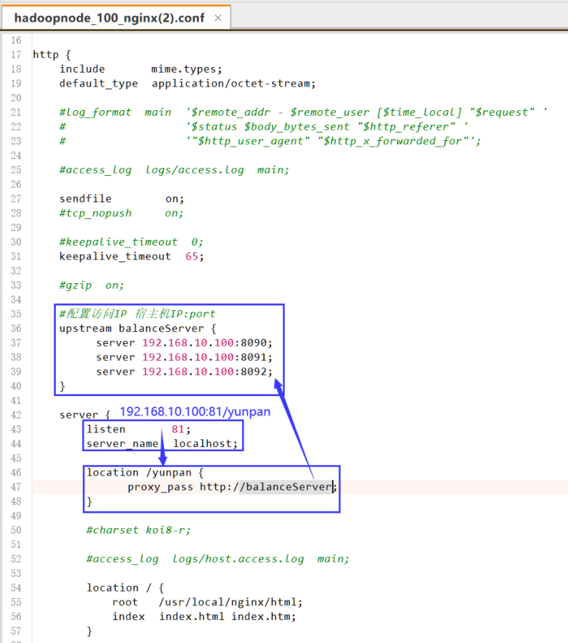

### 2.动静分离

#### 2.1.取出静态文件

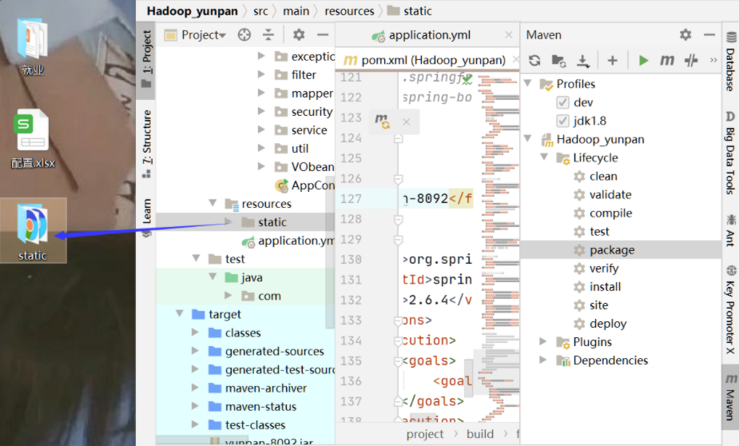

#### 2.2.移动到nginx的html

特别注意！！云盘项目中是配置了/yunpan固定访问路径的，所以需要创建yunpan文件夹存放所有的静态资源，这样访问路径就是相当于http://192.168.10.100:81/yunpan/login.html ，不要有static文件夹了，否则访问路径又多一层/static

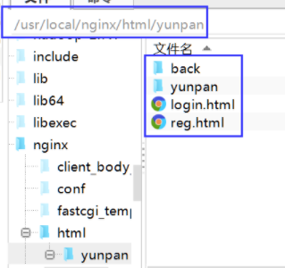

#### 2.3.配置Nginx

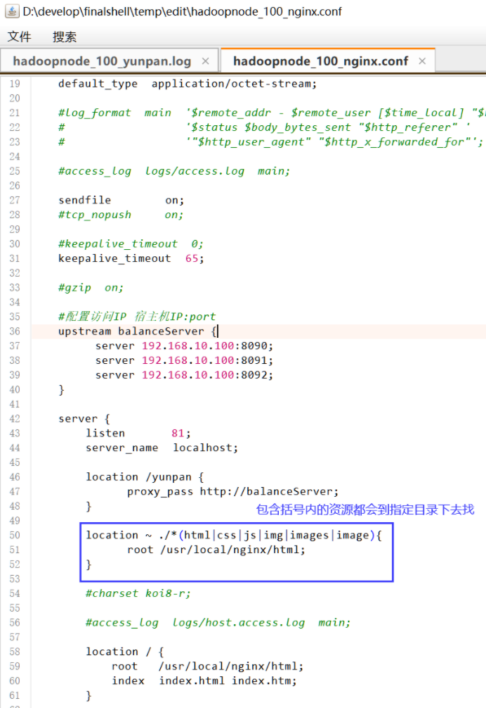


