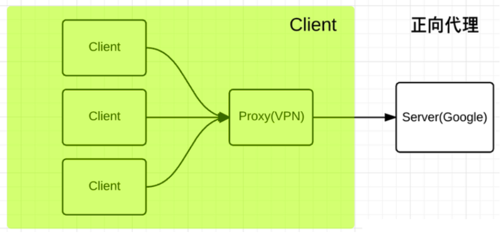
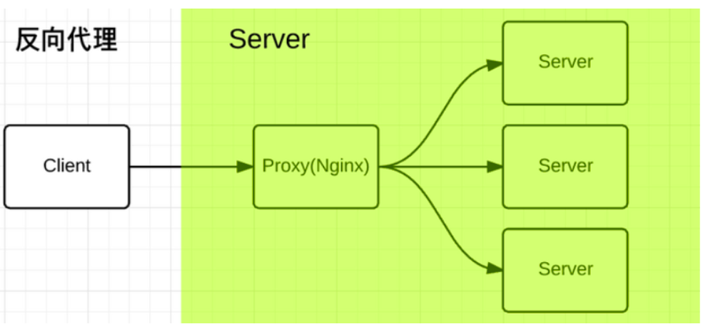
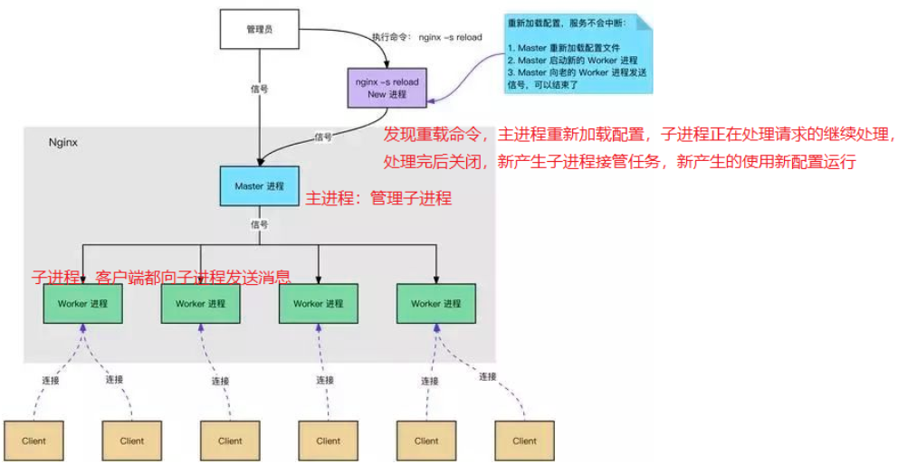
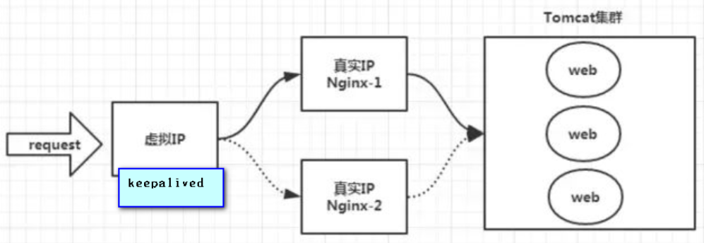
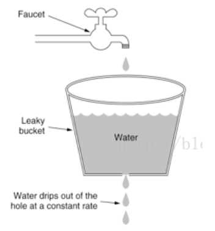
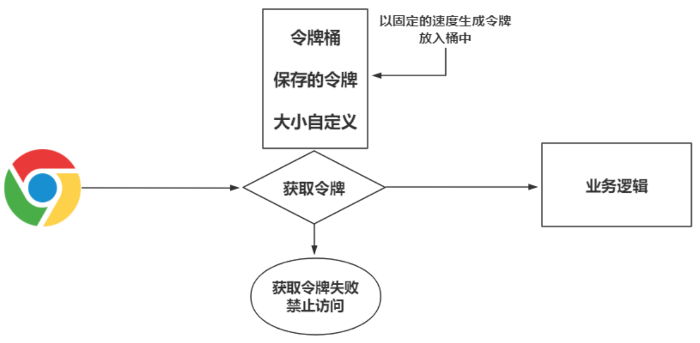

# Nginx概述

## 一、什么是Nginx？

Nginx是**高性能的HTTP、反向代理、负载均衡、C语言编写的Web服务器**

## 二、为什么使用Nginx？

Nginx安装简单，配置简洁；占内存小，并发量大(5W)；宕机概率小，稳定性高，内置健康检测功能；接收用户的请求是非阻塞异步的；轻量级，仅保留HTTP所需模块，其他模块都以插件的形式后天添加，适合二次开发

## 三、正向代理与反向代理

### 1.正向代理

### 2.反向代理

**Nginx使用的则是反向代理**，反向代理可隐藏服务端IP及其他信息，利于提高安全性

四、Nginx的Master-Worker模式

**Nginx可以在服务器不关闭的情况下刷新配置**，那如何实现呢？可以通过Zookeeper的监听机制，但是这样的话，每次使用Nginx都还好带一台Zookeeper服务器，不好，Nginx如何做？使用**Master-Worker主从架构**

## 五、Nginx实现高性能

### 1.epoll模型

epoll模型**基于事件驱动**，多路复用的一种，在[多路复用](/6.JavaWeb网络编程/多路复用)具体讲解，epoll可以**提高系统吞吐量，保证高并发下的高效处理**，因为epoll可以监控多个事件是否OK，若OK则异步放入epoll队列，worker只需从epoll队列处循环处理，epoll工作模式举例三个老师讲解

> A、B、C三个老师，他们都要帮助一个班级的学生解决课堂作业中的问题
>
> 老师A采用从第一排开始一个学生一个学生轮流解答的方式，老师A浪费了很多时间，并且有的学生作业还没有完成老师就来了，反反复复效率极慢
>
> 老师B是一个忍者，他发现老师A的方法行不通，于是他使用了影分身术，分身出好几个自己同一时间去帮好几个同学回答问题，最后还没回答完，老师B消耗光了能量累倒了
>
> 老师C比较精明，他告诉学生，谁完成了作业举手，有举手的同学他才去指导问题，他让学生主动发声，分开了“并发”

### 2.为什么Nginx性能高？

**因为Nginx采用异步非阻塞的事件处理机制及多进程机制，运用epoll模型，提供队列，排队解决问题**

> C中不存在线程的概念

## 六、Nginx实现高可用

Nginx前再加一层**Keepalived来维护心跳**

## 七、Nginx实现动静分离

Nginx对静态资源的处理能力很强，**可以缓存静态资源，无需将请求转发给Tomcat**，但对动态资源的处理能力不足，所以需要配置动静分离

静态资源放在nginx/html目录下，使用静态资源服务器；动态资源请求转发给后端，使用动态资源服务器

## 八、Nginx实现限流

限流指限制用户访问速度，防止服务器压力过大，限流分为**正常限制访问频率、突发限制访问频率、限制并发连接数**三种，基于**漏桶流算法**

## 九、漏桶流算法与令牌桶算法

### 1.漏桶流算法

漏桶流算法在网络世界需**流量整性或速率限制**时经常使用，主要目的是**使平滑网络上的突发流量被整形成稳定流量和控制数据注入到网络的速率**

漏桶流算法实际是使突发流量进入到漏桶，漏桶会按预先定义的速率依次处理请求，如果水流过大，也就是突发流量过大就会直接溢出，则多余的请求会被拒绝

### 2.令牌桶算法

令牌桶算法在网络世界需**流量整性或速率限制**时经常使用，目的是**控制数组注入到网络的数目，并允许突发数据的发送**，Google开源项目Guava中的RateLimiter使用的就是令牌桶控制算法。

令牌桶算法实际是在大小固定的令牌桶中以恒定的速率源源不断产生令牌，数据过来先获取令牌，令牌获取失败则禁止访问，如果令牌消耗速率小于生产令牌的速度，令牌就会一直产生直至装满整个令牌桶

