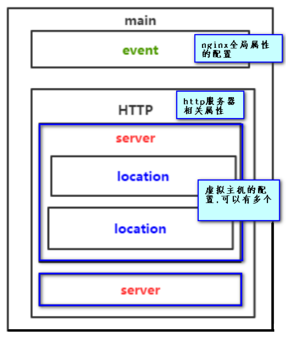
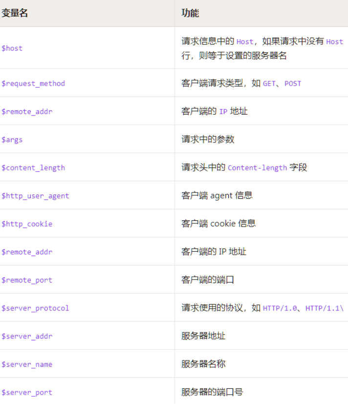

# Nginx配置

## 一、nginx.conf结构讲解



## 二、全局配置模板

```
user	#系统使用用户
worker_processes	#worker进程数，一般情况与CPU核数保持一致
error_log	#nginx的错误日志
pid		#nginx启动时的pid

events {	#事件区块开始
    worker_connections 1024;	#每个进程允许最大连接数
    use epoll;	#nginx使用的内核模型
}
```

## 三、Http配置模板

```
http { 
    #设置日志模式
    log_format  main  '$remote_addr - $remote_user [$time_local] "$request" '
                      '$status $body_bytes_sent "$http_referer" '
                      '"$http_user_agent" "$http_x_forwarded_for"';

	# Nginx访问日志存放位置
    access_log  /var/log/nginx/access.log  main;   

    sendfile on;	#开启高效传输模式
    tcp_nopush on;	#减少网络报文段的数量
    tcp_nodelay	on;
    keepalive_timeout 65;	#保持连接的时间，单位秒
    types_hash_max_size 2048;

    include	/etc/nginx/mime.types;	#文件扩展名与类型映射表
    default_type application/octet-stream;	#默认文件类型

	#加载子配置项，配置另一个配置文件的位置
    include /etc/nginx/conf.d/*.conf;	

	server { #向下看
	}
}
```

## 四、Server配置模板

```
http {
    #Http配置项目...
    
    #Server段配置信息
    server {
	     listen 80;	#配置监听的端口
	     server_name  localhost;	#配置监听的域名主机名
	      
	     #location段配置信息
	     location / {
		      root /usr/share/nginx/html;	#网站根目录
		      index index.html index.htm;	#默认首页文件
		      deny 172.168.22.11;	#禁止访问的IP地址，可以为all
		      allow 172.168.33.44;	#允许访问的IP地址，可以为all
	     }
	     
	     error_page 500 502 503 504 /50x.html;  	#5xx状态码对应的访问页面
	     error_page 400 404 error.html;
    }
    
    server{ #可以有多个server
        ... ... 
    } 
}
```

## 五、UpStream负载均衡配置

### 1.负载均衡配置

```
#服务器列表
upstream balanceServer {
    #server 宿主机IP:服务Port;
    server 192.168.10.100:8090;
    server 192.168.10.100:8091;
    server 192.168.10.100:8092;
}

server { 
	listen 80;	#虚拟机服务端口
	
	#防止域名冲突,需配置域名映射 C:\Windows\System32\drivers\etc\hosts中做域名映射：127.0.0.1 IPAddr
    server_name IPAddr;	#多个用,分开
    	
	location /api {
		proxy_pass http://balanceServer;	#负载均衡配置
	}

	#配置讲解
	#经过上述配置后，当Client发送http://IPAddr:80/api请求则被nginx拦截到
	#IPAddr:80被对应的server拦截
	#/api被server下的对应location拦截
	#localtion中的balanceServer被负载均衡后从上述3中IP:Port配置中选择一种替换
	#最终请求变成http://192.168.10.100:8090/api
}
```

### 2.负载均衡算法配置

**轮询(默认)**：按事件先后顺序，若某服务宕机，可以自动剔除

```
upstream nginx {
    server 172.17.0.4:8081;
    server 172.17.0.5:8081;
}
```

**权重Weight**：权重越大被分到的概率越高，合理有效的利用主机资源

```
upstream nginx {
    server 172.17.0.4:8081 weight=2;
    server 172.17.0.5:8081 weight=1;
}
```

**ip_hash**：同IP访问固定服务，**解决动态页面中Session共享问题**

```
upstream nginx {
    ip_hash;
    server 172.17.0.4:8081;
    server 172.17.0.5:8081;
}
```

**fair(第三方插件)**：可根据页面大小或加载时间长短智能的负载均衡

```
upstream nginx {
    server 172.17.0.4:8081;
    server 172.17.0.5:8081;
    fair;
}
```

**url_hash(第三方插件)**：同URL访问固定服务，进一步提高后端缓存服务器的效率

```
upstream backserver { 
    server squid1:3128; 
    server squid2:3128; 
    hash $request_uri; 
    hash_method crc32; 
} 
```

## 六、epoll高性能配置

nginx支持的工作模式有select、poll、kqueue、epoll、rtsig、dev/poll，其中select和poll是标准工作模式，kqueue和epoll是高效工作模式

**对于Linux系统，epoll是首选**

```
events {
	use epoll;
}
```

## 七、高可用配置

设置超时时间，一旦超过该时间直接负载均衡到下一台服务器

```
server { 
	listen 80;
    server_name IPAddr;
    	
	location /api {
		proxy_pass http://balanceServer;	#负载均衡配置
		
		proxy_connect_timeout 1s;	#后端服务器连接的超时时间，发起握手等候响应超时时间
		proxy_send_timeout 1s;	#nginx发给上游服务器(真实访问的服务器)超时时间
		proxy_read_timeout 1s;	#nginx接受上游服务器(真实访问的服务器)超时时间
		
		index  index.html index.htm;
	}
}
```

## 八、动静分离配置

静态页面放入html目录下，html目录下的文件路径就是静态页面的访问路径，配置**location拦截静态页面请求转发**

```
location ~ ./*(html|css|js|img|image|images){
	root /usr/local/nginx/html;
}
```

## 九、常用的内置全局变量



## 十、以上配置完后需要重启

```
nginx -s reload
```


# 