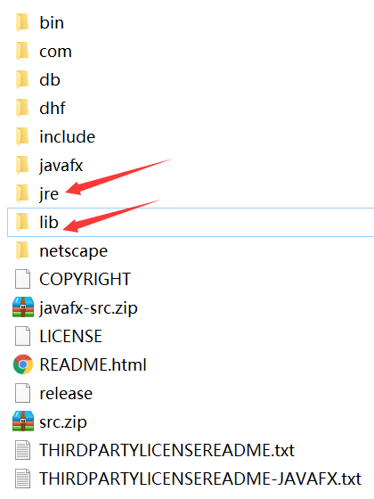
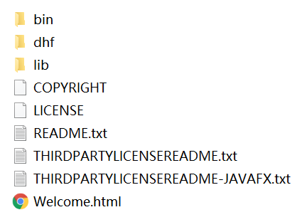
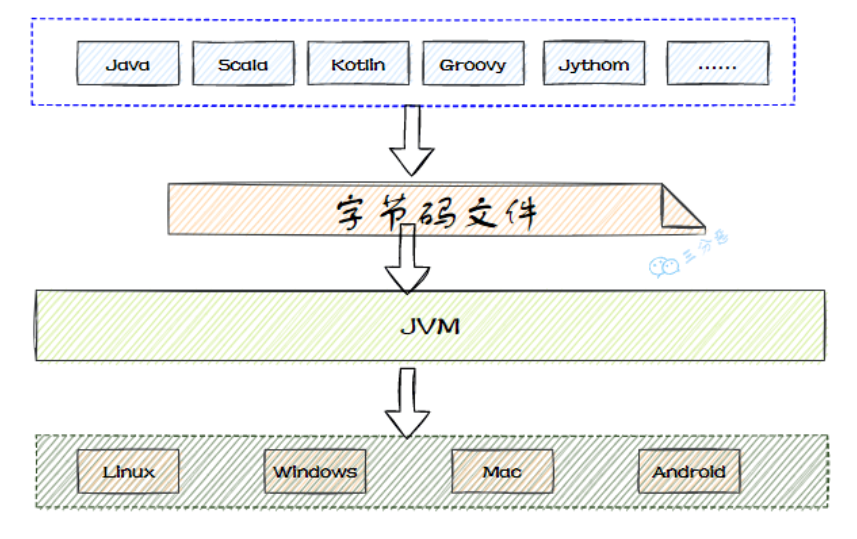

# JVM概述

## 一、JDK、JRE、JVM

### 1.Java整体架构图

虽然看不太懂，但是还是先放在这里😂


### 2.JDK（编译环境）

**JDK = Java运行环境(JRE) + Java类库 + Java工具**，JDK的目录结构如下



JDK是支持Java程序开发的最小环境，通常在安装好JDK之后，JRE也会自动安装好

### 3.JRE（运行环境）

**JRE = JVM + Java类库中JavaSE API子集**，JRE的目录结构如下



JRE并不是开发环境，不包含任何开发工具(编译器或调试器等)，适合Java程序的用户

### 4.JVM（平台软件）

JVM就是Java虚拟机，**只认识.class，负责将字节码解释成机器码并提交到OS**

**JVM是跨平台的核心**，所有的Java程序先被编译成.class文件，.class文件可以在JVM上运行，屏蔽具体操作系统平台相关信息，使得Java程序只需生成在JVM上运行的目标代码(**字节码**)就可以在多平台上不加修改的运行

>JVM与VMware有何区别？
>
>VMware经常被用来在Windows下安装Linux系统，其**模拟CPU指令集**，JVM是Java虚拟机，模拟的是**Java字节码指令集**

## 二、未来JDK的新技术发展

**模块化开发**：自顶向下逐层将系统划分成若干模块，模块间可组合、分解、更换，提高代码复用性、可维护性，实现按需加载

**多语言开发**：JVM只是一种规范，并不是只有Java才可以运行于JVM(**基于JVM的多语言**)

**多核并行**：一个核(CPU)同一时间只能运行一个线程，即单核多线程指的线程也是顺序执行，多核并行指多个CPU同时运行多个线程，即多线程并行执行

**64位机支持**：此方案有利有弊，对对象数据对齐不友好，存在大量空间浪费

**丰富的垃圾回收机制**

## 三、虚拟机种类与特点

### 1.VM种类(了解)

**Sun classic VM**：世界上第一款商用JVM，只能使用**纯解释器**的方式来执行Java代码（已过时）

**Exact VM**：全称Exact Memory Management(准确式内存管理)，即虚拟机可知道内存中某位置的数据是何内存，**编译器和解释器混合工作**，只在Solaris平台发布，还没在Windows等其他平台上发布就被HotSpotVm取代

**Hotspot VM**：最初由小公司开发，后来被Sun公司收购，继承1.2款JVM的优点，增加热点代码探测等其他技术，应用最多（仍在使用）

**KVM**：简单，轻量，高度可移植，在手机平台运行(嵌入式领域)

**JRockit**：前面几种都出自Sun公司，而JRockit由BEA公司研发，后被Oracle收购，后来Sun公司也被Oracle收购，最快的JVM，专注服务器端应用，优势在于**垃圾回收器、MissionControl服务套件(用于内存管理，生产环境内存泄露问题)**

**J9**：IBM公司研发，类似于Hotspot，不仅可以用于服务器端，还可以用于桌面应用、嵌入式

**Dalvik**：没有遵循JVM规范，不能直接执行编译后的.class文件，用于移动端Android的JVM

**Microsoft JVM**：微软开发，为了自家软件于Java兼容，只能运行在Windows，后来于Sun公司竞争失败（已消失）

**Azul VM(专用的虚拟机)和Liquid VM(不需要操作系统支持)**：两款高性能JVM，碾压Hotspot
高性能的java虚拟机

**Taobao VM**：淘宝根据Hotspot深度定制的JVM，国产，对硬件依赖度高

### 2.现在使用的是那种VM？

**HotSpot VM**，通过`java -version`查询

```
C:\Users\CJ>java -version
java version "1.8.0_65"
Java(TM) SE Runtime Environment (build 1.8.0_65-b17)
Java HotSpot(TM) 64-Bit Server VM (build 25.65-b01, mixed mode)
```

### 3.VM的特点

**快速部署**：可通过克隆方式快速部署，能节省配置新虚拟机和安装操作系统的时间，保证虚拟机间的一致性

**资源热添加**：虚拟机处于开机状态时，增加虚拟机的计算、存储、网络等资源

**Console控制**：不依赖虚拟机的网络，对虚拟机远程控制和管理

**虚拟机快照**：虚拟机出现故障可通过虚拟机快速恢复

...

## 四、JVM的整体架构

**JVM由类装载器子系统、运行时数据区、执行引擎组成**，其整体架构图如下，本地方法接口属于OS


Java源文件经过编译器、虚拟机的过程如下


## 五、JVM规范（TODO）

## 六、Java编译器输入指令流有何优点（TODO）

## 七、字节码加载流程

[参考文章](https://blog.csdn.net/qq_45949008/article/details/119918269)

### 1.Loading(加载)

#### 1.1.加载理解

加载简而言之就是**查找类的二进制数据，生成字节码，将字节码加载到机器内存，并在内存中构建Java类原型(类模板对象)**

**类模板对象实际是Java类在JVM中的快照**，JVM从字节码文件中解析出常量池、类字段、类方法等信息存到类模板中，使JVM在运行期间能通过类模板获得Java类的任何信息，反射基于这一基础

#### 1.2.加载过程

* **通过全类名获取类的二进制数据**

* 解析类的二进制数据，成为**方法区中的数据结构(类模板对象)**

* **堆中创建java.lang.Class类实例，作为方法区该类数据的当问入口**

  > Class对象在类加载过程中创建，每个类对应一个Class对象，且Class对象的构造函数私有，只有JVM可创建

  > 注意数组类本身不是由类加载器负责创建，而是JVM运行时根据需要创建，但数组类的元素需要通过类加载器加载

#### 1.3.二进制流的获取方式

### 2.Linking(链接)

### 3.Initialization(初始化)

### 4.Using(使用)

### 5.Unloading(卸载)

## 八、能编译成字节码的语言




