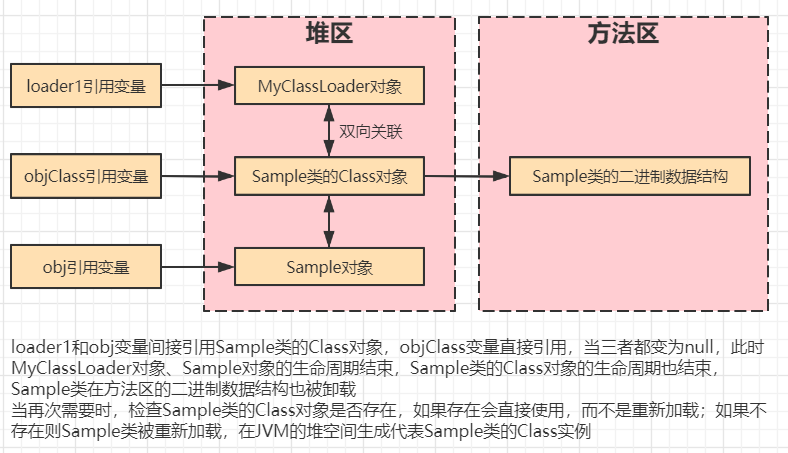

# JVM概述

## 一、JDK、JRE、JVM

### 1.Java整体架构图

虽然看不太懂，但是还是先放在这里😂


### 2.JDK（编译环境）

**JDK = Java运行环境(JRE) + Java类库 + Java工具**，JDK的目录结构如下


JDK是支持Java程序开发的最小环境，通常在安装好JDK之后，JRE也会自动安装好

### 3.JRE（运行环境）

**JRE = JVM + Java类库中JavaSE API子集**，JRE的目录结构如下


JRE并不是开发环境，不包含任何开发工具(编译器或调试器等)，适合Java程序的用户

### 4.JVM（平台软件）

JVM就是Java虚拟机，**只认识`.class`，负责将字节码解释成机器码并提交到OS**

**JVM是跨平台的核心**，所有的Java程序先被编译成`.class`文件，`.class`文件可以在JVM上运行，屏蔽具体操作系统平台相关信息，使得Java程序只需生成在JVM上运行的目标代码(**字节码**)就可以在多平台上不加修改的运行

>JVM与VMware有何区别？
>
>VMware经常被用来在Windows下安装Linux系统，其**模拟CPU指令集**，JVM是Java虚拟机，模拟的是**Java字节码指令集**

## 二、未来JDK的新技术发展

**模块化开发**：自顶向下逐层将系统划分成若干模块，模块间可组合、分解、更换，提高代码复用性、可维护性，实现按需加载

**多语言开发**：JVM只是一种规范，并不是只有Java才可以运行于JVM(**基于JVM的多语言**)

**多核并行**：一个核(CPU)同一时间只能运行一个线程，即单核多线程指的线程也是顺序执行，多核并行指多个CPU同时运行多个线程，即多线程并行执行

**64位机支持**：此方案有利有弊，对对象数据对齐不友好，存在大量空间浪费

**丰富的垃圾回收机制**

## 三、虚拟机种类与特点

### 1.VM种类(了解)

**Sun classic VM**：世界上第一款商用JVM，只能使用**纯解释器**的方式来执行Java代码（已过时）

**Exact VM**：全称Exact Memory Management(准确式内存管理)，即虚拟机可知道内存中某位置的数据是何内存，**编译器和解释器混合工作**，只在Solaris平台发布，还没在Windows等其他平台上发布就被HotSpotVm取代

**Hotspot VM**：最初由小公司开发，后来被Sun公司收购，继承1.2款JVM的优点，增加热点代码探测等其他技术，应用最多（仍在使用）

**KVM**：简单，轻量，高度可移植，在手机平台运行(嵌入式领域)

**JRockit**：前面几种都出自Sun公司，而JRockit由BEA公司研发，后被Oracle收购，后来Sun公司也被Oracle收购，最快的JVM，专注服务器端应用，优势在于**垃圾回收器、MissionControl服务套件(用于内存管理，生产环境内存泄露问题)**

**J9**：IBM公司研发，类似于Hotspot，不仅可以用于服务器端，还可以用于桌面应用、嵌入式

**Dalvik**：没有遵循JVM规范，不能直接执行编译后的.class文件，用于移动端Android的JVM

**Microsoft JVM**：微软开发，为了自家软件于Java兼容，只能运行在Windows，后来于Sun公司竞争失败（已消失）

**Azul VM(专用的虚拟机)和Liquid VM(不需要操作系统支持)**：两款高性能JVM，碾压Hotspot
高性能的java虚拟机

**Taobao VM**：淘宝根据Hotspot深度定制的JVM，国产，对硬件依赖度高

### 2.现在使用的是那种VM？

**HotSpot VM**，通过`java -version`查询

```
C:\Users\CJ>java -version
java version "1.8.0_65"
Java(TM) SE Runtime Environment (build 1.8.0_65-b17)
Java HotSpot(TM) 64-Bit Server VM (build 25.65-b01, mixed mode)
```

### 3.VM的特点

**快速部署**：可通过克隆方式快速部署，能节省配置新虚拟机和安装操作系统的时间，保证虚拟机间的一致性

**资源热添加**：虚拟机处于开机状态时，增加虚拟机的计算、存储、网络等资源

**Console控制**：不依赖虚拟机的网络，对虚拟机远程控制和管理

**虚拟机快照**：虚拟机出现故障可通过虚拟机快速恢复

...

## 四、JVM的整体架构

**JVM由类装载器子系统、运行时数据区、执行引擎组成**，其整体架构图如下，本地方法接口属于OS


Java源文件经过编译器、虚拟机的过程如下


## 五、JVM规范（TODO）

## 六、Java编译器输入指令流有何优点（TODO）

## 七、字节码加载流程

### 1.Loading(加载)

#### 1.1.加载理解

加载简而言之就是**查找类的二进制数据，生成字节码，将字节码加载到机器内存，并在内存中构建Java类原型(类模板对象)**

**类模板对象实际是Java类在JVM中的快照**，JVM从字节码文件中解析出常量池、类字段、类方法等信息存到类模板中，使JVM在运行期间能通过类模板获得Java类的任何信息，反射基于这一基础

#### 1.2.加载过程

* **通过全类名获取类的二进制数据**

* 解析类的二进制数据，成为**方法区中的数据结构(类模板对象)**

* **堆中创建java.lang.Class类实例，作为方法区该类数据的当问入口**

  > Class对象在类加载过程中创建，每个类对应一个Class对象，且Class对象的构造函数私有，只有JVM可创建

  > 注意数组类本身不是由类加载器负责创建，而是JVM运行时根据需要创建，但数组类的元素需要通过类加载器加载
  
  > 若输入数据不是ClassFile，抛出异常ClassFormatError

#### 1.3.二进制流的获取方式

- 文件系统读入.class文件（最常见）
- 运行时生成class二进制信息
- 读jar、zip等归档文件，提取类文件
- 实现放在数据库的二进制数据
- 使用协议通过网络加载

### 2.Linking(链接)

#### 2.1.Verification(验证)

**验证的目的是保证加载的字节码合法**，验证的步骤比较复杂，实际要验证的项目也很繁多，大概验证过程如下


**其中格式验证会在加载阶段一起执行，验证通过后，类加载器才会将类的二进制数据加载到方法区**，其他验证会在方法区中进行，符号引用验证会在解析阶段执行

#### 2.2.Preparation(准备)

该阶段会**为类的静态变量分配内存，并将其初始化为默认值**，对于该阶段应注意以下几点

- Java不支持boolean类型，所以对于boolean类型内部实际是int，int默认值0所以对应于false
- 该阶段不包含static final类型的数据，因为final类型的数据在编译阶段就被分配(3.2中具体讲解)
- 该阶段不会为类的实例变量初始化，因为实例变量随着对象一起被分配到Java堆中
- 初始化为**默认值**，注意是默认值

#### 2.3.Resolution(解析)

该阶段**将类、接口、字段和方法的符号引用转为直接引用**

符号引用指字面量的引用，和VM的内部数据结构和内存布局无关，容易理解的是Class类文件通过常量池产生大量符号引用，**JVM为每个类都准备方法表，当调用某方法时只需要知道该方法在方法表中的偏移量即可直接调用，通过解析可将符号引用转变为目标方法在方法表中的位置**，从而使方法被成功调用

以println()为例，该方法被调用时，系统需要明确知道该方法的位置，`System.out.println()`方法的字节码为`invokevirtual #24 <java/io/PrintStream.println>`，对应的方法表如下


### 3.Initialization(初始化)

#### 3.1.初始化阶段

如果前面的步骤没有问题，表示类可以顺利的装载到系统中，此时类才会**开始执行Java字节码**，即**到达初始化阶段才真正开始执行类中定义的Java程序代码**，即**此阶段根据程序员编写的Java代码初始化变量和资源**

**初始化阶段的重要工作是执行类的初始化方法`<clinit>()`**，该方法只能由Java编译器生成，由JVM调用，程序员无法自定义该方法，更无法在程序中直接调用

在加载类之前，JVM试图加载该类的父类，因此父类总是在子类之前被调用

#### 3.2.static final修饰的字段在哪个阶段被赋值？

**链接阶段的准备环节赋值(显式赋值)**

- 基本数据类型使用static final修饰，则显式赋值(直接赋值常量，而非调用方法)

```Java
public static final int i = 10;
```

- String使用static final修饰且使用字面量的方式赋值

```java
public static final String str = "hello";
```

**初始化阶段`<clinit>()`中赋值**

- 排除上述的在准备环节赋值的情况之外的情况

```java
public static int i = 10;
public static final int i = new Random().nextInt();

public static Integer i = Integer.valueOf(100);
public static final Integer i = Integer.valueOf(100);

public static String str = "hello";
public static final String str = new String("hello");
```

#### 3.3.`<clinit>()`的线程安全性

对于`<clinit>()`方法的调用，JVM会在内部确保其多线程环境中的安全性，即确保其被正确地加锁、同步，若多线程同时初始化某类，那么**只有一个线程可以执行该类的`<clinit>()`**，其他线程阻塞等待，但这同时也会带来多线程场景下加锁再来的问题，如进行耗时操作可能造成阻塞、死锁等，并且这种死锁很难发现

若之前的线程成功加载类，则等在队列中的线程就没有机会再执行`<clinit>()`，当需要使用该类时，JVM会直接返回给它己经准备好的信息

#### 3.4.主动使用与被动使用

**主动使用**：**JVM不会无条件地装载Class**，JVM规定类或接口在**初次使用前必须要进行初始化**，此处指的“使用”是指主动使用，主动使用只有如下情况，如果出现如下情况则会对类进行初始化操作

* **创建类实例**，如`new Class()`

* **访问静态变量或给静态变量赋值**，final修饰另外考虑

* **调用静态方法**，即使用字节码`invokestatic`指令

* **反射**，如`Class.forName("java.lang.String")`

* **初始化子类时，先初始化父类**，但这对接口不适用

  > 初始化类，不会先初始化其实现的接口
  >
  > 初始化接口，不会先初始化其父接口

* **接口定义default方法，初始化接口实现类前先初始化该接口**

* **JVM启动时，被标明为启动类的类**，包含main()

* **初次调用MethodHandle实例时，初始化该MethodHandle指向的方法所在的类**

**被动使用**：除以上情况外的其他都属于被动使用，**被动使用不会引起类初始化**，也就是说，代码中出现的类不一定都被加载或初始化，若不符合主动加载也不会被初始化

### 4.Using(使用)

任何类在使用前都要经过链接阶段(验证、准备、解析)，然后就等着开发人员使用

### 5.Unloading(卸载)

**类的生命周期何时结束，取决于该类Class对象何时结束生命周期**，当Class对象不再被引用，Class对象的生命周期结束，该类在方法区中的数据结构被卸载，举个鸡腿🍗



**已经加载的类被卸载的几率很小，至少被卸载的时间是不确定的**

> [参考文章1](https://blog.csdn.net/qq_45949008/article/details/119918269)	[参考文章2](https://blog.csdn.net/weixin_42638946/article/details/113698017?spm=1001.2101.3001.6650.1&utm_medium=distribute.pc_relevant.none-task-blog-2%7Edefault%7ECTRLIST%7Edefault-1-113698017-blog-119918269.pc_relevant_multi_platform_whitelistv2&depth_1-utm_source=distribute.pc_relevant.none-task-blog-2%7Edefault%7ECTRLIST%7Edefault-1-113698017-blog-119918269.pc_relevant_multi_platform_whitelistv2&utm_relevant_index=1)

## 八、能编译成字节码的语言


