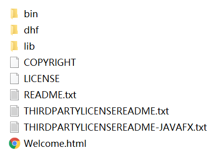

# JVM预习

## 一、JDK, JRE, JVM

首先贴图一张，虽然也看不太懂


### 1.JDK（编译环境）

JDK = Java运行环境**JRE** + Java工具 + Java基础类库

JDK的目录结构如下


JDK是支持Java程序开发的最小环境，通常在安装好JDK之后，JRE也会自动安装好

通常在安装好JDK之后，JRE也会自动安装好

### 2.JRE（运行环境）

JRE = JVM + Java类库API中的Java SE API子集 = **Java运行环境**

JRE的目录结构如下，bin可理解为JVM，lib是该JVM工作所需要的类库



JRE并不是开发环境，不包含任何开发工具(编译器或调试器等)，适合Java程序的用户

### 3.JVM（平台软件）

JVM就是Java虚拟机，只认识.class文件，负责将字节码解释成机器码，并提交到OS执行

JVM是跨平台的核心，所有的Java程序先被编译成.class文件，.class文件可以在JVM上运行，屏蔽具体操作系统平台相关信息，使得Java程序只需生成在JVM上运行的目标代码（**字节码**），就可以在多种平台上不加修改地运行，即跨平台

跨平台性指不同的浏览器安装不同的JVM，JVM将字节码与对应操作系统相映射，达到Java程序的跨平台性

## 二、了解未来JDK的新技术发展（NO）

模块化开发

多语言开发，基于JVM的多语言，JVM上的语言不止Java，JVM只是一种规范

多核并行

64位的机器支持，对象数据对齐有一定问题，浪费大量空间

更丰富的垃圾回收器

## 三、VM有哪些类型？我们使用的是哪一种？有何特点? 

### 1.VM类型

**Sun classic VM**：世界上第一款商用JVM，只能使用**纯解释器**的方式来执行Java代码（已过时）

**Exact VM**：全称Exact Memory Management(准确式内存管理)，即虚拟机可知道内存中某位置的数据是何内存，**编译器和解释器混合工作**，只在Solaris平台发布，还没在Windows等其他平台上发布就被HotSpotVm取代

**Hotspot VM**：最初由小公司开发，后来被Sun公司收购，继承1.2款JVM的优点，增加热点代码探测等其他技术，应用最多（仍在使用）

**KVM**：简单，轻量，高度可移植，在手机平台运行(嵌入式领域)

**JRockit**：前面几种都出自Sun公司，而JRockit由BEA公司研发，后被Oracle收购，后来Sun公司也被Oracle收购，最快的JVM，专注服务器端应用，优势在于**垃圾回收器、MissionControl服务套件(用于内存管理，生产环境内存泄露问题)**

**J9**：IBM公司研发，类似于Hotspot，不仅可以用于服务器端，还可以用于桌面应用、嵌入式

**Dalvik**：没有遵循JVM规范，不能直接执行编译后的.class文件，用于移动端Android的JVM

**Microsoft JVM**：微软开发，为了自家软件于Java兼容，只能运行在Windows，后来于Sun公司竞争失败（已消失）

**Azul VM(专用的虚拟机)和Liquid VM(不需要操作系统支持)**：两款高性能JVM，碾压Hotspot
高性能的java虚拟机

**Taobao VM**：淘宝根据Hotspot深度定制的JVM，国产，对硬件依赖度高

### 2.我们使用的是那种VM？（NO）

**Hotspot VM**，有客户端模式与服务端模式，通过java -version可查

```
C:\Users\CJ>java -version
java version "1.8.0_65"
Java(TM) SE Runtime Environment (build 1.8.0_65-b17)
Java HotSpot(TM) 64-Bit Server VM (build 25.65-b01, mixed mode)
```

### 3.VM特点

**快速部署**：可通过克隆方式快速部署，能节省配置新虚拟机和安装操作系统的时间，保证虚拟机间的一致性

**资源热添加**：虚拟机处于开机状态时，增加虚拟机的计算、存储、网络等资源

**Console控制**：不依赖虚拟机的网络对虚拟机远程控制和管理

**虚拟机快照**：虚拟机出现故障可通过虚拟机快速恢复

...

## 四、为什么叫JVM？与VMware的区别？

### 1.为什么叫JVM？

Java Virtual Machine，Java运行环境的一部分，执行Java字节码的虚拟计算机

### 2.JVM与VMware的区别？（NO）

VMware模拟CPU指令集，JVM模拟Java字节码指令集，模拟的层面不同

## 五、JVM的整体架构？

类装载器子系统、运行时数据区、执行引擎(模拟CPU运行)

可通过执行引擎直接调用本地方法接口，也可以直接调用本地方法接口，本地方法接口属于OS


## 六、字节码的加载流程

[参考文章](https://blog.csdn.net/qq_45949008/article/details/119918269)

### 1.Loading（加载）

#### 1.1.加载理解

加载简而言之就是**查找类的二进制数据，生成Java类的字节码文件，将Java类的字节码文件加载到机器内存，并在内存中构建出Java类原型（类模板对象）**

类模板对象实际就是Java类在JVM内存中的快照，JVM从字节码文件中解析出常量池、类字段、类方法等信息存到类模板中，这要使JVM在运行期间能通过类模板获得Java类的任何信息，反射基于这一基础

#### 1.2.加载过程

* 通过类全名**获取类的二进制数据流**
* 解析类的二进制数据流，成为**方法区内的数据结构（Java类原型）**
* **堆中创建java.lang.Class类实例**，作为方法区该类的数据访问入口（Class对象在类加载过程创建，每个类都有一个Class类型的对象，Class类的构造方法私有，只有JVM能创建）

若输入数据不是ClassFile，抛出异常ClassFormatError

#### 1.3.数组类的加载

数组本身不是由类加载器负责创建，而是由JVM运行时根据需要而直接创建，但数组的元素类型仍然需要通过类加载器创建，其数据加载过程如下：

* 若数组元素类型是引用类型，遵循定义的类加载过程递归加载和创建数组的元素类型，且数组的可访问性与元素类型的可访问性相同

#### 1.4.二进制流的获取方式

* 文件系统读入.class文件（最常见）
* 读jar、zip等归档文件，提取类文件
* 实现放在数据库的二进制数据
* 使用协议通过网络加载
* 运行时生成class二进制信息

### 2.Linking（链接）

#### 2.1.Verification（验证）

验证的目的是保证加载的字节码合法，验证的步骤比较复杂，实际要验证的项目也很繁多，大概验证过程如下


**其中格式验证会在加载阶段一起执行，验证通过后，类加载器才会将类的二进制数据加载到方法区**，其他验证会在方法区中进行，符号引用验证会在解析阶段执行

#### 2.2.Preparation（准备）

该阶段会为类的静态变量分配内存，并将其初始化为默认值，对于该阶段应注意以下几点

* Java不支持boolean类型，所以对于boolean类型内部实际是int，int默认值0所以对应于false
* 该阶段不包含static final类型的数据，因为final类型的数据在编译阶段就被分配
* 该阶段不会为类的实例变量初始化，因为实例变量随着对象一起被分配到Java堆中

#### 2.3.Resolution（解析）

该阶段将类、接口、字段和方法的符号引用转为直接引用

符号引用指字面量的引用，和VM的内部数据结构和内存布局无关，容易理解的是Class类文件通过常量池产生大量符号引用，**JVM为每个类都准备方法表，当调用某方法是只需要知道该方法在方法表中的偏移量即可直接调用，通过解析可将符号引用转变为目标方法在方法表中的位置**，从而使方法被成功调用

以println()为例，该方法被调用时，系统需要明确知道该方法的位置，`System.out.println()`方法的字节码为`invokevirtual #24 <java/io/PrintStream.println>`，对应的方法表如下


## 3.Initialization（初始化）阶段

#### 3.1.概述

如果前面的步骤没有问题，表示类可以顺利的装载到系统中，此时类才会开始执行Java字节码，即**到达初始化阶段才真正开始执行类中定义的Java程序代码**

**初始化阶段的重要工作是执行类的初始化方法`<clinit>()`**，该方法只能由Java编译器生成，由JVM调用，程序员无法自定义该方法，更无法在程序中直接调用，该方法由静态成员赋值语句和static语句块合并产生

在加载类之前，JVM试图加载该类的父类，因此父类总是在子类之前被调用

#### 3.2.static final修饰的字段在哪个阶段被赋值？

**链接阶段的准备环节赋值**

* 对基本数据类型使用static final修饰，则显式赋值(直接赋值常量，而非调用方法)

* 对于String来说，如果使用字面量的方式赋值且使用static final修饰，则显式赋值通常是在链接阶段的准备环节进行

**初始化阶段`<clinit>()`中赋值**

* 排除上述的在准备环节赋值的情况之外的情况

#### 3.3.`<clinit>()`的线程安全性

对于`<clinit>()`方法的调用，JVM会在内部确保其多线程环境中的安全性，即确保其被正确地加锁、同步，若多线程同时初始化某类，那么**只有一个线程可以执行该类的`<clinit>()`**，其他线程阻塞等待，但这同时也会带来多线程场景下加锁再来的问题，如进行耗时操作可能造成阻塞、死锁等，并且这种死锁很难发现

若之前的线程成功加载类，则等在队列中的线程就没有机会再执行`<clinit>()`，当需要使用该类时，JVM会直接返回给它己经准备好的信息

#### 3.4.主动使用与被动使用

**主动使用**：Class只有在首次使用时才会被装载，JVM不会无条件地装载Class类型，JVM规定类或接口在初次使用前必须要进行初始化，此处指的“使用”是指主动使用，主动使用只有如下情况，如果出现如下情况则会对类进行初始化操作

* **创建类实例**，如new、克隆、反序列化等

* **调用静态方法**，即使用字节码`invokestatic`指令

* **调用静态字段**(final修饰特殊考虑)

* **使用反射类的方法**，如Class.forName()

* 初始化子类时，先初始化父类，但这对接口不适用

  > 初始化类，不会先初始化其实现的接口
  >
  > 初始化接口，不会先初始化其父接口

* 接口定义default方法，初始化接口实现类前先初始化该接口

* 虚拟机启动时，先初始化主类(main)


**被动使用**：除以上情况外的其他都属于被动使用，**被动使用不会引起类初始化**，也就是说，代码中出现的类不一定都被架加载或初始化，若不符合主动加载也不会被初始化

###  4.Using（使用）

任何类在使用前都要经过链接阶段(验证、准备、解析)，经历后就等着开发人员使用

### 5.Unloading（卸载）（NO）

## 七、Java编译器输入指令流有何优点（NO）

Java编译器输入指令流是基于栈的指令集架构，基于栈实现起来更简单，资源不需要消耗太多

设计和实现更简单，适用于资源受限的系统

避开寄存器分配难题，使用零地址指令方式分配

## 八、哪些语言可以编译字节码？（NO）

运行于JVM的字节码只能由jaavc编译而来的Java源代码产生吗？

## 九、JVM规范


> ==========**类加载相关**==========


## 十、JVM何时加载类？

主动加载时才会发生类的加载，主动加载的情况如下

- **创建类实例**，如new、克隆、反序列化等

- **调用静态方法**，即使用字节码`invokestatic`指令

- **调用静态字段**(final修饰特殊考虑)

- **使用反射类的方法**，如Class.forName()

- 初始化子类时，先初始化父类，但这对接口不适用

  > 初始化类，不会先初始化其实现的接口
  >
  > 初始化接口，不会先初始化其父接口

- 接口定义default方法，初始化接口实现类前先初始化该接口

- 虚拟机启动时，先初始化主类(main)

## 十一、类加载的详细过程？每个阶段的工作

> 字节码加载流程

## 十二、JVM的类加载器类型及加载它的目标路径？如何自定义类加载器加载指定目录下的class文件?

### 1.类加载器类型及目标路径

#### 1.1.类加载器类型及目标路径说明

**启动类加载器Bootstrap ClassLoader**，加载jre/lib下的核心jar包


**扩展类加载器Extension ClassLoader**，加载jre/lib/ext下的核心jar包


**应用程序类加载器Application ClassLoader**，加载classpath下的类库，加载程序所在的目录

#### 1.2.代码打印验证目标路径

①编写LoadPath

```Java
package ClassLoaderPath;


import java.net.URL;
import java.net.URLClassLoader;

public class LoadPath {
	public static void main(String[] args) {
        System.out.println("启动类的加载路径");
        URL[] urls = sun.misc.Launcher.getBootstrapClassPath().getURLs();//C编写
        for (URL url : urls) {
            System.out.println(url);
        }
        System.out.println("----------------------------");
 
        //取得扩展类加载器
        URLClassLoader extClassLoader = (URLClassLoader) ClassLoader.getSystemClassLoader().getParent();
        System.out.println(extClassLoader);
        System.out.println("扩展类加载器的加载路径：");
        urls = extClassLoader.getURLs();
        for (URL url : urls) {
            System.out.println(url);
        }
        System.out.println("----------------------------");
 
 
        //取得应用程序类加载器
        URLClassLoader appClassLoader = (URLClassLoader) ClassLoader.getSystemClassLoader();
        System.out.println(appClassLoader);
        System.out.println("应用程序类加载器的加载路径：");
        urls = appClassLoader.getURLs();
        for (URL url : urls) {
            System.out.println(url);
        }
        System.out.println("----------------------------");
    }
}
```


②结果

```
启动类的加载路径
file:/D:/develop/Java/jdk1.8.0_65/jre/lib/resources.jar
file:/D:/develop/Java/jdk1.8.0_65/jre/lib/rt.jar
file:/D:/develop/Java/jdk1.8.0_65/jre/lib/sunrsasign.jar
file:/D:/develop/Java/jdk1.8.0_65/jre/lib/jsse.jar
file:/D:/develop/Java/jdk1.8.0_65/jre/lib/jce.jar
file:/D:/develop/Java/jdk1.8.0_65/jre/lib/charsets.jar
file:/D:/develop/Java/jdk1.8.0_65/jre/lib/jfr.jar
file:/D:/develop/Java/jdk1.8.0_65/jre/classes
----------------------------
sun.misc.Launcher$ExtClassLoader@2a139a55
扩展类加载器的加载路径：
file:/D:/develop/Java/jdk1.8.0_65/jre/lib/ext/access-bridge-64.jar
file:/D:/develop/Java/jdk1.8.0_65/jre/lib/ext/cldrdata.jar
file:/D:/develop/Java/jdk1.8.0_65/jre/lib/ext/dhf/
file:/D:/develop/Java/jdk1.8.0_65/jre/lib/ext/dnsns.jar
file:/D:/develop/Java/jdk1.8.0_65/jre/lib/ext/jaccess.jar
file:/D:/develop/Java/jdk1.8.0_65/jre/lib/ext/jfxrt.jar
file:/D:/develop/Java/jdk1.8.0_65/jre/lib/ext/localedata.jar
file:/D:/develop/Java/jdk1.8.0_65/jre/lib/ext/nashorn.jar
file:/D:/develop/Java/jdk1.8.0_65/jre/lib/ext/sunec.jar
file:/D:/develop/Java/jdk1.8.0_65/jre/lib/ext/sunjce_provider.jar
file:/D:/develop/Java/jdk1.8.0_65/jre/lib/ext/sunmscapi.jar
file:/D:/develop/Java/jdk1.8.0_65/jre/lib/ext/sunpkcs11.jar
file:/D:/develop/Java/jdk1.8.0_65/jre/lib/ext/zipfs.jar
----------------------------
sun.misc.Launcher$AppClassLoader@4e0e2f2a
应用程序类加载器的加载路径：
file:/E:/JAVASE_WordSpace/MyClassLoader/bin/
----------------------------
```

#### 1.3源码查看验证目标路径

Launcher为入口


### 2.自定义类加载器

**实现原理**是通过类名找到对应的.class文件，然后将.class文件转为二进制数据，最后利用二进制数数据生成Class对象

**代码实现**需继承Java中的ClassLoader类，重写loadClass或者findClass方法均可，在重写的方法内调用父类的defineClass()将二进制数据转为Class对象

①定义需要被自定义加载器加载的类MyTest（E:\JVM\MyClassLoader）

```
public class MyTest {
    static {
        System.out.println("hello!!!");
    }
}
```

②编译MyTest.java得到.class文件

```
C:\Users\CJ>e:

C:\Users\CJ>cd E:\JVM\MyClassLoader

E:\JVM\MyClassLoader>javac MyTest.java
```

③自定义类加载器MyClassLoader（eclipse）

```Java
import java.io.BufferedInputStream;
import java.io.ByteArrayOutputStream;
import java.io.FileInputStream;
import java.io.IOException;
 
public class MyClassLoader extends ClassLoader{
    private String byteCodePath;//要加载的字节码文件的路径
    public MyClassLoader(String byteCodePath){
        this.byteCodePath = byteCodePath;
    }
	
    @Override
    protected Class<?> findClass(String name) throws ClassNotFoundException {
        String fileName = byteCodePath + name + ".class";//拼接要加载的字节码文件的绝对路径
		
        BufferedInputStream in = null;
        ByteArrayOutputStream out = null;
        try {
            in = new BufferedInputStream(new FileInputStream(fileName));//输入流读取.class文件
            out = new ByteArrayOutputStream();
			
            int len = 0;
            byte[] data = new byte[1024];//1kb
            while((len = in.read(data)) != -1){
                out.write(data,0,len);
            }
            byte[] bytes = out.toByteArray();//获取到字节码的二进制流
            Class<?> aClass = defineClass(null, bytes, 0, bytes.length);// 调用父类方法获取Class对象
            return aClass;
        }catch (Exception e){
            e.printStackTrace();
        }finally {
            // 释放资源
            if (in != null){
                try {
                    in.close();
                } catch (IOException e) {
                    e.printStackTrace();
                }
            }
            if (out != null){
                try {
                    out.close();
                } catch (IOException e) {
                    e.printStackTrace();
                }
            }
        }
        return null;
    }
}
```

④定义测试类（eclipse）

```
package MyClassLoader;

public class Test {
    public static void main(String[] args)throws Exception {
		//1.构建自定义类加载器
        MyClassLoader myClassLoader = new MyClassLoader("E://JVM//MyClassLoader//"); //要加载的路径
        //2.通过.class文件获取Class对象
		Class<?> myTest = myClassLoader.findClass("MyTest");
		//注意主动使用加载器加载class文件不会触发类的初始化方法<clinit>()，所以需要通过创建对象的方式查看静态方法是否执行
		Object obj = myTest.getConstructor().newInstance(null);
    }
}
```

⑤结果在控制台输出`hello!!!`

## 十三、什么是双亲委派模型？有什么作用？

### 1.什么是双亲委派模型？

**双亲委派机制**指当类加载器收到类加载请求时，该类加载器首先会把请求委派给父类加载器，每个类加载器都是如此，只有父类加载器在自己的搜索范围内找不到指定类时，子类加载器才会尝试自己去加载

### 2.双亲委派工作过程

首先判断类是否加载，若未加载交给双亲委派器加载

* 当Application ClassLoader收到类加载请求时，他首先不会自己去尝试加载这个类，而是将这个请求委派给父类加载器Extension ClassLoader去完成

* 当Extension ClassLoader收到类加载请求时，他首先也不会自己去尝试加载这个类，而是将请求委派给父类加载器Bootstrap ClassLoader去完成

* 如果Bootstrap ClassLoader加载失败(在%JAVA_HOME%\lib中未找到所需类)，就会让Extension ClassLoader尝试加载

* 如果Extension ClassLoader也加载失败，就会使用Application ClassLoader加载

若双亲委派器都没有加载成功，会使用自定义加载器去尝试加载findClass

如果均加载失败，就会抛出ClassNotFoundException异常


### 3.双清委派源码

```Java
protected Class<?> loadClass(String name, boolean resolve)throws ClassNotFoundException{
        synchronized (getClassLoadingLock(name)) {
            //首先检查这个classsh是否已经加载过
            Class<?> c = findLoadedClass(name);
            //c==null表示没有加载
            if (c == null) {
                long t0 = System.nanoTime();
                try {
                    if (parent != null) {//如果有父类的加载器则让父类加载器加载
                        c = parent.loadClass(name, false);
                    } else {//如果父类的加载器为空 则说明递归到bootStrapClassloader，因为这是C编
                        //bootStrapClassloader比较特殊无法通过get获取
                        c = findBootstrapClassOrNull(name);
                    }
                } catch (ClassNotFoundException e) {}
                
                //如果bootstrapClassLoader仍然没有加载过，则递归回来尝试自己去加载class
                if (c == null) {
                    long t1 = System.nanoTime();
                    c = findClass(name);
                    sun.misc.PerfCounter.getParentDelegationTime().addTime(t1 - t0);
                    sun.misc.PerfCounter.getFindClassTime().addElapsedTimeFrom(t1);
                    sun.misc.PerfCounter.getFindClasses().increment();
                }
            }
            if (resolve) {
                resolveClass(c);
            }
            return c;
        }
    }
}
```

### 4.双清委派的作用

**保证安全性**：防止加载同一个.class，通过向上委托问一问是否加载过，加载过就不用再加载一遍

**保证唯一性**：核心.class不能被篡改，通过委托的方式不会篡改核心.class，试想若没有双亲委派机制，每个类加载器都自行加载，若用户编写了一个java.lang.Object的同名类放在ClassPath中，多个加载器都去加载Object，导致系统中Object各不相同，运行程序时出错

## 十四、类加载器如何确保类在JVM中的唯一性？两个类来自同一Class文件，被同一个JVM加载，这两个类一定相等吗？

### 1.类加载器如何确保类在JVM中的唯一性？

>  对于任意一个类，都需要由加载它的类加载器和这个类本身一同确立其在Java虚拟机中的唯一性，每一个类加载器，都拥有一个独立的类名称空间

也就是说比较两个类是否相等，只有在这两个类被同一类加载器加载的前提下才有意义，即**类+类加载器才唯一确定一个Java类**

### 2.两个类来自同一Class文件，被同一个JVM加载，这两个类一定相等吗？

不一定，还需要判断这两个类是否属于同一个类加载器

> 此处的相等包括Class的equals()、isAssignableFrom()、isInstance()方法的返回结果与instanceof关键字的判断结果

①编写测试代码

```Java
package OnlyClassLoader;

import java.io.IOException;
import java.io.InputStream;

public class OnlyClassLoaderTest {
	public static void main(String[] args) throws Exception {
		ClassLoader myLoader = new ClassLoader() {
            @Override
            public Class<?> loadClass(String name) throws ClassNotFoundException {
                try {
                    String fileName=name.substring(name.lastIndexOf(".")+1)+".class";
                    InputStream is=getClass().getResourceAsStream(fileName);
                    if( is == null ){
                        return super.loadClass(name);
                    }
                    byte[] bytes = new byte[is.available()];
                    is.read(bytes); //通过自定义类加载器读取class文件的二进制流
                    return defineClass(name, bytes, 0,bytes.length);
                    
                } catch (IOException e) {
                    e.printStackTrace();
                    throw new ClassNotFoundException(name);
                }
            }
        };
        
        Object obj = myLoader.loadClass("OnlyClassLoader.OnlyClassLoaderTest").newInstance();
        System.out.println(obj.getClass());
        System.out.println(OnlyClassLoaderTest.class);
        System.out.println("------------------------");
        System.out.println("equals："+OnlyClassLoaderTest.class.equals(obj));
        System.out.println("isAssignableFrom："+OnlyClassLoaderTest.class.isAssignableFrom(obj.getClass()));
        System.out.println("isInstance："+OnlyClassLoaderTest.class.isInstance(obj));
        System.out.println(obj instanceof OnlyClassLoaderTest);
	}
}
```

②输出结果

```
class OnlyClassLoader.OnlyClassLoaderTest
class OnlyClassLoader.OnlyClassLoaderTest
//这表明obj对象确实是OnlyClassLoader.OnlyClassLoaderTest实例出来的对象，来自同一个Class文件
------------------------
equals：false
isAssignableFrom：false
isInstance：false
false
//返回false是因为虚拟机中存在两个OnlyClassLoaderTest类，一个由应用程序类加载器加载，另一个由自定义类加载器加载，虽然二者都来自同一Class文件，但依然是两个独立的类，做对象所属类型检查时结果自然为false
```

## 十五、Tomcat的类加载器有哪些？


2. tomcat的类加载器有哪些?

3. 双亲委派模型最大问题：底层的类加载器无法加载底层的类, 比如如下情况:
       javax.xml.parsers包中定义了xml解析的类接口,  Service Provider Interface SPI 位于rt.jar 
   即接口在启动ClassLoader中,    而SPI的实现类，通常是由用户实现的， 由AppLoader加载。 

     以下是javax.xmlparsers.FactoryFinder中的解决代码:   
     static private Class getProviderClass(String className, ClassLoader cl,
        boolean doFallback, boolean useBSClsLoader) throws ClassNotFoundException
   {
    try {
        if (cl == null) {
            if (useBSClsLoader) {
                return Class.forName(className, true, FactoryFinder.class.getClassLoader());
            } else {
                cl = ss.getContextClassLoader();           //获取上下文加载器
                if (cl == null) {
                    throw new ClassNotFoundException();
                }
                else {
                    return cl.loadClass(className);      //使用上下文ClassLoader
                }
            }
        }
        else {
            return cl.loadClass(className);
        }
    }
    catch (ClassNotFoundException e1) {
        if (doFallback) {
            // Use current class loader - should always be bootstrap CL
            return Class.forName(className, true, FactoryFinder.class.getClassLoader());
        }

      


   更多可以参考理解:   jdbc的SPI 加载方式.    https://blog.csdn.net/syh121/article/details/120274044

    ClassLoader cl = Thread.currentThread().getContextClassLoader();
    return ServiceLoader.load(service, cl);

9. 双亲委派模式是默认的模式，但并非必须. 还有以下几个例 子，它实际上是破坏了双亲委派模式的. 
    a. Tomcat的WebappClassLoader 就会先加载自己的Class，找不到再委托parent
    b. OSGi的ClassLoader形成网状结构，根据需要自由加载Class

10. 请完成一个热替换的例子，并解释什么是热替换?


1. jdk, jre, jvm 关系. 
2. 了解以下未来jdk的新技术发展. 
3. jvm种类， 我们使用的是哪一种，特点? 
4.  为什么叫java 虚拟机，它与 vmware的区别?
5. java虚拟机的整体架构
6. 字节码的加载流程?
7. java的编译器输入的指令流是一种基于栈的指令集架构, 它有什么优点?
8. 能运行在虚拟机上的字节码只能由 javac 编译而来的java源代码产生吗， 除此之外，还有其它哪些语言也可以编译字节码出来?
9. 能简单的说说java虚拟机规范吗?


================类加载相关================================
1. jvm在什么情况下会加载一个类?
2. 类加载到jvm中的过程?每个阶段的工作?
3. jvm中的类加载器的类型及它加载的目标路径?如何自定义一个类加载器加载一个指定目录下的class文件?
4. 什么是双亲委派模型，有什么作用?
5. 类加载器是如何确定一个类在jvm中的唯一性的?  两个类来源于同一个Class文件，被同一个虚拟机加载,这两个类一定相等吗?
6.   tomcat的类加载器有哪些?
8. 双亲委派模型最大问题：底层的类加载器无法加载底层的类, 比如如下情况:
          javax.xml.parsers包中定义了xml解析的类接口,  Service Provider Interface SPI 位于rt.jar 
   即接口在启动ClassLoader中,    而SPI的实现类，通常是由用户实现的， 由AppLoader加载。 

     以下是javax.xmlparsers.FactoryFinder中的解决代码:   
     static private Class getProviderClass(String className, ClassLoader cl,
        boolean doFallback, boolean useBSClsLoader) throws ClassNotFoundException
{
    try {
        if (cl == null) {
            if (useBSClsLoader) {
                return Class.forName(className, true, FactoryFinder.class.getClassLoader());
            } else {
                cl = ss.getContextClassLoader();           //获取上下文加载器
                if (cl == null) {
                    throw new ClassNotFoundException();
                }
                else {
                    return cl.loadClass(className);      //使用上下文ClassLoader
                }
            }
        }
        else {
            return cl.loadClass(className);
        }
    }
    catch (ClassNotFoundException e1) {
        if (doFallback) {
            // Use current class loader - should always be bootstrap CL
            return Class.forName(className, true, FactoryFinder.class.getClassLoader());
        }

      


   更多可以参考理解:   jdbc的SPI 加载方式.    https://blog.csdn.net/syh121/article/details/120274044

    ClassLoader cl = Thread.currentThread().getContextClassLoader();
    return ServiceLoader.load(service, cl);

9. 双亲委派模式是默认的模式，但并非必须. 还有以下几个例 子，它实际上是破坏了双亲委派模式的. 
    a. Tomcat的WebappClassLoader 就会先加载自己的Class，找不到再委托parent
    b. OSGi的ClassLoader形成网状结构，根据需要自由加载Class

10. 请完成一个热替换的例子，并解释什么是热替换?


=============================
从虚拟机层面来看，以下代码运行时
public class ClassInitTest {
    private static int number = 10;      //linking之prepare: number = 0 --> initial: 10 --> 20

    static {
        number = 20;
        System.out.println(num);
    }
    
    public static void main(String[] args) {
        System.out.println(ClassInitTest.num);//2
        System.out.println(ClassInitTest.number);//10
    }
}


 number值的变化历程?????

==============================
以下代码为输出类加载器的名字, 请给出你的结果:
public class ClassLoaderTest {
    public static void main(String[] args) {


        ClassLoader systemClassLoader = ClassLoader.getSystemClassLoader();
        System.out.println(systemClassLoader);//sun.misc.Launcher$AppClassLoader@18b4aac2


        ClassLoader extClassLoader = systemClassLoader.getParent();
        System.out.println(extClassLoader);//sun.misc.Launcher$ExtClassLoader@1540e19d


        ClassLoader bootstrapClassLoader = extClassLoader.getParent();
        System.out.println(bootstrapClassLoader);//null


        ClassLoader classLoader = ClassLoaderTest.class.getClassLoader();
        System.out.println(classLoader);//sun.misc.Launcher$AppClassLoader@18b4aac2


        ClassLoader classLoader1 = String.class.getClassLoader();
        System.out.println(classLoader1);//null
    
    }
}

====================给出以下代码输出的各个类加载器的路径( 注意：分别用idea 测试和 直接在控制台下输出  测试两次，查看结果的不同，给出结论)======================
public class ClassLoaderTest1 {
    public static void main(String[] args) {

        System.out.println("**********启动类加载器**************");
        //获取BootstrapClassLoader能够加载的api的路径
        URL[] urLs = sun.misc.Launcher.getBootstrapClassPath().getURLs();
        for (URL element : urLs) {
            System.out.println(element.toExternalForm());
        }
        //从上面的路径中随意选择一个类,来看看他的类加载器是什么:引导类加载器
        ClassLoader classLoader = Provider.class.getClassLoader();
        System.out.println(classLoader);//null
    
        System.out.println("***********扩展类加载器*************");
        String extDirs = System.getProperty("java.ext.dirs");
        for (String path : extDirs.split(";")) {
            System.out.println(path);
        }
    
        //从上面的路径中随意选择一个类,来看看他的类加载器是什么:扩展类加载器
        ClassLoader classLoader1 = CurveDB.class.getClassLoader();
        System.out.println(classLoader1);//sun.misc.Launcher$ExtClassLoader@1540e19d
    
    }
}

======================================
获取ClassLoader 实例的途径

 1. 获取当前类的 ClassLoader ：clazz.getClassLoader()
 2. 获取当前线程上下文的ClassLoader：Thread.currentThread().getContextClassLoader()
 3. 获取系统的ClassLoader ： ClassLoader.getSystemClassLoader();
 4. 获取调用者的ClassLoader ： DriverManager.getCallerClassLoader()

 那么以下代码输出的类加载器将是什么：
   public class ClassLoaderTest2 {
    public static void main(String[] args) {
        try {
            
            //1.Class.forName().getClassLoader()
            ClassLoader classLoader = Class.forName("java.lang.String").getClassLoader();
            System.out.println(classLoader); // String 类由启动类加载器加载，我们无法获取
    
            //2.Thread.currentThread().getContextClassLoader()
            ClassLoader classLoader1 = Thread.currentThread().getContextClassLoader();
            System.out.println(classLoader1);
    
            //3.ClassLoader.getSystemClassLoader().getParent()
            ClassLoader classLoader2 = ClassLoader.getSystemClassLoader();
            System.out.println(classLoader2);
    
        } catch (ClassNotFoundException e) {
            e.printStackTrace();
        }
    }
}

===================测试一下双亲委派模型在保证系统模型统一方面的作用================
创建一个类：   java.lang.String
package java.lang;

public class String {
    static{
        System.out.println("我是自定义的String类的静态代码块");
    }
}


public class StringTest {

    public static void main(String[] args) {
        java.lang.String str = new java.lang.String();
        System.out.println("hello");
    
        StringTest test = new StringTest();
        System.out.println(test.getClass().getClassLoader());
    }
}
以上代码的输出结果是什么?

如果修改一下代码如下: 
package java.lang;

public class String {
    static{
        System.out.println("我是自定义的String类的静态代码块");
    }

    public static void main(String[] args) {
        System.out.println("hello,String");
    }
}
     输出会是什么? 为什么?   这种机制就叫沙箱安全机制，请试着解释此术语及作用?


如果在自定义的java.lang包下定义自己的类，代码如下，会发生什么，请试分析为什么?
  package java.lang;

public class ShkStart {
    public static void main(String[] args) {
        System.out.println("hello!");
    }
}


=======================================
试分析基于SPI机制的  jdbc 驱动的加载流程.  着重分析，为什么jdbc的接口是通过Bootstrap ClassLoader加载  rt.jar包获取，但 jdbc驱动却无法通过Bootstrap classload加载，那么它是怎么加载进来的?


==========================================
jvm中只有主动使用类，才会加载类，那么加载类的七种情况有哪些?

==================================================
类加载器作为jvm运行的第一阶段的组件的总结???


jvm是如何防止将非 字节码文件加载到jvm中的?


<clinit>() 是类构造器方法,它与类的构造方法有什么区别?