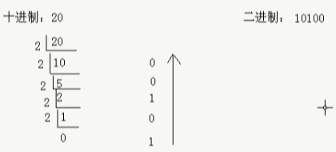

# Java语法

## 一、注释

注释是解释说明程序的文字，提高程序的阅读性，要养成**先写注释，提现思路，再写代码，实现思路**的注解思想，注解分为三类

* 单行注解：`// xxx`

* 多行注解：`/* xxx */`

* 文档注解：`/** xxx */`

  

> 编译器生成字节码之前会将注解抹去，所以字节码中不含注解

## 二、关键字

关键字指被JAVA语言赋予**特定含义**的单词，字母全部小写，高级记事本对关键字有不同颜色的标记

> `goto`和`const`是保留字

关键字无需记忆，有印象即可


## 三、字面量

字面量告诉程序员数据在程序中的书写格式，分为以下几种

|    类型    |          说明          |    举例     |
| :--------: | :--------------------: | :---------: |
|  整数类型  |    不带小数点的数字    |  666、888   |
|  小数类型  |     带小数点的数字     | 13.4、14.3  |
| 字符串类型 |   双引号括起来的内容   | "HelloJava" |
|  字符类型  | 单引号括起来的一个内容 |  'A'、'B'   |
|  布尔类型  |    布尔值，表示真假    | true、false |
|   空类型   |       特殊值，空       |    null     |

## 四、变量

### 1.格式

变量指在一定范围内发生改变的量，定义格式是`数据类型 变量名 = 初始值;`

### 2.数据类型

Java是强类型语言，每种类型定义了不同大小的内存空间，所占空间大小不随硬件变化而变化，注意不要超过数据范围


### 3.标识符

标识符是JAVA起名字时使用的字符序列，由`英文大小写字母`、`数字字符`、`$`、`_`组成，注意**不能以数字开头、不能是关键字、严格区分大小写**，常见的命名规则如下

- 包：`com.公司名.xxx`
- 类或接口：`OneTwo`
- 方法或变量：`oneTwo`
- 常量：`ONE_TWO`

### 4.键盘录入

Java帮助我们写好一个类`Scanner`可以接收键盘录入，分为以下几步


接收数据的类型有如下几种

* 整数：`int x = sc.nextInt();`
* 浮点型：`double x = sc.nextDouble();`
* 字符串：`String s = sc.nextLine();`

其中注意若先输入整数，回车后再输入字符串类型，则真正需要的字符串类型会被结束的回车覆盖，怎么解决呢？

* 先写字符串类型再写整数型
* 整数型输入语句后加上`sc.nextLine()`接收回车，再进行字符串类型的输入

## 五、计算机数据存储规则

### 1.进制

#### 1.1.进制由来

**任意数据都以二进制的形式存储在计算机中**，什么是二进制？


#### 1.2.进制表示

二进制：由`0、1`组成，`0b`开头

八进制：由`0、1、2、3、4、5、6、7`组成，`0`开头

十进制：由`0、1、2、3、4、5、6、7、8、9`组成

十六进制：由`0、1、2、3、4、5、6、7、8、9、a、b、c、d、e、f`组成，`0x`开头

#### 1.3.进制转换

**其他进制到十进制**：`系数 * 基数的权次幂 之和`


**十进制到其他进制**：除基数取余，直到商为0，余数反转



**8421码进制转换的快速转换法**：每个二进制位上的数据对应一个固定的值，只需要把对应位置的数据值相加即可


**任意进制的转换**：`x进制 -> 十进制 -> y进制`或拆分组合法


#### 1.4.有符号数的表示法(原反补)

原码：最高位为符号位，0表示正，1表示负；其他为数值位


反码：正数原码和反码相同，负数在原码基础上数值位取反


补码：正数原码、反码和补码相同，负数在反码基础上加1


原码反码补码相关例题


### 2.数据存储

计算机中一般存在三类数据，即**文本数据、图片数据、声音数据**，**任意数据都以二进制的形式存储在计算机中**

#### 2.1.文本数据

文本数据分为**数字、字母和汉字**


其中ASCII表如下，常用的`'a':97`、`'A':65`、`'0':48`


不同编码方式如下


#### 2.2.图片数据

图片数组分为**黑白图、灰度图和彩色图**，说到图片就想到**分辨率、像素、三原色**三个概念，那么他们分别是什么呢？

------

常见的分辨率有如下几种


以`1920x1080`为例，也就是说宽有1920个小格子，高有1080个小格子，那么整个显示器由这些小格子组成


------

每个小方格表示一个像素，为窗口设置大小以像素为单位


------

三原色分为美学三原色和光学三原色，计算机使用光学三原色


通过调和三原色的比例来得到不同的颜色


还可以通过十六进制进行调和


------

黑白图以像素点为单位，0或1表示有无颜色填充


灰度图同样以像素点为单位，使用灰度表数值填充像素点的灰度


彩色图还是以像素点为单位，在每个像素点内由光学三原色调和后填充


#### 2.3.声音数据

声音实际和声波有关，存储声音时会对声波采样，每个声波对应数字


那么某些音乐软件中的音质选择是怎么实现的呢？如果你氪金了，那么我会使用密集的点记录声波，进行最大程度的还原；没氪金，那么我会使用稀疏的点记录声波


#### 2.4.总结

通过学习，我们知道文本数据、图片数据、声音数据是如何存储的，那么视频数据呢？视频不就是由图片和声音组成嘛！

所以**任意数据都以二进制的形式存储在计算机中**

## 六、运算符

### 1.算术运算符

#### 1.1.基本使用


其中注意**整数相除只可以得到整数**，将任意操作数变成浮点数，即乘1.0可得小数


#### 1.2.高级使用(+)

数字相加：相同类型的数字才能相加，那么就涉及到类型转换的问题，类型转换又分为大变小、小变大

* **默认类型转换(自动类型提升)**，顾名思义小变大，且无需手动提升，由系统完成，转换顺序为`byte,short,char -> int -> long -> float -> double`

  * 取值范围不一样的数做运算时，小的会先提升为大的再运算

    

  * `byte,short,char`参与运算时，会直接提升为`int`再运算

    

    

  * `boolean`不参与转换

* **强制类型转换**，由大转小，格式为`目标类型 变量名 = (目标类型)被转换的数据`，不要随意使用强制转换，隐含精度损失问题

  

关于类型转换请思考以下几个问题

①

②

③

④

字符串相加

* 当`+`操作中出现字符串时，此时`+`为字符串连接符，而不是算数运算符了


* 连续`+`操作，从左到右逐个执行

  

* 练习：看代码写结果

  

字符相加：类型提升时提到，`byte,short,char`参与运算时，会直接提升为`int`再运算，所以存在以下规则

* 当`字符+字符`、`字符+数字`时，会先通过ASCII表查询相应的数字再计算

  

最后再看一个练习题


### 2.自增自减运算符


自增自减运算符可以写在变量前后，二者是不同的，**`++`在前先`++`再执行，`++`在后先执行再`++`**


`++`、`--`的运算对象可以为`char`型变量、`int`型变量和`float`型变量，但**不可以是常量**，`10++`是不行的

### 3.赋值运算符


请思考以下这个问题，其实**扩展的赋值运算符底层隐含强转**


### 4.比较运算符


比较的结果都是`boolean`类型，注意不要将`==`误写成`=`，`==`是判断，`=`是赋值

**字符串的比较不能使用`==`，而要用`equals()`**，因为`==`比较对象类型不管值相不相同，其对象指向相同即返回`true`

```java
String a1 = "a1";
String a2 = "a2";
a1==a2;//ture

String a1 = new String("a1");
String a2 = new String("a2");
a1==a2//false
    
//此处涉及常量池的问题，后面API部分讲解
```

### 5.逻辑运算符

#### 5.1.普通逻辑运算符

逻辑运算符用于连接`boolean`类型的表达式或值


#### 5.2.短路逻辑运算符

短路顾名思义就是**当左边的表达式不满足时，不再向后执行**，例如丈母娘看女婿，若女婿家需要有车有房才嫁女儿，那么如果女婿家没车，就无需再看有没有房了


短路逻辑运算符含以下几种，其中左右的表达式的结果均为`boolean`类型

* 对于`&&`，若左边表达式为`false`，则右边表达式不执行，整个表达式的结果为`false`
* 对于`||`，若左边表达式为`true`，则右边表达式不执行，整个表达式的结果为`true`


### 6.位运算符

位运算符**直接对二进制运算**，参与运算的都是补码，**正是因为位运算符都对二进制操作，所以其运算速度最快**

| 符号  |    作用    |                             说明                             |
| :---: | :--------: | :----------------------------------------------------------: |
|  `&`  |     与     |                            有0则0                            |
|  `|`  |     或     |                            有1则1                            |
|  `^`  |    异或    |            相同则0，不同则1，`a^b^b=a`，`a^b^a=b`            |
|  `~`  |    取反    |                          0取1，1取0                          |
| `<<`  |    左移    | 左边最高位丢弃，右边补齐0，相当于乘以2的n次幂，例如`1000<<2`结果为`100000` |
| `>>`  |    右移    | 最高位是0则左边补0，最高位是1则左边补1，相当于正数除以2的n次幂，例如`1000>>2`结果为`10` |
| `>>>` | 无符号右移 |                无论最高位是0还是1，左边补齐0                 |

位运算相关例题请解答


### 7.三目运算符

格式是`比较表达式?表达式1:表达式2`，比较表达式的值是`boolean`类型，若比较表达式结果是`true`，则取表达式1为三目表达式的结果，若比较表达式结果是`false`，则取表达式2为三目表达式的结果，请看如下案例


### 8.运算符优先级


