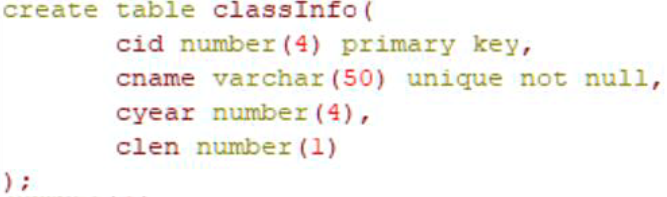

# DB基础

## 一、SQL语句

### 1.DDL数据定义语言

#### 1.1.`create`

**建库**：`create database 库名;`

**建表**：`create table 表名( 字段1 数据类型 );`

**建索引**：`alter table 表名 add index 索引名;`或`create index 索引名 on 表名(字段名);`

**建唯一索引**：`create unique index 索引名 on 表名(字段名);`

#### 1.2.`drop`

**删库**：`drop database 库名;`

**删表**：`drop table 表名;`

**删索引**：`alter table 表名 drop index 索引名;`或`drop index 索引名 on 表名;`

#### 1.3.`alter`

**添字段(列)**：`alter table 表名 add 新列名 数据类型;`

**删字段**：`alter table 表名 drop column 列名;`

**修改字段类型**：`alter table 表名 modify 列名 新数据类型;`

**重命名表名**：`alter table 表名 rename to 新表名;`

**重命名列**：`alter table 表名 rename column 旧列名 to 新列名;`

### 2.DML数据操作语言

#### 2.1.`insert`

**插入数据**：`insert into 表名(字段名..) values 值..;`

> 将表1中数据添加到表2中，存在两种情况
>
> * 表2存在时，`insert into 表2(字段..) select 列.. from 表1`，如`insert into classInfo(cid,cname) select deptno,dname from dept;`
> * 表2不存在时，`create table 表2 as select 列.. from 表1`，复制表结构但不复制数据命令是`create table 表2 as select 列.. from 表1 where 1=0`

#### 2.2.`delete`

**删所有记录**：`delete from 表名;`

**删某条记录**：`delete from 表名 where 过滤条件;`

**删所有记录且无法回滚**：`truncate table 表名;`

#### 2.3.`update`

`update 表名 set 字段=值.. [where 过滤条件];`

#### 2.4.`select`

`select 字段名.. from 表名;`

### 3.DCL数据控制语言

#### 3.1.`grant`

**给某用户或某组或所有用户设置某些特定的权限**：`grant 权限 on 数据对象 from 数据库用户名;`

#### 3.2.`revoke`

**废除某用户或某组或所有用户的访问权限**：`revoke 权限 on 数据对象 from 数据库用户名;`

> 数据对象包括表、视图、字段；权限包括insert、delete、update、select

### 4.连接查询

**连接查询通过两张表中符合连接关系的字段来建立两张表的关联**

#### 4.1.内连接Inner Join

内连接保证查询出的两个表**所有的行都满足条件**，语法格式为`select 列名  from 表1 inner join 表2 on 表1.字段=表2.字段;`，当两个表中存在相同字段时可通过内连接查询，此时相同的字段值可以被查询出来

#### 4.2.外连接

**左外连接Left Join**：以左表为主，优先查出左表中满足条件的行，右表不满足条件的行使用`null`填充，语法格式为`select 列名 from 表名1 left join 表名2 on 表1.字段=表2.字段;`

**右外连接Right Join**：以右表为主，优先查出右表中满足条件的行，左表不满足条件的行使用`null`填充，语法格式为`select 列名 from 表名1 right join 表名2 on 表1.字段=表2.字段;`

**完整外连接Full Join**：左右两个表中的数据都显示，但不满足条件的行使用`null`填充，语法格式为`select 列名 from 表名1 full join 表名2 on 表1.字段=表2.字段;`

**交叉连接Cross Join**：左右两表每一行都组合，返回的行数为笛卡尔积，即`左表行数*右表行数`，语法格式为`select 列名 from 表名1 cross join 表名2 on 表1.字段=表2.字段;`

### 5.约束

#### 5.1.主键约束

主键约束的主键唯一且非空，语法格式为`alter table 表名 add constraint 主键约束名 primary key(列名..)`

#### 5.2.外键约束

外键约束可以预防破环表之间连接的动作，防止非法数据插入外键列，语法格式为`alter table 表名 add constraint 外键约束名 foreign key(列名) references 主表名(主键名)`

#### 5.3.唯一约束

唯一约束顾名思义，语法格式为`alter table 表名 add constraint 唯一约束名称 unique(列名)`

#### 5.4.检查约束

检查约束用于约束字段值范围，语法格式为`alter table 表名 add constraint 检查约束名 check(检查条件)`

#### 5.5.非空约束

非空约束顾名思义，语法格式为`alter table 表名 modify 列名 not null`

#### 5.6.默认约束

语法格式为`alter table 表名 modify 列名 default 值`

> 行级约束
>
> 
>
> 表级约束
>
> 

## 二、视图

视图是虚拟的表，与包含的数据表不同，视图只包含使用时动态检索数据的查询，不包含任何列或数据

**视图：**

是一种虚拟的表，具有和物理表相同的功能。可以对视图进行增，改，查，操作，试图通常是有一个表或者多个表的行或列的子集。对视图的修改会影响基本表。它使得我们获取数据更容易，相比多表查询。

**游标：**

是对查询出来的结果集作为一个单元来有效的处理。游标可以定在该单元中的特定行，从结果集的当前行检索一行或多行。可以对结果集当前行做修改。一般不使用游标，但是需要逐条处理数据的时候，游标显得十分重要。

**优点：**

1对数据库的访问，因为视图可以有选择性的选取数据库里的一部分。

2)用户通过简单的查询可以从复杂查询中得到结果。

3)维护数据的独立性，试图可从多个表检索数据。

4)对于相同的数据可产生不同的视图。

**缺点：**

性能：查询视图时，必须把视图的查询转化

视图
视图的作用，视图可以更改么？
创建视图： create view xxx as xxx

使用视图可以简化复杂的sql操作，隐藏具体的细节，保护数据;
视图创建后，可以使用与表相同的方式利用它们；
视图不能被索引，也不能有关联的触发器或默认值，如果视图本身内有order by则对视图再次order by将被覆盖。
对于某些视图，例如，未使用联结子查询分组聚集函数Distinct Union等，是可以对其更新的，对视图的更新将对基表进行更新；但是视图主要用于简化检索，保护数据，并不用于更新，而且大部分视图都不可以更新

1.2 数据库设计
1、什么是三大范式？
第一范式（1NF）：字段（或属性）是不可分割的最小单元，即不会有重复的列，体现原子性

第二范式（2NF）：满足 1NF 前提下，存在一个候选码，非主属性全部依赖该候选码，即存在主键，体现唯一性，专业术语则是消除部分函数依赖

第三范式（3NF）：满足 2NF 前提下，非主属性必须互不依赖，消除传递依赖

ref：如何理解关系型数据库的常见设计范式？

除了三大范式外，还有BC范式和第四范式，但其规范过于严苛，在生产中往往使用不到。

2、什么是范式和反范式，以及各自优缺点？
范式是符合某一种级别的关系模式的集合。构造数据库必须遵循一定的规则。在关系数据库中，这种规则就是范式。

名称	优点	缺点
范式	范式化的表减少了数据冗余，数据表更新操作快、占用存储空间少。	查询时通常需要多表关联查询，更难进行索引优化
反范式	反范式的过程就是通过冗余数据来提高查询性能，可以减少表关联和更好进行索引优化	存在大量冗余数据，并且数据的维护成本更高
所以在平时工作中，我们通常是将范式和反范式相互结合使用。
