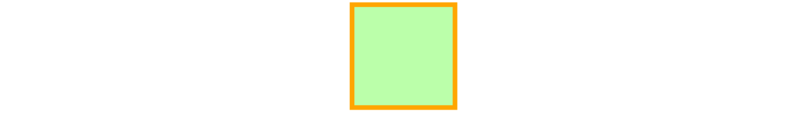
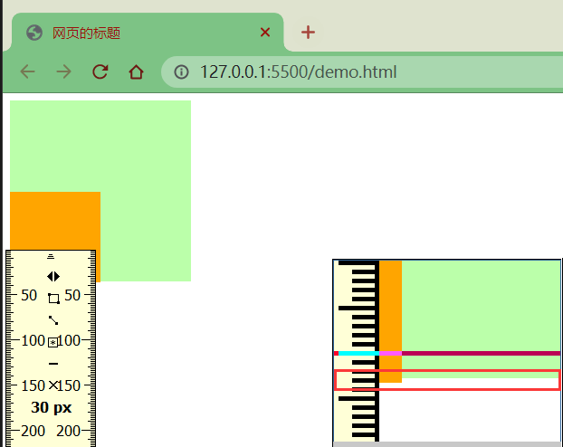

# CSS

## 一、什么是CSS？

网页实际上是一个**多层的结构**，通过CSS可以分别为网页的每一个层来设置样式，而最终我们能看到的只是网页的最上边一层，总之**CSS指层叠样式表，用来设置网页中元素的样式**，即内容与外观分离，灵活修改网页外观和同一网站的风格

## 二、CSS创建方式

### 1.行内(内联)样式

在标签内部通过`style`属性来设置元素的样式

```html
<p style="color:red;font-size:60px;">内联样式（行内样式）</p>
```

但**行内样式只能对一个标签生效**，若多个标签都需要该样式，那么则每个标签都需要复制一个，非常不方便，所以出现内部样式表和外部样式表，注意开发时绝对不要使用行内样式

### 2.内部样式表

将样式编写到`head`中的`style`标签里，然后通过CSS的选择器来选中元素并为其设置各种样式可以同时为多个标签设置样式，并且修改时只需要修改一处即可，但**内部样式只会对当前HTML起作用**，即**只对一个网页起作用**

```html
<head>
    <style>
        p{
            color: red;
        }
    </style>
</head>
```

### 3.外部样式表

可以将CSS样式编写到一个外部的CSS文件中，然后通过`link`标签来引入外部的CSS文件，外部CSS文件只需要引入就可**复用**

```html
<link rel="stylesheet" href="./style.css" type="text/css">
```

将样式编写到外部的CSS文件中，可以使用到浏览器的**缓存机制**，从而加快网页的加载速度，提高用户的体验

**优先级：行内 > 内部 > 外部 > 默认**

## 三、选择器

### 1.什么是选择器？

通过选择器可以选中页面的指定元素，为指定元素添加指定样式

### 2.通配选择器

通配选择器用于选中页面中的所有元素，语法是`*{}`

```css
*{
    color: red;
}
```

### 3.元素选择器

元素选择器也叫类型选择器、标签选择器，用于根据标签名来选中指定的元素，语法是`elementname{}`，例如`p{}`、`h1{}`、`div{}`

```css
p{
    color: red; 
}
h1{
    color: green;
}
```

### 4.类选择器

类选择器根据元素的`class`属性值选中一组元素，语法是`.classname{}`，例如`.blue{}`

```css
.blue{
    color: blue;
}
.size{
    font-size: 20px;
}
```

`class`是一个标签的属性，它和`id`类似，不同的是`class`可以重复使用，可以通过`class`属性来为元素分组，可以同时为一个元素指定多个`class`属性

### 5.ID选择器

ID选择器根据元素的`id`属性值选中一个元素，语法是`#idname{}`，例如`#box{}`、`#red{}`

```css
#red{
    color: red;
}
```

### 6.属性选择器

属性选择器根据元素的属性值选中一组元素，语法主要有如下几类

* `[属性名]`：选择含有指定属性的元素
* `[属性名=属性值]`：选择含有指定属性和属性值的元素
* `[属性名^=属性值]`：选择属性值以指定值开头的元素
* `[属性名$=属性值]`：选择属性值以指定值结尾的元素
* `[属性名*=属性值]`：选择属性值中含有某值的元素

例如`p[title]{}`、`p[title=e]{}`、`p[title^=e]{}`、`p[title$=e]{} p[title*=e]{}`

### 7.复合选择器

#### 7.1.交集选择器

交集选择器选中**同时复合多个条件的元素**，语法是`选择器1选择器2选择器3选择器n{}`，注意点交集选择器中如果有元素选择器，必须使用元素选择器开头

```css
div.red{
    font-size: 30px;
}
.a.b.c{
    color: blue;
}
```

#### 7.2.并集选择器

并集选择器**同时选择多个选择器对应的元素**，语法是`选择器1,选择器2,选择器3,选择器n{}`，例如`#b1,.p1,h1,span,div.red{}`

```css
h1,span{
    color: green;
}
```

### 8.关系选择器

#### 8.1.种类

- 父元素：直接包含子元素的元素叫做父元素
- 子元素：直接被父元素包含的元素是子元素
- 祖先元素：直接或间接包含后代元素的元素叫做祖先元素；一个元素的父元素也是它的祖先元素
- 后代元素：直接或间接被祖先元素包含的元素叫做后代元素；子元素也是后代元素
- 兄弟元素：拥有相同父元素的元素是兄弟元素

#### 8.2.子元素选择器

子元素选择器选中指定父元素的指定子元素，语法是`父元素 > 子元素{}`，例如`A > B{}`

```css
div.box > p > span{
    color: orange;
}
```

#### 8.3.后代元素选择器

后代元素选择器选中指定元素内的指定后代元素，语法是`祖先 后代{}`，例如`A B{}`

```css
div span{
    color: skyblue;
}
```

#### 8.4.兄弟元素选择器

兄弟元素选择器选择下一个兄弟，语法是`前一个 + 下一个{}`、`前一个 ~ 下一组{}`，例如`A1 + A2{}`、`A1 ~ An{}`

```css
p + span{	/*p相邻标记span*/
    color: red;
}
p ~ span{	/*p与下一个标记span，中间可包含其他标记*/
    color: red;
}
```

### 9.伪类选择器

伪类即为不存在的类，特殊的类，伪类用来描述一个元素的特殊状态，比如第一个子元素、被点击的元素、鼠标移入的元素.…，伪类一般情况下都是使用`:`开头

- `:first-child` 第一个子元素
- `:last-child` 最后一个子元素
- `:nth-child(n)` 选中第n个子元素，n的范围0到正无穷
  - 2n或even：选中偶数位的元素
  - 2n+1或odd：选中奇数位的元素

* `:first-of-type` 同类型中的第一个子元素

* `:last-of-type` 同类型中的最后一个子元素

* `:nth-of-type()` 选中同类型中的第n个子元素

* `:not()` 否定伪类，将符合条件的元素从选择器中去除

  ```css
  /* ul下所有li，黑色 */
  ul>li {
      color: black;
  }
  /* ul下第偶数个li，黄色 */
  ul>li:nth-child(2n) {
      color: yellow;
  }
  /* ul下第奇数个li，绿色 */
  ul>li:nth-child(odd) {
      color: green;
  }
  /* ul下第一个li，红色 */
  ul>li:first-child {
      color: red;
  }
  /* ul下最后一个li，黄色 */
  ul>li:last-child {
      color: orange;
  }
  ```

  

* `:link` 未访问的链接

* `:visited` 已访问的链接

  - 由于隐私的原因，所以`visited`这个伪类只能修改链接的颜色

* `:hover` 鼠标悬停的链接

* `:active` 鼠标点击的链接

  ```css
  /* unvisited link */
  a:link {
    color: red;
  }
  /* visited link */
  a:visited {
    color: yellow;
  }
  /* mouse over link */
  a:hover {
    color: green;
  }
  /* selected link */
  a:active {
    color: blue;
  }
  ```

  

### 10.伪元素选择器

伪元素表示页面中一些特殊的并不真实的存在的元素，伪元素使用`::`开头

* `::first-letter` 表示第一个字母

* `::first-line` 表示第一行

* `::selection` 表示选中的内容

* `::before` 元素的开始

* `::after` 元素的最后

  * ::before和::after 必须结合content属性来使用

  ```css
  /* 段落首字母设置大小为30px */
  p::first-letter{
      font-size: 30px;
  }
  /* 段落第一行设置为黄色背景 */
  p::first-line{
      background-color: yellow;
  }
  /* 段落选中的部分变绿色 */
  p::selection{
      background-color: green；
  }
  /* div前加上内容 */
  div::before{
      content: 'BEFORE';
      color: red;
  }
  /* div后加上内容 */
  div::after{
      content: 'AFTER';
      color: blue;
  }
  ```

  

### 11.选择器优先级

当我们通过不同的选择器选中相同的元素，并且为相同的样式设置不同的值时，此时就发生了样式的冲突，发生样式冲突时用哪个样式由选择器的权重(优先级)决定选择器的权重，如果优先级计算后相同，此时则优先使用靠下的样式

|     选择器     |    权重    |
| :------------: | :--------: |
|    内联样式    | 1, 0, 0, 0 |
|    ID选择器    | 0, 1, 0, 0 |
| 类和伪类选择器 | 0, 0, 1, 0 |
|   元素选择器   | 0, 0, 0, 1 |
|   通配选择器   | 0, 0, 0, 0 |
|   继承的样式   | 没有优先级 |

可以在某一个样式的后边添加`!important`，则此时该样式会获取到最高的优先级，甚至超过内联样式，注意在开发中一定要慎用！

```css
<style>
    #box1{
        background-color: orange;
    }
    div{
        background-color: yellow;
    }
    .red{
        background-color: red;
    }
</style>

<div id="box1" class="red" style="background-color: skyblue;">选择器的权重</div>
```


## 四、长度单位

### 1.像素

显示器屏幕实际上是由一个一个的小点构成的，小点即单位色块，即像素，`分辨率 = 水平方向像素 * 垂直方向像素`


### 2.屏幕分辨率

例如屏幕分辨率是1920×1080，则该屏幕水平方向有1920个像素，垂直方向有1080个像素，不同屏幕的像素大小是不同的，也就是说像素大小不像我们现行的长度单位那样有着固定的国际标准，所以**同样的像素大小在不同的设备上显示效果是不一样的，像素越小的屏幕显示的效果越清晰**

### 3.图像分辨率

例如图片分辨率是300x200，则该图片在屏幕上按1:1缩放时，水平方向有300个像素，垂直方向有200个像素点，图片分辨率越高，1:1缩放时面积越大；图片分辨率越低，1:1缩放时面积越小，**同一台设备像素大小是不变的，那把图片放大超过100%时占的像素点就多了，但是图像也会变得模糊**


### 4.百分比

也可以将属性值设置为相对于其父元素属性的百分比，可以**使子元素跟随父元素的改变而改变**

### 5.em

em是**相对于元素的字体大小来计算的**，`1em = <self>.font-size`，也就说em值会根据元素本身的字体大小的改变而改变

### 6.rem

rem是**相对于根元素的字体大小来计算**，`1em = <root>.font-size`，也就说em值会根据根元素的字体大小的改变而改变

```html
<style>
    * {
        font-size: 24px;
    }
    
    .box1{
        width: 200px; 
        height: 200px;
        background-color: orange;
    }

    .box2{
        width: 50%; 
        height: 50%; 
        background-color: aqua;
    }
    
    .box3{
        font-size: 20px;
        width: 10em;
        height: 10em;
        background-color: greenyellow;
    }
    
    .box4 {
        font-size: 20px;
        width: 10rem; /*当时用rem时，不管怎么改本元素的font-size都是不会变的。需要定义root元素的font-size才可以 */
        height: 10rem;
        background-color: red;
    }
</style>

<div class="box1">
    <div class="box2"></div>
</div>

<div class="box3"></div>

<div class="box4"></div>
```


## 五、颜色单位

在介绍CSS的颜色单位之前，我们首先来了解下光的三原色，因为CSS的颜色单位就是按照光的三原色来调和的

> 科普下光的三原色和颜料的三原色的区别
>
> * **颜料三原色**(CMYK)：品红、黄、青(天蓝)，色彩三原色可以混合出所有颜料的颜色，同时相加为黑色，黑白灰属于无色系
> * **光学三原色**(RGB)：红、绿、蓝(靛蓝)，光学三原色混合后组成显示屏显示颜色，三原色同时相加为白色，白色属于无色系中的一种

### 1.RGB

RGB通过三原色的不同浓度来调配出不同的颜色，语法是`RGB(red, green, blue)`，范围在0 ~ 255(0% ~ 100%)之间

RGB还存在一种十六进制写法，语法为`#RRGGBB`，颜色的范围在00 ~ ff 之间，如果颜色两位两位重复可以进行简写，如`#aabbcc => #abc`

### 2.RGBA

RGBA就是在RGB的基础上增加了一个A表示不透明度，`1`表示完全不透明，`0`表示完全透明，`.5`半透明

## 六、盒模型

### 1.文档流

网页是一个多层的结构，通过CSS可以分别为每一层来设置样式，作为用户来讲只能看到最顶上一层，**层中最底下一层称为文档流**

文档流是网页的基础，我们所创建的元素默认都是在文档流中进行排列，元素一般存在两个状态，即在文档流中和不在文档流中(脱离文档流)，那么元素为什么需要在文档流中呢？

### 2.盒子模型

网页设计中常听的属性名**内容(content)、内边距(padding)、边框(border)、外边距(margin)**， CSS盒子模型都具备这些属性

CSS将页面中的所有元素都设置为了一个矩形的盒子，将元素设置为矩形的盒子后，对页面的布局就变成将不同的盒子摆放到不同的位置

每个盒子由内容(content)、内边距(padding)、边框(border)、外边距(margin)组成，如下图


#### 2.1.内容区

元素中的所有的子元素和文本内容都在内容区中，`width`和`height`设置排列内容区的宽度和高度

```css
.box1{
    width: 200px; 
    height: 200px; 
    background-color: #bfa;
}
```


#### 2.2.边框

边框属于盒子边缘，边框里边属于盒子内部，出了边框都是盒子的外部，**边框的大小会影响到整个盒子的大小**

- `border-width` 边框的宽度，默认3px
  - `border-top-width` 上边框的宽度
  - `border-right-width` 右边框的宽度
  - `border-bottom-width` 下边框的宽度
  - `border-left-width` 左边框的宽度
- `border-color` 边框的颜色，默认使用color的颜色值
  - `border-top-color` 上边框的颜色
  - `border-right-color` 右边框的颜色
  - `border-bottom-color` 下边框的颜色
  - `border-left-color` 左边框的颜色
- `border-style` 边框的样式，没有默认值
  - `border-top-style` 上边框的样式
  - `border-right-style` 右边框的样式
  - `border-bottom-style` 下边框的样式
  - `border-left-style` 左边框的样式

```css
.box1{
    border-width: 10px;
    border-color: red;
    /* 
    	solid  实线 
    	dotted 点状虚线 
    	dashed 虚线 
    	double 双线 
    */
    border-style: solid;
}
```


以上几种边框的样式或其他衍生出来的写法都可以指定各个方向边框的情况，设定几个值就决定了对应方向的宽度、颜色或样式

- 四个值：`上 右 下 左`
- 三个值：`上 左右 下`
- 两个值：`上下 左右`
- 一个值：`上下左右`

以上顺序不用死记，记住**其顺序是按顺时针方向设置的，剩下的可以由矩形的对称性推导出来**

以上边框样式的设置关键字可简写成如下几种，关键字内的值没有顺序

- `border-top` 上边框的宽度、颜色和样式
- `border-right` 右边框的宽度、颜色和样式
- `border-bottom` 下边框的宽度、颜色和样式
- `border-left` 左边框的宽度、颜色和样式

```css
.box1{ 
	border: 10px red solid;
}
```

#### 2.3.内边距

内边距也叫填充，是内容区和边框之间的空间

- `padding-top` 上内边距
- `padding-right` 右内边距
- `padding-bottom`下内边距
- `padding-left` 左内边距

**内边距的设置会影响到盒子的大小，背景颜色会延伸到内边距上**

```html
<style>
    .outer{
        width: 200px;
        height: 200px;
        border: 10px orange solid;
        padding-right: 100px;
        padding-bottom: 100px;
        padding-left: 100px;
    }

    .inner {
        width: 200px;
        height: 200px;
        background-color: greenyellow;
    }
</style>

<div class="outer">
    <div class="inner"></div>
</div>
```


可以看出，当内外`div`宽度和高度一样时，由于`outer`设置了一个`padding`属性，其盒子大小被撑大了

盒子可见框的大小，由内容区、内边距和边框共同决定，所以在计算盒子大小时，需要将这三个区域加到一起计算

#### 2.4.外边距

外边距也叫空白边，位于盒子的最外围，是添加在边框外周围的空间，空白边使盒子之间不会紧凑地连接在一起，是CSS布局的一个重要手段，**外边距的大小不会影响可见框的大小**，但是外边距会影响盒子的位置和占用空间

- `margin-top` 上外边距，设置正值元素自身向下移动，设置负值元素自身向上移动
- `margin-right` 右外边距，设置正值其右边的元素向右移动，设置负值其右边的元素向左移动，但上述说法并不准确，对于块元素设置`margin-right`不会产生任何效果
- `margin-bottom` 下外边距，设置正值其下边的元素向下移动，设置负值其下边的元素向上移动，但对于块元素会存在垂直方向上的边距重叠问题
- `margin-left` 左外边距，设置正值元素自身向右移动，设置负值元素自身向左移动

**我们设置的左和上外边距则会移动元素自身，而设置下和右外边距会移动其他元素**

```css
.box1 {
    width: 200px;
    height: 200px;
    background-color: #bfa;
    border: 10px orange solid;

    margin-top: 100px;
    margin-right: 100px;
    margin-bottom: 100px;
    margin-left: 100px;
}
```


### 3.块元素

块元素会在页面中独占一行，**默认宽度是父元素的全部**，即把父元素撑满，**默认高度是被内容撑开的**，即高度就是子元素的高度

### 4.行内元素

行内元素**不会独占页面的一行**，只占自身的大小，**默认宽度和高度都是被内容撑开，不支持设置高度和宽度，设了高度和宽度也没用，不会生效**

行内元素在页面中左向右水平排列，如果一行之中不能容纳下所有的行内元素，则元素会换到第二行继续自左向右排列

行内元素不支持设置高度和宽度，即使设置也是无效的

#### 4.1.行内元素设置padding

```css
.s1 {
    /* 下方的div元素并没有因span设置了padding属性，而受到位置上的影响 */
    padding: 100px;
    background-color: yellow;
}

.box1 {
    width: 200px;
    height: 200px;
    background-color: #bfa;
}
```


#### 4.2.行内元素设置border

行内元素可以设置`border`，垂直方向的`border`不会影响页面的布局

```css
.s1 {
    border: 10px orange solid;
    background-color: yellow;
}

.box1 {
    width: 200px;
    height: 200px;
    background-color: #bfa;
}
```


#### 4.3.行内元素设置margin

行内元素可以设置`margin`，垂直方向的`margin`不会影响页面的布局

```css
.s1 {
    margin: 100px;
    background-color: yellow;
}

.box1 {
    width: 200px;
    height: 200px;
    background-color: #bfa;
}
```


#### 4.4.行内元素设置display

`display`用来设置元素显示的类型

- `inline`将元素设置为**行内元素**，不可为其设置宽高，大小靠元素撑起来
- `block`将元素设置为**块元素**，可以为其设置宽高，独占一行

```css
.s1 {
    margin: 100px;
    background-color: yellow;
    /* 将行内元素设置为块元素 */
    display: block; 
}
```


- `inline-block`将元素设置为**行内块元素**行内块，既可以设置宽度和高度又不会独占一行

```css
.s1 {
    margin: 100px;
    background-color: yellow;
    /* 将行内元素设置为行内块元素，兼顾行内元素和块元素的特点 */
    display: inline-block; 
}
```


- `table`将元素设置为一个表格
- `none`元素不在页面中显示，**原来属于s1的位置也没有了**，`visibility`解决

```css
.s1 {
    margin: 100px;
    background-color: yellow;
    /* 将行内元素设置为none：不显示 */
    display: none; 
}
```


#### 4.5.visibility设置元素的显示状态

- `visible`默认值，元素在页面中正常显示
- `hidden`元素在页面中隐藏不显示，但是**依然占据页面的位置**

```css
.s1 {
    margin: 100px;
    background-color: yellow;
    display: block;
    visibility: hidden; 
}
```


### 5.盒子大小box-sizing

默认情况下，盒子可见框的大小由内容区、内边距和边框共同决定，`width`和`height`指的是内容区、内边距和边框的总大小，`box-sizing`用来设置盒子尺寸的计算方式

```css
.box {
    width: 200px;
    height: 200px;
    background-color: yellow;
    border: 10px red solid;
    /* box-sizing: content-box; */
    box-sizing: border-box;
}
```

* `content-box`默认值，宽度和高度用来设置内容区的大小


* `border-box` 宽度和高度用来设置整个盒子可见框的大小


### 6.轮廓outline

`outline`用来设置元素的轮廓线，用法和`border`一模一样，但轮廓和边框不同点是**轮廓不会影响到可见框的大小**

①边框

```css
.box {
    width: 200px;
    height: 200px;
    background-color: yellow;
    border: 10px red solid;
}
```


②轮廓

```css
.box {
    width: 200px;
    height: 200px;
    background-color: yellow;
}

.box:hover {
    outline: 10px red solid;
}
```


## 七、水平方向布局

### 1.水平布局

元素在其父元素中水平方向的位置由`margin-left`、`border-left`、`padding-left`、`width`、`padding-right`、`border-right`、`margin-right`属性共同决定

一个元素在其父元素中，水平布局必须要满足等式`margin-left + border-left + padding-left + width + padding-right + border-right + margin-right = 其父元素的宽度`，以上等式必须满足，如果相加结果使等式不成立则称为**过渡约束**

### 2.过渡约束

若出现过度约束，浏览器会怎么办呢？

若七个值中没有`auto`，则浏览器会自动调整`margin-right`值以使等式满足，比如`100 + 0 + 0 + 200 + 0 + 0 + 0 = 800 ==> 100 + 0 + 0 + 200 + 0 + 0 + 500 = 800`

这七个值中有三个值可以设置为`auto`，即`width`、`margin-left`、`maring-right`，如果这七个值中有`auto`的情况，则会自动调整`auto`值以使等式成立

* 如果某个值为`auto`，则会自动调整`auto`的那个值以使等式成立
  * `200 + 0 + 0 + auto + 0 + 0 + 200 = 600 ==> 200 + 0 + 0 + 400 + 0 + 0 + 200 = 800`
  * `auto + 0 + 0 + 200 + 0 + 0 + 200 = 600 ==> 400 + 0 + 0 + 200 + 0 + 0 + 200 = 800`
  * `200 + 0 + 0 + 200 + 0 + 0 + auto = 600 ==> 200 + 0 + 0 + 200 + 0 + 0 + 400 = 800`

* 如果宽度为`auto`，则宽度会调整到最大，其他`auto`的外边距会自动设置为0
  * `auto + 0 + 0 + auto + 0 + 0 + 200 = 600 ==> 0 + 0 + 0 + 600 + 0 + 0 + 200 = 800`
  * `200 + 0 + 0 + auto + 0 + 0 + auto = 600 ==> 200 + 0 + 0 + 600 + 0 + 0 + 0 = 800`
  * `auto + 0 + 0 + auto + 0 + 0 + auto = 600 ==> 0 + 0 + 0 + 800 + 0 + 0 + 0 = 800`

* 如果外边距都为`auto`，则`auto`的外边距会自动均分以使等式成立
  * `auto + 0 + 0 + 200 + 0 + 0 + auto = 600 ==> 300 + 0 + 0 + 200 + 0 + 0 + 300 = 800`

```html
<style>
    .box1 {
        width: 200px;
        height: 200px;
        background-color: #bfa;
        border: 10px orange solid;
        /* 下列条件等价于 margin: 0 auto */
        margin-left: auto;
        margin-right: auto;
    }
</style>
<div class="box1"></div>
```



## 八、垂直方向布局

### 1.元素溢出

子元素是在父元素的内容区中排列的，**如果子元素的大小超过了父元素，则子元素会从父元素中溢出**，使用`overflow/overflow-x/overflow-y`属性来设置父元素如何处理溢出的子元素，可选值为`visible/hidden/scroll/auto`

* `visible` 溢出内容会在父元素外部位置显示，默认值
* `hidden` 溢出内容会被裁剪，不会显示
* `scroll` 生成两个滚动条，通过滚动条来查看完整的内容
* `auto` 根据需要生成滚动条

```html
<style>
    .box1 {
        width: 200px;
        height: 200px;
        background-color: #bfa;
        overflow: auto;/*依次修改值visible-hidden-scroll-auto，其效果如下图*/
    }
</style>
<div class="box1">
    Lorem ipsum dolor sit amet consectetur adipisicing elit. Asperiores aspernatur illo inventore
    deleniti laudantium quaerat excepturi sed quidem tempore? Eaque, cumque porro. Fuga quam error cupiditate quasi
    eveniet in numquam!
</div>
```


### 2.边距折叠

相邻的**垂直方向外边距**会发生重叠现象

#### 2.1.兄弟元素边距折叠

**兄弟元素间的相邻，垂直外边距会取两者之间的较大值，若一正一负则取两者之间的和**，但请看如下实例图，两者都为正，按理说两者间的距离应该为100，为什么会是125？？这就和页面缩放比例有关系了，**兄弟元素之间的外边距的重叠对于开发是有利的，所以我们不需要进行处理**

```css
.box1,.box2{ 
    width:200px; 
    height:200px; 
    font-size:100px;
}

.boxl{
    background-color: #bfa;
    /*设置一个下外边距*/
    margin-bottom: 100px;
}

.box2{
    background-color: orange;
    /*设置一个上外边距*/
    margin-top: 100px;
}
```


#### 2.2.父子元素边距折叠

**父子元素间相邻外边距，子元素会传递给父元素**，父子外边距的折叠会影响到页面的布局，必须要进行处理

```css
.box3{
width：200px;
    height:200px;
    background-color: #bfa;
}

.box4{
    width: 100px; 
    height: 100px;
    background-color: orange; 
    /* margin-top: 100px; */
}
```


父子元素边界重叠问题如何处理？？

* 处理方式一

  * 转换思路，通过改变父元素的内top边距，但这样虽然位置正确了，但是高度却被撑大了

  ```css
  .box3 {
      width: 200px;
      height: 200px;
      background-color: #bfa;
      padding-top: 100px; /* 不调整子元素的margin，而是转而调整父元素的padding */
  }
  
  .box4 {
      width: 100px;
      height: 100px;
      background-color: orange;
      /* margin-top: 100px; */
  }
  ```

  

  * 计算并手动调整父元素高度

  ```css
  .box3 {
      width: 200px;
      height: 100px; /* height: 200px; */
      background-color: #bfa;
      padding-top: 100px; 
  }
  
  .box4 {
      width: 100px;
      height: 100px;
      background-color: orange;
  }
  ```

  

* 处理方式二

  * 仍然保留子元素的`margin-top`属性，但是给父元素加一个上边框，由于`1px`的边框，所以父元素盒子的高度也增加了`1px`

  ```css
  .box3 {
      width: 200px;
      height: 200px;
      background-color: #bfa;
      border-top: 1px rebeccapurple solid; /* 在父元素上加一个border-top（上边框） */
  }
  
  .box4 {
      width: 100px;
      height: 100px;
      background-color: orange;
      margin-top: 100px; /* 不删除，保留 */
  }
  ```

  

  * 手动调整父元素的高度，同时让边框颜色与父元素盒子颜色保持一致，But子元素也往下移动了`1px`的距离

  ```css
  .box3 {
      width: 200px;
      height: 199px; /* height: 200px; */
      background-color: #bfa;
      border-top: 1px #bfa solid; 
  }
  
  .box4 {
      width: 100px;
      height: 100px;
      background-color: orange;
      margin-top: 100px;
  }
  ```

  

### 3.脱离文档流

上述处理方式二中，加入上边框则子元素的外边距不在传递给父元素，这是为什么？应该是`border`让元素脱离了文档流，即`margin`塌陷

> `margin`子元素远离父元素边框，如果父盒子没有设置`border`，那么他的子元素无法利用`margin-top`来远离父元素的上边框，而是使子元素和父元素一起往下移动


```
帮助文档自查

font:组合规则
font_size:单个规则

text-align:对齐方式
text-decoration:划线
text-indent:首行缩进
text-shadow:阴影
	（ 颜色 水平 垂直 模糊效果距离）

line-height:行高

letter-spacing:字符字符间间距

white-space:nowrap;不换行

color:字体颜色

vertical-align:文字与图片的相对距离

list-style-type: none；去除黑点

cursor: crosshair：鼠标样式
------------------------------------------------------------	
background:背景
background-image:url(...)
background-position:
					1.小图标铺不满容器的--可以设置图片位置
					2.大图片(如雪碧图)铺满甚至超过容器的--设置图片的偏移量
background:url("../img/news.gif") no-repeat  scroll 0 0 transparent
	图片--铺排--随对象内容滚动还是固定--背景图像位置--背景色透明
------------------------------------------------------------	
容器水平居中：
	设置body(需要居中的)的width ＋ margin:0px auto;
文本水平居中：
	text_align:center;
文本垂直居中
	设置容器height ＋ line-height设置行高（一般容器默认和文本一样大）
....


position
    relative:相对定位
        1.相对于自己的初始位置
        2.定位后空间不释放
    absolute:绝对定位
        1.相对于最近relative的祖先元素，若无则相对于body
        2.定位后空间释放
    fixed:固定定位---页面左右侧的小广告
        1.位置相对于可视页面
        2.定位后空间释放
    static:默认
可以设置left right top...


float：浮动及脱离文本流，释放所占空间
      left right none    
      浮动与不浮动可以覆盖，但文字会在浮动周围
      父元素中元素都浮动则导致父元素塌陷
      
clear:both--清除左右浮动
```


