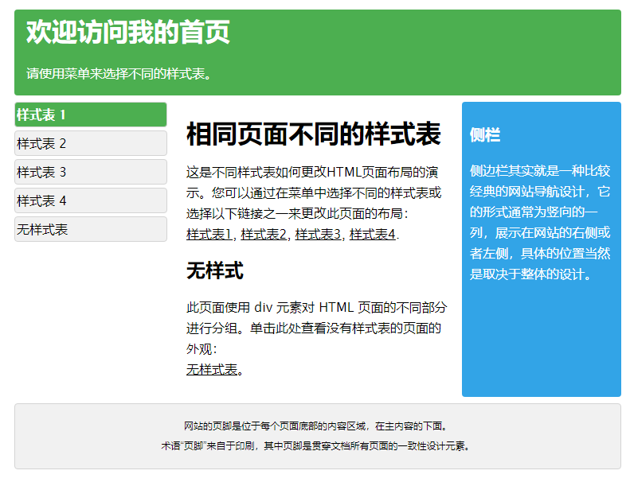
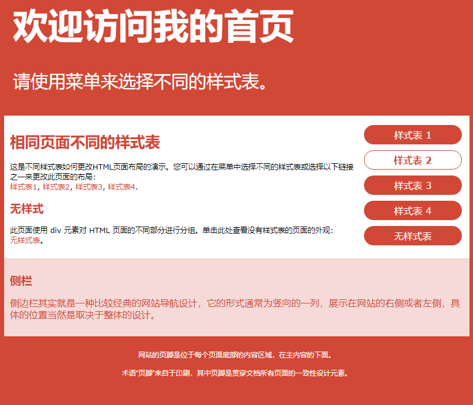
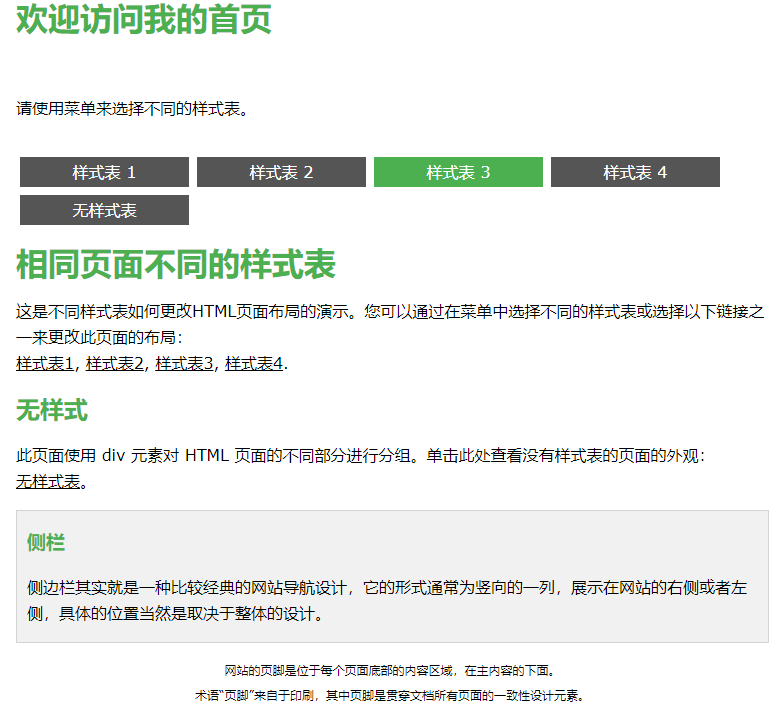
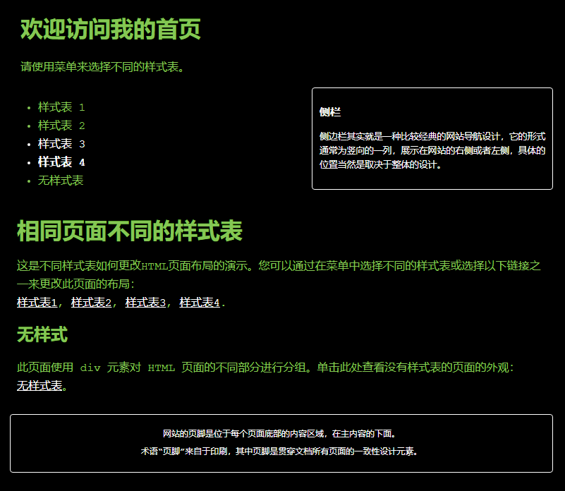

# HTML+CSS练习

## 一、效果图









## 二、clearall.css

用于清除浏览器的默认样式

```css
html,
body,
div,
span,
applet,
object,
iframe,
h1,
h2,
h3,
h4,
h5,
h6,
p,
blockquote,
pre,
a,
abbr,
acronym,
address,
big,
cite,
code,
del,
dfn,
em,
img,
ins,
kbd,
q,
s,
samp,
small,
strike,
strong,
sub,
sup,
tt,
var,
b,
u,
i,
center,
dl,
dt,
dd,
ol,
ul,
li,
fieldset,
form,
label,
legend,
table,
caption,
tbody,
tfoot,
thead,
tr,
th,
td,
article,
aside,
canvas,
details,
embed,
figure,
figcaption,
footer,
header,
hgroup,
menu,
nav,
output,
ruby,
section,
summary,
time,
mark,
audio,
video {
	margin: 0;
	padding: 0;
	border: 0;
	font-size: 100%;
	font: inherit;
	vertical-align: baseline;
}


/* HTML5 display-role reset for older browsers */

article,
aside,
details,
figcaption,
figure,
footer,
header,
hgroup,
menu,
nav,
section {
	display: block;
}

body {
	line-height: 1;
}

ol,
ul {
	list-style: none;
}

blockquote,
q {
	quotes: none;
}
blockquote:before,
blockquote:after,
q:before,
q:after {
	content: '';
	content: none;
}

table {
	border-collapse: collapse;
	border-spacing: 0;
}
```

## 三、mycss0.css

```css
.container{/*body*/
	background: white;


	/*自适应不用设置大小    大小跟随屏幕动*/
}
#top{
	margin-top: 16px;
	background: green;
	padding:15px;
}
#top h1{
	margin-top: 12px;
	color: white;
	font-weight: bold;
}
#top p{
	display: block;
	margin-top: -30px;
	color: white;
}


#menubar{/*div*/
	float: left;
	width:20%;
}
#menulist{/*ul*/
	list-style-type: none;
	text-align: left;
	width:100%;
	padding-top: 2px;
}
.menuitem{/*li*/
	background: lightgray;
	margin-top: 4px;
	border: 1px solid lightslategrey;
	padding-top:6px;
	margin-left: -39px;
	height: 23px;
	width:100%;
}

#main{
	float: left;
	width: 57%;
	background: white;
	margin: 0px 10px;
	margin-bottom: 10px;
}
#main h1{
	margin-top: 30px;
	font-weight: bold;
	margin-left: 10px;
	margin-right: 10px;
}
#main p{
	margin:0px 10px;
	line-height: 23px;
	border-radius: 4px;
}
#main p a{
	color: black;
}
#main p a:hover{
	color: green;
}
#main h2{
	font-weight: bold;
	margin-left: 10px;
	margin-right: 10px;
}

#sidebar{
	float: right;
	background: skyblue;
	width: 20%;
	margin-top: 10px;
	padding-bottom: 10%;
	margin-bottom: 10px;
}
#sidebar h3{
	margin-left: 10px;
	color: white;
	font-weight: bold;
}
#sidebar p{
	margin-left: 10px;
	color: white;
}
   
   


#bottom{
	clear: both;
	background: saddlebrown;
	border: 1px solid lightslategrey;
	padding-top: 16px;
	background: lightgray;
	padding-bottom: 2%;
}
#bottom p{
	text-align: center;
	line-height: 10px;
	font-size: 14px;
}


/*自适应*/
@media only screen and (max-width:800px ) {
	#sidebar{
		clear: both;
		width: 100%;
		position: relative;
		color: saddlebrown;
	}
	#main{
		width: 78%;
		margin-right:0;
		
	}
}

@media only screen and (max-width:700px ) {
	
	#menubar{/*div*/
		width:100%;
	}

	#main{
		width: 100%;
	}
	#main h1{
		margin-top: 10px;
	}
}
```

## 四、mycss1.css

```css
.container{/*body*/
	width: 100%;
	height: 100%;
	background: indianred;
	float: left;
}
#top{
	
}
#top h1{
	margin-left: 20px;
	margin-top: 20px;
	color: white;
	font-weight: bold;
}
#top p{
	margin-left: 20px;
	margin-top: -20px;
	color: white;
	font-size: 16px;
}

#menubar{/*div*/
	float: right;
	background: white;
	width: 25%;
	margin: 0px 20px;
}
#menulist{/*ul*/
	list-style-type: none;
	text-align: center;
	margin-right: -20px;
}
.menuitem{/*li*/
	background: indianred;
	margin-top: 8px;
	border: 1px solid red;
	border-radius: 20px;/*圆形边框*/
	height: 28px;
	color: white;
	font-weight: 700;
	margin-left: -40px;
	line-height: 30px;
	width: 100%;
}
.menuitem:hover{
	color: indianred;
	background: white;
}

#main{
	margin: 0px 20px;
	padding-bottom: 10px;
	background: white;
}
#main h1{
	padding-top: 20px;
	margin-left: 10px;
	color: indianred;
	font-weight: 800;
}
#main p{
	margin-left: 10px;
	margin-right: 10px;
	margin-top: -10px;
	line-height: 23px;
}
#main p a{
	color: indianred;
	text-decoration: none;
}
#main p a:hover{
	text-decoration: underline;
}
#main h2{
	margin-top: 20px;
	margin-left: 10px;
	color: indianred;
	font-weight: 800;
}

#sidebar{
	clear: both;
	margin: -20px 20px;
	background: lavenderblush;
}
#sidebar h3{
	color: indianred;
	margin-left:10px ;
	padding-top: 20px;
}
#sidebar p{
	margin-left:10px ;
	margin-right: 10px;
	margin-top: 20px;
	color: indianred;
	padding-bottom: 20px;
}
   
   


#bottom{
	clear: both;
	width: 100%;
	padding-top:10px ;
	padding-bottom: 10px;
	
}
#bottom p{
	text-align: center;
	color: white;
	font-weight: bold;
	font-size: 15px;
	line-height: 12px;
	margin-top: 20px;
	margin-left: 20px;
	margin-right: 20px;
}

/*自适应*/

@media only screen and (max-width:600px ) {
	#menubar{/*div*/
		float: none;
		background: white;
		width: auto;
	}
	#menulist{/*ul*/
		margin-left:10px;
		padding-top: 10px;
		padding-bottom: 10px;
	}
	.menuitem{/*li*/
		margin-top: 10px;
		height: 28px;
		margin-left: -40px;
		line-height: 30px;
	}
	
	
	#main{
		margin-top: -22px;
	}
}
```

## 五、mycss2.css

```css
.container{/*body*/
	background: azure;
	height: 100%;
}
#top{
	
}
#top h1{
	margin-top: 0px;
	margin-left: 10px;
	color: green;
}
#top p{
	margin-left: 10px;
	margin-top: 0px;
}


#menubar{/*div*/
	width: 100%;
	background: salmon;
}
#menulist{/*ul*/
	list-style-type: none;
	width: 100%;
}
.menuitem{/*li*/
	background: lightslategrey;
	color: white;
	float: left;
	margin-left: 10px;
	margin-top: 10px;
	padding: 8px 60px;
	text-align: center;
	height: 20px;
}
.menuitem:hover{
	
	background: green;
}

#main{
	clear: both;
	padding-top: 20px;
}
#main h1{
	margin-top: 0px;
	margin-left: 10px;
	color: green;
}
#main p{
	margin: 0px 10px;
}
#main p a{
	color: #000000;
}
#main p a:hover{
	color: green;
}
#main h2{
	margin-top: 30px;
	margin-left: 10px;
	color: green;
}

#sidebar{
	background: lightgray;
	margin: 10px 10px;
	border: 1px solid black;
	padding-bottom: 20px;
}
#sidebar h3{
	margin-top: 10px;
	margin-left: 10px;
	color: green;
}
#sidebar p{
	margin: 0px 10px;
}
   
   


#bottom{
	margin-top: 20px;
	padding-bottom: 20px;
}
#bottom p{
	text-align: center;
	line-height: 10px;
}

@media only screen and (max-width:400 ) {
	
	
	.container{/*body*/
		background: seashell;
	}	
}
```

## 六、mycss3.css

```css
*{
	color: green;
}
.container{/*body*/
	background: black;
	height: 100%;
}
#top{
	
}
#top h1{
	margin-left: 20px;
	padding-top: 20px;
}
#top p{
	margin-left: 20px;
	color: green;
	margin-top: 0px;
}


.container .wrapper{
	
}

#menubar{/*div*/
	width: 30%;
	margin-top: 10px;
	float: left;
}
#menulist{/*ul*/
}
.menuitem{/*li*/
	height: 20px;
	padding: 4px 0px;
}
.menuitem:hover{
	color: white;
}

#main{
	clear: both;
	margin-top: 20px;
}
#main h1{
	margin: 20px 20px;
	padding-top: 30px;
	
}
#main p{
	margin: 20px 20px;
}
#main p a{
	color: white;
}
#main p a:hover{
	color: green;
}
#main h2{
	margin: 20px 20px;
}

#sidebar{
	width: 40%;
	border: 1px solid white;
	float: right;
	margin-top: -420px;
	margin-right: 30px;
}
#sidebar h3{
	margin: 10px 20px;
	color: white;
}
#sidebar p{
	margin: 10px 20px;
	color: white;
}
   
   


#bottom{
	border: 1px solid white;
	margin: 20px 20px;
	margin-bottom: 40px;
	padding-bottom: 20px;
}
#bottom p{
	text-align: center;
	color: white;
	padding-top: 20px;
	line-height: 0px;
}

@media only screen and (max-width:770px ) {
	#sidebar{
		margin-top: -490px;
	}
}

@media only screen and (max-width:550px ) {
	#sidebar{
		float: none;
		margin: 20px 20px;
		width: auto;
	}
}
```

## 七、index.html

```html
<!doctype html>
<html>
	<head>
	<meta charset="utf-8">
	<title>样式表练习</title>
	
		<meta name="viewport" content="width=device-width,initial-scale=1.0" />
	
	
		<link id="mylink" type="text/css" rel="stylesheet" />
		<script>
		 	function reStyle( v ){
				if(  v==0 ){
					document.getElementById("mylink").href="css/mycss0.css";
				}else if( v==1){
					document.getElementById("mylink").href="css/mycss1.css";  
				}else if( v==2){
					document.getElementById("mylink").href="css/mycss2.css";  
				}else if( v==3){
					document.getElementById("mylink").href="css/mycss3.css";  
				}	else if( v==4){
					document.getElementById("mylink").href="";  
				}	 
			}
		</script>
	</head>
	
	<body>
		<div class="container wrapper">
			<div id="top">
			    <h1>欢迎访问我的首页</h1><br>
			    <p>请使用菜单来选择不同的样式表。</p>
			</div>
			
		    <div class="wrapper">
			    <div id="menubar">
				    <ul id="menulist">
				        <li class="menuitem" οnclick="reStyle(0)">样式表 1</li>
				        <li class="menuitem" οnclick="reStyle(1)">样式表 2</li>
				        <li class="menuitem" οnclick="reStyle(2)">样式表 3</li>
				        <li class="menuitem" οnclick="reStyle(3)">样式表 4</li>
				        <li class="menuitem" οnclick="noStyles()">无样式表</li>
				    </ul>
			    </div>
			    
			    <div id="main">
			        <h1>相同页面不同的样式表</h1>
			        <p>这是不同样式表如何更改HTML页面布局的演示。您可以通过在菜单中选择不同的样式表或选择以下链接之一来更改此页面的布局：<br>
				        <a href="#" οnclick="reStyle(0);return false">样式表1</a>,
				        <a href="#" οnclick="reStyle(1);return false">样式表2</a>,
				        <a href="#" οnclick="reStyle(2);return false">样式表3</a>,
				        <a href="#" οnclick="reStyle(3);return false">样式表4</a>.
			        </p>
			        
			        <h2>无样式</h2>
			        <p>此页面使用 div 元素对 HTML 页面的不同部分进行分组。单击此处查看没有样式表的页面的外观：<br><a href="#" οnclick="noStyles();return false">无样式表</a>。</p>
			    </div>
			    
			    <div id="sidebar">
			        <h3>侧栏</h3>
			        <p>侧边栏其实就是一种比较经典的网站导航设计，它的形式通常为竖向的一列，展示在网站的右侧或者左侧，具体的位置当然是取决于整体的设计。</p>
			    </div>
			</div>  
			  
			  
			<div id="bottom">
			    <p>网站的页脚是位于每个页面底部的内容区域，在主内容的下面。</p>
				<p>术语“页脚”来自于印刷，其中页脚是贯穿文档所有页面的一致性设计元素。</p>
		    </div>
		</div>
	</body>
</html>
```

## 八、窗口自适应

### 1.html

`<head>`中加上`<meta name="viewport" content="width=device-width,initial-scale=1.0" />`

### 2.css

```css
//当宽度小于800时，使用该效果中有的替代原来有的效果，没有的效果保持不变
@media only screen and (max-width:800px) {
    样式选择器设置样式
}
```

### 3.注意

当自适应时，最好不要给容器设置宽度，直接让宽度跟随边框运动，设置的话也最好设置百分制

当自适应时，多多使用`padding`、`margin`来设置距离，方便自适应，最好不要直接使用`height`、`width`来设置固定值，`auto`也很好用，不要忘记他！！！


