# JavaScript

## 一、什么是JavaScript？

[JavaScript](https://developer.mozilla.org/zh-CN/docs/Learn/Getting_started_with_the_web)是**脚本语言**，可以**在网页上实现复杂的功能**，网页展现的不再是简单的静态信息，而是实时的、交互式的、2D/3D、滚动的内容等等

|                             技术                             |      语言      |             作用             |
| :----------------------------------------------------------: | :------------: | :--------------------------: |
| [HTML](https://developer.mozilla.org/zh-CN/docs/Glossary/HTML) | 超文本标记语言 | 结构化网页内容并赋予内容含义 |
| [CSS](https://developer.mozilla.org/zh-CN/docs/Glossary/CSS) |  样式规则语言  |        为HTML设置外观        |
| [JavaScript](https://developer.mozilla.org/zh-CN/docs/Glossary/JavaScript) |    脚本语言    |             交互             |

JavaScript是跨平台的、基于对象的、弱类型的、基于事件驱动的脚本语言

> 弱类型：声明数据时，不明确数据类型，但不是不声明数据类型

## 二、XX vs YY

### 1.解释代码 vs 编译代码

解释型语言指通过解释器逐行将源代码解释成机器码后运行，所以**解释型语言是代码自上而下，且实时返回结果**，代码在由浏览器执行前，不需要将其转化为其他形式，**直接以文本格式被接收和处理**

编译型语言指通过编译器一次将代码编译成机器码后运行，比如C/C++先被编译成汇编语言，然后才能由计算机运行

**JavaScript是轻量级解释型语言**，几乎所有JavaScript转换器都运用**即时编译技术**；当JavaScript源代码被执行时会被编译成二进制的格式，使代码运行速度更快，尽管如此JavaScript仍然是解释型语言，因为编译过程发生在代码运行中，而非之前

### 2.服务器端代码 vs 客户端代码

客户端代码在用户的电脑上运行，在浏览网页时其客户端代码就会被下载，然后由浏览器来运行并展示

服务器端代码在服务器上运行，接着运行结果才由浏览器下载并展示出来

JavaScript也可用作服务器端语言，比如现在流行的Node.js环境，也可以用作客户端语言

### 3.动态代码 vs 静态代码

动态代码指通过按需生成新内容来更新web页面/应用，使得不同环境下显示不同内容

* 服务器端代码会在服务器上动态生成新内容，例如从数据库中提取信息
* 客户端代码会在用户端浏览器中动态生成新内容，比如说创建一个新的HTML表格，用从服务器请求到的数据填充，然后在网页中向用户展示这个表格

静态代码指没有动态更新内容的网页，所显示的内容不会改变

## 三、JavaScript&Java

|    语言    | 解释/编译类型 |     语言     | 强/弱类型 |   最大   |                         是否需要编译                         |   公司   |
| :--------: | :-----------: | :----------: | :-------: | :------: | :----------------------------------------------------------: | :------: |
| JavaScript |    解释型     |   脚本语言   |  弱类型   | 函数最大 | 源代码传递给客户端前无需编译，源代码以文本格式的字符代码发送给客户，由浏览器解释执行 | Netscape |
|    Java    |    编译型     | 面向对象语言 |  强类型   |  类最大  | 源代码传递给客户端前需编译，客户端上必须具有相应平台上的仿真器或解释器 |   SUN    |

## 四、浏览器加载顺序

`HTML解析完毕 → 样式加载完毕 → JS脚本在文档内解析并执行 → HTMLDOM完全构造起来 → 图片和外部内容加载 → 网页完成加载`

> 网页从上到下解析，若先加载JS可能存在JS文件加载时间过长，导致页面白板问题，为防止白板，最好将JS放在最后；同样，为防止HTML赤裸的暴露，CSS放在最前面

## 五、JavaScript嵌入网页

### 1.内部JavaScript

```javascript
<script>
  	//在此编写 JavaScript 代码
	alert("Hello,World!");
</script>
```

### 2.外部JavaScript

```javascript
//main.js是外部js，此处script标签内不能写JS逻辑
<script src="main.js"></script>
```

### 3.内联JavaScript

在HTML中存在着JavaScript代码，即为内联JavaScript，**但请不要这样做！！**这样导致JavaScript污染到HTML，而且效率低下

```javascript
<button onclick="createParagraph()">点我呀</button>

//<a href="javascript:clickShow('home') "></a>
```

```javascript
function createParagraph() {
  const para = document.createElement('p');
  para.textContent = '你点击了这个按钮！';
  document.body.appendChild(para);
}
```

以上代码可直接通过外部`js`对所有按钮添加`click`事件

```javascript
const buttons = document.querySelectorAll('button');

for(let i = 0; i < buttons.length ; i++) {
  buttons[i].addEventListener('click', createParagraph);
}
```

## 六、JavaScript的输出

### 1.页面输出

如何使用JavaScript向页面输出一句话，请参考以下代码

```javascript
<script>
    document.write("Hello,World!");
</script>
```

### 2.控制台输出

如何使用JavaScript向控制台输出一句话，请参考以下代码

```javascript
<script>
    console.log("输出一条日志");//最常用
    console.info("输出一条信息");
    console.warn("输出一条警告");
    console.error("输出一条错误");
</script>
```

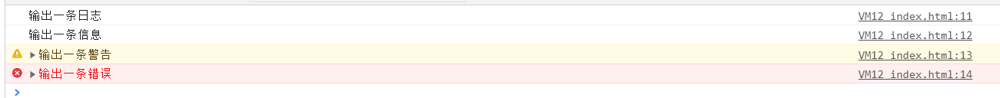

### 3.弹窗输出

如何使用JavaScript向弹出窗口输出一句话，请参考以下代码

```javascript
<script>
    alert("Hello,World!");
</script>
```

## 七、JavaScript数据类型

### 1.声明

[`var`](https://developer.mozilla.org/zh-CN/docs/Web/JavaScript/Reference/Statements/var)声明一个变量，可选初始化一个值

[`let`](https://developer.mozilla.org/zh-CN/docs/Web/JavaScript/Reference/Statements/let)声明一个块作用域的局部变量，可选初始化一个值

[`const`](https://developer.mozilla.org/zh-CN/docs/Web/JavaScript/Reference/Statements/const)声明一个块作用域的只读常量

### 2.基本数据类型

JS内有五种基本数据类型，即`String`、`Number`、`Boolean`、`Undefined`、`Null`，这五种类型之外的类型都称为`Object`，所以总的来看JavaScript中共有六种数据类型

> `typeof`操作符用来检查变量的数据类型，语法格式是`typeof 数据`，请看以下示例
>
> ```javascript
> console.log(typeof 123);
> console.log(typeof "Hello,World!");
> console.log(typeof true);
> console.log(typeof undefined);
> console.log(typeof null);
> ```
>
> 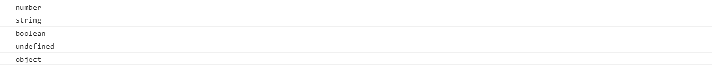

### 3.String

字符串需要使用**单引号**或**双引号**括起来，外部已使用双引号则内部使用单引号，其中转义字符如下

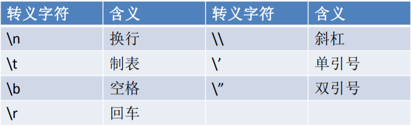

**强制转换为String类型有三种方式**

* `toString()`不会影响到原变量，将转换结果返回，但是`null`和`undefined`没有`toString()`，如果调用会报错

  ```javascript
  var a = 123;
  a = a.toString();
  console.log(a);
  console.log(typeof a);
  ```

* `String()`中将被转换的数据作为参数传递给函数，使用`String()`做强制类型转换时，对于`Number`和`Boolean`实际上就是调用的`toString()`，但是对于`null`和`undefined`会将`null`转换为 `“null”`，将`undefined`转换为`“undefined”`

  ```javascript
  var a = 123;
  a = String(a);
  console.log(a);
  console.log(typeof a);
  
  var b = undefined;
  b = String(b);
  console.log(b);
  console.log(typeof b);
  
  var c = null;
  c = String(c);
  console.log(c);
  console.log(typeof c);
  ```

* 为任意的数据类型 `+""`

  ```javascript
  var a = 123;
  a = a + "";
  console.log(a);
  console.log(typeof a);
  ```

### 4.Number

Number表示整数和浮点数，其Number表示的数字大小是有限的，如果超过该范围，则会返回`±Infinity(±无穷)`

* 最大值`+1.7976931348623157e+308`
* 最小值`-1.7976931348623157e+308`
* 0以上的最小值`5e-324`

**强制转换为Number类型有三种方式**

* `Number()`可以转换`String/Boolean/null/undefined`类型
  * `纯数字Stirng → 对应数字`、`含非数字String → NaN`、`全是空的String → 0`，`NaN(Not A Number)`表示非法数字
  * `Boolean中的true → 1`、`Boolean中的false → 0`
  * `null → 0`
  * `undefined → NaN`

* `parseInt()`专用于`String`，将字符串转为整数

  ```javascript
  var a = "123";
  a = parseInt(a);
  console.log(a);
  console.log(typeof a);
  ```

* `parseFloat()`专用于`String`，将字符串转为浮点数

  ```javascript
  var a = "123.456";
  a = parseFloat(a);
  console.log(a);
  console.log(typeof a);
  ```

### 5.Boolean

`Boolean`只可取`true`或`false`，**强制转换为Boolean类型只有一种方式，即`Boolean()`**

* `String → 布尔`，除了空串都是`true`
* `Number → 布尔`，除了0和`NaN`都是`true`
* `null/undefined → 布尔`，都是`false`

* `Object → 布尔`，都是`true`

### 6.Undefined

`Undefined`类型只有一个值，即特殊的`undefined`，在使用`var`声明变量但未对其加以初始化时，这个变量的值就是`undefined`

### 7.Null

`Null`类型只有一个值，即特殊的`null`，`undefined`值实际上是由`null`值衍生出来的，所以如果比较`undefined`和`null`是否相等会返回`true`

## 八、JavaScript运算符

学习过Java基础的朋友这部分不难，此处只展示部分，其他请参考[运算符官网](https://developer.mozilla.org/zh-CN/docs/Web/JavaScript/Reference/Operators)

### 1.typeof

`typeof`操作符用来检查变量的数据类型，语法格式是`typeof 数据`，请看以下示例

```javascript
console.log(typeof 123);
console.log(typeof "Hello,World!");
console.log(typeof true);
console.log(typeof undefined);
console.log(typeof null);
```


### 2.比较运算符

`==`相等、`!=`不等、`===`全等、`!==`不全等

* 相等只需值相等即返回`true`，会自动类型转换；而全相等时值和类型都要相等，否则返回`false`，不会自动类型转换

### 3.运算符优先级

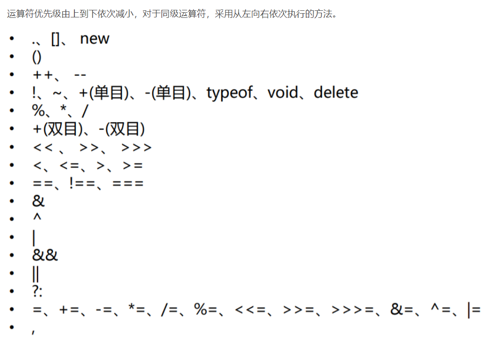

## 九、JavaScript语句和代码块

### 1.语句

表达式和运算符可理解为单词、短语，而语句Statement则是完整的话，JavaScript的程序由一条一条语句构成的，每一条语句使用`;`结尾

### 2.代码块

代码块是在大括号`{}`中所写的语句，以此将多条语句的集合视为一条语句来使用，代码块结尾不需要加`;`

```javascript
{
    var a = 123;
    a++;
    alert(a);
}
```

## 十、JavaScript函数

注意JavaScript中的函数也是对象，`typeof 函数 = function`

### 1.函数创建

#### 1.1.函数对象创建

函数对象创建方法几乎不用，语法格式`var 函数名 = new Function("执行语句");`，例如`var fun = new Function("console.log('这是我的第一个函数');");`

#### 1.2.函数声明创建

函数声明创建方法是常用方法，语法格式如下

```javascript
function 函数名([形参1,形参2,...,形参N]) {
    语句...
    [return xx;]//没有返回值的函数返回结果为undefined
}
```

#### 1.3.函数表达式创建

函数表达式创建方法是常用方法，语法格式如下，该方式创建的是**匿名函数**

```javascript
var 函数名  = function([形参1,形参2,...,形参N]) {
    语句....
    [return xx;]//没有返回值的函数返回结果为undefined
}
```

其中**`=`后的函数体相当于字符串，即`函数名=函数定义`，实际上函数名保存的是函数定义语句，是字面量String类型**，此类函数的激活格式为`(匿名函数名)()`，即立即执行函数的格式如下

```javascript
(function () {
    alert("我是一个匿名函数");
})();
```

### 2.函数嵌套

在函数中声明的函数就是嵌套函数，**嵌套函数只能在当前函数中可以访问**，在当前函数外无法访问

```javascript
function fu() {
    function zi() {
        console.log("我是儿子")
    }
    zi();
}

fu();
```

**函数嵌套可应用于算法隐藏**

```javascript
function add4(x,y){
	return suanfa();
	
	//算法封装 外部人员看不到
	function suanfa(){
		return(x+y)*2;
	}
}
```

### 3.常用函数

`alert()`：显示消息的对话框 

`prompt()`：向用户请求输入的对话框

`confirm()`：询问是或否的对话框

`parseInt()`：强转，转第一个无效字符之前的字符串

`parseFloat()`：强转，转第一个无效字符之前的字符串

`typeof()`：数据类型

`isNaN()`：是否是非数字的值

`eval()`：激活字符串，例如`eval("1"+"+"+"2")`会计算字符串的结果，输出`3`，应用于激活函数字面值，即激活匿名函数

`setInterval("XXX",time)`：每隔time毫秒调用一次XXX

`setTimeout("XXX",time)`：隔time毫秒调用一次XXX，只调用一次，可以递归实现连续调用

### 4.function

所有`function`类型的对象都有一个`prototype`属性

* 函数定义时，`prototype`被自动创建并初始化，当前作用域链被保存为函数的内部状态
* 函数被`new`时，`prototype`被指派给引用作为内置对象
* 函数使用时，JS构建一个他的上下文`this`并给`call()`

所有`function`类型的对象都有一个`length`属性

## 十一、JavaScript对象

### 1.创建对象

#### 1.1.普通创建

```javascript
var person = new Object();//无参构造函数可以省略()
person.name = "孙悟空";
person.age = 18;
console.log(person);
```

```javascript
var person = {
    name: "孙悟空",
    age: 18
};
console.log(person);
```

#### 1.2.工厂方法创建

已经学习如何创建一个对象，那我们要是想要创建多个对象又该怎么办？可通过**工厂方法创建**

①单个单个对象的创建方式如下

```javascript
var person1 = {
    name: "孙悟空",
    age: 18,
    sayName: function () {
        console.log(this.name);
    }
};

var person2 = {
    name: "猪八戒",
    age: 19,
    sayName: function () {
        console.log(this.name);
    }
};

var person3 = {
    name: "沙和尚",
    age: 20,
    sayName: function () {
        console.log(this.name);
    }
};

console.log(person1);
console.log(person2);
console.log(person3);
```

②工厂方法创建，但以下的创建方式创建出来的对象的属性都是相同的，请看③

```javascript
// 使用工厂模式创建对象
function createPerson() {
    // 创建新的对象
    var obj = new Object();
    // 设置对象属性
    obj.name = "孙悟空";
    obj.age = 18;
    // 设置对象方法
    obj.sayName = function () {
        console.log(this.name);
    };
    //返回新的对象
    return obj;
}

var person1 = createPerson();
var person2 = createPerson();
var person3 = createPerson();

console.log(person1);
console.log(person2);
console.log(person3);
```

③**工厂方法创建**

```javascript
// 使用工厂模式创建对象
function createPerson(name, age) {
    // 创建新的对象
    var obj = new Object();
    // 设置对象属性
    obj.name = name;
    obj.age = age;
    // 设置对象方法
    obj.sayName = function () {
        console.log(this.name);
    };
    //返回新的对象
    return obj;
}

var person1 = createPerson("孙悟空", 18);
var person2 = createPerson("猪八戒", 19);
var person3 = createPerson("沙和尚", 20);

console.log(person1);
console.log(person2);
console.log(person3);
```

#### 1.3.构造方法创建对象

前面使用工厂方法创建对象，但创建的对象都是`Object`类型，但是万物皆对象，最好知道对象的类型，所以出现**构造方法创建对象**

```javascript
// 使用构造函数来创建对象
function Person(name, age) {
    // 设置对象的属性
    this.name = name;
    this.age = age;
    // 设置对象的方法
    this.sayName = function () {
        console.log(this.name);
    };
}

var person1 = new Person("孙悟空", 18);
var person2 = new Person("猪八戒", 19);
var person3 = new Person("沙和尚", 20);

console.log(person1);
console.log(person2);
console.log(person3);
```

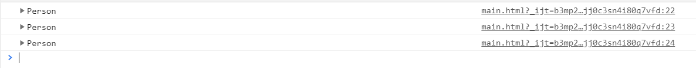

什么是构造函数？？请看【5】

### 2.成员访问

访问两种方式，即`对象.属性名`和`对象['属性名']`

> 属性可以是方法定义的字面量，即`对象名.属性名=function(){...};`
>
> ```javascript
> var person = {
>     name: "zhangsan",
>     age: 18,
>     sayHello: function () {
>         console.log(name + " hello")
>     }
> }
> 
> person.sayHello();
> ```
>
> 激活对象中某函数成员属性
>
> ```javascript
> for(var 属性名 in 对象名){
>     console.log(属性名+":"+对象名[属性名]);
>     if(属性名=='函数名'){
>         eval("("+对象名[属性名]+")()");//激活函数
>     }
> }
> ```

### 3.删除属性

删除属性使用`delete`关键字，语法格式`delete 对象.属性名`

```javascript
var person = new Object();
person.name = "孙悟空";
person.age = 18;
console.log(person);

delete person.name
console.log(person);
```

### 4.遍历对象

`in`运算符迭代对象中的所有属性，便于临时添加属性或方法，灵活

```javascript
for(var 属性名 in 对象名){
    console.log(typeof(属性名));
    console.log(属性名);
    console.log(对象名[属性名]);
}
```

### 5.构造函数

构造函数实际就是普通函数，创建方式和普通函数并没有什么不同，但构造函数习惯上首字母大写，那么构造函数和普通函数有什么区别？

* 调用方式不同，**构造函数通过`new`调用**，普通函数可直接调用
* **构造函数中可存在`this`关键字**

```javascript
function Animal(name,age){//这就是构造函数
  this.name = name;     
  this.age = age;       
}
//建立一个动物的实例     
var a1 =  new Animal("zhang",18);
```

**构造函数创建对象的过程是怎样的？**请往下看👀，发现个工厂创建有点类似，但不同的是**创建和返回对象过程被隐藏**

* `new`构造函数会立即创建新对象
* 新对象被设置为函数中的`this`
* 逐条执行函数中的代码
* 将新建的对象作为返回值

### 6.this关键字

解析器在调用函数每次都会向函数内部传递进一个隐含的参数`this`，`this`指向一个对象，这个对象我们称为函数执行的上下文对象，根据函数的调用方式的不同，`this`会指向不同的对象，接下来一起探究`this`的指向

> `call()`和`apply()`都用于立即执行代码并返回结果
>
> * `call(this,a,b...)`其中`a`、`b`为**参数**，相当于反射的`invoke()`，当调用方法时，JS会建立执行该方法的上下文`this`给`call()`
>
>   ```javascript
>   var first = {
>     num: 11
>   };
>   function multiply(mult) {
>       return this.num * mult;
>   }
>   //在multiply方法中设置this为first，同时给multiply设置参数为7
>   multiply.call(first, 7); //11 * 7
>   ```
>
> * `apply(this,array)`其中`array`为**参数数组**

①当调用`Person.answerName()`时JS建立执行他的上下文`this`提供给`call()`，即`answerName.call(this)`，其实`this`表示Person，**`this`取最后一个`.`前出现的对象**

```javascript
var Person = {
    name = 'Person ';
   
    answerName=function() {
        return this.name;
    };
};
Person.answerName();
```

②Person被定义为有构造函数的类被`new`出来，此时`this`指向`newInstance`，同样**`this`取最后一个`.`前出现的对象**

```javascript
var Person = function(name) {
    this.name = name;

    answerName=function() {
        return this.name;
    };
};
var newInstance = new Person('n1');
newInstance.answerName();
```

③该案例中`this`指向`window`，而不是`answerThis`，此处没有`.`，所以`this`取最后一个`.`前出现的对象规则没有用上

```javascript
function getThis() {
    return this;
}
var answerThis = getThis();
```

再看一个案例，此时`this`指向`window`

```javascript
var hello = function{
    alert("hello");
}
this.hello();//window.hello()
```

④`this`不再是最后一个`.`前的对象，而是**事件的调用者**的情况，当方法被作为事件处理器时，不等于被一个对象直接调用，此时`this=事件的调用者botton`

```javascript
var Person = function(name) {
    this.name = name;

    answerName=function() {
        return this.name;
    };
};

var addHandler = function() {
    //接下来两句话的意思是id=buttonId的按钮添加onclick事件的处理器newInstance.answerName
    var newInstance = new Person('newInstance');
    var button = document.getElementById('buttonId');
    button.onclick = newInstance.answerName;//当点击该botton时返回undefined
};
window.onload = addHandler;
```

当方法是事件处理器时，怎么样让`this`指向最近的`.`前的对象？？

* 临时解决方案：使用`call`或`apply`方法立即执行代码然后返回结果

  ```javascript
  button.onclick = newInstance.answerName.call(newInstance);
  //this先指向newInstance，立即执行answerName方法后返回一个结果作为onclick事件的响应
  ```

* 精华解决方案

```javascript
//Function是全局对象，使用prototype那么以后定义的任何function都能用bind这个方法
Function.prototype.bind = function(obj) {//obj=newInstance
    var method = this,//method=this=answerName
    var temp = function() {
        return method.apply(obj, arguments);//arguments是全局变量，存参数的数组
    };
    //temp=answerName.apply(newInstance, arguments)
    return temp;
}
button.onclick = newInstance.answerName.bind(newInstance);
```

**🆗到此就探究完毕，总结一波`this`的指向**

* **当对象直接调用时，`this`取最后一个`.`前出现的对象，无则`window`**
* **当方法被作为事件处理器时，此时`this`为事件的调用者**

> instanceof运算符检查一个对象是否是一个类的实例，返回true或false，语法格式是`对象 instanceof 构造函数`

### 7.原型prototype

使用构造函数的方式进行创建对象时，若只需改变某些属性，而方法是相同的情况下，如果创建1000个对象，那岂不是内存中就有1000个相同的方法，对内存的浪费太大，有没有什么好的办法解决？**可以把函数抽取出来作为全局函数，在构造函数中直接引用就可以**

```javascript
// 使用构造函数来创建对象
function Person(name, age) {
    // 设置对象的属性
    this.name = name;
    this.age = age;
    // 设置对象的方法
    this.sayName = sayName
}

// 抽取方法为全局函数
function sayName() {
    console.log(this.name);
}

var person1 = new Person("孙悟空", 18);
var person2 = new Person("猪八戒", 19);
var person3 = new Person("沙和尚", 20);

person1.sayName();
person2.sayName();
person3.sayName();
```

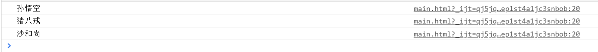

但定义全局函数并不是好方式，因为多人协作场景下别人的方法也叫`sayName`怎么办，造成**全局作用域污染**，那么怎么办？请看**原型对象**

```javascript
// 使用构造函数来创建对象
function Person(name, age) {
    // 设置对象的属性
    this.name = name;
    this.age = age;
}

// 在Person类的原型对象中添加方法
Person.prototype.sayName = function() {
    console.log(this.name);
};

var person1 = new Person("孙悟空", 18);
var person2 = new Person("猪八戒", 19);
var person3 = new Person("沙和尚", 20);

person1.sayName();
person2.sayName();
person3.sayName();
```

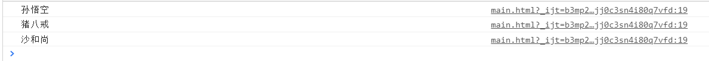

------

原型`prototype`到底是什么？**每个函数解析器都会创建属性`prototype`，`prototype`对应着一个对象，该对象就是原型对象**，原型对象相当于公共区域，所以**同一类的实例都可访问该原型对象**，可将对象中共有的内容统一设置到原型对象中

* 如果函数作为普通函数调用`prototype`没有任何作用
* 如果函数以构造函数的形式调用`prototype`指向该构造函数的原型对象

**当我们访问对象的一个属性或方法时，它会先在对象自身中寻找，如果有则直接使用，如果没有则会去原型对象中寻找，如果找到则直接使用**

**以后我们创建构造函数时，可以将这些对象共有的属性和方法统一添加到构造函数的原型对象中，这样不用分别为每一个对象添加，也不会影响到全局作用域，就可以使每个对象都具有这些属性和方法**

------

🆗总结一波

* `prototype`属性本身是`Object`类型的对象，因此可以给`prototype`对象添加任意的属性和方法
* `prototype`的属性和方法被同类对象共享
* `prototype`是对象的原型，指向父类，使本类有父类的特征
* 由以上两点可知，`prototype`不但**共享自己的属性和方法给同类对象**，还可以**寻根问祖**
  * 若自己没有就去与自己关联的`prototype`对象找，若又没有则又去自己关联的前辈`prototype`找，直到结束或未找到为止

* 当定义方法时，`prototype`被自动创建并初始化，初始值是拥有名为`constructor`属性的对象

------

🆗代码体现一波**共享自己的属性和方法给同类对象**

* 设置父类

```javascript
function Person(name){
    this.name=name;
}
```

* `Person`的`prototype`添加`personPrototype()`

```javascript
Person.prototype.personPrototype=function(){
    alert(this.name);
}
```

* 创建两个对象，调用`personPrototype()`

```javascript
var p1=new Person("p1");
var p2=new Person("p2");

p1.personPrototype();
p2.personPrototype();

p1.personPrototype()==p2.personPrototype()//ture，说明两个对象共享personPrototype()
```

> **不建议访问内置原型对象**，因为内置原型对象本身也是对象，也有自己的关联，从而形成原型链，原型链的最末端是Object构造函数`prototype`指向的原型对象`null`(最老的祖先)，老祖宗实现一些对象天生就该有的方法(原型对象继承)

### 8.原型链

原型继承指`new`同时将构造函数的`prototype`对象(原型对象)指派给新建的对象，即右指左，而原对象的`prototype`也有自己的关联对象，形成原型链

原型链指访问某对象属性时，先在自身属性中查找，找到返回，若自身不存在要寻找的属性就会去自己关联的`prototype`对象找，若又没有则又去自己关联的前辈`prototype`找，直到结束或未找到为止，最终未找到则返回`undefined`

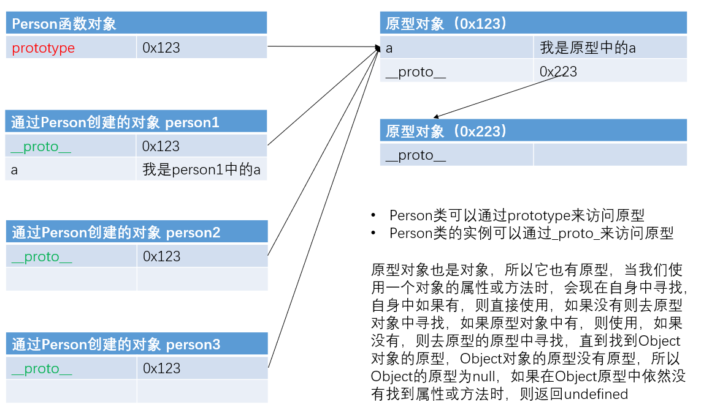

### 9.原型继承

#### 9.1.原型链继承

**核心思想**是子类型的原型为父类型的一个实例对象，基本做法如下

* 定义父类型构造函数

  ```javascript
  function SupperType() {
      this.supProp = 'Supper property';
  }
  ```

* 给父类型的原型添加方法

  ```javascript
  SupperType.prototype.showSupperProp = function () {
      console.log(this.supProp);
  };
  ```

* 定义子类型的构造函数

  ```javascript
  function SubType() {
      this.subProp = 'Sub property';
  }
  ```

* 创建父类型的对象赋值给子类型的原型

  ```javascript
  SubType.prototype = new SupperType();
  ```

* 将子类型原型的构造属性设置为子类型

  ```javascript
  SubType.prototype.constructor = SubType;
  ```

* 给子类型原型添加方法

  ```javascript
  SubType.prototype.showSubProp = function () {
      console.log(this.subProp)
  };
  ```

* 创建子类型的对象，可以调用父类型的方法

  ```javascript
  var subType = new SubType();
  subType.showSupperProp();
  subType.showSubProp();
  ```


原型链继承的缺点是

* 一个实例修改了原型属性，另一个实例的原型属性也会被修改
* 不能传递参数
* 继承单一

#### 9.2.借用构造函数继承

**核心思想**是使用`call()`或`apply()`将父类构造函数引入子类函数，使用父类的构造函数来增强子类实例，等同于复制父类的实例给子类，基本做法如下

* 定义父类型构造函数

  ```javascript
  function SuperType(name) {
      this.name = name;
      this.showSupperName = function () {
          console.log(this.name);
      };
  }
  ```

* 定义子类型的构造函数

  ```javascript
  function SubType(name, age) {
      // 在子类型中调用call方法继承自SuperType
      SuperType.call(this, name);
      this.age = age;
  }
  ```

* 给子类型的原型添加方法

  ```javascript
  SubType.prototype.showSubName = function () {
      console.log(this.name);
  };
  ```

* 创建子类型的对象然后调用

  ```javascript
  var subType = new SubType("孙悟空", 20);
  subType.showSupperName();
  subType.showSubName();
  console.log(subType.name);
  console.log(subType.age);
  ```

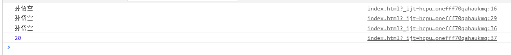

借用构造函数继承的缺点是

* 只能继承父类的实例属性和方法，不能继承原型属性和方法
* 无法实现构造函数的复用，每个子类都有父类实例函数的副本，影响性能，代码会臃肿

#### 9.3.组合继承

**核心思想**是原型链+借用构造函数的组合继承，基本做法如下

* 利用原型链实现对父类型对象的方法继承
* 利用super()借用父类型构建函数初始化相同属性

```javascript
function Person(name, age) {
    this.name = name;
    this.age = age;
}

Person.prototype.setName = function (name) {
    this.name = name;
};

function Student(name, age, price) {
    Person.call(this, name, age); // 为了得到父类型的实例属性和方法
    this.price = price; // 添加子类型私有的属性
}

Student.prototype = new Person(); // 为了得到父类型的原型属性和方法
Student.prototype.constructor = Student; // 修正constructor属性指向
Student.prototype.setPrice = function (price) { // 添加子类型私有的方法 
    this.price = price;
};

var s = new Student("孙悟空", 24, 15000);
console.log(s.name, s.age, s.price);
s.setName("猪八戒");
s.setPrice(16000);
console.log(s.name, s.age, s.price);
```

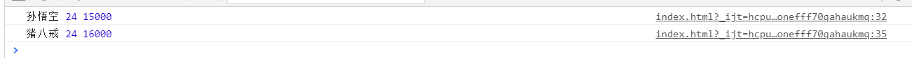

组合继承的缺点是父类中的实例属性和方法既存在于子类的实例中，又存在于子类的原型中，不过仅是内存占用，因此在使用子类创建实例对象时，其原型中会存在**两份相同的属性和方法**

> `read-write-read`过程
>
> * `read`时，由于自己的对象没有`name`属性，那么就会返回的原型对象的`name`属性的值
> * `write name`值，同样没发现本身对象有`name`属性,那么就在本身对象上新建一个`name`属性，然后赋值
> * 再次`read name`属性，由于在第二步中已经新建了`name`属性，此时就返回在第二步中设定的值

#### 9.4.小结

父将自己的属性和方法无私分享，但不强迫子遵从，允许子有自己的属性和方法

子虽然可以有自己的属性和方法，但不会动父的东西，即`read-write-read`过程

	* `p2.money=100;`先检查`p2`是否已有该属性，若有则改，若无则新增

可以随时给原型对象动态添加新的属性和方法，从而动态地扩展基类的功能特性

```javascript
function Person(name){
    this.name = name;
};
Person.prototype.personPrototype=function(){
    alert(this.name);
}
var p1= new Person("p1");
p1.personPrototype();

//建立对象后再动态扩展原型的方法
Person.prototype.Retire = function()    {
    alert("调用Retire方法：" + this.name );
};
//动态扩展的方法即可被先前建立的对象立即调用
p1.Retire(); 
```

## 十二、JavaScript常用对象

以下只展示常用的部分对象，更多请参考[官方](https://developer.mozilla.org/zh-CN/docs/Web/JavaScript/Reference/Global_Objects)

### 1.Object对象

Object对象的属性包括`constructor`用于该对象函数地址、`prototype`用于该对象原型引用

Object对象的函数包括`toString()`、`valueOf()`、`hasOwnProperty("属性名")`判断是否有某个特定的属性等等

### 2.Function对象

Function是全局对象，创建Function()构造器使用的是全局作用域

```javascript
var x='global';
function ctor(){
    x='local';
    return new Function("return x;");
}
alert(ctor()())://这里输出的是global;
```

### 3.Array对象

数组的存储性能比普通对象要好，**JavaScript中是支持数组可以是不同的元素**，这跟JavaScript的弱类型有关，此处不用纠结，我们大多数时候都是相同类型元素的集合

数组内的各个值被称作元素，每一个元素都可以通过索引(下标)来快速读取，索引是从零开始的整数

> 使用`typeof`检查一个数组对象时，会返回`object`

#### 3.1.数组创建

创建数组的方式有两种，即**使用对象创建**和**使用字面量创建**

* 使用对象创建

```javascript
var arr = new Array();
arr[0] = 1;//数字下标
arr["name"] = 2;//文字下标
```

* 使用字面量创建

```javascript
var arr = [1, 2, 3, 4, 5, 6, 7, 8, 9];
```

#### 3.2.遍历数组

```javascript
for (var i = 0; i < arr.length; i++) {
    console.log(arr[i]);
}
```

#### 3.3.数组属性

①`constructor`：返回创建数组对象的原型函数

```javascript
var arr = [1,2,3,4];
console.log(arr.constructor);
```

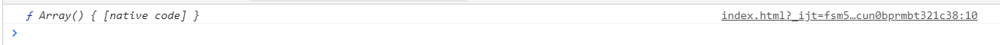

②`length`：设置或返回数组元素的个数

```javascript
var arr = [1,2,3,4];
console.log(arr.length);
```

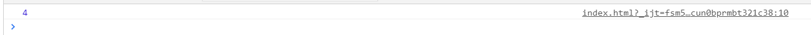

#### 3.4.数组方法

* `push('XXX')`：添加一个或多个元素到数组尾部，并返回新数组长度
* `pop()`：删除数组末尾元素，并返回被删除的元素
* `shift()`：删除数组头部元素，并返回被删除的元素
* `unshift('XXX')`：添加一个或多个元素到数组头部，并返回新数组长度
* `forEach(回调函数)`：遍历数组，数组中有几个元素就会执行几次回调函数，浏览器会在回到函数中传递三个参数，即当前正在遍历的元素、当前正在遍历的元素索引、当前正在遍历的数组

```javascript
var arr = ["孙悟空", "猪八戒", "沙和尚"];
arr.forEach(function (value, index, obj) {
    console.log(value + " #### " + index + " #### " + obj);
});
```

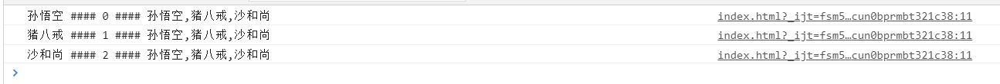

> 由我们创建但是不由我们调用的函数称为回调函数

* `slice()`：从数组提取指定元素，该方法不会改变元素数组，而是将截取到的元素封装到一个新数组中返回，传递两个参数，即截取开始位置索引(包含)、截取结束位置索引(不包含，可省略)，**索引可以是负数，表示从后往前计算，`-1`表示倒数第一个**

```javascript
var arr = ["孙悟空", "猪八戒", "沙和尚", "唐僧", "白骨精"];
var result = arr.slice(1, 4);
console.log(result);
result = arr.slice(3);
console.log(result);
result = arr.slice(1, -2);
console.log(result);
```

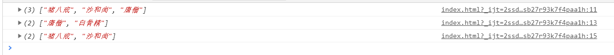

* `splice(开始位置索引，删除元素数量，参数三)`：删除数组中的指定元素，该方法会影响到原数组，被删除的元素作为返回值返回，参数三会自动插入到开始索引前

```javascript
var arr = ["孙悟空", "猪八戒", "沙和尚", "唐僧", "白骨精"];
var result = arr.splice(3, 2);
console.log(arr);
console.log(result);
result = arr.splice(1, 0, "牛魔王", "铁扇公主", "红孩儿");
console.log(arr);
console.log(result);
```

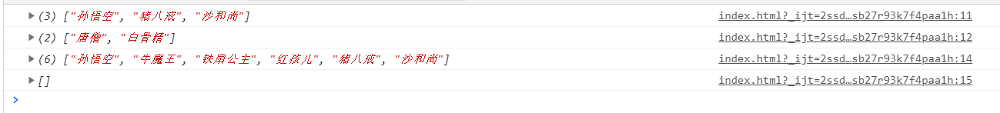

* `concat()`：连接两个或多个数组，并将新的数组返回，该方法不会对原数组产生影响

```javascript
var arr = ["孙悟空", "猪八戒", "沙和尚"];
var arr2 = ["白骨精", "玉兔精", "蜘蛛精"];
var arr3 = ["二郎神", "太上老君", "玉皇大帝"];
var result = arr.concat(arr2, arr3, "牛魔王", "铁扇公主");
console.log(result);
```

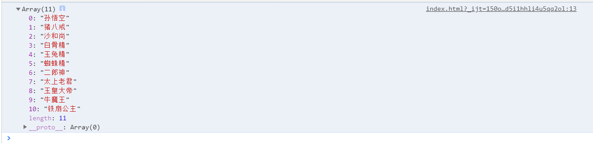

* `join(连接符字符串)`：将数组转换为一个字符串，该方法不会对原数组产生影响，若不传参默认使用`,`作为连接符

```javascript
var arr = ["孙悟空", "猪八戒", "沙和尚"];
var result = arr.join("@-@");
console.log(result);
```

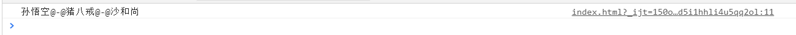

* `reverse()`：反转数组，该方法会直接修改原数组

```javascript
var arr = ["孙悟空", "猪八戒", "沙和尚"];
arr.reverse();
console.log(arr);
```

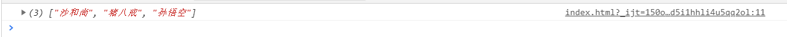

* `sort()`：对数组中的元素进行排序，也会影响原数组，默认会按照Unicode编码进行排序，所以对于纯数字排序可能会遇到错误，可通过回调函数自定义排序规则

```javascript
var arr = ["b", "c", "a"];
arr.sort();
console.log(arr);//["a", "b", "c"]

var arr = [1, 3, 2, 11, 5, 6];
arr.sort();
console.log(arr);//[1, 11, 2, 3, 5, 6]

var arr = [1, 3, 2, 11, 5, 6];
arr.sort(function (a, b) {
    return a - b;//升序，若要降序则返回b - a
});
console.log(arr);//[1, 2, 3, 5, 6, 11]
```

### 4.arguments参数

在调用函数时浏览器每次都会传递进两个隐含的参数，即上下文对象`this`、实参对象`arguments`，`this`、`call()`、`apply()`在前面已经学习过

`arguments`是用于**记录参数的数组**，**在调用函数时，被传递的实参都在`arguments`中保存**

`arguments.length`可以用来获取实参的长度，而`length`表示形参个数

`callee`属性就是当前正在指向的函数的对象

```javascript
function fun(a, b) {
    // 通过下标获取第一个参数
    console.log(arguments[0]);
    // 通过下标获取第二个参数
    console.log(arguments[1]);
    // 获取实参的个数
    console.log(arguments.length);
    // 看看它的函数对象
    console.log(arguments.callee);
    console.log(arguments.callee == fun);
}

fun("Hello", "World");
```

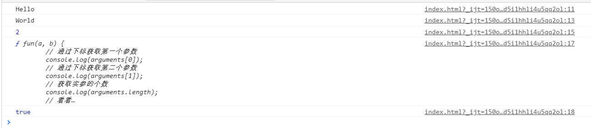

`arguments`可用于灵活的参数求和

```javascript
function add(){
	switch(arguments.length){
		case 0:alert("没有参数");break;
		case 1:return  arguments[0];
		default:
			var total=0;
			for (var i=0;i<arguments.length;i++) {
				total+=parseInt(arguments[i]);//求和
			}
			return total;
	}
}

add(1,2,3);//6
```

### 5.Date对象

Date对象来表示一个时间，如果直接使用构造函数创建一个Date对象，则会封装为当前代码执行的时间

```javascript
var date = new Date();
console.log(date);

console.log(date.getFullYear());//获取当前日期对象的年份(四位数字年份)
console.log(date.getMonth());//获取当前日期对象的月份(0 ~ 11)
console.log(date.getDate());//获取当前日期对象的日数(1 ~ 31)
console.log(date.getHours());//获取当前日期对象的小时(0 ~ 23)
console.log(date.getMinutes());//获取当前日期对象的分钟(0 ~ 59)
console.log(date.getSeconds());//获取当前日期对象的秒钟(0 ~ 59)
console.log(date.getMilliseconds());//获取当前日期对象的毫秒(0 ~ 999)
//getYear()、getDate()日期数1-31、getDay()星期数0-6、getTime()毫秒值，自起始时刻开始
```

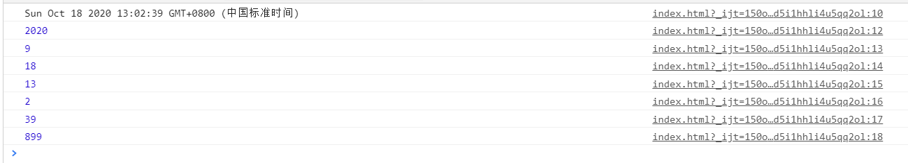

### 6.Math对象

Math和其它的对象不同，它不是一个构造函数，它属于一个工具类不用创建对象，它里边封装了数学运算相关的属性和方法

```javascript
/*固定值*/
console.log("PI = " + Math.PI);
console.log("E  = " + Math.E);
console.log("===============");

/*正数*/
console.log(Math.abs(1));        //可以用来计算一个数的绝对值
console.log(Math.ceil(1.1));     //可以对一个数进行向上取整，小数位只有有值就自动进1
console.log(Math.floor(1.99));   //可以对一个数进行向下取整，小数部分会被舍掉
console.log(Math.round(1.4));    //可以对一个数进行四舍五入取整
console.log("===============");

/*负数*/
console.log(Math.abs(-1));       //可以用来计算一个数的绝对值
console.log(Math.ceil(-1.1));    //可以对一个数进行向上取整，小数部分会被舍掉
console.log(Math.floor(-1.99));  //可以对一个数进行向下取整，小数位只有有值就自动进1
console.log(Math.round(-1.4));   //可以对一个数进行四舍五入取整
console.log("===============");

/*随机数*/
//Math.random()：可以用来生成一个0-1之间的随机数
//生成一个0-x之间的随机数：Math.round(Math.random()*x)
//生成一个x-y之间的随机数：Math.round(Math.random()*(y-x)+x)
console.log(Math.round(Math.random() * 10));            //生成一个0-10之间的随机数
console.log(Math.round(Math.random() * (10 - 1) + 1));  //生成一个1-10之间的随机数
console.log("===============");

/*数学运算*/
console.log(Math.pow(12, 3));   //Math.pow(x,y)：返回x的y次幂
console.log(Math.sqrt(4));      //Math.sqrt(x) ：返回x的平方根
```

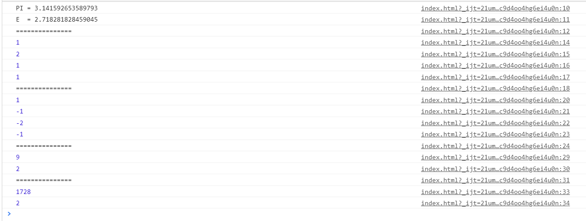

### 7.String对象

JS支持长字符串，语法格式如下

```
1."aaaaaa"+
  "bbbbbb"
2."aaaaaa\
   bbbbbb"
```


```
==========prototype:用对象名调
charAt(int):取int处字符
charCodeAt(int):取int处字符的编码
indexof(".."):取指定字符位置
lastIndexOf("."):从右开始取指定字符位置
replace("a","b"):a全部被b替换
split("."):拆分为数组
substr(start,n):从start截取n个
sunstring(start,end):截取start开始到end结束的字符串

```


```
1.在浏览器上方标题处实现跑马灯效果
	var str="* * * 欢 迎 进 入 * * *";
	function run(){
		str=str.substr(1,str.length-1)+str.substr(0,1);
		
		document.title=str;//在标题栏显示
	}
	setInterval("run()",300);//每隔0.3秒调用一次run()

2.说明邮箱类型
	邮箱名：<input value="1111@qq.com" type="text" id="email" placeholder="邮箱" />//placeholder提示语
	<input type="button" value="确定" onclick="show()" />
	
	<div id="result"></div>
	
	<script>
		function show(){
			var email=document.getElementById("email").value;
			
			//利用string函数取各个部分
			var atindex = email.indexOf("@");
			var username = email.substr(0,atindex);
			var dotindex = email.indexOf(".");
			var website = email.substring(atindex+1,dotindex);
			var type = email.substring(dotindex+1);
			
			var typestring='';
			if(type=='com'){
				typestring="<span style='color:red'>商业网站</span>"
			}else if(type=='org'){
				typestring="<span style='color:red'>组织机构</span>"
			}else if(type=='mil'){
				typestring="<span style='color:red'>军队</span>"
			}
			
			var info="欢迎您："+username+"，你的邮箱由"+website+"提供，他是一个"+typestring;
			document.getElementById("result").innerHTML=info;
		}
	</script>

3.输入搜索内容高亮显示---注意下一次搜索不能从0开始，否则一直找第一个，注意循环中i每次的增量
	李克强主持召开经济形势专家和企业家座谈会李克强:围绕市场主体有效实施宏观政策 推进改革开放 保持经济平稳运行 重要活动 会议活动考察调研接见会见讲话全文致电致信批示出访国务院令其他
	<br />
	<input type="text" id="keyword" value="李克强" />
	<input type="button" value="搜索" onclick="search()" />
	<div id="result"></div>
	
	<script>
		var str="李克强主持召开经济形势专家和企业家座谈会李克强:围绕市场主体有效实施宏观政策 推进改革开放 保持经济平稳运行 重要活动 会议活动考察调研接见会见讲话全文致电致信批示出访国务院令其他";
		function search(){
			var keyword = document.getElementById("keyword").value;//李克强
			var length = keyword.length;//3
			var finalstr="";//拼接文本
			var index=0;//第二次搜索从上一次搜索的下一个位置开始
			for(var i=0;i<str.length;i=index+length){
				//i:0 3 23
				index =str.indexOf(keyword,i);//0  20
				console.log(index);
				if(index==-1){
					finalstr+=str.substring(i,str.length);
					break;
				}
				
				finalstr+=str.substring(i,index);//(0,0)
				finalstr+="<span style='color:red'>";
				finalstr+=keyword;
				finalstr+="</span>";
			}
			//重新拼接一次str，重新渲染str
			document.getElementById("result").innerHTML=finalstr;
		}
	</script>

```


```

4.组成部分
ECMAScript：核心语言对象（最底层）
DOM：文档对象模型
BOM：浏览器对象模型

Global
解决地址栏编码级的问题

1.编码
	encodeURL():将文本字符串编码为一个有效地统一资源标识符
	encodeURLComponent():将文本字符串编码为一个有效地统一资源标识符的一个有效组件
2.解码
	decodeURL():返回一个以编码的统一资源标识符的非编码形式
	decodeURLComponent():返回统一资源标识符的一个以编码组件的非编码形式


```


