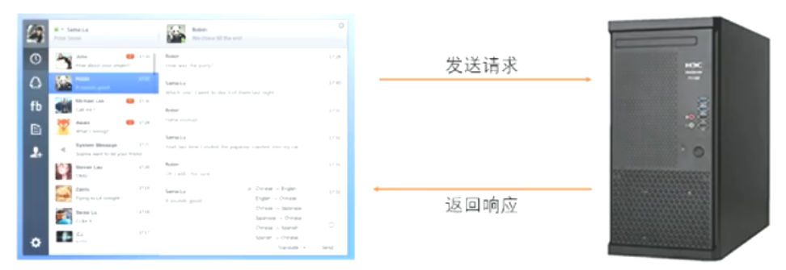
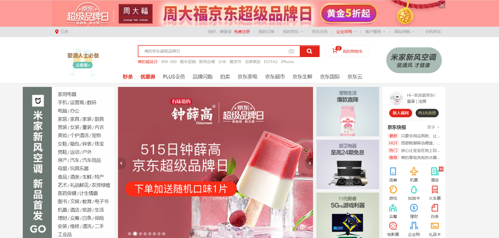
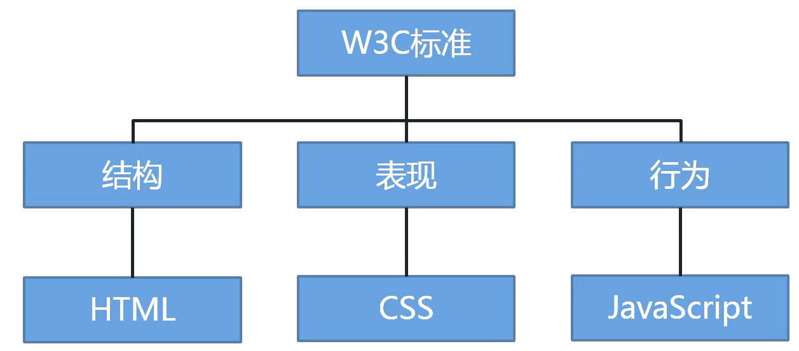
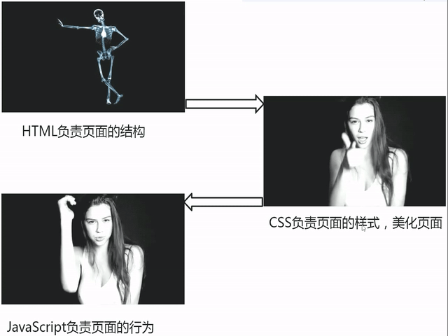

# 前端概述

## 一、软件的分类

### 1.系统软件

比如Windows、Linux、macOS

### 2.应用软件

比如office、QQ

### 3.游戏软件

## 二、客户端与浏览器

现在的软件通常分为两部分，即**客户端与服务器**，**用户通过客户端来使用软件，服务端负责远程处理业务逻辑**，例如我们去餐馆吃饭，点菜的服务员就相当于客户端，而后厨做菜的厨师就相当于服务器



服务器语言包括Java、PHP、C#、Python、Node.js等

客户端包括文字客户端(命令操作)、图形化界面客户端(C/S)、网页客户端(B/S)，其中网页中的语言包括HTML、CSS、JavaScript


## 三、浏览器和网页

浏览器内显示的内容正是我们所说的网页，网页原本的样子如下

```html
<div id="shortcut">
    <div class="w">
        <ul class="fl" clstag="h|keycount|head|topbar_01">
            <li class="dropdown" id="ttbar-mycity"></li>
        </ul>

        <ul class="fr">
            <li class="fore1 dropdown" id="ttbar-login" clstag="h|keycount|head|topbar_02">
                <a href="//passport.jd.com/uc/login?ReturnUrl=https%3A%2F%2Fwww.jd.com%2F" class="link-login">你好，请登录</a>&nbsp;&nbsp;<a
                                                                                                                                       href="//reg.jd.com/reg/person?ReturnUrl=https%3A//www.jd.com/" class="link-regist style-red">免费注册</a>
            </li>
            <li class="spacer"></li>
            <li class="fore2" clstag="h|keycount|head|topbar_03">
                <div class="dt"><a target="_blank" href="//order.jd.com/center/list.action">我的订单</a></div>
            </li>
            <li class="spacer"></li>
            <li class="fore3 dropdown" id="ttbar-myjd" clstag="h|keycount|head|topbar_04">
                <div class="dt cw-icon"><a target="_blank" href="//home.jd.com/">我的京东</a><i class="iconfont">&#xe610;</i><i
                                                                                                                            class="ci-right"><s>◇</s></i></div>
                <div class="dd dropdown-layer"></div>
            </li>
            <li class="spacer"></li>
            <li class="fore4" clstag="h|keycount|head|topbar_05">
                <div class="dt"><a target="_blank" href="//vip.jd.com/">京东会员</a></div>
            </li>
            <li class="spacer"></li>
            <li class="fore5" clstag="h|keycount|head|topbar_06">
                <div class="dt"><a target="_blank" href="//b.jd.com/">企业采购</a></div>
            </li>
            <li class="spacer"></li>
            <li class="fore8 dropdown" id="ttbar-serv" clstag="h|keycount|head|topbar_07">
                <div class="dt cw-icon">客户服务<i class="iconfont">&#xe610;</i><i class="ci-right"><s>◇</s></i></div>
                <div class="dd dropdown-layer"></div>
            </li>
            <li class="spacer"></li>
            <li class="fore9 dropdown" id="ttbar-navs" clstag="h|keycount|head|topbar_08">
                <div class="dt cw-icon">网站导航<i class="iconfont">&#xe610;</i><i class="ci-right"><s>◇</s></i></div>
                <div class="dd dropdown-layer"></div>
            </li>
            <li class="spacer"></li>
            <li class="fore10 mobile" id="J_mobile" clstag="h|keycount|head|topbar_09">
                <div class="dt mobile_txt">手机京东</div>
                <div class="mobile_static">
                    <div class="mobile_static_qrcode"></div>
                </div>
                <div id='J_mobile_pop' class='mod_loading mobile_pop'>
                </div>
            </li>
        </ul>
    </div>
</div>
```

浏览器就是负责**渲染**以上源代码成我们想要的样子，如下图



综上可知，网页被渲染成什么样子就和浏览器有着密不可分的关系，原来各家浏览器对于同一段网页源码存在不同的渲染效果，这样会给前端开发造成巨大困难，怎么办？？那当然就是统一标准了，**万维网联盟(W3C)为网页开发制定标准，使同一个网页在不同的浏览器中有相同的效果**，根据W3C标准，一个网页主要由三部分组成，即**结构(骨架)、表现(皮肤)、行为(交互)**，HTML用于描述页面结构，CSS用于控制页面中元素的样式，JavaScript用于响应用户的操作



通俗来讲就如下图

