# MVC与项目

## 一、MVC架构理解

View指视图(页面)、Controller指控制器(Servlet)、Model指模型(实体类-数据库)

两层模型的架构如下

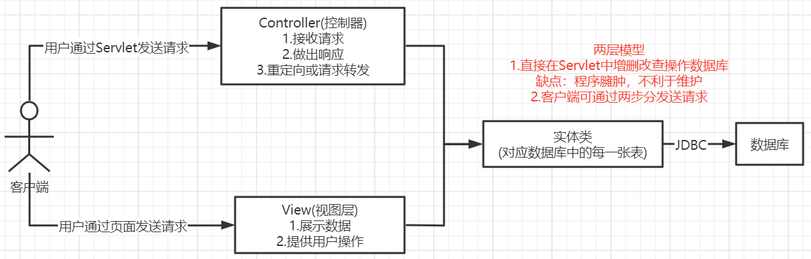

三层模型的架构如下

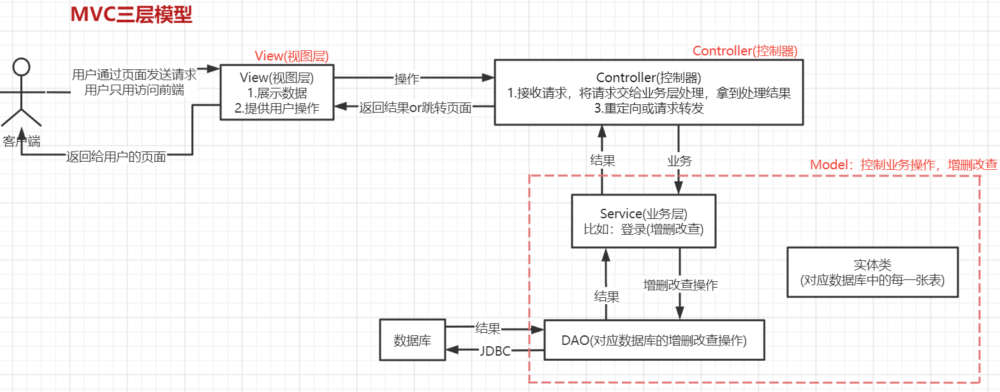

## 二、小萌神项目服务器端

### 1.创建项目


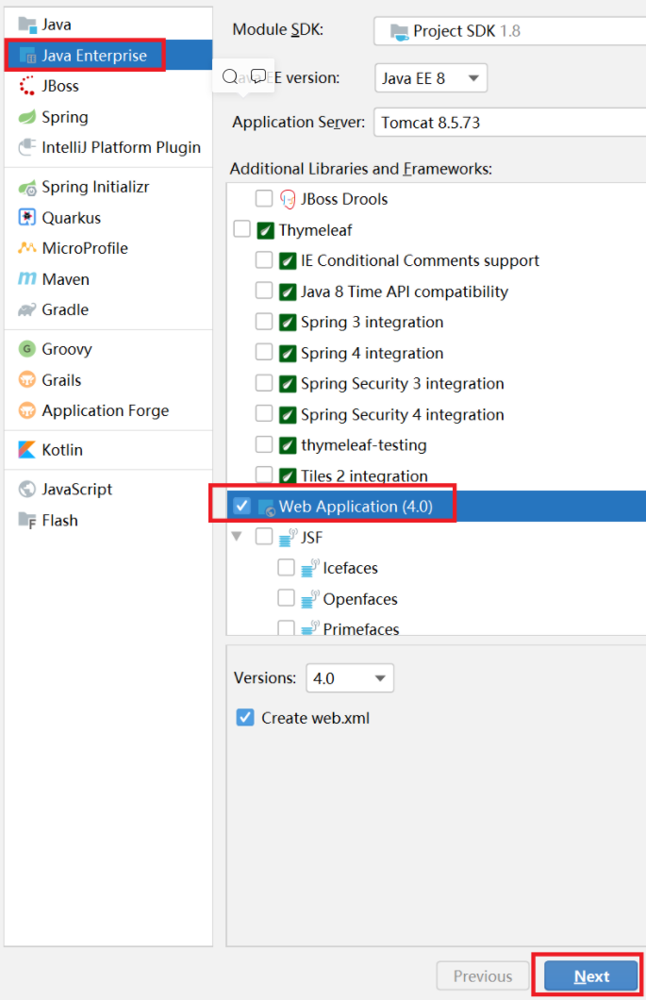

### 2.配置Tomcat

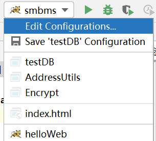

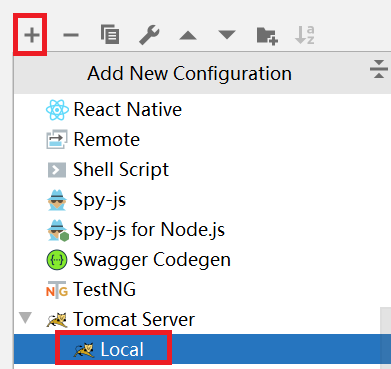

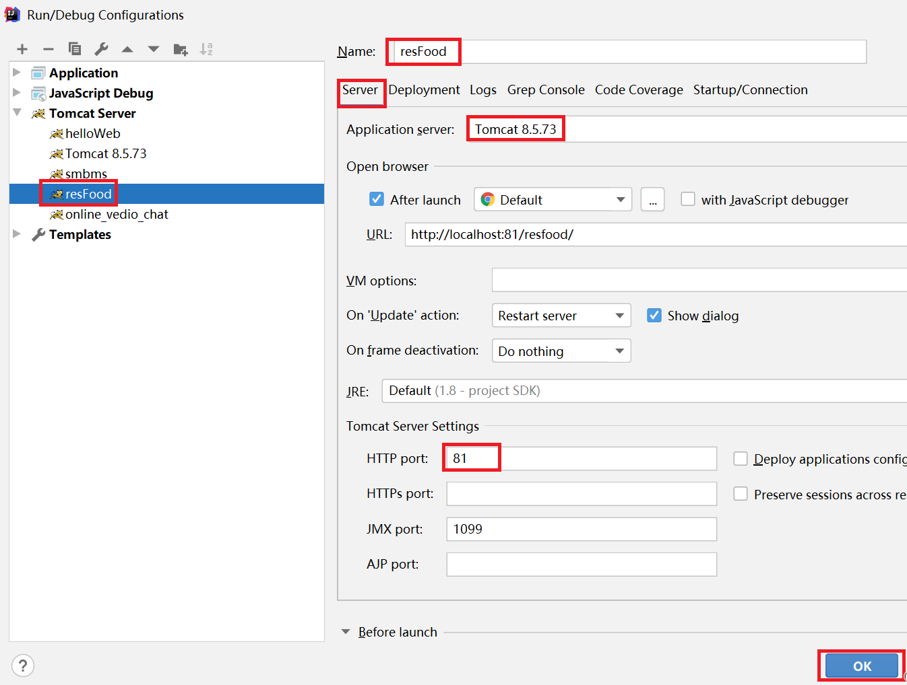

### 3.测试项目能否启动


### 4.添加依赖

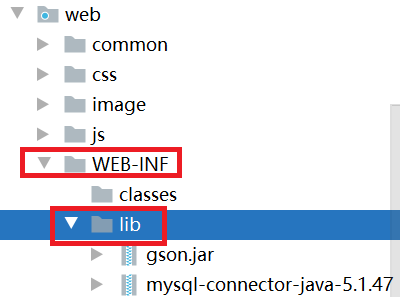

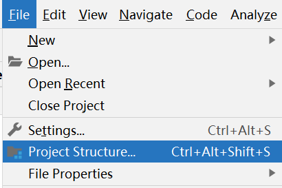


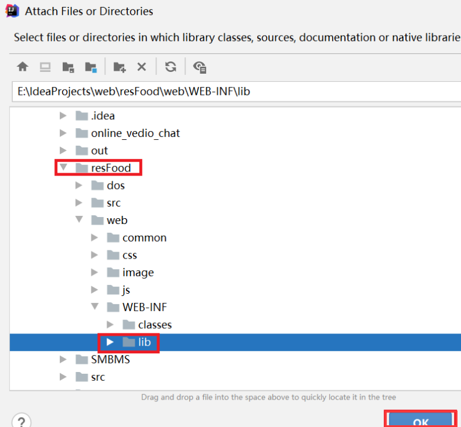

### 5.编写DB脚本

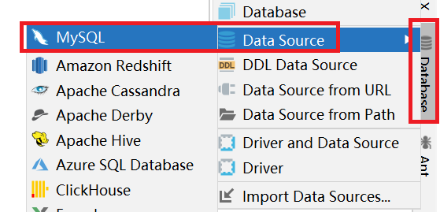

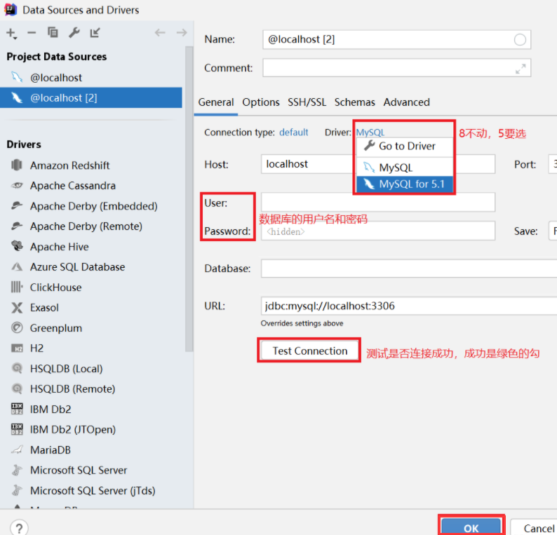

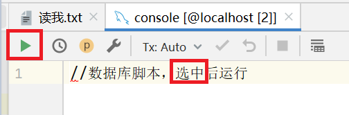

```mysql
--------------------------------------------------------------------
--                创建库，表，约束，过程，用户，权限等脚本
--------------------------------------------------------------------


--create database res;

CREATE DATABASE res DEFAULT CHARACTER SET utf8 COLLATE utf8_general_ci;

use res;

create table resadmin(
    raid int primary key auto_increment,
    raname varchar(50),
    rapwd  varchar(50)
);

create table resuser(
	userid int  primary key auto_increment,
	username varchar(50),
	pwd varchar(50), 
	email varchar(500)
);

--normprice:原价  realprice:现价   description:简介 detail详细的
create table resfood(
	fid int  primary key auto_increment,
	fname varchar(50) ,  
	normprice numeric(8,2),
	realprice numeric(8,2),
	detail varchar(2000),
	fphoto varchar(1000)
);
--订单表:   roid:订单号    userid:外键，下单的用户编号    ordertime:下单时间   uname:收货人姓名    deliverytype:送货方式   payment:支付方式, ps附言
create table resorder(
	roid int  primary key auto_increment,
	userid int,
	address varchar(500),
	tel varchar( 100),
	ordertime date,
	deliverytime date,
	ps varchar( 2000),
	status int
);
--订单表的下单人号与用户表中的客户编号有主外键关系. 
alter table resorder
	add constraint fk_resorder
	     foreign key(userid) references resuser(userid);
	     
--dealprice:成交价   roid:订单号   fid:商品号  num:数量
create table resorderitem(
	roiid int  primary key auto_increment,
	roid  int,
	fid   int,
	dealprice numeric(8,2),
	num     int
);

alter table resorderitem 
   add constraint fk_resorderitem_roid
      foreign key(roid) references resorder( roid);
      
 alter table resorderitem
   add constraint fk_tbl_res_fid
      foreign key( fid ) references resfood( fid);
     
 commit;
```

```mysql
use res;
insert into resadmin(raname,rapwd) values( 'a','0cc175b9c0f1b6a831c399e269772661');
select * from resadmin;
---用户表初始数据
insert into resuser( username, pwd,email) values( 'a', '0cc175b9c0f1b6a831c399e269772661','a@163.com');
insert into resuser( username, pwd,email) values( 'b', '0cc175b9c0f1b6a831c399e269772661','b@163.com');

--插入菜
insert into resfood(fname,normprice,realprice,detail, fphoto)  values('素炒莴笋丝',22.0,20.0,'营养丰富','500008.jpg');
insert into resfood(fname,normprice,realprice,detail, fphoto)  values('蛋炒饭',22.0,20.0,'营养丰富','500022.jpg');
insert into resfood( fname,normprice,realprice,detail, fphoto)  values('酸辣鱼',42.0,40.0,'营养丰富','500023.jpg');
insert into resfood( fname,normprice,realprice,detail, fphoto)  values('鲁粉',12.0,10.0,'营养丰富','500024.jpg');
insert into resfood(fname,normprice,realprice,detail, fphoto)  values('西红柿蛋汤',12.0,10.0,'营养丰富','500025.jpg');


insert into resfood(fname,normprice,realprice,detail, fphoto)   values('炖鸡',102.0,100.0,'营养丰富','500026.jpg');
insert into resfood(fname,normprice,realprice,detail, fphoto)  values('炒鸡',12.0,10.0,'营养丰富','500033.jpg');
insert into resfood(fname,normprice,realprice,detail, fphoto)   values('炒饭',12.0,10.0,'营养丰富','500034.jpg');
insert into resfood(fname,normprice,realprice,detail, fphoto)   values('手撕前女友',12.0,10.0,'营养丰富','500035.jpg');
insert into resfood(fname,normprice,realprice,detail, fphoto)  values('面条',12.0,10.0,'营养丰富','500036.jpg');
insert into resfood(fname,normprice,realprice,detail, fphoto)  values('端菜',12.0,10.0,'营养丰富','500038.jpg');
insert into resfood(fname,normprice,realprice,detail, fphoto)   values('酸豆角',12.0,10.0,'营养丰富','500041.jpg');

--不测试:   生成一条订单   a用户订了  1号菜1份,及2号菜2份
insert into resorder(userid,address,tel,ordertime,deliverytime,ps,status) 
values( 1,'湖南省衡阳市','13878789999',now(),now(),'送餐上门',0);

insert into resorderitem(roid,fid,dealprice,num)
values( 1,1,20,1);

insert into resorderitem(roid,fid,dealprice,num)
values( 1,2,20,1);
--注意以上的三条语句要求在事务中处理. 
commit; 

select * from resuser;
```

### 6.创建项目架构

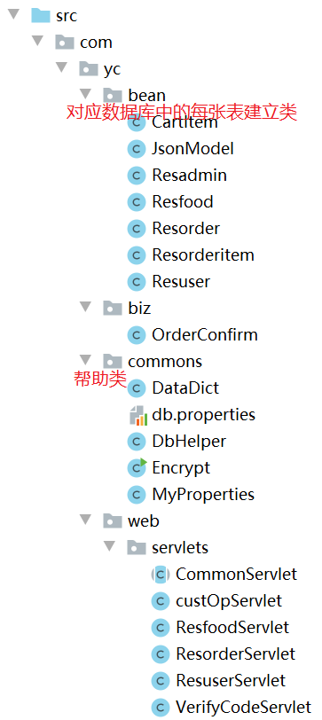

### 7.代码

#### 7.1.commons

- db.properties

```java
//mysql
driver_name=com.mysql.jdbc.Driver
url=jdbc:mysql://127.0.0.1:3306/res?characterEncoding=utf-8
user=root
password=aaaa//mysql数据库密码
```

- db.properties

```java
//oracle
driver_name=oracle.jdbc.driver.OracleDriver
url=jdbc:oracle:thin:@localhost:1521:orcl
user=scott
password=a
```

- MyProperties

```java
public class MyProperties extends Properties {
	//懒汉单例  防止实例未初始化
	public static MyProperties instance = new MyProperties();
	private MyProperties(){
		try {
			this.load(this.getClass().getClassLoader().getResourceAsStream("com/yc/commons/db.properties"));
		} catch (IOException e) {
			e.printStackTrace();
		}
	}
	public static MyProperties getInstince(){
		return instance;
	}
}
```

- DbHelper

```java
public class DbHelper {
	//驱动加载
	static{
		try {
			Class.forName(MyProperties.getInstince().getProperty("driver_name"));
		} catch (ClassNotFoundException e) {
			e.printStackTrace();
		}
	}
	
	//全局变量
	private Connection conn;
	private Statement stmt;
	private PreparedStatement pstmt;
	private ResultSet rs;
	
	//获取连接对象 Connection conn
	public Connection getConn(){
		try {
			Properties p = MyProperties.getInstince();
			conn = DriverManager.getConnection(p.getProperty("url"),p);
		} catch (SQLException e) {
			System.out.println("获取连接对象失败："+e.getMessage());
			e.printStackTrace();
		}
		return conn;
	}

	//获取 Statement stmt
	public Statement getStmt(){
		try {
			stmt = conn.createStatement();
		} catch (SQLException e) {
			e.printStackTrace();
		}
		return stmt;
	}
	
	//关闭所有资源型
	public void closeAll(Connection conn,Statement pstmt,ResultSet rs){
		if(rs!=null){
			try {
				rs.close();
			} catch (SQLException e) {
				e.printStackTrace();
			}
		}
		if(pstmt!=null){
			try {
				pstmt.close();
			} catch (SQLException e) {
				e.printStackTrace();
			}
		}
		if(conn!=null){
			try {
				conn.close();
			} catch (SQLException e) {
				e.printStackTrace();
			}
		}
	}
	
	//给sql设置参数
	public void setParams(PreparedStatement pstmt,Object...params) throws Exception{
		if(params==null||params.length<=0){
			return ;
		}
		for(int i=0;i<params.length;i++){
			pstmt.setObject(i+1, params[i]);
		}
	}
	
	//单条sql语句更新
	public int update(String sql,Object...params) throws Exception{
		int result=0;
		try {
			conn=getConn();
			pstmt=conn.prepareStatement(sql);
			setParams(pstmt, params);
			result=pstmt.executeUpdate();
		} catch (SQLException e) {
			e.printStackTrace();
			System.out.println("单条更新异常："+e.getMessage());
			throw e;//将异常抛出到调用部分，这样可以将错误信息显示在客户端
		}finally {
			closeAll(conn, pstmt, null);
		}
		return result;
	}

	/**
	 * 多条更新sql语句(带了事务的更新操作)
	 */
	public int update(List<String> sqls,List<List<Object>> params) throws Exception{
		int result = 0;
		try {
			conn=getConn();
			//将事务设为手动处理，即关闭隐式事务提交
			conn.setAutoCommit(false);
			//循环所有的sql语句
			for(int i=0;i<sqls.size();i++){
				//获取单条sql语句
				String sql = sqls.get(i);
				//获取与sql语句对应位置的参数设置List
				List<Object> param = params.get(i);
				pstmt=conn.prepareStatement(sql);
				//设置参数
				setParams(pstmt, param.toArray());//将集合转为对象数组
				result=pstmt.executeUpdate();
				if(result<=0){
					//更新受影响的函数认为更新失败，撤销前面所有的操作
					conn.rollback();
					return result;
				}
			}
			//执行成功——手动提交事务
			conn.commit();//一次性将所有的事务提交
		} catch (SQLException e) {
			//事务回滚
			conn.rollback();
			result=0;
			e.printStackTrace();
			System.out.println("多条更新异常："+e.getMessage());
			throw e;
		}finally {
			//事务还原
			conn.setAutoCommit(true);
			closeAll(conn, pstmt, null);
		}
		return result;
	}

	//获取所有列名
	public List<String> getColumnNames(ResultSet rs) throws SQLException{
		List<String> colunmNames = new ArrayList<String>();
		//通过结果集对象获取结果集所有的列及属性
		ResultSetMetaData data = rs.getMetaData();
		// 获取此 ResultSet 对象的列的编号、类型和属性
		int count = data.getColumnCount();//根据sql语句查看列的条数
		//System.out.println(count);
		//列的编号从1开始
		for(int i=1;i<=count;i++){
			colunmNames.add(data.getColumnName(i));
		}
		//System.out.println(colunmNames);
		return colunmNames;
	}

	//获取 T 对象中所有的set方法
	private List<Method> getAllSetMethod(Class cls){
		List<Method> setMethods = new ArrayList<Method>();
		Method[] methods = cls.getMethods();
		for (Method m:methods){
			if (m.getName().startsWith("set")){//如果set开头
				setMethods.add(m);
			}
		}
		return setMethods;
	}

	//将 Map 中的数据转存到 T 对象
	private <T>T parseMapToT(Class<T> cls,Map<String,Object> map) throws Exception{
		T t = cls.newInstance();
		//2.从cls中取出所有的set方法，设置值
		List<Method> setMethods = getAllSetMethod(cls);
		//3.循环取键值
		for (Map.Entry<String,Object> entry : map.entrySet()){
			String key = entry.getKey().toString();
			Object values = entry.getValue();

			for (Method m:setMethods){
				if(m.getName().equalsIgnoreCase("set"+key)){
					//依次取出每个参数的类型  setXXX的参数
					String typeName = m.getParameterTypes()[0].getTypeName();
					if("int".equalsIgnoreCase(typeName) || "java.lang.Integer".equalsIgnoreCase(typeName)){
						m.invoke(t,Integer.parseInt(values.toString()));
					}else if("long".equalsIgnoreCase(typeName) || "java.lang.Long".equalsIgnoreCase(typeName)){
						m.invoke(t,Long.parseLong(values.toString()));
					}else if("float".equalsIgnoreCase(typeName) || "java.lang.Float".equalsIgnoreCase(typeName)){
						m.invoke(t,Float.parseFloat(values.toString()));
					}else if("double".equalsIgnoreCase(typeName) || "java.lang.Double".equalsIgnoreCase(typeName)){
						m.invoke(t,Double.parseDouble(values.toString()));
					}else if("boolean".equalsIgnoreCase(typeName) || "java.lang.Boolean".equalsIgnoreCase(typeName)){
						m.invoke(t,Boolean.parseBoolean(values.toString()));
					}else {
						m.invoke(t,values.toString());
					}
					break;
				}
			}
		}
		return t;
	}

	//返回一条记录查询操作
	public Map<String,Object> findSingle(String sql,Object...params) throws Exception{
		Map<String,Object> map=null;
		try {
			conn=getConn();
			pstmt=conn.prepareStatement(sql);
			setParams(pstmt, params);//给？设置参数
			//返回结果集对象
			rs = pstmt.executeQuery();
			//获取所有的列名
			List<String> columnNames=getColumnNames(rs);

			if(rs.next()){
				map = new HashMap<String,Object>();

				for(String name:columnNames){
					//根据名称获取值
					Object obj = rs.getObject(name);

					if(obj==null)continue;

					//获取当前值的数据类型
					String typeName = obj.getClass().getName();

					//数据库不擅长存BLOB和CLOB等大数据,性能太差-->每种服务器的使用场景不同，尽量避免使用短板
					map.put(name, rs.getObject(name));
				}
			}
		} catch (SQLException e) {
			e.printStackTrace();
			System.out.println("单条查询异常："+e.getMessage());
			throw e;
		}finally {
			closeAll(conn, pstmt, rs);
		}
		return map;
	}

	//单条查询到的 Map 结果转成 T 对象
	public <T>T findSingle(Class<T> cls,String sql,Object...params) throws Exception{
		Map<String,Object> map = findSingle(sql,params);
		return parseMapToT(cls,map);
	}

	//返回多条记录查询操作
	public List<Map<String,Object>> findMutipl(String sql,Object...params)throws Exception{
		Map<String,Object> map=null;
		List<Map<String,Object>> list=new ArrayList<Map<String,Object>>();
		try {
			conn=getConn();
			pstmt=conn.prepareStatement(sql);
			setParams(pstmt, params);
			rs = pstmt.executeQuery();
			List<String> columnNames=getColumnNames(rs);
			//System.out.println(columnNames);

			//多条数据
			while(rs.next()){
				map = new HashMap<String,Object>();

				for(String name:columnNames){
					//根据名称获取值
					Object obj = rs.getObject(name);
					//System.out.println(obj);

					if(obj==null)continue;

					//获取当前值的数据类型
					String typeName = obj.getClass().getName();

					map.put(name, rs.getObject(name));
				}
				list.add(map);
				//System.out.println("list:"+list);
			}
		} catch (SQLException e) {
			e.printStackTrace();
			System.out.println("单条查询异常："+e.getMessage());
			throw e;
		}finally {
			closeAll(conn, pstmt, rs);
		}
		return list;
	}

	//单条查询到的 List 结果转成 T 对象后再次封装到 List返回
	public <T>List<T> findMutipl(Class<T> cls,String sql,Object...params)throws Exception{
		List<Map<String,Object>> list = findMutipl(sql,params);
		List<T> listT = new ArrayList<T>();
		for (Map<String,Object> map:list){
			listT.add(parseMapToT(cls,map));
		}
		return listT;
	}

	//聚合函数查询  单个聚合函数 select count(*) from 表名
	public double getPloymer(String sql,Object...params) throws Exception{
		double result=0;
		try {
			conn=getConn();
			pstmt=conn.prepareStatement(sql);
			setParams(pstmt, params);
			rs=pstmt.executeQuery();
			if(rs.next()){
				result=rs.getDouble(1);
				//double 的形式获取此 ResultSet 对象的当前行中指定列的值   列1
			}
		} catch (SQLException e) {
			e.printStackTrace();
			throw new Exception("聚合函数查询失败："+e.getMessage());
		}finally{
			closeAll(conn, pstmt, rs);
		}
		return result;
	}
}
```

- Encrypt

```java
/**
 - 加密工具类
 - md5加密出来的长度是32位
 - sha加密出来的长度是40位
 */
public class Encrypt {

	/**
	 * 测试
	 */
	public static void main(String[] args) {
		// md5加密测试   单向加密 没办法恢复成原来密码  但是容易破解
		String md5_1 = md5("a");
		String md5_2 = md5("1");

		System.out.println(md5_1 + "\n" + md5_2);
		// sha加密测试  单向加密 没办法恢复成原来密码    但是容易破解
		String sha_1 = sha("a");
		String sha_2 = sha("1");
		System.out.println(sha_1 + "\n" + sha_2);

		//破解	->   彩虹表	(通过加密出来的密码是固定的 , 网上可以查到)
		//0cc175b9c0f1b6a831c399e269772661		a
		//c4ca4238a0b923820dcc509a6f75849b		1
		//升级： 加盐     多次加密
		//54f74fbfb94518a527a36474dc904c25		a
		System.out.println( md5( md5( md5("a" ) ) ) );//多次加密
		//5eb03b8172b979cd387f25e26982b313		a
		System.out.println( md5( sha( md5("a" ) ) ) );//混合加密

		//应用价值:  因为使用md5和sha加密得到的结果是不一样的(散列效果),所以可以用于制作指纹.识别文件.
	}

	/**
	 * 加密
	 *
	 * @param inputText
	 * @return
	 */
	public static String e(String inputText) {
		return md5(inputText);
	}

	/**
	 * 二次加密，应该破解不了了吧？
	 * @param inputText
	 * @return
	 */
	public static String md5AndSha(String inputText) {
		return sha(md5(inputText));
	}

	/**
	 * md5加密
	 * @param inputText
	 * @return
	 */
	public static String md5(String inputText) {
		return encrypt(inputText, "md5");
	}

	/**
	 * sha加密
	 * @param inputText
	 * @return
	 */
	public static String sha(String inputText) {
		return encrypt(inputText, "sha-1");
	}

	/**
	 * md5或者sha-1加密
	 *
	 * @param inputText
	 *            要加密的内容
	 * @param algorithmName
	 *            加密算法名称：md5或者sha-1，不区分大小写
	 * @return
	 */
	private static String encrypt(String inputText, String algorithmName) {
		if (inputText == null || "".equals(inputText.trim())) {
			throw new IllegalArgumentException("请输入要加密的内容");
		}
		if (algorithmName == null || "".equals(algorithmName.trim())) {
			algorithmName = "md5";
		}
		String encryptText = null;
		try {
			MessageDigest m = MessageDigest.getInstance(algorithmName);
			m.update(inputText.getBytes("UTF8"));
			byte s[] = m.digest();
			// m.digest(inputText.getBytes("UTF8"));
			return hex(s);
		} catch (NoSuchAlgorithmException e) {
			e.printStackTrace();
		} catch (UnsupportedEncodingException e) {
			e.printStackTrace();
		}
		return encryptText;
	}

	/**
	 * 返回十六进制字符串
	 * @param arr
	 * @return
	 */
	private static String hex(byte[] arr) {
		StringBuffer sb = new StringBuffer();
		for (int i = 0; i < arr.length; ++i) {
			sb.append(Integer.toHexString((arr[i] & 0xFF) | 0x100).substring(1, 3));
		}
		return sb.toString();
	}
}
```

- DataDict

```java
/**
 - 中间数据类   数据字典类
 */
public class DataDict {
    //保存session中用户信息的键名     方便修改   方便使用
    public static final String RESUSER="resuser";

    //购物车
    public static final String CART="cart";

    //下单状态
    public static final Integer ORDER_STATUS_ORDERED=1;
}
```

#### 7.2.bean

```java
/**
 * JSON回送数据模型，将数据包装成一个对象在转成json字符串
 *
 * implements Serializable：序列化接口
 */
public class JsonModel implements Serializable {
    private Integer code;//是否出错
    private String msg;//出错之后的异常信息
    private Object data;//数据
    
    public void setCode(Integer code) {this.code = code;}
    public void setMsg(String msg) {this.msg = msg;}
    public void setData(Object data) {this.data = data;}
    public Integer getCode() {return code;}
    public String getMsg() {return msg;}
    public Object getData() {return data;}
}
```

#### 7.3.biz

```java
/**
 - 自动生成的列的插法和Oracle不同
 */
public class OrderConfirm {
    public void confirm(Resorder resorder, Map<Integer, CartItem> cart) throws Exception {
        DbHelper dbHelper = new DbHelper();
        Connection con = dbHelper.getConn();

        //关闭隐式事务
        try {
            con.setAutoCommit(false);
            String sql = "insert into resorder(userid,address,tel,ordertime,deliverytime,ps,status) values( ?,?,?,now(),?,?,?)";
            PreparedStatement pstmt = con.prepareStatement(sql, Statement.RETURN_GENERATED_KEYS);
            pstmt.setString(1,resorder.getUserid()+"");
            pstmt.setString(2,resorder.getAddress()+"");
            pstmt.setString(3,resorder.getTel()+"");
            pstmt.setString(4,resorder.getDeliverytime()+"");
            pstmt.setString(5,resorder.getPs()+"");
            pstmt.setString(6,resorder.getStatus()+"");
            pstmt.executeUpdate();
            Integer roid = null;

            //获取自动生成的订单号
            ResultSet rs = pstmt.getGeneratedKeys();
            if(rs.next()){
                roid = rs.getInt(1);
            }
            if(roid==null){
                throw new Exception("订单添加失败");
            }

            //循环添加订单详情
            for (Map.Entry<Integer,CartItem> entry:cart.entrySet()){
                int fid = entry.getKey();
                CartItem ci = entry.getValue();
                Resfood resfood = ci.getResfood();
                int num = ci.getNum();
                double smallCount = ci.getSmallCount();

                String sql2 = "insert into resorderitem(roid,fid,dealprice,num) values(?,?,?,?)";
                PreparedStatement pstmt2 = con.prepareStatement(sql2);
                pstmt2.setString(1,roid+"");
                pstmt2.setString(2,resfood.getFid()+"");
                pstmt2.setString(3,resfood.getRealprice()+"");
                pstmt2.setString(4,num+"");
                pstmt2.executeUpdate();
            }
            con.commit();
        }catch (Exception e) {
            con.rollback();
            e.printStackTrace();
            throw e;
        }finally {
            if(con!=null && con.isClosed()==false){
                con.setAutoCommit(true);
                con.close();
            }
        }
    }
}
```

#### 7.4.web/servlets

* CommonServlet（封装提升）

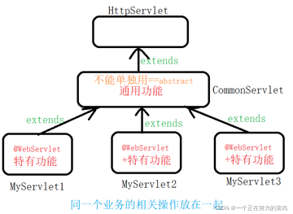

```java
/*
    通用工具类=====abstract  不能直接用

    调用顺序
    1.构造块 构造方法 init()  service()  super.service()  doGet()/doPost()
    2.                      service()  super.service()  doGet()/doPost()

    有错==》看是哪一端的错误
        客户端：在开发者工具
        服务端：看自己的代码

 */

public abstract class CommonServlet extends HttpServlet {
    /**
     * 每次生命周期一定会执行这个，调用一次===》设置编码
     */
    @Override
    protected void service(HttpServletRequest req, HttpServletResponse resp) throws ServletException, IOException {
        req.setCharacterEncoding("utf-8");//必须在super.service(req, resp);的前面执行
        // 本来在doGet()/doPost()中执行==>此处封装的话若在super.service(req, resp);之后则顺序是
        //super.service()  doGet()/doPost()   req.setCharacterEncoding("utf-8"); ====》 这样设置的话就晚了

        super.service(req, resp);//不能删  删除了之后改生命周期以及之后的都不会执行
        //生命周期执行流程
    }

    @Override
    protected void doGet(HttpServletRequest request, HttpServletResponse response) throws ServletException, IOException {
        doPost(request,response);
    }

    /**
     * 判断使用哪个函数
     */
    @Override
    protected void doPost(HttpServletRequest req, HttpServletResponse resp) throws ServletException, IOException {
        /**
         * 解决请求分发
         */
        //1.取出请求的路径  yc108_showall
        /*String pathInfo = req.getPathInfo();
        System.out.println(pathInfo);//   /show*/

        //String methodName = pathInfo.substring(1);
        String methodName = req.getParameter("op");

        //3.激活下面对应的方法
            //不要采用if-else方=====>太死
            //策略模式   解决很多if-else问题

            //拿到这个类中所有的方法，判断这个方法名==methodName
            //反射
        Method[] methods = this.getClass().getDeclaredMethods();
        //getDeclaredMethods()获取本类中的方法
        //getMethods()只能不到public
        boolean isFindPage = false;
        for (Method m:methods){
            if(m.getName().equals(methodName)){
                try {
                    m.setAccessible(true);//设置私有方法的访问权限：可以被访问
                    m.invoke(this,req,resp);//激活方法(哪个对象,参数1,参数2)
                    isFindPage = true;
                } catch (IllegalAccessException e) {
                    e.printStackTrace();
                } catch (InvocationTargetException e) {
                    e.printStackTrace();
                }
            }
        }

        if(isFindPage==false){
            out404(resp);
        }
    }

    /**
     * 报错
     * @param resp
     * @throws IOException
     */
    protected void out404(HttpServletResponse resp) throws IOException {
        resp.setContentType("text/html;charset=utf-8");
        PrintWriter out = resp.getWriter();
        out.println("404");
        out.close();
    }

    /**
     * 获取界面中的参数，并存入到一个对应的类中保存
     * 返回一个将参数设置成对应界面信息的类
     *
     * <T>T  ===  限定类的类型必须为T
     *    上限  <? extends E>
     *    下线  <? super E>
     * Class<T> cls === 一个类的对象T   相当于List<String>
     */
    protected <T>T parseRequest(Class<T> cls,HttpServletRequest req) throws IllegalAccessException, InstantiationException, InvocationTargetException {
        //cls创建一个对象
        T t = cls.newInstance();
        //1.从request中取出所有参数
        Map<String,String[]> map = req.getParameterMap();
        //2.从cls中取出所有的set方法，设置值
        List<Method> setMethods = getAllSetMethod(cls);
        //3.循环取键值
        for (Map.Entry<String,String[]> entry : map.entrySet()){
            String key = entry.getKey().toString();
            String[] values = entry.getValue();

            for (Method m:setMethods){
                if(m.getName().equalsIgnoreCase("set"+key)){
                    //依次取出每个参数的类型  setXXX的参数
                    String typeName = m.getParameterTypes()[0].getTypeName();
                    if("int".equalsIgnoreCase(typeName) || "java.lang.Integer".equalsIgnoreCase(typeName)){
                        m.invoke(t,Integer.parseInt(values[0]));
                    }else if("long".equalsIgnoreCase(typeName) || "java.lang.Long".equalsIgnoreCase(typeName)){
                        m.invoke(t,Long.parseLong(values[0]));
                    }else if("float".equalsIgnoreCase(typeName) || "java.lang.Float".equalsIgnoreCase(typeName)){
                        m.invoke(t,Float.parseFloat(values[0]));
                    }else if("double".equalsIgnoreCase(typeName) || "java.lang.Double".equalsIgnoreCase(typeName)){
                        m.invoke(t,Double.parseDouble(values[0]));
                    }else if("boolean".equalsIgnoreCase(typeName) || "java.lang.Boolean".equalsIgnoreCase(typeName)){
                        m.invoke(t,Boolean.parseBoolean(values[0]));
                    }else {
                        m.invoke(t,values[0]);
                    }
                    break;
                }
            }
        }
        return t;
    }

    /**
     * 获取T对象中所有的set函数
     * @param cls
     * @return
     */
    private List<Method> getAllSetMethod(Class cls){
        List<Method> setMethods = new ArrayList<Method>();
        Method[] methods = cls.getMethods();
        for (Method m:methods){
            if (m.getName().startsWith("set")){//如果set开头
                setMethods.add(m);
            }
        }
        return setMethods;
    }

    /**
     * 将jsonmodel转为json的字符串，并利用response输出到客户端
     */
    protected void writeJson(JsonModel jm, HttpServletResponse response) throws IOException {
        //1.jm对象转成json字符串
        //第三方框架：将对象转为 json字符串  gson(google)  fastjson(alibaba)
        Gson gson = new Gson();
        String json = gson.toJson(jm);

        //2.通过responce将json字符串写到页面上
        //application/json   文件类型由http协议规范   在tomcat安装目录/conf/web.xml中找到对应的描述
        response.setContentType("application/json;charset=utf-8");
        PrintWriter out = response.getWriter();
        out.println(json);
        out.close();
    }
}
```

- custOpServlet

```java
@WebServlet("/custOp.action")
public class custOpServlet extends CommonServlet {
    private void confirmOrder(HttpServletRequest request, HttpServletResponse response) throws IOException {
        /*String address = request.getParameter("address");
        String tel = request.getParameter("tel");
        String deliverytime = request.getParameter("deliverytime");
        String ps = request.getParameter("ps");*/

        JsonModel jsonModel = new JsonModel();
        try {
            //读取参数
            Resorder resorder = super.parseRequest(Resorder.class,request);
            //获取用户id
            HttpSession session = request.getSession();
            Resuser resuser = (Resuser) session.getAttribute(DataDict.RESUSER);

            resorder.setUserid(resuser.getUserid());
            resorder.setStatus(DataDict.ORDER_STATUS_ORDERED);

            //取出购物车
            Map<Integer, CartItem> cart = (Map<Integer, CartItem>) session.getAttribute(DataDict.CART);

            //插入数据到数据库
            OrderConfirm oc = new OrderConfirm();
            oc.confirm(resorder,cart);

            //下单成功 购物车清空
            session.removeAttribute(DataDict.CART);
            jsonModel.setCode(1);
        } catch (Exception e) {
            jsonModel.setCode(0);
            jsonModel.setMsg(e.getMessage());
            e.printStackTrace();
        }
        super.writeJson(jsonModel,response);
    }
}
```

- ResfoodServlet

```java
@WebServlet("/resfood.action")
public class ResfoodServlet extends CommonServlet {
    private void findAllFoods(HttpServletRequest request,HttpServletResponse response) throws IOException {
        DbHelper db = new DbHelper();
        JsonModel jsonModel = new JsonModel();

        List<Resfood> list = null;
        try {
            list = db.findMutipl(Resfood.class,"select * from resfood");
            jsonModel.setCode(1);
            jsonModel.setData(list);
        } catch (Exception e) {
            jsonModel.setCode(0);
            jsonModel.setMsg(e.getMessage());
            e.printStackTrace();
        }

        super.writeJson(jsonModel,response);
    }
}
```

- ResorderServlet

```java
@WebServlet("/resorder.action")
public class ResorderServlet extends CommonServlet {
    private void order (HttpServletRequest request, HttpServletResponse response) throws Exception {
        JsonModel jsonModel = new JsonModel();

        try {
            //判断是否登录
            HttpSession session = request.getSession();
            if (session.getAttribute(DataDict.RESUSER)==null){
                jsonModel.setCode(-1);
                super.writeJson(jsonModel,response);
                return;
            }

            //获取参数   参数多就写一个类
            int fid = Integer.parseInt(request.getParameter("fid"));
            int num = Integer.parseInt(request.getParameter("num"));
            //验正是否有该商品  能不能购买......

            //加入购物车  map(fid , 购物车项)
            Map<Integer, CartItem> cart = null;//线程安全的Map
            if (session.getAttribute(DataDict.CART)!=null){
                cart = (Map<Integer, CartItem>) session.getAttribute(DataDict.CART);
            }else{
                cart = new ConcurrentHashMap<>();
            }

            //判断是否有fid这个键=====数据库查找
            String sql = "select * from resfood where fid=?";
            DbHelper db = new DbHelper();
            Resfood resfood = db.findSingle(Resfood.class,sql,fid);
            if(resfood==null){
                jsonModel.setCode(0);
                jsonModel.setMsg("无该商品");
                super.writeJson(jsonModel,response);
                return;
            }

            CartItem cartItem = null;//购物车项
            if (cart.containsKey(fid)){//有=====原来买过   只用添加数量和小计
                cartItem=cart.get(fid);
                cartItem.setNum(cartItem.getNum()+num);
            }else{
                cartItem = new CartItem();//原来没有买过
                cartItem.setResfood(resfood);
                cartItem.setNum(num);
                cart.put(fid,cartItem);
            }

            cartItem.getSmallCount();//此时就已经设置了小计了
            cart.put(fid,cartItem);

            //购买数量<=0   删除这个商品
            if (cartItem.getNum()<=0){
                cart.remove(fid);
            }

            session.setAttribute(DataDict.CART,cart);

            //添加成功，回送信息
            jsonModel.setCode(1);
            jsonModel.setData(cart);
        }catch (Exception e){
            jsonModel.setCode(0);
            jsonModel.setMsg(e.getMessage());
            e.printStackTrace();
        }
        super.writeJson(jsonModel,response);
    }

    private void checkCart(HttpServletRequest request,HttpServletResponse response) throws IOException {
        HttpSession session  =request.getSession();
        JsonModel jsonModel = new JsonModel();
        if(session.getAttribute(DataDict.CART)!=null){
            jsonModel.setCode(1);
            jsonModel.setData(session.getAttribute(DataDict.CART));
        }else{
            jsonModel.setCode(0);
        }
        super.writeJson(jsonModel,response);
    }

    private void getCartInfo(HttpServletRequest request,HttpServletResponse response) throws IOException {
        JsonModel jsonModel = new JsonModel();
        DbHelper db = new DbHelper();
        HttpSession session = request.getSession();

        //以Map<Integer,CartItem> cart形式返回data

        try {
            //检查是否登录
            if(session.getAttribute(DataDict.RESUSER)==null){
                jsonModel.setCode(-1);
                super.writeJson(jsonModel,response);
                return ;
            }

            Map<Integer, CartItem> cart = new ConcurrentHashMap<>();

            //查询该用户的购物车   保存num resfood smallCount
            //从数据库查出来放入session
            List<Resorderitem> list = db.findMutipl(Resorderitem.class,"select * from resorderitem");
            if (list==null || list.isEmpty()){
                jsonModel.setCode(0);
                jsonModel.setMsg("购物车为空");
                return;
            }
            for (Resorderitem item:list){
                CartItem cartItem = new CartItem();
                cartItem.setNum(item.getNum());

                //去数据库查出这个fid的信息
                Resfood resfood = db.findSingle(Resfood.class,"select * from resfood where fid=?",item.getFid());
                if(resfood!=null){
                    cartItem.setResfood(resfood);
                }else{
                    //商品在购物车时候停售了。。。。。
                }

                cartItem.getSmallCount();
                cart.put(item.getFid(),cartItem);
            }
            session.setAttribute(DataDict.CART,cart);

            jsonModel.setCode(1);
            jsonModel.setData(cart);
        } catch (Exception e) {
            jsonModel.setCode(0);
            jsonModel.setMsg(e.getMessage());
            e.printStackTrace();
        }

        super.writeJson(jsonModel,response);
    }

    private void clearAll(HttpServletRequest request,HttpServletResponse response) throws IOException {
        //判断是否登录
        JsonModel jsonModel = new JsonModel();
        HttpSession session = request.getSession();
        if (session.getAttribute(DataDict.RESUSER)==null){
            jsonModel.setCode(-1);
            super.writeJson(jsonModel,response);
            return;
        }

        session.removeAttribute(DataDict.CART);

        jsonModel.setCode(1);
        jsonModel.setData(session.getAttribute(DataDict.CART));
        super.writeJson(jsonModel,response);
    }
}
```

- ResuserServlet

```java
@WebServlet("/resuser.action")
public class ResuserServlet extends CommonServlet {
    private void login(HttpServletRequest request,HttpServletResponse response) throws IOException {
        String uname = request.getParameter("uname");
        String pwd = request.getParameter("pwd");
        //System.out.println(uname+"   "+pwd);
        pwd = Encrypt.md5(pwd);//加密
        String yzm = request.getParameter("yzm");

        JsonModel jsonModel = new JsonModel();

        HttpSession session = request.getSession();
        String validateCode = (String) session.getAttribute("validateCode");
        if(!validateCode.equals(yzm)){
            jsonModel.setCode(-1);
            jsonModel.setMsg("验证码不一致，请验证后登录");
            super.writeJson(jsonModel,response);
            return;
        }
        DbHelper db = new DbHelper();

        Resuser resuser = null;
        try {
            resuser = db.findSingle(Resuser.class,"select * from resuser where username=? and pwd=?",uname,pwd);
            if(resuser!=null){
                jsonModel.setCode(1);
                resuser.setPwd("");//密码敏感，不要通过网络传输
                jsonModel.setData(resuser);
                //登录成功后，在服务器端保存用户信息，方便后序使用=====一个用户对应一个session
                session.setAttribute("resuser",resuser);
            }else{
                jsonModel.setCode(0);
                jsonModel.setMsg("用户名或密码错误");
            }
        } catch (Exception e) {
            jsonModel.setCode(0);
            jsonModel.setMsg(e.getMessage());
            e.printStackTrace();
        }

        super.writeJson(jsonModel,response);
    }

    private void logout(HttpServletRequest request,HttpServletResponse response) throws IOException {
        JsonModel jsonModel = new JsonModel();

        HttpSession session = request.getSession();
        session.removeAttribute(DataDict.RESUSER);
        session.removeAttribute(DataDict.CART);

        jsonModel.setCode(1);

        super.writeJson(jsonModel,response);
    }

    private void checkLogin(HttpServletRequest request,HttpServletResponse response) throws IOException {
        JsonModel jsonModel = new JsonModel();

        HttpSession session = request.getSession();
        Resuser resuser = (Resuser) session.getAttribute("resuser");

        if(session.getAttribute("resuser")!=null){
            resuser.setPwd("");//敏感信息
            jsonModel.setCode(1);
            jsonModel.setData(resuser);
        }else{
            jsonModel.setCode(0);
        }
        super.writeJson(jsonModel,response);
    }

    private void newyzm(HttpServletRequest request,HttpServletResponse response) throws IOException {
        Integer number = new Random().nextInt(1000);
        JsonModel jsonModel = new JsonModel();
        jsonModel.setCode(1);
        jsonModel.setData(number);
        super.writeJson(jsonModel,response);
    }
}
```

- VerifyCodeServlet

```java
//验证码. 图形码.
@WebServlet("/varifyCode.action")
public class VerifyCodeServlet extends HttpServlet {
    // 验证码图片的宽度。
    private int width = 60;
    // 验证码图片的高度。
    private int height = 20;
    // 验证码字符个数
    private int codeCount = 4;
    private int x = 0;
    // 字体高度
    private int fontHeight;
    private int codeY;

    char[] codeSequence = {'A', 'B', 'C', 'D', 'E', 'F', 'G', 'H', 'I', 'J',
            'K', 'L', 'M', 'N', 'O', 'P', 'Q', 'R', 'S', 'T', 'U', 'V', 'W',
            'X', 'Y', 'Z', '0', '1', '2', '3', '4', '5', '6', '7', '8', '9'};
    //备选验证码组成

    /**
     * 初始化验证图片属性
     */
    public void initxuan() throws ServletException {
        // 从web.xml中获取初始信息
        // 宽度
        String strWidth = "80";
        // 高度
        String strHeight = "30";
        // 字符个数
        String strCodeCount = "4";
        // 将配置的信息转换成数值
        try {
            if (strWidth != null && strWidth.length() != 0) {
                width = Integer.parseInt(strWidth);
            }
            if (strHeight != null && strHeight.length() != 0) {
                height = Integer.parseInt(strHeight);
            }
            if (strCodeCount != null && strCodeCount.length() != 0) {
                codeCount = Integer.parseInt(strCodeCount);
            }
        } catch (NumberFormatException e) {
        }
        x = width / (codeCount + 1);
        fontHeight = height - 2;
        codeY = height - 4;
    }


    @Override
    public void service(HttpServletRequest req, HttpServletResponse resp)
            throws ServletException, java.io.IOException {
        initxuan();
        // 定义图像buffer
        BufferedImage buffImg = new BufferedImage(width, height,//缓冲图片对象
                BufferedImage.TYPE_INT_RGB);
        Graphics2D g = buffImg.createGraphics();   //  创建一个画布
        // 创建一个随机数生成器类
        Random random = new Random();
        // 将图像填充为白色
        g.setColor(Color.WHITE);
        //绘制一个矩形
        g.fillRect(0, 0, width, height);
        // 创建字体，字体的大小应该根据图片的高度来定。
        Font font = new Font("Fixedsys", Font.PLAIN, fontHeight);
        // 设置字体。
        g.setFont(font);
        // 画边框。
        g.setColor(Color.BLACK);
        g.drawRect(0, 0, width - 1, height - 1);
        // 随机产生10条干扰线，使图象中的认证码不易被其它程序探测到。
        g.setColor(Color.BLACK);
        for (int i = 0; i < 10; i++) {
            int x = random.nextInt(width);
            int y = random.nextInt(height);
            int xl = random.nextInt(12);
            int yl = random.nextInt(12);
            g.drawLine(x, y, x + xl, y + yl);
        }
        // randomCode用于保存随机产生的验证码，以便用户登录后进行验证。
        StringBuffer randomCode = new StringBuffer();
        int red = 0, green = 0, blue = 0;
        // 随机产生codeCount数字的验证码。
        for (int i = 0; i < codeCount; i++) {
            // 得到随机产生的验证码数字。
            String strRand = String.valueOf(    codeSequence[random.nextInt(codeSequence.length)]    );
            // 产生随机的颜色分量来构造颜色值，这样输出的每位数字的颜色值都将不同。
            red = random.nextInt(255);   //   颜色值 范围 :  0-255
            green = random.nextInt(255);
            blue = random.nextInt(255);
            // 用随机产生的颜色将验证码绘制到图像中。
            g.setColor(new Color(red, green, blue));
            g.drawString(strRand, (i + 1) * x, codeY);   //图片上绘制字
            // 将产生的四个随机数组合在一起。用于存session
            randomCode.append(strRand);
        }

        // **********将四位数字的验证码保存到Session中。
        HttpSession session = req.getSession();
        session.setAttribute("validateCode", randomCode.toString());//存随机生成的验证码

        //允许跨域访问
        resp.setHeader("Access-Control-Allow-Origin", "*");//手机  服务器默认不可以跨域
        // 禁止图像缓存。
        resp.setHeader("Pragma", "no-cache");
        resp.setHeader("Cache-Control", "no-cache");
        resp.setDateHeader("Expires", 0);
        //**************************************设置响应的数据类型：  image/jpeg, 这样浏览器会以图像显示
        resp.setContentType("image/jpeg");
        //resp.setContentType("text/html;charset=utf-8");
        // 将图像输出到Servlet输出流中。
        //PrintWriter out=resp.getWriter();
        ServletOutputStream sos = resp.getOutputStream();//因为是图片，所以是字节流
        ImageIO.write(buffImg, "jpeg", sos);
        sos.close();
    }
}
```


