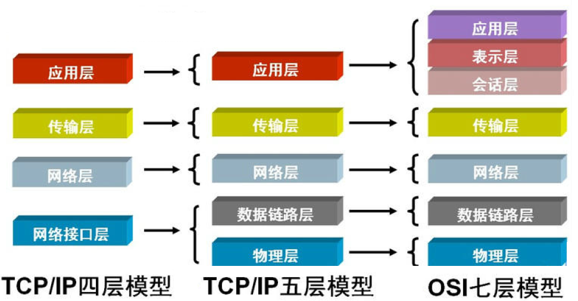

# 网络

## 一、TCP/IP五层模型

### 1.TCP/IP五层模型概述

互联网每层都有自己的功能，上一层依靠下一层，越下面的层，越靠近硬件，越上面的层，越靠近用户

如何分层也有不同的模型，此处重点介绍五层模型，待讲透五层模型后再对比四层、七层模型

每一层都是为了完成一种功能，为了实现这些功能就需要大家都遵守共同的规则，该规则就叫协议，每层都定义很多协议，这些协议统称为互联网协议

### 2.五层模型图解

## 二、实体层

电脑间需要形成网络，第一件事当然是建立联系，可以用光缆、电缆、双绞线、无线电波等方式，这就是实体层

**实体层指将电脑连起来的物理手段，主要规定一些电气特性，负责传输0和1的电信号**

## 三、链路层

### 1.什么是链路层？

单纯的0和1是无意义的，必须规定多少电信号算一组？每个电信号位有何意义？这就是链路层

**链路层确定0和1电信号的分组方式**

### 2.以太网协议

以太网协议规定，**一组电信号构成一个数据包，称作帧(Frame)，帧由标头(Head)和数组组成(Data)**

标头包含**数据包的说明项**，比如发送者、接受者、数据类型等等，**长度固定为18字节**

数据则指的是**数据包的具体内容**，**长度最短为46字节，最长为1500字节**，因此帧最短为64字节，最长为1518字节，如果数据过长就必须分成多个帧进行发送

### 3.MAC地址

帧的标头内包含发送者和接收者信息，那么发送者和接收者如何标识呢？

以太网协议规定，**连入网络的所有设备都必须包含网卡接口**，数据包从一个网卡传输到另一个网卡，**数据包只能在网卡间传输**，其中网卡地址就是数据包的发送方地址和接收方地址，叫做MAC地址

**每块网卡出厂时都有独一无二的MAC地址**，**长度为48个二进制位，通常用12个十六进制数表示**，前6个十六进制数是厂商编号，后6个十六进制数是该厂商的网卡流水号

**以太网数据包必须知道接收方的MAC地址才能发送**

### 4.广播

定义地址只是第一步，一块网卡怎么会知道另一块网卡的MAC地址呢？

以太网采用了一种很“原始”的方式，它不是把数据包准确送到接收方，而是**将数据包发送给本网络的所有计算机，让每台计算机自己判断自己是不是接收方**，这就叫广播

如图，①向②发送数据包，同网络的③④⑤都会收到该数据包，每台计算机取该数据包标头内的接收方的MAC地址与自己的MAC地址比较，若两者相同则接收该包，否则丢弃

> 广播风暴指信息量大造成的阻塞现象

### 5.小结

链路层中，数据包、MAC地址、广播使得本网络计算机间取得联系，可传输数据

## 四、网络层

> [参考文章1](http://www.ruanyifeng.com/blog/2012/05/internet_protocol_suite_part_i.html)	[参考文章2](https://www.ruanyifeng.com/blog/2012/06/internet_protocol_suite_part_ii.html)