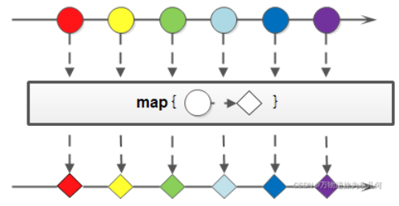

# Stream

## 一、什么是Stream？

`Stream`指将待处理的元素集合看成流，流在管道中传输，可以管道节点上借助`Stream API`对流中的元素进行操作，比如筛选、排序、聚合等

## 二、对流的操作

`Stream`可以由**数组或集合创建**，对流的操作分为两种

* **中间操作**：中间操作都返回流对象本身，可以含多个中间操作
* **终端操作**：每个流只能由一个终端操作，终端操作结束以后流也无法使用，理解`Stream`为**一次性流**

另外，`Stream`有几个特性

* `Stream`不会存储元素，按特定的规则对数据进行计算
* `Stream`不改变数据源，通常产生新的集合或值
* `Stream`具有延迟执行的特点，即只有在调用终端操作时，中间操作才会执行

## 三、方法引用::

**相当于创建Class类的实例对象class，通过实例对象class调用对应方法**

* 构造器方法引用：Class::new(调用默认构造器)
* 类静态方法引用：Class::static_method
* 类普通方法引用：Class::method
* 实例方法引用：Instance::method

## 四、函数式接口

函数式接口含两个条件，即**含`@FunctionalInterface`注解和只有一个抽象方法**，不包括与Object方法重名的方法

```java
@FunctionalInterface//函数式接口注解，表示支持函数式操作
interface Action<T> {
    void execute(T t);//有且仅有的抽象方法
}
```

函数式接口的使用方法如下

* 作为函数式接口中抽象方法的execute的实现

```java
Action action = System.out::println;
action.execute("hello");
```

* 回调方式

```java
static void test(Action action, String str) {
    action.execute(str);
}
test(System.out::println, "hello");
```

* **新无参无返回值方法替换函数式接口的唯一抽象函数**，与唯一抽象函数同型都可以这样做

```java
public void sleepMethod(){
	System.out.println("hello");
}
//相当于sleepMethod替代run
new Thread(ClassName::sleepMethod).start();
```

## 五、谓词Predicate

谓词Predicate可将函数作为参数传递

```java
@Data//这是一个苹果类
class Apple {
    private String color;
    private int weight;
    public Apple(String color, int weight) {
        this.color = color;
        this.weight = weight;
    }
    public static boolean isGreenApple(Apple apple) {
        return "green".equals(apple.getColor());
    }
    public static boolean isHeavyApple(Apple apple) {
        return apple.getWeight() > 150;
    }
}

public class TestPredicate {
	//利用predicate.test判断是否满足条件
    static List<Apple> filterApples(List<Apple> inventory, Predicate<Apple> predicate) {
        List<Apple> list = new ArrayList<>();
        for (Apple apple : inventory) {
        	//注意predicate的test方法是抽象方法
            if (predicate.test(apple)) {
                list.add(apple);
            }
        }
        return list;
    }

    public static void main(String[] args) {
        String[] colors = {"green", "yellow", "red"};
        Random random = new Random();
        List<Apple> list = new ArrayList<>();
        for (int i = 1; i < 10; i++) {
            list.add(new Apple(colors[random.nextInt(colors.length)], random.nextInt(100)));
        }
        //以上是创建苹果操作

        //此处Apple中isGreenApple与Predicate的test同型(返回值相同，参数相同)，可以直接使用Apple::isHeavyApple方式替代test，isHeavyApple中实现作为test中的实现
        //此处就是之前讲解过方法的方法引用
        System.out.println(filterApples(list, Apple::isGreenApple));
        System.out.println(filterApples(list, Apple::isHeavyApple));

        //合并两个查询条件
        Predicate<Apple> predicate1 = Apple::isGreenApple;//替代test()
        Predicate<Apple> predicate2 = Apple::isHeavyApple;
        System.out.println(filterApples(list, predicate1.or(predicate2)));
    }
}
```

## 六、Optional

Optional是一个可以为`null`的容器对象，**表示值存在或不存在，解决NullPointerException异常**，常用方法如下

* `isPresent()`：值存在返回`true`，不存在返回`false`
* `get()`：返回当前值，若值不存在会抛出异常
* `orElse(T)`：值存在时返回该值，否则返回T的值

Optional类还有三个特化版本OptionalInt、OptionalLong、OptionalDouble，在后面的数值流中的`max()`返回的类型便是这个

## 七、Stream操作

### 1.创建流

**创建空流**：`Stream.empty()`

**值创建流**：`Stream.of("11","22")`、`Stream.of(11,22,33)`

**数组创建流**：`Arrays.stream(T[])`、`Arrays.stream(T[], int, int)`可只取部分数组创建流、`Stream.of(myArray)`

**集合创建流之串行流**：`myList.stream()`、`mySet.stream()`

**集合创建流之并行流**：`myList.parallelStream()`、`mySet.parallelStream()`

**Map间接创建流**：`map.keySey().stream()`、`map.values().stream()`、`map.entrySet().stream()`

**文件生成流**：`Stream<String> stream = Files.lines(Paths.get("data.txt"))`读取文件每一行生成流

```java
//读取文件到流并包装成对象返回对象集合
List<String> lines = Files.readAllLines(path);//Path
List<Record> records = lines.parallelStream()//创建并行流
        .skip(1)//跳过第0行
        .map(line -> line.split(";"))//按;分割，返回String[]
        .map(t -> new Record(t))//通过Record构造函数将结果数组包装成对象,t是数组，Record构造方法对数组操作
        .collect(Collectors.toList());//将对象转为list
```

**函数生成流**：`iterate()`、`generate()`

```java
//1.依次对新生成的值执行对应函数操作后生成流
Stream.iterate(0, (x) -> x + 3)//生成流，首元素为0，之后依次加3
    .limit(4);
//2.接受函数生成新的值组成流
Stream.generate(Math :: random)//生成元素为0到1的随机数的流
Stream.generate(() -> 1)//生成元素全为1的流
```

### 2.遍历forEach

`forEach()`相当于终端操作，会迭代流中的每一个数据

* `void forEach()`：不按顺序迭代
* `void forEachOrdered()`：按顺序迭代

### 3.发现find

* `Optional<T> findFirst()`：返回找到的第一个元素
* `Optional<T> findAny()`：串行流返回找到的第一个元素，并行流返回其中一个元素

### 4.匹配match

* `boolean anyMatch(Predicate predicate)`：**任意**流满足参数条件返回true

```java
boolean b = list.stream()
	.anyMatch(person -> person.getAge()==20);//test()被替换
```

- `boolean allMatch(Predicate predicate)`：**所有**流满足参数条件返回true

```java
boolean result = list.stream()
    .allMatch(Person::isStudent);//此处使用方法引用，将test替换成isStudent
```

- `boolean noneMatch(Predicate predicate)`：**没有**流满足参数条件返回true

```java
boolean result = list.stream()
    .noneMatch(Person::isStudent);
```

请看如下案例

```java
public class StreamTest {
	public static void main(String[] args) {
        List<Integer> list = Arrays.asList(7, 6, 9, 3, 8, 2, 1);

        // 遍历输出符合条件的元素
        list.stream().filter(x -> x > 6).forEach(System.out::println);
        // 匹配第一个
        Optional<Integer> findFirst = list.stream().filter(x -> x > 6).findFirst();
        // 匹配任意(适用于并行流)
        Optional<Integer> findAny = list.parallelStream().filter(x -> x > 6).findAny();
        // 是否包含符合特定条件的元素
        boolean anyMatch = list.stream().anyMatch(x -> x > 6);
        System.out.println("匹配第一个值：" + findFirst.get());
        System.out.println("匹配任意一个值：" + findAny.get());
        System.out.println("是否存在大于6的值：" + anyMatch);
    }
}
```

### 5.筛选filter

* `Stream<T> filter(Predicate predicate)`：：对流中元素过滤，保留参数为ture的元素

```java
list.stream()
		.filter(s -> s.startsWith("王"))//筛选王开头字符串
		.filter(s -> s.length()==3)//筛选长度为3字符串
		.forEach(s -> System.out.println(s));
```

### 6.聚合max&min&count

* `Optional<T> max(Comparator comparator)`

```java
//返回Integer集合中的最大值——自然排序
Optional<Integer> max = list.stream()
    .max(Integer::compareTo);

//返回Integer集合中的最大值——自定义排序
Optional<Integer> max2 = list.stream()
    .max(new Comparator<Integer>() {
        @Override
        public int compare(Integer o1, Integer o2) {
            return o1.compareTo(o2);
        }
    });

//返回字符串集合中最长元素
Optional<String> max = list.stream()
    .max(Comparator.comparing(String::length));
```

* `Optional<T> min(Comparator comparator)`
* `long count()`

### 7.映射map&flatMap

将一个流的元素按照一定的映射规则映射到另一个流中，映射操作分为`map`和`flatMap`两种

#### 7.1.map

`map`接收函数作为参数，该函数会被应用到每个元素上，并映射成新元素



* `<R> Stream<R> map(Function mapper)`：将流中的每个元素T映射为R，即`Stream<T> -> Stream<R>`

```java
list.stream()
    .map(s -> Integer.parseInt(s))//将字符串类型流转成int型后返回
    .forEach(System.out::println);

//方法引用改写
list.stream()
    .map(Integer::parseInt)
    //parseInt方法替代Function函数式接口中唯一抽象方法apply
    .forEach(System.out::println);
```

* `IntStream mapToInt(ToIntFunction mapper)`：返回新流类型为IntStream，其中包含特定函数对此流结果进行操作

```java
int result = list.stream()
    .mapToInt(Integer::parseInt)
    .sum();//sum()返回流中数据总和，此方法是IntStream的
    //如max().getAsInt()或min().getAsInt()...
    //注意：经过以上统计操作后流已经空可，不可复用
```

* `LongStream mapToLong(ToLongFunction mapper)`
* `DoubleStream mapToDouble(ToDoubleFunction mapper)`

#### 7.2.flatMap

`flatMap`接收函数作为参数，将流中每个值映射成新流，最后将所有流连成一个流


* `<R> Stream<R> flatMap(Function mapper)`：将流中的每个元素T映射为流，再把每个流连接成为新流，下面的代码好理解

```java
List<String> list = new ArrayList<>();
list.add("aaa bbb ccc");
list.add("ddd eee fff");
list.add("ggg hhh iii");
list = list.stream()
    .map(s -> s.split(" "))//将list中str按空格分割成数组 Stream<String> -> Stream<String[]>
    .flatMap(Arrays::stream)//将Stream<String[]>中数组中字符串都看成单独的流
    .collect(toList());
```

* `IntStream flatMapToInt(Function mapper)`
* `LongStream flatMapToLong(Function mapper)`
* `DoubleStream flatMapToDouble(Function mapper)`

### 8.归约reduce

归约是将集合中的所有元素经过指定运算，折叠成一个元素输出

* `T reduce(T identity, BinaryOperator<T> accumulator)`：第一个参数表示初始值，第二个参数表示规约操作

```java
//计算年龄总和——1
int age = list.stream()
	.reduce(0, (person1,person2)->person1.getAge()+person2.getAge());

//计算年龄总和——2
int sum = list.stream()
    .map(Person::getAge)
    .reduce(0, (a, b) -> a + b);

//计算年龄总和——3
int sum = list.stream()
    .map(Person::getAge)
    .reduce(0, Integer::sum);
```

* `Optional<T> reduce(BinaryOperator<T> accumulator)`：不含初始值，考虑结果不存在情况返回Optional，与上的不同就是再get以下获取结果
* `<U> U reduce(U identity,BiFunction accumulator,BinaryOperator<U> combiner)`

### 9.无序unordered()

比较不起眼的方法`unordered()`，返回一个等效的无序流，当然如果流本身就是无序的话，那可能就会直接返回其本身

### 10.排序sorted

* `Stream<T> sorted()`：返回按自然顺序排序后的流

```java
list.stream()
    .sorted()//排序
    .forEach(System.out::println);
```

* `Stream<T> sorted(Comparator comparator)`：返回根据提供的Comparator排序的流

```java
list.stream()
    .sorted((s11,s22)->s11.length()-s22.length())//内含排序规则
    .forEach(System.out::println); 
```

`unordered()`优化机制，`unordered`时，对每一个CPU上的数据去重，然后再合并这些CPU，再去重，未`unordered`时，对所有CPU上的统一排序，排序后尽量让CPU中存放相同的数据(对所有CPU排序然后分到每个CPU，尽量让相同数据在同一CPU上)，最后分别对每个CPU去重

### 11.去重distinct

* `Stream<T> distinct()`：返回去重后的流

```java
list.stream()
    .distinct()//对list中数据去重
    .forEach(System.out::println);
```

### 12.限制limit

* `Stream<T> limit(long maxSize)`：从前开始获取指定数量的流

```JAVA
list.stream()
    .limit(3)//取前三个数据流
    .forEach(System.out::println);
```

### 13.跳过skip

* `Stream<T> skip(long n)`：跳过前n个流，返回剩余的流

```JAVA
list.stream()
    .skip(3)//跳过前三个数据流
    .forEach(System.out::println);
```

`skip(m).limit(n)`：先去除前m个元素再返回剩余元素的前n个元素

`limit(n).skip(m)`：先返回前n个元素再在剩余的n个元素中去除m个元素

### 14.合并concat

* `static <T> Stream<T> concat(Stream a, Stream b)：合并a和b两个流为一个流`

```java
Stream<String> s1 = list11.stream();
Stream<String> s2 = list22.stream();
Stream.concat(s1,s2)//合并s1与s2
    .forEach(System.out::println);
```

### 15.集合collect

`collect()`是终端方法，主要依赖`java.util.stream.Collectors`类内置的静态方法

#### 15.1.归集toList&toMap&toSet

```java
List<Integer> list = Arrays.asList(1, 6, 3, 4, 6, 7, 9, 6, 20);
List<Integer> listNew = list.stream()
    						.filter(x -> x % 2 == 0)
    						.collect(Collectors.toList());
Set<Integer> set = list.stream()
    						.filter(x -> x % 2 == 0)
    						.collect(Collectors.toSet());

List<Person> personList = new ArrayList<Person>();
personList.add(new Person("Tom", 8900, 23, "male", "New York"));
personList.add(new Person("Jack", 7000, 25, "male", "Washington"));
personList.add(new Person("Lily", 7800, 21, "female", "Washington"));
personList.add(new Person("Anni", 8200, 24, "female", "New York"));

Map<?, Person> map = personList.stream()
    						.filter(p -> p.getSalary() > 8000)
    						.collect(Collectors.toMap(Person::getName, p -> p));

System.out.println("toList:" + listNew);
System.out.println("toSet:" + set);
System.out.println("toMap:" + map);
```

#### 15.2.统计count&averaging

**计数**：`counting`，返回流中元素个数，结果为`long`类型

**平均值**：`averagingInt`、`averagingLong`、`averagingDouble`

**最值**：`maxBy`、`minBy`

**求和**：`summingInt`、`summingLong`、`summingDouble`

**统计以上所有**：`summarizingInt`、`summarizingLong`、`summarizingDouble`，其返回`XXXSummaryStatistics`含统计操作，如`getMax()`、`getMin()`

> `mapToXXX`中统计操作与`XXXSummaryStatistics`中统计操作的区别是什么？
>
> `mapToXXX`只有用时才执行相应的统计操作，`XXXSummaryStatistics`不管需要统计什么，都一次性将要统计的都统计了

```JAVA
List<Person> personList = new ArrayList<Person>();
personList.add(new Person("Tom", 8900, 23, "male", "New York"));
personList.add(new Person("Jack", 7000, 25, "male", "Washington"));
personList.add(new Person("Lily", 7800, 21, "female", "Washington"));

// 求总数
Long count = personList.stream()
    			.collect(Collectors.counting());
// 求平均工资
Double average = personList.stream()
    				.collect(Collectors.averagingDouble(Person::getSalary));
// 求最高工资
Optional<Integer> max = personList.stream()
    						.map(Person::getSalary)
    						.collect(Collectors.maxBy(Integer::compare));
// 求工资之和
Integer sum = personList.stream()
    			.collect(Collectors.summingInt(Person::getSalary));
// 一次性统计所有信息
DoubleSummaryStatistics collect = personList.stream()
    						.collect(Collectors.summarizingDouble(Person::getSalary));
collect.getMax();
collect.getMin();
collect.getAverage();

System.out.println("员工总数：" + count);
System.out.println("员工平均工资：" + average);
System.out.println("员工工资总和：" + sum);
System.out.println("员工工资所有统计：" + collect);
----------------------------------------------------------
员工总数：3
员工平均工资：7900.0
员工工资总和：23700
员工工资所有统计：DoubleSummaryStatistics{count=3, sum=23700.000000,min=7000.000000, average=7900.000000, max=8900.000000}
```

#### 15.3.分组groupingBy

```java
Map<String, List<Record>> map = list.stream()
    .collect(Collectors.groupingBy(Record::getCustomerID));
    //groupingBy(分组属性),返回Map<分组属性类型,List<流中数据类型>>
```


> [就是说方法也太多了😥剩下的方法请移步吧](https://blog.csdn.net/TonyStarkF/article/details/122882539)


