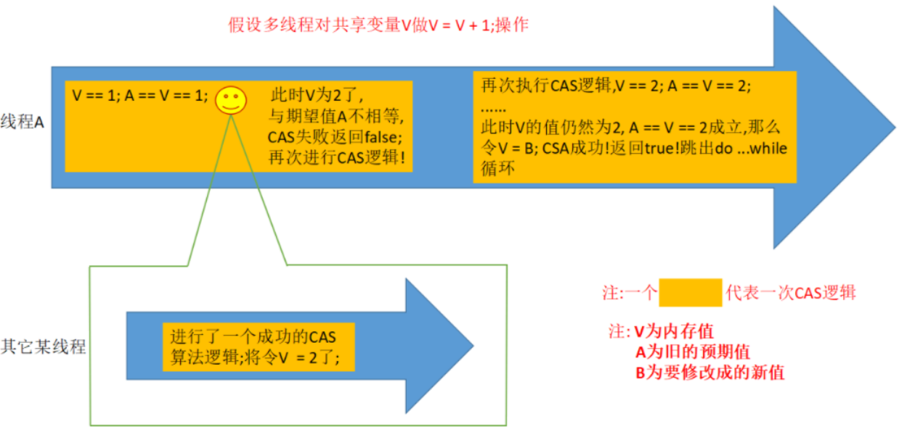
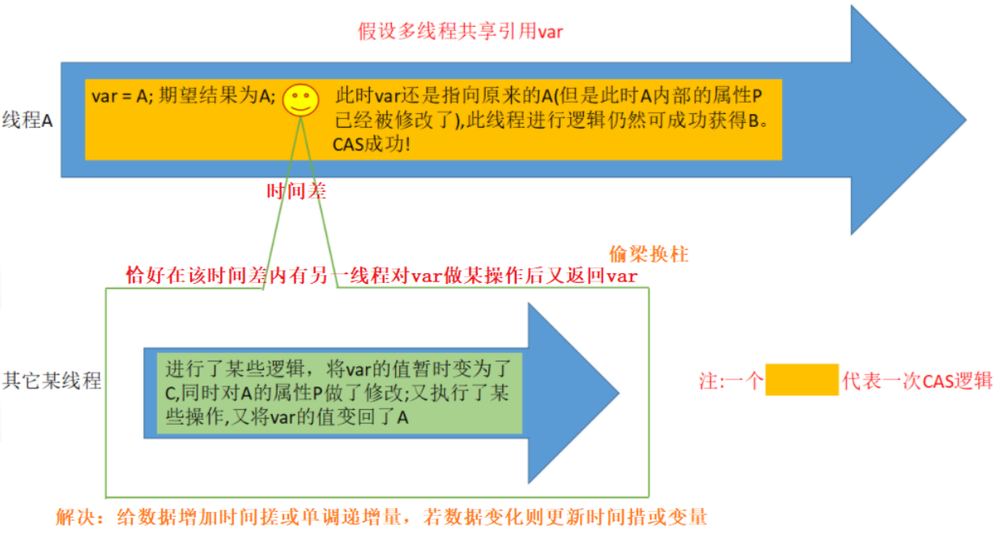
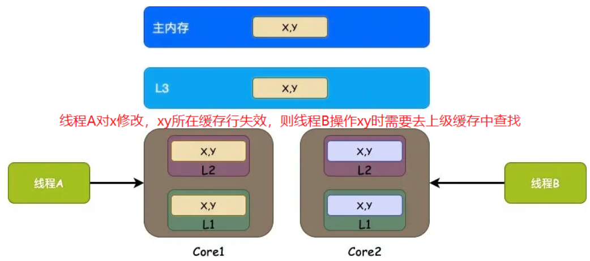
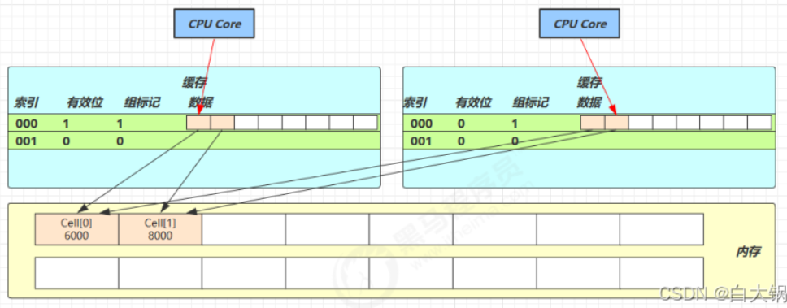
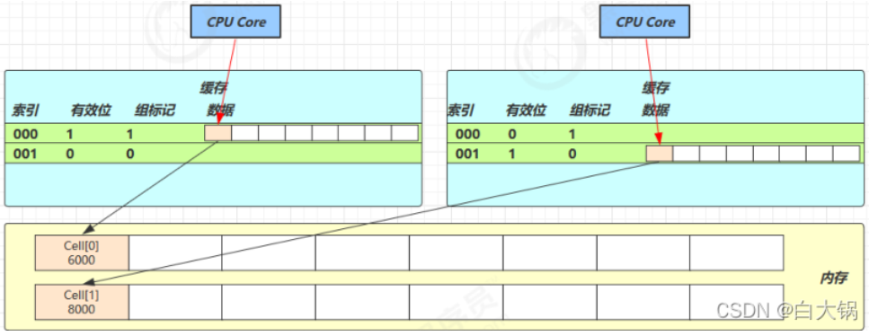

# 无锁编程

## 一、问题引入

为什么会出现CAS呢？当然是出现问题解决问题了

`synchronized`是阻塞式锁，存在大量问题，如阻塞式锁导致CPU唤醒操作加大开销；不存在锁中断机制；若拿到锁的线程一直不释放锁怎么解决？即没有锁超时机制；非公平锁造成大量的资源竞争，同时还有可能造成死锁等其他安全问题，所以后来出现了`volatile`

`volatile`可以保证可见性与有序性，但不保证原子性，有所提升，但还不够，技术更新换代啊！这就是你掉头发的原因啦🤫

为了更进一步提升性能，出现CAS无锁编程，CAS实际是一种乐观锁

## 二、CAS概述

### 1.什么是CAS？

CAS全称Compare And Swap，**基于乐观锁思想实现无锁编程**

> 乐观锁：就是勇敢牛牛不怕困难的思想，即其他线程要修改共享变量我不怕不怕啦，就算共享变量被改也没关系，自己多重试几次，直到成功为止，不懂就看接下来CAS的原理
>
> 悲观锁：就是自私思想，如果共享变量到了我手里其他线程就休想碰她，他现在是我的女人(bushi哈哈)，等我用完了再解开，你们才有机会，咦，这个例子怎么优点渣男的味道哈哈，不管了

CAS体现的是无锁并发，无阻塞并发，因为没有加入`synchronized`，所以线程不会陷入阻塞，但反过来想，若有大量的资源竞争，那么必然引起大量重试，反而会影响效率

接下来谈一谈CAS都是怎样保证并发编程三特性的

* **原子性**：CAS底层使用`lock cmpxchg`指令，单核多核下都能保证原子性，对于多核CPU，当执行到`lock`指令时，CPU会将总线锁住，待指令执行完之后再开启总线，这不就是总线加锁机制嘛，[有锁编程](/7.JUC并发编程/有锁编程)有讲到
* **可见性**：CAS结合`volatile`保证可见性，原因是`volatile`以主内存为媒介，避免线程从自己的工作缓存中查找变量的值
* **有序性**：那`volatile`都出场了还不能保证原子性嘛？当然可以保证原子性，`volatile`的内存屏障

>**为什么无锁效率高？**
>
>synchronized会使线程在没有获得锁的时候阻塞，发生上下文切换，而无锁时线程无法获得锁只会导致重试，但线程始终在高速运行
>
>举个例子，线程就好比赛车，比赛时他是超快的，一旦发生上下文切换，他要减速、熄火，被唤醒以后又需要重新打火、启动、加速...代价比较大，对于无锁，CPU就好比赛道，没有赛道高速更无从谈起，所以无锁下虽然不会进入阻塞态，但由于CPU时间片的关系还是会发生上下文切换，进入就绪态

### 2.CAS原理

CAS中一个三个操作数，即**内存所存值V，原值A，要改的值B，当且仅当V=A时，将V改为B并返回true，否则返回false，若V和A一直不相等，则一直循环该CAS操作(自旋do-while)**



### 3.CAS存在的问题

**ABA问题**，理解为偷梁换柱，**通过增加时间戳或版本号解决**，即**AtomicStampedReference**，分布式锁中基于DB的乐观锁便是增加version的原理



除了ABA问题还存在大量资源竞争，造成**大量自旋**的问题，且**CAS每次只能保证一个共享变量的原子性**

## 三、Unsafe

### 1.Unsafe是什么？

Unsafe提供类似C++的**手动内存管理能力及操作线程的方法**，全限定名是`sun.misc.Unsafe`，即由启动类加载器加载

Unsafe由`final`修饰，即`public final class Unsafe`，所以不能被继承

Unsafe只有一个私有的无参构造，所以不允许`new`出Unsafe实例，那Unsafe如何创建呢？请往下看

```java
private Unsafe() {
    }
```

### 2.Unsafe创建

首先来看一种错误的创建方式

```java
//为什么是错误的？请查看getUnsafe()源码
private static final Unsafe unsafe = Unsafe.getUnsafe();
-------------------------------------------------------
public static Unsafe getUnsafe() {
    Class var0 = Reflection.getCallerClass();
    //此处其实还看不出什么，但是此处有一个判断抛出异常的语句，让我们看看if内是如何判断的，进入isSystemDomainLoader()
    if (!VM.isSystemDomainLoader(var0.getClassLoader())) {
        throw new SecurityException("Unsafe");
    } else {
        return theUnsafe;
    }
}
-------------------------------------------------------
public static boolean isSystemDomainLoader(ClassLoader var0) {
	return var0 == null;//出现端倪
}
-------------------------------------------------------
分析可知isSystemDomainLoader()内会判断当前类加载器是否为空，为空表示是启动类加载器，返回true，若不为空则返回false，此处是Launcher$Application加载器，所以返回false
不是启动类加载器则返回false到getUnsafe()的if判断中，!false=true，将进入if语句内部，抛出SecurityException异常
```

综上通过直接`getUnsafe()`必须保证是根加载器BootStrap，否则抛出异常

既然无法`new`，提供的`getUnsafe()`也不能用，那就别怪我不讲武德，我要**反射**你了，这是正确的创建方式

```java
static long offset;//成员变量偏移量
private volatile int state = 0;//成员变量

static Unsafe unsafe;

static {
    try {
        Field field = Unsafe.class.getDeclaredField("theUnsafe");
        field.setAccessible(true);
        //获取此变量的值-->底层：theUnsafe = new Unsafe();(静态块中)
        unsafe = (Unsafe) field.get(null);
        
        //获取成员变量state的偏移量
        offset = unsafe.objectFieldOffset(Test.class.getDeclaredField("state"));
        
        Test test = new Test();
        
        //使用CAS方法替换成员变量的值
        //compareAndSwapInt(要操作的对象，要操作的属性的偏移量，原值，要更新的值)：原值与内存中的值相同就更新值
		Boolean success = unsafe.compareAndSwapInt(test, offset, 0, 5);
        System.out.println("修改是否成功：" + success);
    } catch (Exception e) {
        e.printStackTrace();
    }
}
```

### 3.Unsafe内的方法

贴出文章一篇：[https://www.jianshu.com/p/db8dce09232d](https://www.jianshu.com/p/db8dce09232d)

## 四、原子操作

### 1.原子整数

包含AtomicBoolean、AtomicInteger、AtomicLong，以AtomicInteger为例，其中包含的方法如下

```java
AtomicInteger i = new AtomicInteger(0);
// 获取并自增（i = 0, 结果 i = 1, 返回 0），类似于 i++
System.out.println(i.getAndIncrement());
// 自增并获取（i = 1, 结果 i = 2, 返回 2），类似于 ++i
System.out.println(i.incrementAndGet());
// 自减并获取（i = 2, 结果 i = 1, 返回 1），类似于 --i
System.out.println(i.decrementAndGet());
// 获取并自减（i = 1, 结果 i = 0, 返回 1），类似于 i--
System.out.println(i.getAndDecrement());
// 获取并加值（i = 0, 结果 i = 5, 返回 0）
System.out.println(i.getAndAdd(5));
// 加值并获取（i = 5, 结果 i = 0, 返回 0）
System.out.println(i.addAndGet(-5));
// 获取并更新（i = 0, p 为 i 的当前值, 结果 i = -2, 返回 0）
// 其中函数中的操作能保证原子，但函数需要无副作用
System.out.println(i.getAndUpdate(p -> p - 2));
// 更新并获取（i = -2, p 为 i 的当前值, 结果 i = 0, 返回 0）
// 其中函数中的操作能保证原子，但函数需要无副作用
System.out.println(i.updateAndGet(p -> p + 2));
// 获取并计算（i = 0, p 为 i 的当前值, x 为参数1, 结果 i = 10, 返回 0）
// 其中函数中的操作能保证原子，但函数需要无副作用
// getAndUpdate 如果在 lambda 中引用了外部的局部变量，要保证该局部变量是 final 的
// getAndAccumulate 可以通过 参数1 来引用外部的局部变量，但因为其不在 lambda 中因此不必是 final
System.out.println(i.getAndAccumulate(10, (p, x) -> p + x));
// 计算并获取（i = 10, p 为 i 的当前值, x 为参数1, 结果 i = 0, 返回 0）
// 其中函数中的操作能保证原子，但函数需要无副作用
System.out.println(i.accumulateAndGet(-10, (p, x) -> p + x));
```

走过路过不要错过，客官来瞧一瞧源码，以`incrementAndGet()`为例

```java
public final long incrementAndGet() {
	//unsafe是如何创建？？通过Unsafe.getUnsafe();因为此处使用的是根加载器加载

    //valueOffset在静态块中获取，源码如下
	//valueOffset = unsafe.objectFieldOffset(AtomicLong.class.getDeclaredField("value"));
	
	//getAndAddLong**
	return unsafe.getAndAddLong(this, valueOffset, 1L) + 1L;
}
--------------------------------------
public final long getAndAddLong(Object var1, long var2, long var4) {
	long var6;
	//自旋:内存中的值与var6一直不相等就一直循环,若未加自旋，该compareAndSwapLong返回false
	do {
		var6 = this.getLongVolatile(var1, var2);
	} while(!this.compareAndSwapLong(var1, var2, var6, var6 + var4));
	return var6;
}
```

### 2.原子引用

包含AtomicReference、AtomicMarkableReference、AtomicStampedReference，原子引用顾名思义就是将**整个对象的操作看成原子操作**，不同对象怎么办？**泛型**啊

#### 2.1.AtomicReference

假设有如下方法，试着提供安全的方法取款

```java
public interface DecimalAccount {
	// 获取余额
	BigDecimal getBalance();
	// 取款
	void withdraw(BigDecimal amount);
    
	// 方法内会启动1000个线程，每个线程做-10元的操作，如果初始余额为10000那么正确的结果应当是0
	static void demo(DecimalAccount account) {
		List<Thread> ts = new ArrayList<>();
		for (int i = 0; i < 1000; i++) {//创建1000个线程
			ts.add(new Thread(() -> {
				account.withdraw(BigDecimal.TEN);//-10操作，就是withdraw()需要步步升级，逐渐变得安全
			}));
		}
		ts.forEach(Thread::start);//启动1000个线程
		ts.forEach(t -> {
			try {
				t.join();
			} catch (InterruptedException e) {
				e.printStackTrace();
			}
		});
		System.out.println(account.getBalance());
	}
}
```

①不安全的实现方式

```java
class DecimalAccountUnsafe implements DecimalAccount {
	BigDecimal balance;
	public DecimalAccountUnsafe(BigDecimal balance) {
		this.balance = balance;
	}
	@Override
	public BigDecimal getBalance() {
		return balance;
	}
	@Override
	public void withdraw(BigDecimal amount) {
		BigDecimal balance = this.getBalance();
		this.balance = balance.subtract(amount);
	}
}
```

②使用`synchronized`的安全实现方式

```java
class DecimalAccountSafeLock implements DecimalAccount {
	private final Object lock = new Object();
	BigDecimal balance;
	public DecimalAccountSafeLock(BigDecimal balance) {
		this.balance = balance;
	}
	@Override
	public BigDecimal getBalance() {
		return balance;
	}
	@Override
	public void withdraw(BigDecimal amount) {
		synchronized (lock) {
			BigDecimal balance = this.getBalance();
			this.balance = balance.subtract(amount);
		}
	}
}
```

③使用CAS的安全实现方式

```java
class DecimalAccountSafeCas implements DecimalAccount {
    
	AtomicReference<BigDecimal> ref;//AtomicReference
    
	public DecimalAccountSafeCas(BigDecimal balance) {
		ref = new AtomicReference<>(balance);
	}
	@Override
	public BigDecimal getBalance() {
		return ref.get();
	}
	@Override
	public void withdraw(BigDecimal amount) {
		while (true) {//自旋
			BigDecimal prev = ref.get();//原值
			BigDecimal next = prev.subtract(amount);//新值
			if (ref.compareAndSet(prev, next)) {//CAS
				break;
			}
		}
	}
}
```

#### 2.2.AtomicStampedReference

AtomicStampedReference给原子引用加上版本号，**追踪原子引用整个变化过程**，如`A->B->A->C` ，通过AtomicStampedReference可以知道引用变量中途被更改了几次

ABA问题正是因为存在时间差，在时间差内对象的属性被修改但是CAS无法识别，增加版本号解决，以下是ABA问题测试代码

```java
//原来main只能感知到prev的值和内存中的是否相同，但不能感知A->B->A的情况
import java.util.concurrent.atomic.AtomicReference;
import static java.lang.Thread.sleep;

public class ABA1_AtomicReference {
    
    static AtomicReference<String> ref = new AtomicReference<>("A");

    public static void main(String[] args) throws InterruptedException {
        System.out.println("main start...");

        String prev = ref.get();//获取值prev=A

        other();//模拟中间有其它线程干扰，发生ABA
        sleep(2);

        //尝试改为C
        System.out.println("change A->C：" + ref.compareAndSet(prev, "C"));//true
    }

    private static void other() throws InterruptedException {
        new Thread(() -> {
            System.out.println("change A->B：" + ref.compareAndSet(ref.get(), "B"));//true
        }, "t1").start();
        sleep(1);
        new Thread(() -> {
            System.out.println("change B->A：" + ref.compareAndSet(ref.get(), "A"));//true
        }, "t2").start();
    }
}
```

使用AtomicStampedReference增加版本号解决

```JAVA
import java.util.concurrent.atomic.AtomicStampedReference;
import static java.lang.Thread.sleep;

public class ABA2_AtomicStampedReference {
    //(变量值，递增标量)
    static AtomicStampedReference<String> ref = new AtomicStampedReference<>("A", 0);

    public static void main(String[] args) throws InterruptedException {
        System.out.println("main start...");

        String prev = ref.getReference();//获取值prev=A
        int stamp = ref.getStamp();//获取版本号
        System.out.println("版本：" + stamp);

        other();//模拟中间有其它线程干扰，发生ABA
        sleep(2);

        //尝试改为C   (原值,新值,原版本,新版本)
        System.out.println("change A->C：" + ref.compareAndSet(prev, "C", stamp, stamp + 1));//false
    }

    private static void other() throws InterruptedException {
        new Thread(() -> {
            System.out.println("change A->B：" + ref.compareAndSet(ref.getReference(), "B", ref.getStamp(), ref.getStamp() + 1));//true
        }, "t1").start();
        sleep(1);
        new Thread(() -> {
            System.out.println("change B->A：" + ref.compareAndSet(ref.getReference(), "A", ref.getStamp(), ref.getStamp() + 1));//true
        }, "t2").start();
    }
}
```

#### 2.3.AtomicMarkableReference

AtomicStampedReference关系的是变量被改了几次，但有的时候只需要关心**有没有更改过**，所以出现AtomicMarkableReference

```java
import java.util.concurrent.atomic.AtomicMarkableReference;

public class UseAtomic4AtomicMarkableReference {
    public static void main(String[] args) throws InterruptedException {
        GarbageBag bag = new GarbageBag("装满了垃圾");

        //参数2可理解为标记，标记是否改过
        AtomicMarkableReference<GarbageBag> ref = new AtomicMarkableReference<>(bag, true);
        System.out.println("主线程 start...");

        //记录原来的值
        GarbageBag prev = ref.getReference();
        System.out.println(prev.toString());

        //新线程修改
        new Thread(() -> {
            System.out.println("打扫卫生的线程 start...");
            bag.setDesc("空垃圾袋");
            while (!ref.compareAndSet(bag, bag, true, false)) {
            }
            System.out.println(bag.toString());
        }).start();
        Thread.sleep(1000);

        System.out.println("主线程想换一只新垃圾袋？");
        boolean success = ref.compareAndSet(prev, new GarbageBag("空垃圾袋"), true, false);
        System.out.println("换了么？" + success);
        System.out.println(ref.getReference().toString());
    }
}

class GarbageBag {
    String desc;
    public GarbageBag(String desc) {
        this.desc = desc;
    }
    public void setDesc(String desc) {
        this.desc = desc;
    }
    @Override
    public String toString() {
        return desc;
    }
}
```

### 3.原子数组

包含AtomicIntegerArray、AtomicLongArray、AtomicReferenceArray

```java
public class UseAtomic5Array {
    static int[] value = new int[]{1, 2};
    static AtomicIntegerArray ai = new AtomicIntegerArray(value);

    public static void main(String[] args) {
        //(索引，新值)
        ai.getAndSet(0, 3);
        System.out.println(ai.get(0));

        //数组拷贝clone，原数组内容不变
        System.out.println(value[0]);
    }
}
```

### 4.字段更新器

包含AtomicReferenceFieldUpdater、AtomicIntegerFieldUpdater、AtomicLongFieldUpdater，必须配合`volatile`修饰的字段使用，否则出现报错

```java
Exception in thread "main" java.lang.IllegalArgumentException: Must be volatile type
```

```java
public class UseAtomic6AtomicIntegerFieldUpdater {
    private volatile int field;

    public static void main(String[] args) {
        AtomicIntegerFieldUpdater fieldUpdater = AtomicIntegerFieldUpdater.newUpdater(UseAtomic6AtomicIntegerFieldUpdater.class, "field");

        UseAtomic6AtomicIntegerFieldUpdater test5 = new UseAtomic6AtomicIntegerFieldUpdater();
        
        fieldUpdater.compareAndSet(test5, 0, 10);
        System.out.println(test5.field);// 修改成功 field = 10
        
        fieldUpdater.compareAndSet(test5, 10, 20);
        System.out.println(test5.field);// 修改成功 field = 20
        
        fieldUpdater.compareAndSet(test5, 10, 30);
        System.out.println(test5.field);// 修改失败 field = 20
    }
}
```

### 5.LongAdder

#### 5.1.问题引入

高并发下N多线程同时去操作一个变量会造成大量线程CAS失败，然后处于自旋状态，导致严重浪费CPU资源，降低并发性，既然AtomicLong性能问题是由于过多线程同时去竞争同一个变量的更新而降低的，那么如果**把一个变量分解为多个变量，让同样多的线程去竞争多个资源**就可以解决该性能问题

#### 5.2.原理&源码

原理就是上面提到的**高并发下将一个共享变量分解成多个变量，让多线程竞争多个资源**，源码中有几个关键

```java
// 累加单元数组, 懒惰初始化
transient volatile Cell[] cells;
// 基础值, 如果没有竞争, 则用CAS累加这个域
transient volatile long base;
// 在cells创建或扩容时置为1, 表示加锁
transient volatile int cellsBusy;
```

其中`Cell`为累加单元，源码如下

```java
// 防止缓存行伪共享
@sun.misc.Contended
static final class Cell {
	volatile long value;
	Cell(long x) { value = x; }
	// 最重要的方法, 用来CAS方式进行累加, prev表示旧值, next表示新值
	final boolean cas(long prev, long next) {
		return UNSAFE.compareAndSwapLong(this, valueOffset, prev, next);
	}
	// 省略不重要代码
}
```

`@sun.misc.Contended`为了防止伪共享，何为伪共享呢？先从缓存说起，比较缓存与内存的速度

| 从CPU到 |        大约需要的时钟周期        |
| :-----: | :------------------------------: |
| 寄存器  | 1 cycle (4GHz 的 CPU 约为0.25ns) |
|   L1    |            3~4 cycle             |
|   L2    |           10~20 cycle            |
|   L3    |           40~45 cycle            |
|  内存   |          120~240 cycle           |

表中可见CPU与内存的速度相差很大，需要考预读取数据到缓存来提升效率，而缓存系统以缓存行(CacheLine)为单位，**每块缓存行对应着一块内存区域**，大小一般是64Byte(8个long)，缓存行的加入可能产生数据副本，即内存中同一区域可能对应不同缓存行，CPU为保证数据一致，若某个缓存行内的某些数据被改，那么对应的整个缓存行失效，所以在多线程情况下，修改共享同一缓存行的变量会无意中影响彼此的性能

> 1位表示0或1，1字节=8位



**多个地址连续的变量才有可能被放到同一个缓存行中**，`Cell[]`恰好地址连续，一个`Cell`为24字节(16字节对象头+8字节`value`)，所以一个缓存行可存两个`Cell`，那么问题就来了，若`Core-0`要修改`Cell[0]`，`Core-1`要修改`Cell[1]`，无论谁修改成功都会导致缓存行失效，



```java
public void add(long x) {
	// as 为累加单元数组
	// b 为基础值
	// x 为累加值
	Cell[] as; long b, v; int m; Cell a;
	// 进入 if 的两个条件
	// 1. as 有值, 表示已经发生过竞争, 进入 if
	// 2. cas 给 base 累加时失败了, 表示 base 发生了竞争, 进入 if
	if ((as = cells) != null || !casBase(b = base, b + x)) {
		// uncontended 表示 cell 没有竞争
		boolean uncontended = true;
		if (
            // as 还没有创建
            as == null || (m = as.length - 1) < 0 ||
            // 当前线程对应的 cell 还没有
            (a = as[getProbe() & m]) == null ||
            // cas 给当前线程的 cell 累加失败 uncontended=false ( a 为当前线程的 cell )
            !(uncontended = a.cas(v = a.value, v + x))
        ) {
            // 进入 cell 数组创建、cell 创建的流程
            longAccumulate(x, null, uncontended);
        }
    }
}
```

#### 5.3.解决伪共享

伪共享是啥在原理&源码部分已经讲解

①**填充法**：为保证一个变量被存于同一缓存行，所以填充对象，以`Cell`对象为例，一个`Cell`为24字节，其中对象头占16字节，`value`占8字节，补充40字节即可，即补充5个`long`

```java
static final class Cell {
	volatile long value;
	
	public long p1, p2, p3, p4, p5;
	// 省略其他代码
}
```

②**@sun.misc.Contended**：原理是在添加该注解的对象或字段前后各增加128字节的`padding`，从而使对象被与缓存到缓存中不同的缓存行，防止伪共享，`-XX:ContendedPaddingWidth`可修改128字节的填充宽度，默认情况下此注解用于Java核心类，用户路径下的类需要使用该注解则配置`--XX:-RestrictContended`

```java
@sun.misc.Contended
static final class Cell {
	volatile long value;
	
	// 省略其他代码
}
```



#### 5.4.AtomicLong&LongAdder的区别

* AtomicLong以CAS+自旋的方式更新，具有原子性的读写结合API
* LongAdder在并发量低时使用CAS，成功则结束；但在并发量高时将`value`分成`Cell[]`，需要时可对`Cell[]`扩容，成功则结束，失败则CAS，取值时通过`sum()`对每个`cell`累加，其没有原子性原子性读写结合API，但保证最终一致
* .低并发场景AtomicLong和LongAdder性能相似，高并发场景LongAdder性能优于AtomicLong


> [参考文章](https://blog.csdn.net/weixin_45735355/article/details/121946452)


