# 有锁编程

## 一、共享带来的问题

两个线程对初始值为0的静态变量，一个做自增，一个做自减，结果是0吗？

```java
static int i = 0;
public static void main(String[] args) throws InterruptedException {
	Thread t1 = new Thread(() -> {
		i++;
	}, "t1");
    
	Thread t2 = new Thread(() -> {
		i--;
	}, "t2");
    
	t1.start();
	t2.start();
	t1.join();
	t2.join();
	System.out.println(i);
}
```

结果正数、负数、零都有，为什么呢？接下来从字节码开始步步深入🙃

对于`i++`而言，实际会产生如下的JVM字节码指令，`i--`也类似，可看到分成四步

```java
getstatic i	//获取静态变量i的值
iconst_1	//准备常量1
iadd		//自增，i--改成 isub
putstatic i //将修改后的值存入静态变量i
```

通过上一张图解可知，完成静态变量自增和自减需要在主内存与线程工作内存间进行数据交换


对于单线程，以上自增和自减的8条字节码指令顺序执行，不会存在什么问题，但对多线程来说这8条指令可能交错运行，即线程1可能运行到第三条指令就切换上下文给线程2，线程2若顺利的运行完则将结果-1写回主存，此时继续执行线程1的第三天指令则将结果1写回主存，最终主存中i的结果为1，当然这8条字节码指令间还存在各种交替方式，所以最终i的值可能为正数、负数或零

**其实程序运行多线程本身是不存在问题的，问题出现在多线程访问共享资源，或者说多线程访问共享资源也没问题，问题出现在多线程对共享变量读写操作时发生指令交错**，出现了问题当然就要解决，请接着往下看<span style="color:green">大标题[二]就是解决方案</span>

对共享资源多线程读写操作的代码块称为**临界区**，多线程在临界区内运行，由于字节码指令执行顺序不同而导致结果无法预测称为发生**竞态条件**

```java
static int i = 0;
static void increment()
//临界区
{	i++;	}
static void decrement()
//临界区
{	i--;	}
```

## 二、synchronized

### 1.什么是synchronized？

`synchronized`又称对象锁，它采用互斥的方式让同一时刻至多只有一个线程能持有对象锁，其他线程想要获取对象锁时会被阻塞

`synchronized`用于解决多线程操作同一资源时数据不一致问题，即**资源争抢问题**，保证持有锁的线程可以安全的执行临界区的代码，不用担心指令交替运行，解决并发编程三大特性之**原子性**


### 2.synchronized可重入证明

可重入表示自己可以第二次获得锁，若不可重入那么自己第二次获取锁时也将被锁住

```java
public class Re_synchronized {
    public synchronized void method1() {
        //main线程获取锁
        System.out.println("11111");
        method2();//若是非可重入，由于method1有锁，再去method2也需要锁，方法会阻塞在此
    }

    public synchronized void method2() {
        //main线程获取锁
        System.out.println("22222");
    }

    public static void main(String[] args) {
        Re_synchronized re = new Re_synchronized();
        re.method1();
    }
}
```

### 3.synchronized解决共享带来的问题

#### 3.1.synchronized代码块

语法格式如下

```java
synchronized(对象)//线程1，线程2(blocked)
{
	临界区
}
```

解决问题的代码如下

```java
static int i = 0;
static final Object room = new Object();

public static void main(String[] args) throws InterruptedException {
	Thread t1 = new Thread(() -> {
		synchronized (room) {
            i++;
        }
	}, "t1");
    
	Thread t2 = new Thread(() -> {
		synchronized (room) {
            i--;
        }
	}, "t2");
    
	t1.start();
	t2.start();
	t1.join();
	t2.join();
	System.out.println(i);
}
```

以上代码如何理解呢？请继续往下康

`synchronized(对象)`中的对象相当于一个房间`room`，该房间只有唯一的入口，每次只能有一人进入，线程t1、t2想象成两个人，当线程t1执行`synchronized(room)`，相当于t1到达房间就把房门锁上，并拿走了钥匙，在房间内执行`i++`，若此时t2执行`synchronized(room)`，但发现房门被锁住，就只能在门外等，发生阻塞，恰好此时线程t1的CPU时间片用完，即使用房间的时间用完，那么t1将被提出门外，注意**t1被提出门外时还是带着钥匙的，而且房间门也没开**，所以t2还是在门外等，等待CPU再次轮询到t1时，他带着钥匙光荣回归，t1再次占用房间，当t1执行完`synchronized{}`内的任务才会开门出来，唤醒并把锁交给t2，这是t2才可以进入房间，继续关门...

Java是面向对象的语言，所以面向对象改进

```java
class Room {
	int value = 0;
    
	public void increment() {
		synchronized (this) {
			value++;
        }
	}
    public void decrement() {
        synchronized (this) {
            value--;
        }
    }
    public int get() {
        synchronized (this) {
            return value;
        }
    }
}

public class Test1 {
	public static void main(String[] args) throws InterruptedException {
		Room room = new Room();
        
		Thread t1 = new Thread(() -> {
			room.increment();
		}, "t1");
        
		Thread t2 = new Thread(() -> {
			room.decrement();
		}, "t2");
        
		t1.start();
		t2.start();
		t1.join();
		t2.join();
		System.out.println(room.get());
	}
}
```

以上通俗的表达相信你已经理解了`synchronized(){}`的工作原理，**实际`synchronized`使用对象锁保证临界区代码的原子性，使临界区的操作不可分割**，继续请思考以下几个问题🤯，为了方便测试修改测试代码如下

①在`i++`和`i--`外加一层`for`循环，再把`synchronized(obj)`放在`for`循环的外面如何理解？**原子性**

②如果`t1 synchronized(obj1)`而`t2 synchronized(obj2)`会怎样运作？**锁对象**

```java
//若t1先执行，进入obj1房间，关门取锁
//t1中途被踢出房间，t2开始执行，但t2进入的是obj2房间，同样关门取锁
//若t2顺利运行完，则会再次切回t1，即结果临界区内代码无法保证原子性
public class Test02 {
    static final Object room1 = new Object();
    static final Object room2 = new Object();

    public static void main(String[] args) throws InterruptedException {
        Thread t1 = new Thread(() -> {
            synchronized (room1) {
                System.out.println(Thread.currentThread().getName() + "开始运行");
                try {
                    Thread.sleep(2000);
                } catch (InterruptedException e) {
                    e.printStackTrace();
                }
                System.out.println(Thread.currentThread().getName() + "运行结束");

            }
        }, "t1");

        Thread t2 = new Thread(() -> {
            synchronized (room2) {
                System.out.println(Thread.currentThread().getName() + "开始运行");
                try {
                    Thread.sleep(2000);
                } catch (InterruptedException e) {
                    e.printStackTrace();
                }
                System.out.println(Thread.currentThread().getName() + "运行结束");
            }
        }, "t2");

        t1.start();
        t2.start();
        t1.join();
        t2.join();
    }
}
--------------------------------------------------
t1开始运行
t2开始运行
t2运行结束
t1运行结束
```

③如果`t1 synchronized(obj)`而`t2`没有加会怎么样？如何理解？**锁对象**

```java
//若t1先执行，进入obj1房间，关门取锁
//t1中途被踢出房间，t2开始执行，但t2不存在房间的概念，所以它运行它的
//若它中途CPU时间片用完，那么t1会带锁回归到obj1，假设此时t1完毕，接着切回t2直到结束，所以还是无法保证原子性
public class Test03 {
    static final Object room1 = new Object();
    static final Object room2 = new Object();

    public static void main(String[] args) throws InterruptedException {
        Thread t1 = new Thread(() -> {//加锁
            synchronized (room1) {
                System.out.println(Thread.currentThread().getName() + "开始运行");
                try {
                    Thread.sleep(2000);
                } catch (InterruptedException e) {
                    e.printStackTrace();
                }
                System.out.println(Thread.currentThread().getName() + "运行结束");

            }
        }, "t1");

        Thread t2 = new Thread(() -> {//不加锁
            System.out.println(Thread.currentThread().getName() + "开始运行");
            try {
                Thread.sleep(2000);
            } catch (InterruptedException e) {
                e.printStackTrace();
            }
            System.out.println(Thread.currentThread().getName() + "运行结束");
        }, "t2");

        t1.start();
        t2.start();
        t1.join();
        t2.join();
    }
}
--------------------------------------------------
t1开始运行
t2开始运行
t2运行结束
t1运行结束
```

#### 3.2.synchronized方法

语法格式如下

```java
class Test{
	public synchronized void test() {
        ...
	}
}
等价于
class Test{
	public void test() {
		synchronized(this) {
			...
		}
	}
}
```

```java
class Test{
	public synchronized static void test() {
        ...
	}
}
等价于
class Test{
	public static void test() {
		synchronized(Test.class) {
			...
		}
	}
}
```

解决问题的代码如下，直接面向对象

```java
class Room {
	int value = 0;
    
	public synchronized void increment() {
		value++;
	}
    public synchronized void decrement() {
        value--;
    }
    public synchronized int get() {
        return value;
    }
}

public class Test1 {
	public static void main(String[] args) throws InterruptedException {
		Room room = new Room();
        
		Thread t1 = new Thread(() -> {
			room.increment();
		}, "t1");
        
		Thread t2 = new Thread(() -> {
			room.decrement();
		}, "t2");
        
		t1.start();
		t2.start();
		t1.join();
		t2.join();
		System.out.println(room.get());
	}
}
```

为了更好的理解**对象锁**，请看以下几个方法，并分析输出情况

```java
//写在方法上的synchronized实际锁的也是对象，看以上的拆解代码就可以知道
//所以就相当于t1和t2同时争抢房间n1的使用权，若t1进入房间n1就将房门锁上，并且持有锁，保证原子性
public class Test01 {
    public static void main(String[] args) {
        Number1 n1 = new Number1();
        new Thread(() -> { n1.a(); }, "t1").start();
        new Thread(() -> { n1.b(); }, "t2").start();
    }
}

class Number1 {
    public synchronized void a() {
        System.out.println(Thread.currentThread().getName() + "开始运行");
        try {
            Thread.sleep(2000);
        } catch (InterruptedException e) {
            e.printStackTrace();
        }
        System.out.println(Thread.currentThread().getName() + "运行结束");
    }

    public synchronized void b() {
        System.out.println(Thread.currentThread().getName() + "开始运行");
        try {
            Thread.sleep(2000);
        } catch (InterruptedException e) {
            e.printStackTrace();
        }
        System.out.println(Thread.currentThread().getName() + "运行结束");
    }
}
--------------------------------------------------
t1开始运行
t1运行结束
t2开始运行
t2运行结束
```

```java
//这其实就相当于一个加锁一个没加锁的情况，若t1先执行，进入n1房间，关门取锁
//t1中途被踢出房间，t2开始执行，但t2不存在房间的概念，所以它运行它的
//若它中途CPU时间片用完，那么t1会带锁回归到n1，假设此时t1完毕，接着切回t2直到结束，所以还是无法保证原子性
public class Test02 {
    public static void main(String[] args) {
        Number2 n1 = new Number2();
        new Thread(() -> { n1.a(); }, "t1").start();
        new Thread(() -> { n1.b(); }, "t2").start();
    }
}

class Number2 {
    public synchronized void a() {
        System.out.println(Thread.currentThread().getName() + "开始运行");
        try {
            Thread.sleep(2000);
        } catch (InterruptedException e) {
            e.printStackTrace();
        }
        System.out.println(Thread.currentThread().getName() + "运行结束");
    }

    public void b() {
        System.out.println(Thread.currentThread().getName() + "开始运行");
        try {
            Thread.sleep(2000);
        } catch (InterruptedException e) {
            e.printStackTrace();
        }
        System.out.println(Thread.currentThread().getName() + "运行结束");
    }
}
--------------------------------------------------
t1开始运行
t2开始运行
t1运行结束
t2运行结束
```

```java
//这个不讲了，也无法保证原子性，不同对象不同房子不同锁
public class Test03 {
    public static void main(String[] args) {
        Number3 n1 = new Number3();
        Number3 n2 = new Number3();
        new Thread(() -> { n1.a(); }, "t1").start();
        new Thread(() -> { n2.b(); }, "t2").start();
    }
}

class Number3 {
    public synchronized void a() {
        System.out.println(Thread.currentThread().getName() + "开始运行");
        try {
            Thread.sleep(2000);
        } catch (InterruptedException e) {
            e.printStackTrace();
        }
        System.out.println(Thread.currentThread().getName() + "运行结束");
    }

    public synchronized void b() {
        System.out.println(Thread.currentThread().getName() + "开始运行");
        try {
            Thread.sleep(2000);
        } catch (InterruptedException e) {
            e.printStackTrace();
        }
        System.out.println(Thread.currentThread().getName() + "运行结束");
    }
}
--------------------------------------------------
t1开始运行
t2开始运行
t1运行结束
t2运行结束
```

为了更好的理解**对象锁与类锁**，请看以下几个方法，并分析输出情况

```java
//t1通过n1调用a()，static锁的是类本身，而t2通过n1调用b()，锁的是n1对象，所以两者锁的不同，不保证原子性
public class Test04 {
    public static void main(String[] args) {
        Number4 n1 = new Number4();
        new Thread(() -> { n1.a(); }, "t1").start();
        new Thread(() -> { n1.b(); }, "t2").start();
    }
}

class Number4 {
    public static synchronized void a() {
        System.out.println(Thread.currentThread().getName() + "开始运行");
        try {
            Thread.sleep(2000);
        } catch (InterruptedException e) {
            e.printStackTrace();
        }
        System.out.println(Thread.currentThread().getName() + "运行结束");
    }

    public synchronized void b() {
        System.out.println(Thread.currentThread().getName() + "开始运行");
        try {
            Thread.sleep(2000);
        } catch (InterruptedException e) {
            e.printStackTrace();
        }
        System.out.println(Thread.currentThread().getName() + "运行结束");
    }
}
--------------------------------------------------
t1开始运行
t2开始运行
t2运行结束
t1运行结束
```

```java
//t1通过n1调用a()，static锁的是类本身，而t2通过n2调用b()，锁的是n2对象，所以两者锁的不同，不保证原子性
public class Test05 {
    public static void main(String[] args) {
        Number5 n1 = new Number5();
        Number5 n2 = new Number5();
        new Thread(() -> { n1.a(); }, "t1").start();
        new Thread(() -> { n2.b(); }, "t2").start();
    }
}

class Number5 {
    public static synchronized void a() {
        System.out.println(Thread.currentThread().getName() + "开始运行");
        try {
            Thread.sleep(2000);
        } catch (InterruptedException e) {
            e.printStackTrace();
        }
        System.out.println(Thread.currentThread().getName() + "运行结束");
    }

    public synchronized void b() {
        System.out.println(Thread.currentThread().getName() + "开始运行");
        try {
            Thread.sleep(2000);
        } catch (InterruptedException e) {
            e.printStackTrace();
        }
        System.out.println(Thread.currentThread().getName() + "运行结束");
    }
}
--------------------------------------------------
t1开始运行
t2开始运行
t2运行结束
t1运行结束
```

```java
//t1通过n1调用a()，static锁的是Number6类本身，而t2通过n1调用b()，static锁的是Number6类本身，所以两者锁的相同，保证原子性
public class Test06 {
    public static void main(String[] args) {
        Number6 n1 = new Number6();
        new Thread(() -> { n1.a(); }, "t1").start();
        new Thread(() -> { n1.b(); }, "t2").start();
    }
}

class Number6 {
    public static synchronized void a() {
        System.out.println(Thread.currentThread().getName() + "开始运行");
        try {
            Thread.sleep(2000);
        } catch (InterruptedException e) {
            e.printStackTrace();
        }
        System.out.println(Thread.currentThread().getName() + "运行结束");
    }

    public static synchronized void b() {
        System.out.println(Thread.currentThread().getName() + "开始运行");
        try {
            Thread.sleep(2000);
        } catch (InterruptedException e) {
            e.printStackTrace();
        }
        System.out.println(Thread.currentThread().getName() + "运行结束");
    }
}
--------------------------------------------------
t1开始运行
t1运行结束
t2开始运行
t2运行结束
```

```java
//t1通过n1调用a()，static锁的是Number7类本身，而t2通过n2调用b()，static锁的是Number7类本身，所以两者锁的相同，保证原子性
public class Test07 {
    public static void main(String[] args) {
        Number6 n1 = new Number6();
        Number6 n2 = new Number6();
        new Thread(() -> { n1.a(); }, "t1").start();
        new Thread(() -> { n2.b(); }, "t2").start();
    }
}

class Number7 {
    public static synchronized void a() {
        System.out.println(Thread.currentThread().getName() + "开始运行");
        try {
            Thread.sleep(2000);
        } catch (InterruptedException e) {
            e.printStackTrace();
        }
        System.out.println(Thread.currentThread().getName() + "运行结束");
    }

    public static synchronized void b() {
        System.out.println(Thread.currentThread().getName() + "开始运行");
        try {
            Thread.sleep(2000);
        } catch (InterruptedException e) {
            e.printStackTrace();
        }
        System.out.println(Thread.currentThread().getName() + "运行结束");
    }
}
--------------------------------------------------
t1开始运行
t1运行结束
t2开始运行
t2运行结束
```

**方法抛出异常后会释放锁**

```java
public class Test01 {
    public static void main(String[] args) {
        Number1 n1 = new Number1();
        new Thread(() -> { n1.a(); }, "t1").start();
        new Thread(() -> { n1.b(); }, "t2").start();
    }
}

class Number1 {
    public synchronized void a() {
        System.out.println(Thread.currentThread().getName() + "开始运行");
        try {
            Thread.sleep(2000);
        } catch (InterruptedException e) {
            e.printStackTrace();
        }

        throw new RuntimeException();
        //System.out.println(Thread.currentThread().getName() + "运行结束");
    }

    public synchronized void b() {
        System.out.println(Thread.currentThread().getName() + "开始运行");
        try {
            Thread.sleep(2000);
        } catch (InterruptedException e) {
            e.printStackTrace();
        }
        System.out.println(Thread.currentThread().getName() + "运行结束");
    }
}
--------------------------------------------------
t1开始运行
Exception in thread "t1" java.lang.RuntimeException
	at com.yc.Test00_synchronized.exception.Number1.a(Test01.java:31)
	at com.yc.Test00_synchronized.exception.Test01.lambda$main$0(Test01.java:14)
	at java.lang.Thread.run(Thread.java:745)
t2开始运行
t2运行结束
```

## 三、变量的线程安全性分析

### 1.成员变量和静态成员变量是否安全？

若没被共享则线程安全，若被共享则根据它们的状态是否能够改变，又分两种情况，如果只有读操作则线程安全，如果有读写操作则这段代码是临界区，需要考虑线程安全

### 2.局部变量是否安全？

局部变量本身是安全的，但局部变量的引用对象未必，若对象的作用域在方法内部则是安全的，若对象的作用域还在方法外部，需要考虑线程安全，下面具体分析局部变量的安全性

若是基本类型的局部变量，代码如下，则该局部变量只会被保存在每个线程的虚拟机栈中的栈帧中的局部变量表中，如下图

```java
public static void test1() {
	int i = 10;
	i++;
}
```

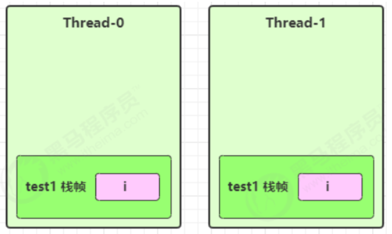

若是引用类型的变量，先看一个成员变量的例子，代码如下，由于list是成员变量，而线程中使用的是堆中同一个list，如图，所以两个线程轮询，且线程运行的进度不同，所以可能导致`method3`报错

```java
class ThreadUnsafe {
	ArrayList<String> list = new ArrayList<>();
	public void method1(int loopNumber) {
		for (int i = 0; i < loopNumber; i++) {
			// { 临界区, 会产生竞态条件
			method2();
			method3();
			// } 临界区
		}
	}
	private void method2() {
		list.add("1");
	}
	private void method3() {
		list.remove(0);
	}
}
```

```java
static final int THREAD_NUMBER = 2;
static final int LOOP_NUMBER = 200;
public static void main(String[] args) {
	ThreadUnsafe test = new ThreadUnsafe();
	for (int i = 0; i < THREAD_NUMBER; i++) {//创建两个线程
		new Thread(() -> {
			test.method1(LOOP_NUMBER);
		}, "Thread" + i).start();
	}
}
```

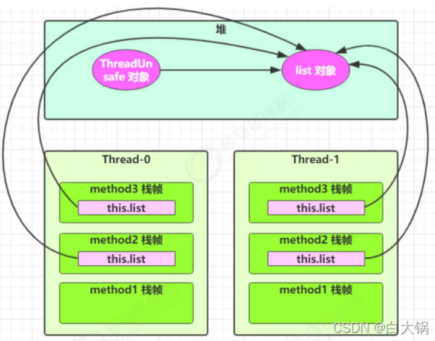

若是引用类型的局部变量，代码如下，则list在线程内部被创建，每个线程都对应一个list，如图，所以不会出现报错问题

```java
class ThreadSafe {
	public final void method1(int loopNumber) {
		ArrayList<String> list = new ArrayList<>();
		for (int i = 0; i < loopNumber; i++) {
			method2(list);
			method3(list);
		}
	}
	private void method2(ArrayList<String> list) {
		list.add("1");
	}
	private void method3(ArrayList<String> list) {
		list.remove(0);
	}
}
```

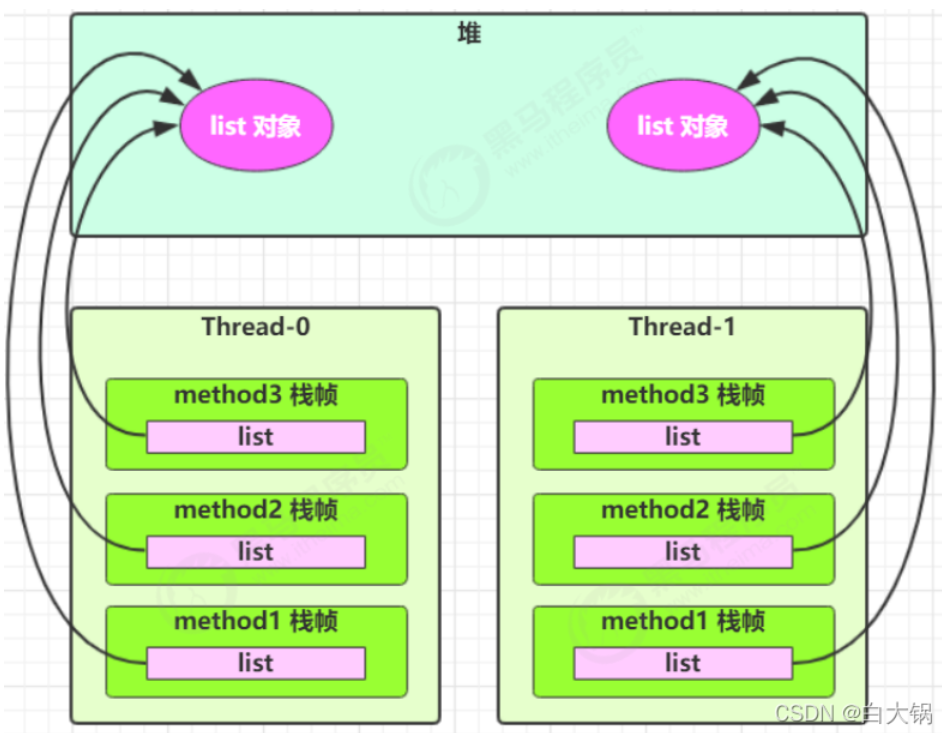

试问`method2`和`method3`的修饰符变为`public`还会是安全的吗？以下两种情况会导致不安全，从此处可以看出`private`或`final`提供安全的意义所在，请体会开闭原则中的闭

* 其它线程调用`method2`或`method3`
* 在前一种情况的基础上，为ThreadSafe类添加子类，子类覆盖`method2`或`method3`

### 3.常见线程安全类

Integer、String、StringBuffer、Random、Vector、Hashtable、java.util.concurrent包下的类，具体实现请自己看源码

## 四、Monitor

### 1.Monitor是什么？

Monitor可以翻译成监视器或者管程，由JVM提供的Java对象监视器

### 2.ObjectMonitor结构体

Monitor是基于C++代码中的ObjectMonitor结构体实现的，ObjectMonitor结构体如下

```
ObjectMonitor() {
    _header       = NULL;
    _count        = 0; // 由于synchronized是可重入锁，count用于记录当前对象锁拥有者线程获取锁的次数
    _waiters      = 0,
    _recursions   = 0;
    _object       = NULL;
    _owner        = NULL;
    _WaitSet      = NULL; // 调用了wait方法，处于WAIT/TIME_WAIT的线程，会被加入到WaitSet
    _WaitSetLock  = 0 ;
    _Responsible  = NULL ;
    _succ         = NULL ;
    _cxq          = NULL ;
    FreeNext      = NULL ;
    _EntryList    = NULL ; // 处于等待锁block状态的线程，会被加入到EntryList
    _SpinFreq     = 0 ;
    _SpinClock    = 0 ;
    OwnerIsThread = 0 ;
}
```

### 3.Monitor原理

JVM中Monitor主要基于ObjectMonitor结构体中的**EntrySet、WaitSet两个队列以及计数器count**实现的

当线程执行到临界区时，首先查看对象头中是否已有关联的Monitor对象，如果已关联则将当前线程添加到Monitor对象的EntryList队列，如果没关联则关联一个Monitor对象，关联后则表示Monitor对象的拥有者变成当前线程，即当前线程获取到某个对象锁，变成锁的拥有者，准备开始运行临界区的代码，执行字节码指令`monitorenter`，此时`count++`，当该线程尝试再次获取锁是执行`count++`，而不是进入EntryList队列阻塞等待，此处体现可重入，当临界区的代码应完成或异常退出时使`count--`，当count变为0则当前线程释放锁，Monitor对象重新到EntryList队列选一个新的拥有者持有锁，一般使非公平竞争，当拥有锁的线程调用`wait()`则线程进入WaitSet，等待`notify()`唤醒或等待时间到达才能变成锁的拥有者，所以`wait()`是释放锁的

一个对象关联一个Monitor对象，当一个对象持有Monitor对象地址后就处理锁定状态，**JVM给每个对象和class字节码都会设置一个监听器Monitor**，用于检测并发代码的重入，**不加synchronized的对象不会关联Monitor**

## 五、wait和notify

在[线程基础](/7.JUC并发编程/线程基础)其实已经了解过`wait()`和`notify()`和`notifyAll()`，此处就只提一句`wait()`会释放锁，且`wait()`必须在`synchronized`内部使用，即必须配合`Monitor`使用，接下来模拟场景步步升级

①使用`synchronized+sleep`的场景导致不释放锁，其他线程也进不来，就一直阻塞，效率太低，请看②

```java
import java.util.concurrent.atomic.AtomicBoolean;
import static java.lang.Thread.sleep;

/**
 * 假设某线程需要工作中需要喝水才能继续工作，以下模拟场景
 */
public class Test01 {
    public static void main(String[] args) throws InterruptedException {
        Object room = new Object();//对象锁
        AtomicBoolean has = new AtomicBoolean(false);//这只是一个原子操作类，先不管

        new Thread(() -> {//这是一个工作线程
            synchronized (room) {
                System.out.println("--" + Thread.currentThread().getName() + "开始工作");
                System.out.println("有水吗？" + has);
                if (!has.get()) {
                    System.out.println("没水？那不干了，找个人来给我送水");
                    System.out.println("--" + Thread.currentThread().getName() + "开始休息");
                    try {
                        sleep(2);
                    } catch (InterruptedException e) {
                        e.printStackTrace();
                    }
                }
                System.out.println("有水吗？" + has);
                if (has.get()) {
                    System.out.println("终于喝到水了，准备开始干活");
                    System.out.println("--" + Thread.currentThread().getName() + "继续运行");
                }
                System.out.println("--" + Thread.currentThread().getName() + "工作结束");
            }
        }, "工作线程").start();

        for (int i = 0; i < 5; i++) {//大哥不能一直干活，总有结束的时候，但是房间里同时只能有一个人干活
            new Thread(() -> {
                System.out.println("--" + Thread.currentThread().getName() + "等待房间使用权");
                synchronized (room) {
                    System.out.println("--" + Thread.currentThread().getName() + "开始工作");
                    System.out.println("--" + Thread.currentThread().getName() + "工作结束");
                }
            }, "t" + (i + 2)).start();
        }

        sleep(1);//主线程睡一会再让小弟送水

        new Thread(() -> {//这是给大哥送水的线程，注意不能去抢大哥的房间啊，大哥在里面拿着钥匙还锁着门呢，抢大哥的那肯定抢不到啊，此处可以加另一把对象锁或直接不加锁
            has.set(true);
            System.out.println("小弟给送水来了");
        }).start();
    }
}
--------------------------------------------------
--工作线程开始工作
有水吗？false
没水？那不干了，找个人来给我送水
--工作线程开始休息
--t2等待房间使用权
--t3等待房间使用权
--t4等待房间使用权
--t5等待房间使用权
--t6等待房间使用权
小弟给送水来了
有水吗？true
终于喝到水了，准备开始干活
--工作线程继续运行
--工作线程工作结束
--t6开始工作
--t6工作结束
--t5开始工作
--t5工作结束
--t4开始工作
--t4工作结束
--t3开始工作
--t3工作结束
--t2开始工作
--t2工作结束
```

②使用`synchronized+wait+notify`的场景会释放锁，解决阻塞问题，但是`notify()`只会唤醒一个`wait()`，另一个因为一直没被唤醒，所以一直在等待，请看③

```java
import java.util.concurrent.atomic.AtomicBoolean;
import static java.lang.Thread.sleep;

/**
 * 模拟t1线程需要喝水才能继续工作，t2线程需要吃点水果才能继续工作，假设他们都点同一份外卖呢？
 */
public class Test02 {
    public static void main(String[] args) throws InterruptedException {
        Object room = new Object();//对象锁
        AtomicBoolean has = new AtomicBoolean(false);//这只是一个原子操作类，先不管

        new Thread(() -> {//t1需要喝水
            synchronized (room) {
                System.out.println("--" + Thread.currentThread().getName() + "开始工作");
                System.out.println("有水吗？" + has);
                if (!has.get()) {
                    System.out.println("没水？那不干了，找个人来给我送水");
                    System.out.println("--" + Thread.currentThread().getName() + "开始休息");
                    try {
                        room.wait();
                    } catch (InterruptedException e) {
                        e.printStackTrace();
                    }
                }
                System.out.println("有水吗？" + has);
                if (has.get()) {
                    System.out.println("终于喝到水了，准备开始干活");
                    System.out.println("--" + Thread.currentThread().getName() + "继续运行");
                    System.out.println("--" + Thread.currentThread().getName() + "完成工作后，工作结束");
                } else {
                    System.out.println("等了这么久还不给水，不干了");
                    System.out.println("--" + Thread.currentThread().getName() + "未完成工作，工作结束");
                }
            }
        }, "t1").start();

        new Thread(() -> {//t2需要吃水果
            synchronized (room) {
                System.out.println("--" + Thread.currentThread().getName() + "开始工作");
                System.out.println("有水果吗？" + has);
                if (!has.get()) {
                    System.out.println("没水果？那不干了");
                    System.out.println("--" + Thread.currentThread().getName() + "开始休息");
                    try {
                        room.wait();
                    } catch (InterruptedException e) {
                        e.printStackTrace();
                    }
                }
                System.out.println("有水果吗？" + has);
                if (has.get()) {
                    System.out.println("终于吃到水果了，准备开始干活");
                    System.out.println("--" + Thread.currentThread().getName() + "继续运行");
                }
                System.out.println("--" + Thread.currentThread().getName() + "工作结束");
            }
        }, "t2").start();

        sleep(1);//主线程睡一会再让小弟送水

        new Thread(() -> {
            synchronized (room) {
                has.set(true);
                System.out.println("送外卖的来了，出来拿");
                room.notify();
            }
        }).start();
    }
}
--------------------------------------------------
--t1开始工作
有水吗？false
没水？那不干了，找个人来给我送水
--t1开始休息
--t2开始工作
有水果吗？false
没水果？那不干了
--t2开始休息
送外卖的来了，出来拿
有水吗？true
终于喝到水了，准备开始干活
--t1继续运行
--t1完成工作后，工作结束
//此处程序并没有结束
```

③使用`synchronized+wait+notifyAll`的场景会释放锁，解决阻塞问题，同时唤醒所有因为`wait()`在等待的线程，但是采用`if`的方式就只有一次机会可以判断阻塞条件，唤醒之后会跳出`if`继续向下运行，那如果被唤醒后条件还是不成立呢？所以需要改进成`while`循环

```java
import java.util.concurrent.atomic.AtomicBoolean;
import static java.lang.Thread.sleep;

/**
 * 模拟t1线程需要喝水才能继续工作，t2线程需要吃点水果才能继续工作，假设他们都点同一份外卖呢？
 */
public class Test03 {
    public static void main(String[] args) throws InterruptedException {
        Object room = new Object();//对象锁
        AtomicBoolean has = new AtomicBoolean(false);//这只是一个原子操作类，先不管

        new Thread(() -> {//t1需要喝水
            synchronized (room) {
                System.out.println("--" + Thread.currentThread().getName() + "开始工作");
                System.out.println("有水吗？" + has);
                while (!has.get()) {
                    System.out.println("没水？那不干了，找个人来给我送水");
                    System.out.println("--" + Thread.currentThread().getName() + "开始休息");
                    try {
                        room.wait();
                    } catch (InterruptedException e) {
                        e.printStackTrace();
                    }
                }
                System.out.println("有水吗？" + has);
                if (has.get()) {
                    System.out.println("终于喝到水了，准备开始干活");
                    System.out.println("--" + Thread.currentThread().getName() + "继续运行");
                    System.out.println("--" + Thread.currentThread().getName() + "完成工作后，工作结束");
                } else {
                    System.out.println("等了这么久还不给水，不干了");
                    System.out.println("--" + Thread.currentThread().getName() + "未完成工作，工作结束");
                }
            }
        }, "t1").start();

        new Thread(() -> {//t2需要吃水果
            synchronized (room) {
                System.out.println("--" + Thread.currentThread().getName() + "开始工作");
                System.out.println("有水果吗？" + has);
                while (!has.get()) {
                    System.out.println("没水果？那不干了");
                    System.out.println("--" + Thread.currentThread().getName() + "开始休息");
                    try {
                        room.wait();
                    } catch (InterruptedException e) {
                        e.printStackTrace();
                    }
                }
                System.out.println("有水果吗？" + has);
                if (has.get()) {
                    System.out.println("终于吃到水果了，准备开始干活");
                    System.out.println("--" + Thread.currentThread().getName() + "继续运行");
                }
                System.out.println("--" + Thread.currentThread().getName() + "工作结束");
            }
        }, "t2").start();

        sleep(1);//主线程睡一会再让小弟送水

        new Thread(() -> {
            synchronized (room) {
                has.set(true);
                System.out.println("送外卖的来了，出来拿");
                room.notifyAll();
            }
        }).start();
    }
}
--------------------------------------------------
--t1开始工作
有水吗？false
没水？那不干了，找个人来给我送水
--t1开始休息
--t2开始工作
有水果吗？false
没水果？那不干了
--t2开始休息
送外卖的来了，出来拿
有水果吗？true
终于吃到水果了，准备开始干活
--t2继续运行
--t2工作结束
有水吗？true
终于喝到水了，准备开始干活
--t1继续运行
--t1完成工作后，工作结束
```

④小结`synchronized+wait+notifyAll`的使用架构

```java
synchronized(lock) {
	while(条件不成立) {//循环是为了使被唤醒后看条件时候成立，若开始不成立则继续等待
		lock.wait();
	}
	//此处条件成立，且被唤醒，则开始干活
}
//另一个线程
synchronized(lock) {
	lock.notifyAll();//唤醒所有等待的线程
}
```

## 六、LockSupport

### 1.LockSupport是什么？

LockSupport内部存在两个重要方法，即`LockSupport.park()`和`LockSupport.unpark(线程对象)`，其中`LockSupport.park()`会检查线程的许可证，若线程没有许可证将会阻塞线程，直到`unpark()`处获取许可证，默认线程是不持有许可证的；`LockSupport.unpark(线程对象)`会给线程对象关联许可证，使线程从`park()`阻塞位置解除阻塞

### 2.park&unpark和wait&notify相比

`wait()`、`notify()`、`notifyAll()`必须配合Monitor使用，即配合`synchronized`使用，而`park()`、`unpark()`不必

`park()`、`unpark()`的解锁顺序灵活，可以先`unpark()`，但`wait()`、`notify()`就不能先`notify()`

`park()`、`unpark()`以线程为单位精确阻塞和唤醒，但`notify()`只能随机唤醒一个等待线程

### 3.使用

①先`park()`再`unpark()`

```java
Thread thread = new Thread(() -> {
    System.out.println("子线程开始park");
    //没有许可证，挂起自己
    LockSupport.park();
    System.out.println("子线程结束");
});

thread.start();

Thread.sleep(1000);
System.out.println("主线程开始unpark");
//让子线程有许可证，park方法返回
LockSupport.unpark(thread);
```

②先`unpark()`再`park()`

```java
System.out.println("开始pack");
//使用当前线程获取许可证
LockSupport.unpark(Thread.currentThread());
//再次调用park，unpark后调用park会立即返回
LockSupport.park();
System.out.println("结束pack");
```

## 七、锁的活跃性

### 1.死锁

**一个线程需要同时获取多把锁，这时就容易发生死锁**，例如如下情况

```java
import static java.lang.Thread.sleep;

public class DeadLock {
    public static void main(String[] args) {
        Object A = new Object();
        Object B = new Object();

        Thread t1 = new Thread(() -> {
            synchronized (A) {//获取A对象锁
                System.out.println("lock A");
                try {
                    sleep(2);
                } catch (InterruptedException e) {
                    e.printStackTrace();
                }
                synchronized (B) {//获取B对象锁
                    System.out.println("lock B");
                    System.out.println("t1获得两把锁后的操作");
                }
            }
        }, "t1");
        Thread t2 = new Thread(() -> {
            synchronized (B) {//获取B对象锁
                System.out.println("lock B");
                try {
                    sleep(1);
                } catch (InterruptedException e) {
                    e.printStackTrace();
                }
                synchronized (A) {//获取A对象锁
                    System.out.println("lock A");
                    System.out.println("t2获得两把锁后的操作");
                }
            }
        }, "t2");
        t1.start();
        t2.start();
    }
}
```

IDEA可查看线程相互等待的情况

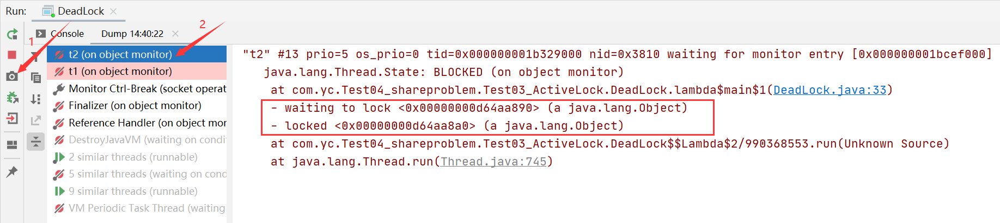

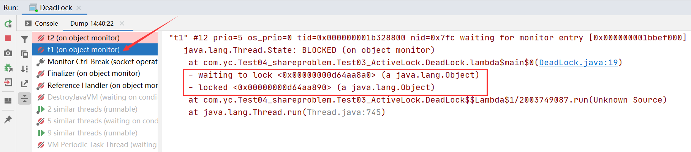

### 2.活锁

**两个线程互相改变对方的结束条件，最后谁也无法结束**，这是发生活锁，例如如下情况

```java
import static java.lang.Thread.sleep;

public class LiveLock {

    static volatile int count = 10;
    static final Object lock = new Object();

    public static void main(String[] args) {
        new Thread(() -> {
            // 期望减到 0 退出循环
            while (count > 0) {
                try {
                    sleep(2);
                } catch (InterruptedException e) {
                    e.printStackTrace();
                }
                count--;
                System.out.println(count);
            }
        }, "t1").start();
        new Thread(() -> {
            // 期望超过 20 退出循环
            while (count < 20) {
                try {
                    sleep(2);
                } catch (InterruptedException e) {
                    e.printStackTrace();
                }
                count++;
                System.out.println(count);
            }
        }, "t2").start();
    }
}
```

### 3.饥饿

很多教程中把饥饿定义为**一个线程由于优先级太低始终得不到CPU调度执行，也不能够结束**，饥饿的情况不易演示，讲读写锁时会涉及饥饿问题

## 八、Lock

### 1.ReentrantLock

#### 1.1.基本语法格式

```java
//1.获取锁
reentrantLock.lock();
try {
	//临界区
} finally {
	//2.释放锁，一定不要忽略这个步骤
	reentrantLock.unlock();
}
```

#### 1.2.可重入

可重入表示自己可以第二次获得锁，若不可重入那么自己第二次获取锁时也将被锁住，`synchronized`也可重入

```java
import java.util.concurrent.locks.Lock;
import java.util.concurrent.locks.ReentrantLock;

public class Re_reentrantLock {
    //Lock接口       ReentrantLock可重入锁
    Lock lock = new ReentrantLock();

    public void set() {
        try {
            lock.lock();
            System.out.println("set");
            get();//同一个线程在set中获取锁又调用get重新获取同一把锁
        } catch (Exception e) {
            e.printStackTrace();
        } finally {
            lock.unlock();//必须释放锁
        }
    }

    public void get() {
        try {
            lock.lock();//第二次获得锁
            System.out.println("get");
        } catch (Exception e) {
            e.printStackTrace();
        } finally {
            lock.unlock();
        }
    }

    public static void main(String[] args) {
        Re_reentrantLock re = new Re_reentrantLock();
        re.set();
    }
}
```

#### 1.3.可打断

可通过`lockInterruptibly()`在等待加锁的过程中被中断，`lock()`方式加锁就不能被打断了，同时可通过`isLocked()`获取锁的状态，`synchronized`不可中断且无法获取锁状态

```java
import java.util.concurrent.locks.ReentrantLock;
import static java.lang.Thread.sleep;

public class Interrupted {
    public static void main(String[] args) throws InterruptedException {
        ReentrantLock lock = new ReentrantLock();

        Thread t1 = new Thread(() -> {
            System.out.println(Thread.currentThread().getName() + "启动");
            try {
                lock.lockInterruptibly();
                System.out.println(Thread.currentThread().getName() + "获取可被打断的锁");
            } catch (InterruptedException e) {
                e.printStackTrace();
                System.out.println(Thread.currentThread().getName() + "等锁的过程中被打断");
                return;
            }

            try {
                System.out.println(Thread.currentThread().getName() + "等待锁过程中未被中断，成功获取锁");
            } finally {
                lock.unlock();
                System.out.println(Thread.currentThread().getName() + "释放锁");
            }
        }, "t1");

        lock.lock();//先把锁加给主线程，那么t1线程就必须要等到主线程释放锁才能加锁，在等待过程中可以打断t1线程，查看报错
        System.out.println(Thread.currentThread().getName() + "获得锁");
        t1.start();
        try {
            sleep(1);//等待t1线程到达等待锁的状态
            t1.interrupt();//打断
            System.out.println("执行打断");
        } finally {
            lock.unlock();
        }
    }
}
--------------------------------------------------
main获得锁
t1启动
执行打断
t1等锁的过程中被打断
java.lang.InterruptedException
	at java.util.concurrent.locks.AbstractQueuedSynchronizer.doAcquireInterruptibly(AbstractQueuedSynchronizer.java:898)
	at java.util.concurrent.locks.AbstractQueuedSynchronizer.acquireInterruptibly(AbstractQueuedSynchronizer.java:1222)
	at java.util.concurrent.locks.ReentrantLock.lockInterruptibly(ReentrantLock.java:335)
	at com.yc.Test04_shareproblem.Test04_Lock.Interrupted.lambda$main$0(Interrupted.java:20)
	at java.lang.Thread.run(Thread.java:745)  
```

#### 1.4.锁超时

可通过`tryLock()`和`tryLock(long time, TimeUnit unit)`尝试获取锁，返回布尔结果，`synchronized`不能设置超时时间

①`boolean tryLock()`判断锁可不可以，然后立即返回结果，模拟**立即失败**

```java
import java.util.concurrent.locks.ReentrantLock;
import static java.lang.Thread.sleep;

public class tryLock {
    public static void main(String[] args) throws InterruptedException {
        ReentrantLock lock = new ReentrantLock();

        Thread t1 = new Thread(() -> {
            System.out.println(Thread.currentThread().getName() + "启动");
            if (!lock.tryLock()) {
                System.out.println(Thread.currentThread().getName() + "获取锁失败，立刻返回");
                return;
            }
            try {
                System.out.println(Thread.currentThread().getName() + "成功获取锁");
            } finally {
                lock.unlock();
            }
        }, "t1");

        lock.lock();
        System.out.println(Thread.currentThread().getName() + "获得锁");
        t1.start();
        try {
            sleep(2);
        } finally {
            lock.unlock();
        }

    }
}
--------------------------------------------------
main获得锁
t1启动
t1获取锁失败，立刻返回
```

②`boolean tryLock(long time, TimeUnit unit)`判断锁可不可以，然后在规定时间内返回结果，模拟**超时失败**

```java
import java.util.concurrent.TimeUnit;
import java.util.concurrent.locks.ReentrantLock;

public class tryLockTime {
    public static void main(String[] args) throws InterruptedException {
        ReentrantLock lock = new ReentrantLock();

        Thread t1 = new Thread(() -> {
            System.out.println(Thread.currentThread().getName() + "启动");
            try {
                if (!lock.tryLock(2, TimeUnit.SECONDS)) {
                    System.out.println(Thread.currentThread().getName() + "获取锁失败，超时返回");
                    return;
                }
            } catch (InterruptedException e) {
                e.printStackTrace();
            }
            try {
                System.out.println(Thread.currentThread().getName() + "成功获取锁");
            } finally {
                lock.unlock();
            }
        }, "t1");

        lock.lock();
        System.out.println(Thread.currentThread().getName() + "获得锁");
        t1.start();
        try {
            TimeUnit.SECONDS.sleep(3);
        } finally {
            lock.unlock();
        }

    }
}
--------------------------------------------------
main获得锁
t1启动
t1获取锁失败，超时返回
```

#### 1.5.公平锁

ReentrantLock默认是不公平锁，可通过`new ReentrantLock(true)`设置公平锁，`synchronized`只能是非公平锁，就不证明了

#### 1.6.条件变量

`synchronized`中也有条件变量，就是`waitSet`，当条件不满足时进入`waitSet`，ReentrantLock条件变量的强大之处在于它支持多个条件，这就好比`synchronized`只有一间休息室，而ReentrantLock有好几间

ReentrantLock可通过`newCondition()`设置条件，`newCondition()`返回Condition类，Condition类中含以下几个方法

* `await()`：相当`Object.wait()`，执行前需要获取锁`lock()`，执行后会释放锁，进入`conditionObject`等待，**若被唤醒、打断、超时需要重新获取锁，重新获取锁后继续从`await()`后执行**
* `singal()`：相当`Object.notify()`，随机唤醒`conditionObject`中等待的
* `singalAll()`：相当`Object.notifyAll()`

①**同步模型之顺序控制**：使abc三个方法按`a-b-c`的顺序调用，利用`wait+notifyAll`

```java
public class NoConditionDemo1 {
    private int signal;

    public synchronized void a() {
        while (signal != 0) {
            try {
                wait();
            } catch (InterruptedException e) {
                e.printStackTrace();
            }
        }
        System.out.println("a" + signal);
        signal++;
        notifyAll();
    }

    public synchronized void b() {
        while (signal != 1) {
            try {
                wait();
            } catch (InterruptedException e) {
                e.printStackTrace();
            }
        }
        System.out.println("b" + signal);
        signal++;
        notifyAll();
    }

    public synchronized void c() {
        while (signal != 2) {
            try {
                wait();
            } catch (InterruptedException e) {
                e.printStackTrace();
            }
        }
        System.out.println("c" + signal);
        signal = 0;
        notifyAll();
    }

    public static void main(String[] args) {
        //整个程序 一直以   a0,b1,c2输出 .
        NoConditionDemo1 d = new NoConditionDemo1();
        A a = new A(d);
        B b = new B(d);
        C c = new C(d);
        new Thread(a).start();
        new Thread(a).start();
        new Thread(a).start();
        new Thread(a).start();

        new Thread(c).start();
        new Thread(c).start();
        new Thread(c).start();
        new Thread(c).start();

        new Thread(b).start();
        new Thread(b).start();
        new Thread(b).start();
        new Thread(b).start();
    }
}

// A B C三个类，用来表示多个线程调用DemoNoCondition的几个方法来打印abc
class A implements Runnable {
    private NoConditionDemo1 demoCondition;

    public A(NoConditionDemo1 demo) {
        this.demoCondition = demo;
    }

    @Override
    public void run() {
        while (true) {
            demoCondition.a();
            try {
                Thread.sleep(1000);
            } catch (InterruptedException e) {
                e.printStackTrace();
            }
        }
    }
}

class B implements Runnable {
    private NoConditionDemo1 demoCondition;

    public B(NoConditionDemo1 demoCondition) {
        this.demoCondition = demoCondition;
    }

    @Override
    public void run() {
        while (true) {
            demoCondition.b();
            try {
                Thread.sleep(1000);
            } catch (InterruptedException e) {
                e.printStackTrace();
            }
        }
    }
}

class C implements Runnable {
    private NoConditionDemo1 demoCondition;

    public C(NoConditionDemo1 demoCondition) {
        this.demoCondition = demoCondition;
    }

    @Override
    public void run() {
        while (true) {
            demoCondition.c();
            try {
                Thread.sleep(1000);
            } catch (InterruptedException e) {
                e.printStackTrace();
            }
        }
    }
}
```

②**同步模型之顺序控制**：使abc三个方法按`a-b-c`的顺序调用，利用`await+signal`

```java
import java.util.concurrent.locks.Condition;
import java.util.concurrent.locks.Lock;
import java.util.concurrent.locks.ReentrantLock;

public class ConditionDemo2 {
    private int signal;

    private final Lock lock = new ReentrantLock();

    private final Condition a = lock.newCondition();
    private final Condition b = lock.newCondition();
    private final Condition c = lock.newCondition();

    public void a() {
        lock.lock();
        try {
            while (signal != 0) {
                try {
                    a.await();
                } catch (InterruptedException e) {
                    e.printStackTrace();
                }
            }
            System.out.println("a" + signal);
            signal++;
            b.signal();
        } finally {
            lock.unlock();
        }
    }

    public void b() {
        lock.lock();
        try {
            while (signal != 1) {
                try {
                    b.await();
                } catch (InterruptedException e) {
                    e.printStackTrace();
                }
            }
            System.out.println("b" + signal);
            signal++;
            c.signal();
        } catch (Exception e) {
            e.printStackTrace();
        } finally {
            lock.unlock();
        }
    }

    public void c() {
        lock.lock();
        try {
            while (signal != 2) {
                try {
                    c.await();
                } catch (InterruptedException e) {
                    e.printStackTrace();
                }
            }
            System.out.println("c" + signal);
            signal = 0;
            a.signal();
        } catch (Exception e) {
            e.printStackTrace();
        } finally {
            lock.unlock();
        }
    }

    public static void main(String[] args) {
        //整个程序 一直以   a0,b1,c2输出 .
        ConditionDemo2 d = new ConditionDemo2();
        A1 a = new A1(d);
        B1 b = new B1(d);
        C1 c = new C1(d);
        new Thread(a).start();
        new Thread(a).start();
        new Thread(a).start();
        new Thread(a).start();

        new Thread(c).start();
        new Thread(c).start();
        new Thread(c).start();
        new Thread(c).start();

        new Thread(b).start();
        new Thread(b).start();
        new Thread(b).start();
        new Thread(b).start();
    }
}

class A1 implements Runnable {
    private ConditionDemo2 demoCondition;

    public A1(ConditionDemo2 demo) {
        this.demoCondition = demo;
    }

    @Override
    public void run() {
        while (true) {
            demoCondition.a();
            try {
                Thread.sleep(1000);
            } catch (InterruptedException e) {
                e.printStackTrace();
            }
        }
    }
}

class B1 implements Runnable {
    private ConditionDemo2 demoCondition;

    public B1(ConditionDemo2 demoCondition) {
        this.demoCondition = demoCondition;
    }

    @Override
    public void run() {
        while (true) {
            demoCondition.b();
            try {
                Thread.sleep(1000);
            } catch (InterruptedException e) {
                e.printStackTrace();
            }
        }
    }
}

class C1 implements Runnable {
    private ConditionDemo2 demoCondition;

    public C1(ConditionDemo2 demoCondition) {
        this.demoCondition = demoCondition;
    }

    @Override
    public void run() {
        while (true) {
            demoCondition.c();
            try {
                Thread.sleep(1000);
            } catch (InterruptedException e) {
                e.printStackTrace();
            }
        }
    }
}
```

**③异步模型之生产者消费者**：利用`await+signal`模拟生产者和消费者

```java
class AppleBox {
    int index = 0;
    Apple[] apples = new Apple[5];

	//创建锁，替换synchronized
	private final Lock lock = new ReentrantLock();
	//一个锁可以有多个等待队列
	private final Condition produceCondition = lock.newCondition();
	private final Condition consumeCondition = lock.newCondition();

    //生产
    public void deposite(Apple apple) throws InterruptedException {
        lock.lock();

        try {
            //存满，如果产品一直没被消费，则产品就一直往produceCondition存
            while (index == apples.length) {//不要if，醒来之后需要判断index，防止index越界，多次容错
                produceCondition.await();
            }
            consumeCondition.signal();//唤醒消费者从await醒来再次判断是不是空，不空就要继续向下消费index--
            apples[index] = apple;
            index++;
        } catch (Exception e) {
            e.printStackTrace();
        } finally {
            lock.unlock();
        }
    }

    //消费
    public Apple withdraw() {
        lock.lock();

        try {
            //空的，如果容器一直没产品，则消费者一直往consumeCondition等待
            while (index == 0) {//不要if，醒来之后需要判断index，防止index越界，多次容错
                consumeCondition.await();
            }
            produceCondition.signal();//唤醒生产者从await醒来再次判断是不是满，不满就要继续生产index++
            index--;
            return apples[index];
        } catch (Exception e) {
            e.printStackTrace();
        } finally {
            lock.unlock();
        }
        return null;
    }
}
```

#### 1.7.Lock与synchronized比较

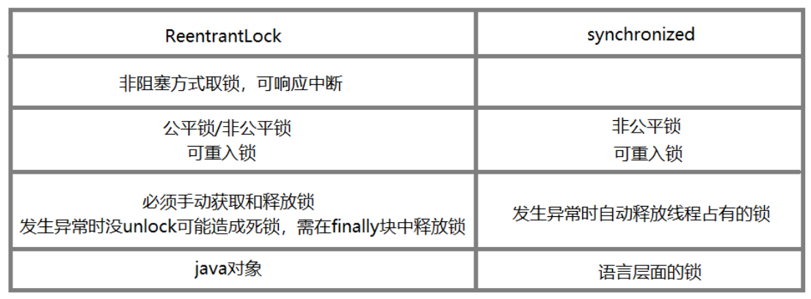

### 2.ReentrantReadWriteLock

ReentrantReadWriteLock称为读写锁，使读操作和写操作各有一把锁，**读锁与写锁不能同时拥有，读锁在读操作间共享，写锁在读写操作间都独占(排他锁)，适用于读多写少的情况**

看以下的使用案例

```java
/**
- 需求：两个读线程，两个写线程，4个线程同时启动(CyclicBarrier)，测试这4个线程的读写顺序
- 1.当有读锁时，不能加写锁，且读锁在读操作共享
- 2.当有写锁时，不能加读锁，且写锁排他，其他读操作也不能进行
 */
public class ReentrantReadWriteLockTest {
	//读写锁
	private static ReentrantReadWriteLock reentrantReadWriteLock = new ReentrantReadWriteLock();
    //线程池
	private static ThreadPoolExecutor executor = new ThreadPoolExecutor(10, 10, 60L, TimeUnit.SECONDS, new LinkedBlockingQueue<Runnable>());
    //栏杆
	private static CyclicBarrier cyclicBarrier = new CyclicBarrier(4);
	private static int i = 100;

    //读操作
	public static void read(Thread thread) {
		//在此处等待，等待同时运行信号
        try {
            cyclicBarrier.await();
        } catch (Exception e) {
            e.printStackTrace();
        }

  		//读锁：抢到读锁，则两个读锁线程可以同时向下运行-->读锁共享
  		reentrantReadWriteLock.readLock().lock();
  
  		//读线程 pool-1-thread-3 开始执行  i=100
  		//读线程 pool-1-thread-2 开始执行  i=100
  		//读线程 pool-1-thread-2 结束
  		//读线程 pool-1-thread-3 结束
  
        try {
            System.out.println("读线程 " + thread.getName() + " 开始执行  i=" + i);
            Thread.sleep(1000);
            System.out.println("读线程 " + thread.getName() + " 结束");
        } catch (Exception e) {
            e.printStackTrace();
        } finally {
            reentrantReadWriteLock.readLock().unlock();
        }
  	}

    //写操作
    public static void write(Thread thread) {
        //在此处等待，等待同时运行信号
        try {
            cyclicBarrier.await();
        } catch (Exception e) {
            e.printStackTrace();
        }

        //写锁：只能有一个在写，且不能读
        reentrantReadWriteLock.writeLock().lock();
  
        //写线程 pool-1-thread-1 开始执行  i=101
        //写线程 pool-1-thread-1 结束
        //写线程 pool-1-thread-2 开始执行  i=102
        //写线程 pool-1-thread-2 结束
  
        try {
            i++;
            System.out.println("写线程 " + thread.getName() + " 开始执行  i=" + i);
            System.out.println("写线程 " + thread.getName() + " 结束");
        } catch (Exception e) {
            e.printStackTrace();
        } finally {
            reentrantReadWriteLock.writeLock().unlock();
        }
	}

    public static void main(String[] args) {
        //提交任务到线程池
        executor.execute(() -> {
            write(Thread.currentThread());
        });
        executor.execute(() -> {
            write(Thread.currentThread());
        });
        executor.execute(() -> {
            read(Thread.currentThread());
        });
        executor.execute(() -> {
            read(Thread.currentThread());
        });
        executor.shutdown();
    }
}
```

## 九、AQS

AQS内含[无锁编程](/7.JUC并发编程/无锁编程)CAS的相关知识

### 1.AQS是什么？

队列同步器AbstractQueuedSynchronizer，**用来构建锁，是其他同步组件的基础框架**，通过内置的FIFO队列来完成资源获取线程的排队工作

AQS是实现锁的关键，简单理解两者的关系就是：**锁是面向使用者的，AQS面向的是锁的实现者**，简化锁的实现方式，屏蔽同步状态管理，线程排队，等待唤醒底层操作的细节，对外放出**模板方法供子类实现**

### 2.AQS类图

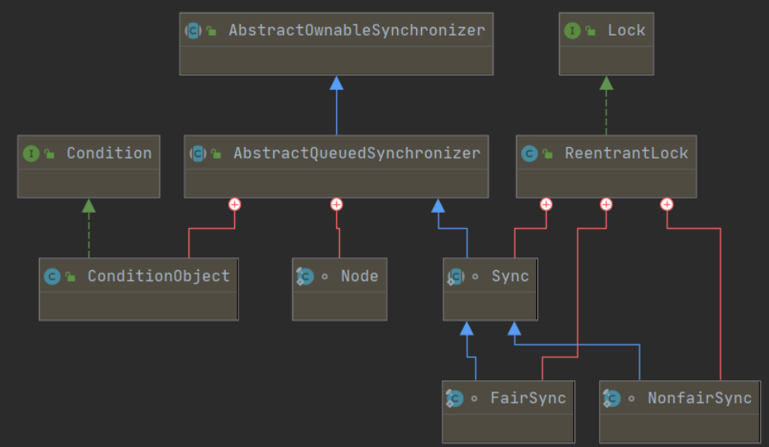

**AbstractQueuenSynchronize**：**AQS框架核心类**，**内部以虚拟队列的方式管理线程的锁获取与锁释放**，其中`tryAcquire()`和`tryRelease()`并没有提供默认的实现，需要子类重写方法的具体逻辑，目的是使开发人可以自定义获取锁和释放锁的方式

**Node**：AbstractQueuenSynchronize的内部类，**用于构建虚拟队列，即用于构建双向链表**，将每个进入同步队列的线程封装成Node对象加入队列，管理需要获取锁的线程

**Sync**：ReentrantLock的内部类，继承AbstractQueuenSynchronize，实现`tryRelease()`并提供抽象方法`lock`供子类实现

**NonfairSync**：Reentrantlock的内部类，继承Sync，**非公平锁的实现类**

**FairSync**：Reentrantlock的内部类，继承Sync，**公平锁的实现类**

**Reentrantlock**：实现了Lock接口，创建时默认为非公平锁

### 3.AQS底层结构

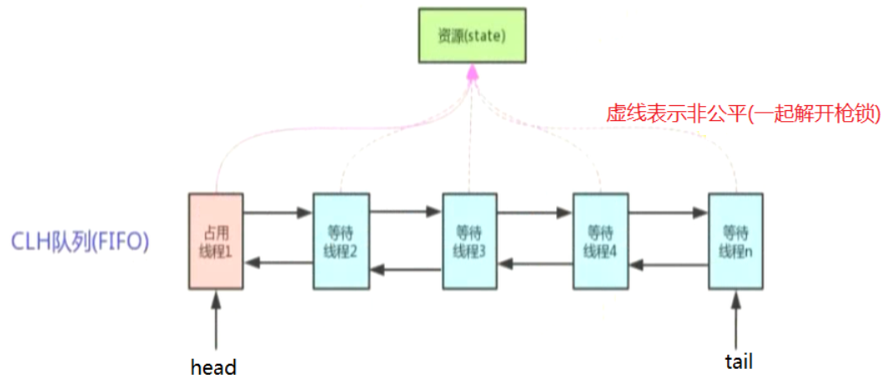

#### 3.1.state

AQS内部用`volatile`修饰的`int`类型的成员变量`state`来**控制同步状态**

* `state=0`：表示没有线程正在独占共享资源的锁
* `state=1`：表示有线程正在共享资源的锁

`state`既可以表示占没占，还可以表示占多少

* 对于独占锁使用0表示没占，1表示占
* 对于读写锁将32位拆成16位分别标识读锁和写锁
* `state`的字面值就表示占多少

AQS内部与`state`相关的方法有`getState()`、`setState()`、`compareAndSetState()`，其中`compareAndSetState()`是使用CAS来设置状态，保证原子性，CAS请移步[无锁编程](/7.JUC并发编程/无锁编程)

#### 3.2.CLH队列

CLH是虚拟双端队列，虚拟指的是不存在队列实例，只存在Node之间的关系，**AQS内部会将请求共享资源的线程包装成CLH队列中的节点Node**，Node源码如下

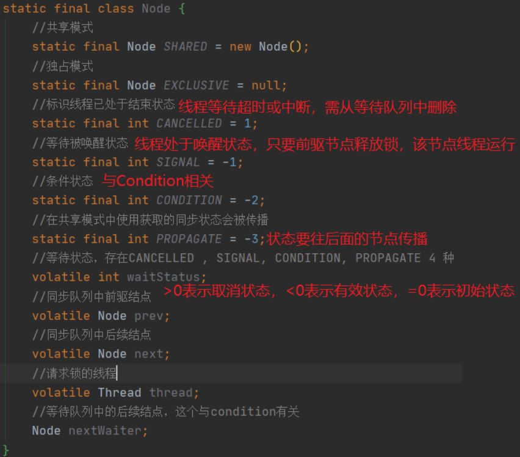

CLH分为同步队列以及等待条件队列，其增删节点的工作流程如下

* 同步队列增删节点的工作流程

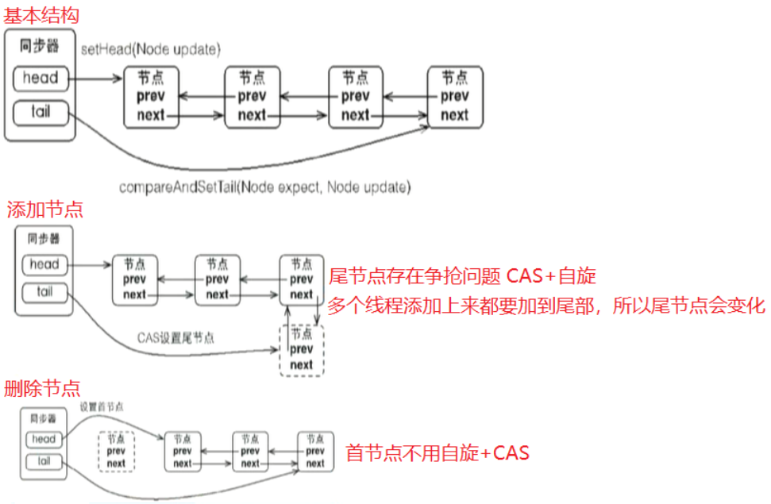

* 等待条件队列增删节点的工作流程

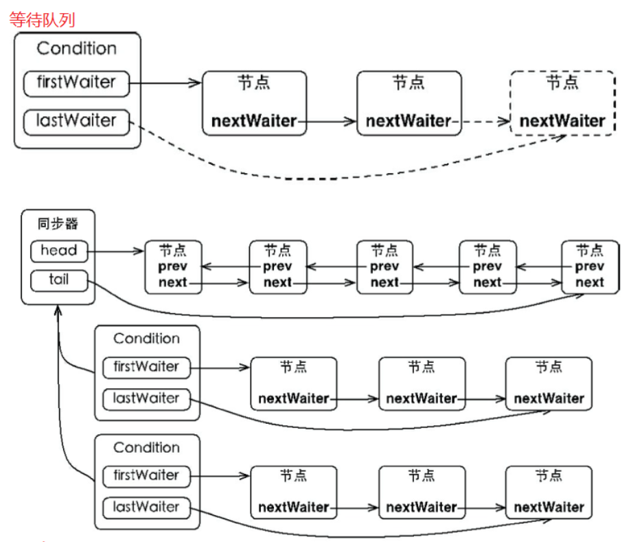

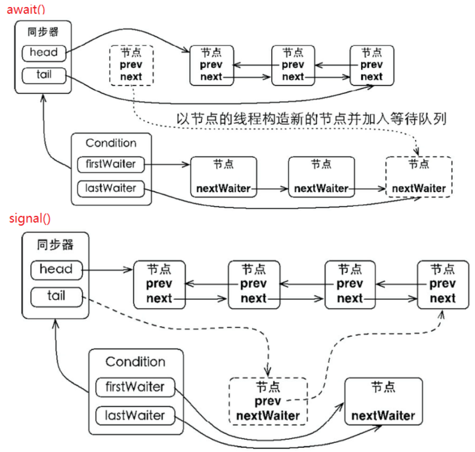

#### 3.3.模板模式

模板模式指的是**工作流程固定，但具体实现不固定的情况下，将固定的流程封装，并提供具体实现给用户实现**，如JdbcTemplate的JDBC中获取数据库连接等流程是固定不变的，只是sql语句不同，只需用户编写sql以及返回部分返回结果包装成什么对象不确定、HttpServlet的生命周期函数

AQS有如下模板方法

|        |          获取          |           支持中断的获取            |               尝试获取，带超时时间                |      释放       |
| :----: | :--------------------: | :---------------------------------: | :-----------------------------------------------: | :-------------: |
| 独占式 |    acquire(int arg)    |    acquireInterruptibly(int arg)    |    tryAcquireNanos(int arg, long nanosTimeout)    |    release()    |
| 共享式 | acquireShared(int arg) | acquireSharedInterruptibly(int arg) | tryAcquireSharedNanos(int arg, long nanosTimeout) | releaseShared() |

AQS中需要被子类覆盖，从而需要用户自己编写实现逻辑的流程方法如下

|        |                           尝试获取                           |                          尝试释放                           |
| :----: | :----------------------------------------------------------: | :---------------------------------------------------------: |
| 独占式 |              tryAcquire(int)，获取成功返回true               |              tryRelease(int)，释放成功返回true              |
| 共享式 | tryAcquireShared(int)，负数表示获取失败，0表示获取成功且无剩余资源，正数表示获取成功且有剩余 | tryReleaseShared(int)，释放成功且允许唤醒后序Node的返回true |

同步器是否处于独占模式通过`isHeldExclusively()`设置，一般独占和共享只需要实现一种即可，但AQS也支持自定义同步器，从而同时实现独占和共享，如ReentrantReadWriteLock

接下来康康AQS内模板方法的源码，此处不懂没关系，工作流程部分会详细介绍

* 独占式

```java
public final void acquire(int arg) {
    //tryAcquire：尝试获取锁，提供给子类实现具体的取锁逻辑，false表示获取锁失败，true表示取锁成功，直接让acquire()运行完
	//tryAcquire：返回false，！false为true表示线程需要进入同步队列，设置当前线程的状态为独占模式，也就是Node.EXCLUSIVE，进入addWaiter方法
	if (!tryAcquire(arg) &&
		//addWaiter：创建Node加入等待队列尾部
		//acquireQueued：并发下，当前节点加入队列的过程中可能队列中的节点取到锁走了，此时自旋判断如果当前节点在队头且可以拿到锁就返回false，跳出if，获取到锁走人，否则返回true进入if语句
		acquireQueued(addWaiter(Node.EXCLUSIVE), arg))
		//selfInterrupt：中断线程
	    selfInterrupt();
	}

}

public final boolean release(int arg) {
    if (tryRelease(arg)) {//释放资源成功，进入if
        Node h = head;//获取同步队列头结点，就是当前需要释放的节点
        //如头结点非空，且头结点状态不为0,那么队列中可能存在待唤醒的结点
        if (h != null && h.waitStatus != 0)
            //唤醒后继结点，让后继结点竞争资源(parkAndCheckInterrupt()中的park)
            unparkSuccessor(h);
        //释放独占锁成功，返回true
        return true;
    }
    //释放独占资源失败，返回false
    return false;
}
```

* 共享式

```java
public final void acquireShared(int arg) {
	//tryAcquireShared需子类具体实现取锁条件,负数表示获取失败,0或正数表示获取成功且数值表示剩余资源数量
    if (tryAcquireShared(arg) < 0)
    	//doAcquireShared：操作队列
        doAcquireShared(arg);
}

public final boolean releaseShared(int arg) {
	//tryReleaseShared需子类具体实放锁条件，true表示能释放
    if (tryReleaseShared(arg)) {
        doReleaseShared();
        return true;
    }
    return false;
}
```

### 4.AQS工作流程

#### 4.1.独占式acquire

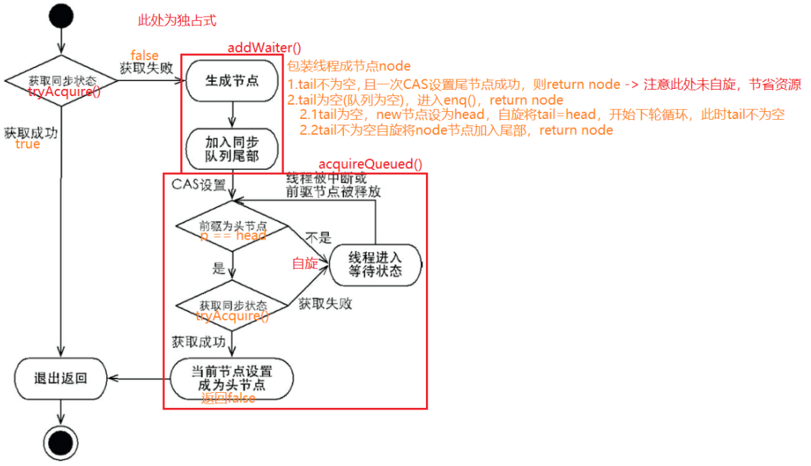

以ReentrantLock的AQS的acquire()为入口

```java
public final void acquire(int arg) {
	//tryAcquire：尝试获取所，提供给子类实现
	//tryAcquire：返回false，！false为true表示线程需要进入同步队列，设置当前线程的状态为独占模式，也就是Node.EXCLUSIVE，进入addWaiter方法
    if (!tryAcquire(arg) &&
        acquireQueued(addWaiter(Node.EXCLUSIVE), arg))
        selfInterrupt();
}
------------------------------------------
private Node addWaiter(Node mode) {
	//将当前线程封装成Node节点
   Node node = new Node(Thread.currentThread(), mode);
   //tail默认为null，如果tail不为空，说明同步队列已经有节点
   Node pred = tail;
   if (pred != null) {
   		//将当前节点添加到尾节点
       node.prev = pred;
       //一次CAS设置尾节点
       if (compareAndSetTail(pred, node)) {
           pred.next = node;
           return node;
       }
   }
   //尾节点=null，当前节点是第一个节点，则进入enq方法
   //资源争抢太多，一次CAS失败，则进入enq方法
   enq(node);
   return node;
}
------------------------------------------
private Node enq(final Node node) {
	//通过自旋的方式
    for (;;) {
        Node t = tail;
        if (t == null) {如队尾为空，即同步队列为空
        	//首节点是虚拟节点
            if (compareAndSetHead(new Node()))//设置头节点，同时尾节点设置成头节点
                tail = head;
        } else {
        	//设置当前节点到尾部
            node.prev = t;
            if (compareAndSetTail(t, node)) {
                t.next = node;
                return t;
            }
        }
    }
}
```

回退到acquire()上

```java
public final void acquire(int arg) {
    if (!tryAcquire(arg) &&
    	//根据上面分析，addWaiter返回的是node，新插入节点，接着看acquireQueued方法
         acquireQueued(addWaiter(Node.EXCLUSIVE), arg))
        selfInterrupt();
}
------------------------------------------
final boolean acquireQueued(final Node node, int arg) {
	//标记是否成功拿到资源
    boolean failed = true;
    try {
    	//标记等待过程是否被中断
        boolean interrupted = false;
        //看到死循环就想到自旋
        for (;;) {
        	//获取node的前驱节点，注意head只是一个哨兵节点
            final Node p = node.predecessor();
            //前驱节点是头节点(哨兵) && 可是获取到锁
            if (p == head && tryAcquire(arg)) {
            	//则将当前线程节点设置为哨兵节点，头结点对应的thread属性为null,此时头节点已经获取到锁了
                setHead(node);
                //将之前的哨兵节点置成垃圾，方便垃圾回收gc
                p.next = null;
                //标识成功获取到资源
                failed = false;
                //表示线程未被中断，正常获取到锁
                return interrupted;
            }
            //若node的前驱不是头结点head,或是头节点但调用tryAcquire()尝试获取锁失败，则:
           	//1.shouldParkAfterFailedAcquire获取前驱节点状态，判断当前节点线程是否需要阻塞同时删除队列中取消的线程节点
            //      若不需要阻塞(前驱节点不处于唤醒状态)返回false，则再次进入自旋查找前驱并尝试获取锁
            //      若需要阻塞(前驱节点处于唤醒状态)则返回true，进入parkAndCheckInterrupt方法
            //2.parkAndCheckInterrupt阻塞当前线程在park位置，直到unpark或interrupt后再次检查该线程的中断状态，并返回中断状态
            //      若唤醒后该线程不处于中断状态返回false，则再次进入自旋查找前驱并尝试获取锁
            //      若唤醒后该线程处于中断状态返回true，则设置interrupted=true，则再次进入自旋查找前驱并尝试获取锁，但返回会是true
            //          回到acquire()中执行selfInterrupt()方法，完成当前线程的中断信号发出
            if (shouldParkAfterFailedAcquire(p, node) &&
                    parkAndCheckInterrupt())
                interrupted = true;
    } finally {
    	if (failed)//未成功获取到资源，且此时
	        //如果node的前驱结点为空,说明node为头结点,代码抛出异常
	        cancelAcquire(node);//取消对资源的获取
    }
}
------------------------------------------
//cancled表示node所代表的线程已取消排队,需要从同步队列移除
//signal意思是前驱节点释放锁,则当前节点被唤醒,其后继节点需要被阻塞
private static boolean shouldParkAfterFailedAcquire(Node pred, Node node) {
    //根据前驱结点的状态判断是否将线程阻塞
    int ws = pred.waitStatus;//前驱节点
    if (ws == Node.SIGNAL)//前驱节点处于唤醒状态，只要前驱的前驱释放锁，前驱节点就运行，当前线程阻塞
        return true;
    if (ws > 0) {//前驱节点处于cancled状态(原因可能是超时或中断)，则将所有处于取消状态的前驱节点从同步队列中删除
        //让当前节点的前驱节点不断循环，跳过所有被撤销的前驱节点，指向一个最近ws<0(未撤销的)的前驱节点
        do {
            //此时前驱节点是取消状态，修改前驱指向前驱的前驱
            node.prev = pred = pred.prev;
        } while (pred.waitStatus > 0);
        //退出循环表示当前pred就是Node结点的前驱结点，此时已经将同步队列中所有取消的节点移除
        pred.next = node;
    } else {//前驱未取消，通过CAS设置前驱节点状态为唤醒
        compareAndSetWaitStatus(pred, ws, Node.SIGNAL);
    }
    //返回false表示不阻塞线程
    return false;
}
------------------------------------------
private final boolean parkAndCheckInterrupt() {
	//阻塞当前线程，一直阻塞到当前位置，直到被唤醒(unpark或interrupt)
    LockSupport.park(this);
    //直到被唤醒后,重新判断当前线程中断状态
    //从unparkSuccessor()中被unpark后判断线程是否被中断，被中断返回true,interrupted被设置为true作为acquireQueued()方法的返回进入到下面的selfInterrupt通知线程中断
    return Thread.interrupted();
}
```

再次回退到acquire()上

```java
public final void acquire(int arg) {
   if (!tryAcquire(arg) &&
       acquireQueued(addWaiter(Node.EXCLUSIVE), arg))
       //返回false，则表示已进入队列，或者获取到资源
       //返回true，则进入selfInterrupt方法，方法里面很简单
       selfInterrupt();
}
------------------------------------------
static void selfInterrupt() {
	//中断线程
	Thread.currentThread().interrupt();
}
```

#### 4.2.独占式release

```java
public final boolean release(int arg) {
    if (tryRelease(arg)) {//释放资源成功，进入if
        Node h = head;//获取同步队列头结点，就是当前需要释放的节点
        //如头结点非空，且头结点状态不为0,那么队列中可能存在待唤醒的结点
        if (h != null && h.waitStatus != 0)
            //唤醒后继结点，让后继结点竞争资源(parkAndCheckInterrupt()中的park)
            unparkSuccessor(h);
        //释放独占锁成功，返回true
        return true;
    }
    //释放独占资源失败，返回false
    return false;
}
-------------------------------------
private void unparkSuccessor(Node node) {
   	int ws = node.waitStatus;
    if (ws < 0)//结点状态小于0,则肯定不是cancled态
        //CAS将结点状态设为0
        compareAndSetWaitStatus(node, ws, 0);

    Node s = node.next;//取下一个节点
    //如后续为空 或 是取消状态,说明后继结点对应的线程取消对资源的等待
    if (s == null || s.waitStatus > 0) {
        s = null;
        //从同步队列队尾结点开始向前遍历，找到node结点第一个不是取消状态的结点，如遍历到的结点t非空且不等于当前node,则校验此结点t的状态
        //简单来说就是寻找到下一个非取消态的结点s
        for (Node t = tail; t != null && t != node; t = t.prev)
            if (t.waitStatus <= 0)
                s = t;
    }

    if (s != null)
        //唤醒后继节点对应的线程 ---> 唤醒后从parkAndCheckInterrupt()的park处醒来判断中断状态
        LockSupport.unpark(s.thread);
}
```

### 5.利用AQS自定义XXX

其实在自定义的过程中可以看出公平锁如何实现，非公平锁如何实现，独占锁如何实现，共享锁如何实现

* `class NonFairSync extends Sync`实现`tryAcquireShared()`，且`Sync sync = new NonFairSync(count);`
* `class FairSync extends Sync`实现`tryAcquireShared()`，且`Sync sync = new FairSync (count);`
* 独占和共享和`state`状态有关

#### 5.1.自定义CountDownLatch(共享锁)

```java
/**
 - 自定义CountDownLatch
 - 1.state:初始值 --- MyCountDownLatch(state)模拟CountDownLatch的有参构造
 - 2.await:线程加入阻塞队列，等待state=0唤醒获取锁 -- tryAcquireShared
 - 3.countDown:state-1，state>0时没有达到取锁条件，state=0时表示需要释放锁 -- tryReleaseShared
 - 4.MySync:AQS实现类，重写获取释放锁的条件
 - tryAcquireShared()：state=0表示解除阻塞，即需要去取锁了，返回1，否则加入阻塞队列返回-1
 - tryReleaseShared()：state-1，需要修改state的值，为了防止多线程争抢state，所以自旋+CAS
 */
public class MyCountDownLatch {
    //AQS
    private static final class MySync extends AbstractQueuedSynchronizer {

        private static final long serialVersionUID = 8055037635125704937L;

        public MySync(int count) {
            //setState是AQS自带方法，设置state值
            setState(count);
        }

        //获取state值
        public int getCount() {
            return getState();
        }

        //尝试获取锁
        @Override
        protected int tryAcquireShared(int arg) {
            //state>0 都不能持有锁，都加入阻塞队列，直到state=0
            //开始时，state被初始化>0，所以此时所有的线程都不能获取锁,直到countDown全部调用完毕

            //查看底层
            // 返回值<0,state!=0,表示当前线程需处于阻塞状态,接下来acquire继续向下,将当前线程加入阻塞队列 --> 锁被占用
            // 返回值>0,state=0,表示当前当前阻塞队列中的线程同时全部唤醒,争抢释放的锁 --> 锁被释放
            return (getState() == 0) ? 1 : -1;
        }

        //尝试释放锁
        @Override
        protected boolean tryReleaseShared(int arg) {
            //返回true表示doReleaseShared --> 释放锁

            //考虑多线程共享，并发操作要保证state共享变量的原子性-->自旋+CAS
            for (; ; ) {
                //原值state
                int c = getState();
                if (c == 0) {//state=0 表示锁已经被获取，不需要释放
                    return false;
                }
                //修改state
                int nextc = c - 1;
                //compareAndSetState是AQS中的方法
                if (compareAndSetState(c, nextc)) {
                    //state设置完后为0，需要释放锁供所有线程被唤醒来争抢锁
                    return nextc == 0;
                }
            }
        }
    }

    private final MySync mySync;

    public MyCountDownLatch(int count) {
        this.mySync = new MySync(count);
    }

    public void await() {//state=0才能获取锁，否则加入阻塞队列
        mySync.acquireShared(1);
    }

    public void countDown() {//修改后state=0才能释放锁
        mySync.releaseShared(1);
    }

    public int getCount() {
        return mySync.getCount();
    }
}
```

#### 5.2.自定义Semaphore(共享锁+非公平锁)

```java
/**
 - 自定义Semaphore
 - state:初始值
 - acquire() state-1
 - release() state+1
 - Sync：abstract
 - NonFairSync
 */
public class MySemaphore {
    //AQS
    static abstract class MySync extends AbstractQueuedSynchronizer {

        private static final long serialVersionUID = 8055037635125704937L;

        public MySync(int count) {
            //setState是AQS自带方法，设置state值
            setState(count);
        }

        //尝试释放锁
        @Override
        protected boolean tryReleaseShared(int arg) {
            //返回true表示doReleaseShared --> 释放锁

            //考虑多线程共享，并发操作要保证state共享变量的原子性-->自旋+CAS
            for (; ; ) {
                //原值
                int oldState = getState();
                int newState = oldState + arg;
                //compareAndSetState是AQS中的方法
                if (compareAndSetState(oldState, newState)) {
                    return true;
                }
            }
        }
    }

    //非公平
    static final class NonFairSync extends MySync {
        private static final long serialVersionUID = -2352767803293687627L;

        public NonFairSync(int count) {
            super(count);
        }

        @Override
        protected int tryAcquireShared(int arg) {
            for (; ; ) {
                //非公平锁，直接上来就枪锁
                int oldState = getState();
                int newState = oldState - arg;//请求后，源资源数减少
                //返回值<0,阻塞
                if (newState < 0 || compareAndSetState(oldState, newState)) {
                    return newState;
                }
            }
        }
    }

    private final MySync mySync;

    public MySemaphore(int count) {
        this.mySync = new NonFairSync(count);
    }

    public void acquire() {
        mySync.acquireShared(1);
    }

    public void release() {
        mySync.releaseShared(1);
    }
}
```

#### 5.3.自定义ReentrantLock(独占锁)

```java
/**
 - A线程lock()时，会调用tryAcquire()独占该锁并将state+1
 - 此时，其他线程再tryAcquire()时就会失败，直到A线程unlock()到state=0(即释放锁)为止，其它线程才有机会获取该锁
 - 当然，释放锁之前，A线程自己是可以重复获取此锁的（state会累加），这就是可重入的概念
 - 但要注意，获取多少次就要释放多么次，这样才能保证state是能回到零态的
 - 
 - 自定义ReentrantLock
 - 要求：非可重入锁，独占锁
 */
public class MyReentrantLock implements Lock {

    //state=0当前线程没有获取到锁
    //state=1当前线程获取到锁
    private static class Sync extends AbstractQueuedSynchronizer {
        private static final long serialVersionUID = 6712919921457609668L;

        @Override //判断是否占用
        protected boolean isHeldExclusively() {
            return getState() == 1;
        }

        //独占锁：一次只能有一个线程获取到锁，此时state=0才能成功返回true
        //独占锁只有两个状态
        @Override
        protected boolean tryAcquire(int arg) {
            if (compareAndSetState(0, 1)) {//原值0，新值1，改成功返回true，则获取锁
                //将当前线程设置为执行线程
                setExclusiveOwnerThread(Thread.currentThread());
                return true;
            }
            return false;
        }

        //释放锁
        @Override
        protected boolean tryRelease(int arg) {
            if (getState() == 0) {//没有获取到锁
                throw new UnsupportedOperationException();
            }
            //设置当前执行的线程为null
            setExclusiveOwnerThread(null);
            setState(0);
            return true;
        }

        Condition newCondition() {
            return new ConditionObject();
        }
    }

    private final Sync sync = new Sync();

    @Override
    public void lock() {//直接获取锁
        sync.acquire(1);
    }

    @Override
    public void lockInterruptibly() throws InterruptedException {
        //响应中断式直接获取锁
        sync.acquireInterruptibly(1);
    }

    @Override
    public boolean tryLock() {
        return sync.tryAcquire(1);
    }

    @Override
    public boolean tryLock(long time, TimeUnit unit) throws InterruptedException {
        return sync.tryAcquireNanos(1, unit.toNanos(time));
    }

    @Override
    public void unlock() {
        sync.release(1);
    }

    @Override
    public Condition newCondition() {
        return sync.newCondition();
    }
}
```

#### 5.4.三元共享同步工具类

与Semaphore类似，每次同时运行三个线程

```java
public class TrinityLock implements Lock {
    //为3表示允许两个线程同时获得锁
    private final Sync sync = new Sync(3);

    private static final class Sync extends AbstractQueuedSynchronizer {
        private static final long serialVersionUID = -5919240659191346108L;

        Sync(int count) {
            if (count <= 0) {
                throw new IllegalArgumentException("count must large than zero.");
            }
            setState(count);
        }

        @Override
        public int tryAcquireShared(int reduceCount) {
            for (; ; ) {
                int current = getState();
                int newCount = current - reduceCount;
                if (newCount < 0 || compareAndSetState(current, newCount)) {
                    return newCount;
                }
            }
        }

        @Override
        public boolean tryReleaseShared(int returnCount) {
            for (; ; ) {
                int current = getState();
                int newCount = current + returnCount;
                if (compareAndSetState(current, newCount)) {
                    return true;
                }
            }
        }

        final ConditionObject newCondition() {
            return new ConditionObject();
        }
    }

    @Override
    public void lock() {
        sync.acquireShared(1);
    }

    @Override
    public void unlock() {
        sync.releaseShared(1);
    }

    @Override
    public void lockInterruptibly() throws InterruptedException {
        sync.acquireSharedInterruptibly(1);
    }

    @Override
    public boolean tryLock() {
        return sync.tryAcquireShared(1) >= 0;
    }

    @Override
    public boolean tryLock(long time, TimeUnit unit) throws InterruptedException {
        return sync.tryAcquireSharedNanos(1, unit.toNanos(time));
    }

    @Override
    public Condition newCondition() {
        return sync.newCondition();
    }
}
```

## 十、补充-锁的种类

### 1.可重入锁

可重入表示同一个线程获取同一把锁不要切换上下文

### 2.公平锁与非公平锁

公平表示线程按照申请锁的顺序获取锁，线程到达会直接进入队列，永远只有队头的线程才可获取锁

* 优点是所有的线程都可以得到调度，不至于造成**饥饿**

* 缺点是吞吐量下降，除了队首元素其他全阻塞，而且CPU唤醒阻塞线程的开销会很大

非公平表示线程在申请锁时，直接尝试获取锁，若获取到则直接拿锁跑路，获取不到再进入队列去排队

* 优点是吞吐量会高一点，而且减少CPU的唤醒次数，减少CPU开销
* 缺点是可能出现**饥饿**现象，即队列中某些线程由于某些原因一直获取不到锁，导致饿死

### 3.自旋锁

 利用CAS完成自旋锁，不会造成阻塞，而且CAS保证原子性

```java
//实现安全的自增
public class SafeIncrement {
    private AtomicInteger atomicI = new AtomicInteger(0);

    public void increament() {
        for (;;) {//自旋
            int i = atomicI.get();//另外线程  可能修改过i值
            boolean suc = atomicI.compareAndSet(i, ++i);
            if (suc) {//i修改成功则跳出循环
                break;
            }
        }
    }
}
```


