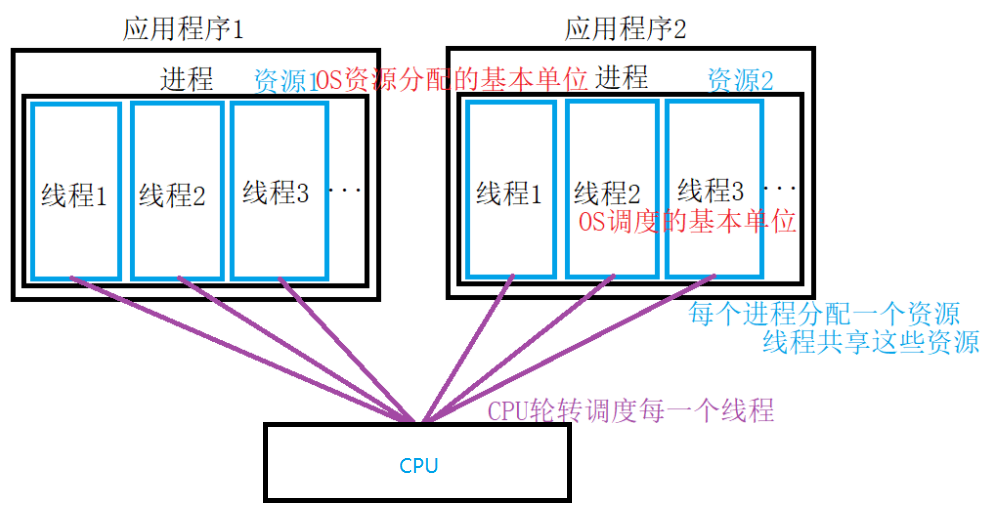
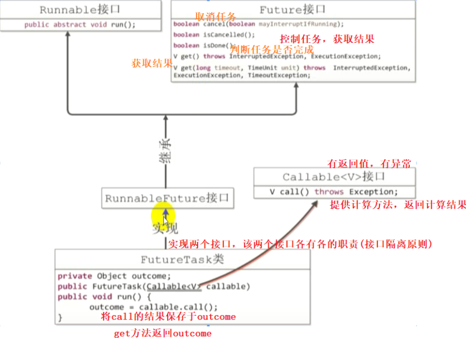
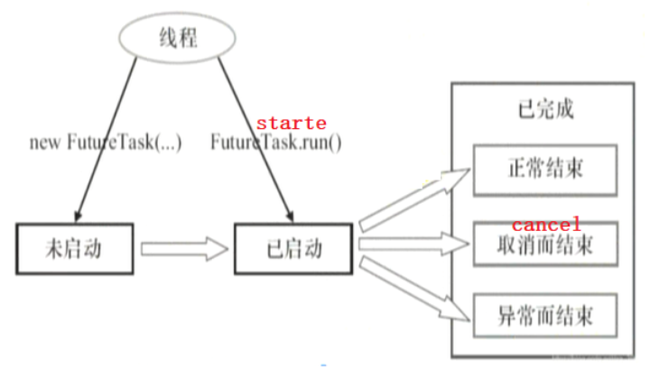
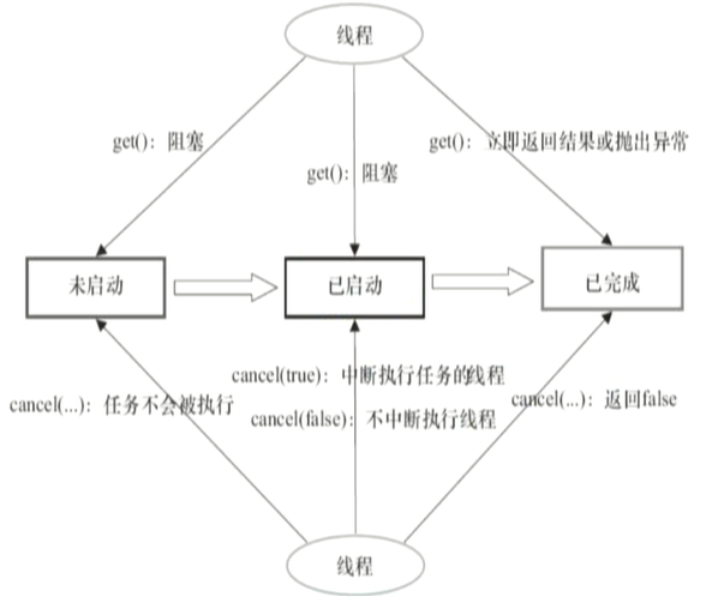
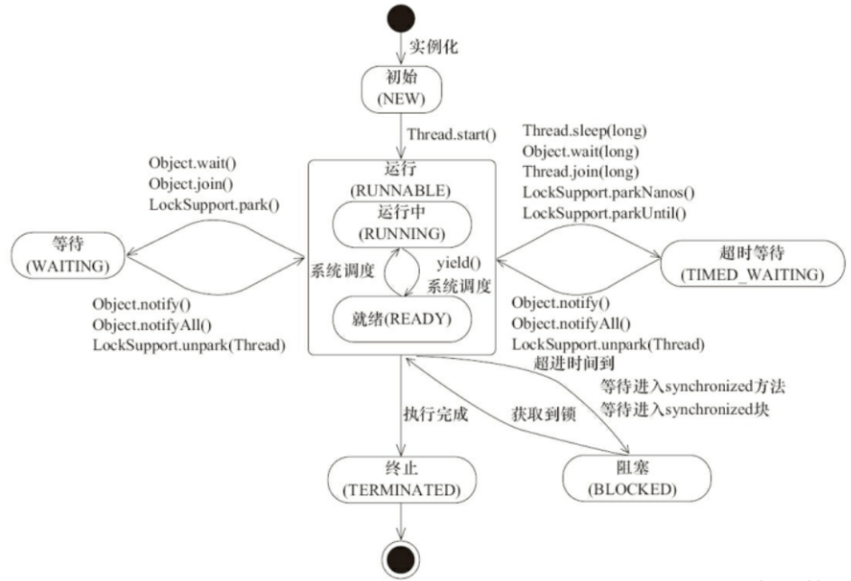
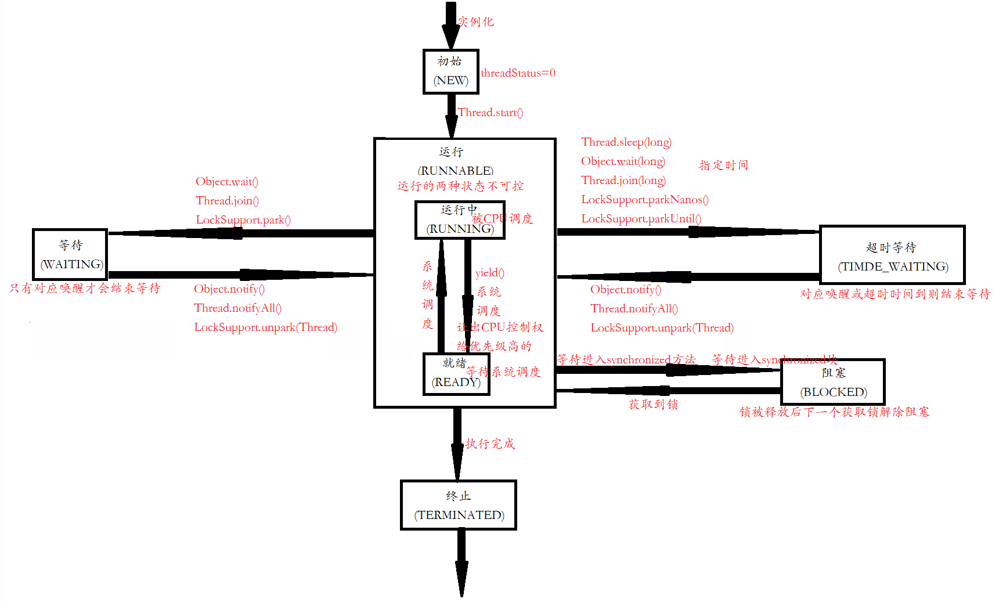
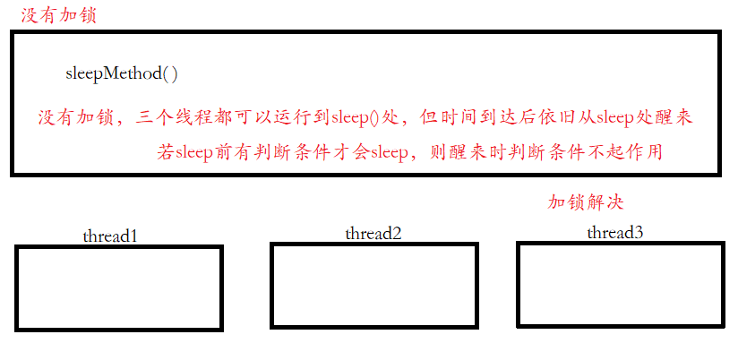
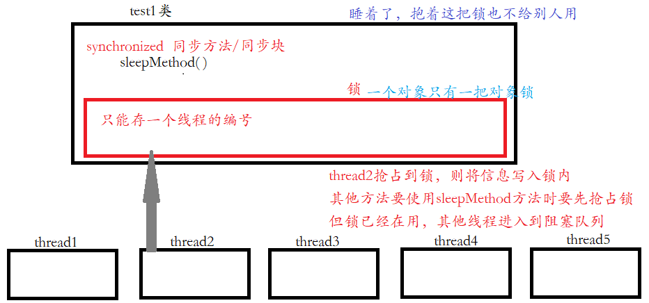
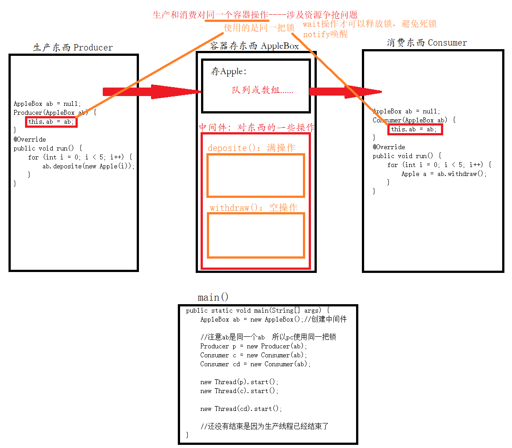

# 线程基础

## 一、并发与并行

**并发**：两个及两个以上作用在同一**时间段**内执行，单核CPU内线程实际是串行执行的，但内部CPU轮询非常快，给人感觉是同时执行的，总之**宏观并行，微观串行**，这种线程轮流使用CPU称为并发

**并行**：两个及两个以上作业在同一**时刻**运行，多核CPU内每个核可运行一个线程，此时线程真正可以并行

## 二、进程与线程

### 1.问题引入

用户输入前经过长时间的思考，思考时计算机一直在等待，为解决出现**批处理系统**

若有AB两个任务，当A任务处理耗时IO操作时CPU只能静静等待，为解决则在内存中装多个任务，当A进行耗时操作时B上

内存中多个程序的数据如何划分，程序暂停后再次恢复时如何恢复到原来的状态，为解决出现**进程**

进程在某时间段内只能处理一个任务，为解决出现**线程**

### 2.进程

**执行中的程序**叫做进程(Process)，即从磁盘加载程序代码到内存的过程，是**动态**概念，现代的操作系统都可以**同时启动多个进程**，比如在用酷狗听音乐，也可以使用wps写文档，也可以同时用浏览器查看网页

> 程序对于OS中的某可执行文件，是**静态**概念，比如要启动酷狗听音乐，则对应酷狗可执行程序，当我们双击酷狗，则加载程序到内存中，开始执行该程序，于是产生了"进程"

每个进程拥有自己的内存，约定每个进程只能使用自己的内存空间，即**进程间互不干扰**，进程间通信一般都比较复杂，如同一计算机进程间相互通信称为IPC，不同计算机间相互通信需要通过网络，共同遵守协议

进程内保存程序运行状态，CPU轮询每个进程，当下次重新切换回来时恢复原来状态

### 3.线程

线程内执行一个子任务，线程是进程的某个执行路径，一个进程内至少包含一个线程，比如在使用酷狗音乐听歌的同时下载歌

线程共享虚拟机资源，即堆、方法区、但程序计数器PC、虚拟机栈、本地方法栈是线程私有的，**线程能在进程内并发执行**

线程时间开销小，线程上下文切换成本一般上要比进程上下文切换低，线程不利于资源分配与管理，**线程是资源调度的基本单位**，而**进程是资源分配的基本单位**，线程主要解决**耗时和阻塞**操作

> Java默认有main(主)和GC(垃圾回收)两个线程

进程结束，其中的线程也会结束，**线程在JVM中理解虚拟机栈的原理后再回过头比较好理解**



### 4.应用之提高效率

充分利用多核CPU优势，提高程序运行效率，想象以下场景

* 计算 1 花费 10 ms
* 计算 2 花费 11 ms
* 计算 3 花费 9 ms
* 汇总需要 1 ms

若是并发执行，实际是线程串行执行，此时共用时`10 + 11 + 9 + 1 = 31ms`，但若是四核CPU，则每核执行一个计算，最终用时`11 + 1 = 12ms`，即花费时间最长的计算加汇总用时

**所以单核CPU实际不能提高程序运行效率，只是为了让其他线程有活，多核CPU也不一定能提升程序效率，需要通过精密计算，并且不是所有任务都要拆分**

IO操作本身不占用CPU，但拷贝文件一般都是**阻塞IO**，这相当于CPU虽然空闲，但一直要等到IO结束，为解决所以才有了后来的**非阻塞IO和异步IO**

## 三、创建线程的方式

### 1.说明

线程执行的先后与代码中`start()`先后无关，与CPU调度有关

主程序运行完毕，但是子线程并未完毕，所以主线程也并没有退出，直到子程序运行完毕

**直接调用`run()`实际由JVM直接调用，与主线程同步，即`run()`是在主线程中，并没有开启新线程，而`start()`启动新线程，通过新线程间接调用`run()`**

### 2.继承Thread类

`MyThread`继承`Thread`，重写`run()`加入耗时的或阻塞操作，但**Java是单继承的，影响类的扩展性**

```java
public class t1_classExtends {
    public static void main(String[] args) throws InterruptedException {
        System.out.println("主方法开始");

        MyThread1 m1 = new MyThread1();
        //设置线程名
        m1.setName("线程1--继承Thread外部类--");
        //设置优先级（理论上先调用优先级高的）  1-10
        m1.setPriority(1);
        //子程序运行
        m1.start();

        for (int i = 0; i < 5; i++) {
            Thread.sleep(1000);
            System.out.println("主方法在运行");
        }
    }
}
class MyThread1 extends Thread {
    @Override
    public void run() {
        for (int i = 0; i <= 100; i++) {
        	//Thread.currentThread().getName()：输出当前线程的名字   未给名字系统分配
            System.out.println(Thread.currentThread().getName()+"i=" + i);
            try {
                Thread.sleep(1000);
            } catch (InterruptedException e) {
                e.printStackTrace();
            }
        }
    }
}
------------------------------------------------------------------
主方法开始
线程1--继承Thread外部类--i=0
线程1--继承Thread外部类--i=1
主方法在运行
主方法在运行
线程1--继承Thread外部类--i=2
主方法在运行
线程1--继承Thread外部类--i=3
主方法在运行
线程1--继承Thread外部类--i=4
主方法在运行
线程1--继承Thread外部类--i=5
线程1--继承Thread外部类--i=6
线程1--继承Thread外部类--i=7
......
```

### 3.实现Runnable接口

#### 3.1.外部类

无法获得新线程的执行结果

```java
public class t2_runnable {
    public static void main(String[] args) {
    	System.out.println("主方法开始");
    	
 		MyRunnable task = new MyRunnable();
        Thread thread1 = new Thread(task, "线程2--实现runnable--");//创建线程对象（任务，线程名）
        thread1.setPriority(10);
        thread1.start();//启动后，jvm会自动回调他的配置   task中的run()
    }
}

class MyRunnable implements Runnable {
    @Override
    public void run() {
        for (int i = 0; i <= 100; i++) {
            System.out.println(Thread.currentThread().getName()+"i=" + i);
            try {
                Thread.sleep(1000);
            } catch (InterruptedException e) {
                e.printStackTrace();
            }
        }
    }
}
```

#### 3.2.匿名内部类

只有某一个地方使用时使用匿名内部类

```java
public class t2_runnable {
    public static void main(String[] args) throws InterruptedException {
        System.out.println("主方法开始");

		//方法1
        Thread thread = new Thread(new Runnable() {
            @Override
            public void run() {
                for (int i = 0; i <= 100; i++) {
                    System.out.println(Thread.currentThread().getName()+"i=" + i);
                    try {
                        Thread.sleep(1000);
                    } catch (InterruptedException e) {
                        e.printStackTrace(); 
                    }
                }
            }
        },"线程3.1--匿名内部类--");
        thread.start();
        
        //方法2
        new Thread(new Runnable() {
            @Override
            public void run() {
                for (int i = 0; i <= 100; i++) {
                    System.out.println(Thread.currentThread().getName()+"i=" + i);
                    try {
                        Thread.sleep(1000);
                    } catch (InterruptedException e) {
                        e.printStackTrace();
                    }
                }
            }
        },"线程3.2--匿名内部类--").start();
    }
}
```

#### 3.3.lambda写法

底层有注解`@FunctionalInterface`则支持函数式编程，函数式接口有两个特点，首先含`@FunctionalInterface`注解，其次接口内只包含一个抽象方法，不包含与Object的方法重名的方法，从Object继承过来的抽象方法

```java
public class t2_runnable {
    public static void main(String[] args) throws InterruptedException {
        System.out.println("主方法开始");

		//方法1
        Thread thread = new Thread( ()->{
			for (int i = 0; i <= 100; i++) {
                System.out.println(Thread.currentThread().getName()+"i=" + i);
                try {
                    Thread.sleep(1000);
                } catch (InterruptedException e) {
                    e.printStackTrace();
                }
            }
		},"线程4.1--lambda写法--");
        thread.start();
        
        //方法2
        new Thread( ()->{
			for (int i = 0; i <= 100; i++) {
                System.out.println(Thread.currentThread().getName()+"i=" + i);
                try {
                    Thread.sleep(1000);
                } catch (InterruptedException e) {
                    e.printStackTrace();
                }
            }
		},"线程4.2--lambda写法--").start();
    }
}
```

### 4.实现Callable接口

前两种方案都无法获得新线程的执行结果，FutureTask继承结构如下图，由图可知`call()`返回结果



代码实现如下

```java
//实现callable接口   可以有返回值
public class t3_callable {
    public static void main(String[] args) throws ExecutionException, InterruptedException, TimeoutException {
    	//方法1
        FutureTask<Integer> futureTask1 = new FutureTask<Integer>(new Callable<Integer>() {
            @Override
            public Integer call() throws Exception {
                int count = 0;
                for (int i = 0; i <= 100; i++) {
                    Thread.sleep(100);
                    count += 1;
                }
                return count;
            }
        });
        
        //方法2.lambda表达式
        FutureTask<Integer> futureTask2 = new FutureTask<Integer>(() -> {
            int count = 0;
            for (int i = 0; i <= 100; i++) {
                Thread.sleep(100);
                count += 1;
            }
            return count;
        });

        //创建线程 - thread(Runnable)  多态
        Thread thread = new Thread(futureTask2);
        //启动线程
        thread.start();

        //1.无限等待get()：等到任务执行出现异常或任务执行完毕跳出
        //System.out.println("1+2+...+100=" + futureTask2.get());
        
        //2.超时等待get(超时时间,单位)：超过时间就报错
        //V get(long timeout, TimeUnit unit)
        System.out.println("1+2+...+100=" + futureTask2.get(1, TimeUnit.SECONDS));
        
        //get是阻塞式的方法，要等其结果出来之后主线程才会继续，不get就不会阻塞
        System.out.println("主程序中其他的代码");
    }
}
```

既然到提到FutureTask那就来详细讲讲他的状态





```java
//Callable/FutureTask----->创建3+获取结果3+cancel
public class UseFuture {
    //有返回值所以有泛型约定
    private static class UseCallable implements Callable<Integer> {
        private int sum;
        @Override
        public Integer call() throws Exception {
            System.out.println("Callable中call()开始计算");
            Thread.sleep(2000);
            for (int i = 0; i < 5000; i++) {
                sum += i;
            }
            System.out.println("Callable中call()计算结束，结果=" + sum);
            return sum;
        }
    }

    public static void main(String[] args) throws ExecutionException, InterruptedException, TimeoutException {
        UseCallable useCallable = new UseCallable();
        FutureTask<Integer> futureTask = new FutureTask<>(useCallable);

        //方案1：直接使用Thread类包装任务
        new Thread(futureTask).start();

        //方案2：线程池
        //ExecutorService service = Executors.newCachedThreadPool();
        
        //2.1 submit提交任务返回一个创建的线程
        //一次提交一个任务
        //service.submit(futureTask);

        //2.2 invokeAll(集合<Callable>) 一次性激活，将所有任务的返回结果绑定在对应的Future中，以集合的形式返回
        //2.2 这种方法一般不使用，容易内存溢出
        //批量提交任务
        /*List<UseCallable> list = new ArrayList<>();
        list.add(useCallable);
        //一次性激活
        List<Future<Integer>> futures = service.invokeAll(list);
        //批量异步取值get
        for (Future<Integer> f : futures) {
            System.out.println("异步取值方法" + f.get());
        }*/

        //方案3：线程池手工创建
        /*ExecutorService service1 = new ThreadPoolExecutor(2, 4, 3, TimeUnit.SECONDS,
                new ArrayBlockingQueue<Runnable>(10),
                new ThreadPoolExecutor.DiscardOldestPolicy());
        service.submit(futureTask);*/

        Random random = new Random();
        Thread.sleep(1);
        if (random.nextBoolean()) {
            System.out.println("--获取结果--");
            //方案1：阻塞式无参get，直到结束或有异常时返回
            //System.out.println("阻塞无参get获取Callable结果：" + futureTask.get());

            //方案2：阻塞式有参get，直到计时结束返回结果   TimeoutException
            //System.out.println("阻塞有参get获取Callable结果：" + futureTask.get(1, TimeUnit.SECONDS));
            System.out.println("阻塞有参get获取Callable结果：" + futureTask.get(5, TimeUnit.SECONDS));

            System.out.println("阻塞式get()阻塞结束");
        } else {
            System.out.println("中断计算");
            futureTask.cancel(true);
        }

        //线程池运行完毕一定要关闭，因为线程池中的线程不是精灵线程
        //service.shutdown();
    }
}
```

### 5.线程池

将在[线程池](/7.JUC并发编程/线程池)中详细讲解，创建代码如下

```java
public class t4_pool {
    public static void main(String[] args) {
        //核心线程池的大小，即最开始线程大小，不够则扩充到max
        int corePoolSize = 2;
        //核心线程池的最大线程数
        int maxPoolSize = 4;
        //线程最大空闲时间，即10unit没有用就回收
        long keepAliveTime = 10;
        //时间单位
        TimeUnit unit = TimeUnit.SECONDS;
        //阻塞队列，容量为2，最多允许放入两个空闲任务
        //该线程最做允许6个任务4+2
        BlockingQueue<Runnable> workQueue = new ArrayBlockingQueue<>(2);
        
        //线程创建工厂
        ThreadFactory threadFactory = new NameThreadFactory();
        //线程池拒绝策略----任务太多,阻塞队列都存不下
        RejectedExecutionHandler handler = new MyIgnorePolicy();
        
        ThreadPoolExecutor executor = null;
        try {
            //推荐的创建线程池的方式如下，不推荐使用现成的API创建线程池
            executor = new ThreadPoolExecutor(corePoolSize, maxPoolSize, keepAliveTime, unit, workQueue, threadFactory, handler);
            //预启动所有核心线程，提升效率
            executor.prestartAllCoreThreads();
            //任务数量
            int count = 10;
            for (int i = 0; i <= count; i++) {
                RunnableTask task = new RunnableTask(String.valueOf(i));
                //提交任务到线程池   还有4个任务无法执行
                executor.submit(task);
            }
        } finally {
            //断言  可开关   -ea   -da
            assert executor != null;
            //关闭线程池
            executor.shutdown();
        }
    }

    //线程工厂
    static class NameThreadFactory implements ThreadFactory {
        //AtomicInteger原子类(整体)：保证复制，更新，复写回的过程是一个整体(并发编程),保证线程安全
        //123线程使用线程池时变量要依次添加，而不是一个新线程调用时又从0开始
        private final AtomicInteger threadId = new AtomicInteger(1);

        @Override
        public Thread newThread(Runnable r) {
            Thread t = new Thread(r, "线程--" + threadId.getAndIncrement());//相当于i++
            System.out.println(t.getName() + "已被创建");
            return t;
        }
    }

    //线程池拒绝策略
    public static class MyIgnorePolicy implements RejectedExecutionHandler {
        @Override //被拒绝的对象,线程池对象
        public void rejectedExecution(Runnable r, ThreadPoolExecutor executor) {
            doLog(r, executor);
        }

        private void doLog(Runnable runnable, ThreadPoolExecutor e) {
            //可以做日志记录等
            System.out.println("线程池：" + e.toString() + runnable.toString() + "被拒绝执行");
        }
    }

    //任务类
    static class RunnableTask implements Runnable {
        private String name;
        public RunnableTask(String name) {
            this.name = name;
        }

        @Override
        public void run() {
            try {
                System.out.println(this.toString() + "  is running!");
                Thread.sleep(3000);//让任务慢点执行
            } catch (InterruptedException e) {
                e.printStackTrace();
            }
        }
 
        @Override
        public String toString() {
            return "RunnableTask{name='" + name + "\'}";
        }
    }
}
```

## 四、线程分类

### 1.主线程

`main()`产生的线程，任意Java程序至少含一个线程

### 2.守护线程

又叫精灵线程，相当于后台线程，即非精灵线程都结束，精灵线程也将结束，这样来看Java程序线程远不止一个，还有许多精灵线程，创建精灵线程通过`setDaemon(true)`

```java
//精灵线程：其他线程结束，精灵也结束
public class t9_deamon {
    public static void main(String[] args) {
        Thread thread1 = new CommonThread();
        Thread thread2 = new Thread(new MyDeamon());

        //设置为守护线程，线程运行前设置守护线程
        thread2.setDaemon(true);

        thread2.start();//原循环20次，但实际只有5次
        thread1.start();//原循环5次
    }
}

//线程类
class CommonThread extends Thread {
    @Override
    public void run() {
        for (int i = 0; i < 5; i++) {
            System.out.println("用户线程：" + i + "执行！");
            try {
                Thread.sleep(10);
            } catch (Exception e) {
                e.printStackTrace();
            }
        }
    }
}

//任务类
class MyDeamon implements Runnable {
    @Override
    public void run() {
        for (int i = 0; i < 20; i++) {
            System.out.println("守护线程：" + i + "执行！");
            try {
                Thread.sleep(10);
            } catch (Exception e) {
                e.printStackTrace();
            }
        }
    }
}
------------------------------------------------------------------
用户线程：0执行！
守护线程：0执行！
用户线程：1执行！
守护线程：1执行！
用户线程：2执行！
守护线程：2执行！
用户线程：3执行！
守护线程：3执行！
用户线程：4执行！
守护线程：4执行！
守护线程：5执行！
```

### 3.子线程

子线程与父线程具有相同的优先级

## 五、线程组ThreadGroup

线程组用于批量管理线程或线程组，创建方式如下

```java
public class t15_ThreadGroup {
    public static void main(String[] args) {
        TestThread t1 = new TestThread();
        TestThread t2 = new TestThread();

        ThreadGroup g1 = new ThreadGroup("线程组1");

        Thread thread1 = new Thread(g1, t1);
        thread1.start();

        Thread thread2 = new Thread(g1, t2);
        thread2.start();

        System.out.println("活动的线程组：" + g1.activeCount());
        System.out.println("线程组名称：" + g1.getName());

        //线程组中断，则组内所有线程中断
        g1.interrupt();
        //while循环中sleep异常被捕获，循环终止
    }
}

class TestThread implements Runnable {
    @Override
    public void run() {
        try {
            while (!Thread.currentThread().isInterrupted()) {
                System.out.println("线程名：" + Thread.currentThread().getName());
                Thread.sleep(3000);//两个线程被打断
            }
        } catch (InterruptedException e) {
            e.printStackTrace();
        }
    }
}
```

## 六、线程中断

### 1.什么是线程中断？

线程中断是**线程间的协作机制**，即发出中断信号时只是通知，而不强制线程立刻退出

### 2.线程中断操作

`interrupt()`：执行中断操作

`isInterrupted()`：检测中断状态，且不清除中断状态

```java
public class t6_isInterrupted {
    public static void main(String[] args) {
        //当前线程
        Thread thread = Thread.currentThread();
        //检测当前线程是否被中断
        System.out.println(thread.getName() + "线程是否中断：" + thread.isInterrupted());//false
        
        //中断线程
        thread.interrupt();

        //检测当前线程是否被中断
        System.out.println(thread.getName() + "线程是否中断：" + thread.isInterrupted());//true
        //检测线程中断状态是否被清除
        System.out.println(thread.getName() + "线程是否中断：" + thread.isInterrupted());//true
	}
}
```

`interrupted()`：检测中断状态，同时清除中断状态

```java
public class t5_interrupt {
    public static void main(String[] args) {
        //通过interrupt()方法实现中断
        //通过interrupted()方法检测线程是否被中断，清除中断状态

        //Thread.currentThread()主线程
        System.out.println(Thread.currentThread().getName() + "线程是否中断：" + Thread.interrupted());//false

        //设置线程中断
        Thread.currentThread().interrupt();//变成中断态

        //Thread.currentThread().stop();//过期（强制线程关闭 会很不安全）

        //返回true后恢复状态
        System.out.println(Thread.currentThread().getName() + "线程是否中断：" + Thread.interrupted());//true
        System.out.println(Thread.currentThread().getName() + "线程是否中断：" + Thread.interrupted());//false
    }
}
```

### 3.响应线程中断的方式

抛出`InterruptedException`，异常被`catch`捕获后中断状态将被清除

```java
public class t7_ReThrowInterruptException {
    public static void main(String[] args) throws InterruptedException {
        //当前线程
        Thread thread = Thread.currentThread();
        try {
            //当前线程中断
            thread.interrupt();
            //线程休眠3s
            Thread.sleep(3000);//中断后无法睡眠
        } catch (InterruptedException e) {
            System.out.println(thread.getName() + "抛出InterruptedException中断异常");
            System.out.println(thread.isInterrupted());//false
            //异常处理完毕,不会再中断
        }
    }
}
```

捕获`InterruptedException`后重新抛出，异常在`catch`中被重新抛出后中断状态并未清除

```java
public class t7_ReThrowInterruptException {
    public static void main(String[] args) throws InterruptedException {
        //当前线程
        Thread thread = Thread.currentThread();
        try {
            //当前线程中断
            thread.interrupt();
            //线程休眠3s
            Thread.sleep(3000);//中断后无法睡眠
        } catch (InterruptedException e) {
            System.out.println(thread.getName() + "抛出InterruptedException中断异常");
            System.out.println(thread.getName() + "做一些清理工作");
            //再次抛出异常，异常未处理完毕
            throw e;
        }
    }
}
```

检测到中断后，重新设置线程中断

```java
public class t8_ReInterrupted extends Thread {
    public static void main(String[] args) throws InterruptedException {
        //当前线程main
        String threadName = Thread.currentThread().getName();

        //创建线程
        t8_ReInterrupted reInterrupted = new t8_ReInterrupted();
        System.out.println(printDate() + threadName + "线程启动");

        //启动新线程
        reInterrupted.start();

        //主线程休眠3s
        Thread.sleep(3000);
        System.out.println(printDate() + threadName + "设置子线程中断");

        //对新线程设置线程中断
        reInterrupted.interrupt();//睡眠1s被打断
        //主线程休眠3s
        Thread.sleep(3000);
        System.out.println(printDate() + threadName + "运行结束");
    }

    @Override
    public void run() {
        //当前线程
        String threadName = Thread.currentThread().getName();
        int i = 0;
        //循环等待线程中断，只要当前线程不是中断态则继续，是中断则退出

		//当前线程未中断则会进入循环
        while (!Thread.currentThread().isInterrupted()) {
            System.out.println(printDate() + threadName + "线程正在执行第 " + (++i) + "次");
            try {
                //线程阻塞，若线程收到中断操作信号将抛出异常
                Thread.sleep(1000);
            } catch (InterruptedException e) {
                System.out.println(printDate() + threadName + "线程正在执行");
                //检测线程是否中断
                System.out.println(printDate() + threadName + "的状态：" + this.isInterrupted());//false
                //如果需要维护中断状态，则需要重新设置中断状态
                Thread.currentThread().interrupt();//true
                //此处中断，退出循环
            }
        }
        System.out.println(printDate() + threadName + "线程是否被中断：" + this.isInterrupted());
        System.out.println(printDate() + threadName + "线程退出");
    }

    private static String printDate() {
        SimpleDateFormat simpleDateFormat = new SimpleDateFormat("yyyy-MM-dd hh:mm:ss");
        return simpleDateFormat.format(new Date()) + " ";
    }
}
```

## 七、线程生命周期

### 1.图解





### 2.利用生命周期函数

#### 2.1.synchronized

`synchronized`用于解决多线程操作同一资源时数据不一致问题，即**资源争抢问题**，`synchronized`有三种使用方式，即同步代码块、同步方法(对象锁)、同步静态方法(类锁)，注意构造方法不能加锁，在[有锁编程](/7.JUC并发编程/有锁编程)具体讲解




#### 2.2.Thread.sleep()

`sleep()`参数为时间，单位为毫秒，执行`sleep()`后线程进入超时等待，待时间到达则变为就绪态

`interrupt()`可打断线程的休眠状态，打断后抛出`InterruptedException`异常

`sleep()`后并没有释放锁，只是暂时让出该线程所占资源的执行权，锁并没有释放，其他线程同样无法获取锁，因为不释放锁，所以不涉及线程间的通信

#### 2.3.Object.wait()

`wait()`参数有`wait()、wait(long timeout)、wait(long timeout,nanos)`等，执行`wait()`后线程进入等待状态，需要手动解锁后才变为就绪态

`wait()`后锁被释放，同时让出执行权，让其他线程先取锁运行，待到此线程再次获取到锁时继续执行，即`wait()`会使线程交替执行

**`wait()`必须在`synchronized`中执行，因为`wait()`会使锁被释放，但释放锁前必须有锁**

#### 2.4.yield()

`yield()`会使当前线程让出CPU使用权给相同或优先级更高的线程，但不保证其他线程一定可以获得CPU执行权，即其他线程没得到执行权时，可能还是需要当前线程先执行

`yield()`施行后变为就绪态，且该方法无异常，不可打断

#### 2.5.join()

`join()`执行会使当前线程立即执行，正在运行的线程先阻塞，待当前线程结束后再执行

#### 2.6.notify()/notifyAll

`notify()、notifyAll`都属于`Object`，前者唤醒一个线程，后者唤醒所有线程

## 八、死锁

### 1.什么是死锁？

两个或两个以上的**进程**在执行过程中，由于**竞争资源**或**彼此通信**而造成的**阻塞现象**，若无外力作用它们都将无法推进

### 2.死锁产生的四条件

**互斥**：某资源在同一时间只能被一个进程使用

**请求与保持**：进程因请求某资源而阻塞时已获得的资源保持不放

**不可剥夺**：进程已获得的资源在未使用完成之前不可强制剥夺

**循环等待**：若干进程间头尾相接的循环等待资源关系

### 3.解决方案

查到死锁位置与死锁原因，**任意破环启动一个条件即可**

### 4.死锁案例

```java
public class t17_deadLock implements Runnable {
    public int flag = 1;
    //创建两个对象，产生两个对象锁
    static Object o1 = new Object();
    static Object o2 = new Object();

    public static void main(String[] args) {
        t17_deadLock td1 = new t17_deadLock();
        t17_deadLock td2 = new t17_deadLock();

        td1.flag = 1;
        td2.flag = 0;
        
        Thread t1 = new Thread(td1);
        Thread t2 = new Thread(td2);
        t1.start();
        t2.start();
    }

    /**
     * 1.互斥：synchronized
     * 2.请求与保持：获取o1会一直锁
     * 3.不可剥夺：flag=1时获取o1，flag=0是没办法强制剥夺的
     * 4.循环等待：两个线程间是循环的关系
     */
    @Override
    public void run() {
        System.out.println("flag=" + flag);
        if (flag == 1) {//flag=1表示线程1
            synchronized (o1) {//o1加锁
                try {
                    Thread.sleep(500);
                } catch (InterruptedException e) {
                    e.printStackTrace();
                }
                synchronized (o2) {//o1里面获取o2的锁
                    System.out.println("1");
                }
            }
        }
        if (flag == 0) {//flag=0表示线程2
            synchronized (o2) {
                try {
                    Thread.sleep(500);
                } catch (InterruptedException e) {
                    e.printStackTrace();
                }
                synchronized (o1) {
                    System.out.println("2");
                }
            }
        }
        //破坏一个条件即可解决死锁
        //两个都先取o1 再取o2
    }
}
```

## 九、生产者与消费者

### 1.图解



### 2.代码实现

```java
public class productConsumer {
    public static void main(String[] args) {
        AppleBox ab = new AppleBox();//创建中间件

        //注意ab是同一个ab  所以pc使用同一把锁
        Producer p = new Producer(ab);
        Consumer c = new Consumer(ab);
        //Consumer cd = new Consumer(ab);

        new Thread(p).start();
        new Thread(c).start();

        //new Thread(cd).start();
    }
}

//待处理的消息
class Apple {
    int id;
    Apple(int id) {this.id = id;
    @Override
    public String toString() {
        return "Apple" + id;
    }
}

//中间件
class AppleBox {
    int index = 0;
    //将来要考虑扩容问题
    Apple[] apples = new Apple[5];

	//只有一个生产者可以进来生产
    public synchronized void deposite(Apple apple) {
        //容器是满的
        while (index == apples.length) {//防止index越界，设置大锁在循环之外，否则醒来时不判断index的值
            try {
                this.wait();//存满了等待，
                //没有加时间参数，唤醒才会结束等待，加上时间自己醒就不用别人激活了
                //但醒来的时间是不可知的   ,通知别人激活
            } catch (InterruptedException e) {
                e.printStackTrace();
            }
        }
        this.notifyAll();//通知其他线程激活，就算都活了也只有有锁的才可以运行
        //wait也可以添加时间，但是该时间是不可预知的，最好还是统一唤醒
        apples[index] = apple;
        index++;
    }
	
	//只有一个消费者可以进来消费
    public synchronized Apple withdraw() {
        //容器是空的
        while (index == 0) {
            try {
                this.wait();
            } catch (InterruptedException e) {
                e.printStackTrace();
            }
        }
        this.notifyAll();
        index--;
        return apples[index];
    }
}

class Producer implements Runnable {
    AppleBox ab = null;//生产和消费对应的资源是同一个
    Producer(AppleBox ab) {this.ab = ab;}

    @Override
    public void run() {
        for (int i = 0; i < 5; i++) {
            Apple a = new Apple(i);
            ab.deposite(a);
            System.out.println(Thread.currentThread().getName() + "生产了" + a);
            try {
                Thread.sleep((int) (Math.random() * 1000));//生产消耗一点时间
            } catch (InterruptedException e) {
                e.printStackTrace();
            }
        }
    }
}

class Consumer implements Runnable {
    AppleBox ab = null;//生产和消费对应的资源是同一个
    Consumer(AppleBox ab) {this.ab = ab;}

    @Override
    public void run() {
        for (int i = 0; i < 5; i++) {
            Apple a = ab.withdraw();
            System.out.println(Thread.currentThread().getName() + "消费了" + a);
            try {
                Thread.sleep((int) (Math.random() * 1000));
            } catch (InterruptedException e) {
                e.printStackTrace();
            }
        }
    }
}
```


