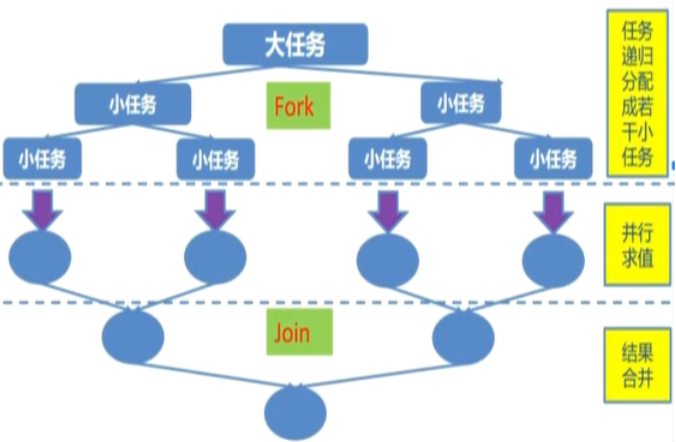
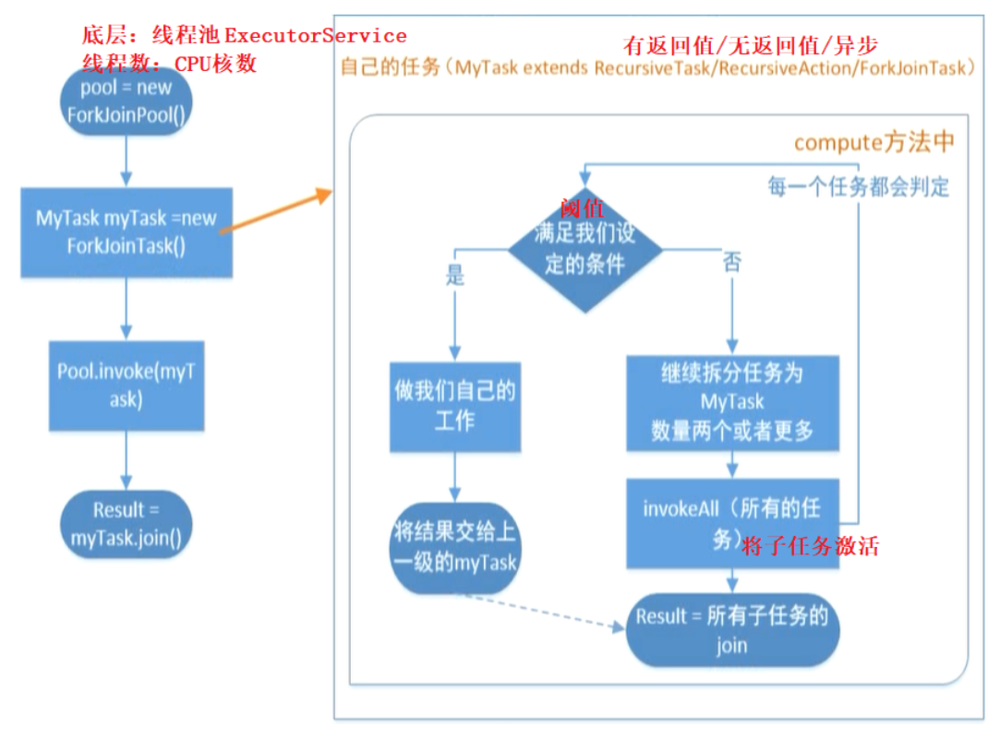
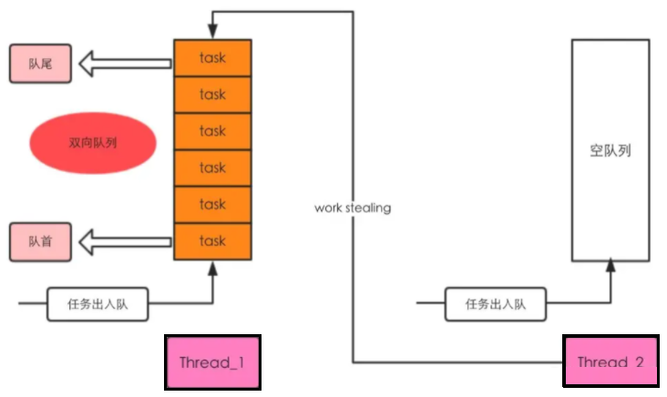

# 线程并发工具类

## 一、Fork-Join

### 1.什么是Fork-Join？

顾名思义，Fork - Join的核心思想就是**分而治之**，类似于大数据开发的MapReduce



### 2.使用流程



### 3.ForkJoinPool

ForkJoinPool有多个工作队列，当通过ForkJoinPool的`invoke`、`submit`、`execute`提交任务时会根据一定规则分配给不同的任务队列，并且**任务队列是双端队列**

为什么要使用双端队列呢？当然是为了**实现工作密取而不会发生任务争抢的情况**，当某个工作线程对应的消费任务队列空闲时，回去其他工作队列的队尾取任务过来分担(Stealing)，而其他队列的对头任务仍然提供给他的消费线程

> 多线程开发核心：快、充分利用资源、资源不能争抢



### 4.ForkJoinTask

顾名思义，这就是分治的任务，相当于平时使用的`Runnable`，核心方法是`fork`和`join`，`fork()`将某子任务发生给ForkJoin执行器，用来异步执行一个子任务，`join()`会阻塞当前线程，等待子任务结束并返回结果

`ForkJoinTask`有两个子类分别是`RecursiveAction`和`RecursiveTask`，两个子类都有抽象方法`compute`，差别在于`RecursiveAction`的没有返回值，而`RecursiveTask`有返回值

### 5.简单应用

需求：forkjoin方式在指定目录(含子目录)寻找指定后缀名的文件并打印

```java
public class ForkJoin_FindDirsFiles extends RecursiveAction {
    //当前任务需要搜寻的目录
    private File path;
    public ForkJoin_FindDirsFiles(File path) {this.path = path;}

    @Override //无返回值
    protected void compute() {
        //所有子任务保存在该列表中，一边一次性激活
        List<ForkJoin_FindDirsFiles> subTasks = new ArrayList<>();
        File[] files = path.listFiles();
        if (files != null) {
            for (File file : files) {
                //如果是文件夹，拆分成新子任务
                if (file.isDirectory()) {
                    ForkJoin_FindDirsFiles sonTask = new ForkJoin_FindDirsFiles(file);
                    subTasks.add(sonTask);
                } else {
                    //如果是文件，判断是不是需要找的文件
                    if (file.getAbsolutePath().endsWith("txt")) {
                        System.out.println("文件：" + file.getAbsolutePath());
                    }
                }
            }
            //子任务列表非空
            if (!subTasks.isEmpty()) {
                //调用invokeAll激活所有子任务
                for (ForkJoin_FindDirsFiles subTask : invokeAll(subTasks)) {
                    //join的目的：等待子任务完成
                    subTask.join();
                }
            }
        }
    }

    public static void main(String[] args) {
        long start = System.currentTimeMillis();
        try {
            //1.创建线程池
            ForkJoinPool pool = new ForkJoinPool();
            //2.产生第一个子任务
            ForkJoin_FindDirsFiles task = new ForkJoin_FindDirsFiles(new File("c:/"));

            //异步调用，没有返回值
            //pool.execute(task);
            //3.同步调用
            pool.invoke(task);
            System.out.println("任务运行中");
            
            //主线程睡
            Thread.sleep(1);
            int otherWork = 0;
            for (int i = 0; i < 100; i++) {
                otherWork = otherWork + 1;
            }
            System.out.println("主线程在完成其他工作，此工作结束" + otherWork);

            //阻塞式方法，主线程让步给task线程
            task.join();

            System.out.println("任务结束");
            System.out.println("耗时：" + (System.currentTimeMillis() - start));
        } catch (InterruptedException e) {
            e.printStackTrace();
        }
    }
}
```

## 二、CountDownLatch

### 1.什么是CountDownLatch？

CountDownLatch相当于线程计数器，一组线程等待，先完成其他工作后再执行这一组线程，相当于加强版的`join()`，**但解决`join()`不知道等待线程什么时候开始继续运行的问题**

CountDownLatch中包含`await`和`countDown`方法，`await()`使线程在此处阻塞，`countDown()`会使`new CountDownLatch(初始值)`中的初始值减1，当初始值减为0则在`await()`阻塞的线程将全部继续运行

### 2.简单应用

```java
//一组线程等待，模拟并发，使并发线程一起执行
public class CountDownLatch1 {
    public static void main(String[] args) throws InterruptedException {
        final CountDownLatch countDownLatch = new CountDownLatch(1);
        for (int i = 1; i <= 5; i++) {
            new Thread(() -> {
                try {
                    //循环创建的5个线程全部阻塞此处
                    String name = "[" + Thread.currentThread().getName() + "]";
                    System.out.println(name + "阻塞");
                    countDownLatch.await();
                    String str = "[" + Thread.currentThread().getName() + "]";
                    System.out.println(str + "开始执行");
                } catch (InterruptedException e) {
                    e.printStackTrace();
                }
            }).start();
        }
        //主线程睡眠
        Thread.sleep(2000);
        System.out.println("主线程在运行");
        //计数器减1，5个线程都运行
        countDownLatch.countDown();
    }
}
```

## 三、CyclicBarrier

### 1.什么是CyclicBarrier？

CyclicBarrier先当于回环栅栏，当线程达到阻塞数量时，放开栏杆，使所有阻塞的线程继续运行

CyclicBarrier只有`await`方法，当在`await()`处阻塞的线程数量达到`new CyclicBarrier(参与者数量)`中指定的参与者数量时，所有阻塞线程解除阻塞，CyclicBarrier还有一个构造函数，即`CyclicBarrier(参与者数量,Runnable)`，当栏杆开放时，参数2定义的任务会被执行一次

### 2.简单应用

```java
public class UseCyclicBarrier {
    //参数：参与线程数量(有这么多线程上来就结束屏障)
    //private static CyclicBarrier barrier = new CyclicBarrier(5);
    //屏障解开后执行另一个任务
    private static CyclicBarrier barrier = new CyclicBarrier(5, new CollectThread());

    public static void main(String[] args) {
        for (int i = 0; i <= 4; i++) {
            Thread thread = new Thread(new SubThread());
            thread.start();
        }
    }

    //屏蔽开放以后的工作
    private static class CollectThread implements Runnable {
        @Override
        public void run() {
            System.out.println("执行醒来后的另一个处理");
        }
    }

    //工作线程
    private static class SubThread implements Runnable {
        @Override
        public void run() {
            Random rd = new Random();
            try {
                if (rd.nextBoolean()) {//此处为了模拟线程到达的时间不是相同的
                    Thread.sleep(2000 + Thread.currentThread().getId());
                    System.out.println("Thread_" + Thread.currentThread().getId() + "睡眠两秒后开始");
                }
                
                System.out.println(Thread.currentThread().getId() + "开始等待");
                //当5个线程全部到达后开始运行
                barrier.await();

                System.out.println("屏障打开，当前Thread_" + Thread.currentThread().getId() + "完成其他业务逻辑");
            } catch (Exception e) {
                e.printStackTrace();
            }
        }
    }
}
```

## 四、Exchanger

### 1.什么是Exchanger？

Exchanger用于两个线程间交换数据，其中`exchange()`是阻塞式的，当其他线程没有调用该方法交换则一直阻塞，`exchange()`的返回值正是交换到的内容

### 2.简单应用

```java
//两个线程间数据交换
public class UseExchange {
    private static final Exchanger<Set<String>> EXCHANGER = new Exchanger<>();

    public static void main(String[] args) {
        new Thread(new Runnable() {
            @Override
            @SneakyThrows
            public void run() {
                //存放数据的容器
                Set<String> setA = new HashSet<>();
                setA.add("first线程1");
                setA.add("first线程2");
                //交换set,当另一个线程没有调用exchange时，程序在此处阻塞
                setA = EXCHANGER.exchange(setA);
                System.out.println("first阻塞式exchange");
                //交换后的数据
                System.out.println("first:" + setA);
            }
        }).start();

        new Thread(() -> {
            Set<String> setB = new HashSet<>();
            setB.add("second线程1");
            //setB.add("second线程2");
            try {
                setB = EXCHANGER.exchange(setB);
            } catch (InterruptedException e) {
                e.printStackTrace();
            }
            System.out.println("second阻塞式exchange");
            System.out.println("second:" + setB);
        }).start();
    }
}
```

## 五、Semaphore

### 1.什么是Semaphore？

Semaphore翻译成字面意思为信号量，用于**控制同时访问某资源的线程数量**，Semaphore 类中比较重要的几个方法如下

* `public void acquire()`：阻塞式获取一个许可
* `public void acquire(int permits)`：阻塞式获取permits个许可
* `public void release()`：释放许可，注意释放许可前必须先获得许可
* `public void release(int permits)`：释放permits个许可

以上四个方法均是阻塞式的，若想要立即得到执行结果，可使用以下几个方法

* `public boolean tryAcquire()`：尝试获取一个许可，若获取成功则立即返回`true`，若获取失败则立即返回`false`
* `public boolean tryAcquire(long timeout, TimeUnit unit)`：尝试获取一个许可，若在指定的时间内获取成功则立即返回`true`，否则则立即返回`false`
* `public boolean tryAcquire(int permits)`:尝试获取permits个许可，若获取成功则立即返回`true`，若获取失败则立即返回`false`
* `public boolean tryAcquire(int permits, long timeout, TimeUnit unit)`：尝试获取permits个许可，若在指定的时间内获取成功则立即返回`true`，否则则立即返回`false`


可通过`availablePermits()`获取可以许可数目

### 2.简单应用

#### 2.1.工人与机器

若工厂有5台机器，但是有8个工人，一台机器同时只能被一个工人使用，只有使用完其他工人才能继续使用，那么可通过Semaphore来实现

```java
int N = 8; //工人数
Semaphore semaphore = new Semaphore(5); //机器数目
for (int i = 0; i < N; i++)
	new Worker(i, semaphore).start();
}

static class Worker extends Thread {
    private int num;
    private Semaphore semaphore;

    public Worker(int num, Semaphore semaphore) {
        this.num = num;
        this.semaphore = semaphore;
    }

    @Override
    public void run() {
        try {
            semaphore.acquire();
            System.out.println("工人" + this.num + "占用一个机器在生产...");
            Thread.sleep(2000);
            System.out.println("工人" + this.num + "释放出机器");
            semaphore.release();
        } catch (InterruptedException e) {
            e.printStackTrace();
        }
    }
```

#### 2.2.限制DB连接数量

①**SqlConnectImpl**数据库连接实现，复制跑路，他不重要😀

```java
import java.sql.*;
import java.util.Map;
import java.util.Properties;
import java.util.concurrent.Executor;

public class SqlConnectImpl implements Connection {

    //获取数据库连接
    public static final Connection fetchConnection() {
        return new SqlConnectImpl();
    }

    @Override
    public Statement createStatement() throws SQLException {
        return null;
    }

    @Override
    public PreparedStatement prepareStatement(String sql) throws SQLException {
        return null;
    }

    @Override
    public CallableStatement prepareCall(String sql) throws SQLException {
        return null;
    }

    @Override
    public String nativeSQL(String sql) throws SQLException {
        return null;
    }

    @Override
    public void setAutoCommit(boolean autoCommit) throws SQLException {

    }

    @Override
    public boolean getAutoCommit() throws SQLException {
        return false;
    }

    @Override
    public void commit() throws SQLException {

    }

    @Override
    public void rollback() throws SQLException {

    }

    @Override
    public void close() throws SQLException {

    }

    @Override
    public boolean isClosed() throws SQLException {
        return false;
    }

    @Override
    public DatabaseMetaData getMetaData() throws SQLException {
        return null;
    }

    @Override
    public void setReadOnly(boolean readOnly) throws SQLException {

    }

    @Override
    public boolean isReadOnly() throws SQLException {
        return false;
    }

    @Override
    public void setCatalog(String catalog) throws SQLException {

    }

    @Override
    public String getCatalog() throws SQLException {
        return null;
    }

    @Override
    public void setTransactionIsolation(int level) throws SQLException {

    }

    @Override
    public int getTransactionIsolation() throws SQLException {
        return 0;
    }

    @Override
    public SQLWarning getWarnings() throws SQLException {
        return null;
    }

    @Override
    public void clearWarnings() throws SQLException {

    }

    @Override
    public Statement createStatement(int resultSetType, int resultSetConcurrency) throws SQLException {
        return null;
    }

    @Override
    public PreparedStatement prepareStatement(String sql, int resultSetType, int resultSetConcurrency) throws SQLException {
        return null;
    }

    @Override
    public CallableStatement prepareCall(String sql, int resultSetType, int resultSetConcurrency) throws SQLException {
        return null;
    }

    @Override
    public Map<String, Class<?>> getTypeMap() throws SQLException {
        return null;
    }

    @Override
    public void setTypeMap(Map<String, Class<?>> map) throws SQLException {

    }

    @Override
    public void setHoldability(int holdability) throws SQLException {

    }

    @Override
    public int getHoldability() throws SQLException {
        return 0;
    }

    @Override
    public Savepoint setSavepoint() throws SQLException {
        return null;
    }

    @Override
    public Savepoint setSavepoint(String name) throws SQLException {
        return null;
    }

    @Override
    public void rollback(Savepoint savepoint) throws SQLException {

    }

    @Override
    public void releaseSavepoint(Savepoint savepoint) throws SQLException {

    }

    @Override
    public Statement createStatement(int resultSetType, int resultSetConcurrency, int resultSetHoldability) throws SQLException {
        return null;
    }

    @Override
    public PreparedStatement prepareStatement(String sql, int resultSetType, int resultSetConcurrency, int resultSetHoldability) throws SQLException {
        return null;
    }

    @Override
    public CallableStatement prepareCall(String sql, int resultSetType, int resultSetConcurrency, int resultSetHoldability) throws SQLException {
        return null;
    }

    @Override
    public PreparedStatement prepareStatement(String sql, int autoGeneratedKeys) throws SQLException {
        return null;
    }

    @Override
    public PreparedStatement prepareStatement(String sql, int[] columnIndexes) throws SQLException {
        return null;
    }

    @Override
    public PreparedStatement prepareStatement(String sql, String[] columnNames) throws SQLException {
        return null;
    }

    @Override
    public Clob createClob() throws SQLException {
        return null;
    }

    @Override
    public Blob createBlob() throws SQLException {
        return null;
    }

    @Override
    public NClob createNClob() throws SQLException {
        return null;
    }

    @Override
    public SQLXML createSQLXML() throws SQLException {
        return null;
    }

    @Override
    public boolean isValid(int timeout) throws SQLException {
        return false;
    }

    @Override
    public void setClientInfo(String name, String value) throws SQLClientInfoException {

    }

    @Override
    public void setClientInfo(Properties properties) throws SQLClientInfoException {

    }

    @Override
    public String getClientInfo(String name) throws SQLException {
        return null;
    }

    @Override
    public Properties getClientInfo() throws SQLException {
        return null;
    }

    @Override
    public Array createArrayOf(String typeName, Object[] elements) throws SQLException {
        return null;
    }

    @Override
    public Struct createStruct(String typeName, Object[] attributes) throws SQLException {
        return null;
    }

    @Override
    public void setSchema(String schema) throws SQLException {

    }

    @Override
    public String getSchema() throws SQLException {
        return null;
    }

    @Override
    public void abort(Executor executor) throws SQLException {

    }

    @Override
    public void setNetworkTimeout(Executor executor, int milliseconds) throws SQLException {

    }

    @Override
    public int getNetworkTimeout() throws SQLException {
        return 0;
    }

    @Override
    public <T> T unwrap(Class<T> iface) throws SQLException {
        return null;
    }

    @Override
    public boolean isWrapperFor(Class<?> iface) throws SQLException {
        return false;
    }
}
```

②**DBPoolSemaphore**

```java
import java.sql.Connection;
import java.util.LinkedList;
import java.util.concurrent.Semaphore;

/**
 * Semaphore使用，数据库连接池的实现
 */
public class DBPoolSemaphore {
    //可用数据库连接只有10个(10个connection)
    private final static int POOL_SIZE = 10;

    //可用数据库连接数
    private final Semaphore useful;
    //不可用数据库连接数
    private final Semaphore useless;

    public DBPoolSemaphore() {
        //初始化
        this.useful = new Semaphore(POOL_SIZE);
        this.useless = new Semaphore(0);
    }

    //存储数据库连接的容器
    private static LinkedList<Connection> pool = new LinkedList<>();

    static {
        //创建10个connection存到容器池中
        for (int i = 0; i < POOL_SIZE; i++) {
            pool.addLast(SqlConnectImpl.fetchConnection());
        }
    }

    //从连接池获取链接
    public Connection takeConnect() throws InterruptedException {
        //可用连接数-1
        useful.acquire();
        Connection conn;
        synchronized (pool) {
            //连接池中删除一个连接
            conn = pool.removeFirst();
        }
        //不可用连接数+1
        useless.release();
        return conn;
    }

    //归还连接
    public void returnConnect(Connection conn) throws InterruptedException {
        if (conn != null) {
            System.out.println("等待线程数：" + useful.getQueueLength() + "    可用连接数：" + useful.availablePermits());
            //不可用连接数-1
            useless.acquire();
            synchronized (pool) {
                //将连接数添加回来
                pool.addLast(conn);
            }
            //可用连接数+1
            useful.release();
        }
    }
}
```

③**Test**

```java
import lombok.SneakyThrows;
import java.sql.Connection;
import java.util.Random;

public class Test {
    private static DBPoolSemaphore dbPool = new DBPoolSemaphore();

    //业务线程
    private static class TestThread extends Thread {
        @SneakyThrows
        @Override
        public void run() {
            //使每个线程的连接时间不同
            Random random = new Random();
            long start = System.currentTimeMillis();

            //从连接池拿连接
            Connection conn = dbPool.takeConnect();
            System.out.println("thread_" + Thread.currentThread().getId() + "获取数据库连接耗时：" + (System.currentTimeMillis() - start));

            //模拟业务操作(线程持有连接进行查询操作消耗一定时间)
            Thread.sleep(100 + random.nextInt(100));

            //业务处理完毕，归还连接
            dbPool.returnConnect(conn);
        }
    }

    public static void main(String[] args) {
        //创建50个请求线程
        for (int i = 0; i < 50; i++) {
            Thread thread = new TestThread();
            thread.start();
        }
    }
}
```


