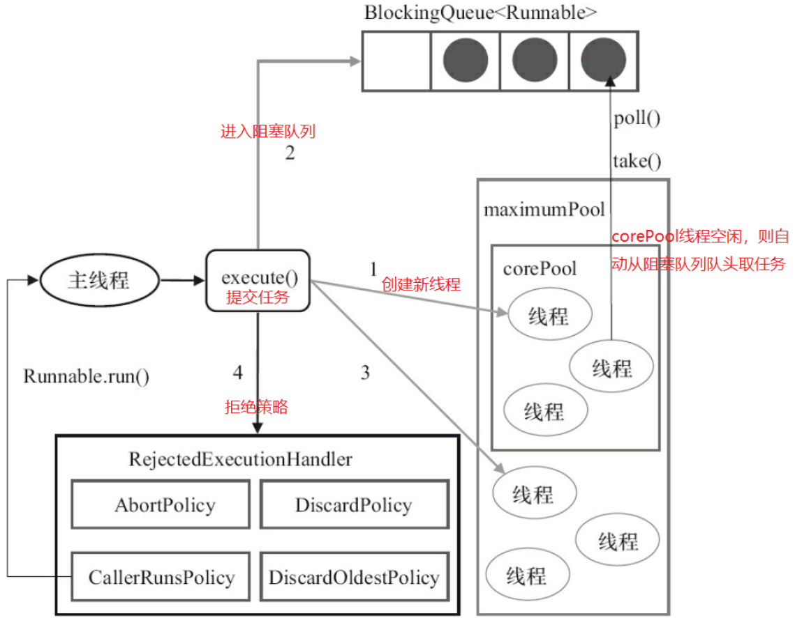
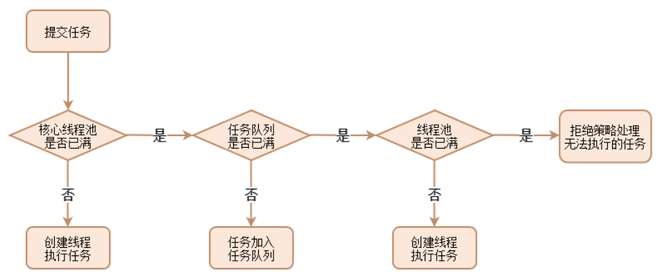
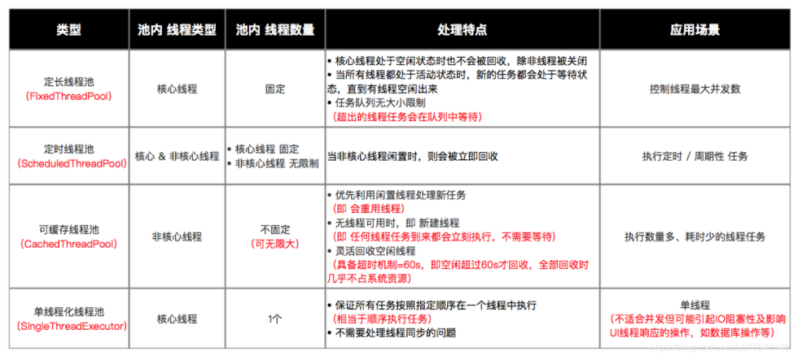

# 线程池

## 一、什么是线程池？

顾名思义就是管理线程的池子，可以容纳多个线程，其中的线程可以反复使用，线程池有什么优点？

* 重复利用已创建的线程降低线程创建和销毁造成的消耗
* 当任务到达时，任务可以不需要等到线程创建就能立即执行
* 线程实际会消耗空间，导致内存溢出，虚拟机内存耗尽，所以不限制线程创建数量肯定不行，所以可使用线程池管理线程

## 二、自定义简单线程池

### 1.实现原理

创建固定线程保存到线程工作数组，用户提交任务到阻塞队列，线程不断循环从阻塞队列中头部取任务运行

### 2.代码实现

```java
public class MyThreadPool {
    //默认线程数
    private static int WORK_NUM = 5;
    //默认任务数
    private static int TASK_NUM = 100;

    //工作线程组  数量WORK_NUM
    private WorkThread[] workThreads;
    //阻塞队列  数量TASK_NUM
    private BlockingQueue<Runnable> workQueue;

    private class WorkThread extends Thread {
        @Override
        public void run() {
            Runnable runnable = null;
            try {
                //只要未打断就不断循环
                while (!isInterrupted()) {
                    //未被打断--从阻塞队列头取一个任务
                    runnable = workQueue.take();
                    if (runnable != null) {
                        System.out.println("准备运行：" + runnable);
                        runnable.run();
                    }
                    //帮助垃圾回收(垃圾回收只对空引用)
                    runnable = null;
                }
            } catch (Exception e) {
                e.printStackTrace();
            }
        }
    }

    //用户希望的启动线程数
    private int user_num;

    //创建默认线程数量的线程池
    public MyThreadPool() {
        this(WORK_NUM, TASK_NUM);
    }

    public MyThreadPool(int work_num, int task_num) {
        if (work_num <= 0) work_num = WORK_NUM;
        if (task_num <= 0) task_num = TASK_NUM;
        this.user_num = work_num;
        //构造阻塞队列
        workQueue = new ArrayBlockingQueue<>(task_num);
        workThreads = new WorkThread[work_num];
        //启动工作队列中所有的线程
        for (int i = 0; i < work_num; i++) {
            workThreads[i] = new WorkThread();
            workThreads[i].start();
        }
    }

    //执行任务，将任务加入阻塞队列，何时执行任务由线程管理器决定
    public void executor(Runnable task) throws InterruptedException {
        //这里是简化版，实际还有判断阻塞队列是否满
        workQueue.put(task);
    }

    //销毁线程池，保证所有任务完成才销毁
    public void destroy() {
        System.out.println("准备关闭线程池");
        for (int i = 0; i < user_num; i++) {
            workThreads[i].stop();//stopWorker
            workThreads[i] = null;
        }
        //清空任务队列
        workQueue.clear();
    }
}
```

## 三、线程池工作流程

### 1.图解



### 2.流程描述

当任务被提交时，先判断核心线程池是否已满，若未满则直接在核心线程池内创建线程执行任务，若已满则继续判断工作队列是否已满，若工作队列未满则任务加入工作队列，若已满则继续判断线程池内线程数量是否达到最大线程数，若未达到则创建新线程执行任务，若已满则执行拒绝策略



## 四、手工创建线程池

### 1.ThreadPoolExecutor

线程池的真正实现类是`ThreadPoolExecutor`，其构造方法有如下4种

```java
public ThreadPoolExecutor(int corePoolSize,
                          int maximumPoolSize,
                          long keepAliveTime,
                          TimeUnit unit,
                          BlockingQueue<Runnable> workQueue) {
    this(corePoolSize, maximumPoolSize, keepAliveTime, unit, workQueue,
         Executors.defaultThreadFactory(), defaultHandler);
}
 
public ThreadPoolExecutor(int corePoolSize,
                          int maximumPoolSize,
                          long keepAliveTime,
                          TimeUnit unit,
                          BlockingQueue<Runnable> workQueue,
                          ThreadFactory threadFactory) {
    this(corePoolSize, maximumPoolSize, keepAliveTime, unit, workQueue,
         threadFactory, defaultHandler);
}
 
public ThreadPoolExecutor(int corePoolSize,
                          int maximumPoolSize,
                          long keepAliveTime,
                          TimeUnit unit,
                          BlockingQueue<Runnable> workQueue,
                          RejectedExecutionHandler handler) {
    this(corePoolSize, maximumPoolSize, keepAliveTime, unit, workQueue,
         Executors.defaultThreadFactory(), handler);
}
 
public ThreadPoolExecutor(int corePoolSize,
                          int maximumPoolSize,
                          long keepAliveTime,
                          TimeUnit unit,
                          BlockingQueue<Runnable> workQueue,
                          ThreadFactory threadFactory,
                          RejectedExecutionHandler handler) {
    if (corePoolSize < 0 ||
        maximumPoolSize <= 0 ||
        maximumPoolSize < corePoolSize ||
        keepAliveTime < 0)
        throw new IllegalArgumentException();
    if (workQueue == null || threadFactory == null || handler == null)
        throw new NullPointerException();
    this.corePoolSize = corePoolSize;
    this.maximumPoolSize = maximumPoolSize;
    this.workQueue = workQueue;
    this.keepAliveTime = unit.toNanos(keepAliveTime);
    this.threadFactory = threadFactory;
    this.handler = handler;
}
```

### 2.线程池主要参数

#### 2.1.核心线程数 - corePoolSize

当一个任务提交到线程池，若`当前线程数 < corePoolSize`则创建新线程运行该任务，若`当前线程数 = corePoolSize`则该任务被保存到`BlockingQueue`

调用`prestartAllCoreThreads()`将一次性启动`corePoolSize`个线程

默认情况下，核心线程数将一直存活，当`allowCoreThreadTimeout`设置为`true`时，核心线程也会超时回收

#### 2.2.最大线程数 - maximumPoolSize

线程池所能容纳的最大线程数，当一个任务提交到线程池，若此时`corePoolSize`满且`BlockingQueue`也满，且`当前线程数<maximumPoolSize`，则会再次创建新线程

#### 2.3.空闲时间 - keepAliveTime

线程空闲下来后的存活时间，若空闲时间过长，则非核心线程将被回收，即空闲时间对于`corePoolSize<当前线程数<maximumPoolSize`时才有用，但`allowCoreThreadTimeout`设置为`true`时，核心线程也会超时回收

#### 2.4.空闲时间单位 - TimeUnit

指定空闲时间的单位，常用的有`TimeUnit.MILLISECONDS`、`TimeUnit.SECONDS`、`TimeUnit.MINUTES`

#### 2.5.任务队列 - workQueue

通过线程池的`execute()`提交的`Runnable`对象将存于任务队列中，该任务队列有如下几种

* **ArrayBlockingQueue**：基于数组的有界阻塞队列
* **LinkedBlockingQuene**：基于链表的有界阻塞队列，未指定参数时容量默认为`Integer.MAX_VALUE`
* **PriorityBlockingQueue**：支持优先级的无界阻塞队列，即按照优先级取队列，和时间没有关系，实现`Comparable`接口也可以提供`Comparator`来对队列中的元素进行比较
* **SynchronousQuene**：不缓存任务的阻塞队列
* **DelayQueue**：类似于PriorityBlockingQueue，是**二叉堆实现的无界优先级阻塞队列**，要求元素都实现`Delayed`接口，通过执行时延从队列中提取任务，时间没到任务取不出来
* **LinkedBlockingDeque**：使用**双向队列实现的有界双端阻塞队列**

#### 2.6.线程工厂 - threadFactory

线程工厂用于指定为该线程池创建新线程的方式，该参数非必须，Executors框架为我们实现了一个默认的线程工厂，源码如下

```java
/**
 * The default thread factory.
 */
private static class DefaultThreadFactory implements ThreadFactory {
    private static final AtomicInteger poolNumber = new AtomicInteger(1);
    private final ThreadGroup group;
    private final AtomicInteger threadNumber = new AtomicInteger(1);
    private final String namePrefix;
 
    DefaultThreadFactory() {
        SecurityManager s = System.getSecurityManager();
        group = (s != null) ? s.getThreadGroup() :
                              Thread.currentThread().getThreadGroup();
        namePrefix = "pool-" +
                      poolNumber.getAndIncrement() +
                     "-thread-";
    }
 
    public Thread newThread(Runnable r) {
        Thread t = new Thread(group, r,
                              namePrefix + threadNumber.getAndIncrement(),
                              0);
        if (t.isDaemon())
            t.setDaemon(false);
        if (t.getPriority() != Thread.NORM_PRIORITY)
            t.setPriority(Thread.NORM_PRIORITY);
        return t;
    }
}
```

#### 2.7.拒绝策略 - handler

拒绝策略又叫饱和策略，当`maximumPoolSize`与`workQueue`都满则执行，有如下几种类型

* **AbortPolicy(默认)：**丢弃任务并抛出`RejectedExecutionException `异常
* **CallerRunsPolicy**：用调用者所在的线程来执行任务
* **DiscardPolicy**：直接丢弃当前任务，但不抛出异常
* **DiscardOldestPolicy**：丢弃阻塞队列中最老的任务，队列里最靠前的任务最老
* **自定义拒绝策略**：实现RejectedExecutionHandler接口

### 3.线程池常见方法

```java
//1.创建线程池
ThreadPoolExecutor threadPool = new ThreadPoolExecutor(CORE_POOL_SIZE,
                                             MAXIMUM_POOL_SIZE,
                                             KEEP_ALIVE,
                                             TimeUnit.SECONDS,
                                             sPoolWorkQueue,
                                             sThreadFactory);
//2.向线程池提交任务
void execute(Runnable command);//不需要返回
Future<T> submit(Callable<T> task);//提交任务，通过Future中get()获取任务执行结果
List<Future<T>> invokeAll(Collection<Callable> tasks);//提交集合中所有任务
List<Future<T>> invokeAll(Collection<Callable> tasks,long timeout,TimeUnit unit);//提交集合中所有任务，并指定超时时间
T invokeAny(Collection<Callable> tasks);//提交集合中所有任务，返回最先执行完的任务结果，其它任务取消
T invokeAny(Collection<Callable> tasks,long timeout,TimeUnit unit);//带超时时间

//3.关闭线程池
threadPool.shutdown();//设置线程池的状态为SHUTDOWN，然后中断所有没有正在执行任务的线程
	//执行流程
	//1>.停止接收外部submit()任务
	//2>.内部正在运行任务的线程和等待的任务会运行完
	//3>.第2步后才真正开始停止
threadPool.shutdownNow();//设置线程池的状态为STOP，然后尝试停止所有的正在执行或暂停任务的线程，并返回等待执行任务的列表
	//执行流程
	//1>.停止接收外部submit()任务
	//2>.忽略等待队列中的任务
	//3>.尝试将内部正在运行任务的线程中断
	//4>.返回未执行的任务列表
```

### 4.创建线程池的完整流程

```java
public class t4_pool {
    public static void main(String[] args) {
        //核心线程池的大小，即最开始线程大小，不够则扩充到max
        int corePoolSize = 2;
        //核心线程池的最大线程数
        int maxPoolSize = 4;
        //线程最大空闲时间，即10unit没有用就回收
        long keepAliveTime = 10;
        //时间单位
        TimeUnit unit = TimeUnit.SECONDS;
        //阻塞队列，容量为2，最多允许放入两个空闲任务
        //该线程最做允许6个任务4+2
        BlockingQueue<Runnable> workQueue = new ArrayBlockingQueue<>(2);
        
        //线程创建工厂
        ThreadFactory threadFactory = new NameThreadFactory();
        //线程池拒绝策略----任务太多,阻塞队列都存不下
        RejectedExecutionHandler handler = new MyIgnorePolicy();
        
        ThreadPoolExecutor executor = null;
        try {
            //1.推荐的创建线程池的方式如下，不推荐使用现成的API创建线程池
            executor = new ThreadPoolExecutor(corePoolSize, maxPoolSize, keepAliveTime, unit, workQueue, threadFactory, handler);
            //2.预启动所有核心线程，提升效率
            executor.prestartAllCoreThreads();
            //任务数量
            int count = 10;
            for (int i = 0; i <= count; i++) {
                RunnableTask task = new RunnableTask(String.valueOf(i));
                //3.提交任务到线程池   还有4个任务无法执行
                executor.submit(task);
            }
        } finally {
            //断言  可开关   -ea   -da
            assert executor != null;
            //4.关闭线程池
            executor.shutdown();
        }
    }

    //线程工厂
    static class NameThreadFactory implements ThreadFactory {
        //AtomicInteger原子类(整体)：保证复制，更新，复写回的过程是一个整体(并发编程),保证线程安全
        //123线程使用线程池时变量要依次添加，而不是一个新线程调用时又从0开始
        private final AtomicInteger threadId = new AtomicInteger(1);

        @Override
        public Thread newThread(Runnable r) {
            Thread t = new Thread(r, "线程--" + threadId.getAndIncrement());//相当于i++
            System.out.println(t.getName() + "已被创建");
            return t;
        }
    }

    //线程池拒绝策略
    public static class MyIgnorePolicy implements RejectedExecutionHandler {
        @Override //被拒绝的对象,线程池对象
        public void rejectedExecution(Runnable r, ThreadPoolExecutor executor) {
            doLog(r, executor);
        }

        private void doLog(Runnable runnable, ThreadPoolExecutor e) {
            //可以做日志记录等
            System.out.println("线程池：" + e.toString() + runnable.toString() + "被拒绝执行");
        }
    }

    //任务类
    static class RunnableTask implements Runnable {
        private String name;
        public RunnableTask(String name) {
            this.name = name;
        }

        @Override
        public void run() {
            try {
                System.out.println(this.toString() + "  is running!");
                Thread.sleep(3000);//让任务慢点执行
            } catch (InterruptedException e) {
                e.printStackTrace();
            }
        }
 
        @Override
        public String toString() {
            return "RunnableTask{name='" + name + "\'}";
        }
    }
}
```

## 五、常见功能线程池

### 1.为什么需要功能线程池？

其实这就相当于一个工具线程池，使用以上全手工创建线程池的方式太麻烦，Executors已经为我们封装好4种功能线程类

### 2.定长线程池FixedThreadPool

其中`corePoolSize=maximumPoolSize`，所以所有线程都是核心线程池，线程数量固定，执行完立即回收，工作队列使用的是基于链表的有界队列`LinkedBlockingQuene`，应用于**控制线程最大并发数**，`newFixedThreadPool()`的源码如下

```java
public static ExecutorService newFixedThreadPool(int nThreads) {
    return new ThreadPoolExecutor(nThreads, nThreads,
                                  0L, TimeUnit.MILLISECONDS,
                                  new LinkedBlockingQueue<Runnable>());
}
public static ExecutorService newFixedThreadPool(int nThreads, ThreadFactory threadFactory) {
    return new ThreadPoolExecutor(nThreads, nThreads,
                                  0L, TimeUnit.MILLISECONDS,
                                  new LinkedBlockingQueue<Runnable>(),
                                  threadFactory);
}
```

简单的使用示例

```java
//1.创建定长线程池对象 & 设置线程池线程数量固定为3
ExecutorService fixedThreadPool = Executors.newFixedThreadPool(3);
//2.创建好Runnable类线程对象 & 需执行的任务
Runnable task =new Runnable(){
  public void run() {
     System.out.println("执行任务啦");
  }
};
//3.向线程池提交任务
fixedThreadPool.execute(task);
```

### 3.定时线程池ScheduledThreadPool

其中`corePoolSize`大小固定，`maximumPoolSize`数量无限，最大空闲时间为10ms，工作队列使用的是基于二叉堆实现的无界优先级阻塞队列`DelayQueue`，应用于**执行定时或周期性的任务**，`newScheduledThreadPool()`的源码如下

```java
private static final long DEFAULT_KEEPALIVE_MILLIS = 10L;
 
public static ScheduledExecutorService newScheduledThreadPool(int corePoolSize) {
    return new ScheduledThreadPoolExecutor(corePoolSize);
}
public ScheduledThreadPoolExecutor(int corePoolSize) {
    super(corePoolSize, Integer.MAX_VALUE,
          DEFAULT_KEEPALIVE_MILLIS, MILLISECONDS,
          new DelayedWorkQueue());
}
 
public static ScheduledExecutorService newScheduledThreadPool(
        int corePoolSize, ThreadFactory threadFactory) {
    return new ScheduledThreadPoolExecutor(corePoolSize, threadFactory);
}
public ScheduledThreadPoolExecutor(int corePoolSize,
                                   ThreadFactory threadFactory) {
    super(corePoolSize, Integer.MAX_VALUE,
          DEFAULT_KEEPALIVE_MILLIS, MILLISECONDS,
          new DelayedWorkQueue(), threadFactory);
}
```

简单的使用示例

```java
//1.创建定时线程池对象 & 设置线程池线程数量固定为5
ScheduledExecutorService scheduledThreadPool = Executors.newScheduledThreadPool(5);
//2.创建好Runnable类线程对象 & 需执行的任务
Runnable task =new Runnable(){
  public void run() {
     System.out.println("执行任务啦");
  }
};
//3.向线程池提交任务
scheduledThreadPool.schedule(task, 1, TimeUnit.SECONDS);//延迟1s后执行任务
scheduledThreadPool.scheduleAtFixedRate(task,10,1000,TimeUnit.MILLISECONDS);//延迟10ms后、每隔1000ms执行任务
```

定时线程池中的**异常处理**需要特别注意，建议`catch`处理

* **抛出异常不处理(throw)**：定时任务只会被执行一次，抛出的异常被Executor框架捕获，程序无法继续执行
* **抛出异常并捕获(catch)**：定时任务的异常被捕获后，定时任务会继续执行

### 4.可缓存线程池CachedThreadPool

其中无核心线程，`maximumPoolSize`数量无限，最大空闲时间为60ms，工作队列使用的是不缓存任务的阻塞队列`SynchronousQuene`，应用于**执行大量、耗时少的任务**，`newCachedThreadPool()`的源码如下

```java
public static ExecutorService newCachedThreadPool() {
    return new ThreadPoolExecutor(0, Integer.MAX_VALUE,
                                  60L, TimeUnit.SECONDS,
                                  new SynchronousQueue<Runnable>());
}
public static ExecutorService newCachedThreadPool(ThreadFactory threadFactory) {
    return new ThreadPoolExecutor(0, Integer.MAX_VALUE,
                                  60L, TimeUnit.SECONDS,
                                  new SynchronousQueue<Runnable>(),
                                  threadFactory);
}
```

简单的使用示例

```java
//1.创建可缓存线程池对象
ExecutorService cachedThreadPool = Executors.newCachedThreadPool();
//2.创建好Runnable类线程对象 & 需执行的任务
Runnable task =new Runnable(){
  public void run() {
     System.out.println("执行任务啦");
  }
};
//3.向线程池提交任务
cachedThreadPool.execute(task);
```

### 5.单线程化线程池SingleThreadExecutor

其中`corePoolSize=1`，`maximumPoolSize`数量为0，执行完立即回收，工作队列使用的是基于链表的有界队列`LinkedBlockingQuene`z，不适合并发但可能引起IO阻塞性及影响UI线程响应的操作，如数据库操作、文件操作等，`newCachedThreadPool()`的源码如下

```java
public static ExecutorService newSingleThreadExecutor() {
    return new FinalizableDelegatedExecutorService
        (new ThreadPoolExecutor(1, 1,
                                0L, TimeUnit.MILLISECONDS,
                                new LinkedBlockingQueue<Runnable>()));
}
public static ExecutorService newSingleThreadExecutor(ThreadFactory threadFactory) {
    return new FinalizableDelegatedExecutorService
        (new ThreadPoolExecutor(1, 1,
                                0L, TimeUnit.MILLISECONDS,
                                new LinkedBlockingQueue<Runnable>(),
                                threadFactory));
}
```

简单的使用示例

```java
//1.创建单线程化线程池
ExecutorService singleThreadExecutor = Executors.newSingleThreadExecutor();
//2.创建好Runnable类线程对象 & 需执行的任务
Runnable task =new Runnable(){
  public void run() {
     System.out.println("执行任务啦");
  }
};
//3.向线程池提交任务
singleThreadExecutor.execute(task);
```

### 6.小结

Executors的4个功能线程池虽然方便，但现在已经不建议使用了，而是建议直接通过使用ThreadPoolExecutor的方式，这样的处理方式让写的同学更加明确线程池的运行规则，规避资源耗尽的风险

* **FixedThreadPool 和 SingleThreadExecutor**：主要问题是堆积的请求处理队列均采用LinkedBlockingQueue可能会耗费非常大的内存，甚至OOM
* **CachedThreadPool 和 ScheduledThreadPool**：主要问题是线程数最大数是Integer.MAX_VALUE，可能会创建数量非常多的线程，甚至OOM



## 六、合理配置线程池

一般计算公式：`线程数 = n / (1 + w/e)`，其中n表示CPU核数，w表示阻塞耗时，e表示计算耗时

### 1.计算密集型

计算过程CPU参与密切，假设没有等待时间，即`w=0`，即`w/e = 0`，推荐`线程数 = n + 1`，其中多一个为了防止线程偶发的缺页中断

### 2.IO密集型

IO过程中CPU是空闲的，所以`w/e > 1`，但还需要考虑内存上线，因为线程是占用内存的，基于线程数尽量大，同时考虑内存的原则，推荐`线程数 = n*2 + 1`

### 3.估算公式

服务性能IO优化估算公式：`最佳线程数目 = ((线程IO时间 + 线程CPU时间) / 线程CPU时间) x CPU数量`

估算公式进一步转化：`最佳线程数目 = (线程IO时间 / 线程CPU时间 + 1）x 线程数`

## 七、线程池优化

首先**使用自定义线程池ThreadPoolExecutor**，可以明确线程池的运行规则，规避资源耗尽的风险

其次选择核心线程数，若任务需频繁使用，则可保留一个或多个核心线程，因为核心线程不容易被销毁，若任务使用一个都不再使用，如某任务一天一次，则核心线程数可设置为0

其次选择最大线程数，可通过以上合理配置线程池规则来进行配置，推荐`2*n + 1`，n是CPU核数

其次选择阻塞队列，若任务数小则可使用无界队列，若任务数较大则推荐使用有界队列，防止OOM

其次选择拒绝策略，根据任务特点选择就好


> [参考文章](https://blog.csdn.net/sinat_40770656/article/details/121370427)


