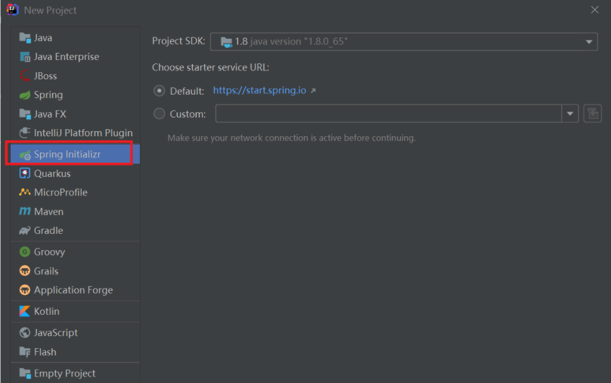
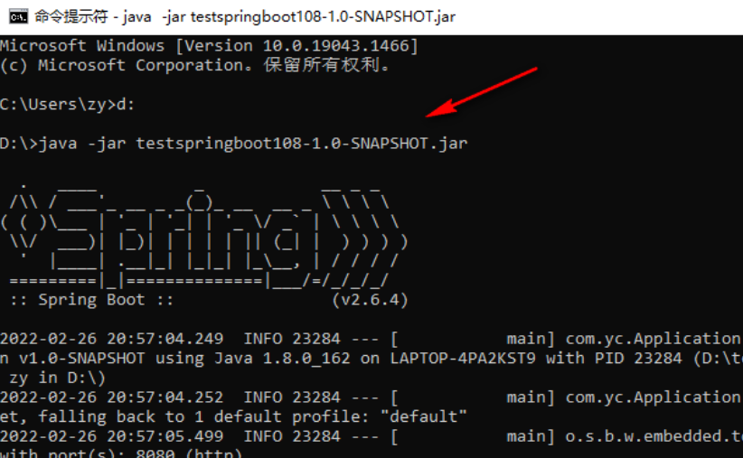
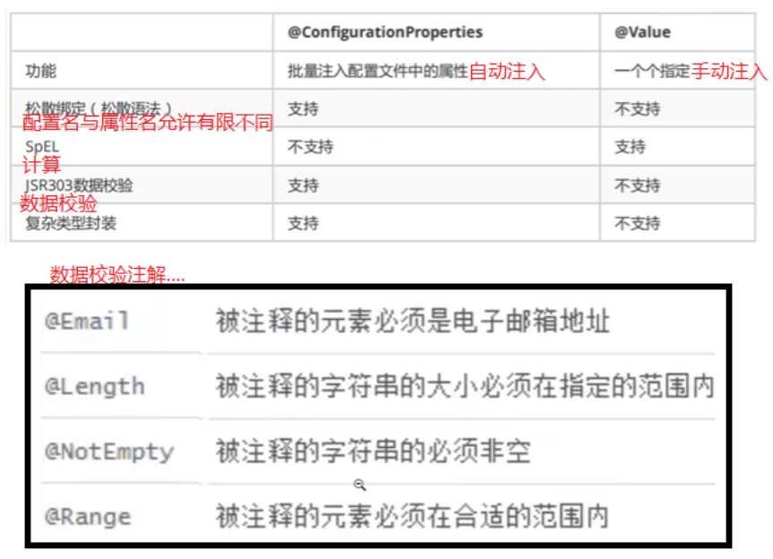

# SpringBoot

## 一、为什么出现SpringBoot？

原来有繁琐的配置信息需要整合，SpringBoot则**约定配置，去繁从简**，重点在于自动装配原理

## 二、HelloSpringBoot

### 1.自动化工具



### 2.pom.xml

```java
<!--父依赖，依赖第三方jar包的版本-->
<parent>
    <groupId>org.springframework.boot</groupId>
    <artifactId>spring-boot-starter-parent</artifactId>
    <version>2.6.4</version><!--springboot依赖的包的版本-->
</parent>

<dependencies>
    <!--springboot-web项目-->
    <dependency>
        <groupId>org.springframework.boot</groupId>
        <artifactId>spring-boot-starter-web</artifactId>
    </dependency>
</dependencies>
```

### 3.配置入口类

```java
@SpringBootApplication//配置类，也可以另外写，也可以用@Import
public class Application {
    public static void main(String[] args) {
        //启动springboot，args命令行参数,会扫描同级目录的内容
        SpringApplication.run(Application.class, args);
    }
}
```

### 4.控制类

```java
@Controller//restful api  
//1.请求方式多 get post head delete...
//2.请求响应的数据都当成json
public class Hello {

    //springmvc注解
    @RequestMapping("/")//请求映射
    //斜杠代表网站的根目录,请求地址http://localhost:8080 
    @ResponseBody//文本注解：当成文本数据，否则认为是页面的名字
    public String sayHello() {
        return "hello";
    }
}
```

```java
@RestController//相当于@Controller+@ResponseBody
public class Bye {
    @RequestMapping(method = {RequestMethod.GET, RequestMethod.POST}, value = {"/bye", "/gun"})
    public Map<String, Object> bye(String name, int age, HttpSession session) {
    	//写参数就可以自动注入请求参数***
        System.out.println(session.getId());
        Map<String, Object> map = new HashMap<>();
        map.put("code", 1);
        Student student = new Student();
        student.setName(name);
        student.setAge(age);
        map.put("obj", student);
        return map;
    }

    @GetMapping("/byeGet")
    //只有get方法可以访问到
    public String byeGet() {
        return "byeGet";
    }
}
```

### 5.项目发布

①pom.xml

```java
<build>
	 <plugins>
	       <plugin>
	           <groupId>org.springframework.boot</groupId>
	           <artifactId>spring-boot-starter-parent</artifactId>
	       </plugin>
	   </plugins>
</build>
```

②package




##  三、配置

### 1.YAML配置文件

#### 1.1.什么是YAML？

YAML是高级的Json支持，Spring启动类支持YAML作为可选的属性配置文件

> YAML是层级结构，而properties是平级结构

#### 1.2.基础语法

缩进使用空格，表示层级关系，其实空格数不重要，同层的配置左对齐即可，大小写敏感

#### 1.3.数据结构

**对象**：键值对形式

* 行内格式：`object: {key1: value1,key2: value2}`

* 行外格式

  ```java
  object:
   key1: value1
   key2: value2
  ```

**数组**

* 行内格式：`arrays: [value1,value2]`

* 行外格式

  ```java
  arrays:
   value1
   value2
  ```

**字面量**：不可再分的值，字符串默认不加`""，''`

* `""`：不会转义特殊字符，即`\n`会换行
* `''`：会转义特殊字符，即`\n`被当成普通字符

**多文档**：一个`yml`内可包含多个配置文档，使用`-----`隔开即可

### 2.配置注解

#### 2.1.@ConfigurationProperties

自动导入默认配置文件**application.yml或application.properties**

①实体类

```java
@Component
@Data
@ConfigurationProperties(prefix = "product")
public class Product {
    private String pname;
    private Double price;
    private Boolean isUsed;//两个单词一般用-分割
    private Date manDate;
    private List<String> types;//相当数组
    private Map<String, String> attributes;//相当对象
    private Address address;//相当对象
}
```

②application.yml

```java
product:
  pname: apple${random.int(12)}//随机生成值
  price: 3000
  is-used: true
  man-date: 2022/03/06
  type:
    - 消费手机${product.pname}//引用前面已经出现过的值
    - 手机
    - 移动设备
  attributes: {'color': 'white','com-type': '5G'}
  address:
    province: 湖南省
    city: 长沙
```

③application.properties

```java
product.pname=apple
product.price=3000
product.is-used=true
product.man-date=2022/03/06
product.type=消费手机,手机,移动设备
product.attributes.color=white
product.attributes.com-type=5G
product.address.province=湖南省
product.address.city=长沙
```

#### 2.2.@PropertySource

`@Configuration+@PropertySource+@Value`配合使用，导入自定义的`properties`配置文件

①实体类

```java
@Configuration
@PropertySource(value = "classpath:db.properties")
public class DbCon{
    @Value("${db.driver_name}")
    private String driver_name;
    @Value("${db.url}")
    private String url;
    @Value("${db.username}")
    private String username;
    @Value("${db.password}")
    private String password;
}
```

②db.properties

```java
db.driver_name=oracle.jdbc.driver.OracleDriver
db.url=jdbc:oracle:thin:@//localhost:1521/orcl
db.username=scott
db.password=a
```

#### 2.3.@ConfigurationProperties与@Value区别



#### 2.4.@ImportResource

导入外部传统的Spring的XML文件，区分@Import用于引入外部配置类

- ****

- 区分(引入外部配置类)

- @SpringBootApplication只能扫描到同级或子级的配置类

- 实现类