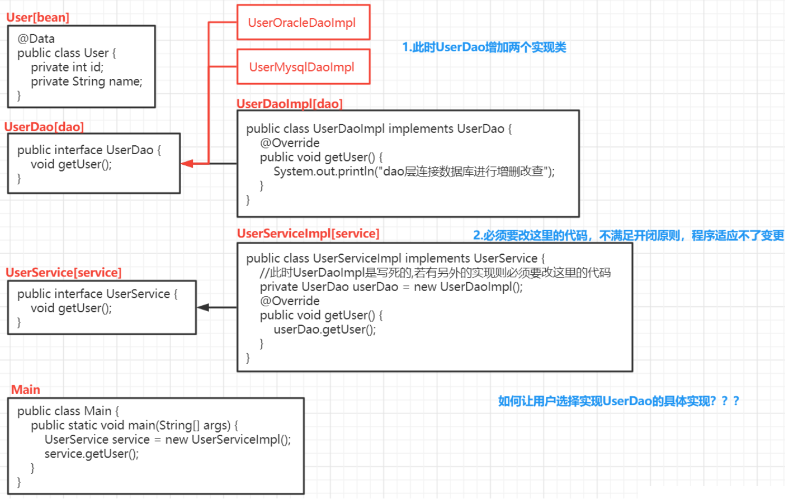
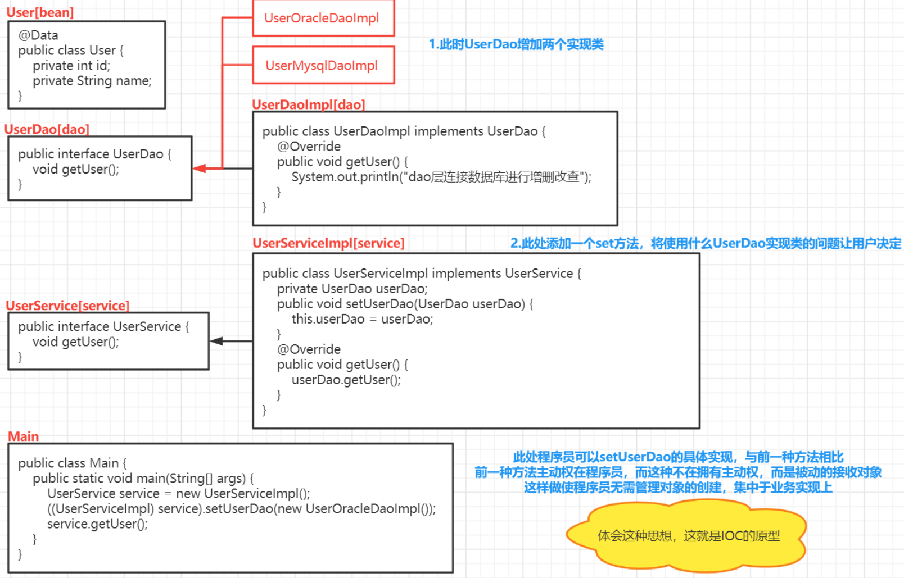
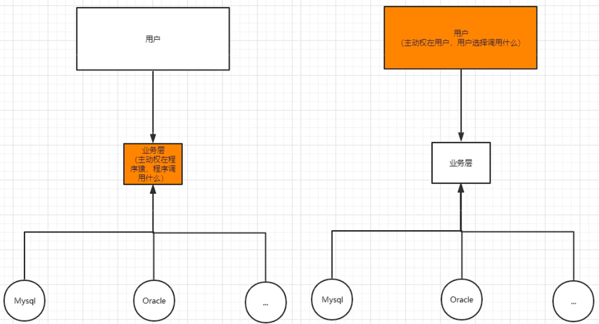
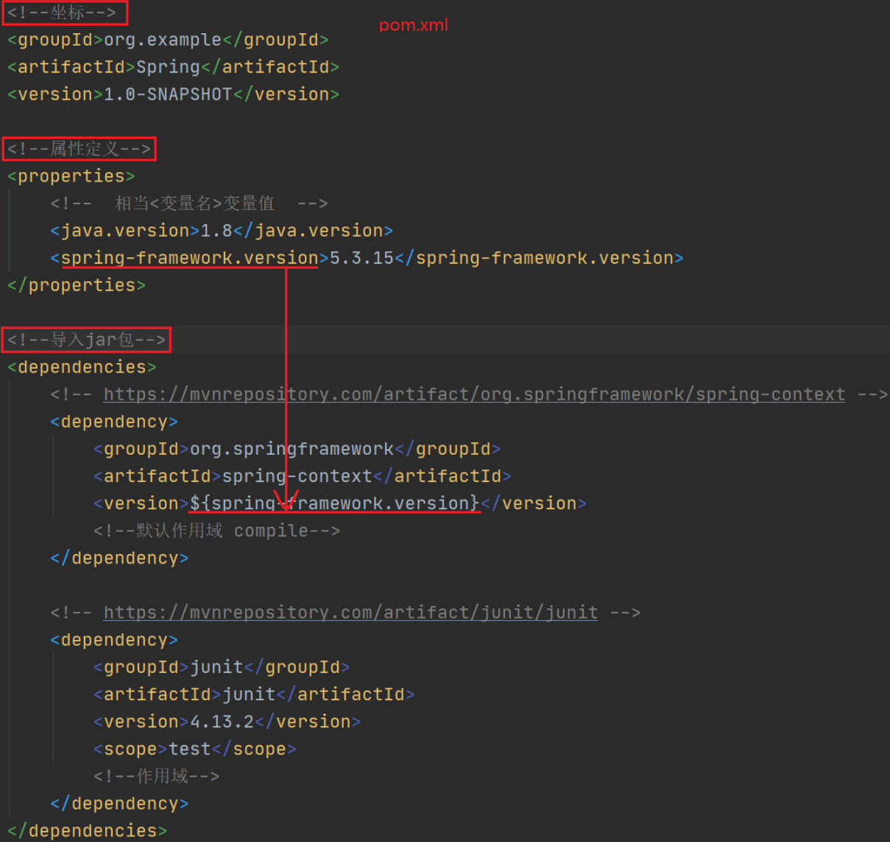

# SpringFramework

## 一、SpringFramework概述

### 1.什么是SpringFramework？

Spring框架一般指的都是SpringFramework，SpringFramework是很多模块的集合，是**轻量级**Java开发框架，**目的是提高开发人员的开发效率和系统的可维护性，其核心思想是不造重复的轮子，开箱即用！核心功能是IOC、DI、AOP**

### 2.为什么会出现SpringFramework？

原来普通Java项目多态创建类的方式是`Fu f = new Zi1()`，若此时扩充子类`zi2()`、`Zi3()`，若需要改变多态是必须要改变`new`，不满足开闭原则，即主动权在程序员手中



此时加入`set()`方法，为`Fu f`赋值，无论扩充多少子类，都只看用户为`set()`传入的参数是什么，即主动权在用户手中



二者的区别如下



### 3.列举一些重要模块


**Spring Core**：核心模块，其他功能基本都依赖于该模块，主要支持IOC

**Spring AOP**：提供面向切面的编程实现

**Spring Test**：支持常用测试框架

**Spring Aspects**：支持Aspects的集成

**Spring Data Access/Integration**：该模块由5个模块组成

* **Spring JDBC**：支持数据库访问，屏蔽不同数据库的差异
* **Spring TX**：支持事务
* **Spring ORM**：支持Hibernate等ORM框架
* **Spring OXM**：支持Castor等OXM框架
* **Spring JMS**：Java消息服务

**Spring Web**：由**Spring Web**、**Spring WebMVC**、**Spring WebSocket**、**Spring WebFlux**

### 4.Spring&Spring MVC&Spring Boot的关系

**Spring**包含很多模块，最重要的是SpringCore，它提供IOC的支持

**Spring MVC**主要用于快速构建MVC框架的Web应用，核心思想是将业务逻辑、数据、显示部分分开阻止代码

**Spring Boot**旨在简化Spring的配置，不与要XML或Java显示配置，真正做到开箱即用！

## 二、HelloSpring

```java
public class Hello {
    public Hello() {
        System.out.println("Hello构造方法");
    }
    public void sayHello() {
        System.out.println("hello");
    }
}
```

### 1.XML配置方案

①spring.xml

```java
<?xml version="1.0" encoding="UTF-8"?>
<beans xmlns="http://www.springframework.org/schema/beans"
       xmlns:xsi="http://www.w3.org/2001/XMLSchema-instance"
       xsi:schemaLocation="http://www.springframework.org/schema/beans
        https://www.springframework.org/schema/beans/spring-beans.xsd">

    <!--配置ICO -- class:类的全路径 -- id:名

        容器：Map<String,对象>
            取值：get("id名")
    -->
    <bean id="h" class="com.yc.test1.Hello" lazy-init="true" scope="prototype"></bean>
</beans>
```

②HelloTest

```java
public class HelloTest {
    public static void main(String[] args) {
        //1.原来
        Hello hello1 = new Hello();
        hello1.sayHello();
        System.out.println("=============================");

        //2.xml方法
        //ClassPathXmlApplicationContext：类路径下查xml文件，创建管理容器IOC
        ApplicationContext context = new ClassPathXmlApplicationContext("spring.xml");

        //默认勤快加载，如何懒加载？？lazy-init="true" 懒加载，但仍然是单例-->1.4.4
        Hello hello2 = context.getBean("h", Hello.class);
        hello2.sayHello();
        System.out.println("=============================");
        Hello hello3 = (Hello) context.getBean("h");
        hello3.sayHello();
		System.out.println("=============================");
		System.out.println(hello2 + "==" + hello3);//相同
		System.out.println("=============================");
		
        //默认创建对象是单实例，如何实现多实例？？scope="prototype" -->1.5
        Hello hello4 = (Hello) context.getBean("h");
        Hello hello5 = (Hello) context.getBean("h");
        System.out.println(hello4 + "==" + hello5);//相同
    }
}
```

### 2.注解配置方案

①pom.xml



②AppConfig

```java
@Configuration//配置类，相当于xml文件中的配置
//@Scope("singleton/prototype")//单例或多例 
//@Lazy(true/false)//懒加载
public class AppConfig{
    //<bean id="h" class="com.yc.test1.Hello" lazy-init="true" scope="prototype"></bean>
    @Bean //创建hello的bean，并以h为名字id
    public Hello h() {
        return new Hello();
    }
}
```

③HelloTest

```java
public class HelloTest {
    //容器只用创建一次
    static ApplicationContext context;

    @BeforeClass
    public static void initClass() {
        //AnnotationConfigApplicationContext：基于注解，创建管理容器IOC
        context = new AnnotationConfigApplicationContext(AppConfig.class);
    }

    @Test
    public void testIOC() {
        Hello hello2 = context.getBean("h", Hello.class);
        hello2.sayHello();
		System.out.println("=============================");

        Hello hello3 = (Hello) context.getBean("h");
        hello3.sayHello();
    }

    @Test
    public void testProcessor() {
        String[] beanName = context.getBeanDefinitionNames();//获取spring托管的bean
        //spring自己还会托管一些bean
        for (String bn : beanName) {
            System.out.println(bn);//h被托管
            //注意配置类也会被托管
        }
    }
}
```

## 三、IOC/DI

### 1.什么是IOC/DI？

IOC全称Inversion Of Control，译为控制反转，**思想是将原本在程序中手动创建对象的控制权交给Spring框架**，手动创建对象的控制权即控制，交给外部框架即反转，**IOC容器实际上就是`Map<key,value>`**，Map中存放的是各种对象

DI全称Dependency Injection，译为依赖注入，**思想是对象所有属性由Spring注入**，说白了就是`set()`由Spring容器执行

**IOC/DI将对象间复杂的依赖关系交给IOC，并由IOC完成注入**，很大程度简化应用开发，将应用从复杂的依赖关系中抽离，这样创建对象时，**我们完全不用管对象是如何被创建的，只需要写好配置文件和注解即可**

### 2.托管Bean到Spring容器

我们知道IOC/DI都依赖于Spring容器管理对象间复杂的依赖和注入属性值，所以需要被管理的对象肯定需要托管到Spring容器，测试方法如下，托管方式请看标题

```java
//容器只用创建一次
static ApplicationContext context;
@BeforeClass
public static void initClass() {
    //AnnotationConfigApplicationContext：基于注解，创建管理容器IOC
    context = new AnnotationConfigApplicationContext(AppConfig3.class);
}
@Test
public void testProcessor() {
    //获取spring托管的bean
    String[] beanName = context.getBeanDefinitionNames();
    for (String bn : beanName) {
        System.out.println(bn);
    }
}
```

#### 2.1.@Configuration+@Bean

`@Configuration+@Bean`将在单独的配置类中托管相应的Bean，适用于第三方Bean，即托管别人写的Bean，注意**配置类也会被托管**

```java
@Configuration
public class AppConfig {
    @Bean//创建Hello类的Bean，并以h为id
    public Hello h() {
        return new Hello();
    }
}
```

#### 2.2.@Component+@ComponentScan

`@Component`是托管注解，表示这是托管类，需要被Spring托管，**`@Repository`、`@Service`、`@Controller`注解是`@Component`的具体业务场景，分别用于DAO层**、业务层、控制层，该注解适用于托管自己写的类

`@ComponentScan`**配置于启动类**，用于扫描`@Component`注解，并将`@Component`的类托管，该注解含以下几种重要参数

* `basePackages`：指定扫描的类路径，默认全部扫描
* `beanId`：指定托管类的id
* `useDefaultFilters`：默认过滤器
* `includeFilters`：扫描哪些注解，`includeFilters = {@ComponentScan.Filter(type = FilterType.ANNOTATION, value = {Component.class})}`表示扫描`@Component`，包含`@Repository`、`@Service`、`@Controller`
* `excludeFilters`：不扫描哪些注解，例`excludeFilters = {@ComponentScan.Filter(type = FilterType.ANNOTATION, value = {Service.class, Repository.class})})`

接下来看具体如何配置

①Hello托管类

```java
@Component(value = "h")//id默认是类名的小写hello，但通过value="h"配置后id为h
public class Hello {
    public Hello() {
        System.out.println("Hello构造方法");
    }
    public void sayHello() {
        System.out.println("hello");
    }
}
```

②AppConfig启动类

```java
@Configuration
@ComponentScan(basePackages = {"com.yc.test1", "com.yc.test2"})
public class AppConfig {   }
```

#### 2.3.@Import

`@Import`中直接指定需要托管的类的`.class`文件，id默认为全路径名，与`@Configuration`配合使用，使用方法有如下三种

①托管`.class`

```java
@Configuration
@Import({Hello.class})
public class AppConfig {   }
```

②ImportSelector接口提供导入的规则，可以写逻辑语句

```java
@Configuration
//Pear托管，而不是PearImportSelector，PearImportSelector只提供逻辑语句
@Import({Hello.class,PearImportSelector.class})
public class AppConfig {   }
```

```java
public class PearImportSelector implements ImportSelector {
    @Override
    public String[] selectImports(AnnotationMetadata importingClassMetadata) {
        //importingClassMetadata：类的原信息
        System.out.println("selectImport：" + importingClassMetadata.toString());

        return new String[]{Pear.class.getName()};
    }
}
```

③ImportBeanDefinitionRegistrar接口

```java
@Import({FruitNameImportBeanDefinitionRegistrar.class})
public class AppConfig3 {   }
```

```java
//判断Hello是否托管，如果托管则将Grape托管，并修改beanid
public class FruitNameImportBeanDefinitionRegistrar implements ImportBeanDefinitionRegistrar {
    //registerBeanDefinitions：注册bean的定义
    //importingClassMetadata：注解原信息
    //BeanDefinitionRegistry：bean的注册项
    @Override
    public void registerBeanDefinitions(AnnotationMetadata importingClassMetadata, BeanDefinitionRegistry registry) {
        //判断Grape是否托管
        boolean bean = registry.containsBeanDefinition("com.yc.test1.Hello");
        //改beanid
        if (bean) {
            //bean定义项
            RootBeanDefinition d = new RootBeanDefinition(Grape.class);
            registry.registerBeanDefinition("grape", d);
        }
    }
}
```

#### 2.4.FactoryBean

①创建工厂Bean，实现FactoryBean接口

```java
public class OrangeFactoryBean implements FactoryBean<Orange> {
    @Override//获取实例
    public Orange getObject() throws Exception {
        return new Orange();
    }
    @Override//实例的类型
    public Class<?> getObjectType() {
        return Orange.class;
    }
    @Override//是否是单例
    public boolean isSingleton() {
        return true;
    }
}
```

②托管工厂Bean

```java
@Configuration
public class AppConfig3 {
    @Bean//托管工厂
    public FactoryBean<Orange> orangeFactoryBean() {
        return new OrangeFactoryBean();
    }
}
```

③取产品&工厂

```java
取产品：context.getBean("orangeFactoryBean");
取工厂：context.getBean("&orangeFactoryBean");
```

#### 2.5.@Conditional

`@Conditional`是条件注解，用于添加判断逻辑，决定当前类是否被托管，配置方法如下

①编写条件类，实现`Condition`接口，重写`matches()`，若该方法返回`true`则托管该类，否则不托管

```java
public class SystemCondition implements Condition {
    @Override
    public boolean matches(ConditionContext context, AnnotatedTypeMetadata metadata) {
        //判断之前操作系统的类型 
        Environment env = context.getEnvironment();
        String os = env.getProperty("os.name");
        if (os.contains("Linux")) {
            return true;
        }
        return false;
        //-Dos.name=Linux(VM options) 测试
    }
}
```

②添加`@Conditional`在需要被托管的类上，那么托管`Strawberry`类之前会先进入`SystemCondition`类判断是否可以被托管

```java
@Conditional(SystemCondition.class)
@Component
public class Strawberry {   }
```

### 3.DI注解@Value

`@Value`有三种使用方法，如下

①注入普通值

```java
@Value("oracle.jdbc.driver.OracleDriver")
private String driver;//取出""对应的Val给该属性
```

②`spEL`注入，支持运算

```java
@Value("#{T(java.lang.Runtime).getRuntime().availableProcessors()}")
private int minCons;
@Value("#{T(java.lang.Runtime).getRuntime().availableProcessors()*2}")
private int maxCons;
```

③注入配置文件中配置的值

```javascript
db.username=root
db.password=a
```

```java
@Value("${db.username}")//$占位符
private String username;
@Value("${db.password}")//参数在配置文件中配置的Key
private String password;//取出Key对应的Val给该属性
```

```java
@Configuration
@ComponentScan(basePackages = {"com.yc.test4"})
@PropertySource({"classpath:db.properties"})//添加配置文件，yml配置文件不需要
public class AppConfig4 {  }
```

### 4.IOC注解

#### 4.1.@Autowired+@Qualifier

`@Autowired`装配该类的初始值，即`new`

`@Qualifier`明确注入的Bean，即明确`new`哪个实现类，**使用在属性上**

```java
@Autowired
@Qualifier("custDaoOracleImpl")
private CustDao custDao;
//CustDao是接口，custDaoOracleImpl与custDaoMysqlImpl是其的两个实现类
```

#### 4.2.@Autowired+@Primary

`@Autowired`装配该类的初始值，即`new`

`@Primary`明确注入Bean的优先级，当有多个实现类时，优先`new`使用该注解的实现类，**使用在类上**

```java
@Autowired
private CustDao custDao;
//CustDao是接口，custDaoOracleImpl与custDaoMysqlImpl是其的两个实现类
```

```java
@Primary
public class CustDaoOracleImpl implements CustDao {...}
```

#### 4.3.@Inject+@Name

`@Inject`类似于`@Autowired`，`@Name`类似于`@Qualifier`，使用前需要导包

```java
<dependency>
 	<groupId>javax.inject</groupId>
    <artifactId>javax.inject</artifactId>
    <version>1</version>
</dependency> 
```

```java
@Inject
@Name("custDaoOracleImpl")
private CustDao custDao;
//CustDao是接口，custDaoOracleImpl与custDaoMysqlImpl是其的两个实现类
```

#### 4.4.@Resource

`@Resource(name)`相当于`@Autowired+@Qualifier`

```java
@Resource(name = "custDaoOracleImpl")
private CustDao custDao;
```

#### 4.5.@Required

`@Required`是一种安全机制，避免空指针异常，必须要注入，否则报错

```java
private CustDao custDao;
@Required
public void setCustDao(CustDao custDao) {
   this.custDao = custDao;
}
```

### 5.IOC/DI源码

#### 5.1.为什么学习源码？

有的小伙伴会认为会用就行了，干嘛学源码，啊这，其实这么想过于片面，学习源码并不等于背代码，框架流行自由流行的道理，我们可以看看别人遇到某些问题是如何做的，好，说到这

#### 5.2.源码分析准备

①Spring的源码学习建议下载源码，使用gradle编译，这样就可以写注解啦

②学习目标

* Spring代码风格，启示自己，明确以后要怎么做
* 学习过的知识是如何实现的？例如路径问题如何处理？异常如何处理？使用了哪些设计模式？学习过的注解如何实现？如Component的includeFilters和excludeFilters、Component扫描Service、Repository、生命周期如何实现

③编写测试代码等会有用

```java
//Dao层接口
public interface RepositoryDao {
	public void add();
}
```

```java
//Dao层实现类，用@Repository+@Component托管
@Repository
public class RepositoryDaoImpl implements RepositoryDao {

	@Override
	public void add() {
		System.out.println("CustDaoImpl的add()");
	}
}
```

```java
//业务层，使用@Service+@Component扫描
@Service
public class ServiceImpl {
	@Autowired//使用IOC注解
	private RepositoryDao custDao;

	public void add() {
		System.out.println("业务层的add");
		custDao.add();
	}
}
```

```java
//将来用于通过@Configuration+@Bean托管的类
public class ConfigBean { }
```

```java
//配置类
@Configuration
@ComponentScan(basePackages = "test.Test01_IOC_DI")
public class AppConfig {
	@Bean
	public ConfigBean configBean() {
		return new ConfigBean();
	}
}
```

```java
//启动类
public class AnnotationStart {
	public static void main(String[] args) {
		//ApplicationContext含多个接口，每个接口实现不同功能--->单一职责原则
		//AnnotationConfigApplicationContext作为入口
		ApplicationContext ac = new AnnotationConfigApplicationContext(Appconfig.class);

		String[] beanNames = ac.getBeanDefinitionNames();
		for (String beanName : beanNames) {
			System.out.println(beanName);
		}
	}
}
```

#### 5.3.启动过程分析

①点击`AnnotationConfigApplicationContext`，进入