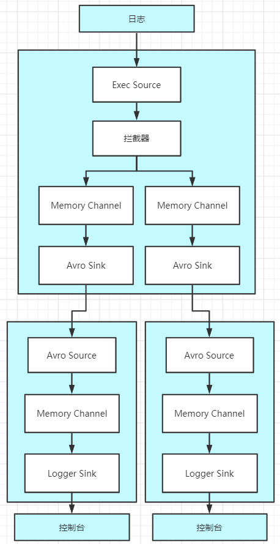
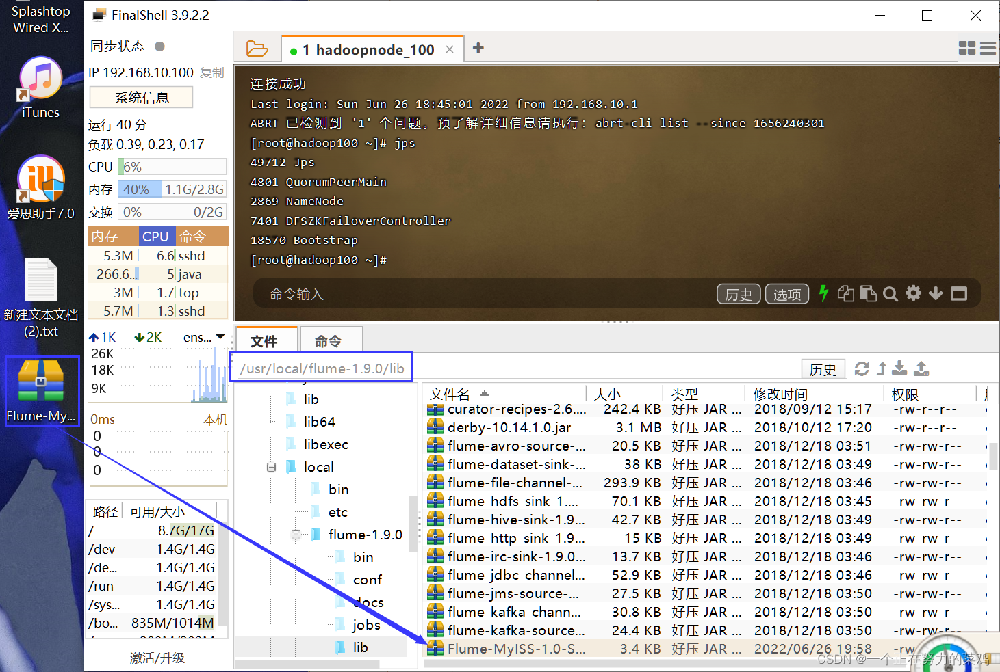
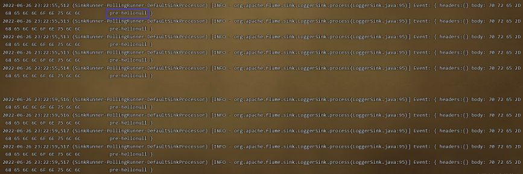

# Flume

## 一、Flume是什么？

Flume是Cloudera提供的一个高可用、高可靠**分布式的海量日志采集、聚合和传输的系统**，基于**流式架构**，灵活简单，适用于**实时推送事件**，尤其是在数据流是持续的且量级很大的情况

## 二、Flume架构

### 1.简单架构图


### 2.详细架构图


### 3.Agent

Agent以**事件**的形式将数据从源头送至目的地，是Flume数据传输的基本单元，由3个部分组成，分别是**Source、Channel、Sink**

#### 3.1.Source

Source负责**接收数据到Flume Agent**的组件，可以处理各种类型、各种格式的**日志数据**，包括avro、thrift、exec、jms、spooling directory、netcat、sequence generator、syslog、http、legacy

#### 3.2.Channel

Channel是位于**Source和Sink之间的缓冲区**，类似于生产者消费者模式，Event是Channel内Flume数据传输的基本单元

Channel是线程安全的，可以同时处理几个Source的写入操作和几个Sink的读取操作

Channel可基于磁盘，也可基于内存

|  Channel种类   |                             说明                             |
| :------------: | :----------------------------------------------------------: |
|  File Channel  |      基于磁盘，不会导致数据丢失，但大量的IO是系统的瓶颈      |
| Memory Channel | 基于内存，关机、重启或程序死亡、机器宕机等情况会导致数据丢失，在不需要关心数据丢失的情景下适用 |

#### 3.3.Sink

Sink不断地轮询Channel中的事件，**将这些事件批量写入到存储系统或者被发送到另一个Flume Agent**

Sink是**完全事务性**的，在从Channel批量获取事物之前，每个Sink用Channel启动一个事务，批量事件一旦成功写出到存储系统或下一个Flume Agent，Sink就利用Channel提交事务，事务一旦被提交，该Channel从自己的内部缓冲区删除事件

Sink组件目的地包括**hdfs**、**logger**、**avro**、thrift、ipc、**file**、null、HBase、solr、自定义，其中**Avro Sink是扇出流(1对多)扇入流(多对1)的基础，实现多个Flume的连接**

#### 3.4.小结

Flume采集的数据会丢失吗？答案是数据不会丢失，因为Channel可以存于磁盘，并且Sink是完全事务性的！

### 4.流程图解


Channel选择器有两种类型

|           Channel选择器            |                   说明                   |
| :--------------------------------: | :--------------------------------------: |
| Replicating Channel Selector(默认) |   将Source发过来的Event发往所有Channel   |
|   Multiplexing Channel Selector    | 可配置Source发过来的Event发往哪些Channel |

## 三、Flume拓扑图

### 1.Flume Agent连接


### 2.单Source多Channel-Sink


### 3.Flume Agent聚合


### 4.Flume Agent负载均衡


## 四、Flume安装与配置

### 1.官网下载Flume

官网地址：[https://flume.apache.org/download.html](https://flume.apache.org/download.html)

​	


### 2.Flume安装

①Flume压缩文件上传到需要日志采集的Linux，此处选择node1节点


②解压：`tar -xvf apache-flume-1.9.0-bin.tar.gz`

③重命名：`mv apache-flume-1.9.0-bin/ flume-1.9.0`

### 3.修改配置

将`flume/conf`下的`flume-env.sh.template`文件修改为`flume-env.sh`，并配置文件JAVA_HOME

```java
cd /usr/local/flume-1.9.0/conf
mv flume-env.sh.template flume-env.sh
vim flume-env.sh
	export JAVA_HOME=/usr/java/jdk1.8.0_151
```

## 五、Flume案例

我们学习配置的方法和官网这个东西脱不了关系，就去[官网](https://flume.apache.org/releases/content/1.10.0/FlumeUserGuide.html)干

### 1.监控端口并打印到控制台

#### 1.1.需求

首先启动Flume任务，监控本机44444端口(服务端)，然后通过telnet工具向本机44444端口发送消息(客户端)，最后Flume将监听的数据实时显示在控制台

------

#### 1.2.安装Telnet

①检查是否安装，有输出表示安装了

```java
rpm -qa telnet-server
rpm -qa xinetd
```

②安装

```java
yum -y install telnet
yum -y install xinetd
```

③启动服务：`systemctl start xinetd.service`

④设置为开机自启：`systemctl enable xinetd.service`

#### 1.3.配置环境变量

```java
vim /etc/profile
    JAVA_HOME=/usr/java/jdk1.8.0_152
    JRE_HOME=/usr/java/jdk1.8.0_151/jre
    HADOOP_HOME=/usr/local/hadoop-2.7.1
    ZOOKEEPER_HOME=/usr/local/zookeeper-3.3.6
    FLUME_HOME=/usr/local/flume-1.9.0

    CLASSPATH=.:$JAVA_HOME/lib/dt.jar:$JAVA_HOME/lib/tools.jar:$JRE_HOME/lib
    PATH=$PATH:$JAVA_HOME/bin:$JRE_HOME/bin:$HADOOP_HOME/bin:$HADOOP_HOME/sbin:$ZOOKEEPER_HOME/bin:$FLUME_HOME/bin
    export PATH CLASSPATH JAVA_HOME JRE_HOME HADOOP_HOME ZOOKEEPER_HOME FLUME_HOME
source /etc/profile
```

#### 1.4.检查44444端口是否被占用

输入命令`sudo netstat -tunlp | grep 44444`，若有输出则需要杀进程

①确定哪个进程占用该端口：`lsof -i:44444`

②杀死该进程：`kill -9 PID`

#### 1.5.编写Flume配置文件

①创建目录用于放任务的配置文件


②`/jobs/t1`下编写配置，最好将中文删去

```java
vim flume-telnet-logger.conf
    # Name the components on this agent   --  a1表示agent的名字
    a1.sources = r1	#表示a1的输入源
    a1.sinks = k1	#表示a1的输出目的地
    a1.channels = c1	#表示a1的缓冲区

    # Describe/configure the source
    a1.sources.r1.type = netcat	#表示a1的输入源类型为netcat端口类型
    a1.sources.r1.bind = localhost	#表示a1的监听主机
    a1.sources.r1.port = 44444	#表示a1的监听端口号

    # Describe the sink
    a1.sinks.k1.type = logger		#表示a1的输出目的地时控制台logger类型

    # Use a channel which buffers events in memory
    a1.channels.c1.type = memory	#表示a1的缓冲区类型是内存型
    a1.channels.c1.capacity = 1000	#表示a1的缓冲区总容量是1000个event
    a1.channels.c1.transactionCapacity = 100	#表示a1的缓冲区之前收集到100条event后再提交事务

    # Bind the source and sink to the channel
    a1.sources.r1.channels = c1	#连接source与channel
    a1.sinks.k1.channel = c1	#连接sink与channel
```

#### 1.6.启动Flume

①输入启动命令`bin/flume-ng agent --conf conf --conf-file jobs/t1/flume-telnet-logger.conf --name a1 -Dflume.root.logger==INFO,console`

|                    命令解析                    |                             说明                             |
| :--------------------------------------------: | :----------------------------------------------------------: |
|                 `--conf conf`                  |                         配置文件目录                         |
| `--conf-file jobs/t1/flume-telnet-logger.conf` |               Flume本次启动读取的配置文件位置                |
|                  `--name a1`                   |                         Agent的名字                          |
|      `-Dflume.root.logger==INFO,console`       | -D表示Flume运行时动态修改`flume.root.logger`参数属性值，将控制台日志打印级别设置为INFO级别 |

②jps检查Flume是否成功启动


#### 1.7.测试结果

另外打开node1节点，通过Telnet发送消息`telnet localhost 44444`


### 2.实时读取本地文件到HDFS

#### 2.1.原理图


------

#### 2.2.拷贝Hadoop相关的JAR


#### 2.3.编写Flume配置文件

`/jobs/t2`下编写配置文件`flume-file-hdfs.conf`，最好将中文删去，相关配置官网都可查！一定要学会查！！

```java
vim flume-file-hdfs.conf
    a2.sources=r2
    a2.sinks=k2
    a2.channels=c2

    a2.sources.r2.type=exec
    a2.sources.r2.command=tail -F /usr/local/hadoop-2.7.1/logs/hadoop-root-namenode-hadoop100.log	#Source读取数据前执行的命令
    a2.sources.r2.shell=/bin/bash -c
    a2.sources.r2.batchSize=10
    a2.sources.r2.batchTimeout=2000

    a2.sinks.k2.type=hdfs
    a2.sinks.k2.hdfs.path=hdfs://node1:8020/flume/%Y%m%d/%H	#hdfs路径 /年月日/小时
    a2.sinks.k2.hdfs.filePrefix=logs-	#文件前缀
    a2.sinks.k2.hdfs.round=true	#轮询
    a2.sinks.k2.hdfs.roundValue=1	#时间间隔
    a2.sinks.k2.hdfs.roundUnit = hour	#重新定义时间单位
    a2.sinks.k2.hdfs.useLocalTimeStamp = true	#是否使用本地时间戳
    a2.sinks.k2.hdfs.batchSize = 100	#积攒多少个Event才flush到HDFS一次
    a2.sinks.k2.hdfs.fileType = DataStream	#设置文件类型，可支持压缩
    a2.sinks.k2.hdfs.rollInterval = 600	#多久生成一个新的文件
    a2.sinks.k2.hdfs.rollSize = 134217700	#设置每个文件的滚动大小
    a2.sinks.k2.hdfs.rollCount = 0	#文件的滚动与Event数量无关
    a2.sinks.k2.hdfs.minBlockReplicas = 1	#最小冗余数

    # Use a channel which buffers events in memory
    a2.channels.c2.type = memory
    a2.channels.c2.capacity = 1000
    a2.channels.c2.transactionCapacity = 1000

    # Bind the source and sink to the channel
    a2.sources.r2.channels = c2
    a2.sinks.k2.channel = c2
```

#### 2.4.启动Flume

输入启动命令`bin/flume-ng agent --conf conf --conf-file jobs/t2/flume-file-hdfs.conf --name a2 -Dflume.root.logger==INFO,console`

#### 2.5.HDFS查看日志文件


### 3.单Source多Channel-Sink

#### 3.1.拓扑图

相当于选择器


#### 3.2.需求

Flume-1(node1)监控文件变动并将变动内容传递给Flume-2，Flume-2(node3)负责存储到HDFS，同时Flume-1将变动内容传递给Flume-3，Flume-3(node3)负责输出到Local FileSystem


#### 3.3.node1编写Flume配置文件

`/jobs/t3`下编写配置文件`exec-flume-avro.conf`

```java
vim exec-flume-avro.conf
    # Name the components on this agent
    a1.sources = r1
    a1.sinks = k1 k2
    a1.channels = c1 c2

    a1.sources.r1.selector.type = replicating	# 将数据流复制给所有channel
    a1.sources.r1.selector.optional = c2	#若c2写入流错误则系统忽略，但c1错误则回滚

    # Describe/configure the source
    a1.sources.r1.type = exec
    a1.sources.r1.command = tail -F /tmp/a.log
    a1.sources.r1.shell = /bin/bash -c

    # Describe the sink
    a1.sinks.k1.type = avro
    a1.sinks.k1.hostname = node1
    a1.sinks.k1.port = 4141

    a1.sinks.k2.type = avro
    a1.sinks.k2.hostname = node1
    a1.sinks.k2.port = 4142

    # Describe the channel
    a1.channels.c1.type = memory
    a1.channels.c1.capacity = 1000
    a1.channels.c1.transactionCapacity = 100

    a1.channels.c2.type = memory
    a1.channels.c2.capacity = 1000
    a1.channels.c2.transactionCapacity = 100

    # Bind the source and sink to the channel
    a1.sources.r1.channels = c1 c2
    a1.sinks.k1.channel = c1
    a1.sinks.k2.channel = c2
```

#### 3.4.同步配置到其他节点

```java
scp -r flume-1.9.0/ node2:/usr/local/
scp -r flume-1.9.0/ node3:/usr/local/
scp -r flume-1.9.0/ node4:/usr/local/
```

#### 3.5.分别为noed234节点配置环境变量

```java
vim /etc/profile
    JAVA_HOME=/usr/java/jdk1.8.0_152
    JRE_HOME=/usr/java/jdk1.8.0_151/jre
    HADOOP_HOME=/usr/local/hadoop-2.7.1
    ZOOKEEPER_HOME=/usr/local/zookeeper-3.3.6
    FLUME_HOME=/usr/local/flume-1.9.0

    CLASSPATH=.:$JAVA_HOME/lib/dt.jar:$JAVA_HOME/lib/tools.jar:$JRE_HOME/lib 
    PATH=$PATH:$JAVA_HOME/bin:$JRE_HOME/bin:$HADOOP_HOME/bin:$HADOOP_HOME/sbin:$ZOOKEEPER_HOME/bin:$FLUME_HOME/bin
    export PATH CLASSPATH JAVA_HOME JRE_HOME HADOOP_HOME ZOOKEEPER_HOME FLUME_HOME
source /etc/profile
```

#### 3.6.node3编写Flume配置文件

①`/jobs/t3`下编写配置文件`avro-flume-hdfs.conf`

```java
vim avro-flume-hdfs.conf
    # Name the components on this agent
    a2.sources = r1
    a2.sinks = k1
    a2.channels = c1

    # Describe/configure the source
    a2.sources.r1.type = avro
    a2.sources.r1.bind = node3
    a2.sources.r1.port = 4141

    # Describe the sink
    a2.sinks.k1.type = hdfs
    a2.sinks.k1.hdfs.path = hdfs://node3:8020/flume2/%Y%m%d/%H

    a2.sinks.k1.hdfs.filePrefix = flume2-	#上传文件的前缀
    a2.sinks.k1.hdfs.round = true	#是否按照时间滚动文件夹
    a2.sinks.k1.hdfs.roundValue = 1	#多少时间单位创建一个新的文件夹
    a2.sinks.k1.hdfs.roundUnit = hour	#重新定义时间单位
    a2.sinks.k1.hdfs.useLocalTimeStamp = true	#是否使用本地时间戳
    a2.sinks.k1.hdfs.batchSize = 100	#积攒多少个Event才flush到HDFS一次
    a2.sinks.k1.hdfs.fileType = DataStream	#设置文件类型，可支持压缩
    a2.sinks.k1.hdfs.rollInterval = 600	#多久生成一个新的文件
    a2.sinks.k1.hdfs.rollSize = 134217700	#设置每个文件的滚动大小大概是128M
    a2.sinks.k1.hdfs.rollCount = 0	#文件的滚动与Event数量无关
    a2.sinks.k1.hdfs.minBlockReplicas = 1	#最小冗余数

    # Describe the channel
    a2.channels.c1.type = memory
    a2.channels.c1.capacity = 1000
    a2.channels.c1.transactionCapacity = 100

    # Bind the source and sink to the channel
    a2.sources.r1.channels = c1
    a2.sinks.k1.channel = c1
```

②`/jobs/t3`下编写配置文件`avro-flume-dir.conf`

```java
vim avro-flume-dir.conf
	# Name the components on this agent
    a3.sources = r1
    a3.sinks = k1
    a3.channels = c2

    # Describe/configure the source
    a3.sources.r1.type = avro
    a3.sources.r1.bind = node3
    a3.sources.r1.port = 4142

    # Describe the sink
    a3.sinks.k1.type = file_roll
    a3.sinks.k1.sink.directory = /tmp/flumedatatest

    # Describe the channel
    a3.channels.c2.type = memory
    a3.channels.c2.capacity = 1000
    a3.channels.c2.transactionCapacity = 100

    # Bind the source and sink to the channel
    a3.sources.r1.channels = c2
    a3.sinks.k1.channel = c2
```

#### 3.7.启动Flume

①node3下分别启动两个Flume，若先启动flume1的话会导致远程连接失败，被拒绝连接

```java
bin/flume-ng agent --conf conf --conf-file jobs/t3/avro-flume-hdfs.conf --name a2 -Dflume.root.logger==INFO,console
bin/flume-ng agent --conf conf --conf-file jobs/t3/avro-flume-dir.conf --name a3 -Dflume.root.logger==INFO,console
```

②node1启动Flume

```java
bin/flume-ng agent --conf conf --conf-file jobs/t3/exec-flume-avro.conf --name a1 -Dflume.root.logger==INFO,console
```

最后去配置的保存位置查看结果即可

### 4.单Source-Channel多Sink

#### 4.1.拓扑图

相当于负载均衡


#### 4.2.需求

Flume-1(node1)监控文件变动并变动内容传递给Flume-2，Flume-2(node1)负责打印到控制台，同时Flume-1将变动内容传递给Flume-3，Flume-3(node1)也负责打印到控制台


#### 4.3.node1编写Flume配置文件

①`/jobs/t4`下编写配置文件`netcat-flume-avro.conf`

```java
vim netcat-flume-avro.conf
    # Name the components on this agent
    a1.sources = r1
    a1.channels = c1
    a1.sinkgroups = g1
    a1.sinks = k1 k2

    # Describe/configure the source
    a1.sources.r1.type = netcat
    a1.sources.r1.bind = localhost
    a1.sources.r1.port = 44444

    a1.sinkgroups.g1.processor.type = load_balance
    a1.sinkgroups.g1.processor.backoff = true
    a1.sinkgroups.g1.processor.selector = round_robin
    a1.sinkgroups.g1.processor.selector.maxTimeOut=10000

    # Describe the sink
    a1.sinks.k1.type = avro
    a1.sinks.k1.hostname = node1
    a1.sinks.k1.port = 4141

    a1.sinks.k2.type = avro
    a1.sinks.k2.hostname = node1
    a1.sinks.k2.port = 4142

    # Describe the channel
    a1.channels.c1.type = memory
    a1.channels.c1.capacity = 1000
    a1.channels.c1.transactionCapacity = 100

    # Bind the source and sink to the channel
    a1.sources.r1.channels = c1
    a1.sinkgroups.g1.sinks = k1 k2
    a1.sinks.k1.channel = c1
    a1.sinks.k2.channel = c1
    -------------------------------------
    a1.sinkgroups = g1
        为了消除数据处理管道中的单点故障，Flume可以使用负载平衡或故障转移策略，将event发送到不同的sink
        sink组是用来创建逻辑上的一组sink，这个组的行为是由sink处理器来决定的，它决定了event的路由策略
    a1.sinkgroups.g1.processor.type = load_balance	#负载均衡，除了这个还有default, failover(故障转移)
    a1.sinkgroups.g1.processor.backoff = true	#Should failed sinks be backed off exponentially
    a1.sinkgroups.g1.processor.selector = round_robin	#负载均衡策略
    a1.sinkgroups.g1.processor.selector.maxTimeOut=10000	
```

②`/jobs/t4`下编写配置文件`avro-flume-console1.conf`

```java
vim avro-flume-console1.conf
    # Name the components on this agent
    a2.sources = r1
    a2.sinks = k1
    a2.channels = c1

    # Describe/configure the source
    a2.sources.r1.type = avro
    a2.sources.r1.bind = node1
    a2.sources.r1.port = 4141

    # Describe the sink
    a2.sinks.k1.type = logger

    # Describe the channel
    a2.channels.c1.type = memory
    a2.channels.c1.capacity = 1000
    a2.channels.c1.transactionCapacity = 100

    # Bind the source and sink to the channel
    a2.sources.r1.channels = c1
    a2.sinks.k1.channel = c1
```

③`/jobs/t4`下编写配置文件`avro-flume-console2.conf`

```java
vim avro-flume-console2.conf
    # Name the components on this agent
    a3.sources = r1
    a3.sinks = k1
    a3.channels = c2

    # Describe/configure the source
    a3.sources.r1.type = avro
    a3.sources.r1.bind = node1
    a3.sources.r1.port = 4142

    # Describe the sink
    a3.sinks.k1.type = logger

    # Describe the channel
    a3.channels.c2.type = memory
    a3.channels.c2.capacity = 1000
    a3.channels.c2.transactionCapacity = 100

    # Bind the source and sink to the channel
    a3.sources.r1.channels = c2
    a3.sinks.k1.channel = c2
```

#### 4.4.启动Flume

先启动flume23，再启动flume1

```java
bin/flume-ng agent --conf conf --conf-fil jobs/t4/avro-flume-console2.conf --name a3 -Dflume.root.logger==INFO,console
bin/flume-ng agent --conf conf --conf-file jobs/t4/avro-flume-console1.conf --name a2
 -Dflume.root.logger==INFO,console
bin/flume-ng agent --conf conf --conf-file jobs/t4/netcat-flume-avro.conf --name a1 -Dflume.root.logger==INFO,console
```

#### 4.5.测试结果


### 5.多数据源聚合

#### 5.1.拓扑图


#### 5.2.需求

node3上的Flume-1监控文件`/usr/local/hive236/logs/hive.log`，node1上的Flume-2监控44444端口的数据流，Flume-1与Flume-2将数据发送给node4上的Flume-3，Flume-3将最终数据打印到控制台


#### 5.3.node3编写Flume配置文件

`/jobs/t5`下编写配置文件`exec-flume-avro.conf`

```java
vim exec-flume-avro.conf
    # Name the components on this agent
    a1.sources = r1
    a1.sinks = k1
    a1.channels = c1

    # Describe/configure the source
    a1.sources.r1.type = exec
    a1.sources.r1.command = tail -F /tmp/a.log
    a1.sources.r1.shell = /bin/bash -c

    # Describe the sink
    a1.sinks.k1.type = avro
    a1.sinks.k1.hostname = node4
    a1.sinks.k1.port = 4141

    # Describe the channel
    a1.channels.c1.type = memory
    a1.channels.c1.capacity = 1000
    a1.channels.c1.transactionCapacity = 100

    # Bind the source and sink to the channel
    a1.sources.r1.channels = c1
    a1.sinks.k1.channel = c1
```

#### 5.4.node1编写Flume配置文件

`/jobs/t5`下编写配置文件`netcat-flume-avro.conf`

```java
vim netcat-flume-avro.conf
    # Name the components on this agent
    a2.sources = r1
    a2.sinks = k1
    a2.channels = c1

    # Describe/configure the source
    a2.sources.r1.type = netcat
    a2.sources.r1.bind = localhost
    a2.sources.r1.port = 44444

    # Describe the sink
    a2.sinks.k1.type = avro
    a2.sinks.k1.hostname = node4
    a2.sinks.k1.port = 4141

    # Use a channel which buffers events in memory
    a2.channels.c1.type = memory
    a2.channels.c1.capacity = 1000
    a2.channels.c1.transactionCapacity = 100

    # Bind the source and sink to the channel
    a2.sources.r1.channels = c1
    a2.sinks.k1.channel = c1
```

#### 5.5.node4编写Flume配置文件

`/jobs/t5`下编写配置文件`avro-flume-logger.conf`

```java
vim avro-flume-logger.conf
    # Name the components on this agent
    a3.sources = r1
    a3.sinks = k1
    a3.channels = c1

    # Describe/configure the source
    a3.sources.r1.type = avro
    a3.sources.r1.bind = node4
    a3.sources.r1.port = 4141

    # Describe the sink
    a3.sinks.k1.type = logger

    # Describe the channel
    a3.channels.c1.type = memory
    a3.channels.c1.capacity = 1000
    a3.channels.c1.transactionCapacity = 100

    # Bind the source and sink to the channel
    a3.sources.r1.channels = c1
    a3.sinks.k1.channel = c1
```

#### 5.6.启动Flume

启动顺序flume321

```java
bin/flume-ng agent --conf conf --conf-file jobs/t5/avro-flume-logger.conf --name a3 -Dflume.root.logger==INFO,console
bin/flume-ng agent --conf conf --conf-file jobs/t5/netcat-flume-avro.conf --name a2 -Dflume.root.logger==INFO,console
bin/flume-ng agent --conf conf --conf-file jobs/t5/exec-flume-avro.conf --name a1 -Dflume.root.logger==INFO,console
```

#### 5.7.测试结果

①telnet向node1发送消失`telnet localhost 44444`


②a.log输入内容


### 6.拦截器过滤

#### 6.1.需求

使用Flume采集本地日志，按照日志类型发往不同的分析系统，例如评论、点赞、收藏等，Flume根据Event的某个key的值将不同的Event发往不同的Channel，在该案例中以是否包含`hello`模拟不同的key赋予不同的值



#### 6.2.建项添加依赖

新建Maven项目后添加依赖

```java
<dependency>
    <groupId>org.apache.flume</groupId>
    <artifactId>flume-ng-core</artifactId>
    <version>1.8.0</version>
</dependency>
```

#### 6.3.编写拦截器代码

拦截器类在Source接收数据打包成Event后，Channel前执行，实现拦截器主要有如下两个步骤

①实现Interceptor接口，Interceptor接口常用的方法如下

|                   方法                    |     说明     |
| :---------------------------------------: | :----------: |
|            `void initialize()`            |  初始化方法  |
|      `Event intercept(Event event)`       | 单个事件处理 |
| `List<Event> intercept(List<Event> list)` |  批处理事件  |
|              `void close()`               |              |

②编写静态内部类，实现Interceptor.Builder接口，用于构建拦截器，Interceptor.Builder实现的方法如下

```java
public Interceptor build() {
    return new TypeInterceptor();
}
public void configure(Context context)
```

Channel选择器官方配置说明如下


拦截器官方配置说明如下


编写好的拦截器代码如下

```java
import org.apache.flume.Context;
import org.apache.flume.Event;
import org.apache.flume.interceptor.Interceptor;
import java.util.ArrayList;
import java.util.List;
import java.util.Map;

public class TypeInterceptor implements Interceptor {

    private List<Event> events;//批量拦截器

    @Override//初始化
    public void initialize() {
        events = new ArrayList<>();
    }

    @Override//处理单个事件，这个一定要有，因为不能总等着批量事件
    public Event intercept(Event event) {
        Map<String, String> header = event.getHeaders();
        String body = new String(event.getBody());

        //根据body中是否包含hello决定是否添加头信息
        if (body.contains("hello")) {
            header.put("type", "hello!");
        } else {
            header.put("type", "other");
        }
        return event;//如果返回null表示这一条数据是不要的
    }

    @Override//批处理事件
    public List<Event> intercept(List<Event> list) {
        //1.清空全局的集合
        events.clear();
        //2.遍历处理
        for (Event event : list) {
            events.add(event);
        }
        return events;
    }

    @Override//关闭
    public void close() {

    }

    //这是内部类，帮助构建拦截器
    public static class Builder implements Interceptor.Builder {

        @Override
        public Interceptor build() {
            return new TypeInterceptor();
        }

        @Override
        public void configure(Context context) {

        }
    }
}
```

#### 6.4.Java代码打包上传到Linux




#### 6.5.编写Flume配置

①`/jobs/t6`下编写配置文件`netcat-interceptor-avro.conf`

```java
vim netcat-interceptor-avro.conf
    # Name the components on this agent
    a1.sources = r1
    a1.sinks = k1 k2
    a1.channels = c1 c2

    # Describe/configure the source
    a1.sources.r1.type = netcat
    a1.sources.r1.bind = localhost
    a1.sources.r1.port = 44444

    a1.sources.r1.interceptors = i1	#拦截器
    a1.sources.r1.interceptors.i1.type = com.yc.interceptor.TypeInterceptor$Builder	#拦截器内部类

    a1.sources.r1.selector.type = multiplexing	#选择器
    a1.sources.r1.selector.header = type	#代码中编辑了header的map,会设置K-V
    a1.sources.r1.selector.mapping.hello! = c1	#若type=hello!,则发送到c1
    a1.sources.r1.selector.mapping.other = c2	#若type=other,则发送到c2

    # Describe the sink
    a1.sinks.k1.type = avro
    a1.sinks.k1.hostname = node1
    a1.sinks.k1.port = 4141

    a1.sinks.k2.type = avro
    a1.sinks.k2.hostname = node1
    a1.sinks.k2.port = 4142

    # Use a channel which buffers events in memory
    a1.channels.c1.type = memory
    a1.channels.c1.capacity = 1000
    a1.channels.c1.transactionCapacity = 100

    # Use a channel which buffers events in memory
    a1.channels.c2.type = memory
    a1.channels.c2.capacity = 1000
    a1.channels.c2.transactionCapacity = 100

    # Bind the source and sink to the channel
    a1.sources.r1.channels = c1 c2
    a1.sinks.k1.channel = c1
    a1.sinks.k2.channel = c2
```

②`/jobs/t6`下编写配置文件`avro-flume-logger1.conf`

```java
vim avro-flume-logger1.conf
    a1.sources = r1
    a1.sinks = k1
    a1.channels = c1

    a1.sources.r1.type = avro
    a1.sources.r1.bind = node1
    a1.sources.r1.port = 4141

    a1.sinks.k1.type = logger

    a1.channels.c1.type = memory
    a1.channels.c1.capacity = 1000
    a1.channels.c1.transactionCapacity = 100

    a1.sinks.k1.channel = c1
    a1.sources.r1.channels = c1
```

③`/jobs/t6`下编写配置文件`avro-flume-logger2.conf`

```java
vim avro-flume-logger2.conf
    a1.sources = r1
    a1.sinks = k1
    a1.channels = c1

    a1.sources.r1.type = avro
    a1.sources.r1.bind = node1
    a1.sources.r1.port = 4142

    a1.sinks.k1.type = logger

    a1.channels.c1.type = memory
    a1.channels.c1.capacity = 1000
    a1.channels.c1.transactionCapacity = 100

    a1.sinks.k1.channel = c1
    a1.sources.r1.channels = c1
```

#### 6.6.启动Flume

启动顺序flume321

```java
bin/flume-ng agent --conf conf --conf-file jobs/t6/avro-flume-logger2.conf --name a1 -Dflume.root.logger==INFO,console
bin/flume-ng agent --conf conf --conf-file jobs/t6/avro-flume-logger1.conf --name a1 -Dflume.root.logger==INFO,console
bin/flume-ng agent --conf conf --conf-file jobs/t6/netcat-interceptor-avro.conf --name a1 -Dflume.root.logger==INFO,console
```

#### 6.7.测试结果

telnet向node1发送消失`telnet localhost 44444`


## 六、自定义Source-Sink

### 1.自定义Source

#### 1.1.自定义Source说明

官方提供的Source类型已经很多，但是有时候并不能满足实际开发当中的需求，此时我们就需要根据实际需求自定义某些Source

自定义Source时只需要继承`AbstractSource`并实现`Configurable`、`PollableSource`，一定要去看官方文档！常用的方法如下

|             方法             |                             说明                             |
| :--------------------------: | :----------------------------------------------------------: |
| `configure(Context context)` | 初始化Context，即读取配置文件中的信息，每个信息对应一个配置项 |
|         `process()`          |              获取数据，封装成Event并写入Channel              |
|           `stop()`           |                                                              |

#### 1.2.实现自定义Source

需求是Flume收集数据并给每条数据添加前缀与后缀，若不添加则使用默认前后缀，最后输出到控制台

①添加依赖

```java
<dependency>
    <groupId>org.apache.flume</groupId>
    <artifactId>flume-ng-core</artifactId>
    <version>1.8.0</version>
</dependency>
```

②自定义Source类

```java
import org.apache.flume.Context;
import org.apache.flume.Event;
import org.apache.flume.EventDeliveryException;
import org.apache.flume.PollableSource;
import org.apache.flume.conf.Configurable;
import org.apache.flume.event.SimpleEvent;
import org.apache.flume.source.AbstractSource;
import java.util.HashMap;
import java.util.Map;

public class MySource extends AbstractSource implements Configurable, PollableSource {
    //前缀，后缀
    private String prefix;
    private String subfix;
    private Long delay;


    @Override//初始化配置信息，获取.conf中的配置
    public void configure(Context context) {
        prefix = context.getString("pre", "pre-");//第二个参数是给出的默认值
        subfix = context.getString("sub");//未给出则没有默认值,即配置文件中未配置时默认没有
        delay = context.getLong("delay", 2000L);//延迟时间
    }

    @Override
    public Status process() throws EventDeliveryException {
        Event event = new SimpleEvent();
        Map<String, String> headers = new HashMap<>();

        try {//ctrl+alt+t
            //循环创建Event，输出给Channel
            for (int i = 0; i < 5; i++) {
                event.setHeaders(headers);
                event.setBody((prefix + "hello" + subfix).getBytes());
                getChannelProcessor().processEvent(event);
                /**
                 * source提交event会先经过拦截器--->读源码processEvent
                 * event = this.interceptorChain.intercept(event);//经过拦截器拦截
                 * if (event != null) {//如果拦截器返回的不是null才会进入if，继续执行
                 *     List<Channel> requiredChannels = this.selector.getRequiredChannels(event);//selector是一个channel选择器，返回list是因为可能需要传给多个channel
                 *     Iterator var3 = requiredChannels.iterator();//需要遍历channel
                 *     while(var3.hasNext()) {
                 *          Channel reqChannel = (Channel)var3.next();
                 *          Transaction tx = reqChannel.getTransaction();//获取事务
                 *          Preconditions.checkNotNull(tx, "Transaction object must not be null");
                 *          try {
                 *              tx.begin();//开启事务
                 *              reqChannel.put(event);
                 *              tx.commit();//提交事务
                 *          } catch (Throwable var17) {
                 *              tx.rollback();//发生异常则会回滚
                 *              ......
                 *         }....
                 */
            }
            Thread.sleep(delay);//一旦得到返回值是READY，又立马调用process函数
            return Status.READY;
        } catch (Exception e) {
            e.printStackTrace();
            return Status.BACKOFF;
        }
    }

    @Override
    public long getBackOffSleepIncrement() {
        return 0;
    }

    @Override
    public long getMaxBackOffSleepInterval() {
        return 0;
    }
}
```

③项目JAR放入Flume的lib目录下


④`/jobs/t7`下编写配置文件`mysource-flume-logger.conf`

```java
vim mysource-flume-logger.conf
    # Name the components on this agent
    a1.sources = r1
    a1.sinks = k1
    a1.channels = c1

    # Describe/configure the source
    a1.sources.r1.type = com.yc.source.MySource
    a1.sources.r1.delay = 4000
    #a1.sources.r1.pre = pre-pre
    #a1.sources.r1.sub = sub

    # Describe the sink
    a1.sinks.k1.type = logger

    # Use a channel which buffers events in memory
    a1.channels.c1.type = memory
    a1.channels.c1.capacity = 1000
    a1.channels.c1.transactionCapacity = 100

    # Bind the source and sink to the channel
    a1.sources.r1.channels = c1
    a1.sinks.k1.channel = c1
```

⑤启动Flume

```java
bin/flume-ng agent --conf conf --conf-file jobs/t7/mysource-flume-logger.conf --name a1 -Dflume.root.logger==INFO,console
```

⑥测试结果

- 未设置前后缀



- 设置前后缀


### 2.自定义Sink

#### 1.1.自定义Sink说明

官方提供的Sink类型已经很多，但是有时候并不能满足实际开发当中的需求，此时我们就需要根据实际需求自定义某些Sink，Sink不断地轮询Channel中的事件同时批量地移除它们，并将这些事件批量写入到存储或索引系统或者被发送到Flume Agent

自定义Sink时只需要继承`AbstractSink`并实现`Configurable`，一定要去看官方文档！常用的方法如下

|             方法             |                             说明                             |
| :--------------------------: | :----------------------------------------------------------: |
| `configure(Context context)` | 初始化Context，即读取配置文件中的信息，每个信息对应一个配置项 |
|         `process()`          |              获取数据，封装成Event并写入Channel              |

#### 1.2.实现自定义Sink

需求是Flume收集数据并给每条数据添加前缀与后缀，若不添加则使用默认前后缀，最后输出到控制台

①添加依赖

```java
<dependency>
    <groupId>org.apache.flume</groupId>
    <artifactId>flume-ng-core</artifactId>
    <version>1.8.0</version>
</dependency>
```

②自定义Sink类

```java
import org.apache.flume.*;
import org.apache.flume.conf.Configurable;
import org.apache.flume.sink.AbstractSink;
import org.slf4j.Logger;
import org.slf4j.LoggerFactory;

public class MySink extends AbstractSink implements Configurable {
    //创建 Logger 对象
    private static final Logger LOG = LoggerFactory.getLogger(MySink.class);
    private String prefix;
    private String subfix;

    @Override
    public void configure(Context context) {
        //读取配置文件内容，有默认值
        prefix = context.getString("pre", "pre-hello:");
        //读取配置文件内容，无默认值
        subfix = context.getString("sub");
    }

    @Override
    public Status process() throws EventDeliveryException {
        //1.获取channel，开启事务
        Channel channel = getChannel();
        Transaction transaction = channel.getTransaction();
        transaction.begin();

        //2.从channel中抓去数据，打印到控制台
        try {
            //2.1抓取数据
            Event event;
            while (true) {//抓取不到数据就一直循环的抓取
                event = channel.take();
                if (event != null) {
                    break;
                }
            }
            //2.2处理数据
            LOG.info(new String(prefix + event.getBody() + subfix));

            //2.3提交事务
            transaction.commit();
            return Status.READY;
        } catch (Exception e) {
            //回滚
            transaction.rollback();
            return Status.BACKOFF;
        } finally {
            transaction.close();
        }
    }
}
```

③项目JAR放入Flume的lib目录下


④`/jobs/t8`下编写配置文件`netcat-flume-mysink.conf`

```java
vim netcat-flume-mysink.conf
    # Name the components on this agent
    a1.sources = r1
    a1.sinks = k1
    a1.channels = c1

    # Describe/configure the source
    a1.sources.r1.type = netcat
    a1.sources.r1.bind = localhost
    a1.sources.r1.port = 44444

    # Describe the sink
    a1.sinks.k1.type = com.yc.sink.MySink
    #a1.sinks.k1.pre = pre-pre
    #a1.sinks.k1.sub = sub

    # Use a channel which buffers events in memory
    a1.channels.c1.type = memory
    a1.channels.c1.capacity = 1000
    a1.channels.c1.transactionCapacity = 100

    # Bind the source and sink to the channel
    a1.sources.r1.channels = c1
    a1.sinks.k1.channel = c1
```

⑤启动Flume

```java
bin/flume-ng agent --conf conf --conf-file jobs/t8/netcat-flume-mysink.conf --name a1 -Dflume.root.logger==INFO,console
```

⑥测试结果

telnet发送消失`telnet localhost 44444`

- 未设置前后缀


- 设置前后缀


