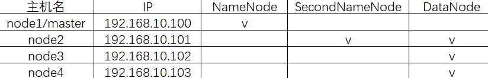

# HDFS

## 一、HDFS是什么？

HDFS全称Hadoop Distributed File System，**分布式文件系统**，源自于Google的GFS论文，发表于2003年10月，HDFS是GFS克隆版，是Hadoop体系中**数据存储管理的基础**

## 二、HDFS架构

### 1.主从架构图解


### 2.NameNode

NameNode是HDFS系统中的管理者，**作用是接收客户端的读写请求、管理文件系统的命名空间、存储所有文件或目录的元数据信息**。元数据信息只要包含文件被谁所有、文件的操作权限、文件被分成几块、文件块都被存于哪些DateNode中、用户对文件的操作日志`edit logs`等。

**NameNode启动后将元数据加载到内存，那么NameNode是如何将数据保存到磁盘的？**首先需要了解两个相关文件，`fsimage`是NameNode启动时对整个文件系统的快照，`edit logs`是NameNode启动后对整个文件系统的操作日志，简而言之，**👀`fsimage`保存的是最开始的快照，而`edit logs`记录的是启动后的每一步操作命令，所以`fsimage+edit logs`就是最终操作结果**。**只有NameNodde重启时`edit logs`才会合并到`fsimage`中，从而得到一个最新快照**，但是在产品集群中NameNode很少重启，这意味着随着NameNode运行时间的加长`edit logs`文件越来越大，因此我们需要一个管理机制来合并二者，此时引入SecondNameNode

### 3.SecondaryNameNode

**SecondaryNameNode是NameNode的备份**，一般在一台单独的物理计算机上运行，与NameNode保持通信，按照一定时间间隔保存文件系统元数据的快照，当NameNode发生故障时使用SecondaryNameNode进行数据恢复。

**SecondaryNameNode还有一个主要任务是合并NameNode的`fsimage`和`edit logs`，以减少NameNode的启动时间。**SNN中`fsimage`和`edit logs`的合并时机可通过配置文件设置合并的时间间隔`fs.checkpoint.period.period`或设置`edit logs`的文件大小`fs.checkpoint.size`来限定，合并流程如下


### 4.DataNode

DataNode是HDFS系统中真正存放数据的节点，**数据按块存于DN中，当DN启动时会主动向NN汇报块信息**。**DN之间存在副本机制，实现数据节点的相互拷贝**。**NN与DN之间需要维护心跳**，DN每隔3S需要向NN发送一次心跳，10min未收到心跳NN认为该DN掉线，并将该DN上的块复制到其他节点。**NN对DN有重平衡机制**，随着时间的推移每个DN上存储的数据大小不同，而系统的响应速度由最慢的节点决定。

#### 4.1.数据块设计

**块是数据的存储单元**，文件被分割成固定大小的数据块，块大小一般默认128M(可配置)，配置块大小方案如下

* 修改`hdfs-site.xml`配置文件

```java
<property>
    <name>dfs.block.size</name>
    <value>134217728</value>   
</property>

//查看某文件块大小的命令：hadoop fs -stat "%o" /j2ee.txt
```

* 通过API指定块大小，原来块不受影响，只改变新块

```java
Configuration conf = new Configuration();
conf.set("dfs.block.size", args[0]);
```

------

关于块这边提出几个细节性问题

①**为什么数据以块的形式存储？**在磁盘上通过指针移动来寻找数据，指针每次移动1字节快还是每次移动1个块大小更快呢，答案是指针每次移动1个块大小的查找速度更快

②**找块的时间和块大小有关，块大小的设计也是有讲究的，那么快大小会怎样影响寻找速度呢？**

* 块越大，寻址时间越短，磁盘传输时间越长，MR中的Map每次只对一个块操作，如果块过大导致运行速度很慢
* 块越小，寻址时间越长，磁盘传输时间越短，大量小文件会占用NN的内存空间，导致性能下降，不可取

③**块大小为什么设置为128M？**HDFS中平均寻址时间大概为10ms，经过前人的大量测试发现寻址时间为传输时间的1%时为最佳状态，所以最佳传输时间为10ms/0.01=1000ms=1s，目前磁盘的传输速率普遍为100MB/s，计算出最佳块大小为100MB/s*1s=100MB，所以设定块大小为128MB；工业生产中磁盘传输速率为200MB/s时，一般设定块大小为256MB；磁盘传输速率为400MB/s时，一般设定block大小为512MB

④**小文件是如何存储到块的？**若文件大小不到128MB可以单独存一个块，若小文件过多而所有小文件又单独占用一个块，块存于NN，NN存于内存，这会导致内存有限，从而导致集群中的存储量有限，所以需要将小文件合并成大文件，尽量填满一个数据快再存。文件大小大于128MB则会切分

> 查文件所占块数及相关数据信息的命令：`hdfs fsck /j2ee.txt[需要检查的文件] -files[文件] -locations[显示文件位置] -includeSnapshots -blocks[块] -racks -storagepolicies`

#### 4.2.数据块副本

**每个数据块默认都有3个副本**，副本数可配置，修改`hdfs-site.xml`设置副本数

```java
<property>
	<name>dfs.replication</name>
	<value>3</value>
</property>

//命令更改已上传的文件副本数：hadoop fs -setrep -R 3 /
//上传文件的同时指定创建的副本数：hdfs dfs -Ddfs.replication=1 -put core-site.xml /
//查看当前hdfs的副本数：hdfs fsck -locations
```

当DN挂掉后，将自动生成该节点的副本，以保证副本数不少于3；当该节点恢复后不会删除多余副本，但多余副本可能导致节点数据量不同，发生数据倾斜，所以需要NN的重平衡机制

------

**副本存放策略的好坏涉及系统的健壮性**，健壮性指如果副本都堆积在同一个节点，则该节点崩溃还是会导致数据丢失，HDFS采用的副本存放策略如下

* 第一个副本放在上传文件的DN，若是集群外提交则随机挑选一台磁盘不太满的、CPU不太忙的节点
* 第二个副本放在不同于第一个副本的**机架**节点
* 第三个副本放在与第二个副本相同**机架**的不同节点
* 更多的副本则随机

副本存放策略中还涉及到一个机架感知的概念，**机架感知指数据块副本存放的实现过程**，默认是关闭的，则此时集群下所有的节点默认在`/default-rack`下，通过命令`hdfs dfsadmin -printTopology`可查看


这样讲述机架感知还是没什么感觉，可通过以下实例学习

* 创建指定目录

```java
cd /usr/local/hadoop-2.7.1/etc/hadoop
mkdir rackaware
cd rackaware
```

* 编写配置文件

```java
vim topology.data
	192.168.10.100 node1 /dc1/rack1
	192.168.10.101 node2 /dc1/rack2
	192.168.10.102 node3 /dc1/rack2
	192.168.10.103 node4 /dc1/rack3
```

* 编写脚本文件，注意将脚本文件中的中文删除

```java
vim rackaware.sh
	#!/bin/bash  //魔术字
	HADOOP_CONF=/usr/local/hadoop-2.7.1/etc/hadoop/rackaware  //机架感知的位置
	while [ $# -gt 0 ] ; do  //循环 $#取位置参数个数 -gt表示大于 -->位置参数大于0则进入循环
	  nodeArg=$1  //取第一个位置参数
	  exec<${HADOOP_CONF}/topology.data  //<表示重定向 -->将topology.data的内容读出来放在流中
	  result=""
	  while read line ; do  //每次读取一行存到变量line中
	    ar=( $line )  //取参
	    if [ "${ar[0]}" = "$nodeArg" ]||[ "${ar[1]}" = "$nodeArg" ]; then  //读到的第一个参=位置参 || 读到的第二个参=位置参
	      result="${ar[2]}"  //取出机架位置保存到结果中
	    fi
	  done
	  shift  //位置参数向前移动一次
	  if [ -z "$result" ] ; then  //-z表示是否存在 双引表示将$运算起来，取变量
	    echo -n "/default-rack"  //输出
	  else
	    echo -n "$result"
	  fi
	done
```

* 修改脚本权限

```java
chmod a+x rackaware.sh
	a表示所有用户，g表示组用户，o表示其它用户，x表示执行权限
```

* 测试`sh rackaware.sh 192.168.10.100 node2`
* 启用机架感知

```java
vim core-site.xml
	<property>
		<name>net.topology.script.file.name</name>
		<value>/usr/local/hadoop-2.7.1/etc/hadoop/rackaware/rackaware.sh</value>
	</property>
```

* 将`rackaware.sh`与`core-site.xml`发送到node2,3,4节点

```java
scp -r ./rackaware root@node2:`pwd`
scp -r core-site.xml root@node2:`pwd`
```

* 重启hdfs

```java
stop-all.sh
start-dfs.sh
```

* 查看机架感知`hdfs dfsadmin -printTopology`

------

**HDFS集群非常容易出现机器与机器之间磁盘利用率不平衡的情况，且集群的性能由集群的最慢节点决定，所以需要保证DN数据量均衡**。当HDFS负载不均衡时，需要对各节点机器上数据的存储分布进行调整，从而让数据均匀的分布在各个DN上，均衡IO性能，防止热点的发生，**进行数据的负载均衡调整必须要满足如下原则**

* **数据平衡不能导致数据块减少和数据块备份丢失，不能影响NameNode的正常工作**
* **管理员可以中止数据平衡进程，每次移动的数据量以及占用的网络资源必须是可控的**

负载均衡的核心是数据均衡算法，均衡算法将不断迭代数据实现均衡逻辑，直至集群内数据均衡为止，该数据均衡算法每次迭代的逻辑如下


DN在何时才需要负载均衡？将DataNode按数据量进行分组，Over组、Above组中的块向Below组、Under组移动


负载均衡操作相关命令

* 设置阈值

```java
start-balancer.sh –threshold [参数]
	参数表示阈值，默认设置10，范围0-100，理论上该参数设置的越小，整个集群就越平衡
```

* 配置带宽命令，默认1048576(1M/S)：`dfs.balance.bandwidthPerSec`
* 配置带宽全局

```java
vim hdfs-site.xml
	<property>
		<name>dfs.balance.bandwidthPerSec</name>
		<value>1048576</value>
	</property>
```

* 关闭负载均衡：`stop-balancer.sh`
* 设置定时任务实现定时负载均衡

```java
00 22 * * 5 hdfs balancer -Threshold 5 >>/home/logs/balancer_`date +"\%Y\%m\%d"`.log 2>&1
```

> HDFS集群中不怕数据大，就怕数据倾斜

> 块大小和副本数通过客户端上传文件时设定，文件上传成功后副本数可以变更，但块大小不行

#### 4.3.数据块损坏处理

**DN有自检功能，当数据块创建3周后自动触发校验和运算**，以保证集群中数据块的安全，**如何自检？校验和是啥？**客户端写文件的同时在同一个文件夹下创建隐藏文件`a.crc`，该隐藏文件记录了文件的校验和(针对文件大小每512字节生成32位校验和)，客户端读取文件时按同样的算法生成`crc`文件，对比创建时生成的`crc`文件与该`crc`文件，不匹配则损坏，损坏则读副本

#### 4.4.数据块优点

①**文件可大于集群中任意机器的磁盘大小**，因为最终大文件会被切分，当要使用一个文件时只需要将这个文件对应的块进行临时的拼接即可

②文件被切分后，**只需要考虑文件被切分后固定128M大小的数据块如何存储，简化存储子系统**

③数据块非常适合用于数据的备份，从而提高数据的容错能力，**当数据丢失时以块为单位找回，而不涉及文件整体**

优点应用实例：下载文件时可以提前划分好空间，然后通过多线程的方式下载，这样做更快且防止了下载90%时文件超过磁盘空间导致整个下载失败

## 三、HDFS权限与安全

### 1.HDFS文件权限

与Linux文件权限类似，有读写执行(`rwx`)权限，但执行权限对于文件忽略，HDFS权限管理的目的是**阻止好人做错事，而不是阻止坏人做坏事**，A用户上传的文件B用户也看得到，与Linux不同，Linux中哪个用户上传的就只能那个用户看到

### 2.安全模式

安全模式指在不加载第三方设备驱动情况下启动机器，便于检测与修复，即**在安全模式下对于客户端是只读的**，常应用于**启动或者重新启动hdfs时，收集DN信息**或**HDFS维护升级**。NN启动时会收集每个DN的信息，当数据块副本数量超过最小副本数会被认为是安全的，在一定比例(可配置)数据块被认为安全后，再经过若干时间安全模式结束，操作命令如下

* 退出安全模式：`hdfs dfsadmin -safemode leave`
* 进入安全模式：`hdfs dfsadmin -safemode enter`
* 查看安全模式状态：`hdfs dfsadmin -safemode get`
* 等到安全模式结束：`hdfs dfsadmin -safemode wait`

## 四、HDFS读写流程

### 1.HDFS写流程

客户端传数据是先传到NN再由NN传到DN，还是直接传到DN？答案都不对，看图


### 2.HDFS读流程


## 五、HDFS安装与配置

### 1.HDFS的安装方式

**HDFS的安装方式分为单机安装、伪分布式安装、完全分步式安装**，其中伪分布式安装表示单机上模拟分步式场景进行安装，完全分布式的安装步骤是`时间同步->安装JDK->免密钥设置->上传解压->修改配置文件->同步到其他节点->格式化NN->启动`

### 2.[HDFS配置之NN&SNN&DN](/大数据/2.Hadoop/HDFS配置之NN&SNN&DN)

具体配置步骤请点击标题链接跳转



## 六、HDFS高可用HA

### 1.HA引入

HDFS高可用HA可以**消除Hadoop1的单点故障问题**，当唯一的NameNode宕机后导致整个集群不可用

HDFS高可用HA可以**缓解唯一的NameNode的压力**，防止内存受限问题，以免影响系统性能

### 2.HA思想

高可用的基本思想是在集群中接入两个NN，当一个NN宕机时另一个NN可以接管服务，但是呢光这样做又会带来新的问题

#### 2.1.如何防止脑裂？

HDFS是主从架构，本来只有一个主节点，但此时集群中有两个NN，那么这两个NN会争抢集群共享资源，导致系统紊乱，数据损坏，这就是脑裂。

脑裂如何解决？**典型的在HA集群中使用两台单独机器配置为NN，任何时刻只有一台NN处于Active状态，另一台处于Standby状态，其中Active状态的NN负责集群中所有客户端的操作，Standby状态的NN充当备机，一旦Active状态的NN出现问题可以快速切换**

#### 2.2.如何保持两个NN间的数据一致性？

为了实时同步Active与Standby两个NN的元数据信息，提供一个**共享存储系统JN**，可以是NFS、QJM、Zookeeper，**Active状态的NN将数据写入共享存储系统，而Standby状态的NN监听Active状态的NN，一旦有新数据写入则读取这些数据并加载到自己的内存，以保证加载到自己内存的数据与Active状态NN的数据保持一致**

**为了实现NN间的快速切换，Standby状态的NN获取集群最新文件块信息也是有必要的，为实现这个DN需要配置NN位置，并同时向两个NN发送文件块信息以及心跳检测**

> 注意SNN不是HA，SNN只是阶段性合并`edits`和`fsimage`，以缩短集群启动时间，NN失效时，SNN无法立刻提供服务，SNN甚至无法保持数据的完整性，若NN数据丢失，最后一次合并后的系统文件改动也将丢失

### 3.[HDFS配置之高可用HA](https://chenjieyaya.github.io/chenjie-blog/#/大数据/2.Hadoop/HDFS配置之高可用HA)

具体配置步骤请点击标题链接跳转

## 七、小结

### 1.HDFS的特点

**①通过流式数据访问，提供程序数据的访问吞吐量，而不是访问速度。**流式数据指将数据序列化为字节流来存储，这样不会破坏文件的结构和内容，而且字节流直接存储在磁盘上，可以分片或分块

**②适合带有大型数据集的应用程序，可处理PB级别的超大数据文件。**当超大规模的文件本身已经超越了单台服务器的存储规模，就需要多台服务器同时存储，所以需要将数据序列化成字节数据，按照字节的顺序进行切分，然后分布式地均匀的存储在各个服务器上

> **若要将一个大的文件进行切分，该文件必须支持序列化；若要存储在文件系统中，该文件系统必须是流式数据访问模式**

**③HDFS是高度容错的系统，能检测和应对硬件故障，运行在低成本的硬件。**发生故障时能继续运行而不被用户察觉，因为高可用消除单点故障，提供故障转移功能，且DataNode也存在副本机制，避免了数据丢失的情况

**④HDFS提供一次写入多次读取的机制，数据以块的形式同时分布在集群不同物理机器上。**因为HDFS一般存储的都是大数据集，多用于离线统计和分析，并且写入后不允许修改。为什么不允许修改？因为HDFS一般存储的都是大数据集，且这些数据都是有副本的，属于是牵一发而动全身了，而且HDFS对于修改动作是加锁的，加锁带来的额外开销使性能大打折扣，所以Hadoop适合一次写入多次读取，适合处理离线数据，而不是实时数据

⑤**Hadoop能处理非结构化数据，其他数据Hadoop都支持。**结构化数据指关系型数据，如sql关系表；半结构化数据指按一定格式存储的数据，如word、ppt；非结构化数据指音频、图片、视频

> Hadoop的基本流程：HDFS将大规模的数据以分布式的方式均匀存储在集群中的各个服务器上，然后分布式并行计算框架MR利用各个数据节点DN的本地计算资源在本地服务器上对大规模数据集的一个子集数据进行计算

### 2.Hadoop2的新功能

①**高可用性HA**：消除Hadoop1的**单点故障**问题，NameNode宕机以后导致整个集群不可以，**一个集群中有且只有一台NameNode处于Active状态**

②**Federation**：HA集群中允许出现两个NameNode，Federation允许集群中出现多个NameNode，**各个NN间相互独立且不需要互相协调**，各自分工管理自己的区域；**DataNode被用作通用的数据块存储设备**，每个DataNode要向集群中所有NameNode注册并发送心跳报告

### 3.HDFS的局限

①**不适合低延迟数据访问。**低延迟数据访问指访问数据的时间尽可能短，与关系型数据库不同，关系型数据库存在存储极限，而HDFS处理的数据都是PB级别，而且HDFS保证高吞吐量，这必定会牺牲低延迟性，所以对于低延迟的数据访问Hadoop不适合，HBase更适合，HBase是分步式基于列的非关系性数据库

②**无法高效存储大量小型文件。**小文件需要归档后存于数据块中，若不归档，直接让小文件独占数据块，会导致内存受限

③**不支持多用户同时写入及修改同一个文件。**从业务角度来说，一个PB级别的文件如果只修改了几行数据，对最后分析的结果影响很小，而且牵一发动全身，而且加锁会影响性能


