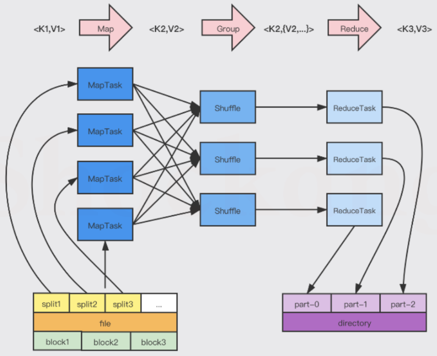
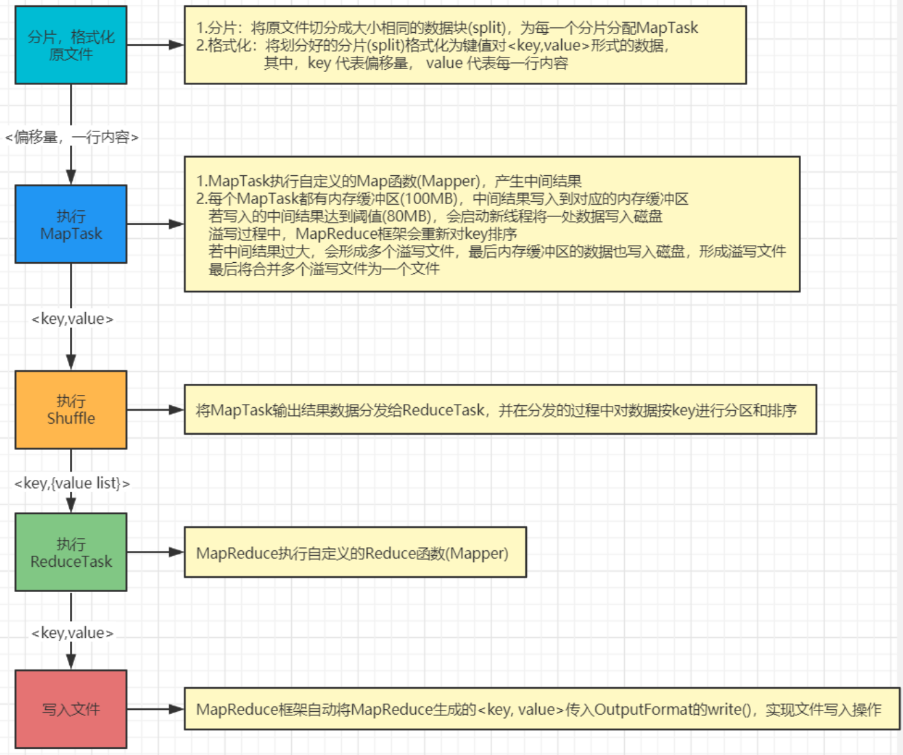
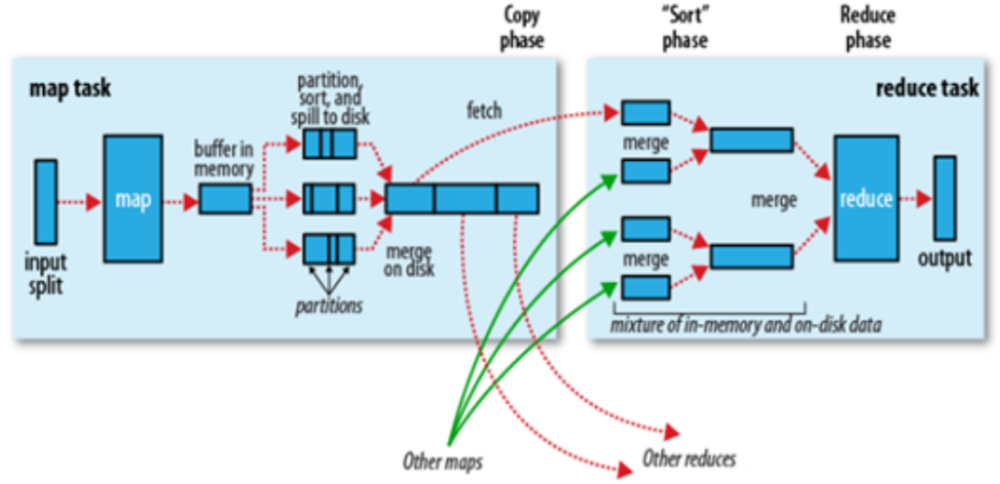
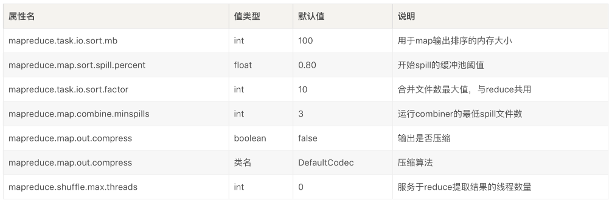
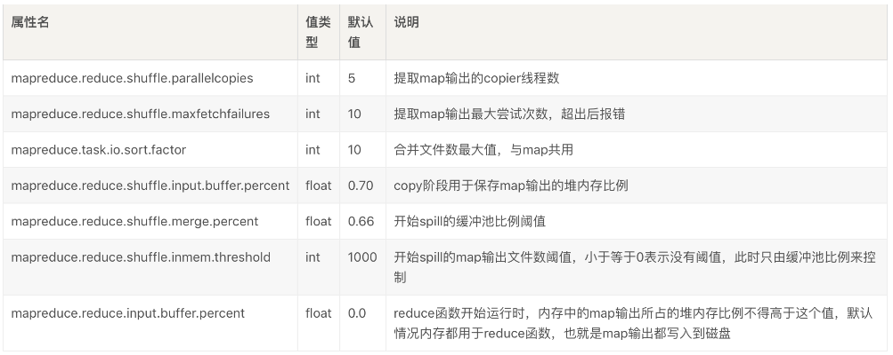

# MapReduce

## 一、MapReduce是什么？

MapReduce可以拆解成两个过程，即Map和Reduce。Map表示映射过程，它将一组数据按照Map函数映射成新数据；Reduce表示归纳过程，它将若干组映射结果进行汇总并输出


## 二、MR工作流程

### 1.详细讲解工作流程

#### 1.1.提交作业

创建JobClient向ResourceManage申请Application，ResourceManage回送作业ID与资源提交路径给JobClient，JobClient将通过公式`max(splitminSize,min(splitmaxSize,blockSize))`计算分片大小，将分片信息、JAR信息和配置文件复制到HDFS，最后JobClient向ResourceManage提交作业


#### 1.2.初始化作业

JobClient提交的作业进入资源调度器，当存在空闲NodeManage时将为该作业创建ApplicationMaster以及相应容器，ApplicationMaster在HDFS中读取分片信息，创建相应数量的MapTask，最后依据配置创建相应数量的ReduceTask


#### 2.3.任务分配

ApplicationMaster向ResourceManage申请运行Task的资源，ResourceManage为Task分配资源容器


问MapReduce提供了哪几种作业运行方式？共三种，分别如下

* `Local`：用于调试
* `Uber`：为了降低小作业的延迟而设计，所有Task都在同一个容器内顺序执行
* `Non-Uber`：运行大作业，ApplicationMaster向ResourceManage申请运行Task的资源，ResourceManage为Task分配资源容器

#### 2.4.任务执行

ApplicationMaster会感应任务所在的NodeManage，通知Task启动


#### 2.5.进度状态更新

每一个Task都有一个状态信息，状态信息中记录了Task的运行状态、进度等，这些状态信息在运行期间不断改变

Task有独立的进程，进程每3s检查一次任务更新标志，若有更新则报告给TaskTracker，TaskTracker每隔5秒给JobTracker发一次心跳信息，而JobTracker将合并这些更新，产生一个表明所有运行作业及其任务状态的全局视图，同时JobClient通过每秒查询JobTracker来获得最新状态，并且输出到控制台上

#### 2.6.作业完成

当JobTracker收到作业最后一个任务已完成的通知后，便把作业的状态设置为"成功"，然后在JobClient查询状态时便知道作业已成功完成，于是JobClient打印一条消息告知用户，最后从runJob()方法返回，最后JobTracker清空作业的工作状态，指示TaskTracker也清空作业的工作状态

#### 2.7.全过程


### 2.整体工作流程图解





###  3.细节点

#### 3.1.推测执行

系统中有99%的Map任务都完成了，只有少数几个Map老是进度很慢怎么办？Hadoop会引入推测执行，即作业中大多数任务都已经完成，Hadoop平台会在几个空闲节点上调度执行剩余任务的复制，任何一个首先完成的复制任务将成为权威复制，如果其他复制任务还在推测执行中，Hadoop会告诉TaskTracker去终止这些任务并丢弃

#### 3.2.JVM重用

每个Task都启动一个JVM来运行任务，`mapred.job.reuse.jvm.num.tasks`默认为1，当`mapred.job.reuse.jvm.num.tasks`值为-1时表示JVM可以无限制重用。需要JVM重用时TaskTracker先判断当前当前节点是否有slot剩余，如果没有slot槽位才会判断当前分配的slot槽位中的JVM是否已经将当前Task任务运行完，如果Task已经运行完才会复用当前JVM，**注意同一Job的JVM才会复用**

JVM重用可以减少启动和停止JVM创造的开销，且使同一个任务的静态资源得到共享，但会导致JVM的碎片增加，性能下降

## 三、Shuffle工作流程

Shuffle阶段可以分为Map端的Shuffle和Reduce端的Shuffle，功能包括排序+分组+合并复杂数据处理



### 1.Map端的Shuffle

①Map将产生的输出数据写入内存的环形缓冲区，环形缓冲区其实只是一个简单的buffer()，缓冲区的初始化源码如下

```java
private IntBuffer kvmeta;//存储元数据信息 **注意这是IntBuffer存储int，至于元数据为什么都是int下面会有答案
byte[] kvbuffer;//环形缓冲区的数组

final int sortmb = job.getInt(JobContext.IO_SORT_MB, 100);//通过配置文件得到了环形缓冲区的大小(默认100M)
....................
int maxMemUsage = sortmb << 20;//通过位运算把100m转化成对应的字节
kvbuffer = new byte[maxMemUsage]; //创建一个buffer
bufvoid = kvbuffer.length;
kvmeta = ByteBuffer.wrap(kvbuffer)//通过伪装得到一个元数据数组 
    .order(ByteOrder.nativeOrder())
    .asIntBuffer();//100M位例值为26214400
setEquator(0);//设置初始的赤道的位置为0
bufstart = bufend = bufindex = equator;//初始化buffer参数
kvstart = kvend = kvindex;//初始化meta参数   
....................
private void setEquator(int pos) {
    final int aligned = pos-(pos% METASIZE);//在这里pos为0, 所以aligned=0
    kvindex = ((aligned - METASIZE + kvbuffer.length) % kvbuffer.length) / 4;
}
```

②环形缓冲区默认大小为100MB, 也可以通过`mapreduce.task.io.sort.mb`属性来配置，当缓冲区快要溢出时(80%)，系统将启动一个后台线程把缓冲区中的内容写到磁盘，在写磁盘过程中Map输出继续被写到缓冲区，但如果在此期间缓冲区被填满，那么Map就会阻塞直到写磁盘过程完成

③写往本地磁盘时，MapReduce的Job会预断Reduce任务的个数，后台线程会根据数据最终要送往的Reduce进行相应分区，分区编号通过公式`key.hashCode()％Reduce的个数`计算得到，针对每个分区中的数据使用快速排序算法按照Key进行内部排序，如果设置了Combine函数则会在排序的结果上进行Combine局部聚合运算


④Spill文件根据情况被合并成已排序已分区的输出文件

⑤默认Map的输出不压缩，`mapred.compress.map.output`属性设置为`true`时则会压缩输出文件

⑥Reduce端通过HTTP的方式请求Map端输出文件的分区

### 2.Reduce端的Shuffle

ReduceTask在执行之前的工作就是不断地拉取当前Job中每个MapTask的最终结果，然后对从不同地方拉取过来的数据不断地做Merge，最终形成一个文件作为ReduceTask的输入文件，以下是Reduce端执行流程

①Reduce任务在Map任务结束之后会尽快取走属于自己分区的那部分输出结果，Reduce可以并行获取Map数据，线程默认为5个(mapred.reduce.parallel.copies配置) ，数据被Reduce提取后Map不会立刻删除数据，而是在整个作业完成后由JobTracker通知TaskTracker可以删除Map输出数据

②Reduce任务的内存缓冲区中数据达到配置的阈值时，这些数据会在内存中被合并，并写入机器磁盘

## 四、MR性能调优

### 1.通用原则

Shuffle过程分配尽可能大的内存，Mapper和Reduce过程程序应该尽量减少内存的使用，运行Map与Reduce的任务JVM内存通过`mapred.child.java.opts`配置，容器内存大小通过`mapreduce.map.memory.mb`和`mapreduce.reduce.memory.mb`配置(默认值都为1024MB)

### 2.Map端优化

估计Map的输出大小，设置合理的`mapreduce.task.io.sort.*`属性，使得Spill文件数量最小，最好只有一个



### 3.Reduce端优化

通常内存都保留给Reduce函数，但是如果Reduce函数对内存需求不是很高，将触发合并的Map输出文件数`mapreduce.reduce.merge.inmem.threshold`设为0，保存Map输出文件的堆内存比例`mapreduce.reduce.input.buffer.percent`设为1.0，可以达到很好的性能提升




