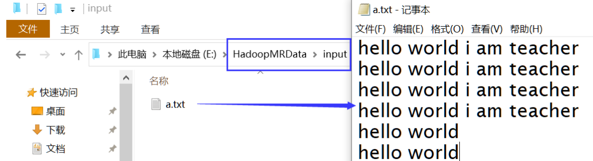
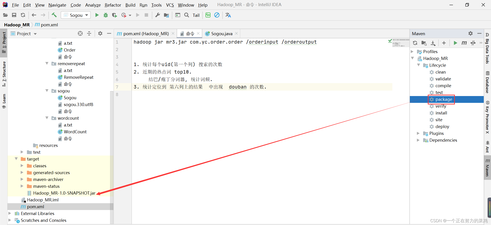
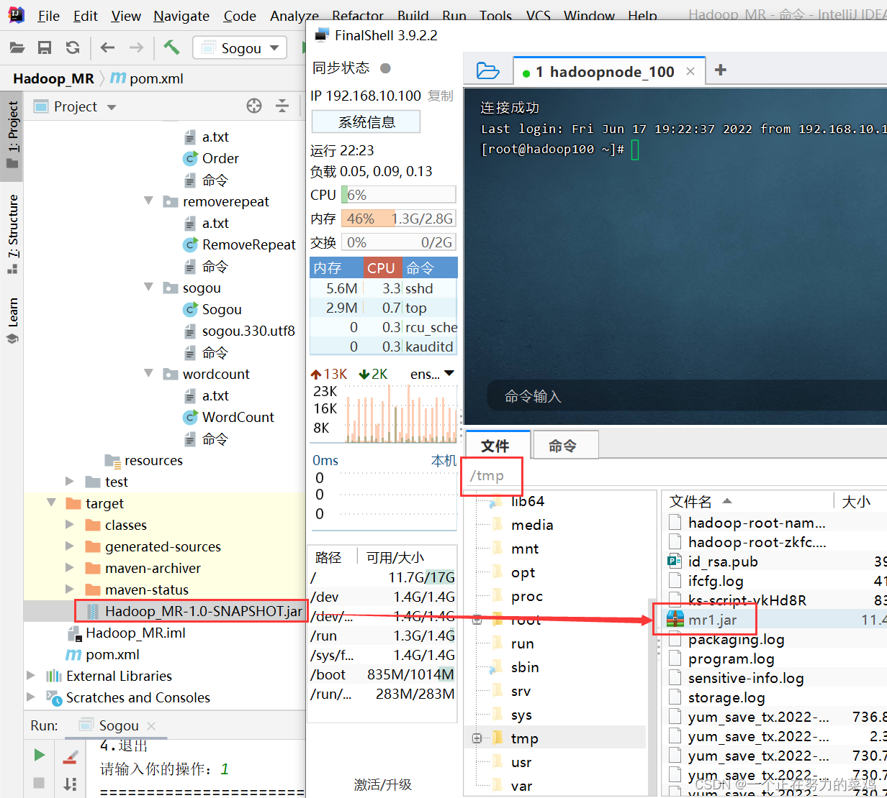
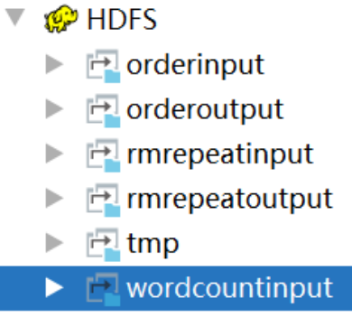
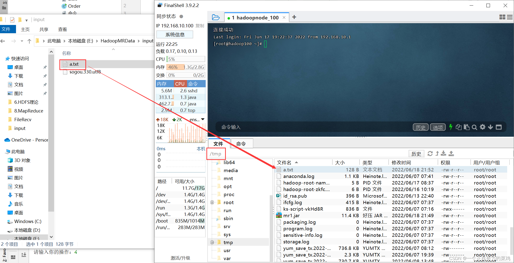
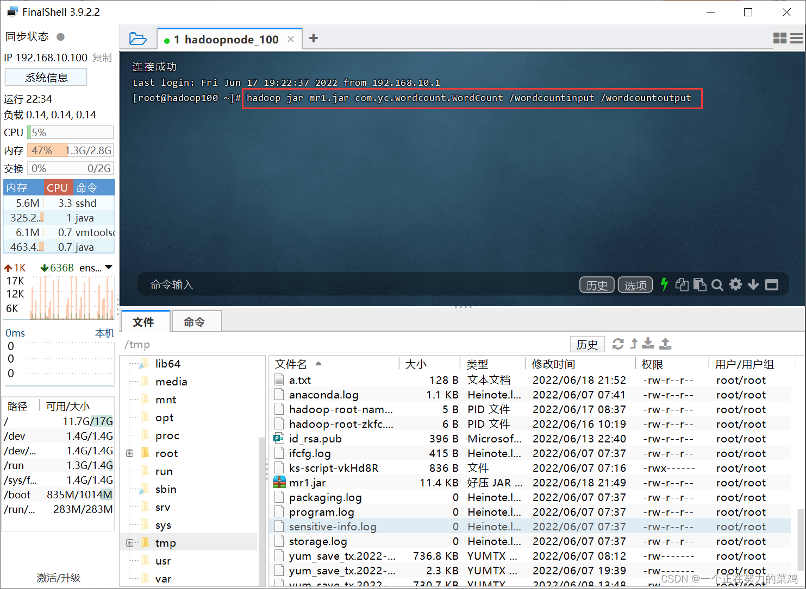

# MapReduce开发

## 一、WordCount案例

### 1.配置yarn-site.xml

```java
<property>
    <name>yarn.nodemanager.aux-services</name>
    <value>mapreduce_shuffle</value>
</property>
```

### 2.解决HDFS权限问题

①API方式`System.setProperty("HADOOP_USER_NAME","root")`

②配置方式

```java
<property>
	<name>dfs.permissions.enabled</name>
	<value>false</value>
</property>
```

### 3.IDEA本地测试环境下

本地测试以多线程方式模拟服务器运行，无需开启集群

①IDEA内创建Java项目，并导入依赖

```java
<properties>
    <java.version>1.8</java.version>
    <hadoop.version>2.7.1</hadoop.version>
</properties>
<dependencies>
    <!--编译时需要的jar-->
    <dependency>
        <groupId>org.apache.hadoop</groupId>
        <artifactId>hadoop-hdfs</artifactId>
        <version>${hadoop.version}</version>
    </dependency>
    <dependency>
        <groupId>org.apache.hadoop</groupId>
        <artifactId>hadoop-common</artifactId>
        <version>${hadoop.version}</version>
    </dependency>
    <dependency>
        <groupId>org.apache.hadoop</groupId>
        <artifactId>hadoop-client</artifactId>
        <version>${hadoop.version}</version>
    </dependency>
    <dependency>
        <groupId>org.apache.hadoop</groupId>
        <artifactId>hadoop-mapreduce-client-core</artifactId>
        <version>${hadoop.version}</version>
    </dependency>
    <dependency>
        <groupId>org.apache.hadoop</groupId>
        <artifactId>hadoop-mapreduce-client-jobclient</artifactId>
        <version>${hadoop.version}</version>
    </dependency>
</dependencies>
```

②编写输入数据在本地，注意**程序运行起来输出目录会被删一次**，所以最好创建一个新的目录，输出目录不用手动创建，程序运行时会自动创建



③编写WorkCount程序代码

```java
import org.apache.hadoop.conf.Configuration;
import org.apache.hadoop.fs.Path;
import org.apache.hadoop.io.IntWritable;
import org.apache.hadoop.io.Text;
import org.apache.hadoop.mapreduce.Job;
import org.apache.hadoop.mapreduce.Mapper;
import org.apache.hadoop.mapreduce.Reducer;
import org.apache.hadoop.mapreduce.lib.input.FileInputFormat;
import org.apache.hadoop.mapreduce.lib.output.FileOutputFormat;

import java.io.IOException;
import java.util.StringTokenizer;

public class WordCount {

    /**
     * map映射器：将输入<字节偏移量，一行文本>切分成<单词，次数>
     * map之前有一步split，将文本切分成<字节偏移量，一行文本>
     */
    public static class TokenizerMapper
            extends Mapper<Object, Text, Text, IntWritable> {//<前两位表示输入类型<偏移量，一行文本>，后两位表示输出类型<单词，数字>>
        private final static IntWritable one = new IntWritable(1);
        private Text word = new Text();
        /**
         * 前两个参是输入类型
         *
         * @param key     偏移量
         * @param value   一行文本，Text类型可序列化，可比较(WritableComparable接口)
         * @param context hadoop运行容器，可取出运行时的环境变量
         * @throws IOException
         * @throws InterruptedException
         */
        @Override
        public void map(Object key, Text value, Context context
        ) throws IOException, InterruptedException {
            System.out.println("切分split后数据--偏移量:" + key + "\t值:" + value);
            StringTokenizer itr = new StringTokenizer(value.toString());//根据自然分隔符分割
            while (itr.hasMoreTokens()) {
                word.set(itr.nextToken());//写入文本对象
                context.write(word, one);//保存出去(单词，数字)
            }
        }
    }

    /**
     * combiner(单节点合并)和reduce(多节点数据合并)都是对相同键的数据进行规约，使用一个即可
     * <前两个泛型表示规约的输入数据来源于map的输出，后两个是规约后的单词与数字>
     */
    public static class IntSumReducer
            extends Reducer<Text, IntWritable, Text, IntWritable> {
        private IntWritable result = new IntWritable();

        /**
         * @param key     单词
         * @param values  相同单词对应出现次数的集合
         *                类中泛型约束是IntWritable，为什么方法上是Iterable<IntWritable>？
         *                因为在统计之前会相同的键做成列表word [1,1,1]，然后在规约word 3
         * @param context
         * @throws IOException
         * @throws InterruptedException
         */
        @Override
        public void reduce(Text key, Iterable<IntWritable> values, Context context) throws IOException, InterruptedException {
            int sum = 0;
            for (IntWritable val : values) {//对一个键
                sum += val.get();//求和规约
            }
            result.set(sum);
            context.write(key, result);
        }
    }

    public static void main(String[] args) throws Exception {
        Configuration conf = new Configuration();//配置参数(map数,reduce数...对于配置配置文件中的API配置)
        Job job = Job.getInstance(conf, "word count");//名字
        job.setJarByClass(WordCount.class);//上线的jar
        job.setMapperClass(TokenizerMapper.class);//mapper
        job.setCombinerClass(IntSumReducer.class);//combine:合并一个节点
        job.setReducerClass(IntSumReducer.class);//reduce:合并不同节点
        job.setOutputKeyClass(Text.class);//输出键的类型，与上面一致
        job.setOutputValueClass(IntWritable.class);//输出值的类型，与上面一致
        FileInputFormat.addInputPath(job, new Path("E:\\HadoopMRData\\input"));//输入目录
        FileOutputFormat.setOutputPath(job, new Path("E:\\HadoopMRData\\output"));//输出目录，这个目录要不存在运行时创建，特别注意要设置到空目录，应为执行之前会删一次****
        System.exit(job.waitForCompletion(true) ? 0 : 1);//启动，0表示正常退出
    }
}
```

④观察E:\HadoopMRData\output目录下的输出数据

### 4.命令方式测试环境下

①IDEA内创建Java项目，并导入依赖

```java
<properties>
    <java.version>1.8</java.version>
    <hadoop.version>2.7.1</hadoop.version>
</properties>
<dependencies>
    <!--编译时需要的jar-->
    <dependency>
        <groupId>org.apache.hadoop</groupId>
        <artifactId>hadoop-hdfs</artifactId>
        <version>${hadoop.version}</version>
    </dependency>
    <dependency>
        <groupId>org.apache.hadoop</groupId>
        <artifactId>hadoop-common</artifactId>
        <version>${hadoop.version}</version>
    </dependency>
    <dependency>
        <groupId>org.apache.hadoop</groupId>
        <artifactId>hadoop-client</artifactId>
        <version>${hadoop.version}</version>
    </dependency>
    <dependency>
        <groupId>org.apache.hadoop</groupId>
        <artifactId>hadoop-mapreduce-client-core</artifactId>
        <version>${hadoop.version}</version>
    </dependency>
    <dependency>
        <groupId>org.apache.hadoop</groupId>
        <artifactId>hadoop-mapreduce-client-jobclient</artifactId>
        <version>${hadoop.version}</version>
    </dependency>
</dependencies>
```

②编写WorkCount程序代码


③编写WorkCount程序代码

```java
import org.apache.hadoop.conf.Configuration;
import org.apache.hadoop.fs.Path;
import org.apache.hadoop.io.IntWritable;
import org.apache.hadoop.io.Text;
import org.apache.hadoop.mapreduce.Job;
import org.apache.hadoop.mapreduce.Mapper;
import org.apache.hadoop.mapreduce.Reducer;
import org.apache.hadoop.mapreduce.lib.input.FileInputFormat;
import org.apache.hadoop.mapreduce.lib.output.FileOutputFormat;

import java.io.IOException;
import java.util.StringTokenizer;

public class WordCount {

    /**
     * map映射器：将输入<字节偏移量，一行文本>切分成<单词，次数>
     * map之前有一步split，将文本切分成<字节偏移量，一行文本>
     */
    public static class TokenizerMapper
            extends Mapper<Object, Text, Text, IntWritable> {//<前两位表示输入类型<偏移量，一行文本>，后两位表示输出类型<单词，数字>>
        private final static IntWritable one = new IntWritable(1);
        private Text word = new Text();
        /**
         * 前两个参是输入类型
         *
         * @param key     偏移量
         * @param value   一行文本，Text类型可序列化，可比较(WritableComparable接口)
         * @param context hadoop运行容器，可取出运行时的环境变量
         * @throws IOException
         * @throws InterruptedException
         */
        @Override
        public void map(Object key, Text value, Context context
        ) throws IOException, InterruptedException {
            System.out.println("切分split后数据--偏移量:" + key + "\t值:" + value);
            StringTokenizer itr = new StringTokenizer(value.toString());//根据自然分隔符分割
            while (itr.hasMoreTokens()) {
                word.set(itr.nextToken());//写入文本对象
                context.write(word, one);//保存出去(单词，数字)
            }
        }
    }

    /**
     * combiner(单节点合并)和reduce(多节点数据合并)都是对相同键的数据进行规约，使用一个即可
     * <前两个泛型表示规约的输入数据来源于map的输出，后两个是规约后的单词与数字>
     */
    public static class IntSumReducer
            extends Reducer<Text, IntWritable, Text, IntWritable> {
        private IntWritable result = new IntWritable();

        /**
         * @param key     单词
         * @param values  相同单词对应出现次数的集合
         *                类中泛型约束是IntWritable，为什么方法上是Iterable<IntWritable>？
         *                因为在统计之前会相同的键做成列表word [1,1,1]，然后在规约word 3
         * @param context
         * @throws IOException
         * @throws InterruptedException
         */
        @Override
        public void reduce(Text key, Iterable<IntWritable> values, Context context) throws IOException, InterruptedException {
            int sum = 0;
            for (IntWritable val : values) {//对一个键
                sum += val.get();//求和规约
            }
            result.set(sum);
            context.write(key, result);
        }
    }

    public static void main(String[] args) throws Exception {
        Configuration conf = new Configuration();//配置参数(map数,reduce数...对于配置配置文件中的API配置)
        Job job = Job.getInstance(conf, "word count");//名字
        job.setJarByClass(WordCount.class);//上线的jar
        job.setMapperClass(TokenizerMapper.class);//mapper
        job.setCombinerClass(IntSumReducer.class);//combine:合并一个节点
        job.setReducerClass(IntSumReducer.class);//reduce:合并不同节点
        job.setOutputKeyClass(Text.class);//输出键的类型，与上面一致
        job.setOutputValueClass(IntWritable.class);//输出值的类型，与上面一致
        FileInputFormat.addInputPath(job, new Path("E:\\HadoopMRData\\input"));//输入目录
        FileOutputFormat.setOutputPath(job, new Path("E:\\HadoopMRData\\output"));//输出目录，这个目录要不存在运行时创建，特别注意要设置到空目录，应为执行之前会删一次****
        System.exit(job.waitForCompletion(true) ? 0 : 1);//启动，0表示正常退出
    }
}
```

③打包并f发送到Linux





④HDFS中创建输入目录，不要创建输出目录否则失败




⑤HDFS中编写输入数据




⑥JAR在Hadoop上运行，输入命令`hadoop jar xxx.jar 类名 输入路径 输出路径`



⑦Web中输入`http://node3:8088/`，发现有任务在进行，运行完后观察输出数据

## 二、统计单词数案例


