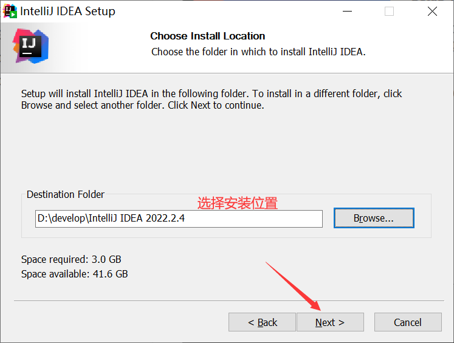
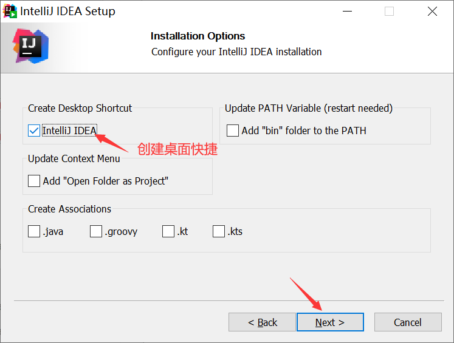

# IDEA卸载与安装

## 一、卸载旧版本IDEA

桌面上找到IDEA，鼠标右键点击打开文件所在的位置，去到`bin`目录下找到`Uninstall.exe`卸载IDEA，想要彻底卸载请点击[链接](https://blog.csdn.net/snow_living/article/details/126402104)跳转

## 二、下载安装IDEA

### 1.下载IDEA安装包

去到[IDEA官网](https://www.jetbrains.com/idea/download/other.html)下载需要的IDEA安装包，这里下载的是2022.2.4

### 2.安装IDEA

## 三、激活工具下载和使用

### 1.激活工具下载

首先去到公共号【终码一生】回复永久激活获得激活工具

### 2.WindowsOS激活

激活工具中找到相应文件后双击

等一会出现Done

注意执行完脚本后脚本不要随便移动，更不要删除激活工具，否则会造成IDEA无法启动

### 3.重启IDEA激活

点击Activation Code，跳转至[http://jets.idejihuo.com](http://jets.idejihuo.com/)获取专属激活码激活

