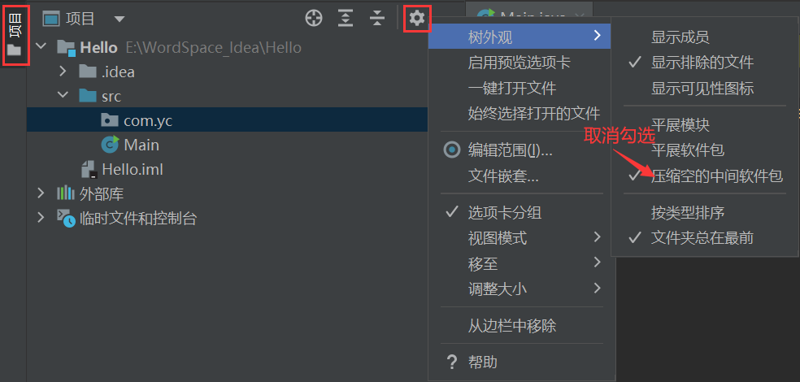

# IDEA配置与使用

## 一、中文语言包

在开始设置之前先安装好汉化语言包，毕竟俺还是习惯看中文哈

### 1.打开全局设置

### 2.安装中文语言包插件

## 二、基础设置

### 1.修改编码格式为UTF-8

①修改文件编码格式

②修改控制台编码格式

### 2.配置Maven

### 3.配置Git

### 4.生成序列化ID设置

序列化ID关系者是否能反序列化成功，所以十分重要

### 5.自动导包优化

### 6.引入同类包到指定个数时变为*

### 7.自动编译

### 8.断点调试

`Shared memory`是Windows特有的属性，内存占用相对较少，建议使用

### 9.项目选项卡展开显示

### 10.显示方法分割线

### 11.忽略大小写设置

### 12.字体设置

①修改程序字体

②修改界面字体

### 13.Ctrl+滚轮调节代码字体大小

### 14.主题色调节

### 15.设置背景图片

## 三、显示设置

### 1.显示IDEA内存使用情况

### 2.开启IDEA工具栏

### 3.设置包文件不压缩

### 4.HTML文件显示

①缩进修改

②解决`<body>`内标签不缩进

## 四、常用插件

### 1.Git相关

### 2.代码相关

------

### 3.前端相关

### 4.大数据相关

### 5.其他插件

> 最后附上一个详细使用的[学习地址](http://www.yaotu.net/biancheng/101686.html)

