# 类加载

## 一、JVM加载类的时机

> 在[JVM概述](/15.JVM/JVM概述)中讲解到字节码的加载流程，所以这个问题应该比较简单

**JVM在*初次主动*使用某类时被加载**，主动使用的情况如下

- **创建类实例**，如`new Class()`

- **访问静态变量或给静态变量赋值**，final修饰另外考虑

- **调用静态方法**，即使用字节码`invokestatic`指令

- **反射**，如`Class.forName("java.lang.String")`

- **初始化子类时，先初始化父类**，但这对接口不适用

  > 初始化类，不会先初始化其实现的接口
  >
  > 初始化接口，不会先初始化其父接口

- **接口定义default方法，初始化接口实现类前先初始化该接口**

- **JVM启动时，被标明为启动类的类**，包含main()

- **初次调用MethodHandle实例时，初始化该MethodHandle指向的方法所在的类**

## 二、类加载的过程

> 在[JVM概述](/15.JVM/JVM概述)中讲解到字节码的加载流程，类加载过程就是字节码加载流程

### 1.Loading(加载)

#### 1.1.加载理解

加载简而言之就是**查找类的二进制数据，生成字节码，将字节码加载到机器内存，并在内存中构建Java类原型(类模板对象)**

**类模板对象实际是Java类在JVM中的快照**，JVM从字节码文件中解析出常量池、类字段、类方法等信息存到类模板中，使JVM在运行期间能通过类模板获得Java类的任何信息，反射基于这一基础

#### 1.2.加载过程

- **通过全类名获取类的二进制数据**

- 解析类的二进制数据，成为**方法区中的数据结构(类模板对象)**

- **堆中创建java.lang.Class类实例，作为方法区该类数据的当问入口**

  > Class对象在类加载过程中创建，每个类对应一个Class对象，且Class对象的构造函数私有，只有JVM可创建

  > 注意数组类本身不是由类加载器负责创建，而是JVM运行时根据需要创建，但数组类的元素需要通过类加载器加载

  > 若输入数据不是ClassFile，抛出异常ClassFormatError

#### 1.3.二进制流的获取方式

- 文件系统读入.class文件（最常见）
- 运行时生成class二进制信息
- 读jar、zip等归档文件，提取类文件
- 实现放在数据库的二进制数据
- 使用协议通过网络加载

### 2.Linking(链接)

#### 2.1.Verification(验证)

**验证的目的是保证加载的字节码合法**，验证的步骤比较复杂，实际要验证的项目也很繁多，大概验证过程如下

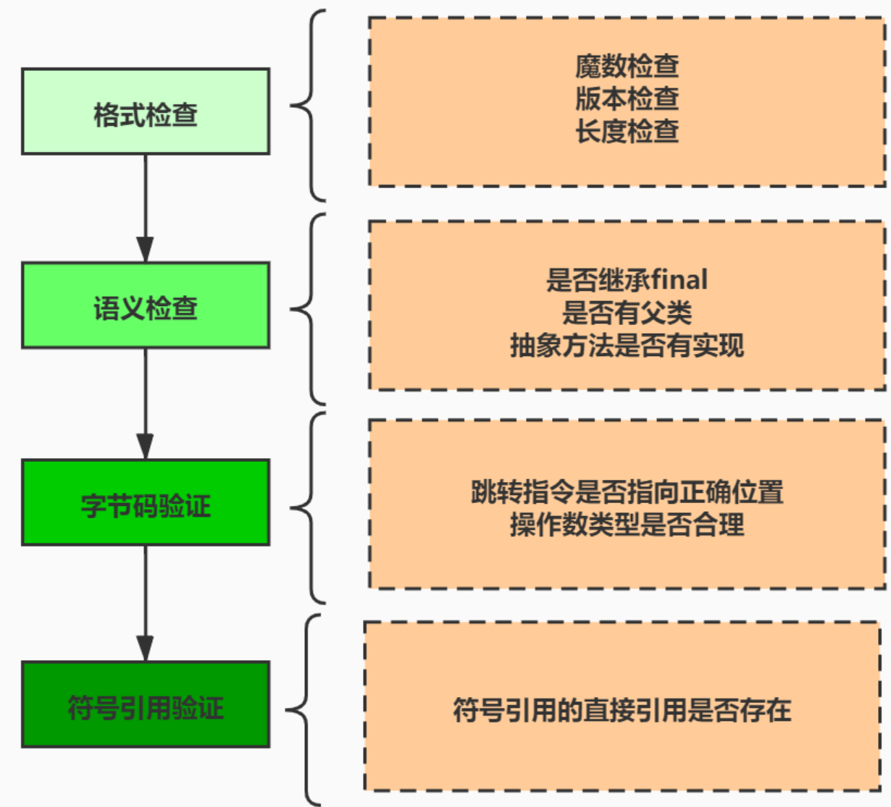

**其中格式验证会在加载阶段一起执行，验证通过后，类加载器才会将类的二进制数据加载到方法区**，其他验证会在方法区中进行，符号引用验证会在解析阶段执行

#### 2.2.Preparation(准备)

该阶段会**为类的静态变量分配内存，并将其初始化为默认值**，对于该阶段应注意以下几点

- Java不支持boolean类型，所以对于boolean类型内部实际是int，int默认值0所以对应于false
- 该阶段不包含static final类型的数据，因为final类型的数据在编译阶段就被分配(3.2中具体讲解)
- 该阶段不会为类的实例变量初始化，因为实例变量随着对象一起被分配到Java堆中
- 初始化为**默认值**，注意是默认值

#### 2.3.Resolution(解析)

该阶段**将类、接口、字段和方法的符号引用转为直接引用**

符号引用指字面量的引用，和VM的内部数据结构和内存布局无关，容易理解的是Class类文件通过常量池产生大量符号引用，**JVM为每个类都准备方法表，当调用某方法时只需要知道该方法在方法表中的偏移量即可直接调用，通过解析可将符号引用转变为目标方法在方法表中的位置**，从而使方法被成功调用

以println()为例，该方法被调用时，系统需要明确知道该方法的位置，`System.out.println()`方法的字节码为`invokevirtual #24 <java/io/PrintStream.println>`，对应的方法表如下

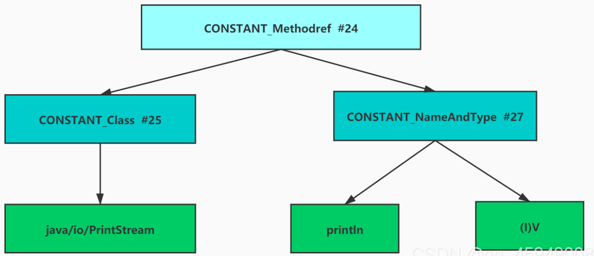

### 3.Initialization(初始化)

#### 3.1.初始化阶段

如果前面的步骤没有问题，表示类可以顺利的装载到系统中，此时类才会**开始执行Java字节码**，即**到达初始化阶段才真正开始执行类中定义的Java程序代码**，即**此阶段根据程序员编写的Java代码初始化`static`变量和资源(`static{}`)**

**初始化阶段的重要工作是执行类的初始化方法`<clinit>()`**，该方法只能由Java编译器生成，由JVM调用，程序员无法自定义该方法，更无法在程序中直接调用

> `<clinit>() `是类构造器方法，它与类的构造方法`<init>`有什么区别？
>
> `<init>()`：实例构造器方法，对非静态变量解析初始化，new对象时调用对象类的constructor方法时执`<init>()`，即实例化对象时调用
>
> > 实例化的四种途径：new、Class或Constructor 对象的newInstance()、任意对象的clone()、ObjectInputStream的getObject()反序列化
>
> `<clinit>()`：类构造器方法，对静态变量、静态代码块进行初始化，在类加载过程的初始化阶段JVM会执行`<clinit>()`

在加载类之前，JVM试图加载该类的父类，因此父类总是在子类之前被调用

#### 3.2.static final修饰的字段在哪个阶段被赋值？

**链接阶段的准备环节赋值(显式赋值)**

- 基本数据类型使用static final修饰，则显式赋值(直接赋值常量，而非调用方法)

```Java
public static final int i = 10;
```

- String使用static final修饰且使用字面量的方式赋值

```java
public static final String str = "hello";
```

**初始化阶段`<clinit>()`中赋值**

- 排除上述的在准备环节赋值的情况之外的情况

```java
public static int i = 10;
public static final int i = new Random().nextInt();

public static Integer i = Integer.valueOf(100);
public static final Integer i = Integer.valueOf(100);

public static String str = "hello";
public static final String str = new String("hello");
```

#### 3.3.`<clinit>()`的线程安全性

对于`<clinit>()`方法的调用，JVM会在内部确保其多线程环境中的安全性，即确保其被正确地加锁、同步，若多线程同时初始化某类，那么**只有一个线程可以执行该类的`<clinit>()`**，其他线程阻塞等待，但这同时也会带来多线程场景下加锁再来的问题，如进行耗时操作可能造成阻塞、死锁等，并且这种死锁很难发现

若之前的线程成功加载类，则等在队列中的线程就没有机会再执行`<clinit>()`，当需要使用该类时，JVM会直接返回给它己经准备好的信息

#### 3.4.主动使用与被动使用

**主动使用**：**JVM不会无条件地装载Class**，JVM规定类或接口在**初次使用前必须要进行初始化**，此处指的“使用”是指主动使用，主动使用只有如下情况，如果出现如下情况则会对类进行初始化操作

- **创建类实例**，如`new Class()`

- **访问静态变量或给静态变量赋值**，final修饰另外考虑

- **调用静态方法**，即使用字节码`invokestatic`指令

- **反射**，如`Class.forName("java.lang.String")`

- **初始化子类时，先初始化父类**，但这对接口不适用

  > 初始化类，不会先初始化其实现的接口
  >
  > 初始化接口，不会先初始化其父接口

- **接口定义default方法，初始化接口实现类前先初始化该接口**

- **JVM启动时，被标明为启动类的类**，包含main()

- **初次调用MethodHandle实例时，初始化该MethodHandle指向的方法所在的类**

**被动使用**：除以上情况外的其他都属于被动使用，**被动使用不会引起类初始化**，也就是说，代码中出现的类不一定都被加载或初始化，若不符合主动加载也不会被初始化

### 4.Using(使用)

任何类在使用前都要经过链接阶段(验证、准备、解析)，然后就等着开发人员使用

### 5.Unloading(卸载)

**类的生命周期何时结束，取决于该类Class对象何时结束生命周期**，当Class对象不再被引用，Class对象的生命周期结束，该类在方法区中的数据结构被卸载，举个鸡腿🍗

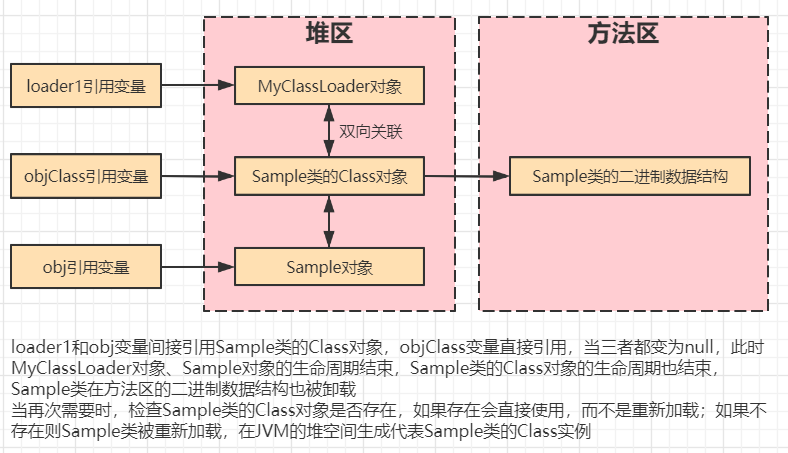

**已经加载的类被卸载的几率很小，至少被卸载的时间是不确定的**

## 三、JVM类加载器类型

### 1.Bootstrap ClassLoader(启动类加载器)

启动类加载器加载`jre/lib`下的核心jar包

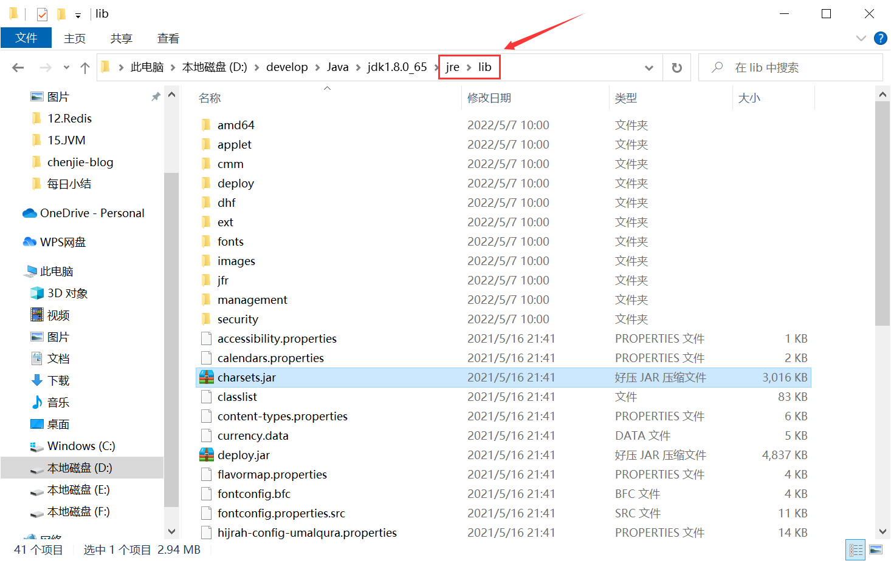

### 2.Extension ClassLoader(扩展类加载器)

扩展类加载器加载`jre/lib/ext`下的核心jar包


### 3.Application ClassLoader(应用程序类加载器)

应用程序类加载器加载`classpath`下的类库，即程序所在目录下的类库

### 4.验证三个类加载器的目标路径

#### 4.1.代码打印验证目标路径

①编写LoadPath

```java
package ClassLoaderPath;

import java.net.URL;
import java.net.URLClassLoader;

public class LoadPath {
	public static void main(String[] args) {
        System.out.println("启动类的加载路径");
        URL[] urls = sun.misc.Launcher.getBootstrapClassPath().getURLs();//C编写
        for (URL url : urls) {
            System.out.println(url);
        }
        System.out.println("----------------------------");
 
        //取得扩展类加载器
        URLClassLoader extClassLoader = (URLClassLoader) ClassLoader.getSystemClassLoader().getParent();
        System.out.println(extClassLoader);
        System.out.println("扩展类加载器的加载路径：");
        urls = extClassLoader.getURLs();
        for (URL url : urls) {
            System.out.println(url);
        }
        System.out.println("----------------------------");
 
 
        //取得应用程序类加载器
        URLClassLoader appClassLoader = (URLClassLoader) ClassLoader.getSystemClassLoader();
        System.out.println(appClassLoader);
        System.out.println("应用程序类加载器的加载路径：");
        urls = appClassLoader.getURLs();
        for (URL url : urls) {
            System.out.println(url);
        }
        System.out.println("----------------------------");
    }
}
```

②结果

```
启动类的加载路径
file:/D:/develop/Java/jdk1.8.0_65/jre/lib/resources.jar
file:/D:/develop/Java/jdk1.8.0_65/jre/lib/rt.jar
file:/D:/develop/Java/jdk1.8.0_65/jre/lib/sunrsasign.jar
file:/D:/develop/Java/jdk1.8.0_65/jre/lib/jsse.jar
file:/D:/develop/Java/jdk1.8.0_65/jre/lib/jce.jar
file:/D:/develop/Java/jdk1.8.0_65/jre/lib/charsets.jar
file:/D:/develop/Java/jdk1.8.0_65/jre/lib/jfr.jar
file:/D:/develop/Java/jdk1.8.0_65/jre/classes
----------------------------
sun.misc.Launcher$ExtClassLoader@2a139a55
扩展类加载器的加载路径：
file:/D:/develop/Java/jdk1.8.0_65/jre/lib/ext/access-bridge-64.jar
file:/D:/develop/Java/jdk1.8.0_65/jre/lib/ext/cldrdata.jar
file:/D:/develop/Java/jdk1.8.0_65/jre/lib/ext/dhf/
file:/D:/develop/Java/jdk1.8.0_65/jre/lib/ext/dnsns.jar
file:/D:/develop/Java/jdk1.8.0_65/jre/lib/ext/jaccess.jar
file:/D:/develop/Java/jdk1.8.0_65/jre/lib/ext/jfxrt.jar
file:/D:/develop/Java/jdk1.8.0_65/jre/lib/ext/localedata.jar
file:/D:/develop/Java/jdk1.8.0_65/jre/lib/ext/nashorn.jar
file:/D:/develop/Java/jdk1.8.0_65/jre/lib/ext/sunec.jar
file:/D:/develop/Java/jdk1.8.0_65/jre/lib/ext/sunjce_provider.jar
file:/D:/develop/Java/jdk1.8.0_65/jre/lib/ext/sunmscapi.jar
file:/D:/develop/Java/jdk1.8.0_65/jre/lib/ext/sunpkcs11.jar
file:/D:/develop/Java/jdk1.8.0_65/jre/lib/ext/zipfs.jar
----------------------------
sun.misc.Launcher$AppClassLoader@4e0e2f2a
应用程序类加载器的加载路径：
file:/E:/JAVASE_WordSpace/MyClassLoader/bin/
----------------------------
```

#### 4.2源码查看验证目标路径

Launcher为入口

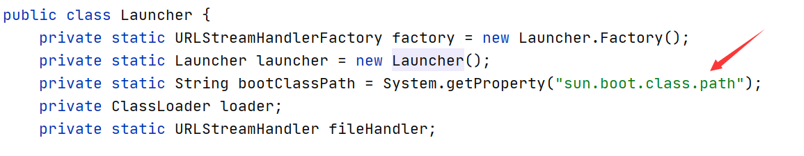

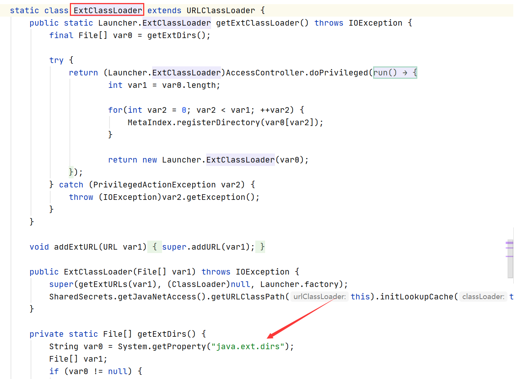

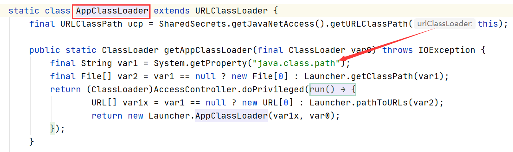

## 四、自定义类加载器

### 1.实现原理

**实现原理**是通过类名找到对应`.class`对象，将`.class`对象转为二进制数据，最后利用二进制数据生成Class对象

**代码实现原理**是继承`ClassLoader`类，重写`loadClass()`或`findClass()`，重写方法中调用父类`defineClass()`将二进制数据转为Class对象返回

> 重写loadClass()可能破环双亲委派机制

### 2.代码实现

①定义需要被自定义加载器加载的类MyTest（E:\JVM\MyClassLoader）

```java
public class MyTest {
    static {
        System.out.println("hello!!!");
    }
}
```

②编译MyTest.java得到.class文件

```cmd
C:\Users\CJ>e:

C:\Users\CJ>cd E:\JVM\MyClassLoader

E:\JVM\MyClassLoader>javac MyTest.java
```

③自定义类加载器MyClassLoader（eclipse）

```java
import java.io.BufferedInputStream;
import java.io.ByteArrayOutputStream;
import java.io.FileInputStream;
import java.io.IOException;
 
public class MyClassLoader extends ClassLoader{
    private String byteCodePath;//要加载的字节码文件的路径
    public MyClassLoader(String byteCodePath){
        this.byteCodePath = byteCodePath;
    }
	
    @Override
    protected Class<?> findClass(String name) throws ClassNotFoundException {
        String fileName = byteCodePath + name + ".class";//拼接要加载的字节码文件的绝对路径
		
        BufferedInputStream in = null;
        ByteArrayOutputStream out = null;
        try {
            in = new BufferedInputStream(new FileInputStream(fileName));//输入流读取.class文件
            out = new ByteArrayOutputStream();
			
            int len = 0;
            byte[] data = new byte[1024];//1kb
            while((len = in.read(data)) != -1){
                out.write(data,0,len);
            }
            byte[] bytes = out.toByteArray();//获取到字节码的二进制流
            Class<?> aClass = defineClass(null, bytes, 0, bytes.length);// 调用父类方法获取Class对象
            return aClass;
        }catch (Exception e){
            e.printStackTrace();
        }finally {
            // 释放资源
            if (in != null){
                try {
                    in.close();
                } catch (IOException e) {
                    e.printStackTrace();
                }
            }
            if (out != null){
                try {
                    out.close();
                } catch (IOException e) {
                    e.printStackTrace();
                }
            }
        }
        return null;
    }
}
```

④定义测试类（eclipse）

```java
package MyClassLoader;

public class Test {
    public static void main(String[] args)throws Exception {
		//1.构建自定义类加载器
        MyClassLoader myClassLoader = new MyClassLoader("E://JVM//MyClassLoader//"); //要加载的路径
        //2.通过.class文件获取Class对象
		Class<?> myTest = myClassLoader.findClass("MyTest");
		//注意主动使用加载器加载class文件不会触发类的初始化方法<clinit>()，所以需要通过创建对象的方式查看静态方法是否执行
		Object obj = myTest.getConstructor().newInstance(null);
    }
}
```

⑤结果在控制台输出`hello!!!`

## 五、双亲委派机制

### 1.什么是双亲委派？

**双亲委派机制**指当类加载器收到类加载请求时，该类加载器首先会把请求委派给父类加载器，每个类加载器都是如此，只有父类加载器在自己的搜索范围内找不到指定类时，子类加载器才会尝试自己去加载

### 2.双亲委派工作流程

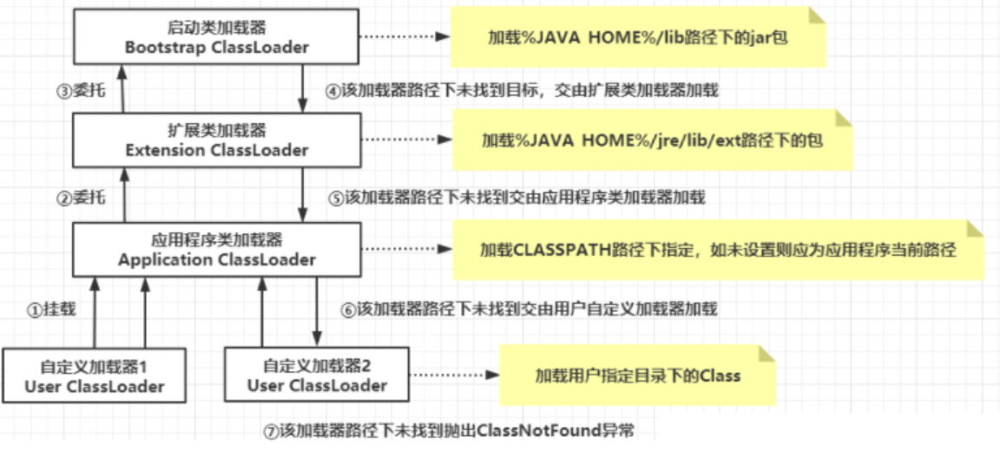

**首先判断类是否加载，若未加载交给双亲委派器加载**

- 当Application ClassLoader收到类加载请求时，他首先不会自己去尝试加载这个类，而是将这个请求委派给父类加载器Extension ClassLoader去完成
- 当Extension ClassLoader收到类加载请求时，他首先也不会自己去尝试加载这个类，而是将请求委派给父类加载器Bootstrap ClassLoader去完成
- 如果Bootstrap ClassLoader加载失败(在%JAVA_HOME%\lib中未找到所需类)，就会让Extension ClassLoader尝试加载
- 如果Extension ClassLoader也加载失败，就会使用Application ClassLoader加载

**若双亲委派器都没有加载成功，则使用自定义加载器去尝试加载(`findClass()`)**

**如果均加载失败，则抛出ClassNotFoundException异常**

### 3.双亲委派源码

```java
protected Class<?> loadClass(String name, boolean resolve)throws ClassNotFoundException{
        synchronized (getClassLoadingLock(name)) {
            //首先检查这个class是否已经加载过
            Class<?> c = findLoadedClass(name);
            //c==null表示没有加载
            if (c == null) {
                try {
                    if (parent != null) {//如果有父类的加载器则让父类加载器加载
                        c = parent.loadClass(name, false);
                    } else {//如果父类的加载器为空 则说明递归到bootStrapClassloader，因为这是C编
                        //bootStrapClassloader比较特殊无法通过get获取
                        c = findBootstrapClassOrNull(name);
                    }
                } catch (ClassNotFoundException e) {}
                
                //如果父类加载器仍然没有加载过，则递归回来尝试自己去加载class
                if (c == null) {
                    c = findClass(name);
                }
            }
            if (resolve) {
                resolveClass(c);
            }
            return c;
        }
    }
}
```

### 4.双清委派的作用

**保证安全性**：防止加载同一个`.class`，通过向上委托问一问是否加载过，加载过就不用再加载一遍

**保证唯一性**：核心`.class`不能被篡改，通过委托的方式不会篡改核心`.class`，试想若没有双亲委派机制，每个类加载器都自行加载，若用户编写了一个java.lang.Object的同名类放在ClassPath中，多个加载器都去加载Object，导致系统中Object各不相同，运行程序时出错

### 5.双亲委派的最大问题

**底层的类加载器无法加载底层的类**，这句话如何理解，以JDBC的DriverManager为例，请往下看👇

首先了解**JDBC的DriverManager与SPI机制**，JDBC4.0后无需通过`Class.forName()`加载驱动类，只需将驱动jar放在classpath路径下，驱动类被自动加载，是不是和Spring的SPI机制如出一辙

**SPI机制是一种服务发现机制，只需将接口实现类的全限定名配置在`META-INF/services/接口全限定名`文件下，并由服务加载器读取该文件，动态替换接口实现类，实现自动加载**

每个JDBC的jar包下都有一个`META-INF/services`目录，其中含`java.sql.Driver`文件，该文件中指定了`Driver`的实现类全限定名，有了SPI机制，只需通过如下代码可获取对应JDBC连接，而无需指定MySql还是Oracle的驱动

```java
Connection con = DriverManager.getConnection(url,username,password);
```

但是，DriverManager本身存在于`jre/lib/rt.jar`，属于Bootstrap ClassLoader，同时DriverManager会加载每个Driver接口的实现类并管理他们，而Driver接口的实现类(如`MySql Driver`)存于`classpath`下，属于Application ClassLoader，显然在Bootstrap ClassLoader中无法加载Driver接口的实现类，这就是**底层类加载器无法加载底层的类**，因此只能在DriverManager中**强行指定下层类加载器**加载Driver实现类，这将**打破双亲委机制**

通过查看DriverManager源码发现使用由启动类加载的DriverManager时触发器static块，进而加载`META-INF/services/java.sql.Driver`指定的类

```java
static {
    loadInitialDrivers();//进入该方法
    println("JDBC DriverManager initialized");
}
```

```java
private static void loadInitialDrivers() {
    AccessController.doPrivileged(new PrivilegedAction<Void>() {//AccessController：Java安全模型
        public Void run() {
            //接下来这一步是核心***
            ServiceLoader<Driver> loadedDrivers = ServiceLoader.load(Driver.class);//ServiceLoader就是JDK提供的SPI的实现方式，进入该方法
            Iterator<Driver> driversIterator = loadedDrivers.iterator();//将扫描到的Driver实现类装入迭代器
            try{
                while(driversIterator.hasNext()) {
                    driversIterator.next();//遍历每个Driver实现类，并触发每个Driver实现类的加载
                }
            } catch(Throwable t) {
              // Do nothing
            }
            return null;
        }
    });
}
```

```java
public static <S> ServiceLoader<S> load(Class<S> service) {
    //获取上下文类加载器，ContextClassLoader根据配置加载对应的类
    ClassLoader cl = Thread.currentThread().getContextClassLoader();
    return ServiceLoader.load(service, cl);
}
```

什么是ContextClassLoader？如代码所示，`sun.misc.Launcher`初始化时，加载AppClassLoader赋值给`this.loader`，`this.loader`被设置给ContextClassLoader，因此`Thread.currentThread().getContextClassLoader()`默认获取的就是AppClassLoader，当然开发者可自行更改

```java
public Launcher() {
    ...
    try {
        this.loader = Launcher.AppClassLoader.getAppClassLoader(var1);
    } catch (IOException var9) {
        throw new InternalError("Could not create application class loader", var9);
    }
    Thread.currentThread().setContextClassLoader(this.loader);
    ...
}
```

> 参考文章：[JDBC的SPI加载方式](https://blog.csdn.net/syh121/article/details/120274044)

### 6.破坏双亲委派的场景

双亲委派模式是默认的模式，但并非必须，以下场景破坏双亲委派

* **重写ClassLoader的loadClass()**，因为双亲委派的实现代码在此方法中，例如**Tomcat的WebappClassLoader**，WebappClassLoader重写`loadClass()`，先加载自己的Class，找不到再委托Parent，这样做有什么实际意义呢？七中讲解😘

- **JDBC、Dubbo、Eleasticsearch的SPI机制**，本节5中详细讲解到JDBC是如何破坏的
- OSGi(Karaf)的ClassLoader形成网状结构，根据需要自由加载Class

## 六、类加载器确保类在JVM中的唯一性

### 1.类加载器如何确保类在JVM中的唯一性？

书中这样说道👇

> 对于任意一个类，都需要由加载它的类加载器和这个类本身一同确立其在Java虚拟机中的唯一性，每一个类加载器，都拥有一个独立的类名称空间

也就是说比较两个类是否相等，只有在这两个类被同一类加载器加载的前提下才有意义，即**类+类加载器才唯一确定一个Java类**

### 2.两个类来自同一Class文件，被同一个JVM加载，这两个类一定相等吗？

不一定，还需要判断这两个类是否属于同一个类加载器

> 此处的相等包括Class的equals()、isAssignableFrom()、isInstance()方法的返回结果与instanceof关键字的判断结果

①编写测试代码

```java
package OnlyClassLoader;

import java.io.IOException;
import java.io.InputStream;

public class OnlyClassLoaderTest {
	public static void main(String[] args) throws Exception {
		ClassLoader myLoader = new ClassLoader() {
            @Override
            public Class<?> loadClass(String name) throws ClassNotFoundException {
                try {
                    String fileName=name.substring(name.lastIndexOf(".")+1)+".class";
                    InputStream is=getClass().getResourceAsStream(fileName);
                    if( is == null ){
                        return super.loadClass(name);
                    }
                    byte[] bytes = new byte[is.available()];
                    is.read(bytes); //通过自定义类加载器读取class文件的二进制流
                    return defineClass(name, bytes, 0,bytes.length);
                    
                } catch (IOException e) {
                    e.printStackTrace();
                    throw new ClassNotFoundException(name);
                }
            }
        };
        
        Object obj = myLoader.loadClass("OnlyClassLoader.OnlyClassLoaderTest").newInstance();
        System.out.println(obj.getClass());
        System.out.println(OnlyClassLoaderTest.class);
        System.out.println("------------------------");
        System.out.println("equals："+OnlyClassLoaderTest.class.equals(obj));
        System.out.println("isAssignableFrom："+OnlyClassLoaderTest.class.isAssignableFrom(obj.getClass()));
        System.out.println("isInstance："+OnlyClassLoaderTest.class.isInstance(obj));
        System.out.println(obj instanceof OnlyClassLoaderTest);
        System.out.println("------------------------");
        System.out.println(OnlyClassLoaderTest.class.getClassLoader());
        System.out.println(obj.getClass().getClassLoader());
	}
}
```

②输出结果

```
class OnlyClassLoader.OnlyClassLoaderTest
class OnlyClassLoader.OnlyClassLoaderTest
//这表明obj对象确实是OnlyClassLoader.OnlyClassLoaderTest实例出来的对象，来自同一个Class文件
------------------------
equals：false
isAssignableFrom：false
isInstance：false
false
//返回false是因为虚拟机中存在两个OnlyClassLoaderTest类，一个由应用程序类加载器加载，另一个由自定义类加载器加载，虽然二者都来自同一Class文件，但依然是两个独立的类，做对象所属类型检查时结果自然为false
------------------------
sun.misc.Launcher$AppClassLoader@4e0e2f2a
OnlyClassLoader.OnlyClassLoaderTest$1@6d06d69c
```

## 七、Tomcat的类加载器

### 1.为什么Tomcat需要自己的类加载器？

如果Tomcat类加载器机制和双亲委派机制一样会出现什么问题？

- **两个同名类无法被区分**：Tomcat的webapps目录下有两个应用，分别引入第三方jar：tool-1.0.jar和tool-2.0.jar，虽然jar的版本不同，但两个jar中都有MyTool.java类，若严格按照双亲委派机制可能导致两个应用中只有一个类会被加载，另一个已经加载过(全路径+类加载器相同)导致不会被加载，所以**要保证项目彼此隔离**
- **同一个类被多次加载**：两个项目都依赖Spring，当Spring的jar被加载到内存后，两个项目都加载一次Spring的jar，造成资源浪费，所以**要保证项目间能共享资源**
- **Tomcat本身有类，需要和项目的类进行隔离**

①编写两个MyTool

```java
package com.yc.MyTool;

class MyTool{	
	public static void say(){
		System.out.println("hello");
	}
	public static void main(String[] args) {
		say();
	}
}
```

```java
package com.yc.MyTool;

public class MyTool {
	public static void say(){
		System.out.println("world");
	}
	public static void main(String[] args) {
		say();
	}
}
```

②将两个Tool打成jar

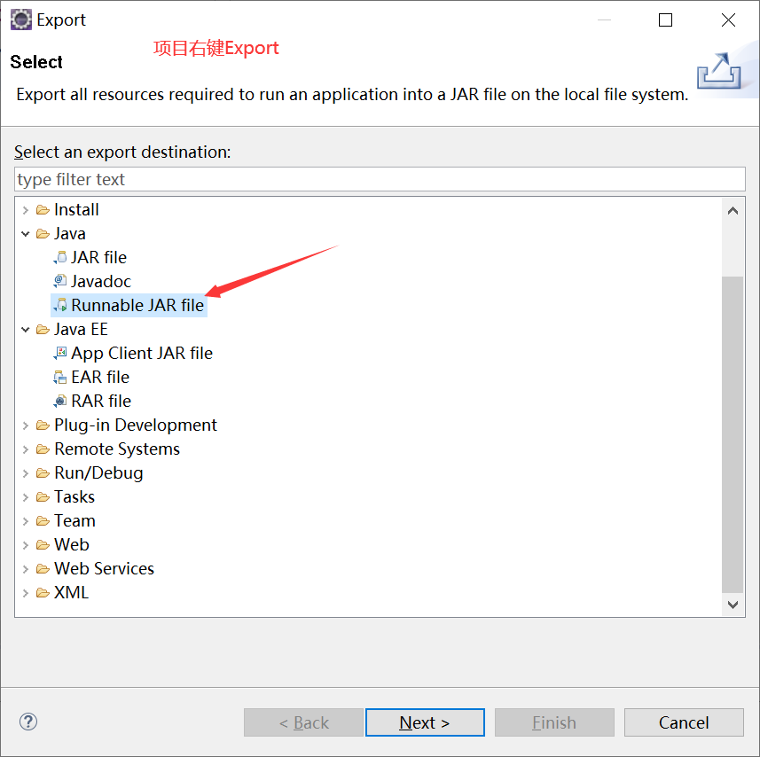

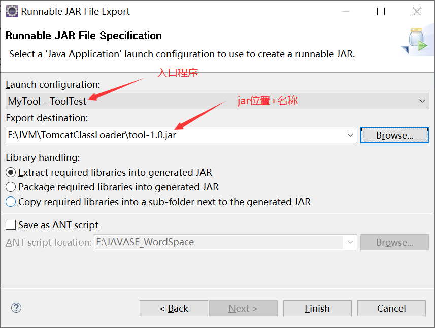

③创建普通Java项目，编写测试代码，导入两个jar，发现永远只输出hello

```
package MyToolTest;

import com.yc.MyTool.MyTool;

public class Test {
	public static void main(String[] args) {
		MyTool tool = new MyTool();
		tool.say();
	}
}
```

### 2.Tomcat的类加载器种类

三个基础类加载器+每个web应用的web类加载器，默认情况下三个基础类加载器都是同一个(Common)

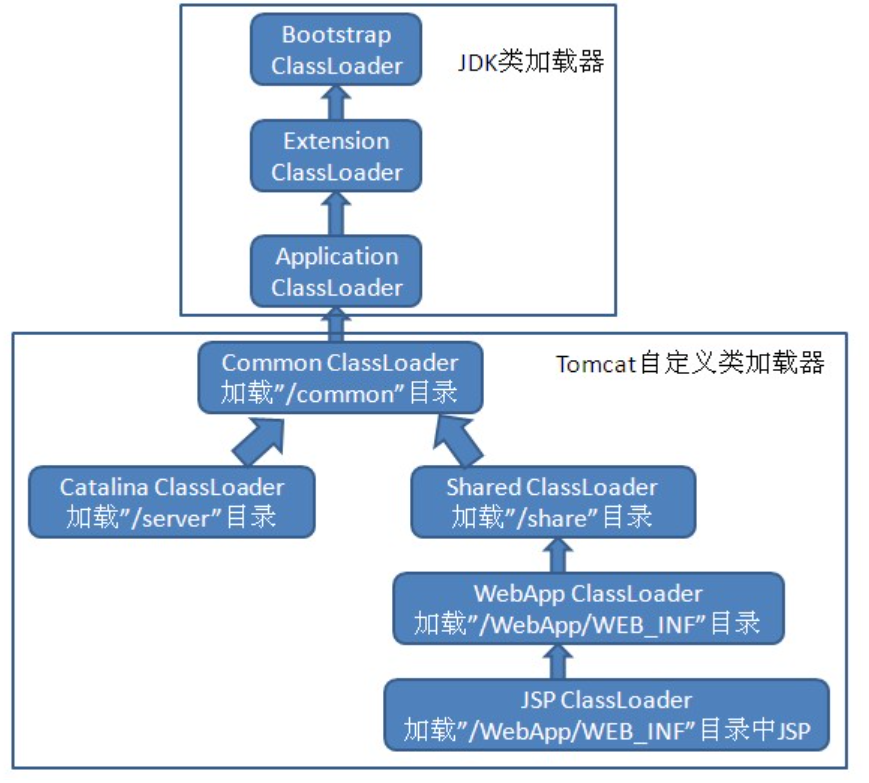

**Common ClassLoader**： 父类加载器是应用程序类加载器，是Tomcat顶层的公用类加载器，路径为common.loader，**负责加载Tomcat本身的类和Web应用都需要的类，如Servlet规范包等**

**Catalina ClassLoader**：父类加载器是Common加载器，路径为server.loader(默认为空)，**目的是隔离Tomcat本身的类和Web项目的类，负责加载Tomcat应用类，对Web应用不可见(解耦合)**

> 若需要共享采用父子关系，若需要隔离采用平行关系

**Shared ClassLoader**： 父类加载器是Common加载器，Shared ClassLoader作为WebApp ClassLoader的父加载器，路径为shared.loader(默认为空)，**负责加载Web应用共享的类，对Tomcat服务器不可见**

**WebApp ClassLoader**：父类加载器是Shared加载器，加载/WEB-INF/classes目录下未压缩的Class和资源文件以及/WEB-INF/lib下的jar包，**目的是隔离Web应用，区分类名相同的类，因为这些类所属的类加载器不同**

### 3.Tomcat类加载器设计优点

**共享性**：Common ClassLoader与Shared ClassLoader

**隔离性**：Catalina ClassLoader与WebApp ClassLoader

## 八、热替换

### 1.什么是热替换？

**热替换**：在不重启服务的情况下更改的代码生效，热替换可以提升开发以及调试的效率，基于Java类加载器实现，热加载的不安全性导致其一般不会用于正式的生产环境

### 2.热替换案例

通过**自定义类加载器**实现

①被动态替换的类

```java
package HotReplace;

public class Demo {
	public void hot() {
        System.out.println("OldDemo1"); // A:old class print
        //System.out.println("NewDemo1"); // B:new class print
    }
}
```

②自定义类加载器MyClassLoader

```java
package HotReplace;

import java.io.BufferedInputStream;
import java.io.ByteArrayOutputStream;
import java.io.FileInputStream;
import java.io.IOException;
 
public class MyClassLoader extends ClassLoader{
    private String byteCodePath;//要加载的字节码文件的路径
    public MyClassLoader(String byteCodePath){
        this.byteCodePath = byteCodePath;
    }
	
    @Override
    public Class<?> findClass(String name) throws ClassNotFoundException {
        String fileName = byteCodePath + name + ".class";//拼接要加载的字节码文件的绝对路径
		
        BufferedInputStream in = null;
        ByteArrayOutputStream out = null;
        try {
            in = new BufferedInputStream(new FileInputStream(fileName));//输入流读取.class文件
            out = new ByteArrayOutputStream();
			
            int len = 0;
            byte[] data = new byte[1024];//1kb
            while((len = in.read(data)) != -1){
                out.write(data,0,len);
            }
            byte[] bytes = out.toByteArray();//获取到字节码的二进制流
            Class<?> aClass = defineClass(null, bytes, 0, bytes.length);// 调用父类方法获取Class对象
            return aClass;
        }catch (Exception e){
            e.printStackTrace();
        }finally {
            // 释放资源
            if (in != null){
                try {
                    in.close();
                } catch (IOException e) {
                    e.printStackTrace();
                }
            }
            if (out != null){
                try {
                    out.close();
                } catch (IOException e) {
                    e.printStackTrace();
                }
            }
        }
        return null;
    }
}
```

③测试类

```java
package HotReplace;

import java.lang.reflect.InvocationTargetException;
import java.lang.reflect.Method;
import MyClassLoader.MyClassLoader;

public class Test {
	public static void main(String[] args) throws ClassNotFoundException, InstantiationException, IllegalAccessException, IllegalArgumentException, InvocationTargetException, NoSuchMethodException, SecurityException {
		while (true) {
            try {
            	//1.构建自定义类加载器
                MyClassLoader myClassLoader = new MyClassLoader("E://JAVASE_WordSpace//MyClassLoader//bin//HotReplace//"); //要加载的路径
                //2.通过.class文件获取Class对象
        		Class<?> myTest = myClassLoader.findClass("Demo");
        		//3.创建运行时类的实例
        		Object demo = myTest.getConstructor().newInstance(null);
        		//4.获取运行时类中指定的方法
        		Method m = myTest.getMethod("hot");
        		// 5. 调用指定的方法
                m.invoke(demo);
                
                Thread.sleep(5000);
            } catch (Exception e) {
                System.out.println("not find");
                try {
                    Thread.sleep(5000);
                } catch (InterruptedException ex) {
                    ex.printStackTrace();
                }
            }
        }
	}
}
```

④放开Demo中的第一句，运行Test，隔一段时间再放开Demo中的第二句，输出结果如下

```
OldDemo1
OldDemo1
NewDemo1
```

## 九、JVM防止非字节码文件加载到JVM

### 1.字节码文件详解

以下是字节码文件结构，**u4表示每项数据占4字节，u2表示没项数据占2字节**

```java
ClassFile {
    u4             magic;//Class文件的开头四个字节，存放魔术字，若魔术字是0xcafebabe则是Class文件
    //通过主次版本号可以按字典顺序对类文件格式版本进行排序
    u2             minor_version;//次版本号
    u2             major_version;//主版本号
    u2             constant_pool_count;
    cp_info        constant_pool[constant_pool_count-1];
    u2             access_flags;
    u2             this_class;
    u2             super_class;
    u2             interfaces_count;
    u2             interfaces[interfaces_count];
    u2             fields_count;
    field_info     fields[fields_count];
    u2             methods_count;
    method_info    methods[methods_count];
    u2             attributes_count;
    attribute_info attributes[attributes_count];
}
```

> 此处不详细讲解ClassFile每项的含义，贴出[参加文章](https://blog.csdn.net/m0_45270667/article/details/108884081)一枚，有时间再来看看

通过查看ClassFile文件结构可知，**JVM通过魔术字(CA FE BA BE)识别非字节码文件**

### 2.查看ClassFile文件

①编写一个简单的测试代码

```java
class Hello{
	public static void main(String []args){
		System.out.println("hello");
	}
}
```

②生成字节码：`javac Hello.java`

③PowerShell窗口输入`format-hex Hello.class`


## 十、案例探究

### 1.试从JVM层面分析以下代码运行时值变化过程

#### 1.1.分析num,number的值变化过程

```java
public class Test01 {
	private static int num = 2;
	private static int number = 10;
	
	static {
        number = 20;
        System.out.println(num);
    }

    public static void main(String[] args) {
        System.out.println(Test01.num);
        System.out.println(Test01.number);
    }
}
```

```
1.Linking之准备阶段会为num,number分配内存并赋值为默认值，顺序执行代码
	num = 0,number = 0
2.初始化阶段会执行类类初始化方法<clinit>()，初始化static，顺序执行代码
	num = 2,number = 10,static{number = 20,输出2}
3.使用阶段输出2和20
```

#### 1.2.分析x,y的值变化过程

```java
public class Test02 {
	public static void main(String[] args) {
        Singleton s = Singleton.getInstance();
        System.out.println(Singleton.x + "  " + Singleton.y);
    }
}

class Singleton {
    //private static Singleton singleton = new Singleton();

    public static int x = 0;
    public static int y;

    //private static Singleton singleton = new Singleton();

    private Singleton() {
        x++;
        y++;
    }

    public static Singleton getInstance() {
        return singleton;
    }
}
```

放开第一句注解

```
1.Test02经过加载、链接、初始化后终于到达使用阶段，执行main中方法(Test02没有static)，main方法中使用Singleton，接下来加载main方法中使用Singleton类
2.Linking之准备阶段会为singleton,x,y分配内存并赋值为默认值，顺序执行代码
	singleton = null,x = 0,y = 0
3.初始化阶段会执行类类初始化方法<clinit>()，初始化static，顺序执行代码
	singleton被new所以执行其构造方法{x = 1,y = 1},x = 0
4.使用阶段输出0和1
```

放开第二句注解

```
1.Test02经过加载、链接、初始化后终于到达使用阶段，执行main中方法(Test02没有static)，main方法中使用Singleton，接下来加载main方法中使用Singleton类
2.Linking之准备阶段会为x,y,singleton分配内存并赋值为默认值，顺序执行代码
	x = 0,y = 0,singleton = null
3.初始化阶段会执行类类初始化方法<clinit>()，初始化static，顺序执行代码
	x = 0,singleton被new所以执行其构造方法{x = 1,y = 1}
4.使用阶段输出1和1
```

### 2.输出类加载器的名称

```java
public class ClassLoaderTest {
    public static void main(String[] args) {
    	ClassLoader systemClassLoader = ClassLoader.getSystemClassLoader();
    	System.out.println(systemClassLoader);
    	
    	ClassLoader extClassLoader = systemClassLoader.getParent();
    	System.out.println(extClassLoader);
    	
    	ClassLoader bootstrapClassLoader = extClassLoader.getParent();
    	System.out.println(bootstrapClassLoader);
    	
    	ClassLoader classLoader = ClassLoaderTest.class.getClassLoader();
    	System.out.println(classLoader);
    	
    	ClassLoader classLoader1 = String.class.getClassLoader();
    	System.out.println(classLoader1);
	}
}
```

```
sun.misc.Launcher$AppClassLoader@4e0e2f2a
sun.misc.Launcher$ExtClassLoader@2a139a55
null	//启动类加载器由C++编写，通过getParent()获取不到
sun.misc.Launcher$AppClassLoader@4e0e2f2a
null	//String属于启动类加载器
```

### 3.四种获取ClassLoader的途径测试

```java
public class Test04 {
	public static void main(String[] args) {
        try {        
            //1.获取当前类的ClassLoader：Class.forName().getClassLoader()
            ClassLoader classLoader1 = Class.forName("java.lang.String").getClassLoader();
            System.out.println(classLoader1);//String类由启动类加载器加载，我们无法获取
            
	        //2.获取当前线程上下文的ClassLoader：Thread.currentThread().getContextClassLoader()
	        ClassLoader classLoader2 = Thread.currentThread().getContextClassLoader();
	        System.out.println(classLoader2);
	
	        //3.获取系统的ClassLoader：ClassLoader.getSystemClassLoader().getParent()
	        ClassLoader classLoader3 = ClassLoader.getSystemClassLoader();
	        System.out.println(classLoader3);
	        
	        //4.获取调用者的ClassLoader：DriverManager.getCallerClassLoader()
	        //ClassLoader classLoader4 = DriverManager.getCallerClassLoader()
	        //System.out.println(classLoader4);
	    } catch (ClassNotFoundException e) {
	        e.printStackTrace();
	    }
	}
}
```

```
null
sun.misc.Launcher$AppClassLoader@4e0e2f2a
sun.misc.Launcher$AppClassLoader@4e0e2f2a
```

### 4.测试双亲委派保证唯一性

①创建String类

```java
package java.lang;

public class String {
	static{
        System.out.println("我是自定义的String类的静态代码块");
    }
}
```

②编写StringTest类

```java
public class StringTest {
	public static void main(String[] args) {
        java.lang.String str = new java.lang.String();
	}
}
```

④结果报错

```java
Exception in thread "main" java.lang.SecurityException: Prohibited package name: java.lang
	at java.lang.ClassLoader.preDefineClass(ClassLoader.java:659)
	at java.lang.ClassLoader.defineClass(ClassLoader.java:758)
	at java.security.SecureClassLoader.defineClass(SecureClassLoader.java:142)
	at java.net.URLClassLoader.defineClass(URLClassLoader.java:467)
	at java.net.URLClassLoader.access$100(URLClassLoader.java:73)
	at java.net.URLClassLoader$1.run(URLClassLoader.java:368)
	at java.net.URLClassLoader$1.run(URLClassLoader.java:362)
	at java.security.AccessController.doPrivileged(Native Method)
	at java.net.URLClassLoader.findClass(URLClassLoader.java:361)
	at java.lang.ClassLoader.loadClass(ClassLoader.java:424)
	at sun.misc.Launcher$AppClassLoader.loadClass(Launcher.java:331)
	at java.lang.ClassLoader.loadClass(ClassLoader.java:357)
	at sun.launcher.LauncherHelper.checkAndLoadMain(LauncherHelper.java:495)
```

⑤修改String类

```java
package java.lang;

public class String {
	static{
        System.out.println("我是自定义的String类的静态代码块");
    }
	
	public static void main(String[] args) {
        System.out.println("hello,String");
    }
}
```

⑥结果同样报错

```java
Exception in thread "main" java.lang.SecurityException: Prohibited package name: java.lang
	at java.lang.ClassLoader.preDefineClass(ClassLoader.java:659)
	at java.lang.ClassLoader.defineClass(ClassLoader.java:758)
	at java.security.SecureClassLoader.defineClass(SecureClassLoader.java:142)
	at java.net.URLClassLoader.defineClass(URLClassLoader.java:467)
	at java.net.URLClassLoader.access$100(URLClassLoader.java:73)
	at java.net.URLClassLoader$1.run(URLClassLoader.java:368)
	at java.net.URLClassLoader$1.run(URLClassLoader.java:362)
	at java.security.AccessController.doPrivileged(Native Method)
	at java.net.URLClassLoader.findClass(URLClassLoader.java:361)
	at java.lang.ClassLoader.loadClass(ClassLoader.java:424)
	at sun.misc.Launcher$AppClassLoader.loadClass(Launcher.java:331)
	at java.lang.ClassLoader.loadClass(ClassLoader.java:357)
	at sun.launcher.LauncherHelper.checkAndLoadMain(LauncherHelper.java:495)
```

> **SecurityException**是安全异常，这种机制叫沙箱安全机制，什么是沙箱(sendbox)安全机制？
>
> 沙箱指一个限制程序运行的环境，沙箱机制指将Java代码限定在JVM特定运行范围内，防止本地系统被破坏

⑦尝试在java.lang下定义自己的类MyClass

```java
package java.lang;

public class MyClass {
	public static void main(String[] args) {
        System.out.println("hello!");
    }
}
```

⑧Error 初始化期间出错

```java
Error occurred during initialization of VM
Unable to allocate 64320KB bitmaps for parallel garbage collection for the requested 2058240KB heap.
```

