# Java语法

## 一、注释

注释是解释说明程序的文字，提高程序的阅读性，要养成**先写注释，提现思路，再写代码，实现思路**的注解思想，注解分为三类

* 单行注解：`// xxx`

* 多行注解：`/* xxx */`

* 文档注解：`/** xxx */`

  

> 编译器生成字节码之前会将注解抹去，所以字节码中不含注解

## 二、关键字

关键字指被JAVA语言赋予**特定含义**的单词，字母全部小写，高级记事本对关键字有不同颜色的标记

> `goto`和`const`是保留字

关键字无需记忆，有印象即可


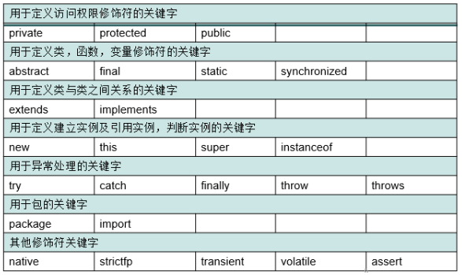

## 三、字面量

字面量告诉程序员数据在程序中的书写格式，分为以下几种

|    类型    |          说明          |    举例     |
| :--------: | :--------------------: | :---------: |
|  整数类型  |    不带小数点的数字    |  666、888   |
|  小数类型  |     带小数点的数字     | 13.4、14.3  |
| 字符串类型 |   双引号括起来的内容   | "HelloJava" |
|  字符类型  | 单引号括起来的一个内容 |  'A'、'B'   |
|  布尔类型  |    布尔值，表示真假    | true、false |
|   空类型   |       特殊值，空       |    null     |

## 四、变量

### 1.格式

变量指在一定范围内发生改变的量，定义格式是`数据类型 变量名 = 初始值;`

### 2.数据类型

Java是强类型语言，每种类型定义了不同大小的内存空间，所占空间大小不随硬件变化而变化，注意不要超过数据范围

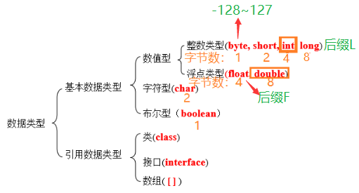


数据类型更加详细的总结如下

| 基本类型  | 位数 | 字节 | 默认值  |                  取值范围                  |
| :-------: | :--: | :--: | :-----: | :----------------------------------------: |
|  `byte`   |  8   |  1   |    0    |                 -128 ~ 127                 |
|  `short`  |  16  |  2   |    0    |               -32768 ~ 32767               |
|   `int`   |  32  |  4   |    0    |          -2147483648 ~ 2147483647          |
|  `long`   |  64  |  8   |   0L    | -9223372036854775808 ~ 9223372036854775807 |
|  `char`   |  16  |  2   | 'u0000' |                 0 ~ 65535                  |
|  `float`  |  32  |  4   |   0f    |           1.4E-45 ~ 3.4028235E38           |
| `double`  |  64  |  8   |   0d    |     4.9E-324 ~ 1.7976931348623157E308      |
| `boolean` |  1   |      |  false  |                true、false                 |

### 3.标识符

标识符是JAVA起名字时使用的字符序列，由`英文大小写字母`、`数字字符`、`$`、`_`组成，注意**不能以数字开头、不能是关键字、严格区分大小写**，常见的命名规则如下

- 包：`com.公司名.xxx`
- 类或接口：`OneTwo`
- 方法或变量：`oneTwo`
- 常量：`ONE_TWO`

### 4.键盘录入

Java帮助我们写好一个类`Scanner`可以接收键盘录入，分为以下几步


接收数据的类型有如下几种

* 整数：`int x = sc.nextInt();`
* 浮点型：`double x = sc.nextDouble();`
* 字符串：`String s = sc.nextLine();`

其中注意若先输入整数，回车后再输入字符串类型，则真正需要的字符串类型会被结束的回车覆盖，怎么解决呢？

* 先写字符串类型再写整数型
* 整数型输入语句后加上`sc.nextLine()`接收回车，再进行字符串类型的输入

## 五、计算机数据存储规则

### 1.进制

#### 1.1.进制由来

**任意数据都以二进制的形式存储在计算机中**，什么是二进制？


#### 1.2.进制表示

二进制：由`0、1`组成，`0b`开头

八进制：由`0、1、2、3、4、5、6、7`组成，`0`开头

十进制：由`0、1、2、3、4、5、6、7、8、9`组成

十六进制：由`0、1、2、3、4、5、6、7、8、9、a、b、c、d、e、f`组成，`0x`开头

#### 1.3.进制转换

**其他进制到十进制**：`系数 * 基数的权次幂 之和`

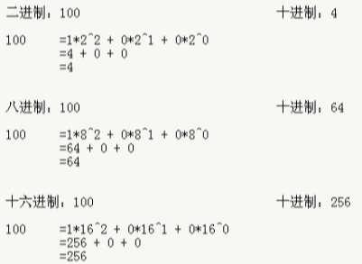

**十进制到其他进制**：除基数取余，直到商为0，余数反转


**8421码进制转换的快速转换法**：每个二进制位上的数据对应一个固定的值，只需要把对应位置的数据值相加即可

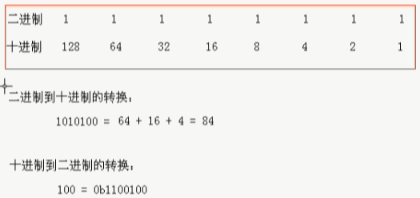

**任意进制的转换**：`x进制 -> 十进制 -> y进制`或拆分组合法

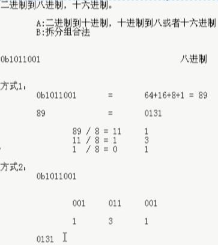

### 2.数据存储

计算机中一般存在三类数据，即**文本数据、图片数据、声音数据**，**任意数据都以二进制的形式存储在计算机中**

#### 2.1.文本数据

文本数据分为**数字、字母和汉字**


其中ASCII表如下，常用的`'a':97`、`'A':65`、`'0':48`


不同编码方式如下


#### 2.2.图片数据

图片数组分为**黑白图、灰度图和彩色图**，说到图片就想到**分辨率、像素、三原色**三个概念，那么他们分别是什么呢？

------

常见的分辨率有如下几种


以`1920x1080`为例，也就是说宽有1920个小格子，高有1080个小格子，那么整个显示器由这些小格子组成


------

每个小方格表示一个像素，为窗口设置大小以像素为单位


------

三原色分为美学三原色和光学三原色，计算机使用光学三原色


通过调和三原色的比例来得到不同的颜色


还可以通过十六进制进行调和


------

黑白图以像素点为单位，0或1表示有无颜色填充


灰度图同样以像素点为单位，使用灰度表数值填充像素点的灰度


彩色图还是以像素点为单位，在每个像素点内由光学三原色调和后填充


#### 2.3.声音数据

声音实际和声波有关，存储声音时会对声波采样，每个声波对应数字


那么某些音乐软件中的音质选择是怎么实现的呢？如果你氪金了，那么我会使用密集的点记录声波，进行最大程度的还原；没氪金，那么我会使用稀疏的点记录声波


#### 2.4.总结

通过学习，我们知道文本数据、图片数据、声音数据是如何存储的，那么视频数据呢？视频不就是由图片和声音组成嘛！

所以**任意数据都以二进制的形式存储在计算机中**

## 六、运算符

### 1.算术运算符

#### 1.1.基本使用


其中注意**整数相除只可以得到整数**，将任意操作数变成浮点数，即乘1.0可得小数


#### 1.2.高级使用(+)

数字相加：**相同类型的数字才能相加**，那么就涉及到类型转换的问题，类型转换又分为大变小、小变大

* **默认类型转换**(自动类型提升)，顾名思义小变大，且无需手动提升，由系统完成，转换顺序为`byte,short,char -> int -> long -> float -> double`

  * 取值范围不一样的数做运算时，小的会先提升为大的再运算

    

  * `byte,short,char`参与运算时，会直接提升为`int`再运算

    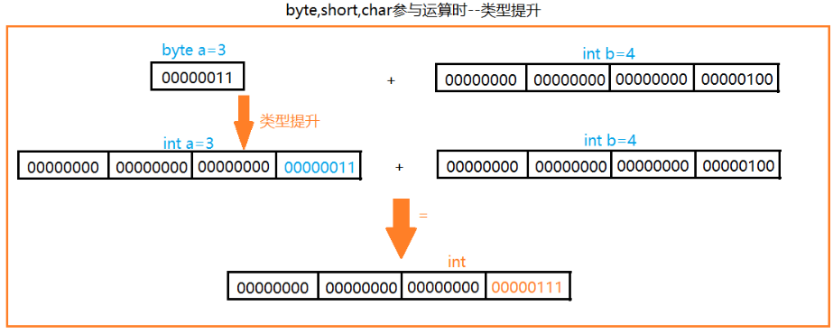

    

  * `boolean`不参与转换

* **强制类型转换**，由大转小，格式为`目标类型 变量名 = (目标类型)被转换的数据`，不要随意使用强制转换，隐含精度损失问题

  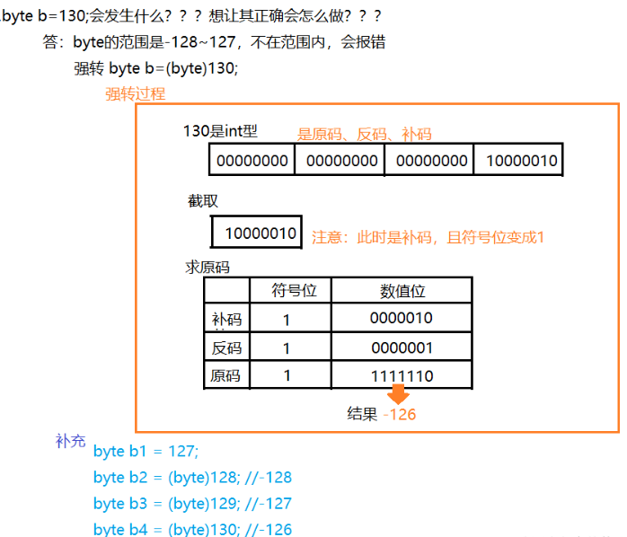

关于类型转换请思考以下几个问题

①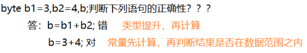

②

③

④

------

字符串相加

* 当`+`操作中出现字符串时，此时`+`为字符串连接符，而不是算数运算符了


* 连续`+`操作，从左到右逐个执行

  

* 练习：看代码写结果

  

------

字符相加：类型提升时提到，`byte,short,char`参与运算时，会直接提升为`int`再运算，所以存在以下规则

* 当`字符+字符`、`字符+数字`时，会先通过ASCII表查询相应的数字再计算

  

* 练习题

  ```java
  char c = '\u0061';//a 
  char d = '银'; 		
  > 输出语句中
  (c+d)//38231  
  (c+""+d)//a银
  
  char a='2'; 
  char b='3'; 		
  > 输出语句中
  (a+b+"")//101    
  (a+""+b)//23  
  (""+a+b)//23   
  (""+(a+b))//101
  ```

最后再看一个练习题


### 2.自增自减运算符


自增自减运算符可以写在变量前后，二者是不同的，**若`++`在前先`++`再执行，若`++`在后先执行再`++`👀**


`++`、`--`的运算对象可以为`char`型变量、`int`型变量和`float`型变量，但**不可以是常量**，`10++`是不行的

### 3.赋值运算符


请思考以下这个问题，其实**扩展的赋值运算符底层隐含强转**


### 4.比较运算符


比较的结果都是`boolean`类型，注意不要将`==`误写成`=`，`==`是判断，`=`是赋值

**字符串的比较不能使用`==`，而要用`equals()`👀**，因为`==`比较对象类型不管值相不相同，其对象指向相同即返回`true`

```java
String a1 = "a1";
String a2 = "a2";
a1==a2;//ture

String a1 = new String("a1");
String a2 = new String("a2");
a1==a2//false
    
//此处涉及常量池的问题，后面API部分讲解
```

### 5.逻辑运算符

#### 5.1.普通逻辑运算符

逻辑运算符用于连接`boolean`类型的表达式或值


#### 5.2.短路逻辑运算符

短路顾名思义就是**当左边的表达式不满足时，不再向后执行**，例如丈母娘看女婿，若女婿家需要有车有房才嫁女儿，那么如果女婿家没车，就无需再看有没有房了


短路逻辑运算符含以下几种，其中左右的表达式的结果均为`boolean`类型

* 对于`&&`，若左边表达式为`false`，则右边表达式不执行，整个表达式的结果为`false`
* 对于`||`，若左边表达式为`true`，则右边表达式不执行，整个表达式的结果为`true`

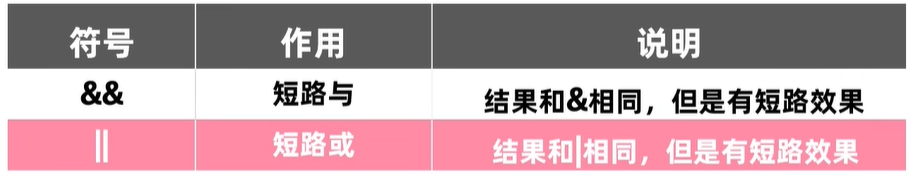

### 6.位运算符

#### 6.1.有符号数的表示法(原反补)

原码：最高位为符号位，0表示正，1表示负；其他为数值位


反码：正数原码和反码相同，负数在原码基础上数值位取反，**为解决原码不能计算负数的问题而出现**


补码：正数原码、反码和补码相同，负数在反码基础上加1


原码反码补码相关例题


#### 6.2.位运算符

位运算符**直接对二进制运算**，参与运算的都是补码，**正是因为位运算符都对二进制操作，所以其运算速度最快**

| 符号  |    作用    |                             说明                             |
| :---: | :--------: | :----------------------------------------------------------: |
|  `&`  |     与     |                            有0则0                            |
|  `|`  |     或     |                            有1则1                            |
|  `^`  |    异或    |            相同则0，不同则1，`a^b^b=a`，`a^b^a=b`            |
|  `~`  |    取反    |                          0取1，1取0                          |
| `<<`  |    左移    | 左边最高位丢弃，右边补齐0，相当于乘以2的n次幂，例如`1000<<2`结果为`100000` |
| `>>`  |    右移    | 最高位是0则左边补0，最高位是1则左边补1，相当于正数除以2的n次幂，例如`1000>>2`结果为`10` |
| `>>>` | 无符号右移 |                无论最高位是0还是1，左边补齐0                 |

位运算相关例题请解答


### 7.三目运算符

格式是`比较表达式?表达式1:表达式2`，比较表达式的值是`boolean`类型，若比较表达式结果是`true`，则取表达式1为三目表达式的结果，若比较表达式结果是`false`，则取表达式2为三目表达式的结果，请看如下案例


### 8.运算符优先级


## 七、流程控制语句

### 1.顺序结构

程序中最简单最基本的流程控制语句，按照代码的先后顺序依次执行


### 2.分支结构

#### 2.1.判断

`if`语句在程序组用于判断，存在以下三种结构


注意关系表达式的结果为`boolean`类型；三目运算都可以改写成`if`语句，但`if`语句不一定可以改为三目运算，因为三目运算结束后应该返回结果，而不是输出

#### 2.2.选择

`switch`语句在程序组用于选择，结构如下


表达式的取值可以是`byte`、`short`、`int`、`char`，JDK5以后可以是枚举，JDK7以后可以是`String`

`case`后出现的值需要和表达式结果相匹配，且只能是常量(字面量)，同时`case`后的值不能重复

`break`表示中断，用于结束`switch`语句，可以省略，但可能带来`case`穿透等问题


`default`在所有情况都不匹配时执行，可以省略，且可以放在任意位置，但是不论如何`case`都会在`default`前被执行，最后建议不要省略，建议放在最后！

`switch`语句的结束条件包括遇到`break`和执行到末尾两种情况，注意`default`不是结束标志

JDK12后`switch`语句的新写法

```java
switch(表达式){
	case 值1 -> {//break可以省略，不会存在case穿透
        语句体1;
    }
    case 值2 -> 语句体2;//语句体只有一条语句时，{}可以省略
    default -> {
        语句体3;
    }
}
```

### 3.循环结构

#### 3.1.for循环

`for`循环的执行流程是`执行初始化语句 -> 执行判断条件语句，true则继续执行，false则结束循环 -> 执行循环体语句 -> 执行控制条件语句 -> 返回到第二步`，其中初始化语句只被执行一次，判断条件语句的结果是`boolean`类型


`for(int x=1; ; )`循环内，`x`只在此次循环中起作用

增强`for`循环的格式是`for(元素数据类型 变量：数组名){}`，其底层存在判断解决长度溢出问题，增强`for`循环只能用于输出，而不可用于输入，二维数组的增强`for`循环如下

```java
int [][] arr = {{1,2,3},{4,5,6},{7,8,9}};
for(int[] aa:arr){
    for(int a:aa){
        System.out.print(a+"\t");
    }
    System.out.println("");
}
```

#### 3.2.while循环

`while`循环会先执行`()`中的判断条件语句，不论有没有进入循环体，判断条件语句都被执行


`for`与`while`可以等价转换，`for`适合范围内的循环，`while`适合循环次数不明确的循环

#### 3.3.do-while循环

`do—while`循环会先执行一次循环体，再判断是否满足条件判断语句


#### 3.4.小结

综上可知三种循环是可以相互转化的，`do-while`循环至少执行一次循环体，`for`、`while`循环先判断条件再决定是否执行循环体

注意修改控制条件，否则容易出现死循环


优先考虑`for`，再`while`，最后`do-while`

#### 3.5.跳转控制语句

`break`表示中断，作用于循环和`switch`语句中，离开此场景无意义，**用于跳出循环，直接执行整个循环语句以后的代码**

`continue`表示继续，作用于循环中，离开此场景无意义，**用于跳出单层循环，即结束本次循环，开始下一次循环**

`return`表示返回，会使程序不再继续执行

## 八、数组

### 1.什么是数组？

数组是一种容器，可以**用来存储同种数据类型的多个值**，该值既可以是基本数据类型，也可以是引用数据类型

> 数组操作时常见的异常有数组索引越界异常和空指针异常

### 2.格式

#### 2.1.一维数组定义格式

|        格式         |       案例        |               说明               |
| :-----------------: | :---------------: | :------------------------------: |
| `数据类型[] 数组名` | `int[] arr`(常用) | 定义一个`int`类型的数组`arr`变量 |
| `数据类型 数组名[]` |    `int arr[]`    | 定义一个`int`类型的`arr`数组变量 |

#### 2.2.二维数组定义格式

二维数组就是元素为一维数组的数组

|         格式          |        案例         |
| :-------------------: | :-----------------: |
| `数据类型[] 数组名[]` | `int[] arr[]`(常用) |
| `数据类型[][] 数组名` |    `int[][] arr`    |
| `数据类型 数组名[][]` |    `int arr[][]`    |

### 3.初始化

#### 3.1.初始化分类

Java中数组必须初始化后才可以使用，初始化就是在内存中为数组容器开辟空间，并将数据存入容器的过程，一共存在两种类型的初始化

- **静态初始化**：确定元素，既然元素确定了那么长度也确定了，所以是静态初始化
- **动态初始化**：确定长度，但元素不确定，所以是动态初始化

#### 3.2.一维数组初始化

| 初始化类型 | 格式类型 |                          格式                           |               案例                |
| :--------: | :------: | :-----------------------------------------------------: | :-------------------------------: |
| 静态初始化 | 完整格式 | `数据类型[] 数组名 = new 数据类型[]{元素1，元素2，...}` | `int[] arr = new int[]{11,22,33}` |
| 静态初始化 | 简化格式 |        `数据类型[] 数组名 = {元素1，元素2，...}`        |     `int[] arr = {11,22,33}`      |
| 动态初始化 |          |      `数据类型[] 数组名 = new 数据类型[数组长度]`       |     `int[] arr = new int[3]`      |

初始化格式解析


#### 3.3.二维数组初始化

| 初始化类型 | 格式类型 |                             格式                             |                         案例                         |
| :--------: | :------: | :----------------------------------------------------------: | :--------------------------------------------------: |
| 静态初始化 | 完整格式 | `数据类型[][] 数组名 = new 数据类型[][]{{元素1,...},{元素1,...},...}` | `int[][] arr = new int[][]{{1,2,3},{4,5,6},{7,8,9}}` |
| 静态初始化 | 简化格式 |    `数据类型[][] 数组名 = {{元素1,...},{元素1,...},...}`     |      `int[][] arr = {{1,2,3},{4,5,6},{7,8,9}}`       |
| 动态初始化 |          |          `数据类型[][] 数组名 = new 数据类型[m][n]`          |            `int[][] arr = new int[3][4]`             |
| 动态初始化 |          |          `数据类型[][] 数组名 = new 数据类型[m][]`           |             `int[][] arr = new int[3][]`             |
| 动态初始化 |          |          `数据类型 数组名[][] = new 数据类型[m][n]`          |            `int arr[][] = new int[3][4]`             |
| 动态初始化 |          |          `数据类型[] 数组名[] = new 数据类型[m][n]`          |            `int[] arr[] = new int[3][4]`             |

### 4.长度

一维数组长度`数组名.length`

二维数组长度，行长`数组名.length`，列长`数组名[行下标].length`

### 5.遍历


### 6.内存图解

#### 6.1.Java内存简介


#### 6.2.一维数组内存图解

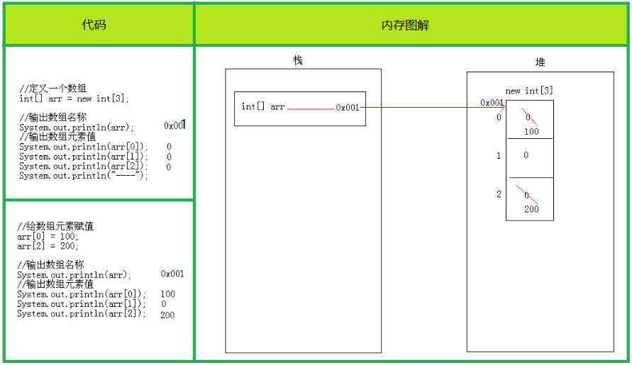


#### 6.3.二维数组内存图解


## 九、方法

### 1.什么是方法？

方法是程序中的最小执行单元，是完成特定功能的代码块，返回值是该代码块的执行结果，可提高代码复用性和可维护性

### 2.格式

方法通俗来说就是将某些代码**打包**在一起，需要的时候就**调用**，打包可视为方法定义，调用可视为方法调用

|        定义        |                  定义格式                  |                  调用格式                  |
| :----------------: | :----------------------------------------: | :----------------------------------------: |
|  最简单的方法定义  | 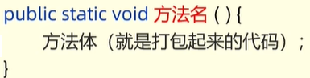 |                `方法名();`                 |
|  带参数的方法定义  | 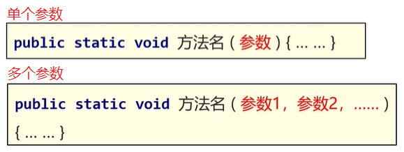 | 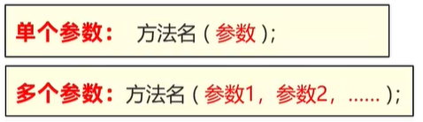 |
| 带返回值的方法定义 | 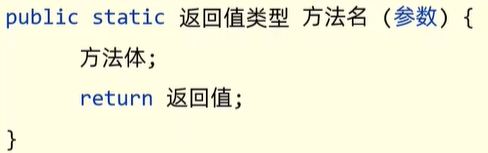 | 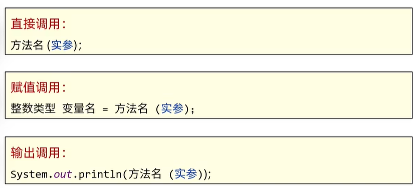 |

形参全称形式参数，指方法定义中的参数；实参全称实际参数，指方法调用中的参数，**方法调用时，形参和实参需一一对应**

### 3.说明

方法不调用就不会执行；方法间是平级关系，不可相互嵌套定义；方法的编写顺序和执行顺序无关；方法调用时不用再传递数据类型；方法返回值为`void`则无返回值，`return`可省略，也可以使用`return;`结束方法，方法有返回值则必须要`return`

### 4.重载

#### 4.1.引入

请思考以下使用场景，我们发现这些方法功能类似，但方法名会随着需求增多，取名成为了难题，出现问题就要解决，故出现重载


#### 4.2.定义

方法重载指**在同一类中定义多个同名方法，方法的功能相同，但每个方法的参数列表不同**，JAVA允许他们用一样的名字

简单来说，**同一类中，方法名相同，参数不同，与返回值无关的就叫重载**

参数不同存在三个方面的含义，即**个数不同、类型不同、顺序不同**


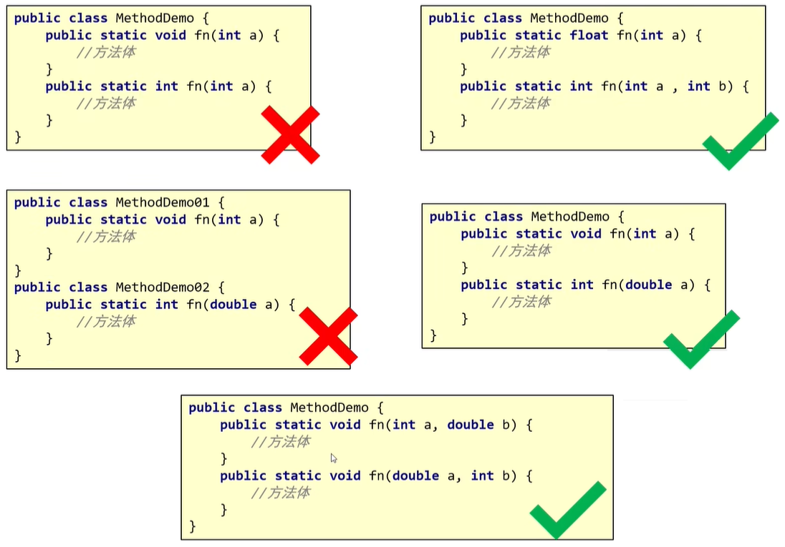

重载方法在调用时，虚拟机通过参数列表来区分同名方法	

------

重载会优先匹配固定参数还是可变参数的方法呢？优先匹配**固定参数**的方法，因为固定参数的方法匹配度更高

### 5.内存原理

方法按照调用顺序存于栈中，栈中先进先出，请看以下程序方法的调用

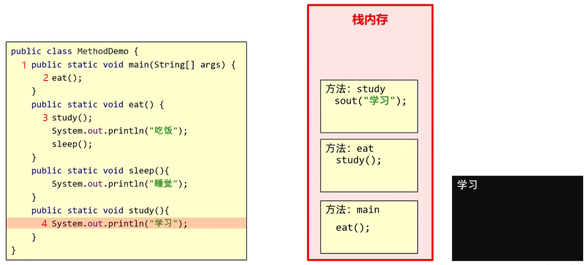


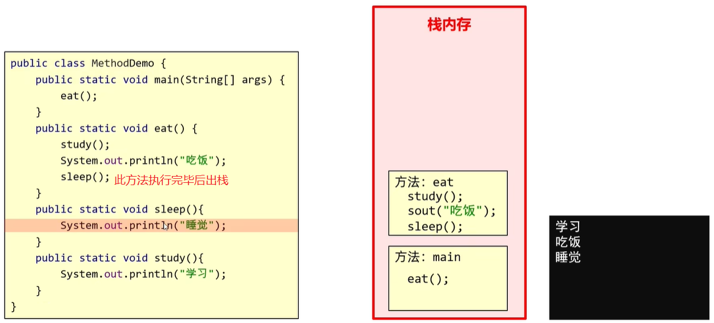

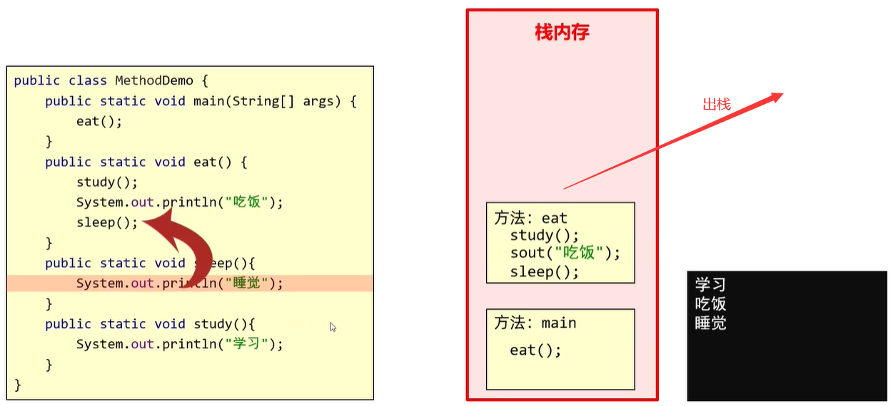

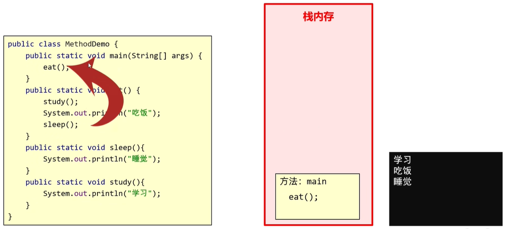


### 6.值传递

讲解值传递之前先从内存方面学习基本数据类型和引用数据类型

* 基本数据类型数据值存于自己的空间中，赋值给其他变量时也是赋的真实的值

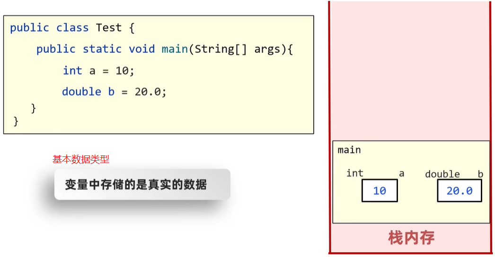

* 引用数据类型数据值存于其它空间中，自己的空间存的是地址值，赋值给其他变量时赋的是地址值

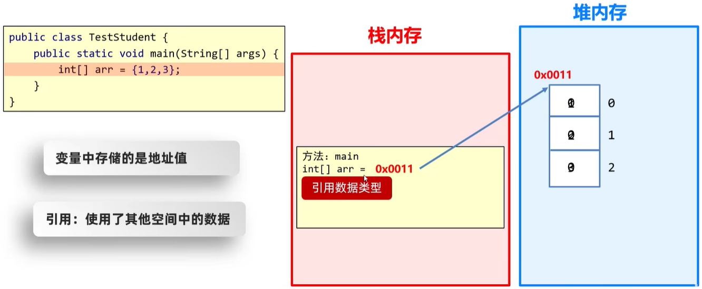

------

接下来看看值传递的过程吧

* 基本数据类型

  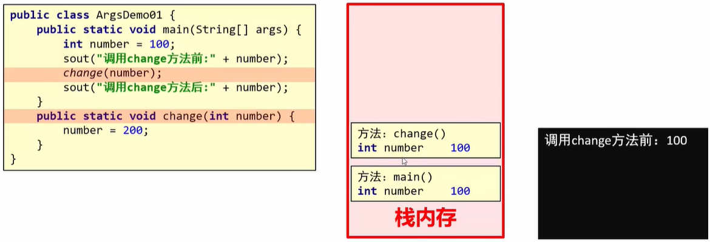

  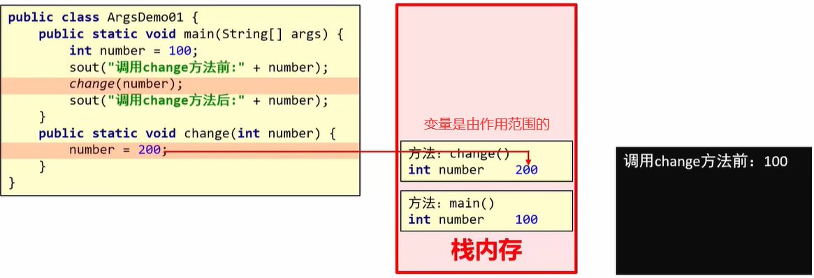

  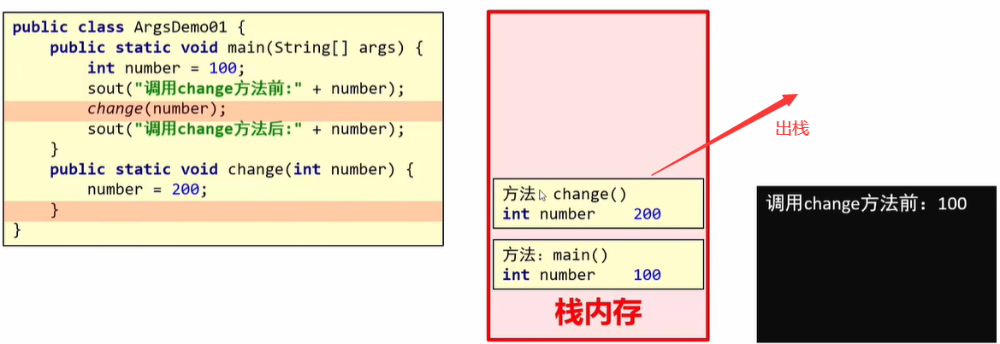

  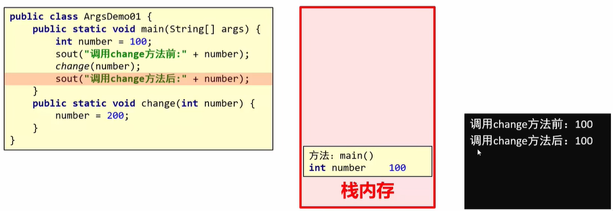

  

* 引用数据类型

  

  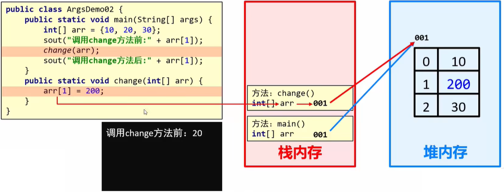

  

  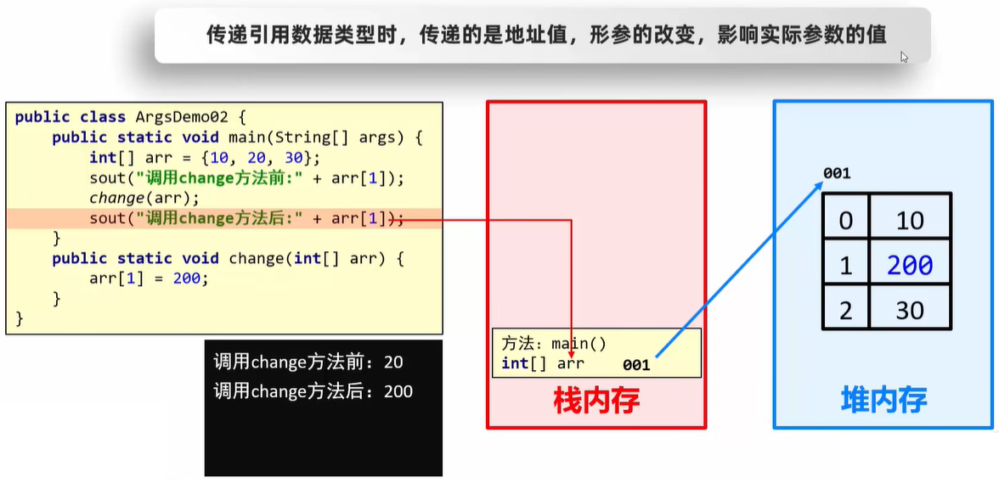

> 参考课程：[黑马程序员Java零基础视频教程(2022)](https://www.bilibili.com/video/BV17F411T7Ao?p=1&vd_source=8811945bf338927db8b1ca45a8f75a87)


