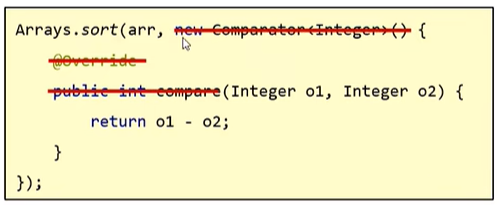
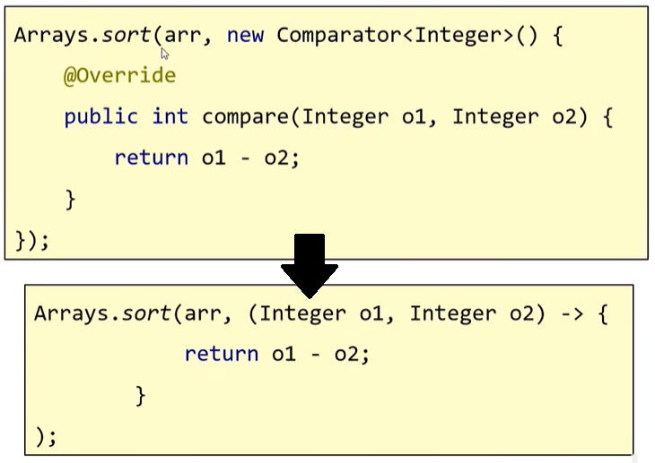

# lambda表达式

## 一、函数式编程

函数式编程是一种思想特点，忽略对象的复杂语法，**强调做什么，而不是谁去做**

lambda表达式就是函数式编程思想的体现

## 二、函数式接口

函数式接口指**有且仅有一个抽象方法的接口**，接口上方加上注解`@FunctionalInterface`

## 三、lambda表达式

lambda表达式是JDK8出现的一种新语法，注意**lambda表达式只可用来简化匿名内部类的书写**，但不是所有匿名内部类都可以简化，**只可简化函数式接口的匿名内部类**，简写格式是`(抽象方法的参数) -> {抽象方法的方法体}`，请看一个改写实例

lambda表达式还可以再省略

* 参数类型可省略
* 若只有一个参数则参数类型和`()`可省略
* 若方法体只有一行则`{}`、`;`、`return`可以**同时**省略

