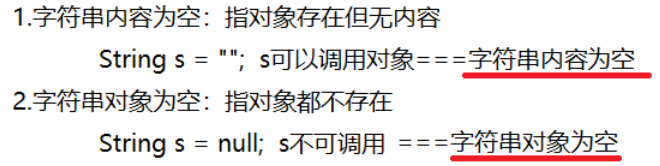
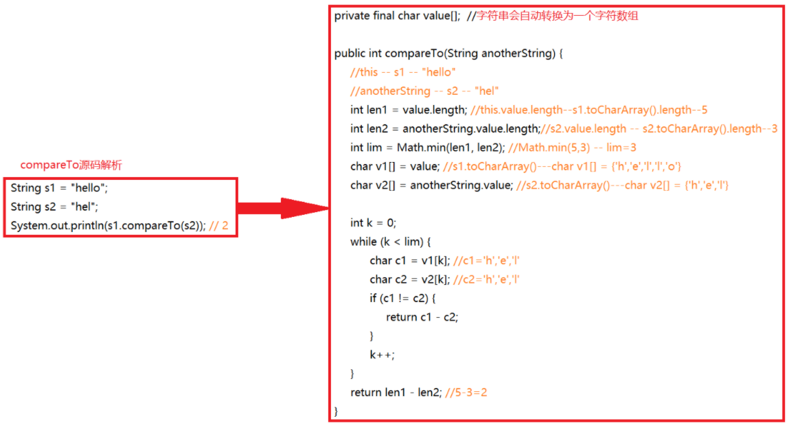
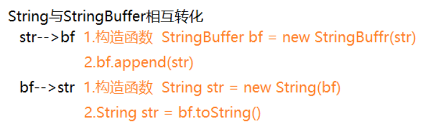

# 常用API

## 一、API

API全称Application Programming Interface，即应用程序编程接口，简单理解API就是别人已经写好的东西，直接用即可

Java API指的就是JDK中提供的各种Java类，这样的Java类太多，具体请参考帮助文档

## 二、字符串

### 1.String

#### 1.1.特点

`java.lang.String`表示字符串，例如`"abc"`，**Java中所有字符串文字都为字符串对象，包括字面量**，例如`String str = "abc"`

**特别注意字符串的内容是不能改变的，即一旦复制就不能改变**，底层使用`private final char[] ch`来保存字符串，`private`修饰不向外暴露，`final`修饰不能被子类继承

由于字符串不可变，所以可以认为字符串是常量，是线程安全的

#### 1.2.创建String对象

存在两种创建String对象的方式

* 直接赋值`String str = "abc"`

* 构造函数`String str = new String()`

  

在**内存的角度**再康康这几种创建方式的区别吧！

* 直接赋值，这里引入一个新的内存区域，即**字符串常量池**，**通过直接赋值的方式创建的字符串都存于字符串常量池中**，字符串常量池可以节约内存

  

* 构造函数

  

#### 1.3.比较方法

之前学习过`==`运算符，那么`==`比较的到底是什么内容呢？其实是分情况的


了解了`==`的判断规则，那么请看如下例题


但我此时就是想要**比较字符串对象的内容**是否相同怎么办？其实String类提供了两个方法，通过`String对象.方法(参数)`的方式调用

* `boolean equals(需比较的字符串)`：比较字符串内容是否相同，区分大小写
* `boolean equalsIgnoreCase(需比较的字符串)`：比较字符串内容是否相同，忽略大小写

`equals`重写自`Object`的`equals`方法，`Object`中的`equals`方法实际比较效果和`==`相同，但`String`中的`equals`方法重写后是实现了比较内容，`==`和`equals`的区别如下


#### 1.4.判断方法

返回的都是`Boolean类型`

|           函数           |         说明          |
| :----------------------: | :-------------------: |
| `startsWith(String str)` | 字符串是否以`str`开头 |
|  `endsWith(String str)`  | 字符串是否以`str`结尾 |
|       `isEmpty()`        |    字符串是否为空     |
|  `contains(String str)`  |  字符串是否包含`str`  |

#### 1.5.获取方法

|                  函数                   |                             说明                             |
| :-------------------------------------: | :----------------------------------------------------------: |
|             `int length()`              |                        获取字符串长度                        |
|        `char charAt(int index)`         |         获取指定`index`位置的字符，`index`以`0`开始          |
|          `int indexOf(int ch)`          | 获取指定字符第一次出现的`index`，此处参数为`int`类型，因为`'a'`和`97`都可以表示`'a'` |
|   `int indexOf(int ch,int fromIndex)`   |       获取指定字符从`formIndex`开始第一次出现的`index`       |
|        `int indexOf(String str)`        |              获取指定字符串第一次出现的`index`               |
| `int indexOf(String str,int fromIndex)` |      获取指定字符串从`formIndex`开始第一次出现的`index`      |

#### 1.6.转换方法

|                     函数                      |                        说明                        |
| :-------------------------------------------: | :------------------------------------------------: |
|            `String toLowerCase()`             |             将字符串转成小写的新字符串             |
|            `String toUpperCase()`             |             将字符串转成大写的新字符串             |
|         `byte[] getBytes(String str)`         |               将字符串转换为字节数字               |
|       `char[] toCharArray(String str)`        |               将字符串转换为字符数组               |
|       `static String valueOf(XXX xxx)`        |             将任意类型的数据转成字符串             |
|          `String concat(String str)`          |           将字符串与`str`拼接成新字符串            |
|         `String substring(int start)`         |        从`start`开始直到末尾截取成新字符串         |
|     `String substring(int start,int end)`     | 从`start`开始到`end`结束截取成新字符串，包左不包右 |
|    `String replace(char oldCh,char newCh)`    |           `newCh`替换`oldCh`后成新字符串           |
| `String replace(String oldStr,String newStr)` |          `newStr`替换`oldStr`后成新字符串          |
|                `String trim()`                |           去除字符串两端空格后成新字符串           |

### 2.StringBuilder

#### 2.1.特点

`StringBuilder`相当于容器，创建后**内容是可变的**，底层同样使用字符数组保存字符串，但未使用`private final`修饰，用于提高字符串的操作效率，为什么说`StringBuilder`可以提高效率？

* 原来使用`String s6 = s1 + s2 + s3 + s4 + s5`的方式，其中每`+`一次都会产生新的字符串，耗时废空间

* `StringBuilder`相当于容器，直接往里面丢就好，提高效率

  

`StringBuilder`是**线程不安全**的，底层没有加锁，同时效率也就更高

> 线程安全指同一时间只能被一个客户端操作，数据安全；线程不安全指的是同时被多个客户端操作，数据不安全

**字符串拼接符`+`底层使用的是`StringBuilder`的`append`，每次拼接都会创建`StringBuilder`对象，在6.1中详细讲解**

#### 2.2.创建StringBuilder对象

通过`new`的方式，存在两种`StringBuilder`构造函数

* `public StringBuilder()`
* `public StringBuilder(String str)`

#### 2.3.常见方法

|               函数               |             说明              |
| :------------------------------: | :---------------------------: |
| `StringBuilder append(任意类型)` |   添加数据，并返回对象本身    |
|    `StringBuilder reverse()`     |           反转数据            |
|          `int length()`          |           返回长度            |
|       `String toString()`        | 将`StringBuilder`转为`String` |

### 3.StringBuffer 

#### 3.1.特点

`StringBuffer `相当于容器，与`StringBuilder`类似，创建后**内容是可变的**，`StringBuilder`继承`AbstractStringBuilder`，底层同样使用字符数组保存字符串，但未使用`private final`修饰，底层方法加同步锁，**线程安全**

#### 3.2.创建StringBuffer对象

通过`new`的方式，存在三种`StringBuffer`构造函数

* `public StringBuffer()`

* `public StringBuffer(String str)`

* `public StringBuffer(int capacity)`：指定容量的字符串缓冲区对象

  > 容量指的是最多能放多少，长度指的是实际放了多少

#### 3.3.常见方法

|                         函数                         |                             说明                             |
| :--------------------------------------------------: | :----------------------------------------------------------: |
|           `Stringbuffer append(任意类型)`            |                   添加数据，并返回对象本身                   |
|      `Stringbuffer insert(int offset,任意数据)`      |          在`offset`插入任意类型数据，并返回对象本身          |
|               `StringBuffer reverse()`               |                           反转数据                           |
|        `StringBuffer deleteCharAt(int index)`        |             删除`index`处的字符，并返回对象本身              |
|       `StringBuffer delete(int start,int end)`       |         删除`[start,end)`间的字符串，并返回对象本身          |
| `StringBuffer replace(int start,int end,String str)` |      替换`[start,end)`间的字符串为`str`，并返回对象本身      |
|                   `int capacity()`                   | 缓冲区容量，默认`16`，带参数`str`创建实例时，容量为`默认容量+字符串长度` |
|                    `int length()`                    |                          缓冲区长度                          |

以上方法都是对`StringBuffer`本身进行操作，截取操作则不改变原对象`StringBuffer`，而是返回新`String`

* `String substring(int start)`
* `String substring(int start,int end)`

### 4.三者区别


### 5.StringJoiner

#### 5.1.引入

现在需要拼接一百万个字符串，使用字符串直接拼接的方式效率太慢，后来使用`StringBuilder`


使用`StringBuilder`后速度是快了，但是某些场景下还是比较麻烦的


开头需要`[`，结尾需要`]`，中间需要`,`，还是比较麻烦，使用`StringJoiner`就非常方便


#### 5.2.特点

`StringJoiner`和`StringBuilder`一样，也可以理解为容器，创建后内容可变，用于提高字符串操作效率，且代码更加简洁

#### 5.3.创建StringJoiner对象

通过`new`的方式，存在两种`StringJoiner`构造函数

- `public StringJoiner(间隔符号)`
- `public StringJoiner(间隔符号,开始符号,结束符号)`

#### 5.4.常见方法

|             函数             |             说明             |
| :--------------------------: | :--------------------------: |
| `StringJoiner add(任意数据)` |   添加数据，并返回对象本身   |
|        `int length()`        |           返回长度           |
|     `String toString()`      | 将`StringJoiner`转为`String` |

### 6.底层原理

#### 6.1.字符串拼接的底层原理

字符串拼接分成两种情况，请看

①无变量参与的情况


②有变量参与的情况

* 在JDK8以前，包含变量参与的字符串拼接实际会创建`StringBuilder`对象，调用其`append()`

  

  

* JDK8会预估字符串长度，形成数组后再转成字符串，解决每拼接一次就需要创建两个对象的问题，但是若存在多次拼接(上图)最好还是不要使用`+`，因为存在多次预估，使用`append()`更加高效

  

了解了字符串的拼接原理，请看以下面试题


#### 6.2.StringBuilder高效底层原理

`StringBuilder`是一个长度可变的容器，所有的内容都往里面塞，不会创建很多无用的空间，节约内存

#### 6.3.StringBuilder源码分析

先了解其扩容原理


来开始啃源码！

①创建默认容量为16的字符数组

```java
//按住Ctrl，鼠标点击StringBuilder
StringBuilder sb = new StringBuilder();
```

```java
public StringBuilder() {
    //super	*<1>*
    super(16);
}
```

```java
char[] value;
AbstractStringBuilder(int capacity) {
    //创建默认容量为16的字符数组
    value = new char[capacity];
}
```

②扩容部分主要就是在`append()`内体现，所以进入`append()`，`Ctrl+F12`选中`append(String)`

```java
@Override
public StringBuilder append(String str) {
    //append	*<1>*
    super.append(str);
    return this;
}
```

```java
int count;//实际长度
public AbstractStringBuilder append(String str) {
    if (str == null)//做非空判断
        //appendNull	*<2>*
        return appendNull();//拼接null返回当前对象
    
    int len = str.length();//字符串实际长度
    //ensureCapacityInternal(实际长度0 + 字符串长度 = 最小容量)	*<3>*
    ensureCapacityInternal(count + len);
    str.getChars(0, len, value, count);
    count += len;//实际长度
    return this;
}
```

```java
private AbstractStringBuilder appendNull() {
    int c = count;//实际长度，此处为默认值0
    ensureCapacityInternal(c + 4);//该方法暂时先不看
    final char[] value = this.value;//数字是对象，此处改变局部value，导致全局this.value也会变化
    value[c++] = 'n';
    value[c++] = 'u';
    value[c++] = 'l';
    value[c++] = 'l';
    count = c;//改变实际长度为null的长度4
    return this;//返回当前对象
}
//appendNull()完毕，请回到<2>继续向下
```

```java
private void ensureCapacityInternal(int minimumCapacity) {
    //判断需要的最小容量 > 实际容量[数组的长度]，表示需要扩容
    if (minimumCapacity - value.length > 0)
        //expandCapacity	*<4>*
        expandCapacity(minimumCapacity);//value扩容完毕
}
//ensureCapacityInternal()完毕，请回到<3>继续向下
```

```java
//此方法是扩容的关键逻辑
void expandCapacity(int minimumCapacity) {
    //新容量 = 原容量*2+2
    int newCapacity = value.length * 2 + 2;
    //若新容量 < 需要的最小容量，则直接按照需要的最小容量扩容
    if (newCapacity - minimumCapacity < 0)
        newCapacity = minimumCapacity;//新容量 = 需要的最小容量
    //若新容量<0，表示扩容以后的容量超出int范围，则直接将新容量设置为Integer.MAX_VALUE;
    if (newCapacity < 0) {
        //若所需的容量<0，表示所需的容量超出int范围，则抛出异常，因为无法再扩容了
        if (minimumCapacity < 0)
            throw new OutOfMemoryError();
        newCapacity = Integer.MAX_VALUE;
    }
    //确定好需要扩展的新容量则需要开始扩容了，走copyOf(原数组,新容量)	*<5>*
    value = Arrays.copyOf(value, newCapacity);//扩容后的新数组复制给value
}
//expandCapacity()完毕，请回到<4>继续向下
```

```java
public static char[] copyOf(char[] original, int newLength) {
    //创建新容量大小的数组
    char[] copy = new char[newLength];
    //调用System的arraycopy(原数组,起始位置,目标数组,起始位置,复制长度)
    System.arraycopy(original, 0, copy, 0,
                     Math.min(original.length, newLength));
    //返回扩容后的新数组
    return copy;
}
//copyOf()完毕，请回到<5>继续向下
```


JDK8新特性






