# Servlet

## 一、什么是Servlet？

Servlet是动态Web开发技术，运行于Tomcat中，用于**处理客户端请求并做出响应**

> 什么是静态网站？什么是动态网站？
>
> **静态网站**指无交互能力的网站，由HTML、CSS...组成
>
> 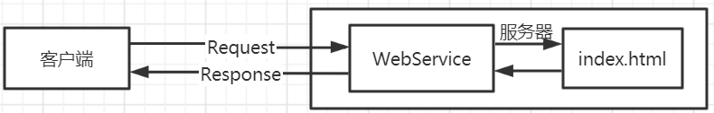
>
> **动态网站**当然就具有交互能力，会根据用户不同的操作做出不同响应
>
> 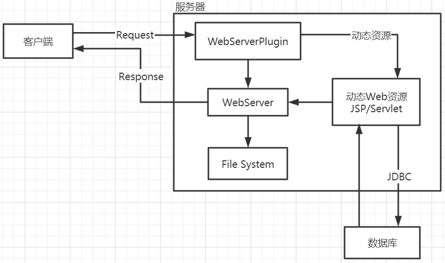

## 二、HelloServlet

### 1.学习

首先，第一个项目当然是不知道咋写的，那么我们可以先看看别人咋写的

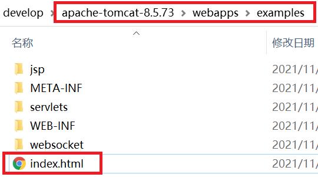

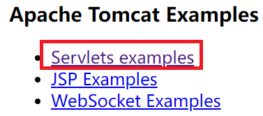

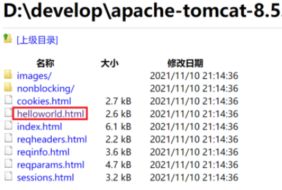

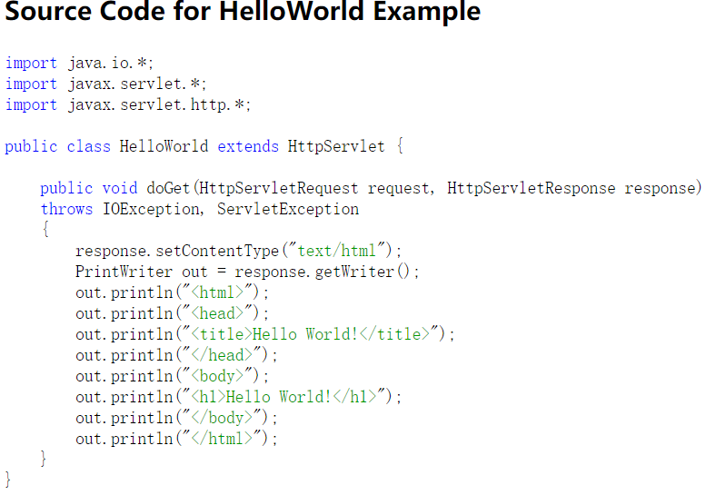

`xml`方案的相关配置，此处使用注解方案

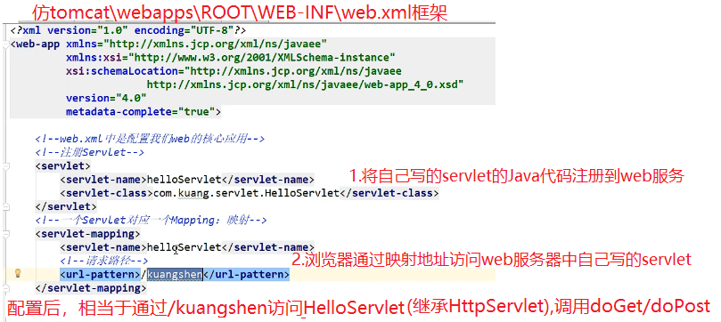

### 2.模仿

```java
/**
 * 接收一个请求
 * http://localhost:83/helloweb/hello.action
 */
//@WebServlet相当于上图的web.xml配置，此处使用注解方案，不使用xml方案
@WebServlet("/hello.action")//通知tomcat，要访问这个Java类必须使用hello.action
//支持通配符*，但用了通配符就不能使用/
public class Hello extends HttpServlet {//继承HttpServlet(满足J2E规范)
    @Override//重写方法，处理get请求
    protected void doGet(HttpServletRequest req, HttpServletResponse resp) throws ServletException, IOException {
    	//服务器的HttpServletRequest请求  --  HttpServletResponse响应
    	
        //利用输出流输出数据给客户端
        resp.setContentType("text/html;charset=utf-8");//设置响应信息(回送数据)的编码格式
        
        PrintWriter out = resp.getWriter();//响应输出流
        out.println("<html>");
        out.println("<head><meta charset='utf-8'><title>第一个</title></head>");//设置浏览器渲染页面时的编码
        out.println("<body>");
        out.println("<p style='color:red'>你好</p>");
        out.println("</body>");
        out.println("</html>");
    }
}	
```

乱码问题解决方案如下

* 开发者工具查出错，则服务器端乱码(响应信息，回送的数据乱码)：`resp.setContentType("text/html;charset=utf-8");`
* 开发者工具查无错，则服务器端是好的，但是界面乱码(服务器渲染时的乱码)：`<meta charset='utf-8'>`

### 3.继承结构

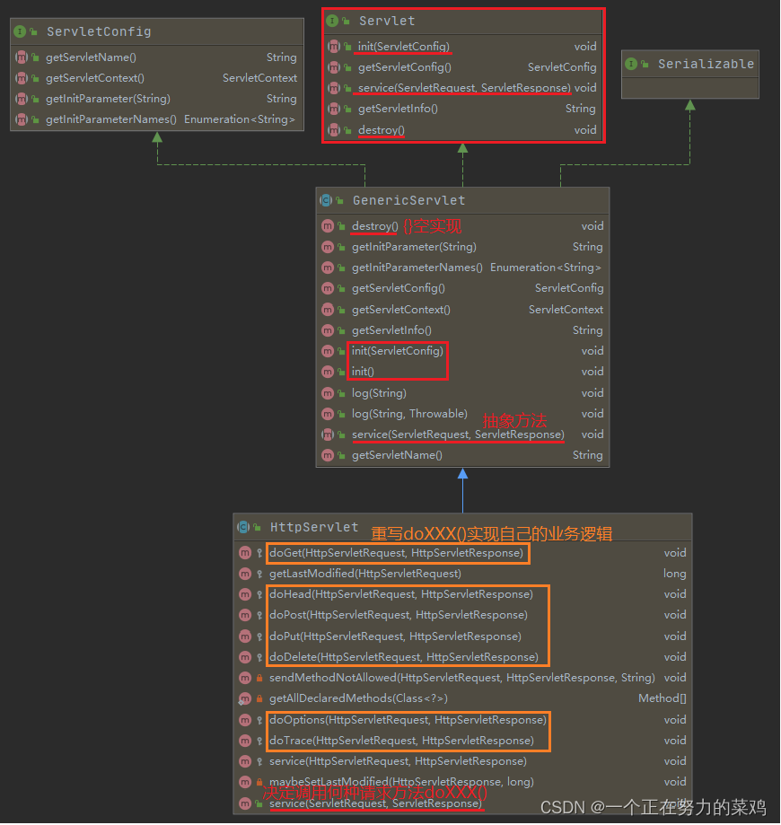

## 三、Servlet生命周期

### 1.调用顺序

第一次请求：`构造块->构造函数->init()->service()[方法体中使用super.service()判断请求方法get/post]->doGet()/doPost()`

第二次请求：`service()->doGet()/doPost()`

关闭容器时：`destroy()`

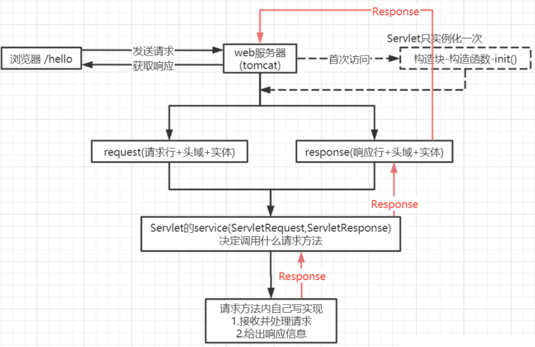

由上可知，**Servlet只实例化一次，即单例**，即项目重新启动时才会重新实例化，单例会使全局变量的值不确定，**线程不安全**，即每次请求的实例都是同一个，可以随时改变属性，应避免声明全局变量

### 2.测试

```java
@WebServlet("/Life.action")
public class LifeServlet extends HttpServlet {
    {
        System.out.println("1.构造代码块(实例块)");
    }

    public LifeServlet(){
        System.out.println("2.构造方法");
    }

    @Override
    public void init() throws ServletException {
        System.out.println("3.初始化init()");
    }

    @Override
    protected void service(HttpServletRequest req, HttpServletResponse resp) throws ServletException, IOException {
        System.out.println("4.service()");
        super.service(req, resp);//5.判断请求方法是post还是get
        //get--->doGet
        //post-->doPost
    }

    protected void doGet(HttpServletRequest request, HttpServletResponse response) throws ServletException, IOException {
        System.out.println("6.doGet");
    }

    @Override
    public void destroy() {
        //关闭容器时调用销毁方法destroy
        System.out.println("7.servlet销毁");
        super.destroy();
    }
}
```

## 四、ServletContext(上下文)

### 1.什么是ServletContext？

当Web启动时，为每个Web程序创建一个ServletContext，代表当前的Web容器，其中Web程序相当于与IDEA中的模块，为每个模块分配Tomcat服务器，而Servlet是程序中继承HttpServlet的子类，ServletContext被每个Servlet共享，测试代码如下

```java
//设置
@WebServlet("/setParam")
public class TestSet extends HttpServlet {
    @Override
    protected void doGet(HttpServletRequest req, HttpServletResponse resp) throws ServletException, IOException {
        doPost(req,resp);
    }

    @Override
    protected void doPost(HttpServletRequest req, HttpServletResponse resp) throws ServletException, IOException {
        User user = new User(1,"user_1");

        ServletContext context = this.getServletContext();
        context.setAttribute("user",user);
        System.out.println("设置成功");
    }
}
//获取
@WebServlet("/getParam")
public class TestGet extends HttpServlet {
    @Override
    protected void doGet(HttpServletRequest req, HttpServletResponse resp) throws ServletException, IOException {
        doPost(req,resp);
    }

    @Override
    protected void doPost(HttpServletRequest req, HttpServletResponse resp) throws ServletException, IOException {
        ServletContext context = this.getServletContext();
        User user = (User) context.getAttribute("user");
        System.out.println("获取成功");
    }
}
```

### 2.初始化参数getInitParameter

```java
@WebServlet(value = "/initParam", initParams = {
        @WebInitParam(name = "param1", value = "value1"),
        @WebInitParam(name = "param2", value = "value2")})
public class InitParam extends HttpServlet {
    private static final long serialVersionUID = -2544944226847467362L;

    @Override
    protected void doGet(HttpServletRequest req, HttpServletResponse resp) throws ServletException, IOException {
        doPost(req, resp);
    }

    @Override
    protected void doPost(HttpServletRequest req, HttpServletResponse resp) throws ServletException, IOException {
        ServletContext context = this.getServletContext();
        String param1 = context.getInitParameter("param1");
        String param2 = context.getInitParameter("param2");
        System.out.println(param1);
        System.out.println(param2);
        System.out.println(this.getInitParameter("param1"));
        System.out.println(this.getInitParameter("param2"));
    }
}
```

### 3.请求转发getRequestDispatcher

```java
@WebServlet("/dispatcher")
public class RequestDispatcherTest extends HttpServlet {
    @Override
    protected void doGet(HttpServletRequest req, HttpServletResponse resp) throws ServletException, IOException {
        doPost(req,resp);
    }

    @Override
    protected void doPost(HttpServletRequest req, HttpServletResponse resp) throws ServletException, IOException {
        ServletContext context = this.getServletContext();
        RequestDispatcher dispatcher = context.getRequestDispatcher("/getParam");//请求转发路径
        dispatcher.forward(req,resp);//实现请求转发
    }
}
```

## 五、HttpServletRequest

### 1.获取请求参数

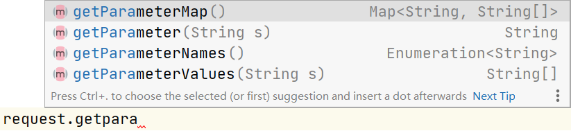

### 2.请求转发

```java
@WebServlet("/dispatcher")
public class RequestDispatcherTest extends HttpServlet {
    private static final long serialVersionUID = -7201234341565285787L;

    @Override
    protected void doGet(HttpServletRequest req, HttpServletResponse resp) throws ServletException, IOException {
        doPost(req, resp);
    }

    @Override
    protected void doPost(HttpServletRequest req, HttpServletResponse resp) throws ServletException, IOException {
        RequestDispatcher dispatcher = req.getRequestDispatcher("/yzm");//请求转发路径
        dispatcher.forward(req, resp);//实现请求转发
    }
}
```

### 3.其他方法

```java
@WebServlet("/method.action")
public class RequestMethodTest extends HttpServlet {
    @Override
    protected void doPost(HttpServletRequest request, HttpServletResponse response) throws ServletException, IOException {
        System.out.println("getRequestURL:" + request.getRequestURL());//定位符 http://locahost:81/res/xxx.action
        System.out.println("getRequestURI:" + request.getRequestURI());//标识符 /res/xxx.action
        System.out.println("getContextPath:" + request.getContextPath());//路径 /res
        System.out.println("getPathInfo:" + request.getPathInfo());
        System.out.println("getQueryString:" + request.getQueryString());//地址栏参数  name=x&sex=a
        System.out.println("getParameterMap:" + request.getParameterMap());//只要是参数就全部拿到
        System.out.println("用户名:" + request.getParameter("uname"));
    }
}
```

**方法中`URL`和`URI`是啥？？**

* `URL`指统一资源定位符，平时上网的网址就是`URL`，是`URI`命名机制的子集，表示具体的`URI`，语法格式是`protocol://hostname[:port]/path/[:parameters][?query]#fragment`，即`协议://主机名[:端口]/路径/[:参数][?请求字符串]#锚机`

> http默认端口号80，https默认端口号443

* `URI`指统一资源标识符，表示Web上的可用资源，如文档、图片、视频等，语法格式是`访问资源的命名机制+存放资源的主机名+资源自身的名称，用路劲表示`，如某图片的`URI`是`content://media/external/images/media/4`，所有图片的`URI`是`content://media/external`

## 六、HttpServletResponse

### 1.输出消息到浏览器

```java
resp.setContentType("text/html;charset=utf-8");
PrintWriter out = resp.getWriter();
out.println("xxxxx");
```

### 2.下载文件

```java
//下载文件,将本地的文件响应给浏览器，在浏览器中下载
@WebServlet("/downFile")
public class DownFile extends HttpServlet {
    @Override
    protected void doGet(HttpServletRequest req, HttpServletResponse resp) throws ServletException, IOException {
        this.doPost(req,resp);
    }

    @Override
    protected void doPost(HttpServletRequest req, HttpServletResponse resp) throws ServletException, IOException {
        //1.文件下载路径——本地文件路径
        String path = "E:/IdeaProjects/web/webstudy/src/com/yc/web/servlets/T3_HttpServletResponse/7.jpg";
        //2.文件名——浏览器下载的文件名
        String filename = path.substring(path.lastIndexOf("/")+1);
        //3.获取文件流
        FileInputStream fin = new FileInputStream(path);
        //4.设置缓冲区
        byte[] bytes = new byte[1024];
        //5.设置响应头，使浏览器支持文件响应
        resp.setHeader("Content-Disposition","attachment;filename="+ URLEncoder.encode(filename,"UTF-8"));
            //不用记，使用时去查对应的头
            //URLEncoder.encode("Chen",utf-8)：设置编码，防止中文乱码
        	//URLDecoder.decode("Chen",utf-8)：解码
        //6.获取响应流
        OutputStream out = resp.getOutputStream();
        //7.发送响应
        int len = 0;
        while ((len=fin.read(bytes))>0){
            out.write(bytes,0,len);
        }
        fin.close();
        out.close();
    }
}
```

### 3.手工实现验证码

```java
//最原始的方式生成验证码
@WebServlet("/yzm")
public class YZM extends HttpServlet {
    @Override
    protected void doGet(HttpServletRequest req, HttpServletResponse resp) throws ServletException, IOException {
        this.doPost(req,resp);
    }

    @Override
    protected void doPost(HttpServletRequest req, HttpServletResponse resp) throws ServletException, IOException {
        //响应三秒刷新一次
        resp.setHeader("refresh","3");

        //以下是最原始的生成验证码的方式
        //1.在内存中创建图片
        BufferedImage image = new BufferedImage(80,20,BufferedImage.TYPE_INT_RGB);
        //2.得到2D图片
        Graphics2D graphics2D = (Graphics2D) image.getGraphics();//笔
        //3.设置背景颜色
        graphics2D.setColor(Color.WHITE);//设置笔颜色
        graphics2D.fillRect(0,0,80,20);//设置填充大小
        //4.给图片写数据，设置字体颜色
        graphics2D.setColor(Color.BLUE);
        graphics2D.setFont(new Font(null,Font.BOLD,20));
        graphics2D.drawString(getNum(),0,20);

        //设置响应类型
        resp.setContentType("image/jpeg");
        //不让浏览器缓存
        resp.setDateHeader("expires",-1);
        resp.setHeader("Cache-Control","no-catch");
        resp.setHeader("Pragma","no-catch");

        //将图片写给浏览器
        ImageIO.write(image,"jpg",resp.getOutputStream());
    }

    public String getNum(){
        Random random = new Random();
        String num = random.nextInt(9999999)+"";
        //填充0，保证是7位数
        StringBuffer buffer = new StringBuffer();
        for (int i=0;i<7-num.length();i++){
            buffer.append("0");
        }
        return buffer.toString()+num;
    }
}
```

### 4.重定向

```java
@WebServlet("/redirect")
public class Redirect extends HttpServlet {
    @Override
    protected void doGet(HttpServletRequest req, HttpServletResponse resp) throws ServletException, IOException {
        this.doPost(req,resp);
    }

    @Override
    protected void doPost(HttpServletRequest req, HttpServletResponse resp) throws ServletException, IOException {
        /*底层
        resp.setHeader("Location","/helloWeb/yzm");
        resp.setStatus(302);*/
        resp.sendRedirect("/helloWeb/yzm");
    }
}
```

**请求转发与重定向的区别？？**请求转发是服务端的行为，地址不变而且数据共享，重定向是客户端行为，地址发生改变且数据不共享

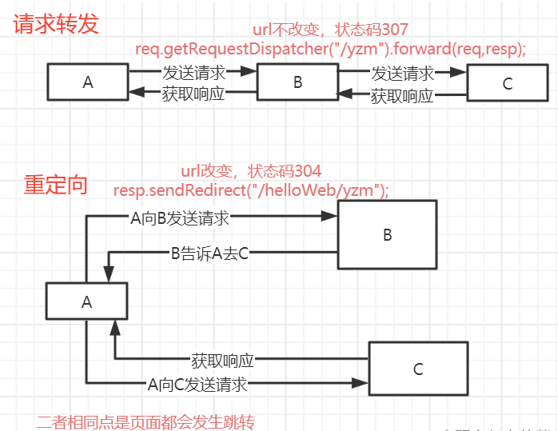

## 七、实现B/S/DB操作

### 1.区分C/S及B/S

C/S是指客户端/服务器，充分发挥客户端的处理能力，降低服务器的负荷，但DB直接暴露于公网，升级维护麻烦

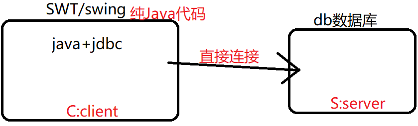

B/S是指浏览器/服务器，升级维护相对简单，只要有浏览器即可随时随地访问，但服务器负载较重
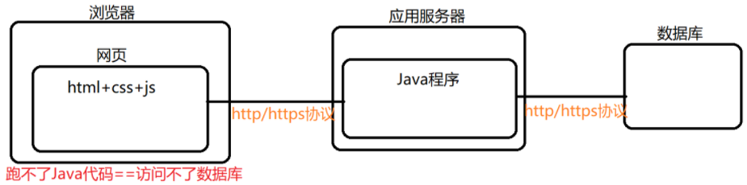

### 2.项目实战

#### 2.1.需求

- 浏览器：在输入框中输入数据，带着参数发送请求到服务器
- 服务器：接收浏览器发送的请求，进行一些处理后，回送响应结果给服务器

#### 2.2.代码

①浏览器端HTML，`action`中是发送的服务器地址，其中`input`都作为参数

```java
<form action="reg.action" method="post">
   	用户名：<input type="text" name="uname" value="张三" /><br />
    密码：<input type="password" name="pwd" value="abc" /><br />
    <input type="submit" value="登录" />
</form>
```

②服务器端Servlet

```java
@WebServlet("/reg.action")//通知tomcat，连接浏览器端
public class RegServlet extends HttpServlet {
    @Override
    protected void doPost(HttpServletRequest request, HttpServletResponse response) throws ServletException, IOException {
        doGet(request,response);
        //当请求为post时，定位到get统一处理
    }

    @Override
    protected void doGet(HttpServletRequest request, HttpServletResponse response) throws ServletException, IOException {
    	//解决参数编码问题
        request.setCharacterEncoding("utf-8");
        
        //接收参数，与标签中的name值对应
        String uname = request.getParameter("uname");
        String pwd = request.getParameter("pwd");
        System.out.println(uname+"  "+pwd);

		//连接数据库进行处理
        try {
            Class.forName("oracle.jdbc.driver.OracleDriver");
        }catch (Exception ex){
            ex.printStackTrace();
        }
        int result=-1;
        try ( Connection con = DriverManager.getConnection("jdbc:oracle:thin:@localhost:1521:orcl","scott","a");
              PreparedStatement pstmt = con.prepareStatement("insert  into yc108 values(seq_yc108.nextval,?,?)");
        ){//新写法，会自动关闭
            pstmt.setString(1,uname);
            pstmt.setString(2,pwd);
            result = pstmt.executeUpdate();
        }catch (Exception ex){
            ex.printStackTrace();
        }
		
		//解决回送信息乱码问题
        response.setContentType("text/html;charset=utf-8");
        
        PrintWriter out = response.getWriter();
        
        if(result ==1){
            out.println("添加"+uname+"成功");
        }else if(result ==0){
            out.println("添加"+uname+"失败");
        }else{
            out.println("系统异常，添加失败");
        }
        out.close();
    }
}
```

## 八、Cookie与Session

### 1.理解Cookie与Session的关系

学校如何确定我有没有交学费呢？学校给我开发票(Cookie)和学校登记我的信息(Session)

### 2.Cookie(小饼干)

Cookie是客户端的技术，**服务器创建的由若干个K-V组成的数据，然后传递给客户端的信件，客户端下次访问服务器带上信件(Cookie)就好，从而保证每次访问时先从本地缓存中获取**，Cookie一般存于本地用户目录下appdata，一个Cookie只能存一个信息，大小限制为4kb，一个服务端可给浏览器发送多个Cookie，但最多20个，300个Cookie是浏览器上限，通过以下方式删除Cookie

* 不设置有效期，关闭客户端就会删除Cookie
* 设置有效期为0，响应到浏览器立马过期

以下案例实现设置Cookie，保留最后一次访问的时间

```java
@WebServlet("/lastLoginTime")
public class LastLoginTime extends HttpServlet {
    @Override
    protected void doGet(HttpServletRequest req, HttpServletResponse resp) throws ServletException, IOException {
        this.doPost(req,resp);
    }

    @Override
    protected void doPost(HttpServletRequest req, HttpServletResponse resp) throws ServletException, IOException {
        //设置编码
        req.setCharacterEncoding("utf-8");
        resp.setContentType("text/html;charset=utf-8");

        PrintWriter out = resp.getWriter();

        //获取所有的Cookie(可能这个信件不止一个)
        Cookie[] cookies = req.getCookies();

        if(cookies==null){
            out.println("第一次访问");
        }else{
            for (Cookie cookie:cookies){
                if (cookie.getName().equals("lastLoginTime")){
                    out.print("上次访问的时间：");
                    long time = Long.parseLong(cookie.getValue());
                    out.print(new Date(time).toLocaleString());
                }
            }
        }

        //重新设置时间，阅读源码发现Cookie的key与value都只能是字符串，局限性比较强
        Cookie cookie = new Cookie("lastLoginTime",System.currentTimeMillis()+"");
        //设置cookie有效期，这样在有效期没即使关闭浏览器也会保留cookie，否则不会保留
        cookie.setMaxAge(24*60*60);
        resp.addCookie(cookie);
    }
}
```

### 3.Session(会话)

Session是服务端的技术，**服务器登记访问的用户信息，下次服务器匹配用户**(浏览器)，即第一次请求时服务端产生带有ID的Session对象，然后服务端将Session的ID以Cookie的形式发送给客户端，第二次请求时根据ID判断是不是同一个Session对象，从而实现数据共享，可用于保存用户登录信息，保存网站中经常使用的数据，以下是一些基本操作，可通过看源码学习

```java
@WebServlet("/helloSession")
public class HelloSession extends HttpServlet {
    @Override
    protected void doGet(HttpServletRequest req, HttpServletResponse resp) throws ServletException, IOException {
        this.doPost(req,resp);
    }

    @Override
    protected void doPost(HttpServletRequest req, HttpServletResponse resp) throws ServletException, IOException {
        //设置编码
        req.setCharacterEncoding("utf-8");
        resp.setCharacterEncoding("utf-8");
        resp.setContentType("text/html;character=utf-8");

        //获取session
        HttpSession session = req.getSession();
        //创建session，可以存对象
        session.setAttribute("name","zhangsan");
        //得到sessionId
        String sessionId = session.getId();
        //判断是不是第一次创建的session
        if (session.isNew()){
            resp.getWriter().write("新session:"+sessionId);
        }else{
            resp.getWriter().write("旧session:"+sessionId);
        }

        //注销session
        session.invalidate();
        //设置自动失效时间
        session.setMaxInactiveInterval(1);
    }
}
```

**ServletContext与Session区别**

|   域对象名称   |   范围   |           级别           |                   备注                   |
| :------------: | :------: | :----------------------: | :--------------------------------------: |
| Servletcontext | 应用范围 | 最大，整个应用都可以使用 | 尽力少用，如果对数据有修改需要做同步处理 |
|  HttpSession   | 会话范围 |  多次请求数据共享时使用  | 多次请求共享数据，但不同的客户端不能共享 |

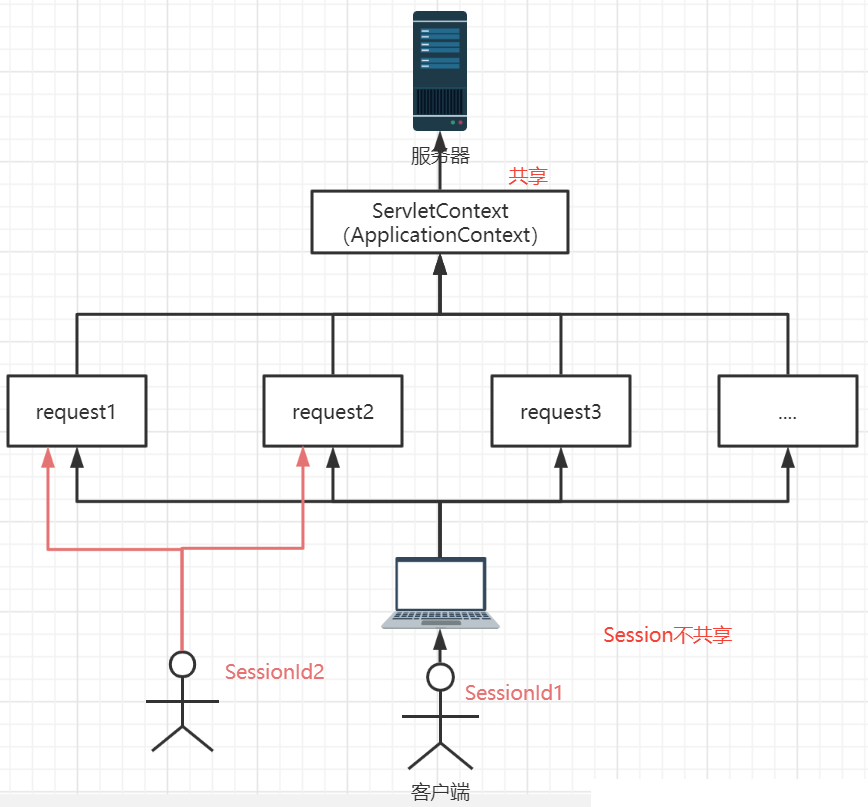

### 4.一个网站怎么证明你来过？

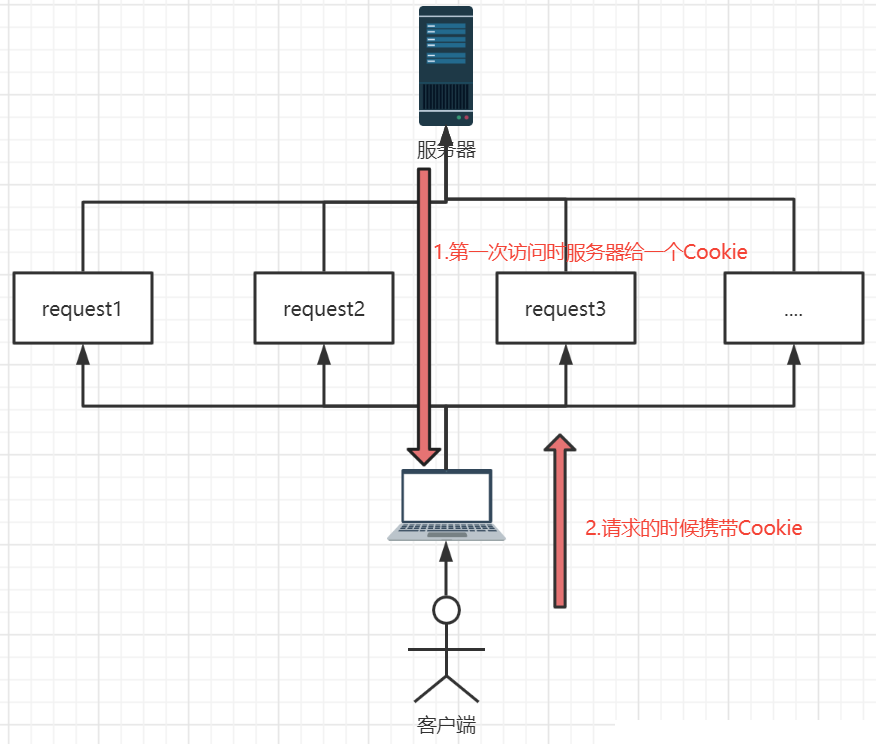

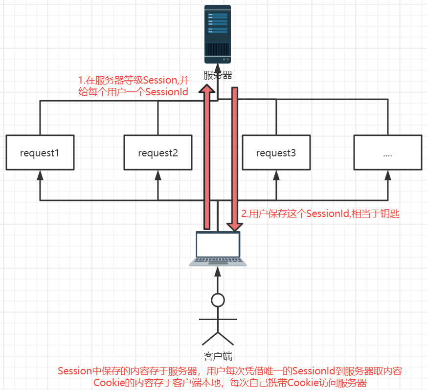

### 5.应用

#### 5.1.显示本机ID+在线ID

```java
private void number(HttpServletRequest request, HttpServletResponse response){
   JsonModel jsonModel = new JsonModel();
   int userid = 0;
   String ip = getIpAddress(request);
   String addr = "";

   //获取session：客户端与服务器多次请求和响应的共享空间
   HttpSession session = request.getSession();

   if(session.getAttribute("userid")==null){
       //如果id为空，则给一个随机数作为id
       userid = new Random().nextInt(1000);
       session.setAttribute("userid",userid);

       //获取application存这个用户编号====所有访问的用户编号
       ServletContext application = request.getSession().getServletContext();
       Map<String,Object> onlineuserMap = new HashMap<String,Object>();
       List<Map<String,Object>> onlineuserList = null;
       if(application.getAttribute("onlineuserList")==null){
           onlineuserList = new ArrayList<Map<String,Object>>();
           application.setAttribute("onlineuserList",onlineuserList);
       }
       onlineuserMap.put("userid",userid);//添加在线人数
       onlineuserMap.put("ip",ip);//添加IP
       onlineuserList = (List<Map<String, Object>>) application.getAttribute("onlineuserList");
       onlineuserList.add(onlineuserMap);
   }
   userid = Integer.parseInt(session.getAttribute("userid").toString());

   try {
       jsonModel.setCode(1);
       jsonModel.setData(userid);
       super.writeJson(jsonModel,response);
   } catch (IOException e) {
       e.printStackTrace();
       jsonModel.setCode(0);
       jsonModel.setMsg(e.getMessage());
   }
}
```

#### 5.2.本ID退出

```java
private void quit(HttpServletRequest request,HttpServletResponse response){
    HttpSession session = request.getSession();

    int id = Integer.parseInt(session.getAttribute("userid").toString());

    //取出在线用户列表
    ServletContext application = request.getServletContext();
    List<Map<String,Object>> onlineuserList = (List<Map<String, Object>>) application.getAttribute("onlineuserList");

    //在线用户列表中移出退出的id
    for (int i=0;i<onlineuserList.size();i++){
    	if(Integer.parseInt(onlineuserList.get(i).get("userid").toString())==id){
            onlineuserList.remove(i);
            break;
        }
    }

    //清空session
    //session.invalidate();//所有的键值对都被清除
    session.removeAttribute("userid");//只清除对应的键

    JsonModel jsonModel = new JsonModel();
    jsonModel.setCode(1);
    try {
        super.writeJson(jsonModel,response);
    } catch (IOException e) {
        e.printStackTrace();
    }
}
```

#### 5.3.保存聊天记录

```java
private void sendMessage(HttpServletRequest request,HttpServletResponse response){
  //取出在线用户列表
   ServletContext application = request.getServletContext();
   HttpSession session = request.getSession();

   //取出用户id
   int userid = Integer.parseInt(session.getAttribute("userid").toString());

   //取出该id说的话
   String message = request.getParameter("message");

   //获取现在的时间
   Date date = new Date();
   SimpleDateFormat simpleDateFormat = new SimpleDateFormat("yyyy-MM-dd HH:mm:ss");
   String time = simpleDateFormat.format(date);

   //历史聊天记录
   List<String> messageList = null;
   if (application.getAttribute("messageList")==null){
       messageList = new ArrayList<String>();
       application.setAttribute("messageList",messageList);
   }
   messageList = (List<String>) application.getAttribute("messageList");

   //拼接样式信息
   StringBuffer stringBuffer = new StringBuffer();
   stringBuffer.append(userid+"说：<br />");
   stringBuffer.append(message+"<br />");
   stringBuffer.append("<div style='text-align:right'>"+time+"</div>");

   messageList.add(stringBuffer.toString());

   JsonModel jsonModel = new JsonModel();
   jsonModel.setCode(1);
   jsonModel.setData(messageList);
   try {
       super.writeJson(jsonModel,response);//json只有数组和对象，而list没有键，所以以数组形式保存
   } catch (IOException e) {
       e.printStackTrace();
   }
}
```

## 九、Filter

### 1.架构

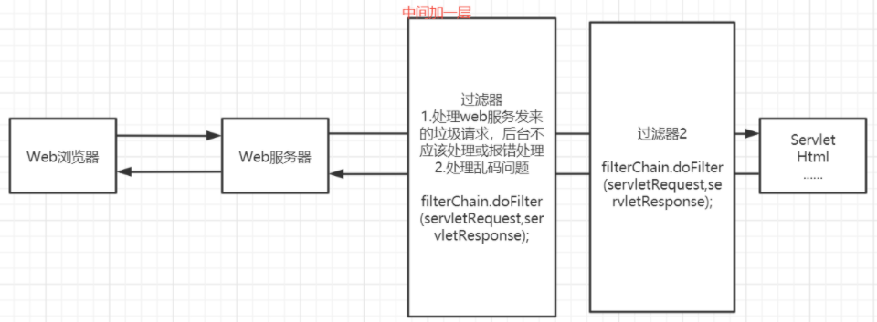

### 2.使用

首先注意一点，导包不要导错

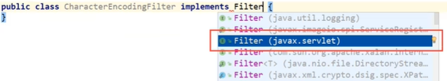

具体代码，注解里有讲解

```java
/**
 * 故意让这个乱码，测试过滤层CharacterEncodingFilter
 */
@WebServlet(value = {"/showServlet","/filter/showServlet"})
public class ShowServlet extends HttpServlet {
    @Override
    protected void doGet(HttpServletRequest req, HttpServletResponse resp) throws ServletException, IOException {
        this.doPost(req,resp);
    }

    @Override
    protected void doPost(HttpServletRequest req, HttpServletResponse resp) throws ServletException, IOException {
        //resp.setCharacterEncoding("utf-8");
        //resp.setContentType("text/html;character=utf-8");

        //以上的方法设置编码需要每个地方都设置一次，不想麻烦就直接在过滤器中一次性设置好
        resp.getWriter().write("你好世界！");//中文乱码
    }
}
```

```java
@WebFilter("/filter/*")//filter的任何请求走过这个过滤器
public class CharacterEncodingFilter implements Filter {
    @Override//web服务器启动时，过滤器同时初始化
    public void init(FilterConfig filterConfig) throws ServletException {
        System.out.println("CharacterEncodingFilter初始化");
    }

    @Override
    public void doFilter(ServletRequest servletRequest, ServletResponse servletResponse, FilterChain filterChain) throws IOException, ServletException {
        servletRequest.setCharacterEncoding("utf-8");
        servletResponse.setCharacterEncoding("utf-8");
        servletResponse.setContentType("text/html;character=utf-8");

        System.out.println("CharacterEncodingFilter过滤前");
        //必须要有这个链式调用，通知后面，否则程序在此处被拦截停止
        filterChain.doFilter(servletRequest,servletResponse);
        System.out.println("CharacterEncodingFilter过滤后");
    }

    @Override//web服务器关闭时销毁
    public void destroy() {
        System.out.println("CharacterEncodingFilter销毁");
    }
}
```


