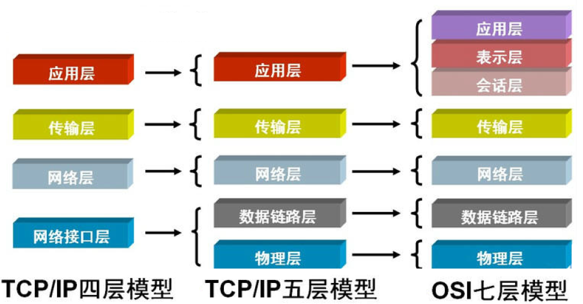
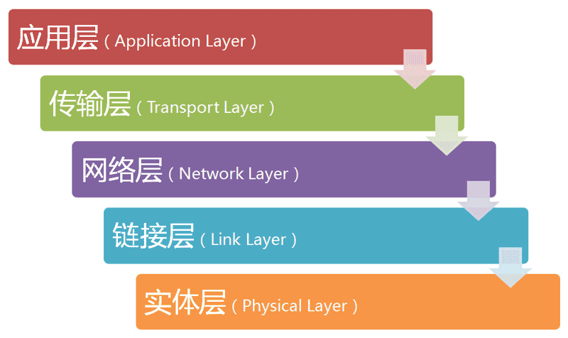
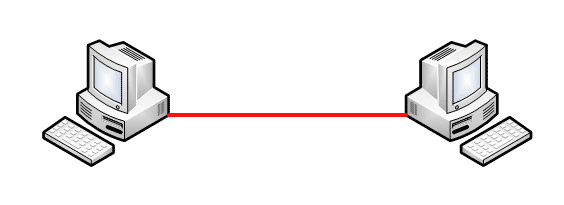
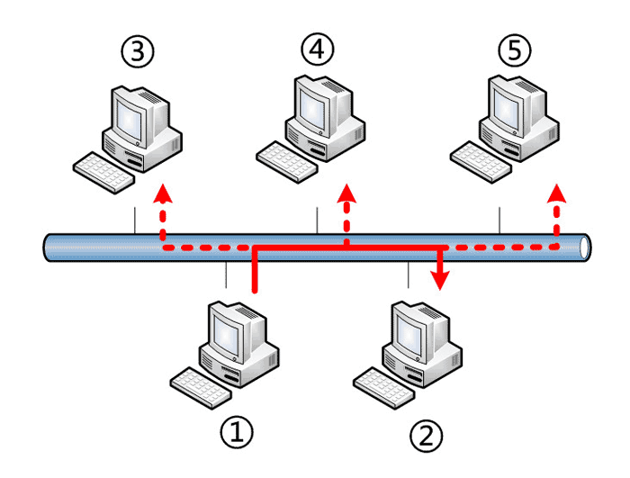
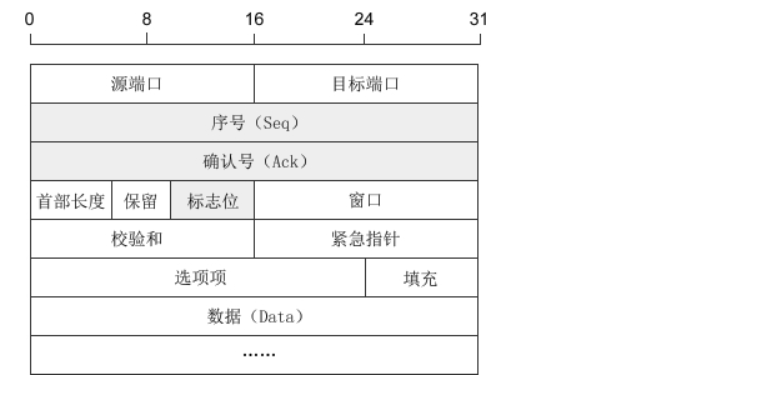
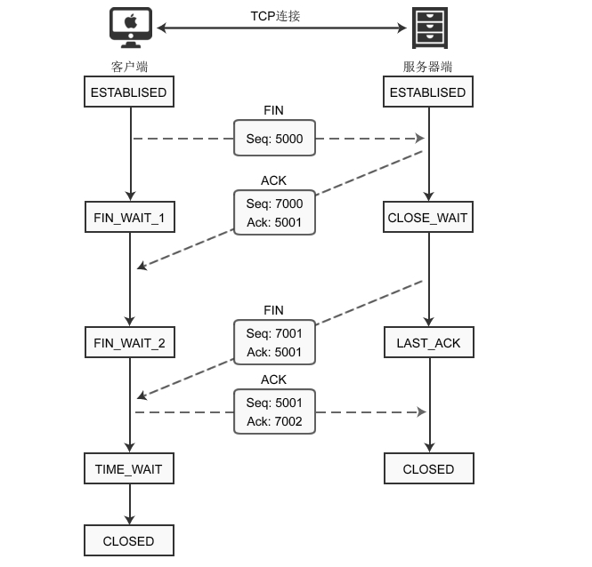
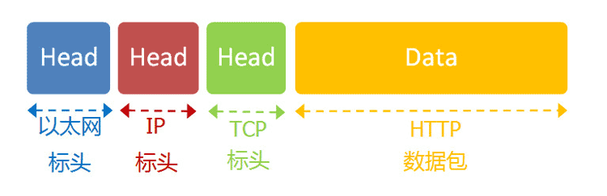
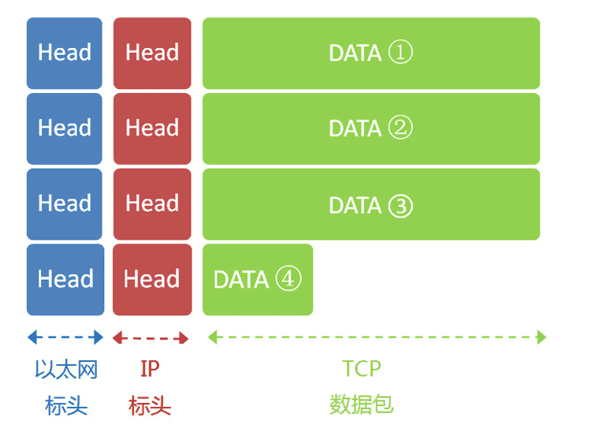

# 网络五层模型

## 一、TCP/IP五层模型

### 1.TCP/IP五层模型概述

互联网每层都有自己的功能，上一层依靠下一层，越下面的层，越靠近硬件，越上面的层，越靠近用户

如何分层也有不同的模型，此处重点介绍五层模型，待讲透五层模型

每一层都是为了完成一种功能，为了实现这些功能就需要大家都遵守共同的规则，该规则就叫协议，每层都定义很多协议，这些协议统称为互联网协议

### 2.五层模型图解

## 二、实体层

电脑间需要形成网络，第一件事当然是建立联系，可以用光缆、电缆、双绞线、无线电波等方式，这就是实体层

**实体层指将电脑连起来的物理手段，主要规定一些电气特性，负责传输0和1的电信号**

## 三、链路层

### 1.什么是链路层？

单纯的0和1是无意义的，必须规定多少电信号算一组？每个电信号位有何意义？这就是链路层

**链路层确定0和1电信号的分组方式**

### 2.以太网协议

以太网协议规定，**一组电信号构成一个数据包，称作帧(Frame)，帧由标头(Head)和数组组成(Data)**

标头包含**数据包的说明项**，比如发送者、接受者、数据类型等等，**长度固定为18字节**

数据则指的是**数据包的具体内容**，**长度最短为46字节，最长为1500字节**，因此帧最短为64字节，最长为1518字节，如果数据过长就必须分成多个帧进行发送

### 3.MAC地址

帧的标头内包含发送者和接收者信息，那么发送者和接收者如何标识呢？

以太网协议规定，**连入网络的所有设备都必须包含网卡接口**，数据包从一个网卡传输到另一个网卡，**数据包只能在网卡间传输**，其中网卡地址就是数据包的发送方地址和接收方地址，叫做MAC地址

**每块网卡出厂时都有独一无二的MAC地址**，**长度为48个二进制位，通常用12个十六进制数表示**，前6个十六进制数是厂商编号，后6个十六进制数是该厂商的网卡流水号

**以太网数据包必须知道接收方的MAC地址才能发送**

### 4.广播

定义地址只是第一步，一块网卡怎么会知道另一块网卡的MAC地址呢？

以太网采用了一种很“原始”的方式，它不是把数据包准确送到接收方，而是**将数据包发送给本网络的所有计算机，让每台计算机自己判断自己是不是接收方**，这就叫广播

如图，①向②发送数据包，同网络的③④⑤都会收到该数据包，每台计算机取该数据包标头内的接收方的MAC地址与自己的MAC地址比较，若两者相同则接收该包，否则丢弃

> 广播风暴指信息量大造成的阻塞现象

### 5.小结

链路层中，数据包、MAC地址、广播使得本网络计算机间取得联系，可传输数据

## 四、网络层

### 1.什么是网络层？

实际上单靠链路层只可在本网络的机器中传递信息，而且通过广播本网络所有机器人手一包，这会引起灾难，互联网由无数子网络组成，不同子网络的计算机难道就不通信？？所以必须区分哪些MAC地址属于同一子网络，如果是**同一子网络采用广播方式，不是则采用路由方式**，由此出现网络层，用于**确定主机与主机间的联系**

### 2.网址

**网络层引入一套新的地址，即网址，用于区分不同计算机是否属于同一子网络**，所以网络层出现后，每台计算机都有MAC地址和网址两个地址，两地之间没有任何联系，随机组合，MAC地址出厂时被绑定在网卡，网址由管理员分配

网址确定计算机所在的子网络，MAC地址则将数据包送到该子网络中的目标网卡，因此从逻辑上可以推断，**必定是先处理网络地址，然后再处理MAC地址**

### 3.IP协议

**规定网址的协议叫IP协议**，IPv4规定网络地址由**32个二进制位组成**，习惯上分成4段十进制数表示IP地址，范围为`0.0.0.0-255.255.255.255`

**互联网内的每台计算机都分配一个IP地址，该地址分为两部分，前部分表示网络，后部分表示主机**，若处于同一子网络，那它们的网络部分必定相同，但单靠IP地址无法确定网络和主机具体由哪几位表示，所以出现子网掩码

**子网掩码形同IP地址，也由32个二进制数组成，用于区分网络与主机由哪几位表示，1表示网络，0表示主机**

> 已知IP地址172.16.254.1和172.16.254.233的子网掩码都是255.255.255.0，请问它们是否在同一个子网络？
>
> 两者与子网掩码分别进行AND运算，结果都是172.16.254.0，因此它们在同一个子网络

**综上IP协议主要用于为每台计算机分配IP地址和确定哪些计算机属于同一子网络**

### 4.IP数据包

根据IP协议发送的数据叫IP数据包，不难想象，其中肯定包含IP地址信息

由链路层学习的以太网数据包可知，以太网数据包只包含MAC地址的栏位，那是否需要增加一个栏位呢？答案是不用，**将IP数据包直接存于以太网数据包的数据部分**，此处体现互联网分层的好处，即**上层的变动完全不涉及下层的结构**

IP数据包实际也由两部分组成，即标头与数据，标头主要包含版本、长度、IP地址等信息，数据则是IP数据包的具体内容，其中标头长度为20-60字节，所以整个数据包最长为65535字节，因为以太网数据包数据部分长度最长为1500字节，所以IP数据包超过1500字节就需要分割成几个以太网数据包分开发送

IP数据包存于以太网数据包后的结构如下图

### 5.ARP协议

因为IP数据包存放在以太网数据包中，所以必须同时知道对方MAC地址和对方IP地址，通常对方的IP地址已知，但MAC地址怎么知道呢？所以需要一种机制能够从IP地址得到MAC地址

这又分为两种情况，第一是两机器不在同一子网络，这实际上是没办法知道对方的MAC地址的，只能通过将数据包传送到网关，让网关处理，第二就是**两机器在同一子网络，那么可使用ARP协议知道对方的MAC地址**

**ARP协议也是发出一个数据包，包含在以太网数据包中，该数据包中包含要查询的主机IP地址和对方MAC地址FF:FF:FF:FF:FF:FF，这表示的是广播地址，子网络的每台机器都收到该数据包，取出其中的IP地址与自身的IP地址比较，若相同则向对方报告自己的MAC地址，否则就丢弃这个包**

## 五、传输层

### 1.什么是传输层？

有了MAC地址和IP地址则可在互联网内任意两台机器中通信，但同一主机上有许多程序，即进程需要上网，比如一边听歌，一边浏览网页，当数据包从网络发送过来时，如何区分音乐内容还是网页内容呢？此时**出现一个参数用于表示数据包供哪个进程使用，该参数称作端口Port**

**端口实际就是每个使用网卡程序的编号**，使数据包发往主机的特定端口，所以不同程序可以取到自己需要的数据，**端口为0-65535间的整数，其中0-1023被系统占用，只能选用大于1023的端口**，主机上的程序会随机取一个端口，然后与服务端对应端口取得联系

**传输层用于建立端口与端口间的联系，只需要确定主机和端口，即网络层和链路层就可以实现程序间的交流**

> 套接字(Socket) = 主机(Host) + 端口(Port)

### 2.UDP协议

需要实现程序间的交流，则需要端口，所以端口也需要加入数据包中，因此出现新协议，其中最简单的是UDP协议

**UDP数据包也由标头和数据包组成，标头定义发出端口和接收端口，长度为8字节，数据就是具体内容，总长度不超过65535字节**

UDP数据包存于IP数据包后的结构如下图

### 3.TCP协议

UDP是最简单的协议，但是其安全性比较差，一旦数据包发出，不知道对方有没有收到，为解决该问题，提高网络可靠性，TCP(Transmission Control Protocol)协议就诞生了

TCP协议比较复杂，简单**理解为带确认机制的UDP协议**，每发出一个数据包都需要确认，若数据包丢失，则接收不到该确认，那么发送方就会重新发送该包，所以**TCP协议保证数据不会遗失**，但其过程复杂、实现困难、消耗较多的资源

TCP数据包也存于IP数据包的数据部分，**TCP数据包没有长度限制，理论上可以无限长，但是为了保证网络的效率，通常TCP数据包的长度不会超过IP数据包的长度，以确保单个TCP数据包不必再分割**

### 4.TCP和UDP的区别

|      |   连接   | 可靠性 |    效率    |              长度               |
| :--: | :------: | :----: | :--------: | :-----------------------------: |
| TCP  | 面向连接 |  可靠  | 传输效率低 |      标头8字节，总长65535       |
| UDP  |  无连接  | 不可靠 | 传输效率高 | 理论上可无限长，但一般不超65535 |

### 5.TCP传输过程

#### 5.1.TCP数据包

**TCP协议是面向连接的、可靠的、基于字节流的通信协议**，数据在传输前需要使用`connect()`与服务器建立连接，确定IP地址、端口等准确无误，传输完毕后需要断开连接，在讲解三次握手、四次挥手之前我们先来了解**TCP数据包的结构**，结构如图

* 序号Seq：占32位，用于标识从计算机A发送到计算机B的数据包的序号
* 确认号Ack：占32位，客户端和服务端都可以发送，`Ack = Seq + 1`
* 标志位：每个标志位占用1Bit，共有6个，分别为URG、ACK、PSH、RST、SYN、FIN，具体含义如下
  * URG：紧急指针有效
  * ACK：确认序号有效
  * PSH：接收方应该尽快将这个报文交给应用层
  * RST：重置连接
  * **SYN：建立一个新连接**
  * **FIN：断开一个连接**

了解了TCP数据包的结构，具体来讲一讲**三次握手、四次挥手**吧！面试常问

#### 5.2.三次握手

**三次握手**的主要目的是确认对方收到自己的数据包，即Ack标志位实现，过程如下

* Client 端发送连接请求报文 SYN，并记录该请求报文的 Seq 

* Server 端接受连接后回复 ACK 报文，并为这次连接分配资源

* Client 端接收到 ACK 报文后，与之前记录的Seq对比，看`Ack = Seq + 1`是否成立，若成立则说明 Client 端接收到 Server 端发来的数据包，然后 Client 端也向 Server 端发送 ACK 报文，并分配资源

就这样三个步骤，TCP连接已经建立成功

**为什么是三次握手呢？两次不行吗？**

①`Client->Server`可保证`Server`知道自己的收信能力和`Client`的发信能力没问题

②`Server->Client`可保证`Client`知道自己的收信能力、发信能力和`Server`的发信能力没问题

③经过①和②，`Server`还不知道自己的发信能力如何，所以就需要第三次通信，第三次`Client->Server`后`Server`可确认自己的发信能力也没问题，这样为双方发送数据做好准备工作，若不确认`Server`的发信能力会导致服务器资源浪费

**TCP的三次握手一定能保证传输可靠吗？**

当然比两次握手可靠，但也不是完全可靠，那难道追加更多次的握手连接就可靠吗？答案是不会，所以选择三次握手，世界上不存在完全可靠的通信协议，从通信时间成本空间成本以及可靠度来讲，选择三次握手作为点对点通信的一般规则

#### 5.3.四次挥手

建立连接的三次握手很重要，是数据正确传输的前提，**四次挥手**也非常重要，它使计算机释放不必要的资源，若连接不能正常断开，不仅会造成数据传输错误，还会导致套接字不能关闭，持续占用资源，如果并发量高，服务器压力堪忧，四次挥手过程如下

- Client 端发送 FIN，用来关闭 Client 到 Server 的数据传送，Client 端进入 FIN_WAIT_1 状态

- Server 端接收到 FIN 后，发送 ACK 给 Client 端，Server 端进入 CLOSE_WAIT 状态
- Server 端发送 FIN，用来关闭 Server 到 Client 的数据传送，Server 端进入 LAST_ACK 状态

- Client 端接收到 FIN 后，Client 端进入 TIME_WAIT 状态，发送 ACK 给 Server 端，Server 端进入 CLOSED 状态

就这样四个步骤，TCP连接已经关闭成功

> 其实以上的过程可以理解为
>
> Client：“任务处理完毕，我希望断开连接”
>
> Server：“哦，是吗？请稍等，我准备一下”
>
> 等待片刻后……
>
> Server：“我准备好了，可以断开连接了”
>
> Client：“好的，谢谢合作”

**为什么是四次挥手呢？三次不行吗？连接的时候就是三次啊**

①三次握手中 ACL 和 SYN 可同时从`Server->Client`，其中 ACL 用于应答，SYN用于同步

②四次挥手中 ACL 和 FIN 没办法同时发送，因为 Server 接收到 FIN 后不会立即关闭 Socket，所以只能先回送一个 ACL 告诉 Client “你发的FIN报文我收到了”

③只有当 Server 端的数据都发送完毕才能发送 FIN

### 6.TCP粘包/半包问题

#### 6.1.TCP粘包

发送`abc,def`，而接收到`abcdef`就是粘包现象，即发送方发送的若干数据包到达接收方时粘成一包，出现的原因如下

* **应用层将接收数据的缓冲区设置得过大**，缓冲区内含多个包，一次性从缓冲区取包时导致所有包粘在一起
* **发送和接收消息都快，但处理消息过慢，并且接收消息的窗口足够大**，此时消息堆积在接收窗口，导致多个包粘在一起
* **Nagle算法**是操作系统底层自动实现的，为提高效率，OS会等待缓冲区填满一并处理，导致多个包粘在一起

#### 6.2.TCP半包

发送`abcdef`，而接收到`abc,def`就是半包现象，出现的原因如下

* **应用层将接收数据的缓冲区设置得过小**，缓冲区内存不了一个完整的包，一次只能从缓冲区取出包的部分数据
* 发送消息较大，而接收消息较小，使接收方只能接收TCP包的部分数据，导致TCP半包
* **MSS限制**指的是为了限制TCP包的大小，会将大的TCP包分组成多个小的TCP包发送，导致半包问题

#### 6.3.TCP粘包/半包解决方案

①**FixedLengthFrameDecoder定长解析器**，取出指定字节长度的数据作为完成数据，**不过这要求完整数据的长度是定长**

**②LineBasedFrameDecoder行解析器**，以换行符`\n`作为完整消息边界，**不过着要求每一个完整消息的末尾都加上换行符作为**

**③LengthFieldBasedFrameDecoder**，数据以**消息长度+消息**的形式发送，即先告知服务器数据的长度，再发送完整的数据

## 六、应用层

### 1.什么是应用层？

经过传输层后，应用程序可接收到数据，但互联网内的数据五花八门，所以必须事先规定好数据格式，所以出现应用层

**应用层用于规定应用程序的数据格式**，比如TCP协议可传递Email、WWW、FTP等格式的数据，必须有不同协议规定电子邮件、网页、FTP数据的格式，这些应用程序协议构成应用层

应用层是最高的一层，直接面向用户，其数据直接存于TCP数据包的数据部分，所以以太网数据包变成如图

### 2.DHCP协议

新买的计算机必须配置**本机IP、子网掩码、网关IP、DNS的IP**才可上网，对应静态IP，每次开机计算机的IP地址都是固定的，由于IP地址不变，那么其他计算机都不能使用该IP地址，非常不灵活，所以出现动态IP地址

动态IP地址顾名思义就是每次开机都会为计算机分配新IP地址，且无需人为设定，使用的协议叫DHCP协议

**DHCP协议是动态分配IP时使用的协议**，建立于UDP协议之上，所以是应用层协议

**DHCP协议规定有一台计算机负责管理本网络的所有IP地址，叫做DHCP服务器，新的计算机加入网络必须向DHCP服务器发送一个DHCP请求数据包，申请IP地址和相关的网络参数**，但同子网络的计算机通信必须知道对方的MAC地址和IP地址，但一台新计算机加入时如何知道呢？DHCP协议做了一些巧妙的规定

DHCP请求数据包的完整结构如下图

* 以太网标头设置发送方和接收方MAC地址，发送方为本机，所以发送方为本机网卡MAC地址，接收方为DHCP服务器MAC地址，但此时不知道哪台机器是DHCP服务器，所以填入广播地址`FF-FF-FF-FF-FF-FF`
* IP标头设置发送方和接收方IP地址，此时还没有为本机分配IP地址，所以设置为`0.0.0.0`，同样不知道哪台机器是DHCP服务器，所以设置为`255.255.255.255`
* UDP标头设置发送方和接收方Port，此部分是DHCP协议规定好的，发送方为68，接收方为67

定义好DHCP请求数据包就可以发送了，以太网以广播形式发送，同一子网络的机器都收到该数据包，机器收到数据包后就开始分析，MAC接收方地址为广播地址，所以不能分析出什么，IP地址发送方为`0.0.0.0`，接收方为`255.255.255.255`，所以DHCP服务器就知道这个数据包是发送给自己的，其他机器丢弃该数据包

DHCP服务器接收到该包就开始分析数据内容，分配好IP地址，发送回去DHCP响应数据包，响应数据包结构与请求数据包类似，结构如上图

- 以太网标头设置发送方和接收方MAC地址，发送方为DHCP服务器，所以发送方为DHCP服务器网卡MAC地址，接收方为本机网卡MAC地址
- IP标头设置发送方和接收方IP地址，发送方为DHCP服务器，所以发送方为DHCP服务器IP地址，接收方为`255.255.255.255`
- UDP标头设置发送方和接收方Port，此部分是DHCP协议规定好的，发送方为67，接收方为68

分配给请求端的IP地址和本网络的具体参数则包含在Data部分，新加入的计算机收到这个响应包，于是就知道了自己的IP地址、子网掩码、网关地址、DNS服务器等等参数

## 七、TCP/IP五层模型总结

### 1.最终数据包结构

### 2.数据包目标地址

|      场景      |         数据包地址          |
| :------------: | :-------------------------: |
|  同一个子网络  | 对方的MAC地址，对方的IP地址 |
| 非同一个子网络 | 网关的MAC地址，对方的IP地址 |

### 3.一次网络通信

假设用户已经设置好网络参数，本机的IP地址为`192.168.1.100`，子网掩码为`255.255.255.0`，网关的IP地址为`192.168.1.1`，DNS的IP地址为`8.8.8.8`

用户此时打开浏览器想要访问Google，在地址栏输入`www.google.com`然后回车，这意味着浏览器要向Google发送一个网页请求的数据包

发送数据包必须知道对方的IP地址，但此时不知道对方的IP地址，只知道`www.google.com`，于是**通过DNS协议向DNS服务器发送DNS数据包，将输入的网址`www.google.com`转为对应的IP地址`172.194.72.105`**

知道IP地址，则需要**通过子网掩码判断本机IP和Google的IP是否在同一子网络**，已知子网掩码为`255.255.255.0`，本机的IP地址为`192.168.1.100`，Google的IP地址为`172.194.72.105`，分别与子网掩码做AND运算，得到的结果分别是`192.168.1.0`、`172.194.72.0`，结果不同，所以**Google与本机不在同一子网络，因此本机要向Google发送数据包必须通过网关`192.168.1.1`的转发到接收方网关MAC地址**

发送数据又需要知道接收方的MAC地址，**通过ARP协议得到接收方MAC地址**

浏览网页使用的是**应用层HTTP协议，被嵌在TCP数据包之中**，假定HTTP的数据包长为4960字节，结构如下

TCP数据包设置端口，发送方随机生成1024-65535之间的整数，假定为51775，接收方的HTTP默认端口为80；TCP数据包的标头长度为20字节，加上嵌入HTTP的数据包，总长度变为4980字节，然后**TCP数据包再嵌入IP数据包**

IP数据包设置IP地址，发送方为`192.168.1.100`，接收方为`172.194.72.105`；IP数据包的标头长度为20字节，加上嵌入的TCP数据包，总长度变为5000字节，然后**IP数据包嵌入以太网数据包**

以太网数据包设置MAC地址，发送方为本机网卡MAC地址，接收方为网关MAC地址`192.168.1.1`(ARP)；以太网数据包的数据部分，最大长度为1500字节，而现在的IP数据包长度为5000字节，因此**IP数据包必须分割**成四个包，每个包都有自己的IP标头(20字节)，四个包的长度分别为1500、1500、1500、560

**浏览器对Google的服务器发起三次握手，建立连接**

**Google的服务器172.194.72.105收到这四个以太网数据包，取出IP标头的序号，Google将四个包拼起来取出完整的TCP数据包，然后读出里面的HTTP请求，接着做出HTTP响应，再用TCP协议发送回来**

**若是短连接，则请求结束后通过四次挥手关闭连接，若是长连接，则在没有访问服务器的若干时间后进行连接的关闭**

**本机收到HTTP响应以后就可以将网页显示出来**，完成一次网络通信

> 什么是短连接和长连接？
>
> 短连接指只连接一次，任务处理完毕就中断连接，长连接指保持连接，但长连接也不会一直不关闭，存在一个保持时间，一旦超过保持时间没有任务处理，则连接关闭，长连接需要客户端和服务端都支持长连接
>
> 短连接的过程是 建立连接 - 任务处理 - 连接关闭 ... 建立连接 - 任务处理 - 连接关闭
>
> 长连接的过程是 建立连接 - 任务处理 ... 任务处理 - 连接关闭

> [参考文章1(五层模型)](http://www.ruanyifeng.com/blog/2012/05/internet_protocol_suite_part_i.html)	[参考文章2(五层模型)](https://www.ruanyifeng.com/blog/2012/06/internet_protocol_suite_part_ii.html)	[参考文章3(三次握手四次挥手)](https://blog.csdn.net/weixin_45393094/article/details/104965561)	[参考文章4(TCP粘包/半包)](https://blog.csdn.net/TheWayForDream/article/details/124558953)	[参考文章5(TCP粘包/半包解决)](https://blog.csdn.net/yixiao1874/article/details/124163794)

