# 步步深入之Volatile

## 一、现代计算机内存模型

### 1.指令与数据

**指令**：由CPU处理器执行

**数据**：存储在主内存当中

### 2.高速缓存

计算机的存储设备与处理器的运算速度有几个数量级的差距，如何解决？现代计算机系统**加入一层读写速度接近处理器运算速度的高速缓存**(Cache)，Cache作为内存与处理器之间的缓冲(仅次于CPU寄存器)，避免了每次从主存读取数据

一共存在三级缓存，分别是一级缓存L1，二级缓存L2，三级缓存L3(多核共享)，**计算机内存模型如下**

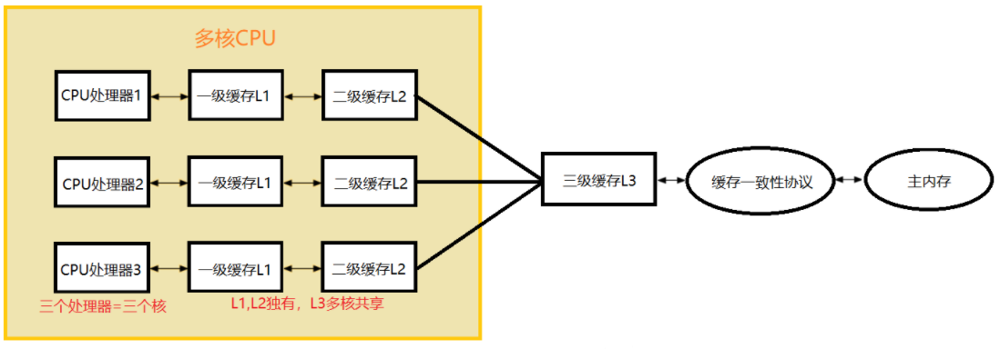

### 3.读写操作

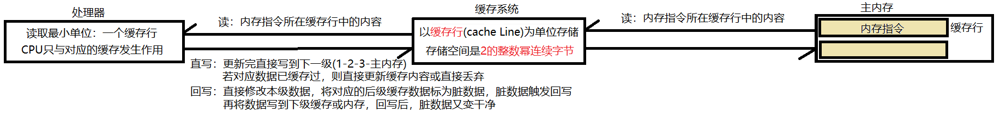

### 4.总线

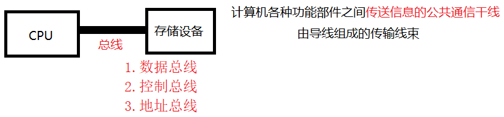

## 二、缓存一致性问题

### 1.问题描述

多个CPU的运算任务都涉及同一主内存区域，可能导致缓存的数据不一致

### 2.总线+锁解决

在总线上加上锁，总线被占用时其他CPU就不能操作，但这效率较低

### 3.窥探技术+缓存一致性协议解决

窥探技术**基于所有数据(缓存行)传输都发生在同一公共干线，每个CPU只需嗅探总线上传输的数据，从而检查自己的数据是否过期**，当缓存行内存地址被修改，则该缓存行被标记为无效状态，CPU修改该前发现缓存行无效则会重新从内存中读该数据到缓存，**窥探技术保证CPU知道数据被修改**

缓存一致性协议用于约束读写操作，每个CPU访问缓存时都遵循该协议，缓存一致性协议主要有MSI、MESI(IllinoisProtocol)、MOSI、Synapse、Firefly及DragonProtocol等，以**MESI协议**(支持回写高速缓存的协议)为例，CPU写数据时如果发现操作的变量是共享变量，即其他CPU中也存在该变量的副本，会发出信号通知其他CPU将该变量的缓存行置为无效状态，当其他CPU需要读取这个变量时发现缓存该变量的缓存行是无效的，那么就会从内存重新读取，MESI协议下CPU中每个缓存行标记的4种状态如下，**缓存一致性协议解决数据不同时如何处理的问题**

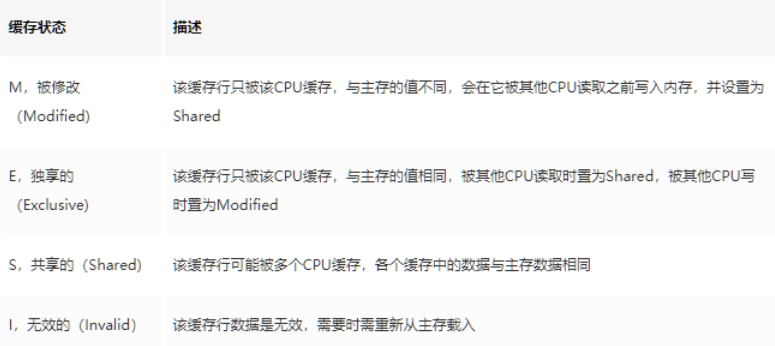

## 三、Java内存模型JMM

### 1.JMM是什么？

JMM全称 Java Memory Model，是Java内存模型，类比计算机内存模型，**用于屏蔽不同操作系统和硬件之间的内存访问差异，使Java程序在各个平台都能达到一致的内存访问效果**

JMM规定所有**实例变量和静态变量**都存在主内存中, 每个线程都有自己的工作内存，**线程的工作内存保存被该线程使用的变量的主内存副本**，线程对变量的所有操作都必须在工作内存中进行，不能直接操作主内存，并且每个线程不能访问其他线程的工作内存

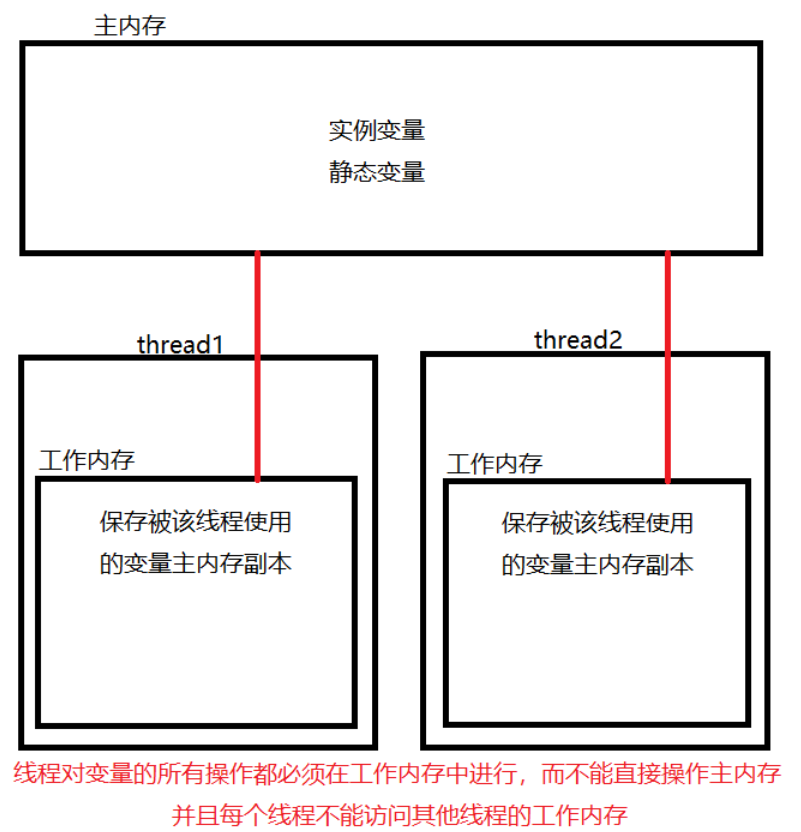

### 2.JMM存在的问题

为了更好的执行性能，JMM没有限制执行引擎使用CPU的特定寄存器或缓存来和主内存打交道，也没有限制编译器优化重排序，**所以JMM会存在缓存一致性问题和指令重排序问题**，即共享变量在多线程间的可见性问题与多条指令执行时的有序性问题，**JMM体现在并发编程的三大特性上**

## 四、并发编程三大特性

### 1.(操作)原子性

小于32位的基本类型的操作都具有原子性，但**long和double变量被看成2个原子性的32位值**，而不是一个原子性的64位值，将一个long型的值保存到内存时是2次32位的写操作，2个竞争线程想写不同的值到内存时，可能导致内存中的值是不正确的结果，`i++`、`i--`、`i=j`、`i=i+1`都不是原子操作，接下来以`i++`与`i--`为例从字节码开始步步深入

两个线程对初始值为0的静态变量，一个做自增，一个做自减，结果是0吗？

```java
static int i = 0;
public static void main(String[] args) throws InterruptedException {
	Thread t1 = new Thread(() -> {
		i++;
	}, "t1");
	Thread t2 = new Thread(() -> {
		i--;
	}, "t2");
    
	t1.start();
	t2.start();
	t1.join();
	t2.join();
	System.out.println(i);
}
```

对于`i++`而言，实际会产生如下的JVM字节码指令，`i--`也类似，可看到分成四步

```java
getstatic i	//获取静态变量i的值
iconst_1	//准备常量1
iadd		//自增，i--改成 isub
putstatic i //将修改后的值存入静态变量i
```

通过上一张图解可知，完成静态变量自增和自减需要在主内存与线程工作内存间进行数据交换

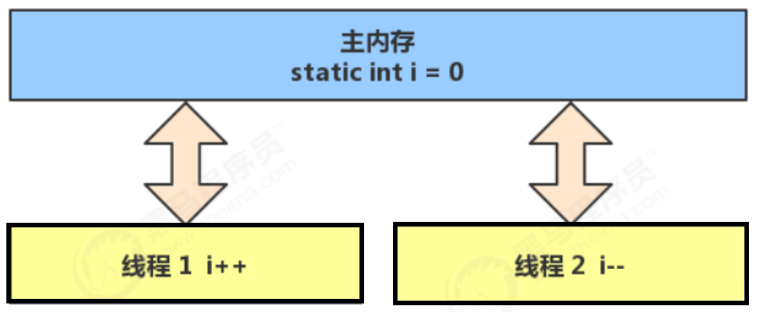

对于单线程，以上自增和自减的8条字节码指令顺序执行，不会存在什么问题，但对多线程来说这8条指令可能交错运行，即线程1可能运行到第三条指令就切换上下文给线程2，线程2若顺利的运行完则将结果-1写回主存，此时继续执行线程1的第三天指令则将结果1写回主存，最终主存中i的结果为1，当然这8条字节码指令间还存在各种交替方式，所以最终i的值可能为正数、负数或零

**其实程序运行多线程本身是不存在问题的，问题出现在多线程访问共享资源，或者说多线程访问共享资源也没问题，问题出现在多线程对共享变量读写操作时发生指令交错**，出现了问题当然就要解决，但不再此处介绍😁，详情请看[有锁编程](/7.JUC并发编程/有锁编程)`synchronized`

对共享资源多线程读写操作的代码块称为**临界区**，多线程在临界区内运行，由于字节码指令执行顺序不同而导致结果无法预测称为发生**竞态条件**

```java
static int i = 0;
static void increment()
//临界区
{	i++;	}
static void decrement()
//临界区
{	i--;	}
```

### 2.(结果)可见性

先举一个例子🙃，`main`线程修改`run`变量对`t`线程不可见，导致`t`线程一直在循环

```java
static boolean run = true;
public static void main(String[] args) throws InterruptedException {
	Thread t = new Thread(()->{
		while(run){
			// ....
		}
	});
	t.start();
	sleep(1);
	run = false;//线程t不会如预想的停下来
}
```

这里来分析一波，最初执行`t`线程的`run()`时，从主内存中读取`run`变量的值`true`

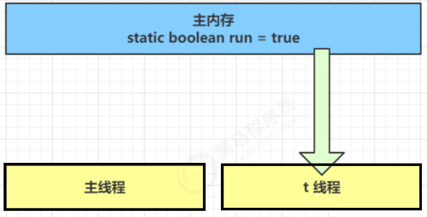

由于`t`线程需要频繁的读取`run`变量，所以会将`run`变量缓存与自己工作内存中，以减少对主存`run`变量的访问

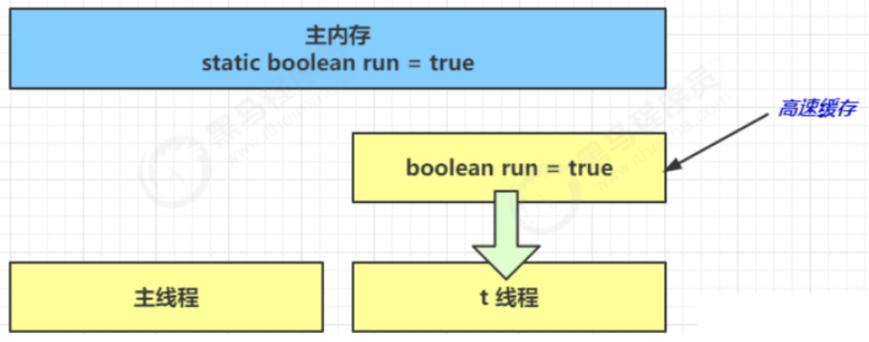

主线程睡眠1秒后，改变`run=false`，但`t`线程是在工作内存中读取，所以循环并不会停止

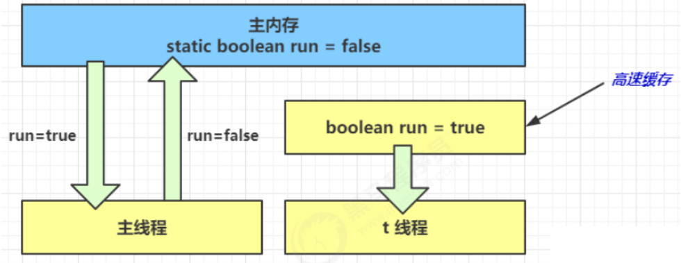

发现问题当然就需要解决，怎么解决呢？可**使用`volatile`关键字修饰成员变量和静态成员变量，避免线程从自己的工作缓存中查找变量的值，必须到主存中获取值**，在<span style="color:red">[五.2]</span>详细讲解；使用`synchronized`在释放锁之前会将共享变量刷新会主内存，`final`也可保证可见性，因为直接就不能修改了啊😁

### 3.(指令)有序性

JVM会在不影响结果正确性的前提下进行**指令重排序**，以提高CPU执行效率，重排序分为编译器优化重排序、指令并行重排序、内存优化重排序，请看如下代码

```java
static int i;
static int j;
// 在某个线程内执行如下赋值操作
i = ...;
j = ...;
```

不管先对`i`还是`j`赋值对结果都没有影响，所以实际真正执行的代码有两种方式，即`i`和`j`的赋值都可以在第一句，对单线程还好，但**多线程下指令重排会影响正确性**，**即多线程下CPU运行同一段代码的结果可能不同**，那么为什么会有指令重排这项优化呢？请看下列代码分析结果

```java
int num = 0;
boolean ready = false;
// 线程1 执行此方法
public void actor1(I_Result r) {//I_Result是一个对象，有一个属性r1用来保存结果
	if(ready) {
		r.r1 = num + num;
	} else {
		r.r1 = 1;
	}
}
// 线程2 执行此方法
public void actor2(I_Result r) {
	num = 2;
	ready = true;
}
```

分析结果可能有如下三种情况

* 情况1：线程1先执行，这时`ready = false`，所以进入`else`分支，结果为1
* 情况2：线程2先执行`num = 2`，但没来得及执行`ready = true`，线程1执行，还是进入`else`分支，结果为1
* 情况3：线程2执行到`ready = true`，线程1执行，这回进入`if`分支，结果为4，因为`num = 2`已经执行过

但除了以上三种情况还可能出现第四种，结果为0，线程2执行`ready = true`，切换到线程1，进入`if `分支，相加为 0，再切回线程2执行`num = 2`，这种现象就叫指令重排，出现问题就谈谈如何解决吧！

**硬件层技术内存屏障可阻止屏障两侧指令重排序**，指令屏障分为读屏障LoadBarrier和写屏障StoreBarrier，**软件层可通过`volatile`关键字**，没错是他是他还是他🙃，在<span style="color:red">[五.3]</span>中详细讲解

> Java是跨平台的，不同平台的内存屏障可能不一致，怎么办呢？
>
> 不用担心，Java会屏蔽掉这些差异，通过JVM生成内存屏障指令，屏蔽不同操作系统和硬件之间的内存访问差异，使Java程序在各个平台都能达到一致的内存访问效果

****

**happens-before原则(先行开发者原则)实际规定了对共享变量的写操作对其它线程的读操作**可见，它是**可见性与有序性的一套规则总结**，抛开以下happens-before规则，JMM并不能保证一个线程对共享变量的写对于其它线程对该共享变量的读可见，具体体现如下

- **程序次序**：书写在前面的操作先发生于书写在后面的操作

- **管程锁定**：解锁操作先发生于加锁操作

```java
//线程解锁m前，对m的写操作先发生于其他线程加锁后对m的读操作
static int x;
static Object m = new Object();

new Thread(()->{
	synchronized(m) {
		x = 10;
	}
},"t1").start();
new Thread(()->{
	synchronized(m) {
		System.out.println(x);
	}
},"t2").start();
```

- **volatile变量**：对volatile变量的写操作先发生于对这个变量的读操作

```java
volatile static int x;

new Thread(()->{
	x = 10;
},"t1").start();
new Thread(()->{
	System.out.println(x);
},"t2").start();
```

- **线程启动**：Thread对象的start()方法先发生于此线程的每个动作

```java
//线程start()前对变量的写先发生于线程开始后对变量的读
static int x;
x = 10;

new Thread(()->{
	System.out.println(x);
},"t2").start();
```

- **线程终止**：线程中所有的操作都先发生于线程的终止检测

```java
//线程结束前的写先发生于线程结束后的读
static int x;
Thread t1 = new Thread(()->{
	x = 10;
},"t1");
t1.start();
t1.join();
System.out.println(x);
```

- **线程中断**：对线程interrupt()方法的调用先发生于检测中断线程代码

```java
//线程t1打断t2(interrupt)前对变量的写，对于其他线程得知t2被打断后对变量的读可见
static int x;
public static void main(String[] args) {
    Thread t2 = new Thread(()->{
        while(true) {
            if(Thread.currentThread().isInterrupted()) {
                System.out.println(x);
                break;
            }
        }
    },"t2");
    t2.start();
    
    new Thread(()->{
        sleep(1);
        x = 10;
        t2.interrupt();
    },"t1").start();
    
    while(!t2.isInterrupted()) {
        Thread.yield();
    }
    System.out.println(x);
}
```

- **对象终结**：对象的初始化完成先发生于他的finalize()方法的开始
- **传递性**：如果操作A先行发生于操作B，而操作B又先行发生于操作C，则可以得出操作A先行发生于操作C

```java
//y由于volatile两侧禁止指令重排，若以y的写先发生于x的写，而x得写先发生于x得读，所以y对t2可见
volatile static int x;
static int y;

new Thread(()->{
	y = 10;
	x = 20;
},"t1").start();
new Thread(()->{
	//x=20对t2可见, 同时y=10也对t2可见
	System.out.println(x);
},"t2").start();
```

最后再来看一个使用happens-before原则分析指令执行顺序得出输出的案例，`flag`加上`volatile`关键字那就禁止指令重排，也就是`1 happens-before 2`；根据`volatile`变量规则`2 happens-before 3`；由程序次序规则得出`3 happens-before 4`；由传递性`1->2->3->4`得出`1 happens-before 4`；所以最终`sum=2`

```java
volatile bool flag = false;
int b = 0;

public void read() {
   b = 1;              //1
   flag = true;        //2
}

public void add() {
   if (flag) {         //3
       int sum =b+b;   //4
       System.out.println("bb sum is"+sum); 
   } 
}
```

### 4.小结

* **原子性** - 保证指令不会受到线程上下文切换的影响

> 线程上下文切换(Thread Context Switch)因为以下一些原因导致CPU不再执行当前的线程，转而执行另一个线程的代码，当Context Switch发生时，需要由操作系统保存当前线程的状态，并恢复另一个线程的状态，频繁的切换上下文会消耗CPU
>
> * 线程的CPU时间片用完
> * 垃圾回收
> * 有更高优先级的线程需要运行
> * 线程自己调用`sleep、yield、wait、join、park、synchronized、lock`等方法

* **可见性** - 保证指令不会受CPU缓存的影响
* **有序性** - 保证指令不会受CPU指令并行优化的影响

## 五、Volatile

### 1.什么是volatile？

`volatile`是JVM提供的**轻量级同步机制**，修饰成员变量和静态成员变量，多线程下保证**可见性和有序性**，但不保证原子性

### 2.volatile保证可见性

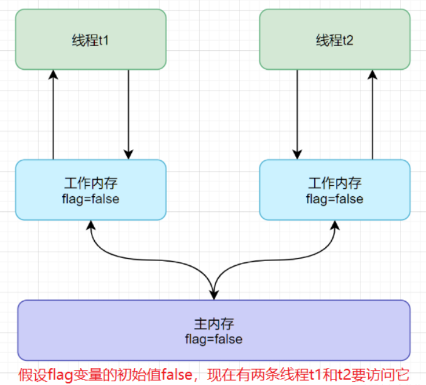

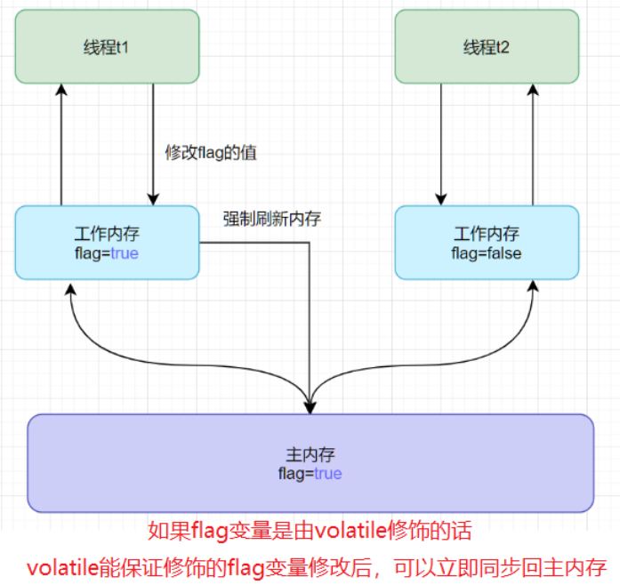

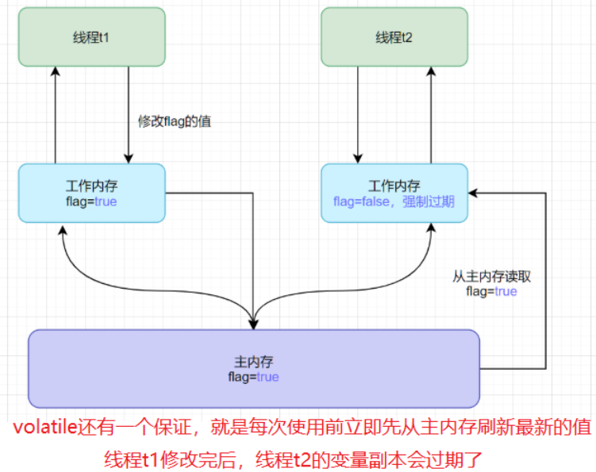

### 3.volatile保证有序性

内存屏障保证有序性，那么`volatile`如何保障内存屏障的呢？即**每个`volatile`写操作前加入SS屏障，写操作后加入SL屏障；每个`volatile`读操作前加入LL屏障，读操作后加入LS屏障**

|  内存屏障类型  |     抽象场景     |                   描述                    |
| :------------: | :--------------: | :---------------------------------------: |
| StoreStore屏障 | Store1;SS;Store2 | Store2写操作前保证Store1的写对其他CPU可见 |
| StoreLoad屏障  | Store1;SL;Load2  | Load2读操作前保证Store1的写对其他CPU可见  |
|  LoadLoad屏障  |  Load1;LL;Load2  |  Load2读操作前保证Load1的读操作执行完毕   |
| LoadStore屏障  | Load1;LS;Store2  |  Store2写操作前保证Load1的读操作执行完毕  |

看看以下这个栗子吧

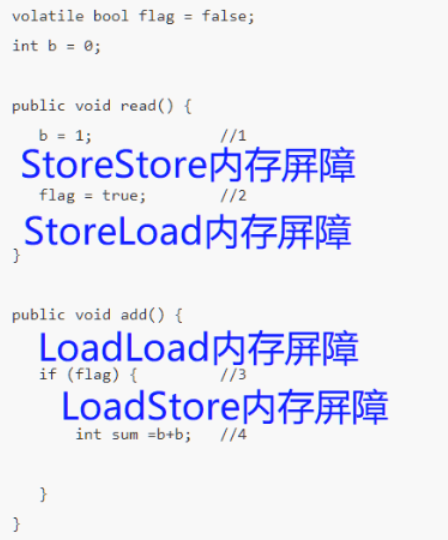

### 4.小结

`volatile`实际既可以保证可见性，又可以保证有序性，体现在`volatile`使数据不受缓存的影响，且`volatile`禁止指令重排


> [参考文章](https://blog.csdn.net/weixin_45735355/article/details/121946452)


