# JVM运行时数据区

## 一、JVM整体架构组成

**JVM由类装载器子系统、运行时数据区、执行引擎组成**，其整体架构图如下，本地方法接口属于OS


**每个JVM只有一个Runtime实例**，即为运行时环境，相当内存结构的运行时数据区

JVM定义若干种程序运行期间会使用到的运行时数据区，其中一些会随着JVM启动而创建，随着JVM退出而销毁，另外一些则与线程对应的，随着线程的开始和结束而创建和销毁，如下图所示，灰色部分属于线程私有

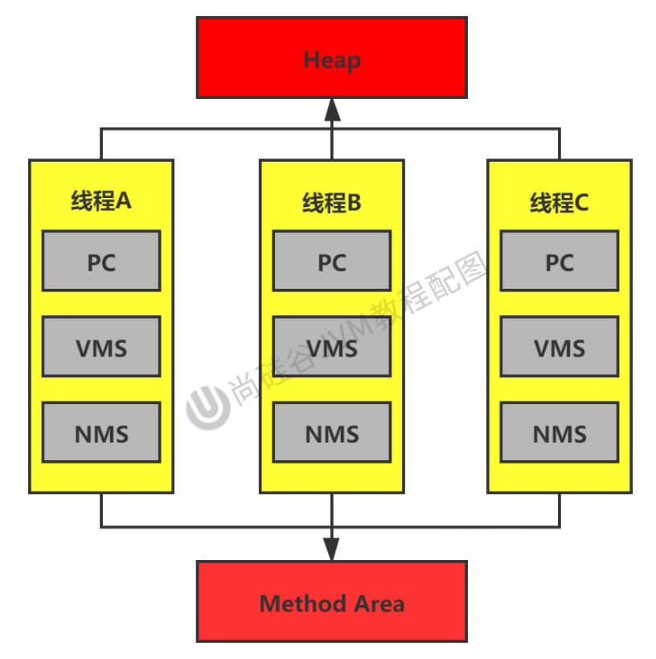

## 二、JVM内的线程

### 1.JVM内线程的创建与销毁

**线程是调度的基本单元，JVM允许一个应用内多线程并行执行**

HotSpot中**每个线程都与OS的本地线程直接映射**，当Java线程准备执行时OS本地线程同时创建，OS本地线程初始化成功后会调用Java程序中的`run()`，`run()`执行过程中遇到未捕获异常则Java程序将终止，即Java线程终止，当Java线程执行终止后OS本地线程也被回收，若此时回收的OS本地线程是JVM内的最后一个非守护线程则JVM也将终止

### 2.JConsole工具查看JVM线程

①编写死循环代码并编译运行

```Java
package com.yc.Test01_jconsole;

public class Test01 {
    public static void main(String[] args) {
        while (true) {
            Object obj = new Object();
        }
    }
}
```

②打开jconsole查看内部线程


### 3.JVM后台线程

使用jconsole工具发现JVM内包含许多后台线程，**其后台线程不包括调用`main()`的线程以及`main()`内部创建的线程**，主要的后台系统线程主要有如下几种

* **JVM线程**：JVM达到安全点才会出现
* **周期任务线程**：一般用于周期性操作的调度执行(比如中断)
* **GC线程**：为JVM中不同种类的垃圾收集行为提供支持
* **编译线程**：编译线程运行时将字节码编译成本地代码
* **信号调度线程**：该线程负责接收信号并发送给JVM

## 三、程序计数器PC

### 1.PC寄存器是什么？

PC寄存器是一块**很小的内存空间**(几乎可忽略不记)，也是**运行速度最快的存储区域**，用于**存储下一条指令的地址，即将要执行的代码由执行引擎读取下一条指令**，分支、循环、跳转、异常处理、线程恢复等基础功能都依赖PC


JVM规范中，每个线程都有自己的PC寄存器，所以**PC寄存器是线程私有的**，其生命周期与线程的生命周期保持一致

**任何时刻一个线程只执行一个方法**，PC寄存器存储会存储当前线程正在执行的方法的JVM指令地址，若执行的方法是native方法，则是未指定值(undefined)

PC寄存器**没有GC(垃圾回收)**，也**没有OOM(OutOfMemoryError)**

> 虚拟机栈和本地方法栈没有GC但有OOM，堆和方法区既有GC又有OOM

### 2.举例说明

①测试代码

```java
public class PCRegisterTest {
    public static void main(String[] args) {
        int i = 10;
        int j = 20;
        int k = i + j;

        String s = "nba";

        System.out.println(i);
        System.out.println(k);
    }
}
```

②将源代码编译生成字节码，后对其反编译


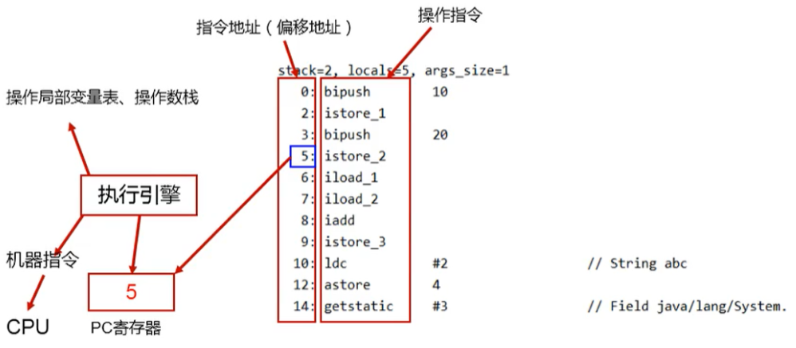

### 3.常见面试题

#### 3.1.**使用PC寄存器存储字节码指令地址有什么用呢？**

CPU需要不断的切换各个线程，当切换回来时，**需要知道从何处开始继续执行**

JVM解释器需要通过改变PC寄存器的值来明确下一条指令

#### 3.2.为什么使用PC寄存器记录当前线程的执行地址呢？即PC寄存器为什么被设定为私有的？

**由于CPU时间片轮询限制，多线程在并发的特定的时间段内只执行其中某个线程的某条指令**，这样必然导致经常中断或恢复，为了**准确地记录各个线程正在执行的当前字节码指令地址**，最好的办法自然是**为每个线程都分配一个PC寄存器**，这样各个线程之间便可以进行独立计算，不会出现相互干扰的情况

> CPU时间片指CPU分配给各个程序的时间，每个线程被分配一个时间段，即时间片
>
> 宏观上同时打开多个应用程序，每个程序同时运行，微观上一个CPU一次只能处理程序要求的一部分，如何处理公平？一种方法就是引入时间片，每个程序轮流执行

## 四、虚拟机栈

### 1.虚拟机栈出现背景

由于跨平台性的设计，导致Java的指令都根据栈设计，优点是跨平台、指令集小、编译器容易实现，缺点是性能下降、实现同样的功能需要更多的指令

> 不同平台CPU架构不同，所以不能设计为基于寄存器的

### 2.虚拟机栈是什么？

在内存中，栈是运行单位，即**栈解决程序如何运行问题**，堆是存储单位，即**堆解决数据怎么存储问题**

虚拟机栈早期也叫Java栈，每个线程创建时都会创建一个虚拟机栈，所以**虚拟机栈是线程私有的**，其生命周期与线程的生命周期保持一致

PC寄存器**没有GC(垃圾回收)**，也**没有OOM(OutOfMemoryError)**

虚拟机栈**内部保存着一个个栈帧(Stack Frame)**，对应一次次Java方法调用，每个Java方法的调用都对应着压栈和入栈

虚拟机栈的速度仅次于PC寄存器

### 3.虚拟机栈中可能出现的异常

JVM规范允许虚拟机栈的大小是动态的或固定不变的

**StackOverflowError**：若采用固定不变的虚拟机栈，那么每个线程的虚拟机栈大小可在线程创建时独立创建，若线程请求分配的虚拟机栈容量大于虚拟机栈的最大容量则抛出此异常，测试代码如下

```Java
public class XSS {//一个简单的相互调用
    private static int count = 0;

    public static void recursion() {
        count++;
        recursion();
    }

    public static void main(String[] args) {
        try {
            recursion();
        } catch (Throwable e) {
            System.out.println(count);
            e.printStackTrace();
        }
    }
}
```

**OutOfMemoryError**：若采用动态的虚拟机栈，在尝试扩展时无法申请到足够内存或创建新线程的同时没有足够内存创建虚拟机栈则抛出此异常，测试代码如下

```Java
import java.util.ArrayList;

public class OutOfMemory {
    public static void main(String[] args) {
        ArrayList<Student> list = new ArrayList<>();
        while (true) {
            list.add(new Student(1L, "a", 30L));
        }
    }
}

class Student {
    long id;
    String name;
    long age;

    public Student(long id, String name, long age) {
        this.id = id;
        this.name = name;
        this.age = age;
    }
}
```

### 4.设置内存大小

**栈大小直接决定函数调用的最大可达深度**，可通过参数`-Xss`选项来设置线程的最大栈空间

IDEA中的设置方式：`Run → Edit Configurations → Application → 选中项目 → Configuration → VM options → -Xss2m`


### 5.栈的运行原理

每个线程都有自己的栈，栈中的数据都是以**栈帧(Stack Frame)**的格式存在，在该线程上执行的方法都对应一个栈帧，栈帧是内存区块，是数据集，维系着方法执行过程的各种数据信息

**JVM直接对虚拟机栈的操作只有两个，即出栈和入栈**，线程内同一时间只能有一个活动栈帧，即栈顶栈帧，被称为当前栈帧，当前栈帧对应的方法就是当前方法，定义该方法的类就是当前类，**不同线程的栈帧不允许相互引用**，**执行引擎运行的所有字节码指令只对当前栈帧进行操作**

> 若当前方法中还调用其他方法，则该被调用的方法对应新栈帧被创建，放在栈顶，成为新当前栈帧，该被调用方法返回结果之际会将结果给下一个栈帧，JVM丢弃该栈帧，下一个栈帧成为新当前栈帧
>
> 方法有两种返回方式，即正常return和抛出异常未捕获，不管哪一种方式返回当前栈帧都被弹出


### 6.栈帧内部结构

#### 6.1.内部图解


#### 6.2.局部变量表

局部变量表被定义为**数字数组**，用于**顺序存储方法参数和局部变量**，局部变量表属于线程私有，所以**不存在数据不安全问题**，方法调用结束后随着栈帧销毁，局部变量表也随之被销毁

**局部变量表的大小在编译期间确定**，保存于方法Code属性的`maximum local variables`数据项中，运行期间局部变量表的大小不会改变，以下出示案例，通过jclasslib工具查看分析

```java
import java.util.Date;

public class LocalVariablesTest {
    private int count = 0;

    public static void main(String[] args) {
        LocalVariablesTest test = new LocalVariablesTest();
        int num = 10;
        test.test1();
    }

    public void test1() {
        Date date = new Date();
        String name = "cba";
        System.out.println(date + name);
    }
}
```


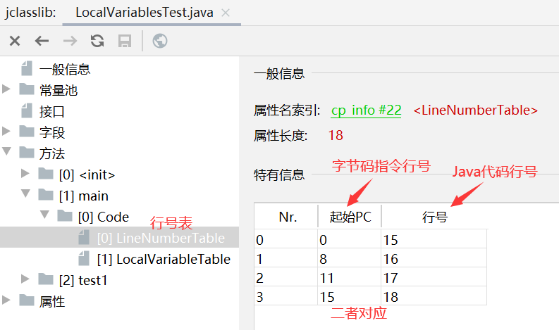

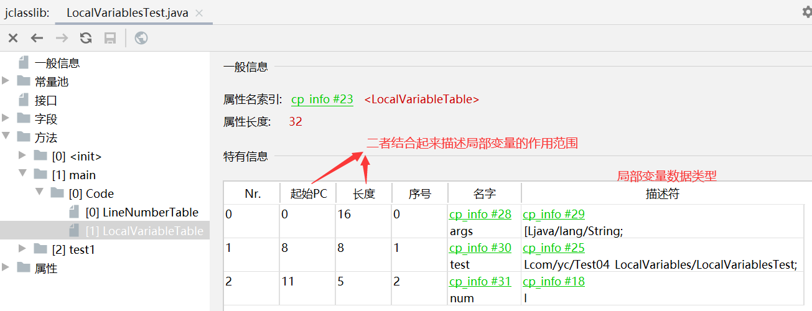


**局部变量表最基本的存储单元是Slot(变量槽)**，32位以内的数据占用一个Slot，64位占用两个Slot(long、double)，byte、short、char在存储前被转换为int，boolean也被转换为int，**JVM为局部变量表中的每个Slot都分配访问索引**，通过索引可成功访问到局部变量表中指定的局部变量值，当访问64位数据时，只需要使用前一个索引

若当前栈帧由构造方法`<init>`或实例方法(非静态)创建，该对象的this将被存于index为0的Slot，注意静态方法无this，其他参数按参数表顺序排列

局部变量表中**Slot可重用**，若一个局部变量过了其作用域，那么在其作用域之后产生的新局部变量就很有可能会复用该Slot，从而达到节省资源的目的

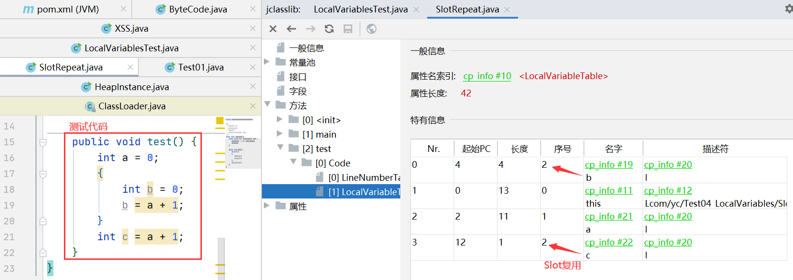

> 栈帧中与**性能调优**关系最为密切的部分就是**局部变量表**，方法执行时JVM使用局部变量表完成方法的传递，**局部变量表中的变量也是重要的垃圾回收根节点**，只要被局部变量表中直接或间接引用的对象都不会被回收

#### 6.3.操作数栈

方法执行过程中根据字节码指令往操作数栈中写入或取出数据，**主要用于保存计算过程的中间结果，同时作为计算过程中变量的临时存储空间**，操作数栈使用**数组**实现，新栈帧被创建时操作数栈是空的，但是数组有长度，数组一旦创建其长度不可变

操作数栈所需的最大深度在编译器就定义好，保存于方法Code属性的`max_stack`数据项中

**操作数栈中元素可以是任意Java数据类型**，32位以内的数据占用一个栈单位深度，64位占用两个栈单位深度，操作数栈并非采用索引方式访问，**只可通过标准入栈和出栈完成一次数据访问**

若被调用的方法存在返回值，其返回值被压入当前栈帧的操作数栈，更新PC寄存器中下一条需要执行的字节码指令，接下来进行代码追踪👇

```Java
//以求和操作为例说明操作数栈的作用
public class OperandStackTest {
    public void testAddOperation() {
        byte i = 15;
        int j = 8;
        int k = i + j;
    }
}
```

将以上代码.class文件反编译后，字节码指令信息如下

```Java
 public void testAddOperation();
    descriptor: ()V
    flags: ACC_PUBLIC
    Code:
      stack=2, locals=4, args_size=1
         0: bipush        15
         2: istore_1
         3: bipush        8
         5: istore_2
         6: iload_1
         7: iload_2
         8: iadd
         9: istore_3
        10: return
      LineNumberTable:
        line 16: 0
        line 17: 3
        line 18: 6
        line 19: 10
      LocalVariableTable:
        Start  Length  Slot  Name   Signature
            0      11     0  this   Lcom/atguigu/jvmstack/OperandStackTest;
            3       8     1     i   B
            6       5     2     j   I
           10       1     3     k   I
```

**字节码执行过程如下**

* 栈帧对应一次方法调用，当方法被调用时创建栈帧，此时局部变量表和虚拟机栈都为空，但大小在编译时期已经确定好，`0: bipush        15`让15进入操作数栈


* 执行完上一条语句后PC+1指向下一条指令，将15出栈，`istore_1`使15保存到局部变量表索引1的位置(0位置保存的是this)


* 指令地址3、5与上两步相同，图解如下


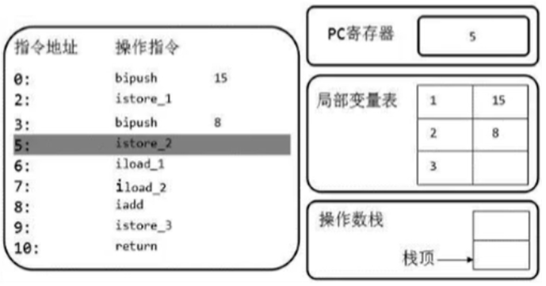

* `iload_1`和`iload_2`是取局部变量表中索引12位置的局部变量存到操作数栈中

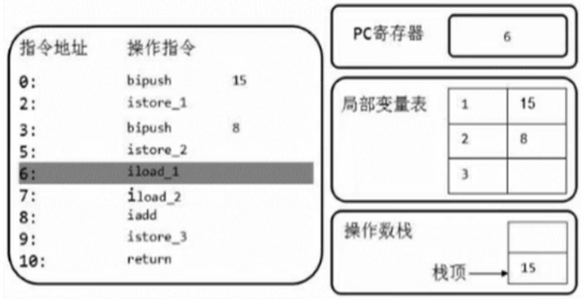

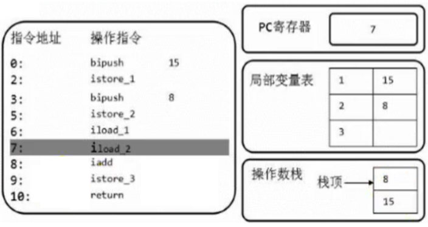

* 指令地址8会将操作数栈中的两个元素出栈，此时**执行引擎参与将字节码指令转换为机器指令`iadd`**，两数相加后结果23存入操作数栈中

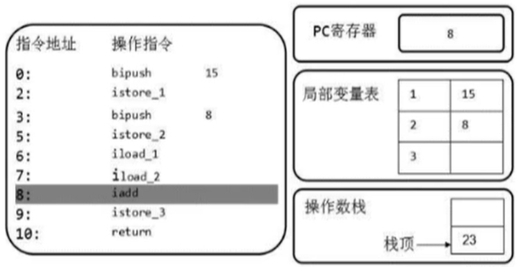

* 指令地址9会将操作数栈中23取出存到局部变量表索引3的位置


* 最后PC指向10，退出方法

#### 6.4.动态链接

栈帧内部都包含指向**运行时常量池中该栈帧所属方法的引用**，包含该引用**为了支持当前方法的代码实现动态链接(Dynamic Linking)**，比如`invokedynamic`指令

Java源文件被编译成字节码时，所有的变量和方法引用都作为符号变量被存于常量池，**动态链接的作用也就是将这些符号引用转变为直接引用**


> Constant Pool存于字节码文件中，字节码运行起来就成了我们常说的运行时常量池，为什么需要运行时常量池呢？
>
> 不同方法中可能有相同属性或方法，相同的属性或方法存一份就好，节省空间

JVM中将符号引用转为直接引用与**方法的绑定机制相关**，链接方式也分为两种

* **静态链接**：被调用的方法在编译器可知，且运行期保持不变
* **动态链接**：被调用的方法在编译器无法确定，即只能在运行期将符号引用转变为直接引用，这种转变过程具备动态性

方法的绑定机制同样也分为两种，绑定一个字段、方法或类符号引用转变为直接引用的过程仅仅发生一次

* **早期绑定**：被调用的方法在编译器可知，且运行期保持不变，即可将该方法与所属类型绑定，使用静态链接将符号引用转为直接引用
* **晚期绑定**：被调用的方法在编译器无法确定，使用动态链接将符号引用转为直接引用

> 面向对象语言总保留着封装、继承、多态的特点，因为多态，自然也就具备早期绑定和晚期绑定两种

#### 6.5.方法返回地址

方法结束只有两种方式，即正常退出或异常退出，无论哪种**都返回到该方法被调用的位置**，**方法返回地址存的就是调用该方法PC寄存器的值**

* **正常退出**：执行引擎遇到方法返回字节码指令(return)会将返回值递给上层方法调用者

  > ireturn(boolean，byte，char，short，int)，lreturn(long)，freturn(float类型)，dreturn(double)，areturn(引用类型)

* **异常退出**：方法执行过程中遇到异常且未捕获，即方法的异常表中为检索到该异常会导致方法退出，且**无返回值给上层调用者**

本质上，方法退出就是当前栈帧出栈的过程，需要恢复上层调用者的局部变量表、操作数栈并将方法返回值压入上层调用者的操作数栈、更新PC寄存器值等

#### 6.6.一些附加操作

虚拟机栈允许携带JVM相关的附加信息，如对程序调试提供支持的信息

### 7.常见面试题

#### 7.1.虚拟机栈上保存哪些数据？怎么放？

虚拟机栈上以栈帧为单位，栈帧由五部分组成，**局部变量表**以数字数组的形式存放方法参数与返回值，**操作数栈**以数组形式存放中间结果，**动态链接**将符号引用转为直接引用，**方法返回地址**存调用该方法PC寄存器的值，**一些附加信息**

#### 7.2.虚拟机栈是线程独有的吗？是否存在GC？是否有内存溢出问题？虚拟机栈的优点？

虚拟机栈是线程独有，不存在GC，存在内存溢出问题，虚拟机栈跨平台、指令集小、编译快

#### 7.3.虚拟机栈的大小是否可动？是否会有异常出现？调整栈大小可以保证不溢出吗？

虚拟机栈大小可通过`-Xss`改变，可能出现`StackOverflowError`和`OutofMemoryError`，调整栈大小不能保证不溢出，仅仅能保证异常晚一点出现

#### 7.4.方法中定义的局部变量是否线程安全？

这个具体情况具体分析，总之**对象在方法内部产生，同时在方法内部消亡则一定线程安全**

## 五、本地方法栈

### 1.什么是本地方法？

本地方法(Native Method)指**Java代码调用非Java代码的接口**，定义Native Method时不必提供实现体，因为由外部非Java语言提供实现

> native标识符不可与abstract连用，其他都可以

本地方法出现解决Java实现某些任务不容易或效率不高，使用其他容易实现的语言的情况，经过以下实例通过Java代码调用C代码

①编写Java代码，内部定义并调用native方法

```java
public class Testjni{
	public native void hello();
	
	static {
		System.setProperty("java.library.path",".");//.代表当前class文件所在目录
		System.loadLibrary("dllhelloworld");//dllhelloworld是生成的dll文件的名字
	}
	
	public static void main(String []args){
		new Testjni().hello();
	}
}
```

②`javac -h ./ Testjni.java`编译并生成头文件

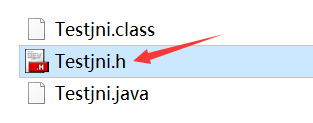

③打开Testjni.h

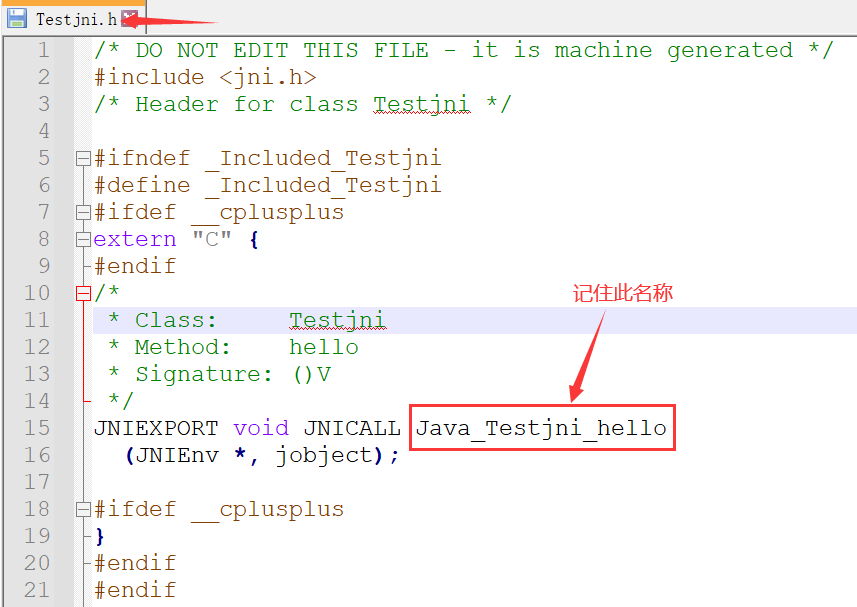

④新建DLL的C项目


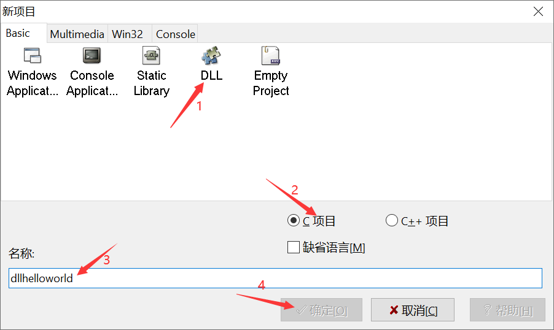

⑤从JDK安装目录`include`下拷贝三个文件


⑥编写`dllmain.h`，同时保存`dllmain.h`和`dll.h`，编译生成`dllhelloworld.dll`，该文件需要与`dllhelloworld.dev`同名

```c
/* Replace "dll.h" with the name of your header */
#include "dll.h"
#include "jni.h" //添加此头文件 
#include <windows.h>

DLLIMPORT void HelloWorld()
{
	MessageBox(0,"Hello World from DLL!\n","Hi",MB_ICONINFORMATION);
}

//编写C代码，名称与之前.h文件中需要记住的名称相同
JNIEXPORT void JNICALL Java_Testjni_hello(JNIEnv * env, jobject thiz){
	printf("HELLO WORLD...\n");
	return;
} 

BOOL WINAPI DllMain(HINSTANCE hinstDLL,DWORD fdwReason,LPVOID lpvReserved)
{
	switch(fdwReason)
	{
		case DLL_PROCESS_ATTACH:
		{
			break;
		}
		case DLL_PROCESS_DETACH:
		{
			break;
		}
		case DLL_THREAD_ATTACH:
		{
			break;
		}
		case DLL_THREAD_DETACH:
		{
			break;
		}
	}
	
	/* Return TRUE on success, FALSE on failure */
	return TRUE;
}
```

⑦`java Testjni`运行Java代码，注意`dllhelloworld.dll`需要与`Testjni.class`在同一目录

```
E:\JVM\Native Method>java Testjni
HELLO WORLD...
```

### 2.本地方法栈

虚拟机栈用于管理Java方法调用，而本地方法栈则用来管理本地方法的调用，本地方法栈是C语言编写

**本地方法栈也是线程私有的**，不存在GC，存在两种异常，允许固定或动态扩展内存大小

**本地方法栈中登记native方法，执行引擎执行时加载本地方法库**

某线程调用本地方法时，它就进入一个全新的并且不再受JVM限制的世界，**本地方法可以通过本地方法接口来访问JVM内部的运行时数据区**，甚至可以直接使用本地处理器中的寄存器，直接从本地内存的堆中分配任意数量的内存

并不是所有的JVM都支持本地方法。因为JVM规范并没有明确要求本地方法栈的使用语言、具体实现方式、数据结构等，如果JVM产品不打算支持native方法也可以无需实现本地方法栈，**Hotspot JVM直接将本地方法栈和虚拟机栈合二为一**

### 3.常见面试题

#### 3.1.本地方法栈是什么？有什么用？

本地方法栈是存放native方法的栈，用于管理每次本地方法调用

#### 3.2.本地方法栈是线程私有吗？是否有可能抛出异常？

本地方法栈是线程私有，可能抛出OOM和StackOverflowError

#### 3.3.JVM规范一定强制要求实现本地方法栈吗？

不强制要求，支持本地方法时才需要实现本地方法栈

## 六、插播一条调优工具的使用

### 1.使用jvisuallvm工具


### 2.Visual GC插件安装

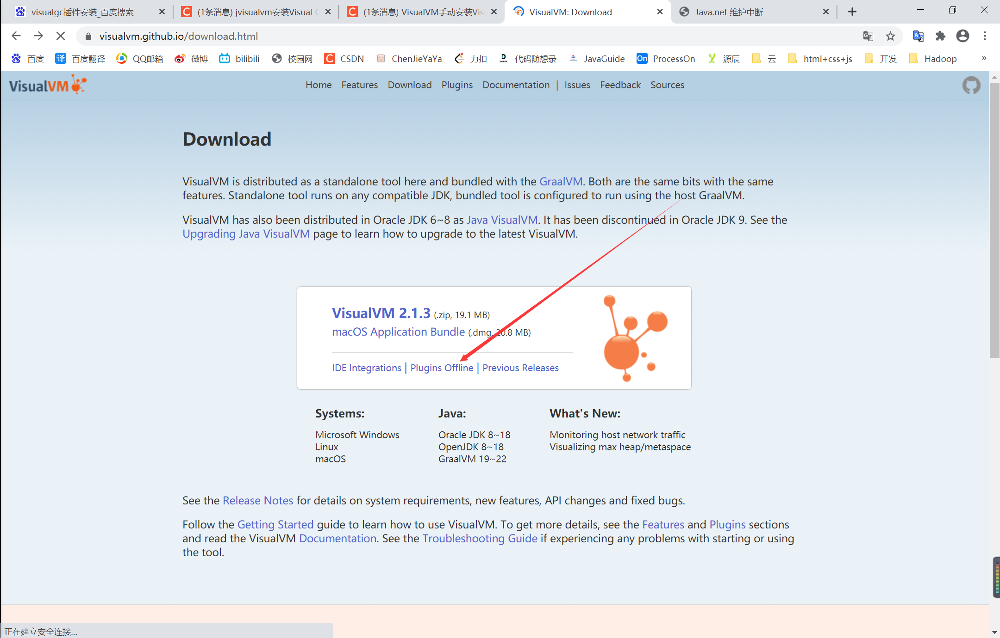


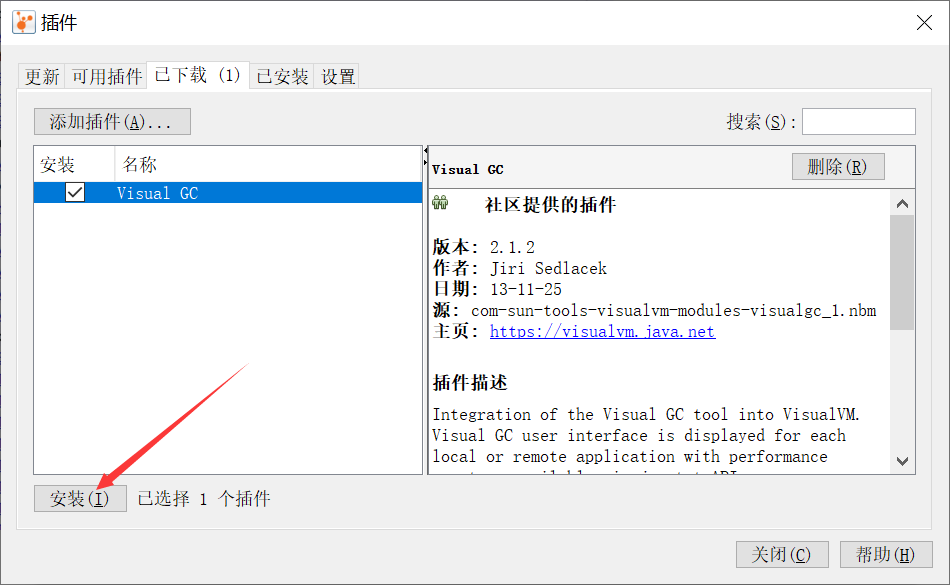

> [参考文章](https://blog.csdn.net/jushisi/article/details/109655175?utm_medium=distribute.pc_relevant.none-task-blog-2~default~baidujs_baidulandingword~default-0-109655175-blog-119964128.pc_relevant_multi_platform_whitelistv2&spm=1001.2101.3001.4242.1&utm_relevant_index=2)

### 3.运行项目，出现Visual GC

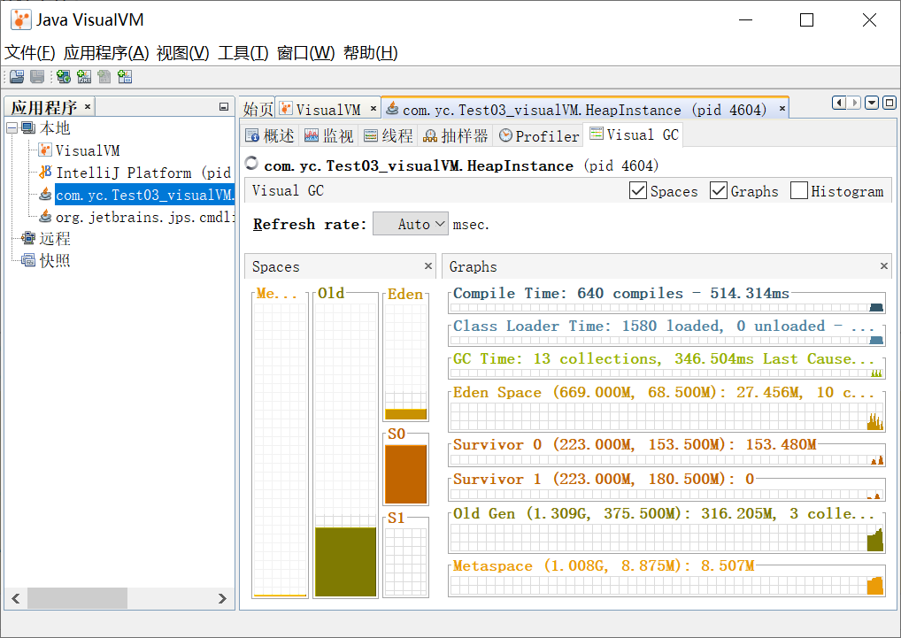

## 七、堆

### 1.堆概述

一个JVM进程对应一个JVM实例，一个JVM实例只有一个堆内存，而一个JVM进程可包含多个线程，所以**堆被线程共享，但可以划分线程私有的缓冲区(TLAB)**，**堆可以处于物理上不连续的空间，但逻辑上需要是连续的**

数组和对象可能永远不会存于栈上，因为栈帧中存的是数组和对象的引用，该引用指向数组和对象在堆中的位置，所以**数组和对象实际存于堆中**

> 《Java虚拟机规范》中对Java堆的描述是：所有的对象实例以及数组都应当在运行时分配在堆上(The heap is the run-time data area from which memory for all class instances and arrays is allocated.)

方法结束后堆中对象不会马上被移除，仅仅在垃圾收集时才会被移除，也就是触发GC时该对象才被回收，若方法结束后对象被马上回收，那么用户线程会受到影响，**堆是GC执行垃圾回收的重点区域**


现代垃圾收集器基于**分代收集理论**设置，堆空间可细分为如下情况

* Java7及之前堆内存逻辑上分为三部分：**新生区(Young Generation Space) + 养老区(Tenure Generation Space) + 永久区(Permanent Space)**


* Java8及之后堆内存逻辑上分为三部分：**新生区(Young Generation Space) + 养老区(Tenure Generation Space) + 元空间(Meta Space)**


> 约定：新生区 = 新生代 = 年轻代、养老区 = 老年区 = 老年代、永久区 = 永久代

* Java7与Java8堆空间对比


### 2.设置堆内存大小与OOM

Java堆区在JVM启动时被创建，其空间大小也确定好，**堆内存大小可通过`-Xms`和`-Xmx`调节**，`-Xms`用于设置新生代和老年代的初始内存大小，`-Xmx`用于设置新生代和老年代的最大内存大小，内存超过`-Xmx`则抛出OutOfMemoryError，**通常配置`-Xms=-Xmx`，目的是GC清理完堆区后无需重新计算堆区大小，从而提高性能,默认`-Xms=电脑物理内存大小 / 64`，`-Xmx=电脑物理内存大小 / 4`**

通常配置`-Xms=-Xmx`，目的是GC清理完堆区后无需重新计算堆区大小，从而提高性能

> IDEA设置方法：Run → Edit Configurations → Application → HeapSpaceInitial → Configuration → VM options → -Xms600m -Xmx600m

查看设置参数，代码如下

```Java
public class HeapTest {
    public static void main(String[] args) {
        //获取本机逻辑处理器的数量
        System.out.println(Runtime.getRuntime().availableProcessors()); //8

        //返回Java虚拟机试图使用的最大堆内存量
        System.out.println(Runtime.getRuntime().maxMemory() / 1024 / 1024 + "MB"); //1787MB

        //返回Java虚拟机中的堆内存总量
        System.out.println(Runtime.getRuntime().totalMemory() / 1024 / 1024 + "MB"); //121MB
    }
}
```

**IDEA中查看堆空间配置参数有两种方式**

* `Win+R → cmd → jps / jstat -gc 进程id / jinfo -flag NewRatio 进程id（查看对应的-XX:NewRatio=2）`
* VMoptions中配置参数`-Xms600m -Xmx600m -XX:+PrintGCDetails`，其中`-XX:+PrintGCDetails`用于打印垃圾回收的细节，测试代码如下

```java
public class HeapSpaceInitial {
    public static void main(String[] args) {

        //返回Java虚拟机中的堆内存总量
        long initialMemory = Runtime.getRuntime().totalMemory() / 1024 / 1024;
        //返回Java虚拟机试图使用的最大堆内存量
        long maxMemory = Runtime.getRuntime().maxMemory() / 1024 / 1024;

        System.out.println("-Xms : " + initialMemory + "M"); //-Xms : 575M
        System.out.println("-Xmx : " + maxMemory + "M"); //-Xmx : 575M

        System.out.println("系统内存大小为：" + initialMemory * 64.0 / 1024 + "G");
        System.out.println("系统内存大小为：" + maxMemory * 4.0 / 1024 + "G");

        try {
            Thread.sleep(100);
        } catch (InterruptedException e) {
            e.printStackTrace();
        }
    }
}
```

```java
-Xms : 575M
-Xmx : 575M
系统内存大小为：35.9375G
系统内存大小为：2.24609375G
Heap
 PSYoungGen      total 179200K, used 15360K [0x00000000f3800000, 0x0000000100000000, 0x0000000100000000)
  eden space 153600K, 10% used [0x00000000f3800000,0x00000000f4700268,0x00000000fce00000)
  from space 25600K, 0% used [0x00000000fe700000,0x00000000fe700000,0x0000000100000000)
  to   space 25600K, 0% used [0x00000000fce00000,0x00000000fce00000,0x00000000fe700000)
 ParOldGen       total 409600K, used 0K [0x00000000da800000, 0x00000000f3800000, 0x00000000f3800000)
  object space 409600K, 0% used [0x00000000da800000,0x00000000da800000,0x00000000f3800000)
 Metaspace       used 3288K, capacity 4500K, committed 4864K, reserved 1056768K
  class space    used 359K, capacity 388K, committed 512K, reserved 1048576K
```

### 3.新生代和老年代

**存储与JVM的对象可分为两类**，一类生命周期较短，创建和消亡都非常迅速；另一类生命周期非常长，极端情况下生命周期可与JVM生命周期保持一致，所以**JVM堆区也进一步划分为新生代YoungGen和OldGen，新生代又可划分为Eden空间、Survivor0(From)空间和Survivor1(To)空间**，OldGen存放YoungGen中经历多次GC仍然存活的对象

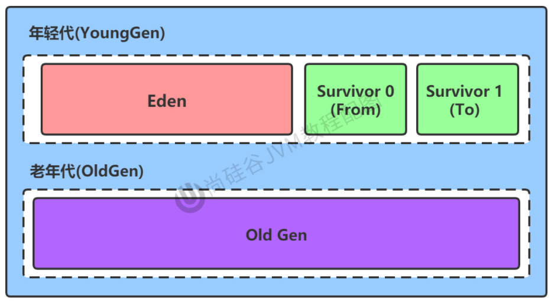

**新生代和老年代可配置**，默认配置是`Young:Old=1:2，Eden:From:To=8:1:1`，可通过以下方法修改配置

```
默认-XX:NewRatio=2，表示新生代占1，老年代占2，新生代占整个堆的1/3
修改-XX:NewRatio=4，表示新生代占1，老年代占4，新生代占整个堆的1/5
默认-XX:SurvivorRatio=8，表示Eden:From:To=8:1:1
```

**几乎所有Java对象都在Eden区被`new`，有些大对象Eden区无法存储就直接进入老年代，绝大多数Java对象销毁也都在新生代进行**，数据表明新生代80%的对象都是“朝生夕死”，可通过`-Xmn`设置新生代最大内存(默认就好)

**其实不分代完全可以，分代的唯一理由就是优化GC性能**，如果没有分代，那所有的对象都在一块，GC时要找到没有对象会对堆的所有区域进行扫描，而很多对象都是朝生夕死的，如果分代把新创建的对象放到某一地方，当GC时先把这块存储“朝生夕死”对象的区域进行回收，这样就会腾出很大的空间出来

### 4.对象分配过程

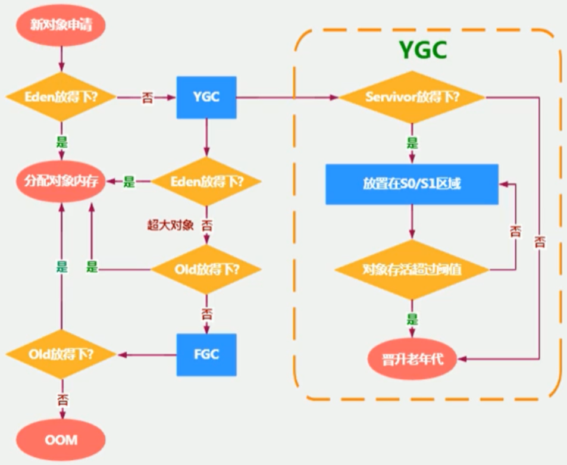

①new的对象尝试放在伊甸园区，但此区有**大小限制**

②若Eden放得下则为该对象分配内存；**若放不下则JVM垃圾回收器(Minor GC)将Eden区的不再被其他对象引用的对象进行销毁，再尝试将对象放在Eden，并将Eden区剩余存活对象移到S0区**

③若再次触发垃圾回收，则上次幸存下来的放在S0，若没有回触发垃圾回收，则存放到S1区；若再次垃圾回收，此时会重新放回S0，再去S1

④若幸存者区对象年龄达到阈值(默认15)，则会在垃圾回收时进入老年代

> -XX:MaxTenuringThreshold=＜N＞可设置年龄阈值

⑤当老年代内存不足时触发**Major GC**进行老年代垃圾回收，若老年代Major GC后仍然内存不足则抛出OOM异常

> 对S0，S1：复制后有交换，谁空谁是To(交换为了减少内存碎片)
>
> 对GC：新生代频繁，老年代很少，永久代/元空间几乎不

### 5.Minor GC/Major GC/Full GC

#### 5.1.概述

JVM调优的某环节也就是垃圾回收，**需要尽量避免垃圾回收，因为垃圾回收过程中容易出现STW问题，而Major GC和Full GC中出现STW问题是Minor GC的10倍以上**，

> STW(Stop-The-World)：执行GC算法时Java程序**其他所有线程被挂起(除垃圾回收帮助器)**，Java中的全局暂停情况，只有native代码可执行，但不能与JVM交互

GC并非每次都对三个区域一起回收，HotSpot中GC**按回收区域**可分为如下几种

* **部分收集(Partial GC)**：新生代收集(Minor GC / Young GC / YGC)、老年代收集(Major GC / Old GC)

  > 目前，只有CMS GC会有单独收集老年代的行为，且注意，很多时候Major GC会和Full GC混淆使用，需要具体分辨是老年代回收还是整堆回收

* **混合收集(Mixed GC)**：收集整个新生代和部分老年代垃圾

  > 目前，只有G1 GC会有这种行为

* **整堆收集(Full GC)**：收集整个Java堆和方法区垃圾

#### 5.2.Minor GC

**年轻代空间不足时触发Minor GC，此处年轻代满指的是Eden区满，S0和S1满不会触发GC**

Eden区满主要因为**为对象分配内存不够**和**为TLAB分配内存不够**，因为Java对象常常朝生夕灭，所以**Minor GC非常频繁**，Minor GC会触发STW，导致Java全局暂停，等待Minor GC结束用户线程才恢复

#### 5.3.Major GC

**老年代空间不足时触发Major GC**，出现Major GC至少伴随一次Minor GC，但并非绝对，也就是说**当老年代空间不足时首先尝试触发Minor GC，若空间还是不足则触发Major GC，若空间还是不足则报错OOM**

**Major GC的速度比Minor GC慢上10倍，STW时间更长**

#### 5.4.Full GC

触发Full GC的情况只有以下五种，**Full GC在调优中需要尽量避免**

* 调用`System.gc()`，系统建议执行Full GC，但是不必然执行
* 大对象直接在老年代申请分配，但老年代空间不足
* 方法区空间不足
* 通过Minor GC后进入老年代的平均大小大于老年代的可用内存
* 由Eden、S0向S1复制时，对象大于S1的可用内存，将该对象转入老年代，且老年代的可用内存小于该对象大小

#### 5.5.垃圾回收细节日志分析


```
[GC (Allocation Failure)
 [PSYoungGen: 179194K->25585K(179200K)] 422590K->416406K(588800K), 0.0256167 secs]
 [Times: user=0.02 sys=0.14, real=0.02 secs] 

------------------------------------------------------------

GC：区分Minor GC/Full GC的标志，此处GC表明本次发生的是Minor GC(年轻代GC)
Allocation Failure：触发GC的原因，本次GC事件是由于对象分配失败，即年轻代中没有空间来存放新生成的对象引起的
PSYoungGen：垃圾收集器名称，该名称表示在年轻代中使用的
153600K->25593K(179200K)：年轻代回收前内存大小->年轻代回收后内存大小(总内存大小)
422590K->416406K(588800K)：堆内存回收前大小->堆内存回收后大小(总堆内存大小)
0.0256167：GC耗时
user=0.02 sys=0.14, real=0.02 secs：GC事件的持续时间通过三个部分衡量，user表示GC线程所消耗的总CPU时间，sys表示操作系统和系统等待事件所消耗的时间，real则表示应用程序实际暂停时间，并不是所有的操作过程都能全部并行，所以在并行GC中real约等于user+system/GC线程数
老年代大小=588800-179200
```

```
[Full GC (Ergonomics)
 [PSYoungGen: 154927K->0K(179200K)]
 [ParOldGen: 409567K->2318K(409600K)] 564494K->2318K(588800K),
 [Metaspace: 9201K->9201K(1058816K)], 0.0095533 secs] 
 [Times: user=0.00 sys=0.00, real=0.01 secs] 

------------------------------------------------------------

Ergonomics：自动调解GC暂停时间和吞吐量之间的平衡，使虚拟机性能更好的一种做法，对于注重吞吐量的收集器来说，在某个generation被过渡使用之前GC Ergonomics会启动一次GC，发生本次Full GC正是在使用Parallel Scavenge收集器的情况下发生的
PSYoungGen：垃圾收集器名称，该名称表示在年轻代中使用的
ParOldGen: 垃圾收集器名称，该名称表示在老年代中使用的，这是并行STW垃圾收集器，算法为标记-清除-整理
```

```java
//出现OOM报错之前进行一次Full GC
Exception in thread "main" java.lang.OutOfMemoryError: Java heap space
	at com.yc.jvm.ch2.Test6_HeapInstance.<init>(Test6_HeapInstance.java:19)
	at com.yc.jvm.ch2.Test6_HeapInstance.main(Test6_HeapInstance.java:24)

//153600K + 25600K + 25600K = 新生代
Heap
 PSYoungGen      total 179200K, used 3434K [0x00000000f3800000, 0x0000000100000000, 0x0000000100000000)
  eden space 153600K, 2% used [0x00000000f3800000,0x00000000f3b5abb8,0x00000000fce00000)
  from space 25600K, 0% used [0x00000000fce00000,0x00000000fce00000,0x00000000fe700000)
  to   space 25600K, 0% used [0x00000000fe700000,0x00000000fe700000,0x0000000100000000)
 ParOldGen       total 409600K, used 2318K [0x00000000da800000, 0x00000000f3800000, 0x00000000f3800000)
  object space 409600K, 0% used [0x00000000da800000,0x00000000daa43a78,0x00000000f3800000)
 Metaspace       used 9223K, capacity 9442K, committed 9984K, reserved 1058816K
  class space    used 1050K, capacity 1122K, committed 1280K, reserved 1048576K
```

### 6.内存分配策略

若对象在Eden出生并经历Minor GC仍然存活，并且能被Survivor容纳，则将被移动到Survivor空间，并将年龄设为1，对象在Survivor每经历一次Minor GC年龄就加1，若年龄到达一定阈值(默认15)则进入老年代，阈值可通过`-XX:MaxTenuringThreshold`设置，**针对不同年龄段的对象分配原则如下**

* **对象优先分配到Eden，大对象直接分配到老年代**，尽量避免程序中出现过多大对象(很长的字符串，元素庞大的数组)，**JVM指定大于`-XX:PretenureSizeThreshold`参数的对象属于大对象**，这样可避免大对象在S0、S1中来回复制，产生大量内存复制开销

* **长期存活的对象分配到老年代**

* **对象年龄判断：S区相同年龄的所有对象所占空间大小大于S区空间的一半，则年龄大于等于该年龄的对象直接进入老年去**，无需等到`MaxTenuringThreshold`

* **空间分配担保：发生Minor GC前JVM先检查老年代*最大连续可用空间*，若老年代最大连续空间大于新生代所有对象空间，则本次Minor GC是安全的，否则检查`-XX:HandlePromotionFailure`参数值是否允许担保失败，若允许则继续检查老年代最大连续可用空间是否大于历次晋升到老年代对象的平均大小，若大于则尝试一次有风险的Minor GC，若老年大最大连续空间小于历来晋升对象的平均大小或不允许失败担保，则改为一次Full GC**

  > JDK7以后`-XX:HandlePromotionFailure`不再影响空间分配担保，即只需老年代最大连续空间大小大于新生代所有对象空间 或 大于历次晋升对象的平均值就进行Minor GC，否则Full GC，即`-XX:HandlePromotionFailure = true`

### 7.TLAB

堆区是线程共享区域，任何线程都可以访问，且对象实例创建在JVM中非常平凡，所以并发环境下从堆区划分内存线程不安全，但加锁影响分配速度，所以出现**TLAB避免多线程不安全的情况，同时提升内存分配吞吐量**

Eden区满是因为为对象分配内存不足或**为TLAB分配内存不足**，TLAB(Thread Local Allocation Buffer)是**JVM为每个线程划分的私有缓冲区域，TLAB被包含在Eden区，每个TLAB只允许一个线程申请分配对象内存，但允许所有对象访问该区域**

> 堆空间都是多个线程共享的么？
>
> 不一定，TLAB被每个线程独占

开发者可通过`-XX:UseTLAB`设置是否开启TLAB(默认开启)，默认TLAB所占空间非常小，仅占Eden的1%，但可通过`-XX:TLABWasteTargetPercent`配置TLAB占Eden空间的百分比

TLAB内对象申请分配内存失败，JVM尝试通过加锁机制确保数据操作的原子性，从而直接在Eden中分配内存

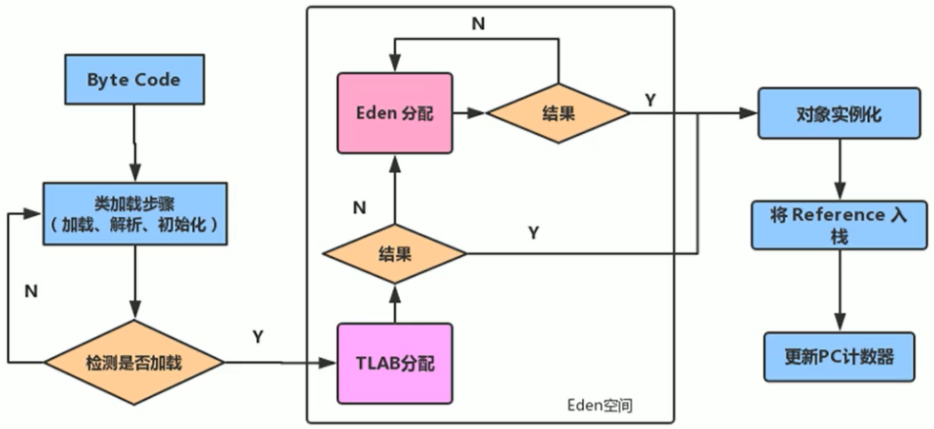

### 8.总结一波堆空间的参数设置

[Oracle官网(Ctrl+F搜索)](https://docs.oracle.com/javase/8/docs/technotes/tools/unix/java.html)

* `-XX:+PrintFlagsInitial`：查看所有参数的默认初始值
* `-XX:+PrintFlagsFinal`：查看所有参数的最终值
* `-XX:+PrintGCDetails`：输出详细的GC处理日志
* `-XX:+PrintGC`：打印GC简要信息
* `jinfo -flag SurvivorRatio 进程id`：命令行中查看某个具体参数，`jps`查看当前运行中的进程
* `-Xms`：初始堆空间内存，默认物理内存/64
* `-Xmx`：最大堆空间内存，默认物理内存/4
* `-Xmn`：设置新生代的大小，初始值及最大值
* `-XX:NewRatio`：配置YoungGen:OldGen👈
* `-XX:SurvivorRatio`：配置Eden👈:S0:S1
* `-XX:MaxTenuringThreshold`：设置新生代垃圾的最大年龄
* `-XX:HandlePromotionFalilure`：是否设置空间分配担保

### 9.堆是分配对象的唯一选择吗？

都这样问了那当然不是🙃，随着**逃逸分析**、**栈上分配**、**标量替换**等技术逐渐成熟，所有的对象都分配到堆上也渐渐变得不那么绝对

#### 9.1.逃逸分析

逃逸分析的主要行为是**分析对象动态作用域**，若未发生逃逸则可以分配到栈，随着方法结束栈空间被移除

* 当某对象在方法被定义，对象只在方法内部使用，则认为没发生逃逸

```java
//未发生逃逸，可以栈上分配对象。
public static String createStringBuffer(String s1, String s2) {
    StringBuffer sb = new StringBuffer();
    sb.append(s1);
    sb.append(s2);
    return sb.toString();
}
```

* 当某对象在方法被定义，对象被外部方法引用，则认为发生逃逸

```java
//发生逃逸，不可以栈上分配对象。
public static StringBuffer createStringBuffer(String s1, String s2) {
    StringBuffer sb = new StringBuffer();
    sb.append(s1);
    sb.append(s2);
    return sb;
}
```

分析如下方法是否发生逃逸

```java
//如何快速的判断是否发生了逃逸分析？就看new的对象实体是否有可能在方法外被调用
public class EscapeAnalysis {
    public EscapeAnalysis obj;

    //方法返回EscapeAnalysis对象，发生逃逸
    public EscapeAnalysis getInstance() {
        return obj == null ? new EscapeAnalysis() : obj;
    }

    //为成员属性赋值，发生逃逸
    public void setObj() {
        this.obj = new EscapeAnalysis();
    }
    //思考：如果当前的obj引用声明为static的？仍然会发生逃逸

    //对象的作用域仅在当前方法中有效，没有发生逃逸
    public void useEscapeAnalysis() {
        EscapeAnalysis e = new EscapeAnalysis();
    }

    //引用成员变量的值，发生逃逸
    public void useEscapeAnalysis1() {
        EscapeAnalysis e = getInstance();
        //getInstance().xxx()同样会发生逃逸
    }
}
```

JDK 6u23版本之后HotSpot中默认就已经开启了逃逸分析，之前版本可通过参数配置

* ` -XX:+DoEscapeAnalysis`：显式开启逃逸分析
* `-XX:+PrintEscapeAnalysis`：查看逃逸分析的筛选结果

通过逃逸分析可知，**开发者能使用局部变量就尽量使用**

经过逃逸分析，可对9.2、9.3、9.4进行**优化**

#### 9.2.栈上分配

JIT编译器在**编译期间**根据逃逸分析的结果发现某对象未逃逸，则可能被优化成**栈上分配**，栈内分配完后继续在栈内执行，最后随着线程结束栈空间被回收，**使用栈上分配无需GC**

测试开启与未开启逃逸分析的性能对比，测试代码如下，改变参数设置

```java
/**
 * 栈上分配
 * 未开启逃逸分析：-Xms256m -Xmx256m -XX:-DoEscapeAnalysis -XX:+PrintGCDetails  48 ms
 * 开启逃逸分析：-Xms256m -Xmx256m -XX:+DoEscapeAnalysis -XX:+PrintGCDetails   4 ms
 */
public class StackAllocation {
    public static void main(String[] args) {
        long start = System.currentTimeMillis();

        for (int i = 0; i < 10000000; i++) {
            alloc();
        }

        long end = System.currentTimeMillis();
        // 查看执行时间
        System.out.println("花费的时间为： " + (end - start) + " ms");
        // 为了方便查看堆内存中对象个数，线程sleep
        try {
            Thread.sleep(1000);
        } catch (InterruptedException e) {
            e.printStackTrace();
        }
    }

    private static void alloc() {
        User user = new User(); //未发生逃逸
    }

    static class User {
    }
}
```

#### 9.3.同步省略

同步的代价相当高，后果是降低并发性和性能，JIT编译器在**编译期间**根据逃逸分析的结果发现某对象未逃逸，则判断**同步块所使用的锁对象只能被同一个线程访问，可取消对该部分代码块的同步**，这样大大提高并发性和性能，该过程叫**同步省略**，也叫**锁消除**

```java
public void f() {
    Object hollis = new Objecto();
    synchronized(hollis) {//对hollis对象加锁，hollis未发生逃逸，所以会被优化成同步省略，代码如下
        System.out.println(hollis);
    }
}
-------------------------------------------
public void f() {
    Object hollis = new Object();
	System.out.println(hollis);
}
```

从下图可看出字节码中依然有Synchronized，只是**运行时被优化**

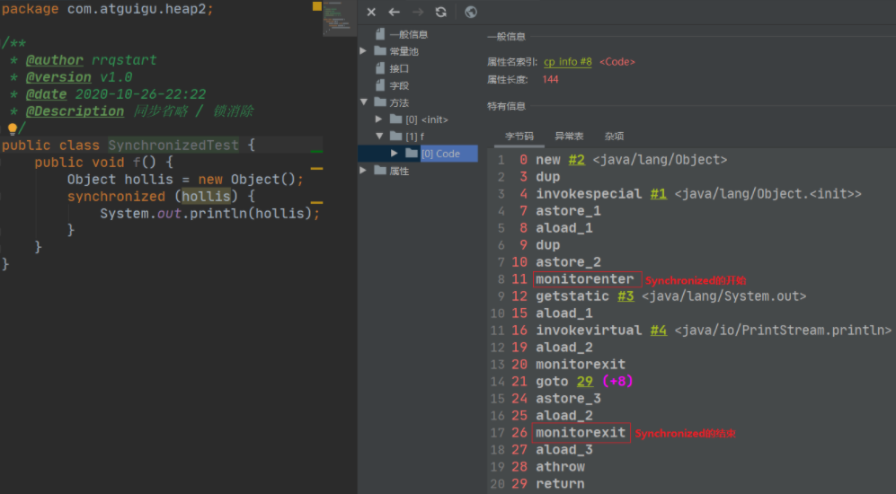

#### 9.4.分离对象或标量替换

标量(Scalar)指无法再分解成更小的数据的数据，Java中的原始数据类型就是标量，相对的，还可以分解的数据叫做聚合量(Aggregate)，Java中的对象就是聚合量

JIT编译器在**编译期间**根据逃逸分析的结果发现某对象未逃逸，则表示**该对象不会被外界访问**，可将该对象成员变量分解成局部变量存于方法中，标量替换大大减少堆内存的占用，因为对象被分解就无需创建对象，那么就不再需要分配堆内存，**标量替换为栈上分配提供了很好的基础，即允许对象成员变量分散存于局部变量表中**

```java
public static void main(String args[]) {
    alloc();
}
class Point {
    private int x;
    private int y;
}
private static void alloc() {
    Point point = new Point(1,2);//未发生逃逸，替换代码如下
    System.out.println("point.x = " + point.x + "; point.y = " + point.y);
}
-------------------------------------------
private static void alloc() {
    int x = 1;
    int y = 2;
    System.out.println("point.x = " + x + "; point.y = " + y);
}
```

测试开启与未开启逃逸分析的性能对比，测试代码如下，改变参数设置

```java
/**
 * 标量替换
 * 未开启标量替换：-Xms100m -Xmx100m -XX:+DoEscapeAnalysis -XX:+PrintGC -XX:-EliminateAllocations   58 ms
 * 开启标量替换：-Xms100m -Xmx100m -XX:+DoEscapeAnalysis -XX:+PrintGC -XX:+EliminateAllocations    4 ms
 * -server -Xmx100m -Xms100m -XX:+DoEscapeAnalysis -XX:+PrintGC -XX:+EliminateAllocations
 */
public class ScalarReplace {
    public static class User {
        public int id;
        public String name;
    }

    public static void alloc() {
        User u = new User(); //未发生逃逸
        u.id = 18;
        u.name = "Jack";
    }

    public static void main(String[] args) {
        long start = System.currentTimeMillis();
        for (int i = 0; i < 10000000; i++) {
            alloc();
        }
        long end = System.currentTimeMillis();
        System.out.println("花费的时间为：" + (end - start) + " ms");
    }
}
```

#### 9.5.逃逸分析不足

无法保证逃逸分析的性能消耗一定能高于他的消耗，虽然经过逃逸分析可以做标量替换、栈上分配、锁消除，但是逃逸分析自身也是需要进行一系列复杂的分析的，这其实也是一个相对耗时的过程

> 极端的例子：经过逃逸分析后发现没有一个对象是不逃逸的，那这个逃逸分析的过程就白白浪费掉了

## 八、方法区


> [参考文章1](https://blog.csdn.net/rrq_0324/article/details/109035773?spm=1001.2101.3001.6650.3&utm_medium=distribute.pc_relevant.none-task-blog-2~default~BlogCommendFromBaidu~default-3-109035773-blog-107146441.pc_relevant_multi_platform_whitelistv2&depth_1-utm_source=distribute.pc_relevant.none-task-blog-2~default~BlogCommendFromBaidu~default-3-109035773-blog-107146441.pc_relevant_multi_platform_whitelistv2&utm_relevant_index=6)	[参考文章2](https://blog.csdn.net/rrq_0324/article/details/109171470)


1. 根据jvm规范，这些数据区中哪些会出现 内存溢出异常，分别是什么场景下出现?
2. 这些数据区哪些是线程独有的，哪些是线程共享区?
3. 每个区存储的数据的特点?
10. 方法区是线程独有的吗?它是否有异常?它的作用?
11. 方法区的演进, jdk7及以前，它叫什么? jdk8开始，这又叫什么. 
12. 方法区或永久代的大小如何设置?


