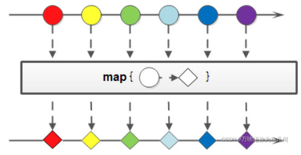
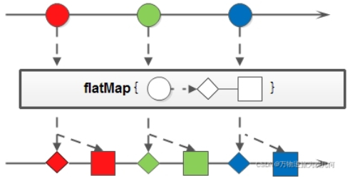

# Stream

## 一、什么是Stream？

`Stream`将待处理的元素集合看成流，流在管道中传输，可以在管道节点上借助`Stream API`对流中的元素进行操作，比如筛选、排序、聚合等

## 二、对流的操作

`Stream`可以由**数组或集合创建**，对流的操作分为两种

* **中间操作**：中间操作都返回流对象本身，可以含多个中间操作
* **终端操作**：每个流只能由一个终端操作，终端操作结束以后流也无法使用，理解`Stream`为**一次性流**

另外`Stream`有以下几个特性需要知道

* `Stream`不会存储元素，按特定的规则对数据进行计算
* `Stream`不改变数据源，通常产生新的集合或值
* `Stream`具有延迟执行的特点，即只有在调用终端操作时，中间操作才会执行

## 三、方法引用::

### 1.方法引用是什么？

方法引用可拆解为方法和引用，即将已经写好的方法拿过来用，当成函数式接口抽象方法的方法体，注意方法引用使用时必须满足以下条件

* 被引用处必须是[函数式接口](/Java基础/lambda表达式)，函数式接口指含`@FunctionalInterface`注解且只有一个抽象方法的接口
* 被引用的方法必须是已经存在的

* 被引用的方法的形参和返回值需要和抽象方法保持一致

### 2.方法引用的理解

我们首先从传统的写法步步引入，这样便于我们理解

①传统写法

```java
Arrays.sort(arr, new Comparator<Integer>(){
    @Override
    public int compare(Integer o1,Integer o2){
        return o2-o1;
    }
})
```

②lambda表达式简化

```java
Arrays.sort(arr, (Integer o1,Integer o2) => {
	return o2-o1;
})
```

③lambda表达式再次简化

```java
Arrays.sort(arr, (o1, o2) => o2-o1)
```

④方法引用简化

```java
//首先需要判断它是否满足使用方法引用的条件，Comparator是函数式接口，此时我们只需要创建形参和返回值与抽象方法一致的被引用方法即可
public static int subtraction(int num1,int num2){
    return num2-num1;
}

//方法引用化简后如下，假设subtraction静态方法所在的类为Test
Arrays.sort(arr, Test::subtraction)
```

### 3.方法引用的使用

①引用静态方法的格式为`类名::静态方法`，例如`Integer::parseInt`

②引用成员方法又分为三种情况

* 引用其他类成员方法的格式为`其他类对象::方法名`
* 引用本类成员方法的格式为`this::方法名`，注意该方法不能是静态方法
* 引用父类成员方法的格式为`super::方法名`，注意该方法不能是静态方法

③引用构造方法的格式为`类名::new`，用于创建对象

④除了以上三种基本使用方式外，还存在其他调用方式

* 通过类名引用成员方法的格式为`类名::成员方法`，这种方式存在独有的规则

  * 被引用处必须是函数式接口

  * 被引用的方法必须是已经存在的

  * **被引用的方法的形参与抽象方法的第二个形参到最后一个形参保持一致，返回值保持一致**，这句话如何理解呢？请向下看

    ```java
    //请看如下流语句
    list.stream().map(String::toUpperCase).forEach(s -> System.out.println(s));
    
    //查看流中map方法的参数
    list.stream().map(new Function<String, String>() {
        @Override
        public String apply(String s){
            return s.toUpperCase();
        }
    }).forEach(s->System.out.println(s));
    
    //查看toUpperCase的源码
    public String toUpperCase() {
        return toUpperCase(Locale.getDefault());
    }
    
    //我们观察到map()参数函数式接口中的轴向方法和被引用方法的参数不同，那么为什么还可以引用？这便是我要讲解的新规则
    //Stream中抽象方法的第一个参数一般都表示流中间的每一个数据，决定可以引用哪些类的方法，如apply的参数s就表示流中的每一个数据
    //第二个参数到最后一个与被引用的参数保持一致，若没有第二个参数则说明被引用的方法是无参成员方法
    ```

* 引用数组的构造方法的格式为`数据类型[]::new`

## 四、谓词Predicate

谓词Predicate可将函数作为参数传递

```java
@Data//这是一个苹果类
class Apple {
    private String color;
    private int weight;
    public Apple(String color, int weight) {
        this.color = color;
        this.weight = weight;
    }
    public static boolean isGreenApple(Apple apple) {
        return "green".equals(apple.getColor());
    }
    public static boolean isHeavyApple(Apple apple) {
        return apple.getWeight() > 150;
    }
}

public class TestPredicate {
	//利用predicate.test判断是否满足条件
    static List<Apple> filterApples(List<Apple> inventory, Predicate<Apple> predicate) {
        List<Apple> list = new ArrayList<>();
        for (Apple apple : inventory) {
        	//注意predicate的test方法是抽象方法
            if (predicate.test(apple)) {
                list.add(apple);
            }
        }
        return list;
    }

    public static void main(String[] args) {
        String[] colors = {"green", "yellow", "red"};
        Random random = new Random();
        List<Apple> list = new ArrayList<>();
        for (int i = 1; i < 10; i++) {
            list.add(new Apple(colors[random.nextInt(colors.length)], random.nextInt(100)));
        }
        //以上是创建苹果操作

        //此处Apple中isGreenApple与Predicate的test同型(返回值相同，参数相同)，可以直接使用Apple::isHeavyApple方式替代test，isHeavyApple中实现作为test中的实现
        //此处就是之前讲解过方法的方法引用
        System.out.println(filterApples(list, Apple::isGreenApple));
        System.out.println(filterApples(list, Apple::isHeavyApple));

        //合并两个查询条件
        Predicate<Apple> predicate1 = Apple::isGreenApple;//替代test()
        Predicate<Apple> predicate2 = Apple::isHeavyApple;
        System.out.println(filterApples(list, predicate1.or(predicate2)));
    }
}
```

## 五、Optional

Optional是一个可以为`null`的容器对象，**表示值存在或不存在，解决NullPointerException异常**，常用方法如下

- `isPresent()`：值存在返回`true`，不存在返回`false`
- `get()`：返回当前值，若值不存在会抛出异常
- `orElse(T)`：值存在时返回该值，否则返回T的值

Optional类还有三个特化版本OptionalInt、OptionalLong、OptionalDouble，数值流中的`max()`返回的类型便是这个

## 六、Stream操作

### 1.创建流

**创建空流**：`Stream.empty()`

**值创建流**：`Stream.of("11","22")`、`Stream.of(11,22,33)`

**数组创建流**：`Arrays.stream(T[])`、`Arrays.stream(T[], int, int)`可只取部分数组创建流、`Stream.of(myArray)`

**集合创建流之串行流**：`myList.stream()`、`mySet.stream()`

**集合创建流之并行流**：`myList.parallelStream()`、`mySet.parallelStream()`

**Map间接创建流**：`map.keySey().stream()`、`map.values().stream()`、`map.entrySet().stream()`

**文件生成流**：`Stream<String> stream = Files.lines(Paths.get("data.txt"))`读取文件每一行生成流

```java
//读取文件到流并包装成对象返回对象集合
List<String> lines = Files.readAllLines(path);//Path
List<Record> records = lines.parallelStream()//创建并行流
        .skip(1)//跳过第0行
        .map(line -> line.split(";"))//按;分割，返回String[]
        .map(t -> new Record(t))//通过Record构造函数将结果数组包装成对象,t是数组，Record构造方法对数组操作
        .collect(Collectors.toList());//将对象转为list
```

**函数生成流**：`iterate()`、`generate()`

```java
//1.依次对新生成的值执行对应函数操作后生成流
Stream.iterate(0, (x) -> x + 3)//生成流，首元素为0，之后依次加3
    .limit(4);
//2.接受函数生成新的值组成流
Stream.generate(Math :: random)//生成元素为0到1的随机数的流
Stream.generate(() -> 1)//生成元素全为1的流
```

### 2.遍历forEach

`forEach()`相当于终端操作，会迭代流中的每一个数据

* `void forEach()`：不按顺序迭代
* `void forEachOrdered()`：按顺序迭代

### 3.发现find

* `Optional<T> findFirst()`：返回找到的第一个元素
* `Optional<T> findAny()`：串行流返回找到的第一个元素，并行流返回其中一个元素

### 4.匹配match

* `boolean anyMatch(Predicate predicate)`：**任意**流满足参数条件返回true

```java
boolean b = list.stream()
	.anyMatch(person -> person.getAge()==20);//test()被替换
```

- `boolean allMatch(Predicate predicate)`：**所有**流满足参数条件返回true

```java
boolean result = list.stream()
    .allMatch(Person::isStudent);//此处使用方法引用，将test替换成isStudent
```

- `boolean noneMatch(Predicate predicate)`：**没有**流满足参数条件返回true

```java
boolean result = list.stream()
    .noneMatch(Person::isStudent);
```

请看如下案例

```java
public class StreamTest {
	public static void main(String[] args) {
        List<Integer> list = Arrays.asList(7, 6, 9, 3, 8, 2, 1);

        // 遍历输出符合条件的元素
        list.stream().filter(x -> x > 6).forEach(System.out::println);
        // 匹配第一个
        Optional<Integer> findFirst = list.stream().filter(x -> x > 6).findFirst();
        // 匹配任意(适用于并行流)
        Optional<Integer> findAny = list.parallelStream().filter(x -> x > 6).findAny();
        // 是否包含符合特定条件的元素
        boolean anyMatch = list.stream().anyMatch(x -> x > 6);
        System.out.println("匹配第一个值：" + findFirst.get());
        System.out.println("匹配任意一个值：" + findAny.get());
        System.out.println("是否存在大于6的值：" + anyMatch);
    }
}
```

### 5.筛选filter

* `Stream<T> filter(Predicate predicate)`：：对流中元素过滤，保留参数为ture的元素

```java
list.stream()
		.filter(s -> s.startsWith("王"))//筛选王开头字符串
		.filter(s -> s.length()==3)//筛选长度为3字符串
		.forEach(s -> System.out.println(s));
```

### 6.聚合max&min&count

* `Optional<T> max(Comparator comparator)`

```java
//返回Integer集合中的最大值——自然排序
Optional<Integer> max = list.stream()
    .max(Integer::compareTo);

//返回Integer集合中的最大值——自定义排序
Optional<Integer> max2 = list.stream()
    .max(new Comparator<Integer>() {
        @Override
        public int compare(Integer o1, Integer o2) {
            return o1.compareTo(o2);
        }
    });

//返回字符串集合中最长元素
Optional<String> max = list.stream()
    .max(Comparator.comparing(String::length));
```

* `Optional<T> min(Comparator comparator)`
* `long count()`

### 7.映射map&flatMap

将一个流的元素按照一定的映射规则映射到另一个流中，映射操作分为`map`和`flatMap`两种

#### 7.1.map

`map`接收函数作为参数，该函数会被应用到每个元素上，并映射成新元素



* `<R> Stream<R> map(Function mapper)`：将流中的每个元素T映射为R，即`Stream<T> -> Stream<R>`

```java
list.stream()
    .map(s -> Integer.parseInt(s))//将字符串类型流转成int型后返回
    .forEach(System.out::println);

//方法引用改写
list.stream()
    .map(Integer::parseInt)
    //parseInt方法替代Function函数式接口中唯一抽象方法apply
    .forEach(System.out::println);
```

* `IntStream mapToInt(ToIntFunction mapper)`：返回新流类型为IntStream，其中包含特定函数对此流结果进行操作

```java
int result = list.stream()
    .mapToInt(Integer::parseInt)
    .sum();//sum()返回流中数据总和，此方法是IntStream的
    //如max().getAsInt()或min().getAsInt()...
    //注意：经过以上统计操作后流已经空可，不可复用
```

* `LongStream mapToLong(ToLongFunction mapper)`
* `DoubleStream mapToDouble(ToDoubleFunction mapper)`

#### 7.2.flatMap

`flatMap`接收函数作为参数，将流中每个值映射成新流，最后将所有流连成一个流



* `<R> Stream<R> flatMap(Function mapper)`：将流中的每个元素T映射为流，再把每个流连接成为新流，下面的代码好理解

```java
List<String> list = new ArrayList<>();
list.add("aaa bbb ccc");
list.add("ddd eee fff");
list.add("ggg hhh iii");
list = list.stream()
    .map(s -> s.split(" "))//将list中str按空格分割成数组 Stream<String> -> Stream<String[]>
    .flatMap(Arrays::stream)//将Stream<String[]>中数组中字符串都看成单独的流
    .collect(toList());
```

* `IntStream flatMapToInt(Function mapper)`
* `LongStream flatMapToLong(Function mapper)`
* `DoubleStream flatMapToDouble(Function mapper)`

### 8.归约reduce

归约是将集合中的所有元素经过指定运算，折叠成一个元素输出

* `T reduce(T identity, BinaryOperator<T> accumulator)`：第一个参数表示初始值，第二个参数表示规约操作

```java
//计算年龄总和——1
int age = list.stream()
	.reduce(0, (person1,person2)->person1.getAge()+person2.getAge());

//计算年龄总和——2
int sum = list.stream()
    .map(Person::getAge)
    .reduce(0, (a, b) -> a + b);

//计算年龄总和——3
int sum = list.stream()
    .map(Person::getAge)
    .reduce(0, Integer::sum);
```

* `Optional<T> reduce(BinaryOperator<T> accumulator)`：不含初始值，考虑结果不存在情况返回Optional，与上的不同就是再get以下获取结果
* `<U> U reduce(U identity,BiFunction accumulator,BinaryOperator<U> combiner)`

### 9.无序unordered()

比较不起眼的方法`unordered()`，返回一个等效的无序流，当然如果流本身就是无序的话，那可能就会直接返回其本身

### 10.排序sorted

* `Stream<T> sorted()`：返回按自然顺序排序后的流

```java
list.stream()
    .sorted()//排序
    .forEach(System.out::println);
```

* `Stream<T> sorted(Comparator comparator)`：返回根据提供的Comparator排序的流

```java
list.stream()
    .sorted((s11,s22)->s11.length()-s22.length())//内含排序规则
    .forEach(System.out::println); 
```

`unordered()`优化机制，`unordered`时，对每一个CPU上的数据去重，然后再合并这些CPU，再去重，未`unordered`时，对所有CPU上的统一排序，排序后尽量让CPU中存放相同的数据(对所有CPU排序然后分到每个CPU，尽量让相同数据在同一CPU上)，最后分别对每个CPU去重

### 11.去重distinct

* `Stream<T> distinct()`：返回去重后的流，去重依赖于`hashCode()`和`equals()`记得重写

```java
list.stream()
    .distinct()//对list中数据去重
    .forEach(System.out::println);
```

### 12.限制limit

* `Stream<T> limit(long maxSize)`：从前开始获取指定数量的流

```JAVA
list.stream()
    .limit(3)//取前三个数据流
    .forEach(System.out::println);
```

### 13.跳过skip

* `Stream<T> skip(long n)`：跳过前n个流，返回剩余的流

```JAVA
list.stream()
    .skip(3)//跳过前三个数据流
    .forEach(System.out::println);
```

`skip(m).limit(n)`：先去除前m个元素再返回剩余元素的前n个元素

`limit(n).skip(m)`：先返回前n个元素再在剩余的n个元素中去除m个元素

### 14.合并concat

* `static <T> Stream<T> concat(Stream a, Stream b)：合并a和b两个流为一个流`

```java
Stream<String> s1 = list11.stream();
Stream<String> s2 = list22.stream();
Stream.concat(s1,s2)//合并s1与s2
    .forEach(System.out::println);
```

### 15.集合collect

`collect()`是终端方法，主要依赖`java.util.stream.Collectors`类内置的静态方法

#### 15.1.归集toList&toSet&toMap

```java
List<Integer> list = Arrays.asList(1, 6, 3, 4, 6, 7, 9, 6, 20);
List<Integer> listNew = list.stream()
    						.filter(x -> x % 2 == 0)
    						.collect(Collectors.toList());

//注意保证值得唯一性
Set<Integer> set = list.stream()
    						.filter(x -> x % 2 == 0)
    						.collect(Collectors.toSet());

List<Person> personList = new ArrayList<Person>();
personList.add(new Person("Tom", 8900, 23, "male", "New York"));
personList.add(new Person("Jack", 7000, 25, "male", "Washington"));
personList.add(new Person("Lily", 7800, 21, "female", "Washington"));
personList.add(new Person("Anni", 8200, 24, "female", "New York"));

//注意保证键得唯一性
Map<?, Person> map = personList.stream()
    						.filter(p -> p.getSalary() > 8000)
    						.collect(Collectors.toMap(Person::getName, p -> p));

System.out.println("toList:" + listNew);
System.out.println("toSet:" + set);
System.out.println("toMap:" + map);
```

#### 15.2.统计count&averaging

**计数**：`counting`，返回流中元素个数，结果为`long`类型

**平均值**：`averagingInt`、`averagingLong`、`averagingDouble`

**最值**：`maxBy`、`minBy`

**求和**：`summingInt`、`summingLong`、`summingDouble`

**统计以上所有**：`summarizingInt`、`summarizingLong`、`summarizingDouble`，其返回`XXXSummaryStatistics`含统计操作，如`getMax()`、`getMin()`

> `mapToXXX`中统计操作与`XXXSummaryStatistics`中统计操作的区别是什么？
>
> `mapToXXX`只有用时才执行相应的统计操作，`XXXSummaryStatistics`不管需要统计什么，都一次性将要统计的都统计了

```JAVA
List<Person> personList = new ArrayList<Person>();
personList.add(new Person("Tom", 8900, 23, "male", "New York"));
personList.add(new Person("Jack", 7000, 25, "male", "Washington"));
personList.add(new Person("Lily", 7800, 21, "female", "Washington"));

// 求总数
Long count = personList.stream()
    			.collect(Collectors.counting());
// 求平均工资
Double average = personList.stream()
    				.collect(Collectors.averagingDouble(Person::getSalary));
// 求最高工资
Optional<Integer> max = personList.stream()
    						.map(Person::getSalary)
    						.collect(Collectors.maxBy(Integer::compare));
// 求工资之和
Integer sum = personList.stream()
    			.collect(Collectors.summingInt(Person::getSalary));
// 一次性统计所有信息
DoubleSummaryStatistics collect = personList.stream()
    						.collect(Collectors.summarizingDouble(Person::getSalary));
collect.getMax();
collect.getMin();
collect.getAverage();

System.out.println("员工总数：" + count);
System.out.println("员工平均工资：" + average);
System.out.println("员工工资总和：" + sum);
System.out.println("员工工资所有统计：" + collect);
----------------------------------------------------------
员工总数：3
员工平均工资：7900.0
员工工资总和：23700
员工工资所有统计：DoubleSummaryStatistics{count=3, sum=23700.000000,min=7000.000000, average=7900.000000, max=8900.000000}
```

#### 15.3.分组groupingBy

```java
Map<String, List<Record>> map = list.stream()
    .collect(Collectors.groupingBy(Record::getCustomerID));
    //groupingBy(分组属性),返回Map<分组属性类型,List<流中数据类型>>
```

> [就是说方法也太多了😥剩下的方法请移步吧](https://blog.csdn.net/TonyStarkF/article/details/122882539)


