# 常用API

## 一、API

API全称Application Programming Interface，即应用程序编程接口，简单理解API就是别人已经写好的东西，直接用即可

Java API指的就是JDK中提供的各种Java类，这样的Java类太多，具体请参考帮助文档

## 二、字符串

### 1.String

#### 1.1.特点

`java.lang.String`表示字符串，例如`"abc"`，**Java中所有字符串文字都为字符串对象，包括字面量**，例如`String str = "abc"`

**特别注意字符串的内容是不能改变的，即一旦复制就不能改变**，底层使用`private final char[] ch`来保存字符串，`private`修饰不向外暴露，`final`修饰不能被子类继承

由于字符串不可变，所以可以认为字符串是常量，是线程安全的

#### 1.2.创建String对象

存在两种创建String对象的方式

* 直接赋值`String str = "abc"`

* 构造函数`String str = new String()`

  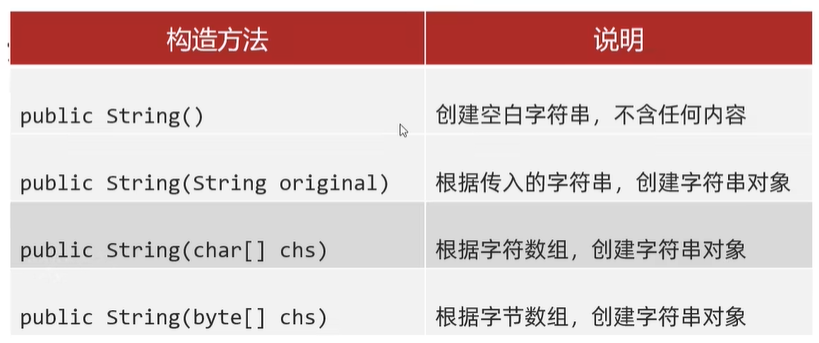

在**内存的角度**再康康这几种创建方式的区别吧！

* 直接赋值，这里引入一个新的内存区域，即**字符串常量池**，**通过直接赋值的方式创建的字符串都存于字符串常量池中**，字符串常量池可以节约内存

  

* 构造函数

  

#### 1.3.比较方法

之前学习过`==`运算符，那么`==`比较的到底是什么内容呢？其实是分情况的


了解了`==`的判断规则，那么请看如下例题


但我此时就是想要**比较字符串对象的内容**是否相同怎么办？其实String类提供了两个方法，通过`String对象.方法(参数)`的方式调用

* `boolean equals(需比较的字符串)`：比较字符串内容是否相同，区分大小写
* `boolean equalsIgnoreCase(需比较的字符串)`：比较字符串内容是否相同，忽略大小写

`equals`重写自`Object`的`equals`方法，`Object`中的`equals`方法实际比较效果和`==`相同，但`String`中的`equals`方法重写后是实现了比较内容，`==`和`equals`的区别如下


#### 1.4.判断方法

返回的都是`Boolean类型`

|           函数           |         说明          |
| :----------------------: | :-------------------: |
| `startsWith(String str)` | 字符串是否以`str`开头 |
|  `endsWith(String str)`  | 字符串是否以`str`结尾 |
|       `isEmpty()`        |    字符串是否为空     |
|  `contains(String str)`  |  字符串是否包含`str`  |

#### 1.5.获取方法

|                  函数                   |                             说明                             |
| :-------------------------------------: | :----------------------------------------------------------: |
|             `int length()`              |                        获取字符串长度                        |
|        `char charAt(int index)`         |         获取指定`index`位置的字符，`index`以`0`开始          |
|          `int indexOf(int ch)`          | 获取指定字符第一次出现的`index`，此处参数为`int`类型，因为`'a'`和`97`都可以表示`'a'` |
|   `int indexOf(int ch,int fromIndex)`   |       获取指定字符从`formIndex`开始第一次出现的`index`       |
|        `int indexOf(String str)`        |              获取指定字符串第一次出现的`index`               |
| `int indexOf(String str,int fromIndex)` |      获取指定字符串从`formIndex`开始第一次出现的`index`      |

#### 1.6.转换方法

|                     函数                      |                        说明                        |
| :-------------------------------------------: | :------------------------------------------------: |
|            `String toLowerCase()`             |             将字符串转成小写的新字符串             |
|            `String toUpperCase()`             |             将字符串转成大写的新字符串             |
|         `byte[] getBytes(String str)`         |               将字符串转换为字节数字               |
|       `char[] toCharArray(String str)`        |               将字符串转换为字符数组               |
|       `static String valueOf(XXX xxx)`        |             将任意类型的数据转成字符串             |
|          `String concat(String str)`          |           将字符串与`str`拼接成新字符串            |
|         `String substring(int start)`         |        从`start`开始直到末尾截取成新字符串         |
|     `String substring(int start,int end)`     | 从`start`开始到`end`结束截取成新字符串，包左不包右 |
|    `String replace(char oldCh,char newCh)`    |           `newCh`替换`oldCh`后成新字符串           |
| `String replace(String oldStr,String newStr)` |          `newStr`替换`oldStr`后成新字符串          |
|                `String trim()`                |           去除字符串两端空格后成新字符串           |

#### 1.7.compareTo方法

```java
//通过s1.compareTo(s2)的方式调用，String类型都被转换成字符数组private final char value[];
public int compareTo(String anotherString) {
    int len1 = value.length;
    int len2 = anotherString.value.length;
    int lim = Math.min(len1, len2);
    char v1[] = value;
    char v2[] = anotherString.value;

    int k = 0;
    while (k < lim) {
        char c1 = v1[k];
        char c2 = v2[k];
        if (c1 != c2) {
            return c1 - c2;
        }
        k++;
    }
    return len1 - len2;
}
```

> String s = "";表示字符串内容为空，可以调用对象；String s = null;表示字符串对象为空，不能调用对象

### 2.StringBuilder

#### 2.1.特点

`StringBuilder`相当于容器，创建后**内容是可变的**，底层同样使用字符数组保存字符串，但未使用`private final`修饰，用于提高字符串的操作效率，为什么说`StringBuilder`可以提高效率？

* 原来使用`String s6 = s1 + s2 + s3 + s4 + s5`的方式，其中每`+`一次都会产生新的字符串，耗时废空间

* `StringBuilder`相当于容器，直接往里面丢就好，提高效率

  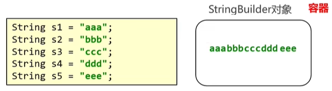

`StringBuilder`是**线程不安全**的，底层没有加锁，同时效率也就更高

> 线程安全指同一时间只能被一个客户端操作，数据安全；线程不安全指的是同时被多个客户端操作，数据不安全

**字符串拼接符`+`底层使用的是`StringBuilder`的`append`，每次拼接都会创建`StringBuilder`对象，在6.1中详细讲解**

#### 2.2.创建StringBuilder对象

通过`new`的方式，存在两种`StringBuilder`构造函数

* `public StringBuilder()`
* `public StringBuilder(String str)`

#### 2.3.常见方法

|               函数               |             说明              |
| :------------------------------: | :---------------------------: |
| `StringBuilder append(任意类型)` |   添加数据，并返回对象本身    |
|    `StringBuilder reverse()`     |           反转数据            |
|          `int length()`          |           返回长度            |
|       `String toString()`        | 将`StringBuilder`转为`String` |

### 3.StringBuffer 

#### 3.1.特点

`StringBuffer`相当于容器，与`StringBuilder`类似，创建后**内容是可变的**，`StringBuilder`继承`AbstractStringBuilder`，底层同样使用字符数组保存字符串，但未使用`private final`修饰，底层方法加同步锁，**线程安全**

#### 3.2.创建StringBuffer对象

通过`new`的方式，存在三种`StringBuffer`构造函数

* `public StringBuffer()`

* `public StringBuffer(String str)`

* `public StringBuffer(int capacity)`：指定容量的字符串缓冲区对象

  > 容量指的是最多能放多少，长度指的是实际放了多少

#### 3.3.常见方法

|                         函数                         |                             说明                             |
| :--------------------------------------------------: | :----------------------------------------------------------: |
|           `Stringbuffer append(任意类型)`            |                   添加数据，并返回对象本身                   |
|      `Stringbuffer insert(int offset,任意数据)`      |          在`offset`插入任意类型数据，并返回对象本身          |
|               `StringBuffer reverse()`               |                           反转数据                           |
|        `StringBuffer deleteCharAt(int index)`        |             删除`index`处的字符，并返回对象本身              |
|       `StringBuffer delete(int start,int end)`       |         删除`[start,end)`间的字符串，并返回对象本身          |
| `StringBuffer replace(int start,int end,String str)` |      替换`[start,end)`间的字符串为`str`，并返回对象本身      |
|                   `int capacity()`                   | 缓冲区容量，默认`16`，带参数`str`创建实例时，容量为`默认容量+字符串长度` |
|                    `int length()`                    |                          缓冲区长度                          |

以上方法都是对`StringBuffer`本身进行操作，截取操作则不改变原对象`StringBuffer`，而是返回新`String`

* `String substring(int start)`
* `String substring(int start,int end)`

### 4.三者区别

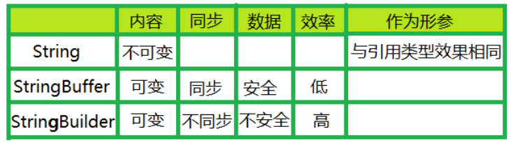

### 5.StringJoiner

#### 5.1.引入

现在需要拼接一百万个字符串，使用字符串直接拼接的方式效率太慢，后来使用`StringBuilder`

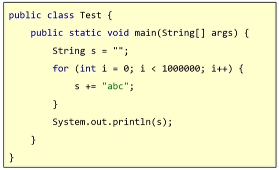

使用`StringBuilder`后速度是快了，但是某些场景下还是比较麻烦的

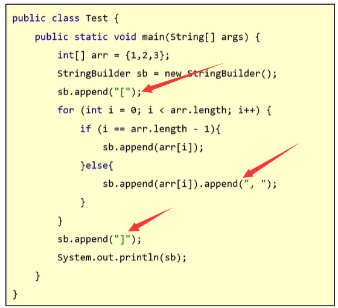

开头需要`[`，结尾需要`]`，中间需要`,`，还是比较麻烦，使用`StringJoiner`就非常方便


#### 5.2.特点

`StringJoiner`和`StringBuilder`一样，也可以理解为容器，创建后内容可变，用于提高字符串操作效率，且代码更加简洁

#### 5.3.创建StringJoiner对象

通过`new`的方式，存在两种`StringJoiner`构造函数

- `public StringJoiner(间隔符号)`
- `public StringJoiner(间隔符号,开始符号,结束符号)`

#### 5.4.常见方法

|             函数             |             说明             |
| :--------------------------: | :--------------------------: |
| `StringJoiner add(任意数据)` |   添加数据，并返回对象本身   |
|        `int length()`        |           返回长度           |
|     `String toString()`      | 将`StringJoiner`转为`String` |

### 6.底层原理

#### 6.1.字符串拼接的底层原理

字符串拼接分成两种情况，请看

①无变量参与的情况

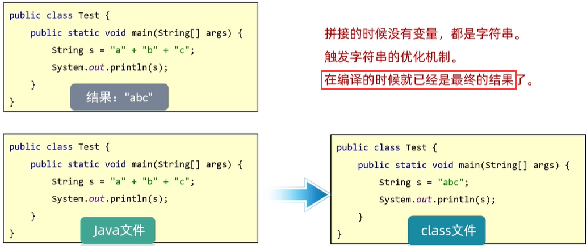

②有变量参与的情况

* 在JDK8以前，包含变量参与的字符串拼接实际会创建`StringBuilder`对象，调用其`append()`

  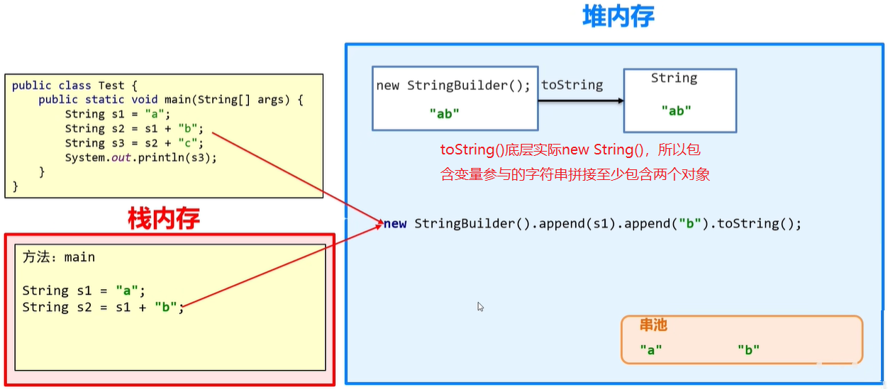

  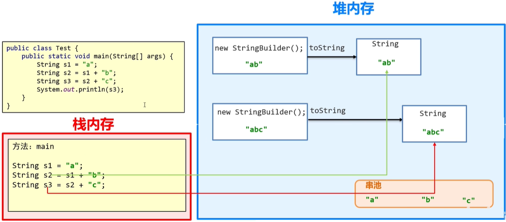

* JDK8会预估字符串长度，形成数组后再转成字符串，解决每拼接一次就需要创建两个对象的问题，但是若存在多次拼接(上图)最好还是不要使用`+`，因为存在多次预估，使用`append()`更加高效

  

了解了字符串的拼接原理，请看以下面试题

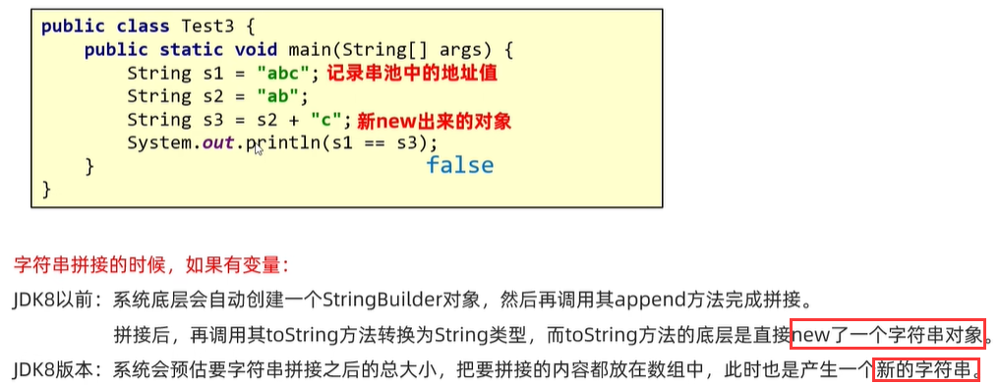

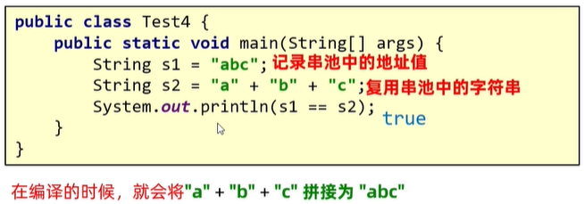

#### 6.2.StringBuilder高效底层原理

`StringBuilder`是一个长度可变的容器，所有的内容都往里面塞，不会创建很多无用的空间，节约内存

#### 6.3.StringBuilder源码分析

先了解其扩容原理

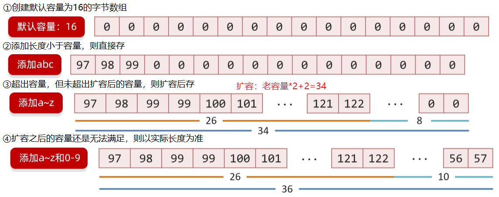

来开始啃源码！

①创建默认容量为16的字符数组

```java
//按住Ctrl，鼠标点击StringBuilder
StringBuilder sb = new StringBuilder();
```

```java
public StringBuilder() {
    //super	*<1>*
    super(16);
}
```

```java
char[] value;
AbstractStringBuilder(int capacity) {
    //创建默认容量为16的字符数组
    value = new char[capacity];
}
```

②扩容部分主要就是在`append()`内体现，所以进入`append()`，`Ctrl+F12`选中`append(String)`

```java
@Override
public StringBuilder append(String str) {
    //append	*<1>*
    super.append(str);
    return this;
}
```

```java
int count;//实际长度
public AbstractStringBuilder append(String str) {
    if (str == null)//做非空判断
        //appendNull	*<2>*
        return appendNull();//拼接null返回当前对象
    
    int len = str.length();//字符串实际长度
    //ensureCapacityInternal(实际长度0 + 字符串长度 = 最小容量)	*<3>*
    ensureCapacityInternal(count + len);
    str.getChars(0, len, value, count);
    count += len;//实际长度
    return this;
}
```

```java
private AbstractStringBuilder appendNull() {
    int c = count;//实际长度，此处为默认值0
    ensureCapacityInternal(c + 4);//该方法暂时先不看
    final char[] value = this.value;//数字是对象，此处改变局部value，导致全局this.value也会变化
    value[c++] = 'n';
    value[c++] = 'u';
    value[c++] = 'l';
    value[c++] = 'l';
    count = c;//改变实际长度为null的长度4
    return this;//返回当前对象
}
//appendNull()完毕，请回到<2>继续向下
```

```java
private void ensureCapacityInternal(int minimumCapacity) {
    //判断需要的最小容量 > 实际容量[数组的长度]，表示需要扩容
    if (minimumCapacity - value.length > 0)
        //expandCapacity	*<4>*
        expandCapacity(minimumCapacity);//value扩容完毕
}
//ensureCapacityInternal()完毕，请回到<3>继续向下
```

```java
//此方法是扩容的关键逻辑
void expandCapacity(int minimumCapacity) {
    //新容量 = 原容量*2+2
    int newCapacity = value.length * 2 + 2;
    //若新容量 < 需要的最小容量，则直接按照需要的最小容量扩容
    if (newCapacity - minimumCapacity < 0)
        newCapacity = minimumCapacity;//新容量 = 需要的最小容量
    //若新容量<0，表示扩容以后的容量超出int范围，则直接将新容量设置为Integer.MAX_VALUE;
    if (newCapacity < 0) {
        //若所需的容量<0，表示所需的容量超出int范围，则抛出异常，因为无法再扩容了
        if (minimumCapacity < 0)
            throw new OutOfMemoryError();
        newCapacity = Integer.MAX_VALUE;
    }
    //确定好需要扩展的新容量则需要开始扩容了，走copyOf(原数组,新容量)	*<5>*
    value = Arrays.copyOf(value, newCapacity);//扩容后的新数组复制给value
}
//expandCapacity()完毕，请回到<4>继续向下
```

```java
public static char[] copyOf(char[] original, int newLength) {
    //创建新容量大小的数组
    char[] copy = new char[newLength];
    //调用System的arraycopy(原数组,起始位置,目标数组,起始位置,复制长度)
    System.arraycopy(original, 0, copy, 0,
                     Math.min(original.length, newLength));
    //返回扩容后的新数组
    return copy;
}
//copyOf()完毕，请回到<5>继续向下
```

## 三、Math

Math是一个帮助数学计算的工具类，构造方法是私有的，所有的方法都是静态的，常用方法如下

|                  方法                  |                             说明                             |
| :------------------------------------: | :----------------------------------------------------------: |
|        `static int abs(int a)`         |                            绝对值                            |
|     `static double ceil(double a)`     |                           向上取整                           |
|    `static double floor(double a)`     |                           向下取整                           |
|      `static int round(float a)`       |                           四舍五入                           |
|     `static int max(int a,int b)`      |                            最大值                            |
|     `static int min(int a,int b)`      |                            最小值                            |
| `static double pow(double a,double b)` |                         `a`的`b`次幂                         |
|     `static double sqrt(double a)`     |                            平方根                            |
|     `static double cbrt(double a)`     |                            立方根                            |
|        `static double random()`        | `[0.0,1.0)`范围内的随机值，底层调用的是`Random`的`nextDouble()` |

## 四、System

System是一个工具类，提供系统相关的方法，不能被实例化，常用方法如下

|                             方法                             |                             说明                             |
| :----------------------------------------------------------: | :----------------------------------------------------------: |
|                `static void exit(int atatus)`                | 终止当前正在运行的Java虚拟机，参数为`0`表示正常终止，非`0`表示异常终止 |
|              `static long currentTimeMillis()`               | 以毫秒为单位返回当前系统时间，当前系统时间指从时间原点开始到现在的毫秒值 |
| `static void arraycopy(原数组,原数组开始索引,目标数组,目标数组开始索引,拷贝个数)` |   将原数组从开始位置拷贝指定个数的元素到目标数组的开始位置   |

`currentTimeMillis()`的时间原点是`1970年1月1日 00:00:00`，这算是C语言的诞生日，但是中国与标准时间存在8小时的时差，所以在我们的操作系统之中，时间原点实际是`1970年1月1日 08:00:00`

`arraycopy()`请注意以下几点

- 对于基本数据类型，原数组与目标数组的类型必须一致，否则报错
- 对于引用数据类型，目标数组可以是原数组的父类类型
- 拷贝时，需要考虑数组长度，长度越界会报错

## 五、Runtime

Runtime表示当前虚拟机的运行环境，不能直接`new`，通过`get`方法获取，常用方法如下

|              方法              |                         说明                         |
| :----------------------------: | :--------------------------------------------------: |
| `static Runtime getRuntime()`  | 获取当前系统运行环境对象，**每次获取的是同一个对象** |
|    `void exit(int status)`     |             终止当前正在运行的Java虚拟机             |
|  `int availableProcessors()`   |                    获取CPU线程数                     |
|       `long maxMemory()`       |    JVM**能**从系统中获取的总内存大小，单位`byte`     |
|      `long totalMemory()`      |   JVM**已经**从系统中获取的总内存大小，单位`byte`    |
|      `long freeMemory()`       |             JVM剩余内存大小，单位`byte`              |
| `Process exec(String command)` |                    运行`cmd`命令                     |

> `byte / 1024 / 1024 = 兆`

## 六、Object&Objects

### 1.Object

Object是Java的顶级父类，所有的Java类都直接或间接的继承自Object类，Object中无成员变量，所以Object只存在一个空参构造，常用方法如下

|             方法             |                             说明                             |
| :--------------------------: | :----------------------------------------------------------: |
|     `String toString()`      | 返回对象的字符串表示形式，默认是由`类的全路径+'@'+哈希值的十六进制`表示，即`this.getClass().getName()+"@"+Integer.toHexString(this.hashCode())` |
| `boolean equals(Object obj)` | 默认比较对象地址值，但这样是无意义的，所以子类一般会重写该方法，例如`String`就重写该方法，用于比较字符串字面量，而不是地址值 |
|       `int hashCode()`       | 返回对象的哈希值，哈希值与地址值有关联，通过哈希值确定对象在哈希表中的索引位置，哈希表存储键值对，利用键很快查到值 |
|  `protected Object clone()`  |               对象克隆，也叫对象拷贝、对象复制               |
|   `final Class getClass()`   |                      返回Object运行时类                      |

为什么需要`hashCode()`？为什么JDK要同时重写`hashCode()`和`equals()`？以`HashSet`查重为例。**当对象加入`HashSet`时，计算该对象的`hashCode`来确定对象的加入位置，同时与其他`hashCode`相比较，若`hashCode`不同则`HashSet`认为对象未重复，若`hashCode`相同则调用`equals`判断对象是否真相同，若相同则不让其加入，若不同则按哈希冲突处理办法。这样做减少了`equals`的次数，大大提高执行速度**

------

Object的`clone()`不能直接调用，因为是受保护的，可以通过一下两个步骤调用

- JavaBean类中重写该方法，重写方法加上`super.clone()`
- JavaBean类必须实现`Cloneable`接口，该接口中没有任何内容，只是一个标记性接口，一旦实现则表示当前类的对象可被克隆

------

Java中的克隆分为深克隆和浅克隆，Object中的`clone()`是浅克隆

- 深克隆中，对于基本数据类型直接复制值，对于字符串引用字符串常量池中的地址值，对于引用数据类型会创建新的

  

- 浅克隆中，不管三七二十一，之间全部拷贝过来

  

### 2.Objects

Objects是工具类，平常使用对象调用方式时，若对象为空则报空指针异常，所以通常需要判空，比较麻烦


Objects内部会进行判空操作，常用方法如下

|                    方法                    |                 说明                  |
| :----------------------------------------: | :-----------------------------------: |
| `static boolean equals(Object a,Object b)` |     先做非空判断，再比较两个对象      |
|    `static boolean isNull(Object obj)`     | 判断对象是否为空，为`null`返回`true`  |
|    `static boolean nonNull(Object obj)`    | 判断对象是否为空，为`null`返回`false` |

## 七、BigInteger&BigDecimal

### 1.BigInteger

#### 1.1.BigInteger是什么？

BigInteger表示大的整数，超出`long`的表示范围BigInteger可以表示，小的整数BigInteger也可以表示，**只要是整数BigInteger都可以表示**

BigInteger的构造方法与创建BigInteger对象的方法如下，注意**对象一旦创建，内部记录的值不能发生改变，和String的不可变特点相同**，BigInteger只要参与运算返回的都是新的BigInteger对象

|                 方法                  |                             说明                             |
| :-----------------------------------: | :----------------------------------------------------------: |
|   `BigInteger(int num,Random rnd)`    |             获取随机大整数，范围`[0,2^num - 1]`              |
|       `BigInteger(String val)`        |                        获取指定大整数                        |
|  `BigInteger(String val,int radix)`   |                      获取指定进制大整数                      |
| `static BigInteger valueOf(long val)` | 获取BigInteger对象，注意参数是`long`类型，所以获取的BigInteger对象也在`long`范围内 |

`valueOf()`在内部做了一些优化，在BigInteger的静态代码块中，**提前创建好了`[-16,16]`范围内数字的BigInteger对象**，当参数在其范围内时，不会多次创建对象

------

BigInteger的常用方法如下

|                       方法                        |            说明             |
| :-----------------------------------------------: | :-------------------------: |
|         `BigInteger add(BigInteger val)`          |             加              |
|       `BigInteger subtract(BigInteger val)`       |             减              |
|       `BigInteger multiply(BigInteger val)`       |             乘              |
|        `BigInteger divide(BigInteger val)`        |           除取商            |
| `BigInteger[] divideAndRemainder(BigInteger val)` |        除取商和余数         |
|            `boolean equals(Object x)`             |        比较是否相同         |
|          `BigInteger pow(int exponent)`           |            次幂             |
|       `BigInteger max/min(BigInteger val)`        |        最大值/最小值        |
|          `int intValue(BigInteger val)`           | 转为`int`型，超出范围则报错 |

#### 1.2.存储整数的底层原理

对于计算机而言无数据类型概念，都是`01`的方式存储，数据类型都是编程语言自己规定的，那么超出`long`范围，即超出8字节后数据该怎么存呢？让我们看看BigInteger的底层

```java
final int signum;//若当前BigInteger为负数则该值为-1，为0则该值为0，为正数则该值为1
final int[] mag;//分段存当前BigInteger，每段32位
```


### 2.BigDecimal

#### 2.1.引入

计算机中的小数是如何存储的呢？对于`float`和`double`来说，小数部分占位情况如下

|   类型   | 占用字节数 | 总bit位数 | 小数部分bit位数 |
| :------: | :--------: | :-------: | :-------------: |
| `float`  |     4      |    32     |       23        |
| `double` |     8      |    64     |       52        |

整数部分先不管，看看小数部分，有的时候小数部分转成二进制后很长，但存小数部分的位数是有限的，超出的部分被丢弃，这样总会造成精度损失


#### 2.2.BigDecimal是什么？

BigDecimal表示大的小数，用于小数的精确计算，BigDecimal的构造方法与创建BigDecimal对象的方法如下

|                  方法                   |                             说明                             |
| :-------------------------------------: | :----------------------------------------------------------: |
|        `BigDecimal(double val)`         | 获取指定小数，这种方式创建的对象参加运算的结果可能是不精确的 |
|        `BigDecimal(String val)`         |                  获取指定小数，结果是精确的                  |
| `static BigDecimal valueOf(double val)` |  获取BigDecimal对象，注意参数为`double`类型，不要超出该范围  |

`valueOf()`在内部做了一些优化，**范围`[0,10]`内的整数返回已经创建好的BigDecimal对象**，注意该范围内的**非整数还是会创建对象的**

------

BigDecimal的常用方法如下

|                         方法                          |                   说明                   |
| :---------------------------------------------------: | :--------------------------------------: |
|           `BigDecimal add(BigDecimal val)`            |                    加                    |
|         `BigDecimal subtract(BigDecimal val)`         |                    减                    |
|         `BigDecimal multiply(BigDecimal val)`         |                    乘                    |
|          `BigDecimal divide(BigDecimal val)`          |             除，除不尽就报错             |
| `BigDecimal divide(BigDecimal val,精确几位,舍入模式)` | 除，舍入模式可通过枚举`RoundingMode`设置 |

#### 2.3.存储小数的底层原理

BigDecimal的存储原理与BigInteger存在较大的差异，BigDecimal是将每一位数字通过ASCII表转成对应的字符进行存储


## 八、时间

### 1.Date

Date类用于描述时间，精确到毫秒，构造函数存在两个，方法也是两个，通过有参构造和`setTime()`设置的数值表示从时间原点开始过了参数的毫秒值


### 2.SimpleDateFormat

SimpleDateFormat存在两个作用，首先是将**Date对象时间格式化**，其次还可以将**字符串解析成Date对象**

SimpleDateFormat构造函数如下

|              构造函数              |             说明              |
| :--------------------------------: | :---------------------------: |
|        `SimpleDateFormat()`        |   默认时间格式，线程不安全    |
| `SimpleDateFormat(String pattern)` | 通过`pattern`参数指定时间格式 |

常用方法如下

|               方法               |         说明         |
| :------------------------------: | :------------------: |
| `final String format(Date date)` |  Date对象时间格式化  |
|   `Date parse(String source)`    | 字符串解析成Date对象 |

格式化时间的形式的常用模式如下

|  年  |  月  |  日  |  时  |  分  |  秒  |
| :--: | :--: | :--: | :--: | :--: | :--: |
| `y`  | `M`  | `d`  | `H`  | `m`  | `s`  |

例如`2022-09-30 10:45:01`的时间格式为`yyyy-MM-dd HH:mm:ss`，`2022年09月30日 10:45:01`的时间格式为`yyyy年MM月dd日 HH:mm:ss`

### 3.Calendar

Calendar表示当前日期的时间对象，可以单独的修改、获取时间中的年月日，**注意Calendar是一个抽象类**，不能直接`new`创建对象，而是**通过`Calendar.getInstance()`的方式获取对象**，这种方式获取对象时会将纪元、年、月、日等放到一个数组中，常用方法如下

|                方法                 |                             说明                             |
| :---------------------------------: | :----------------------------------------------------------: |
|       `final Date getTime()`        |                         获取Date对象                         |
|   `final void setTime(Date date)`   |                      为日历设置Date对象                      |
|      `long getTimeInMillis()`       |                        获取时间毫秒值                        |
| `void setTimeInMillis(long millis)` |                     为日历设置时间毫秒值                     |
|        `int get(int field)`         |                    获取日历对象中某字段值                    |
|   `void set(int field,int value)`   |                    设置日历对象中某字段值                    |
|   `void add(int field,int value)`   | 为某字段增加/减少指定值，例如`c.add(Calendar.YEAR, 2);`、`c.add(Calendar.YEAR, -4);` |

参数`int field`表示的是想要获取的字段在数组中的索引值，例如`get(1)会返回年份`；也可以直接使用封装好的常量值，例如`get(Calendar.YEAR)`，发现`Calendar.YEAR`底层实际就为`1`

------

关于日历对象还应该**注意**

- 月份的是从`0`开始，直到`11`月结束
- 星期中对应数字`1`到`7`，但注意`1`表示的是星期日，`2`表示的是星期一，以此类推

### 4.JDK8以后新增

JDK8以后对时间类进行改进，使时间相关的操作更加简化，并且在线程方面进行优化，使其线程安全，原有的时间对象不可改变

#### 4.1.Date改进

Date类分为ZoneId时区、Instant时间戳、ZoneDateTime带时区的时间

- ZoneId时区：时区的格式指定为洲名/城市名、国家名/城市名的格式，例如`Asia/Shanghai`

  |                    方法                    |          说明          |
  | :----------------------------------------: | :--------------------: |
  | `static Set<String> getAvailableZoneIds()` | 获取Java支持的所有时区 |
  |      `static ZoneId systemDefault()`       |    获取系统默认时区    |
  |     `static ZoneId of(String zoneId)`      |      获取指定时区      |

- Instant时间戳

  |                 方法                  |           说明            |
  | :-----------------------------------: | :-----------------------: |
  |        `static Instant now()`         | 获取当前时间的Instant对象 |
  |     `static Instant ofXxxx(...)`      |  根据参数获取Instant对象  |
  |  `ZonedDateTime atZone(ZoneId zone)`  |         指定时区          |
  | `boolean isXxx(Instant otherInstant)` |      判断系列的方法       |
  |        `Instant minusXxx(...)`        |    减少时间系列的方法     |
  |        `Instant plusXxx(...)`         |    增加时间系列的方法     |

- ZoneDateTime带时区的时间

  |               方法                |              说明              |
  | :-------------------------------: | :----------------------------: |
  |    `static ZoneDateTime now()`    | 获取当前时间的ZoneDateTime对象 |
  | `static ZoneDateTime ofXxxx(...)` |  根据参数获取ZoneDateTime对象  |
  |    `ZoneDateTime withXxx(...)`    |       修改时间系列的方法       |
  |   `ZoneDateTime minusXxx(...)`    |       减少时间系列的方法       |
  |    `ZoneDateTime plusXxx(...)`    |       增加时间系列的方法       |

#### 4.2.SimpleDateFormat改进

SimpleDateFormat类分为DateTimeFormatter用于时间的格式化和解析

- DateTimeFormatter用于时间的格式化和解析

  |                    方法                    |           说明            |
  | :----------------------------------------: | :-----------------------: |
  | `static DateTimeFormatter ofPattern(格式)` | 获取DateTimeFormatter对象 |
  |         `String format(时间对象)`          |        时间格式化         |

#### 4.3.Calendar改进

Calendar类分为LocalDate年月日、LocalTime时分秒、LocalDateTime年月日时分秒，方法差不多，自行查阅帮助文档

#### 4.4.时间工具类

工具类Duration时间间隔秒、纳秒，Period时间间隔年、月、日，ChronoUnit时间间隔所有单位

## 九、包装类

### 1.包装类是什么？

包装类指基本数据类型的引用类型，万物皆对象，若某个方法的参数是Object，但是此时想要传递的是基本数据类型，那么传递就会失败；并且集合内是不能存基本数据类型的


### 2.类型

每种基本数据类型都有自己的包装类，对应关系如下

| `byte` | `short` |   `int`   | `long` | `boolean` |   `char`    | `float` | `double` |
| :----: | :-----: | :-------: | :----: | :-------: | :---------: | :-----: | :------: |
| `Byte` | `Short` | `Integer` | `Long` | `Boolean` | `Character` | `Float` | `Double` |

其中Integer用得最多，所以接下来以Integer为例，展开学习

获取Integer对象的方式如下

|                     方法                     |                 说明                  |
| :------------------------------------------: | :-----------------------------------: |
|             `Integer(int value)`             |       根据`int`创建Integer对象        |
|             `Integer(String s)`              |      根据`Stirng`创建Integer对象      |
|       `static Integer valueOf(int i)`        |       根据`int`创建Integer对象        |
|      `static Integer valueOf(String s)`      |      根据`Stirng`创建Integer对象      |
| `static Integer valueOf(String s,int radix)` | 根据`Stirng`创建指定进制的Integer对象 |

常用方法如下

|                   方法                    |         说明          |
| :---------------------------------------: | :-------------------: |
|   `static String toBinaryString(int i)`   |       转二进制        |
|   `static String toOctalString(int i)`    |       转八进制        |
|    `static String toHexString(int i)`     |      转十六进制       |
| `static String toString(int i,int radix)` |      转指定进制       |
|      `static int parseInt(String s)`      |     转`int`型整数     |
| `static int parseInt(String s,int radix)` | 指定进制转`int`型整数 |

> 注意字符串不能出现字母，只能是数字，否则报错

### 3.常量池技术

请看如下例题，分析其输出结果

```java
Integer i1 = Integer.valueOf(127);
Integer i2 = Integer.valueOf(127);
System.out.pringln(i1==i2);//true

Integer i3 = Integer.valueOf(128);
Integer i4 = Integer.valueOf(128);
System.out.pringln(i3==i4);//false

Integer i5 = new Integer(127);
Integer i6 = new Integer(127);
System.out.pringln(i5==i6);//false

Integer i7 = new Integer(128);
Integer i8 = new Integer(128);
System.out.pringln(i7==i8);//false
```

关于`i5`、`i6`和`i7`、`i8`的比较，由于四者都通过`new`的方式创建所以地址值不会相同，返回`false`

关于`i1`、`i2`和`i3`、`i4`的比较，为什么会产生这样的结果呢？这就是常量池技术，我们来看看Integer的`valueOf`的源码

```java
public static Integer valueOf(int i) {
    //一旦-128<=i<=127，则会进入cache方法，否则才会通过new的方式创建对象
    if (i >= IntegerCache.low && i <= IntegerCache.high)
        return IntegerCache.cache[i + (-IntegerCache.low)];
    return new Integer(i);
}
```

```java
//static final Integer cache[];
cache = new Integer[(high - low) + 1];
int j = low;
for(int k = 0; k < cache.length; k++)
    cache[k] = new Integer(j++);
```

通过源码发现在`[-128,127]`范围内并不会创建新对象，而是在提前创建好的常量池数组中直接拿，所以这也很好的解释了为什么会产生以上结果

所有的包装类都存在缓冲区吗？也不是。**其中`Byte`、`Short`、`Integer`、`Long`的缓冲区范围为`[-128,127]`；`Character`的缓冲区范围为`[0,127]`；`Boolean`直接返回`true`或`false`；`Float`与`Double`不存在缓冲区；超出缓冲区范围才会创建新对象**

### 4.自动拆装箱

**自动装箱**指将基本类型转换成包装类型`valueOf()`，**自动装箱**同样适用于常量池技术；自动拆箱指将包装类型转换成基本类型`xxValue()`

```java
Integer itg = 100;(自动装箱)
int i = itg;(自动拆箱)
```

## 十、Arrays

Arrays是操作数组的工具类，常用方法如下

|                         方法                         |                             说明                             |
| :--------------------------------------------------: | :----------------------------------------------------------: |
|          `static String toString(int[] a)`           |           将数组转成`[元素1,元素2,...]`形式字符串            |
|      `static int binarySearch(int[] a,int key)`      |     二分查找法查找元素，要求数组中的元素是有序且是升序的     |
|       `static int[] copyOf(原数组,新数组长度)`       | 拷贝数组，若新数组的长度小于原数组的长度会部分拷贝，若新数组的长度等于原数组的长度会完全拷贝，若新数组的长度大于原数组的长度会补上默认初始值0 |
| `static int[] copyOfRange(原数组,起始索引,结束索引)` |        指定范围拷贝数组，包含起始索引，不包含结束索引        |
|           `static void fill(int[] a,元素)`           |                填充数组，数组的所有元素被填充                |
|             `static void sort(int[] a)`              |    按默认方式对基本数据类型数组升序排序，底层使用快速排序    |
|            `static void sort(Object[] a)`            | 按指定规则对引用类型数组排序，该引用类型实现Comparable接口，重写`compareTo()`，具体书写格式如下 |
|          `static void sort(数组,排序规则)`           | 按指定规则对引用类型数组排序，若是基本数据类型则需变成对应的包装类，排序规则的书写格式如下 |

Comparable接口重写`compareTo()`的格式如下

```java
public class ComparableTest implements Comparable<ComparableTest> {
	
	public Integer value;

	@Override
	public int compareTo(ComparableTest o) {
		return this.value-o.value;//这边就是比较规则
        
        //返回1表示升序，返回-1表示降序
	}

}
```

Comparator接口重写`compare()`的格式如下，这个方法的底层实际上是**遍历当前无序的序列得到每一个元素，假设当前遍历到A元素，利用二分查找确定A的插入点，该插入点位置实际就是mid位置，通过`compare(A元素，插入点元素)`比较后获得返回值，若返回值是负数则A继续与前面的元素比较，若返回值是正数则A继续与后面的元素比较，若返回值是0则A还是与后面的元素比较，直到能确定A的最终位置为止**

```java
//sort(数组,排序规则)的使用方式如下，排序规则是接口，通过匿名内部类的方式实现
Integer[] arr = {2,3,6,1,4,0};
Arrays.sort(arr,new Comparator<Integer>(){
    
    @Override
    public int compare(Integer o1,Integer o2){//(无序序列中遍历得到的每一个元素,有序序列中的元素)
        return o1-o2;//这边就是比较规则
        
        //o1-o2	升序
        //o2-o1	降序
    }
    
});
```

比较原理真是有点难以理解，直接记结论吧！结论写在注释部分

------

**Comparable和Comparator有什么区别**

|                         `Comparable`                         |                  `Comparator`                  |
| :----------------------------------------------------------: | :--------------------------------------------: |
|                         `java.lang`                          |                  `java.util`                   |
|                        `compareTo()`                         |                  `compare()`                   |
| 调用`Collections.sort`或`Arrays.sort`时，默认使用该类实现该接口后重写方法内的排序规则，此排序被称为自然排序 |        该接口称比较器接口，一般单独定义        |
|        被类实现，比较规则嵌入类本身，不灵活，耦合度高        | 匿名内部类，在独立的类中实现，更灵活，耦合度低 |

简而言之Comparable使类自身具有比较能力，使该类与同类数据做比较使强制按照该自然顺序；Comparator是比较器，像是第三方工具，传入两个对象让比较器比较

------

`toString(int[] a)`的源码如下

```java
public static String toString(int[] a) {
    if (a == null)
        return "null";
    int iMax = a.length - 1;
    if (iMax == -1)
        return "[]";

    StringBuilder b = new StringBuilder();
    b.append('[');
    for (int i = 0; ; i++) {
        b.append(a[i]);
        if (i == iMax)
            return b.append(']').toString();
        b.append(", ");
    }
}
```

------

`binarySearch(int[] a,int key)`的源码如下

```java
public static int binarySearch(int[] a, int key) {
    return binarySearch0(a, 0, a.length, key);
}
```

```java
private static int binarySearch0(int[] a, int fromIndex, int toIndex, int key) {
    int low = fromIndex;
    int high = toIndex - 1;

    while (low <= high) {
        int mid = (low + high) >>> 1;
        int midVal = a[mid];

        if (midVal < key)
            low = mid + 1;
        else if (midVal > key)
            high = mid - 1;
        else
            return mid; // key found
    }
    //-(low + 1)表示负插入点减1
    return -(low + 1);  // key not found.
}
```

## 十一、Scanner

Scanner用于键盘录入，其构造函数是`public Scanner(InputStream source)`，其常用方法如下

|          方法          |                 说明                  |
| :--------------------: | :-----------------------------------: |
| `boolean hasNextXxx()` | 判断时候存在下一个输入，字符串可省Xxx |
|    `Xxx nextXxx()`     |            获取下一个输入             |

键盘录入的格式一般为

```java
Scanner sc=new Scanner(System.in);//System.in是System中静态字段，记录键盘录入信息
int i = Integer.parseInt(sc.nextLine());
double d = Double.parseDouble(sc.nextLine());
...
```

注意使用同一Scannner对象获取值时，若先获取int，再获取String则String类型则会被int输入完后的回车键所替代，解决方法如下

* `int`值输入后使用空`nextLine()`接收回车，再用`nextLine()`正常接收字符串
* 将所有的数据都按字符串获取，然后需要什么类型再强制类型转换即可

## 十二、Random

Random用于产生随机数，构造方法如下

|            方法            |                     说明                     |
| :------------------------: | :------------------------------------------: |
|     `public Random()`      |             每次产生的随机数不同             |
| `public Random(long seed)` | 参数表示种子，给出种子后每次产生的随机数相同 |

常用方法如下

|         方法         |           说明            |
| :------------------: | :-----------------------: |
|   `int nextInt()`    |  返回`int`范围内的随机数  |
| `int nextInt(int n)` | 返回`[0,n)`范围内的随机数 |


