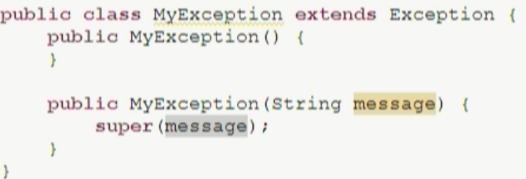

# 异常

## 一、异常是什么？

异常就是程序执行过程中的不正常情况，Java中异常以类的形式表现

## 二、Exception

Throwable包含两个子类，即Error和Exception，**Error是程序无法处理的异常**，如内存溢出，**Exception就是程序可以处理的异常**

**Exception有分为两类，即编译时异常和运行时异常**，编译时异常指一般的语法错误，编译器会提示程序员

**运行时异常又分为两类，即受检异常和非受检异常**

* **受检异常表示该异常需要捕获处理**，常见的受检异常有ClassNotFoundException、IOException、SQLException、FileNotFoundException
* **非受检异常表示该异常不需要捕获处理**，常见的非受检异常有RuntimeException、NullPointerException、IndexOutOfBoundsException、ArrayIndexOutBoundsException、StringIndexOutOfBoundsException

> 当程序员未对异常进行任何处理时，JVM默认会将异常的名称、原因等红色错误信息输出在控制台，同时结束程序

## 三、异常的处理

### 1.try-catch-finally

`try-catch`是捕获异常的一种方式，格式如下

```java
try{
	可能出现问题的代码
}catch(异常类型 变量名){
	针对问题的处理
}finally{
    必须执行的部分
}
```

`try`中**监视可能出现异常的代码块**

* 若该代码块中出现异常则直接跳到`catch`块中捕获处理，然后代码会继续向下执行
* `try`后可出现0个或多个`catch`，但0个`catch`时必须接`finally`

`catch`中**捕获指定异常对象**

* `catch`中常用的函数有`getMessage()`获取错误信息、`printStackTrace()`输出红色错误信息到控制台
* 多个`catch`块中，父类异常需要在后面捕获
* 多异常处理的格式是`catch(XXX1|XXX2 e)`，此时多个异常之间的关系必须是平级关系

`finally`中是**必须执行的代码块**，常用于关闭资源，例如当异常发生时程序意外中断，资源得不到释放的情况

* `finally`必须和`try`一起使用，不能单独存在
* 无论`try-catch`中执行怎样的动作，`finally`一定会被执行

思考若`catch`中存在`return`，`finally`还会被执行吗？如果会，是在`return`前还是后呢？

```java
public static void main(String[] args) {
    System.out.println(test());//30
}

public static int test(){
    int a = 10;

    try{
        System.out.println(a/0);
        a = 20;
    }catch(ArithmeticException e){
        a = 30;

        //程序执行到此，是return 30，而不再是return a，这个返回路径已经形成
        //此时发现还有finally，则再去执行finally块，再回来return 30
        return a;
    }finally {
        a = 40;
    }
    return a;
}
```

### 2.throw-throws

`throw`表示**抛出可能发生的异常**，格式为`throw 异常对象;`，被手动抛出的异常必须被处理，处理方式是`catch`捕获或`throws`抛出

`throws`会**将程序中抛出的未被`catch`捕获的异常抛出给主调函数处理**，主调函数即调用该方法的函数，格式为`throws 异常类名`，注意`throws`跟在方法的声明后

`throw`和`throws`的区别如下

|       区别       |     throw      |       throws       |
| :--------------: | :------------: | :----------------: |
|     声明位置     |     程序内     |      方法体后      |
|       数量       |  一个异常对象  | 可以是多个异常类名 |
|       处理       | 被捕获或被抛出 |   被主调函数处理   |
| 异常是否一定出现 |  一定出现异常  |     不一定出现     |

### 3.小结

`catch`中捕获到异常后程序还可以继续执行，但`throws`抛出异常后程序不再继续执行

## 四、用户自定义异常

### 1.引入

Java不可能每种异常情况都考虑到，所以出现自定义异常

### 2.定义

自定义异常继承自Exception(编译时)或RuntimeException(运行时)

