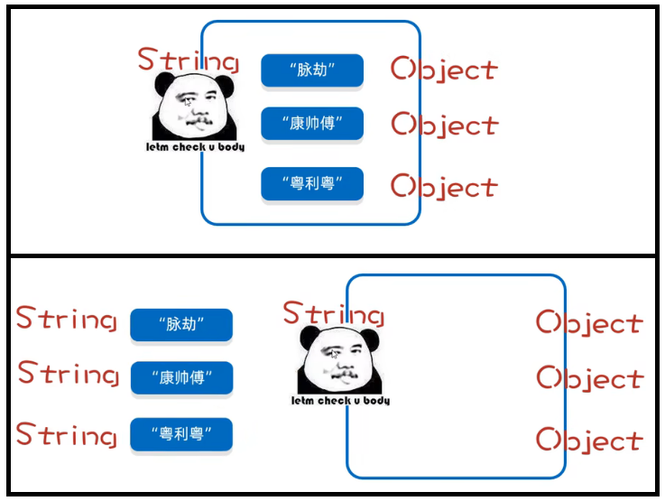
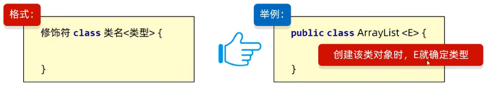
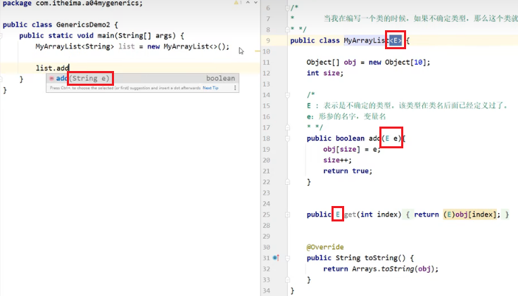
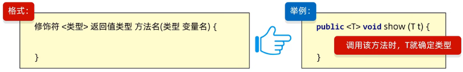
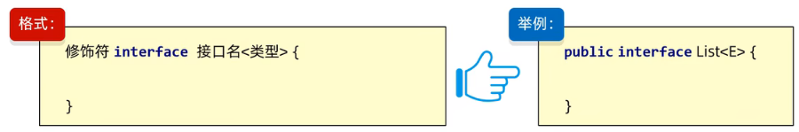
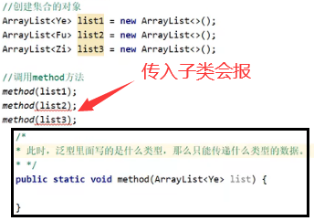
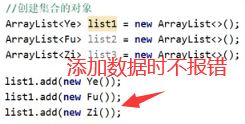

# 泛型

## 一、泛型是什么？

泛型是JDK5引入的新特性，**在编译阶段约束操作的数据类型，并进行检查**，泛型相当于一个看门的大爷，符合泛型规则则大爷让其进入，注意泛型**只支持引用数据类型**

那么没有泛型的时候是如何做的呢？没有泛型的弊端是什么呢？

```java
ArrayList list = new ArrayList();

//没有泛型约束时可以添加任意类型的元素到集合中，所有的类型被提升为Object类型，再次他也是有一个致命的弊端！
//	多态中不能访问子类的特有功能，此处类型都被提升成Object所以无法调用子类的特有功能
//	通过强转可以解决吗？无泛型约束时，集合中可以添加任意类型的元素，那么强转我应该如何确定强转成什么类型呢，显然是不行的，所以出现了泛型
list.add(123);
list.add("aaa");
list.add(new Student("张三",12));
```

**Java中的泛型其实是伪泛型**，只有满足泛型的数据才能进入集合，但数据进入集合后实际还是以Object类型存储，获取数据时又会按照泛型将其转成子类。在Java中的体现就是`.java`文件中是真真实实的存在泛型的，当编译成`.class`文件时泛型就会消失，这就称为**泛型擦除**



## 二、泛型的好处

统一数据类型，将运行时期的问题提前到了编译期间，避免了强制类型转换可能出现的异常，因为在编译阶段类型就能确定下来

## 三、泛型的种类

### 1.泛型类

定义类时，类中某个数据类型不确定，那么可以定义带有泛型的类，格式如下



举例中的E可以理解为变量，但此处变量用于记录变量的类型，而不是变量的值，还可以写成T、E、K、V等



### 2.泛型方法

定义方法时，方法的形参类型不确定，那么有两种方式

* 定义泛型类，方法的形参使用泛型为数据类型，此方式对所有的方法都有用
* 定义泛型方法，方法的形参使用泛型为数据类型，此方式只对当前方法都有用

格式如下



举例中的T可以理解为变量，但此处变量用于记录变量的类型，而不是变量的值，还可以写成T、E、K、V等

### 3.泛型接口

定义接口时，接口中某个数据类型不确定，那么可以定义带有泛型的接口，格式如下



明确泛型具体类型的时机有两种

* 实现类给出具体泛型，格式是`public class 实现类名 implements 接口名<String>`
* 实现类延续泛型，创建对象时再确定，格式是`public class 实现类名<T> implements 接口名<T>`

## 四、泛型的通配符

### 1.引入

**泛型本身不具备继承性，但数据具备继承性**

* 泛型本身不具备继承性

  

* 数据具备继承性

  

但是此时我希望`Ye`、`Fu`、`Zi`类型的数据进入集合，但不希望其他类型的数据进入集合怎么办？此时就需要泛型的通配符

### 2.种类

`<?>`：表示任意类型，不确定的类型，但它有如下两种限定方式

* `<? extends E>`：向下限定，可以传递E及其子类

* `<? super E>`：向上限定，可以传递E及其父类

##  五、使用场景

①定义类、方法、接口时，某个类型不确定可以使用泛型

②定义类、方法、接口时，某个类型不确定，但知道其继承体系，可以使用泛型通配符


