# 集合

## 一、集合引入

Java是面向对象的语言，此时需要一个容器存对象该怎么办呢？

* 使用`StringBuffer`、`StringBuilder`，但是这种方式返回的都是字符串
* 使用对象数组，但数组的长度固定且只能是同一数据类型

可见没有一种更好的容器来存储对象，所以出现了集合

------

数组和集合的差别如下

|                |                    集合                    |            数组            |
| :------------: | :----------------------------------------: | :------------------------: |
|      长度      |             长度可变，自动扩容             |          长度固定          |
| 元素的数据类型 | 只能是引用数据类型，基本数据类型使用包装类 | 基本数据类型、引用数据类型 |
|      内容      |           可以存的不同类型的元素           |       同一类型的元素       |

## 二、集合体系结构

集合分为两类，即单列集合Collection系列和双列集合Map系列，双列通过键值对的方式存储

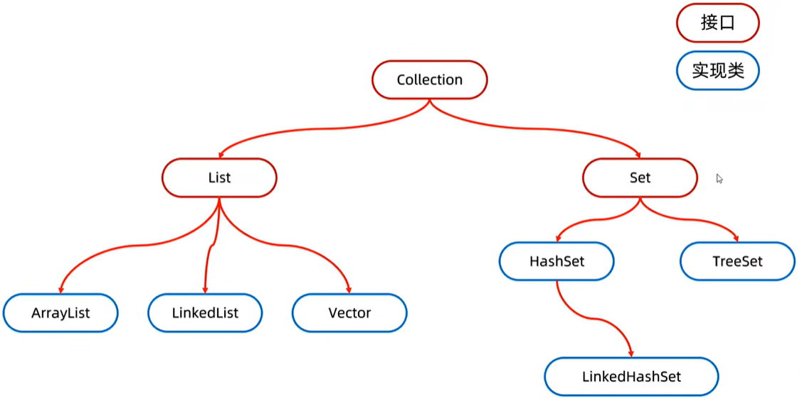

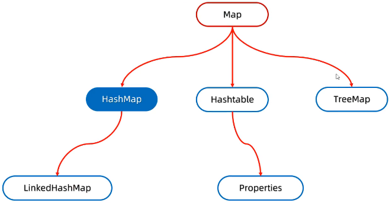

## 三、Collection集合

### 1.Collection是什么？

Collection是单列集合的祖宗接口，他的功能可被全部的单列集合继承使用，其常用方法如下

|                方法                 |                             说明                             |
| :---------------------------------: | :----------------------------------------------------------: |
|      `boolean add(Object obj)`      |                     将指定对象添加到集合                     |
|   `boolean addAll(Collection c)`    |       将参数集合中所有元素添加到调用该方法的集合对象中       |
|           `void clear()`            |                      清空集合中所有元素                      |
|        `boolean remove(E e)`        |                    将给定对象在集合中移除                    |
|  `boolean removeAll(Collection c)`  | 将参数集合中部分元素或所有元素从调用该方法的集合对象中移除，移除一个元素成功该方法就返回`true` |
|    `boolean contains(Object o)`     |                判断当前集合中是否包含给定对象                |
| `boolean containsAll(Collection c)` |  判断当前集合中是否包含参数集合中的元素，全部包含返回`true`  |
|  `boolean retainAll(Collection c)`  | 获取调用集合和参数集合的交集保存到调用集合中，返回值表示的是A是否发生过改变 |
|         `boolean isEmpty()`         |                     判断当前集合是否为空                     |
|            `int size()`             |                       获取集合元素个数                       |
|        `Object[] toArray()`         |                       将集合转换为数组                       |
|      `Iterator<E> iterator()`       |    集合的专用的遍历方式，迭代器依赖集合而存在，看源码可知    |

### 2.Collection遍历方式

#### 2.1.迭代器遍历

迭代器在Java中相应的类为`Iterator`，依赖于集合而存在，是集合的专用遍历方式，迭代器遍历不依赖于索引

Collection获取迭代器的方法是`Iterator<E> iterator()`，默认指向当前集合的`0`索引，`Iterator`的常用方法如下

|        方法         |                     说明                     |
| :-----------------: | :------------------------------------------: |
| `boolean hasNext()` |    判断当前位置是否有元素，有则返回`true`    |
|     `E next()`      | 获取当前位置的元素，并将迭代器移向下一个位置 |

集合迭代器遍历的格式如下

```java
Iterator<String> it = list.iterator();
while(it.hasNext()){
    String str = it.next();
    System.out.println(str);
}
```

关于迭代器请注意

* 当没有元素还在继续`next()`时，报错`NoSuchElementException`
* 迭代器遍历完毕**指针不会复位**，若想要再次遍历则需要再次创建迭代器对象
* **迭代器遍历时不能使用集合的方式增加或删除元素**，若想要删除可使用迭代器提供的`remove()`，若想要增加元素暂时没办法，若强制增加或删除会**报错`ConcurrentModificationException`并发修改异常**，因为迭代器依赖于集合而存在，集合添加或删除元素后迭代器并不知道，所以会报错

#### 2.2.增强for遍历

增强for底层就是迭代器，为了简化代码而出现，只有单列集合和数组才可使用增强for来遍历，增强for格式如下

```java
for(数据类型 变量名 : 数组或集合){
    ...
}
```

看一个增强for的实例

```java
for(String s : list){
    System.out.println(s);
}
```

`集合.for`然后回车可以快捷生成增强for

**若在增强for循环中修改变量，不会改变原本的数据**

#### 2.3.lambda遍历

通过`default void forEach(Consumer<? super T> action)`可使用lambda表达式遍历集合

* 原来写法

  ```java
  coll.forEach(new Consumer<String>(){
      @Override
      public void accept(String s){//此处的s就是遍历到的每一个元素
          System.out.println(s);
      }
  });
  ```

* lambda表达式简化，前提Consumer是一个函数式接口

  ```java
  coll.forEach( s -> {
      System.out.println(s);
  });
  ```

------

### 3.List集合

#### 3.1.List特点

**有序**：存和取的顺序一致

**有索引**：可通过索引操作元素

**可重复**：存储的元素可重复

#### 3.2.List方法

Collection的方法List都继承了，但List集合有索引的概念，所以List集合新增了很多索引相关的方法，如下

|              方法               |                 说明                 |
| :-----------------------------: | :----------------------------------: |
| `void add(int index,E element)` |      在集合指定位置插入指定元素      |
|      `E remove(int index)`      | 删除指定位置的元素，返回被删除的元素 |
|       `E get(int index)`        |          返回指定位置的元素          |
|  `E set(int index,E element)`   | 修改指定位置的元素，返回被修改的元素 |
|  `ListIterator listIterator()`  |      列表迭代器，使用方式向下看      |

调用重载方式时会优先调用形参和实参类型相同的方法

```java
List<Integer> list = new ArrayList<String>();
list.add(1);
list.add(2);
list.add(3);

list.remove(1);//此处的参数实际上int型，是索引值，删除的实际上是2
```

#### 3.3.List遍历方式

①迭代器遍历、增强for遍历、lambda遍历与Collection相同

②普通for循环

```java
for(int i=0;i<list.size();i++){
    String s - list.get(i);
    System.out.println(s);
}
```

③列表迭代器遍历

ListIterator是Iterator的子接口，Collection获取迭代器的方法是`ListIterator listIterator()`，`ListIterator`的常用方法如下

|          方法           |                     说明                     |
| :---------------------: | :------------------------------------------: |
|   `boolean hasNext()`   |    判断当前位置是否有元素，有则返回`true`    |
|       `E next()`        | 获取当前位置的元素，并将迭代器移向下一个位置 |
| `boolean hasPrevious()` |        判断当前位置是否存在前一个元素        |
|     `E previous()`      |            获取列表中的前一个元素            |
|     `void add(E e)`     | 在迭代器遍历过程中添加元素，不报并发修改异常 |
|     `void remove()`     | 在迭代器遍历过程中删除元素，不报并发修改异常 |

ListIterator可以实现逆向遍历，但有局限，列表迭代器被创建时，指针默认指向`0`位置，所以必须要先正向遍历将索引移动到末尾才能实现逆向遍历，所以逆向遍历一般无意义

列表迭代器遍历的格式如下

```java
ListIterator<String> lit = list.listIterator();
while(lit.hasNext()){
    //在便利的过程中可使用迭代器的add()和remove()增加和删除元素，不报并发修改异常
    String str = it.next();
    System.out.println(str);
}
```

### 4.List数据结构

我们知道List存在三种不同的子类，那么它为什么需要这三个子类？子类有什么区别？其实子类存在数据结构上的区别，为不同的业务场景提高效率

数据结构就是**计算机底层存储数据、组织数据的方式**，指数据间以何种方式排列在一起，数据结构为了更加方便的管理和使用数据，需要结合具体的业务场景进行选择，一般情况下，选择的数据结构需要带来更高的运行或存储效率

此处呢不会过于详细的讲解！请观看[视频](https://www.bilibili.com/video/BV17F411T7Ao?p=189&vd_source=8811945bf338927db8b1ca45a8f75a87)学习栈、队列、数组、链表相关知识，请你带着以下三个问题去学习

* 该数据结构长什么样子？
* 如何添加数据？
* 如何删除数据？

### 5.ArrayList集合

#### 5.1.ArrayList特点

**ArrayList的特点如下**

* 底层结构是数组，查询快，增删慢
* 线程不安全，不同步，效率高
* 创建对象时创建长度为0的数组，首次添加元素是扩容长度为10的数组，然后1.5倍扩容，若扩容后还是装不下，则新数组长度为实际元素长度

在Collection和List中的常用方法在ArrayList中都可以直接拿过来用，所以ArrayList中不需要再去学习额外的方法

#### 5.2.ArrayList底层原理

**接下来学习学习ArrayList的底层原理吧！**

* **在底层创建长度为0的数组**

* **添加第一个元素时，底层会创建一个新的长度为10的数组**

  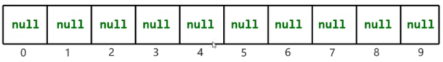

* **随着不断地添加，当长度为10的数据被填满时就需要自动扩容，1.5倍扩容后的新数组长度为15，若扩容后的长度装得下则1.5倍扩容，若扩容后的长度装不下则新数组长度为实际元素长度，将原数组内的元素拷贝到新数组后继续添加元素**

来开始啃源码！

①创建长度为0的数组

```java
//按住Ctrl，鼠标点击ArrayList
ArrayList<String> a = new ArrayList<>();
```

```java
transient Object[] elementData;
private static final Object[] DEFAULTCAPACITY_EMPTY_ELEMENTDATA = {};

public ArrayList() {
    this.elementData = DEFAULTCAPACITY_EMPTY_ELEMENTDATA;
}
```

②扩容部分主要就是在`add(E e)`内体现，所以进入`add(E e)`

```java
private int size;//size是elementData数组的长度
public boolean add(E e) {
    //ensureCapacityInternal	*<1>*
    ensureCapacityInternal(size + 1);//此时已经扩容完毕
    elementData[size++] = e;
    return true;
}
```

```java
private static final int DEFAULT_CAPACITY = 10;

private void ensureCapacityInternal(int minCapacity) {
    //当前数组是长度为0的数组时，即添加第一个元素时，创建长度为10的数组
    if (elementData == DEFAULTCAPACITY_EMPTY_ELEMENTDATA) {
        minCapacity = Math.max(DEFAULT_CAPACITY, minCapacity);
    }

    //ensureExplicitCapacity	*<2>*
    ensureExplicitCapacity(minCapacity);
}
```

```java
private void ensureExplicitCapacity(int minCapacity) {
    modCount++;

    //若最小容量>实际容量，则需要进入grow方法真正扩容
    if (minCapacity - elementData.length > 0)
        //grow	*<3>*
        grow(minCapacity);
}
```

```java
private static final int MAX_ARRAY_SIZE = Integer.MAX_VALUE - 8;

private void grow(int minCapacity) {
    //实际容量
    int oldCapacity = elementData.length;//0
    //1.5倍扩容后的新容量
    int newCapacity = oldCapacity + (oldCapacity >> 1);//0
    if (newCapacity - minCapacity < 0)//
        newCapacity = minCapacity;
    if (newCapacity - MAX_ARRAY_SIZE > 0)
        //hugeCapacity	*<4>*
        newCapacity = hugeCapacity(minCapacity);
    
    //底层使用System.arraycopy()
    elementData = Arrays.copyOf(elementData, newCapacity);
}
//grow()完毕，请回到<1>继续向下
```

```java
private static int hugeCapacity(int minCapacity) {
    if (minCapacity < 0) // overflow
        throw new OutOfMemoryError();
    return (minCapacity > MAX_ARRAY_SIZE) ?
        Integer.MAX_VALUE :
    MAX_ARRAY_SIZE;
}
```

### 6.LinkedList集合

**LinkedList的特点如下**

- 底层结构是双向链表，查询慢，增删快，但如果操作的是首尾元素那速度也是极快的
- 线程不安全，不同步，效率高

LinkedList底层是链表，所以LinkedList中需要再去学习额外的方法

|           方法            |       说明       |
| :-----------------------: | :--------------: |
| `void addFirst(Object e)` | 链表开头插入元素 |
| `void addLast(Object e)`  | 链表结尾插入元素 |
|      `E getFirst()`       | 获取链表开头元素 |
|       `E getLast()`       | 获取链表结尾元素 |
|     `E removeFirst()`     | 移除链表开头元素 |
|     `E removeLast()`      | 移除链表结尾元素 |

LinkedList的添加方法底层比较简单，就是链表的增删，链表不存在容量的概念，所以**LinkedList不存在自动扩容机制**

### 7.Vector集合

Vector用的很少，咱们就记住他的特点

* 底层结构是数组，查询快，增删慢
* 线程安全，同步，效率低
* 2倍扩容

------

### 8.Set集合

**无序**：存和取的顺序不一致，这里的无序是相对的，Set集合本身有自己的顺序，可能存在存和取的顺序一致的特殊情况

**无索引**：不可通过索引操作元素

**不可重复**：存储的元素不可重复

> Set集合是一个接口，该接口的方法基本上和Collection一致，所以此处不过多讲解

### 9.Set数据结构

#### 9.1.简单数据结构

请观看[视频1](https://www.bilibili.com/video/BV17F411T7Ao?p=194&spm_id_from=pageDriver&vd_source=8811945bf338927db8b1ca45a8f75a87)、[视频2](https://www.bilibili.com/video/BV17F411T7Ao?p=195&vd_source=8811945bf338927db8b1ca45a8f75a87)、[视频3](https://www.bilibili.com/video/BV17F411T7Ao?p=196&vd_source=8811945bf338927db8b1ca45a8f75a87)学习二叉树、二叉查找树、平衡二叉树、红黑树相关知识，请你带着以下三个问题去学习

- 该数据结构长什么样子？
- 如何添加数据？
- 如何删除数据？

------

此处简单介绍几种数据结构的特点

* 二叉树：任意节点的子节点数量都小于等于2，但普通二叉树的元素都是随意摆放的，查找非常麻烦
* 二叉查找树：首先是一颗二叉树，任意节点存在规律`左子节点的值 < 当前节点的值 < 右子节点的值`，但可能存在左子树不存在，元素全在右子树的情况，导致左右子树不平衡，查询效率降低
  * 添加节点规则是小的存左边，大的存右边，相等的不存
  * 查找节点规则是先与根节点比大小，当前节点小向左边找，当前节点大向右边找，相等则找到
  * 遍历节点分为前序遍历、中序遍历、后序遍历以及层序遍历，此处不详细讲解
* 平衡二叉树：首先是一颗二叉查找树，要求任意节点左右子树高度差不超过1，保证查询效率，平衡二叉树如何保证平衡？通过旋转机制，此处不详细讲解
* 红黑树：比较重要，请向下继续

#### 9.2.红黑树

红黑树是一种自平衡的二叉查找树，又称平衡二叉B树，红黑树是一种**特殊的二叉查找树**，每一个节点上都有**存储位表示该节点的颜色**，每个颜色可以是**红或黑**

红黑树**不是高度平衡的**，他的平衡通过**红黑规则**进行实现，注意红黑树不是平衡二叉树，因为平衡二叉树会造成添加节点是效率过低，**当红黑树不满足红黑规则时，才会旋转**

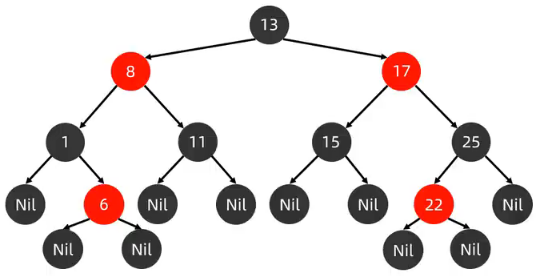

------

**红黑规则如下**

* **每个节点只能是红色或者黑色**
* **根节点必须是黑色**
* **没有左右子节点的节点，即叶子节点是黑色，且其指针属性位Nil**
* **红色节点的子节点必须是黑色，即不能出现两个红色节点相邻的情况**
* **对任意节点，从该节点到其后代所有叶子节点的简单路径上均包含相同数目的黑色节点**
  * 简单路径：不走回头路的路径

------

 红黑树添加节点规则

* **添加的节点默认是红色效率更高**，对于`18`、`20`、`23`这三个元素，尝试将其全部看成黑色添加节点，不满足规则时调整两次，尝试将其全部看成红色添加节点，不满足规则时只需调整一次

* 除了以上的基础规则，还存在以下细化规则，通过添加`20`、`18`、`23`、`22`、`17`、`24`、`19`节点形成红黑树来练习这些规则吧，答案就在[视频23:10](https://www.bilibili.com/video/BV17F411T7Ao/?p=196&spm_id_from=pageDriver&vd_source=8811945bf338927db8b1ca45a8f75a87)中

  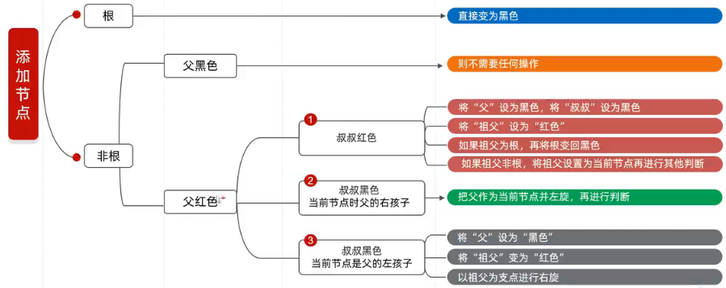

------

红黑树的增删改查的性能相对都是较好的，但是他的修改规则如此复杂，效率为什么会更高？其**实真正影响效率的是旋转，而红黑树更多的只是在改变节点的颜色**，虽然也存在旋转，但次数比平衡二叉树少很多

### 10.HashSet集合

#### 10.1.HashSet特点

HashSet的特点是无序、不重复、无索引，线程不安全

底层采取**哈希表**实现存储数据，实际是HashMap，哈希表是一种增删改查数据性能都比较好的结构

* JDK8以前哈希表通过数组、链表实现
* JDK8哈希表通过**数组、链表、红黑树**实现

**哈希值**是根据`hashCode()`计算出来的`int`类型的整数，该方法属于Object，一般会重写

* 若未重写则不同对象计算出来的哈希值不同，因为地址值不同
* 若重写则对象的属性值相同则计算出来的哈希值相同
* 就算不同对象或不同属性计算出来的哈希值也可能相同，因为哈希冲突

哈希冲突只是一种可能，可能性极小，因为`int`的范围是`[-21亿多,21亿多]`，那么此处创建50亿哥对象，则至少有8亿个对象产生哈希冲突，这只是一种极端的情况

#### 10.2.JDK8以后HashSet的底层原理

HashSet的底层原理如下

* **创建默认长度为16，默认加载因子为0.75的数组**

  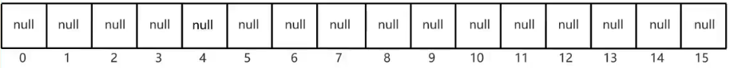

* **当使用`add()`添加数据时，通过`hashCode()`计算添加的元素的哈希值**

* **根据哈希值与数组的长度计算出插入位置，计算公式是`int index = (数组长度-1) & 哈希值`👀**

* **判断插入点位置是否为`null`，若是则直接存入**

  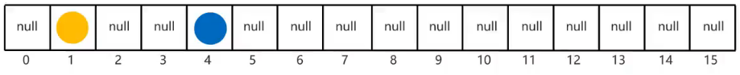

* **判断插入点位置是否为`null`，若不是则调用`equals()`判断对象的属性是否相同，若相同则不能加入，若不同则按哈希冲突处理办法处理**

  * JDK8以前新元素存入数组，老元素挂在新元素上面

    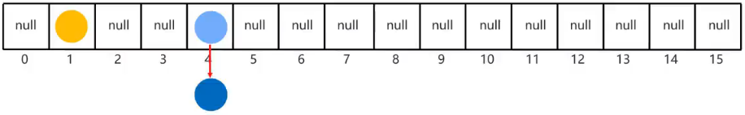

  * JDK8新元素直接挂在老元素后面

    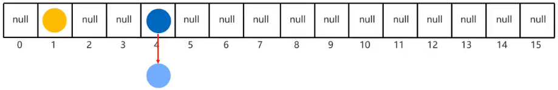

* **随着数组内元素越来越多，此时就与加载因子有关了，当数组存了`数组长度 * 加载因子`个元素时，数组就会2倍扩容**

* **当数组长度大于等于64且链表长度大于8，链表就会转成红黑树**

  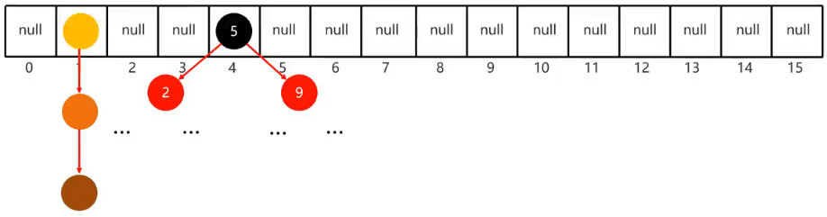

#### 10.3.HashSet三问题

①HashSet为什么存和取的顺序不一致？

遍历HashSet元素时，根据数组的索引顺序，一条链表一条链表的遍历，即数组元素[0]的链表遍历后，再遍历数组索引[1]中的链表，所以存和取的顺序当然不一致

②HashSet为什么没有索引？

数组内存的是链表，若存在索引机制，那么同一链表上的所有元素索引都相同？这显然不好，所以干脆取消了索引机制

③HashSet利用什么机制保证数据去重？

其实就是利用`hashCode`和`equals`，若HashSet中存的是自定义对象，一定要重写这两个方法

#### 10.4.hashCode和equals如何重写

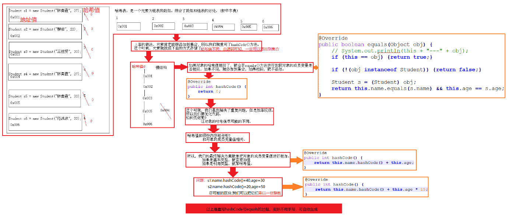

### 11.LinkedHashSet集合

不需要学习新增的方法，只需要学习其底层的原理即可，其特点为**有序**、不重复、无索引，其中不重复、无索引的原因和他爹一样，那么有序如何理解呢？实际上底层也是哈希表，**只是在哈希表的基础上又新增了双链表机制记录存储的顺序**，在遍历时实际上遍历的是双向链表

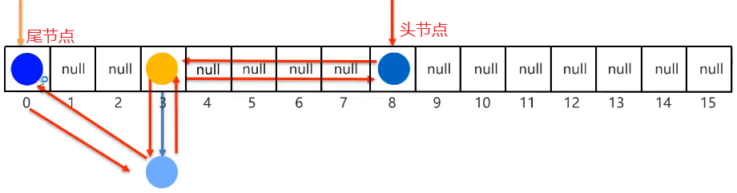

当需求是既要去重，又要有序时才使用LinkedHashSet，否则只去重的话还是使用HashSet

### 12.TreeSet集合

TreeSet的特点是**可排序**、不重复、无索引，排序规则如下

* 对于包装类，默认从小到大排序
* 对于字符串，默认从第一个字符开始比较ASCII表相应的值
* 对于自定义的类，需要实现Comparable接口，重写`compareTo()`实现排序规则

TreeSet底层基于**红黑树**实现排序，增删改查性能都比较好，现在谈一谈添加元素时底层在干嘛？**添加元素时按照红黑树的红黑规则添加**，但红黑树是二叉查找树，需要比较大小才能添加元素，比较规则如上，**对于自定义对象，比较规定被定义于`compareTo()`内**，具体案例请观看[视频21:57](https://www.bilibili.com/video/BV17F411T7Ao/?p=198&spm_id_from=pageDriver&vd_source=8811945bf338927db8b1ca45a8f75a87)

------

Comparable和Comparator的区别请看[常用API](/Java/1.Java基础/常用API)的[十、Arrays]，此处直接贴出两个案例

```java
TreeSet<Student> ts = new TreeSet<Student>();

public class Student implements Comparable<Student> {
    @Override
    public int compareTo(Student s) {
        // 根据自定义排序规则
        // 主要条件
        int num = this.age - s.age;
        // 次要条件  num=0表示年龄相同
        int num2 = num == 0 ? this.name.compareTo(s.name) : num;
        return num2;
    }
}
```

```java
TreeSet<Student> ts = new TreeSet<Student>(new MyComparator());

public class MyComparator implements Comparator<Student> {
    @Override
    public int compare(Student s1, Student s2) {
        // 根据自定义排序规则this -- s1     s -- s2
        // 主要条件
        int num = s1.getAge() - s2.getAge();
        // 次要条件  num=0表示年龄相同
        int num2 = num == 0 ? s1.getName().compareTo(s2.getName()) : num;
        return num2;
    }
}
```

## 四、Map集合

### 1.Map是什么？

Map以键值对(Entry对象)的形式存储数据，其中**键不可重复，值可重复**，键值对是一一对应的，每一个键只能找到自己的值

Map是双列集合的祖宗接口，他的功能可被全部的双列集合继承使用，其常用方法如下

|                 方法                  |                             说明                             |
| :-----------------------------------: | :----------------------------------------------------------: |
|        `V put(K key,V value)`         | 添加元素，若第一次添加则直接存返回null，若键存在则将值替换，并将替换掉的值返回 |
|        `V remove(Object key)`         |                     根据键删除键值对元素                     |
|            `void clear()`             |                      移除所有键值对元素                      |
|   `boolean containsKey(Object key)`   |                   判断集合是否包含指定的键                   |
| `boolean containsValue(Object value)` |                   判断集合是否包含指定的值                   |
|          `boolean isEmpty()`          |                       判断集合是否为空                       |
|             `int size()`              |                集合的长度，也就是键值对的个数                |

### 2.Map遍历方式

#### 2.1.键找值遍历

```java
//1.获取所有键
Set<String> set = map.keySet();
//2.遍历键的集合，分别得到每一个键
for(String key : set){
    //3.通过键获取值
    String value = map.get(key);
    System.out.println(key+":"+value);
}
```

#### 2.2.键值对遍历

```java
//1.获取键值对对象集合
Set<Map.Entry<String,String>> set = map.entrySet();
//2.遍历键值对对象集合，分别得到每一个键值对
for(Map.Entry<String,String> me : set){
    //3.根据键值对对象获取相应的键和值
    String key = me.getKey();
    String value = me.getValue();
    System.out.println(key+":"+value);
}
```

#### 2.3.lambda遍历

通过`default void forEach(BiConsumer<? super K, ? super V> action)`可使用lambda表达式遍历集合

- 原来写法

  ```java
  map.forEach(new BiConsumer<String,String>(){
      @Override
      public void accept(String key,String value){
          System.out.println(key+":"+value);
      }
  });
  ```

- lambda表达式简化，前提Consumer是一个函数式接口

  ```java
  map.forEach( (key,value) -> {
      System.out.println(key+":"+value);
  });
  ```

### 3.HashMap集合

#### 3.1.HashMap特点

HashMap是Map的一个实现类，没有额外的方法需要学习

HashMap特点都由键决定，即**无序、不重复、无索引、线程不安全、效率高**

HashSet的底层实际就是HashMap，看源码可知，所以HashMap也是通过哈希表结构实现，即**数组、链表、红黑树**

#### 3.2.HashMap底层原理

- **创建默认长度为16，默认加载因子为0.75的数组**

  

- **当使用`put()`添加数据时，首先会创建Entry对象，Entry对象中存键和值，通过`hashCode()`计算添加的元素键的哈希值，与添加元素的值无关**

- **根据哈希值与数组的长度计算出插入位置，计算公式是`int index = (数组长度-1) & 哈希值`👀**

- **判断插入点位置是否为`null`，若是则直接存入Entry对象**

  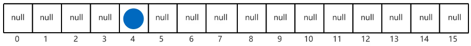

- **判断插入点位置是否为`null`，若不是则调用`equals()`判断键的属性是否相同，若相同则覆盖原有的Entry对象，若不同则按哈希冲突处理办法处理，与HashSet处理相同，分为JDK8前后**

  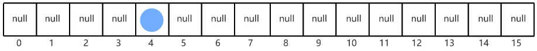

- **随着数组内元素越来越多，此时就与加载因子有关了，当数组存了`数组长度 * 加载因子`个元素时，数组就会2倍扩容**

- **当数组长度大于等于64且链表长度大于8，链表就会转成红黑树**

  

> 依赖`hashCode()`和`equals()`保证键的唯一性

#### 3.3.HashMap源码分析

HashMap源码分析是一个大工程啊！下面我们从添加第一个元素和添加其他元素的层面进行分析，探究HashMap底层。添加元素时至少考虑如下三种情况

* 元素位置为`null`，则直接添加
* 元素位置不为`null`，键重复，则元素覆盖
* 元素位置不为`null`，键不重复，则挂接在链表或红黑树下

源码分析我们也将通过以下代码进行追踪

```java
HashMap<String,String> map = new HashMap<>();
map.put("aaa",111);
map.put("bbb",222);
map.put("ccc",333);
map.put("ddd",444);
map.put("ddd",555);
```

------

①创建HashMap对象

* 初始化默认加载因子为0.75

```java
//按住Ctrl，鼠标点击HashMap
HashMap<String,String> map = new HashMap<>();
```

```java
final float loadFactor;
static final float DEFAULT_LOAD_FACTOR = 0.75f;

public HashMap() {
    this.loadFactor = DEFAULT_LOAD_FACTOR; //加载因子
}
```

------

②向HashMap添加第一个元素`map.put("aaa",111);`

* 扩容部分主要就是在`put`内体现，进入`put()`

```java
public V put(K key, V value) {
    //hash(key)	*<1>*	获取键的哈希值并做一些处理
    //putVal(键哈希值,键,值,若键相同false则会覆盖原来的,先不管)	*<2>*
    return putVal(hash(key), key, value, false, true);
}
```

```java
static final int hash(Object key) {
    int h;
    return (key == null) ? 0 : (h = key.hashCode()) ^ (h >>> 16);//哈希算法
}
//hash()完毕，请回到<1>继续向下
```

```java
//Node就是数组内链表部分
static class Node<K,V> implements Map.Entry<K,V> {
    final int hash;	//键的哈希值
    final K key;	//键
    V value;	//值
    Node<K,V> next;	//下一个节点
}
transient Node<K,V>[] table;//保存Entry对象的数组
transient int size;//哈希表中的元素个数
int threshold;//哈希表的扩容时机，值就是数组长度*0.75，赋值在resize()中完成

final V putVal(int hash, K key, V value, boolean onlyIfAbsent, boolean evict) {
    //Node结构如上，Node就是数组内链表部分
    Node<K,V>[] tab;//定义局部变量用来记录哈希表中数组的地址值
    //此处有table为什么还需要定义局部变量？table是成员变量，定义在堆中，而局部变量定义在栈中，若table被频繁使用，那么就要频繁去堆中找，相对比较麻烦，效率更高
    
    Node<K,V> p;//临时变量
    int n, i;//n表示数组长度，i表示索引
    
    //将table赋值给tab，哈希表数组长度赋值给n
    //若哈希表数组为空 或 哈希表数组长度为0，则初始化数组或扩容	==此时第一次添加元素tab=null，进入if
    if ((tab = table) == null || (n = tab.length) == 0)
        //resize()此方法内实现了关键的扩容，就不去看了，源码还是在下方贴出
        //	1.若是第一次添加数据则创建长度为16，加载因子为0.75的数组
        //	2.若不是第一次添加数组且未达到扩容条件，则底层什么也不干
        //	3.若不是第一次添加数组且达到扩容条件，则底层两倍扩容，并将原来哈希表中的所有数据全部转移
        //将扩容后的数组的长度赋值给n	==第一次添加元素会将数组扩容为16，所以此时n=16
        n = (tab = resize()).length;
    
    //将当前元素的插入索引赋值给i，当前元素赋值给p，当前元素的插入位置计算规则为(n - 1) & hash
    //若当前元素需要插入的位置为空，则直接插入	==第一次添加元素时肯定是null，所以进入if，else不会被执行
    if ((p = tab[i = (n - 1) & hash]) == null)
        //newNode这个方法的名字就有点故名思意了！其实就是创建Node节点，然后将该Node节点添加到数组	*<3>*
        tab[i] = newNode(hash, key, value, null);
    else {
        //当前元素需要插入的位置不为空
        
        //添加其他元素时讲解
    }
    ++modCount;//先不管
    
    //若实际元素个数大于扩容时机，则需要扩容	==添加第一个元素时size=0，++size=1，不会进入if
    if (++size > threshold)
        resize();
    
    //与LinkedHashMap相关，先不管
    afterNodeInsertion(evict);
    
    //当前没有覆盖任何元素，返回null
    return null;
}
//添加第一个元素的putVal()完毕，请看最后的小结部分
```

```java
static final int DEFAULT_INITIAL_CAPACITY = 1 << 4; //16

final Node<K,V>[] resize() {
    Node<K,V>[] oldTab = table;
    int oldCap = (oldTab == null) ? 0 : oldTab.length;
    int oldThr = threshold;
    int newCap, newThr = 0;
    if (oldCap > 0) {
        if (oldCap >= MAXIMUM_CAPACITY) {
            threshold = Integer.MAX_VALUE;
            return oldTab;
        }
        else if ((newCap = oldCap << 1) < MAXIMUM_CAPACITY &&
                 oldCap >= DEFAULT_INITIAL_CAPACITY)
            newThr = oldThr << 1; // double threshold
    }
    else if (oldThr > 0) // initial capacity was placed in threshold
        newCap = oldThr;
    else {               // zero initial threshold signifies using defaults
        newCap = DEFAULT_INITIAL_CAPACITY;
        newThr = (int)(DEFAULT_LOAD_FACTOR * DEFAULT_INITIAL_CAPACITY);
    }
    if (newThr == 0) {
        float ft = (float)newCap * loadFactor;
        newThr = (newCap < MAXIMUM_CAPACITY && ft < (float)MAXIMUM_CAPACITY ?
                  (int)ft : Integer.MAX_VALUE);
    }
    threshold = newThr;
    @SuppressWarnings({"rawtypes","unchecked"})
    Node<K,V>[] newTab = (Node<K,V>[])new Node[newCap];
    table = newTab;
    if (oldTab != null) {
        for (int j = 0; j < oldCap; ++j) {
            Node<K,V> e;
            if ((e = oldTab[j]) != null) {
                oldTab[j] = null;
                if (e.next == null)
                    newTab[e.hash & (newCap - 1)] = e;
                else if (e instanceof TreeNode)
                    ((TreeNode<K,V>)e).split(this, newTab, j, oldCap);
                else { // preserve order
                    Node<K,V> loHead = null, loTail = null;
                    Node<K,V> hiHead = null, hiTail = null;
                    Node<K,V> next;
                    do {
                        next = e.next;
                        if ((e.hash & oldCap) == 0) {
                            if (loTail == null)
                                loHead = e;
                            else
                                loTail.next = e;
                            loTail = e;
                        }
                        else {
                            if (hiTail == null)
                                hiHead = e;
                            else
                                hiTail.next = e;
                            hiTail = e;
                        }
                    } while ((e = next) != null);
                    if (loTail != null) {
                        loTail.next = null;
                        newTab[j] = loHead;
                    }
                    if (hiTail != null) {
                        hiTail.next = null;
                        newTab[j + oldCap] = hiHead;
                    }
                }
            }
        }
    }
    return newTab;
}
```

```java
Node<K,V> newNode(int hash, K key, V value, Node<K,V> next) {
    return new Node<>(hash, key, value, next);
}
////newNode()完毕，请回到<3>继续向下
```

* 小结：添加第一个元素时我们解决第一种情况，即**元素位置为`null`直接添加**，还应该掌握一些细节点！若此时添加第二个元素，假设它计算出来的数组位置与第一个元素位置不同！那么请你再去走一遍源码流程吧。添加两个元素过后的哈希表如图

  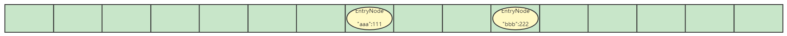

------

③向HashMap添加第三个元素

* `map.put("ccc",333);`假设第三个元素与第一个元素在数组中的位置相同

```java
//Node就是数组内链表部分
static class Node<K,V> implements Map.Entry<K,V> {
    final int hash;	//键的哈希值
    final K key;	//键
    V value;	//值
    Node<K,V> next;	//下一个节点
}
transient Node<K,V>[] table;//保存Entry对象的数组
transient int size;//哈希表中的元素个数
int threshold;//哈希表的扩容时机，值就是数组长度*0.75，赋值在resize()中完成
static final int TREEIFY_THRESHOLD = 8;

final V putVal(int hash, K key, V value, boolean onlyIfAbsent, boolean evict) {
    Node<K,V>[] tab;//定义局部变量用来记录哈希表中数组的地址值 
    Node<K,V> p;//临时变量
    int n, i;//n表示数组长度，i表示索引
    
    //若哈希表数组为空 或 哈希表数组长度为0，则初始化数组或扩容	==此时第三次添加元素tab!=null且n!=0，不进入if
    if ((tab = table) == null || (n = tab.length) == 0)
        n = (tab = resize()).length;

    //若当前元素需要插入的位置为空，则直接插入	==假设第三个元素与第一个元素在数组中的位置相同，那么此时p=第一个元素!=null，所以进入else
    if ((p = tab[i = (n - 1) & hash]) == null)
        //创建Node节点，然后将该Node节点添加到数组
        tab[i] = newNode(hash, key, value, null);
    else {
        //当前元素需要插入的位置不为空
        
        Node<K,V> e; K k;
        //若插入点已存在元素的哈希值等于当前元素哈希值 && (二者键地址值相同 || 键的值相同)，表示键重复，进入if令e等于当前插入点已经存在的元素	==第三个元素键不相同，不会进入该if
        if (p.hash == hash && ((k = p.key) == key || (key != null && key.equals(k))))
            e = p;
        else if (p instanceof TreeNode)//TreeNode是红黑树的实现，判断当前数组中存的是不是红黑树，若是则将将该元素添加到红黑树	==第三个节点添加时不属于该情况，所以不进入该else-if
            e = ((TreeNode<K,V>)p).putTreeVal(this, tab, hash, key, value);
        else {//通过拉链法向链表尾部添加元素	==添加第三个元素时属于该情况，进入该else
            for (int binCount = 0; ; ++binCount) {
                //将p的下一个节点赋值给e，其实就是令p移动到链表尾元素位置	==添加第三个元素时刚好链表中只有一个节点，进入该if
                if ((e = p.next) == null) {
                    //向链表最后添加新元素
                    p.next = newNode(hash, key, value, null);
                    
                    //判断链表长度是否到达8，到达进入if语句	==添加第三个元素时不进入if
                    if (binCount >= TREEIFY_THRESHOLD - 1)
                        treeifyBin(tab, hash);//treeifyBin底层还会继续判断，若数组长度大于64就会转成红黑树
                    //元素成功添加到链表后跳出该循环
                    break;
                }
                
                //每次移动链表中的一个元素，判断与当前元素的键是否重复，重复则不添加元素到链表，直接跳出循环，此时e为链表中与当前元素重复的元素
                if (e.hash == hash &&
                    ((k = e.key) == key || (key != null && key.equals(k))))
                    break;

                //p指针向后移动，继续判断
                p = e;
            }
        }

        //若e为空表示，若e不为null表示当前元素与数组存的元素键重复或与红黑树中某元素键重复或与链表中某元素键重复，不管哪种情况，只要e!=null则e的值表示已存在的重复的元素，e表示需要被覆盖的元素	==第三个元素e=null，不进入if
        if (e != null) {
            V oldValue = e.value;
            if (!onlyIfAbsent || oldValue == null)
                e.value = value;
            afterNodeAccess(e);
            return oldValue;
        }
    }
    ++modCount;//先不管
    
    //若实际元素个数大于扩容时机，则需要扩容
    if (++size > threshold)
        resize();
    
    //与LinkedHashMap相关，先不管
    afterNodeInsertion(evict);
    
    //当前没有覆盖任何元素，返回null
    return null;
}
//添加第三个元素的putVal()完毕，请看最后的小结部分
```

* 小结：添加第三个元素时我们解决第三种情况，即**元素位置不为`null`且键不重复，则挂接在链表或红黑树下**，若此时添加第四个元素，假设它计算出来的数组位置与第一个元素位置相同！那么请你再去走一遍源码流程吧。添加四个元素过后的哈希表如图

  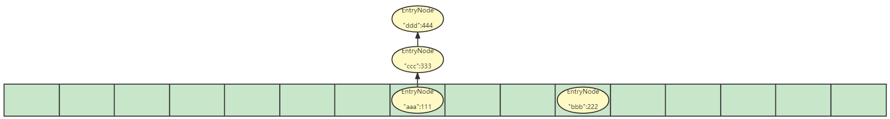

------

④向HashMap添加第五个元素

- `map.put("ddd",555);`假设第五个元素与第一个元素在数组中的位置相同

```java
//Node就是数组内链表部分
static class Node<K,V> implements Map.Entry<K,V> {
    final int hash;	//键的哈希值
    final K key;	//键
    V value;	//值
    Node<K,V> next;	//下一个节点
}
transient Node<K,V>[] table;//保存Entry对象的数组
transient int size;//哈希表中的元素个数
int threshold;//哈希表的扩容时机，值就是数组长度*0.75，赋值在resize()中完成
static final int TREEIFY_THRESHOLD = 8;

final V putVal(int hash, K key, V value, boolean onlyIfAbsent, boolean evict) {
    Node<K,V>[] tab;//定义局部变量用来记录哈希表中数组的地址值 
    Node<K,V> p;//临时变量
    int n, i;//n表示数组长度，i表示索引
    
    //若哈希表数组为空 或 哈希表数组长度为0，则初始化数组或扩容	==此时第五次添加元素tab!=null且n!=0，不进入if
    if ((tab = table) == null || (n = tab.length) == 0)
        n = (tab = resize()).length;

    //若当前元素需要插入的位置为空，则直接插入	==假设第五个元素与第一个元素在数组中的位置相同，那么此时p=第一个元素!=null，所以进入else
    if ((p = tab[i = (n - 1) & hash]) == null)
        //创建Node节点，然后将该Node节点添加到数组
        tab[i] = newNode(hash, key, value, null);
    else {
        //当前元素需要插入的位置不为空
        
        Node<K,V> e; K k;
        //若插入点已存在元素的哈希值等于当前元素哈希值 && (二者键地址值相同 || 键的值相同)，表示键重复，进入if令e等于当前插入点已经存在的元素	==第五个元素键与p不相同，不会进入该if
        if (p.hash == hash && ((k = p.key) == key || (key != null && key.equals(k))))
            e = p;
        else if (p instanceof TreeNode)//TreeNode是红黑树的实现，判断当前数组中存的是不是红黑树，若是则将将该元素添加到红黑树	==第五个节点添加时不属于该情况，所以不进入该else-if
            e = ((TreeNode<K,V>)p).putTreeVal(this, tab, hash, key, value);
        else {//通过拉链法向链表尾部添加元素	==添加第五个元素时属于该情况，进入该else
            for (int binCount = 0; ; ++binCount) {
                //将p的下一个节点赋值给e，其实就是令p移动到链表尾元素位置	==添加第五个元素时存在一个键重复的元素，不会进入该if
                if ((e = p.next) == null) {
                    p.next = newNode(hash, key, value, null);
                    if (binCount >= TREEIFY_THRESHOLD - 1)
                        treeifyBin(tab, hash);
                    break;
                }
                
                //每次移动链表中的一个元素，判断与当前元素的键是否重复，重复则不添加元素到链表，直接跳出循环，此时e为链表中与当前元素重复的元素	==添加第五个元素时会存在重复的情况，进入该if跳出循环，此时e就是链表中与当前元素重复的元素
                if (e.hash == hash &&
                    ((k = e.key) == key || (key != null && key.equals(k))))
                    break;

                //p指针向后移动，继续判断
                p = e;
            }
        }

        //若e为空表示，若e不为null表示当前元素与数组存的元素键重复或与红黑树中某元素键重复或与链表中某元素键重复，不管哪种情况，只要e!=null则e的值表示已存在的重复的元素，e表示需要被覆盖的元素	==第五个元素e!=null，不进入if
        if (e != null) {
            V oldValue = e.value;//要被覆盖的元素的值	==此时是444
            //onlyIfAbsent是传入的参数，若需要被覆盖则进入if	==传递的参数是false，进入该if
            if (!onlyIfAbsent || oldValue == null)
                e.value = value;//e的值替换成新值	==被替换成555
            afterNodeAccess(e);
            return oldValue;//将旧的值返回，结束方法	==返回444

            //通过读这一段源码，我们直到其实不是将老的键值对直接替换，而是修改老的键值对中的值而已
        }
    }
    ++modCount;//先不管
    
    //若实际元素个数大于扩容时机，则需要扩容
    if (++size > threshold)
        resize();
    
    //与LinkedHashMap相关，先不管
    afterNodeInsertion(evict);
    
    return null;
}
//添加第五个元素的putVal()完毕，请看最后的小结部分
```

* 小结：添加第五个元素时我们解决第二种情况，即**元素位置不为`null`且键重复，则元素覆盖**，注意覆盖的其实是值。添加五个元素过后的哈希表如图

  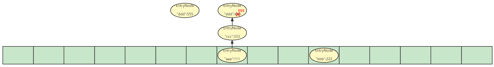

------

⑤以上其实还有两个方法没有提及，即向红黑树中添加元素和链表转红黑树，此处放出源码，暂时先不学习

```java
static final class TreeNode<K,V> extends LinkedHashMap.Entry<K,V> {
    TreeNode<K,V> parent;	//父节点
    TreeNode<K,V> left;	//左子节点
    TreeNode<K,V> right;	//右子节点
    TreeNode<K,V> prev;	//needed to unlink next upon deletion
    boolean red;	//节点的颜色，true表示红色
    //继承Node，所以还存了哈希值，键和值
}

final TreeNode<K,V> putTreeVal(HashMap<K,V> map, Node<K,V>[] tab,
                               int h, K k, V v) {
    Class<?> kc = null;
    boolean searched = false;
    TreeNode<K,V> root = (parent != null) ? root() : this;
    for (TreeNode<K,V> p = root;;) {
        int dir, ph; K pk;
        if ((ph = p.hash) > h)
            dir = -1;
        else if (ph < h)
            dir = 1;
        else if ((pk = p.key) == k || (k != null && k.equals(pk)))
            return p;
        else if ((kc == null &&
                  (kc = comparableClassFor(k)) == null) ||
                 (dir = compareComparables(kc, k, pk)) == 0) {
            if (!searched) {
                TreeNode<K,V> q, ch;
                searched = true;
                if (((ch = p.left) != null &&
                     (q = ch.find(h, k, kc)) != null) ||
                    ((ch = p.right) != null &&
                     (q = ch.find(h, k, kc)) != null))
                    return q;
            }
            dir = tieBreakOrder(k, pk);
        }

        TreeNode<K,V> xp = p;
        if ((p = (dir <= 0) ? p.left : p.right) == null) {
            Node<K,V> xpn = xp.next;
            TreeNode<K,V> x = map.newTreeNode(h, k, v, xpn);
            if (dir <= 0)
                xp.left = x;
            else
                xp.right = x;
            xp.next = x;
            x.parent = x.prev = xp;
            if (xpn != null)
                ((TreeNode<K,V>)xpn).prev = x;
            moveRootToFront(tab, balanceInsertion(root, x));
            return null;
        }
    }
}
```

```java
final void treeifyBin(Node<K,V>[] tab, int hash) {
    int n, index; Node<K,V> e;
    if (tab == null || (n = tab.length) < MIN_TREEIFY_CAPACITY)
        resize();
    else if ((e = tab[index = (n - 1) & hash]) != null) {
        TreeNode<K,V> hd = null, tl = null;
        do {
            TreeNode<K,V> p = replacementTreeNode(e, null);
            if (tl == null)
                hd = p;
            else {
                p.prev = tl;
                tl.next = p;
            }
            tl = p;
        } while ((e = e.next) != null);
        if ((tab[index] = hd) != null)
            hd.treeify(tab);
    }
}
```

### 4.LinkedHashMap集合

不需要学习新增的方法，LinkedHashSet的底层实际就是LinkedHashMap，看源码可知，所以其特点为**有序**、不重复、无索引，其中有序**只是在哈希表的基础上又新增了双链表机制记录存储的顺序**，在遍历时实际上遍历的是双向链表


### 5.TreeMap集合

#### 5.1.TreeMap特点

TreeMap的特点是**可排序**、不重复、无索引，排序规则如下

- 对于包装类，默认从小到大排序
- 对于字符串，默认从第一个字符开始比较ASCII表相应的值
- 对于自定义的类，需要实现Comparable接口，重写`compareTo()`实现排序规则

TreeMap的底层原理和TreeSet相同，底层基于**红黑树**实现排序，增删改查性能都比较好

> HashTable和Properties中存在IO相关知识，可学习完IO后再来看该部分

#### 5.2.TreeMap源码


