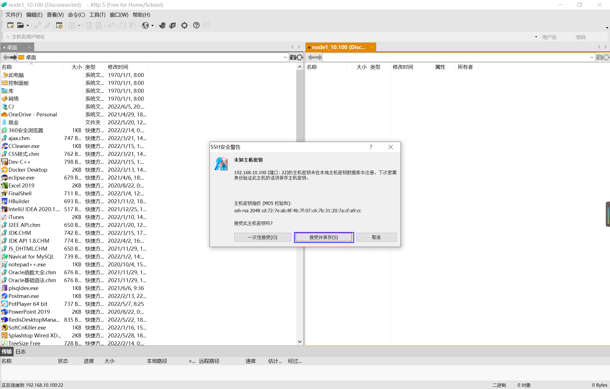

# CentOS安装与配置

前提需要先安装好Vmware，然后下载[CentOS7](https://pan.baidu.com/share/init?surl=W5OsfNnXyEEc_t6Styq2ww)，提取码5l27

## 一、创建虚拟机


## 二、打开终端

也可以切换成[命令行界面](https://blog.csdn.net/zhangyingchengqi/article/details/103559276)，命令行效率会更高，不切也没关系


## 三、配置虚拟机启用网卡，并设置固定IP地址

### 1.配置原理

配置为固定IP后，不管什么情况下不受虚拟机影响，只要笔记本主机可以正常上网，那么启动虚拟机中的CentOS 7系统就可以正常访问外网，无需再进行任何设置


### 2.设置虚拟机IP

①设置虚拟机的网络连接方式


②这一步部分计算机不需要设置

  

③修改子网IP，实现自由设定固定IP，**1网段无法成功(第三位IP段)**


### 3.配置笔记本主机具体VMnet8本地地址参数


### 4.修改虚拟机中的CentOS7系统为固定IP的配置文件

①输入`su root`指令切换到root用户

②ifcfg-ens33是虚拟机的网卡，配置连接VMnet8的网关，通过网关连接主机的网卡


```java
cd /etc/sysconfig/network-scripts
vim ifcfg-ens33	//i编辑，esc退出编辑，:wq退出保存
	DNS1=114.114.114.114
	IPADDR=192.168.10.100
	NETMASK=255.255.255.0
	GATEWAY=192.168.10.2                    
service network restart
```

### 5.检验配置是否成功

①查看修改后的固定IP


②测试虚拟机中的CentOS 7系统是否能连外网


③测试本机是否能ping通虚拟机的固定IP


## 四、修改主机名


## 五、在CentOS中安装sftp服务

**sftp安全文件传送协议**是传输文件的安全网络加密方法，为了上传文件到虚拟机系统

①确认已安装好ssh服务


②配置sftp


```java
Match Group sftp
ChrootDirectory /usr/sftp
ForceCommand internal-sftp
AllowTcpForwarding no
X11Forwarding no
```

## 六、远程连接检测是否配置成功





## 七、关闭防火墙

取消开机自启动防火墙`systemctl disable firewalld.service`

查看防火墙状态`systemctl status firewalld`


